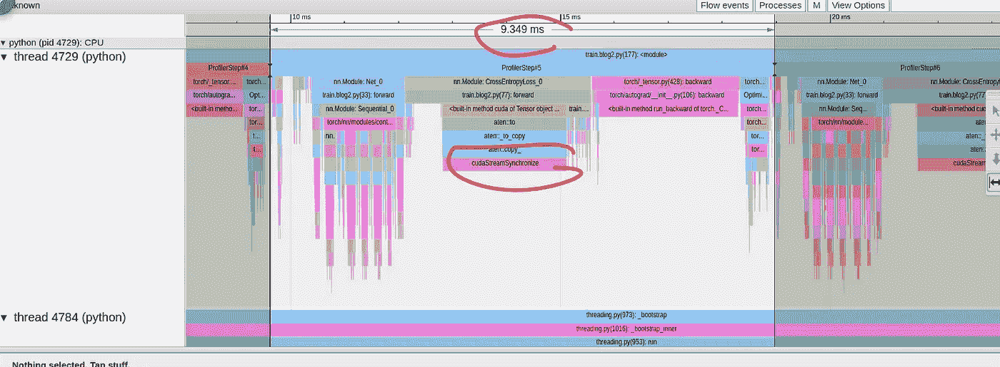

# PyTorch 模型性能分析与优化——第二部分

> 原文：[`towardsdatascience.com/pytorch-model-performance-analysis-and-optimization-part-2-3bc241be91?source=collection_archive---------4-----------------------#2023-06-19`](https://towardsdatascience.com/pytorch-model-performance-analysis-and-optimization-part-2-3bc241be91?source=collection_archive---------4-----------------------#2023-06-19)

## 如何使用 PyTorch Profiler 和 TensorBoard 识别和减少训练步骤中的 CPU 计算

[](https://chaimrand.medium.com/?source=post_page-----3bc241be91--------------------------------)[](https://towardsdatascience.com/?source=post_page-----3bc241be91--------------------------------) [Chaim Rand](https://chaimrand.medium.com/?source=post_page-----3bc241be91--------------------------------)

·

[关注](https://medium.com/m/signin?actionUrl=https%3A%2F%2Fmedium.com%2F_%2Fsubscribe%2Fuser%2F9440b37e27fe&operation=register&redirect=https%3A%2F%2Ftowardsdatascience.com%2Fpytorch-model-performance-analysis-and-optimization-part-2-3bc241be91&user=Chaim+Rand&userId=9440b37e27fe&source=post_page-9440b37e27fe----3bc241be91---------------------post_header-----------) 发表在 [Towards Data Science](https://towardsdatascience.com/?source=post_page-----3bc241be91--------------------------------) ·15 分钟阅读·2023 年 6 月 19 日[](https://medium.com/m/signin?actionUrl=https%3A%2F%2Fmedium.com%2F_%2Fvote%2Ftowards-data-science%2F3bc241be91&operation=register&redirect=https%3A%2F%2Ftowardsdatascience.com%2Fpytorch-model-performance-analysis-and-optimization-part-2-3bc241be91&user=Chaim+Rand&userId=9440b37e27fe&source=-----3bc241be91---------------------clap_footer-----------)

--

[](https://medium.com/m/signin?actionUrl=https%3A%2F%2Fmedium.com%2F_%2Fbookmark%2Fp%2F3bc241be91&operation=register&redirect=https%3A%2F%2Ftowardsdatascience.com%2Fpytorch-model-performance-analysis-and-optimization-part-2-3bc241be91&source=-----3bc241be91---------------------bookmark_footer-----------)

图片由 [Denise Chan](https://unsplash.com/@denmychan?utm_source=medium&utm_medium=referral) 提供，来自 [Unsplash](https://unsplash.com/?utm_source=medium&utm_medium=referral)

这是关于分析和优化在 GPU 上运行的 PyTorch 模型系列帖子的第二部分。在我们的[第一篇文章](https://medium.com/@chaimrand/pytorch-model-performance-analysis-and-optimization-10c3c5822869)中，我们展示了使用[PyTorch Profiler](https://pytorch.org/tutorials/recipes/recipes/profiler_recipe.html)和[TensorBoard](https://pytorch.org/tutorials/intermediate/tensorboard_profiler_tutorial.html)迭代分析和优化 PyTorch 模型的过程——以及*显著*的潜力。在这篇文章中，我们将重点关注由于使用急切执行而在 PyTorch 中尤其普遍的一种特定性能问题：模型执行的某些部分依赖于 CPU。识别这些问题的存在和来源可能非常困难，并且通常需要使用专用的性能分析工具。在这篇文章中，我们将分享一些在使用[PyTorch Profiler](https://pytorch.org/tutorials/recipes/recipes/profiler_recipe.html)和[PyTorch Profiler TensorBoard 插件](https://pytorch.org/tutorials/intermediate/tensorboard_profiler_tutorial.html)时识别此类性能问题的技巧。

## **急切执行的利与弊**

PyTorch 的主要吸引力之一是其急切执行模式。在急切模式下，每个 PyTorch 操作在到达时都会立即独立执行。这与图形模式相对，在图形模式中，整个模型会被预先编译成一个单一的图形，以适合在 GPU 上运行，并作为一个整体执行。通常，这种预编译会带来更好的性能（例如，见[这里](https://medium.com/towards-data-science/tips-and-tricks-for-upgrading-to-pytorch-2-3127db1d1f3d)）。在急切模式下，编程上下文在每个操作后返回到应用程序，从而允许我们访问和评估任意张量。这使得构建、分析和调试机器学习模型变得更加容易。另一方面，这也使得我们的模型更容易受到（有时是偶然的）低效代码块的插入。正如我们将展示的那样，知道如何识别和修复这些代码块可以对模型的速度产生显著影响。

# 玩具示例

在接下来的代码块中，我们介绍了用于演示的玩具示例。代码是非常宽松地基于我们[之前的文章](https://medium.com/@chaimrand/pytorch-model-performance-analysis-and-optimization-10c3c5822869)和[这个 PyTorch 教程](https://pytorch.org/tutorials/beginner/nn_tutorial.html)中定义的损失函数。

我们从定义一个简单的图像块分类模型开始。其架构对于本篇文章并不重要。

```py
from math import log2
import torch
import torch.nn as nn
import torch.nn.functional as F
import torch.optim
import torch.profiler
import torch.utils.data
import torchvision.transforms as T
from torchvision.datasets.vision import VisionDataset
import numpy as np
from PIL import Image

img_size = 32
num_classes = 8192
hidden_size = 50

# simple patch classification model
class Net(nn.Module):
    def __init__(self, img_size=img_size,
                 hidden_size=hidden_size,
                 num_classes=num_classes):
        super().__init__()
        self.conv_in = nn.Conv2d(3, hidden_size, 3, padding='same')
        num_hidden = int(log2(img_size))
        hidden = []
        for i in range(num_hidden):
            hidden.append(nn.Conv2d(hidden_size, hidden_size, 3, padding='same'))
            hidden.append(nn.ReLU())
            hidden.append(nn.MaxPool2d(2))
        self.hidden = nn.Sequential(*hidden)
        self.conv_out = nn.Conv2d(hidden_size, num_classes, 3, padding='same')

    def forward(self, x):
        x = F.relu(self.conv_in(x))
        x = self.hidden(x)
        x = self.conv_out(x)
        x = torch.flatten(x, 1)
        return x
```

接下来，我们定义一个相当标准的交叉熵损失函数。这个损失函数将是我们讨论的主要焦点。

```py
def log_softmax(x):
    return x - x.exp().sum(-1).log().unsqueeze(-1)

def weighted_nll(pred, target, weight):
    assert target.max() < num_classes
    nll = -pred[range(target.shape[0]), target]
    nll = nll * weight[target]
    nll = nll / weight[target].sum()
    sum_nll = nll.sum()
    return sum_nll

# custom loss definition
class CrossEntropyLoss(nn.Module):
    def forward(self, input, target):
        pred = log_softmax(input)
        loss = weighted_nll(pred, target, torch.Tensor([0.1] * num_classes).cuda())
        return loss
```

最后，我们定义数据集和训练循环：

```py
# dataset with random patches of size 32x32
class FakePatches(VisionDataset):
    def __init__(self, transform):
        super().__init__(root=None, transform=transform)
        self.data = np.random.randint(low=0,high=256,size=(10000,32,32,3),dtype=np.uint8)
        self.targets = np.random.randint(low=0,high=num_classes,size=(10000),dtype=np.uint16).tolist()

    def __getitem__(self, index):
        img, target = self.data[index], self.targets[index]
        img = Image.fromarray(img)
        if self.transform is not None:
            img = self.transform(img)
        return img, target

    def __len__(self) -> int:
        return len(self.data)

transform = T.Compose([T.PILToTensor()])

train_set = FakePatches(transform=transform)
train_loader = torch.utils.data.DataLoader(train_set, batch_size=128,
                               shuffle=True, num_workers=8, pin_memory=True)

device = torch.device("cuda:0")
model = Net().cuda(device)
criterion = CrossEntropyLoss().cuda(device)
optimizer = torch.optim.SGD(model.parameters(), lr=0.001, momentum=0.9)
model.train()

# training loop wrapped with profiler object
with torch.profiler.profile(
        schedule=torch.profiler.schedule(wait=1, warmup=4, active=3, repeat=1),
        on_trace_ready=torch.profiler.tensorboard_trace_handler(’./log/example’),
        record_shapes=True,
        profile_memory=True,
        with_stack=True
) as prof:
    for step, data in enumerate(train_loader):
        inputs = data[0].to(device=device, non_blocking=True)
        labels = data[1].to(device=device, non_blocking=True)
        inputs = (inputs.to(torch.float32) / 255\. - 0.5) / 0.5
        if step >= (1 + 4 + 3) * 1:
            break
        outputs = model(inputs)
        loss = criterion(outputs, labels)
        optimizer.zero_grad(set_to_none=True)
        loss.backward()
        optimizer.step()
        prof.step()
```

一个经验丰富的 PyTorch 开发者可能已经注意到，我们的示例中在损失函数中包含了一些低效的代码行。同时，代码中没有*明显*的问题，这种类型的低效并不罕见。如果你想测试你的 PyTorch 熟练度，请尝试在继续阅读之前找出我们交叉熵损失实现中的三个问题。在接下来的部分中，我们将假设我们*未能*自行找到这些问题，并展示如何使用 PyTorch Profiler 及其相关的 TensorBoard 插件来识别它们。

正如我们在[上一篇文章](https://medium.com/@chaimrand/pytorch-model-performance-analysis-and-optimization-10c3c5822869)中所述，我们将迭代地运行实验，识别性能问题，并尝试修复它们。我们将在[Amazon EC2 g5.2xlarge](https://aws.amazon.com/ec2/instance-types/g5/) 实例（包含 NVIDIA A10G GPU 和 8 个虚拟 CPU）上运行实验，并使用官方的[AWS PyTorch 2.0 Docker 镜像](https://github.com/aws/deep-learning-containers)。我们选择的训练环境有些随意，不应**被视为对其任何组件的认可**。

在这篇文章中，我们将重点关注 PyTorch Profiler 报告中的跟踪视图部分。有关如何使用报告的其他视图的示例，请参见我们的上一篇文章。正如我们在上一篇文章中强调的那样，虽然 PyTorch 默认的[异步执行](https://pytorch.org/docs/stable/notes/cuda.html#asynchronous-execution)可以提高性能，但它也可能降低时间测量的准确性。为了我们博客的目的，我们将依赖于 PyTorch Profiler 报告的步骤时间。对于一些实验，我们将引入人工同步事件以强制主机和设备对齐。

## 初步性能结果

在下图中，我们展示了上述脚本的跟踪视图结果：



基线模型的跟踪视图（由作者捕获）

如上所述，训练步骤大约需要 9.35 毫秒，其中**大约三分之一的时间花在交叉熵损失的前向传递上**！这清楚地表明存在问题。我们的损失函数相对于模型包含的计算较少，绝不应占据如此大比例的步骤时间。仔细查看调用栈，我们可以看到一些函数调用加强了我们的怀疑，包括“to”、“copy_”和“cudaStreamSynchronize”。这种组合通常表明数据正在从 CPU 复制到 GPU——这不是我们希望在损失计算中间发生的事情。

我们现在知道损失函数中存在性能问题，而且很可能与将张量从主机复制到 GPU 有关。然而，这可能不足以识别导致问题的确切代码行。为了便于搜索，我们将使用带标签的 [torch.profiler.record_function](https://pytorch.org/tutorials/beginner/profiler.html#performance-debugging-using-profiler) 上下文管理器包装每一行代码，并重新运行性能分析。

```py
# custom loss definition
class CrossEntropyLoss(nn.Module):
    def forward(self, input, target):
        with torch.profiler.record_function('log_softmax'):
            pred = log_softmax(input)
        with torch.profiler.record_function('define_weights'):
            weights = torch.Tensor([0.1]*num_classes).cuda()
        with torch.profiler.record_function('weighted_nll'):
            loss = weighted_nll(pred, target, weights)
        return loss
```

标签的添加帮助我们识别出*weight*定义，或更准确地说，是将权重复制到 GPU 的代码行作为问题代码。


权重定义的性能问题，如追踪视图中所示（由作者捕获）

在当前定义的损失函数中，我们在每个训练步骤中都将权重向量复制到 GPU 上。由于我们的权重向量是常量，这似乎非常浪费。

## 优化 #1：从训练步骤中移除多余的主机到 GPU 的拷贝

一旦我们识别出第一个问题，修复它相当简单。在下面的代码块中，我们在损失*init*函数中仅将权重向量复制到 GPU 一次：

```py
class CrossEntropyLoss(nn.Module):
    def __init__(self):
        super().__init__()
        self.weight = torch.Tensor([0.1]*num_classes).cuda()

    def forward(self, input, target):
        with torch.profiler.record_function('log_softmax'):
            pred = log_softmax(input)
        with torch.profiler.record_function('weighted_nll'):
            loss = weighted_nll(pred, target, self.weight)
        return loss
```

下图显示了修复后的性能分析结果：


优化 #1 后的追踪视图（由作者捕获）

尽管我们的步骤时间已降至 8.9 毫秒，但我们可以清楚地看到，我们有一个新的性能问题需要解决，这次出现在*weighted_nll*函数中。和之前一样，我们可以使用 [torch.profiler.record_function](https://pytorch.org/tutorials/beginner/profiler.html#performance-debugging-using-profiler) 来识别出问题代码行，即*assert*调用。

```py
def weighted_nll(pred, target, weight):
    with torch.profiler.record_function('assert'):
        assert target.max() < num_classes
    with torch.profiler.record_function('range'):
        r = range(target.shape[0])
    with torch.profiler.record_function('index'):
        nll = -pred[r, target]
    with torch.profiler.record_function('nll_calc'):
        nll = nll * weight[target]
        nll = nll/ weight[target].sum()
        sum_nll = nll.sum()
    return sum_nll
```

请注意，这个问题在基础实验中也存在，但被我们之前的性能问题掩盖了。在性能优化过程中，之前被其他问题掩盖的严重问题突然显现是很常见的。

对调用栈的更详细分析显示了对“item”、“_local_scalar_dense”和“cudaMemcpyAsync”的调用。这通常表明数据正在从 GPU 复制到主机。确实，我们的*assert*调用是在 CPU 上执行的，需要访问驻留在 GPU 上的*target*张量，从而引发了高效性低的数据拷贝。

## 优化 #2：从训练步骤中移除多余的 GPU 到主机的拷贝

虽然验证输入标签的合法性可能是必要的，但应该以不会对训练性能产生如此负面影响的方式进行。在我们的案例中，解决这个问题只是简单地将*assert*移动到数据输入管道中，在标签被复制到 GPU 之前。

**重要提示**：虽然我们的目标通常是尝试减少主机和 GPU 之间的拷贝，但有时这要么不可行（例如，如果我们需要 GPU 不支持的内核），要么不理想（例如，如果在 CPU 上运行特定内核会提高性能）。

在移除 *assert* 后，我们的步骤时间下降到 8.71 毫秒，新的性能问题浮现：


优化 #2 之后的跟踪视图（由作者捕获）

在 *weighted_nll* 中，*pred* 张量的索引由 *r* 和 *target* 张量定义。虽然 *target* 张量已经在 GPU 上，但在前一行中定义的 *r* 张量却没有。这再次触发了低效的主机到 GPU 数据拷贝。

## 优化 #3：用 [torch.arange](https://pytorch.org/docs/stable/generated/torch.arange.html) 替换 range

Python 的 *range* 函数在 CPU 上输出一个列表。在训练步骤中出现任何列表都应该引起警惕。在下面的代码块中，我们将 *range* 替换为 [torch.arange](https://pytorch.org/docs/stable/generated/torch.arange.html) 并将其配置为直接在 GPU 上创建输出张量：

```py
def weighted_nll(pred, target, weight):
    with torch.profiler.record_function('range'):
        r = torch.arange(target.shape[0], device="cuda:0")
    with torch.profiler.record_function('index'):
        nll = -pred[r, target]
    with torch.profiler.record_function('nll_calc'):
        nll = nll * weight[target]
        nll = nll/ weight[target].sum()
        sum_nll = nll.sum()
    return sum_nll
```

该优化的结果如下：


优化 #3 之后的跟踪视图（由作者捕获）

现在我们谈到的确实令人兴奋！！我们的步骤时间已经下降到 5.63 毫秒。但如果这对你来说好得不真实，那你是对的。最后的 profiler 步骤后出现的长同步事件表明 GPU 落后于 CPU，整体步骤时间稍高。为了获得更准确的读数，让我们在实验的其余部分中将一个人工同步事件附加到每个训练步骤的末尾：

```py
for step, data in enumerate(train_loader):
    inputs = data[0].to(device=device, non_blocking=True)
    labels = data[1].to(device=device, non_blocking=True)
    inputs = (inputs.to(torch.float32) / 255\. - 0.5) / 0.5
    if step >= (1 + 4 + 3) * 1:
        break
    outputs = model(inputs)
    loss = criterion(outputs, labels)
    optimizer.zero_grad(set_to_none=True)
    loss.backward()
    optimizer.step()
    torch.cuda.synchronize()
    prof.step()
```

添加人工同步事件后，我们新的 *基准* 步骤时间是十毫秒。

为了识别进一步的优化机会，让我们仔细查看 *weighted_nll* 函数的跟踪视图，该函数占据了大部分损失计算。


*weighted_nll 函数* 的跟踪视图（由作者捕获）

从跟踪中我们可以看到，这个函数由多个小块组成，每个小块最终被映射到一个单独的 CUDA 核心，通过*CudaLaunchKernel*调用加载到 GPU 上。理想情况下，我们希望减少 GPU 核心的总数。这不仅会减少 CPU 和 GPU 之间的交互，还可能减少 GPU 操作的总数。实现这一目标的一种方法是，尽可能优先使用更高层次的 PyTorch 操作符，如 [torch.nn.NLLLoss](https://pytorch.org/docs/stable/generated/torch.nn.NLLLoss.html#torch.nn.NLLLoss)。这些函数被假定为“融合”底层操作，从而减少整体核心的数量。

## 优化 #4：用 [torch.nn.NLLLoss](https://pytorch.org/docs/stable/generated/torch.nn.NLLLoss.html#torch.nn.NLLLoss) 替换自定义的 NLL

下面的代码块包含我们更新后的损失定义，现在使用 [torch.nn.NLLLoss](https://pytorch.org/docs/stable/generated/torch.nn.NLLLoss.html#torch.nn.NLLLoss)。

```py
class CrossEntropyLoss(nn.Module):
    def __init__(self):
        super().__init__()
        self.weight = torch.Tensor([0.1]*num_classes).cuda()

    def forward(self, input, target):
        pred = log_softmax(input)
        nll = torch.nn.NLLLoss(self.weight)
        loss = nll(pred, target)
        return loss
```

在这里，我们擅自引入了另一个常见的错误，并将继续进行演示。

使用更高层次的函数进一步将我们的步骤时间缩短到 9 毫秒。


优化后的跟踪视图 #4（作者拍摄）

然而，放大损失函数后，我们可以看到大量时间现在花在*初始化* [torch.nn.NLLLoss](https://pytorch.org/docs/stable/generated/torch.nn.NLLLoss.html#torch.nn.NLLLoss) 对象上！


优化后的损失函数跟踪视图 #4（作者拍摄）

回顾我们的损失函数，我们可以看到在每次训练步骤中我们都会初始化一个新的 [NLLLoss](https://pytorch.org/docs/stable/generated/torch.nn.NLLLoss.html#torch.nn.NLLLoss) 对象！自然地，对象初始化发生在 CPU 上，尽管（在我们的情况下）它相对较快，但这是我们希望在训练步骤中避免的。

## 优化 #5：避免在训练步骤中初始化对象

在下面的代码块中，我们修改了我们的损失实现，使得在*init*函数中只创建一个 [torch.nn.NLLLoss](https://pytorch.org/docs/stable/generated/torch.nn.NLLLoss.html#torch.nn.NLLLoss) 实例。

```py
class CrossEntropyLoss(nn.Module):
    def __init__(self):
        super().__init__()
        self.weight = torch.Tensor([0.1]*num_classes).cuda()
        self.nll = torch.nn.NLLLoss(self.weight) 

    def forward(self, input, target):
        pred = log_softmax(input)
        loss = self.nll(pred, target)
        return loss
```

结果显示出额外的适度改进。


优化后的跟踪视图 #5（作者拍摄）

## 优化 #6：使用 [torch.nn.CrossEntropyLoss](https://pytorch.org/docs/stable/generated/torch.nn.CrossEntropyLoss.html#torch.nn.CrossEntropyLoss) 替代自定义损失

PyTorch 包含一个内置的 [torch.nn.CrossEntropyLoss](https://pytorch.org/docs/stable/generated/torch.nn.CrossEntropyLoss.html#torch.nn.CrossEntropyLoss)，我们现在评估并与我们自定义的损失实现进行比较。

```py
criterion = torch.nn.CrossEntropyLoss().cuda(device)
```

结果步骤时间降至新的低点 8.5 毫秒，如下所示：


优化后的 Trace View #6（作者捕获）

## 优化 #7：编译损失函数

对于我们的最终优化尝试，我们将配置损失函数在图形模式下运行，使用 [torch.compile](https://pytorch.org/docs/stable/generated/torch.compile.html) API。正如我们在 这篇之前的帖子 中详细讨论并在 [这篇文章的前篇](https://medium.com/@chaimrand/pytorch-model-performance-analysis-and-optimization-10c3c5822869) 中演示的那样，torch.compile 将使用 *内核融合* 和 *乱序执行* 等技术，将损失函数映射到最适合底层训练加速器的低级计算内核中。

```py
criterion = torch.compile(torch.nn.CrossEntropyLoss().cuda(device))
```

下图显示了该实验的 Trace View 结果，随后是损失函数的放大图。


模型编译后的 Trace View（作者捕获）


模型编译后的损失函数 Trace View（作者捕获）

我们首先看到的是包含“OptimizedModule”和“dynamo”的术语，这些术语表明使用了 torch.compile。我们还可以看到，实际上，模型编译并未减少损失函数加载的内核数量，这意味着它没有识别出额外内核融合的机会。事实上，在我们的案例中，损失编译实际上导致了损失函数前向传递时间的轻微增加。看来，[CrossEntropyLoss](https://pytorch.org/docs/stable/generated/torch.nn.CrossEntropyLoss.html#torch.nn.CrossEntropyLoss) 不够有“实质”以从这种优化中受益。

你可能会想，为什么我们不能直接将 torch 编译应用于我们的初始损失函数，并依赖它以最佳方式编译我们的代码。这可以省去我们上述描述的逐步优化的麻烦。这个方法的问题在于，尽管 PyTorch 2.0 编译（截至本文撰写时）确实优化了某些类型的 GPU 到 CPU 的交叉，但某些类型会导致图形编译崩溃，其他类型会导致创建多个小图而不是一个大图。最后一种情况会导致 [*图形断裂*](https://pytorch.org/docs/stable/dynamo/troubleshooting.html#graph-breaks)，这本质上限制了 torch.compile 功能提升性能的能力。（一种解决方法是调用 torch.compile 时将 *fullgraph* 标志设置为 *True*。）有关使用此选项的更多详细信息，请参见 我们之前的帖子。

# 结论

在本文中，我们展示了发现和解决一些性能问题的过程。尽管应用人工同步事件后，我们的玩具模型的训练速度增加了相对较少的百分比（约 15%），但我们展示的优化潜在影响可能非常显著。

请记住，我们最初使用的损失函数看起来相当简单。如果没有对我们应用程序行为进行深入分析，我们可能永远不会意识到其中存在问题。

让我们总结一些我们所学到的东西。我们将总结分为两部分。在第一部分中，我们描述了一些可能影响训练性能的编码习惯。在第二部分中，我们推荐了一些性能分析的技巧。请注意，这些结论基于我们在本文中分享的示例，可能不适用于您自己的用例。机器学习模型在属性和行为上有很大的差异。因此，强烈建议您根据您自己项目的细节来评估这些结论。

## 编码提示

您实现模型前向传播的方式可能会显著影响其性能。这里我们仅列出了一些基于我们在本文中涵盖的示例的建议。

1.  避免在前向传播中初始化常量张量，应在构造函数中进行初始化。

1.  避免在前向传播中对驻留在 GPU 上的张量使用*asserts*。可以将它们移动到数据输入管道，并/或者检查 PyTorch 是否有任何用于执行所需数据验证的内置方法。

1.  避免使用列表。检查是否可以使用 torch.arange 直接在设备上创建张量作为更好的替代方案。

1.  使用 PyTorch 操作符，如[torch.nn.NLLLoss](https://pytorch.org/docs/stable/generated/torch.nn.NLLLoss.html#torch.nn.NLLLoss)和[torch.nn.CrossEntropyLoss](https://pytorch.org/docs/stable/generated/torch.nn.CrossEntropyLoss.html#torch.nn.CrossEntropyLoss)，而不是创建自己的损失实现。

1.  避免在前向传播中初始化对象，应在构造函数中进行初始化。

1.  在相关情况下考虑使用 torch.compile。

## 性能分析提示

正如我们展示的那样，Tensorboard PyTorch Profiler 插件的 Trace View 对于识别我们模型中的性能问题至关重要。以下是我们示例中的一些主要收获总结：

1.  高 GPU 利用率并不一定意味着您的代码运行良好。

1.  注意代码中可能超出预期时间的部分。

1.  使用[torch.profiler.record_function](https://pytorch.org/tutorials/beginner/profiler.html#performance-debugging-using-profiler)来准确定位性能问题。

1.  GPU 利用率的下降并不一定与性能问题的源对齐。

1.  注意防止从主机到 GPU 的意外数据复制。通常通过“to”、“copy_”和“cudaStreamSynchronize”调用来识别这些操作，您可以在 Trace View 中搜索这些调用。

1.  注意避免从 GPU 到主机的无意数据拷贝。这些通常通过“item”和“cudaStreamSynchronize”调用来识别，你可以在 Trace View 中搜索这些调用。

尽管我们的演示接近尾声，**我们的优化工作还没有完成**。请参见我们的[上一篇文章](https://chaimrand.medium.com/pytorch-model-performance-analysis-and-optimization-10c3c5822869)以获取下一步的建议。

# 摘要

在这篇文章中，我们重点讨论了训练应用程序中由于 CPU 和 GPU 在前向传播阶段之间的冗余交互而导致的性能问题。我们展示了如何使用性能分析工具，如 PyTorch Profiler 及其关联的 TensorBoard 插件，来识别这些问题并实现显著的性能提升。

与我们之前的文章一样，我们强调成功优化的路径会根据训练项目的细节，包括模型架构和训练环境，差异很大。在实践中，达到你的目标可能比我们这里展示的例子更为困难。我们描述的一些技术可能对你的性能影响甚微，甚至可能使其变差。我们还指出，我们选择的具体优化和应用它们的顺序是有些随意的。强烈建议你根据项目的具体细节开发自己的工具和技术以实现优化目标。

# 接下来做什么？

在我们关于 PyTorch 模型性能优化的第三篇文章中，我们讨论了如何识别和减少 cudaMemcpyAsync 事件以及为什么最好避免布尔掩码操作。我们也鼓励你查看我们在[Medium 上的其他文章](https://chaimrand.medium.com/)，其中许多文章涵盖了机器学习工作负载性能优化的不同方面。
