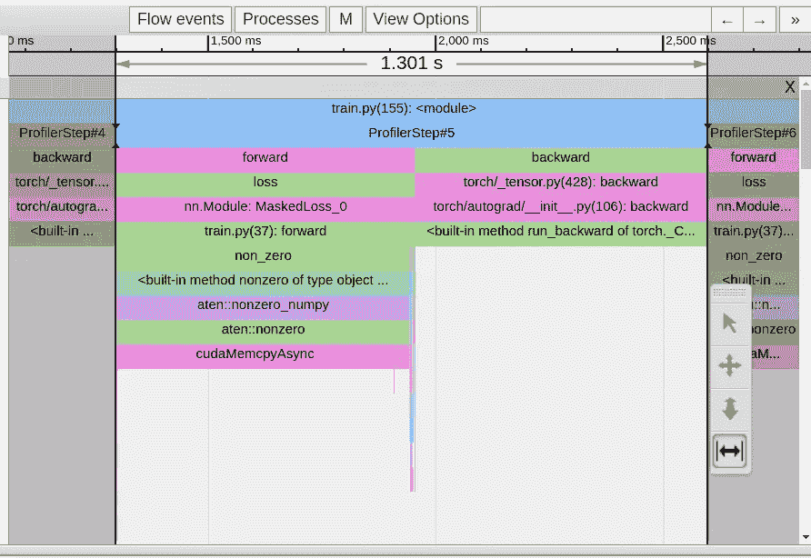
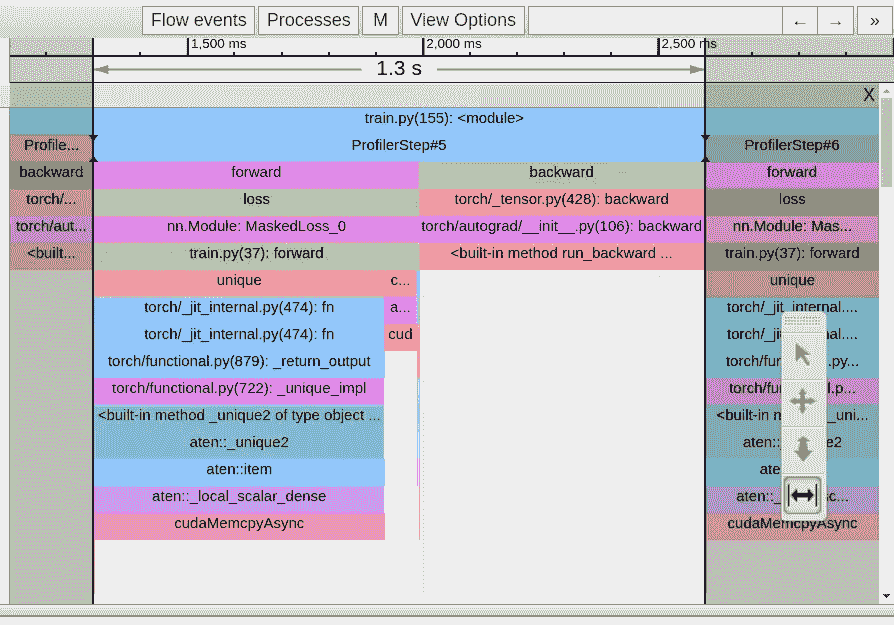
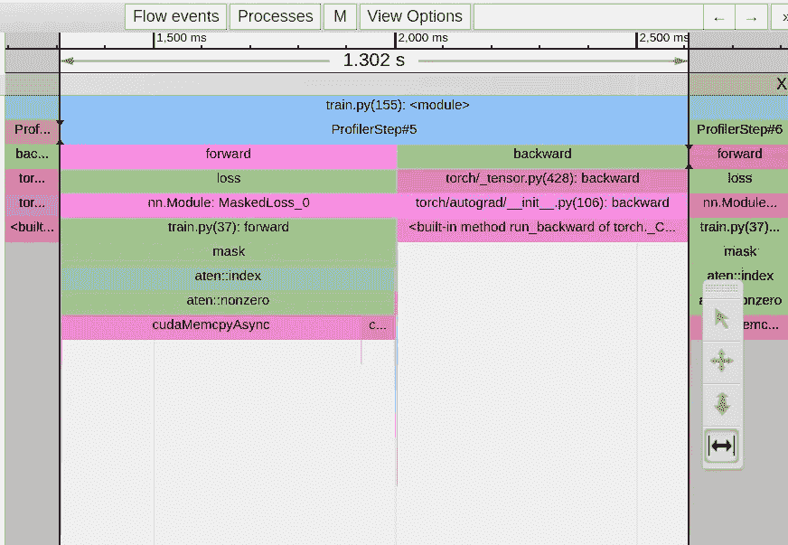
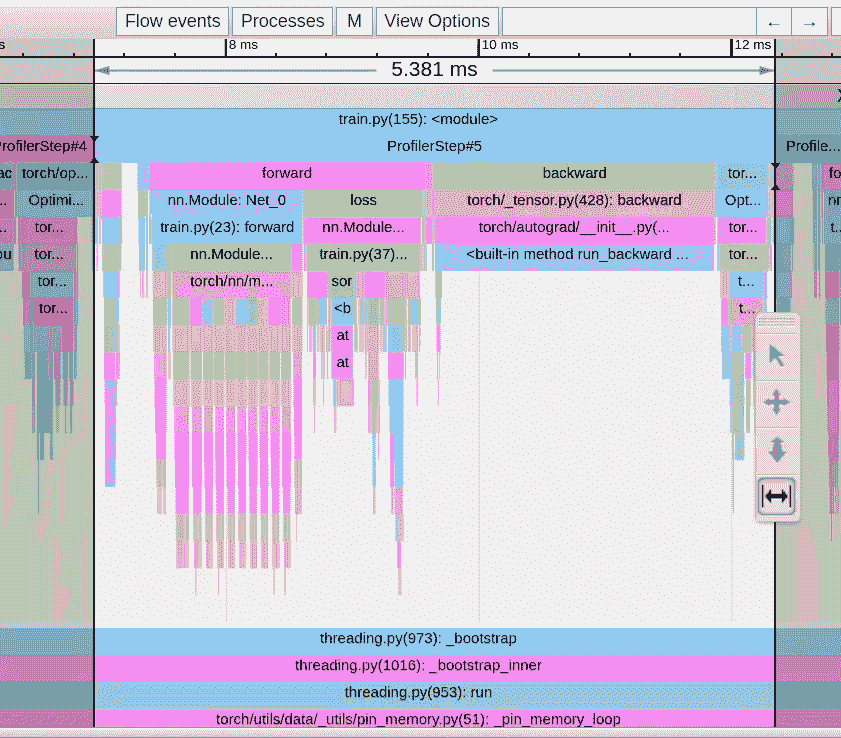

# PyTorch 模型性能分析与优化 — 第三部分

> 原文：[`towardsdatascience.com/pytorch-model-performance-analysis-and-optimization-part-3-1c5876d78fe2?source=collection_archive---------4-----------------------#2023-08-10`](https://towardsdatascience.com/pytorch-model-performance-analysis-and-optimization-part-3-1c5876d78fe2?source=collection_archive---------4-----------------------#2023-08-10)

## 如何减少“Cuda Memcpy Async”事件以及为什么你需要警惕布尔掩码操作

[](https://chaimrand.medium.com/?source=post_page-----1c5876d78fe2--------------------------------)[](https://towardsdatascience.com/?source=post_page-----1c5876d78fe2--------------------------------) [Chaim Rand](https://chaimrand.medium.com/?source=post_page-----1c5876d78fe2--------------------------------)

·

[关注](https://medium.com/m/signin?actionUrl=https%3A%2F%2Fmedium.com%2F_%2Fsubscribe%2Fuser%2F9440b37e27fe&operation=register&redirect=https%3A%2F%2Ftowardsdatascience.com%2Fpytorch-model-performance-analysis-and-optimization-part-3-1c5876d78fe2&user=Chaim+Rand&userId=9440b37e27fe&source=post_page-9440b37e27fe----1c5876d78fe2---------------------post_header-----------) 发表在 [Towards Data Science](https://towardsdatascience.com/?source=post_page-----1c5876d78fe2--------------------------------) ·11 分钟阅读·2023 年 8 月 10 日[](https://medium.com/m/signin?actionUrl=https%3A%2F%2Fmedium.com%2F_%2Fvote%2Ftowards-data-science%2F1c5876d78fe2&operation=register&redirect=https%3A%2F%2Ftowardsdatascience.com%2Fpytorch-model-performance-analysis-and-optimization-part-3-1c5876d78fe2&user=Chaim+Rand&userId=9440b37e27fe&source=-----1c5876d78fe2---------------------clap_footer-----------)

--

[](https://medium.com/m/signin?actionUrl=https%3A%2F%2Fmedium.com%2F_%2Fbookmark%2Fp%2F1c5876d78fe2&operation=register&redirect=https%3A%2F%2Ftowardsdatascience.com%2Fpytorch-model-performance-analysis-and-optimization-part-3-1c5876d78fe2&source=-----1c5876d78fe2---------------------bookmark_footer-----------)

图片由 [Braden Jarvis](https://unsplash.com/@jarvisphoto?utm_source=medium&utm_medium=referral) 提供，来源于 [Unsplash](https://unsplash.com/?utm_source=medium&utm_medium=referral)

这是关于使用 [PyTorch Profiler](https://pytorch.org/tutorials/recipes/recipes/profiler_recipe.html) 和 [TensorBoard](https://pytorch.org/tutorials/intermediate/tensorboard_profiler_tutorial.html) 分析和优化 PyTorch 模型的系列文章的第三部分。我们的意图是突出**性能分析和优化**在 GPU 训练负载中的好处及其对训练速度和成本的潜在影响。特别是，我们希望展示诸如 [PyTorch Profiler](https://pytorch.org/tutorials/recipes/recipes/profiler_recipe.html) 和 [TensorBoard](https://pytorch.org/tutorials/intermediate/tensorboard_profiler_tutorial.html) 等分析工具对所有 ML 开发者的可及性。**你不需要成为 CUDA 专家即可从我们讨论的技术中获得有意义的性能提升**。

在我们的 [第一篇文章](https://medium.com/@chaimrand/pytorch-model-performance-analysis-and-optimization-10c3c5822869) 中，我们演示了 [PyTorch Profiler TensorBoard 插件](https://pytorch.org/tutorials/intermediate/tensorboard_profiler_tutorial.html) 的不同*视图*如何用于识别性能问题，并回顾了几种加速训练的流行技术。在 第二篇文章 中，我们展示了 [TensorBoard 插件](https://pytorch.org/tutorials/intermediate/tensorboard_profiler_tutorial.html) *Trace View* 如何用于识别张量从 CPU 到 GPU 的拷贝以及反向拷贝的情况。这种数据移动——可能会导致同步点并显著降低训练速度——通常是无意的，有时可以很容易地避免。本篇文章的主题是我们遇到的 GPU 和 CPU 之间的同步点，这些同步点**不**与张量拷贝有关。与张量拷贝的情况一样，这些同步点可能会导致训练步骤的停滞，显著减慢整体训练时间。我们将展示此类情况的存在、如何使用 [PyTorch Profiler](https://pytorch.org/tutorials/recipes/recipes/profiler_recipe.html) 和 [PyTorch Profiler TensorBoard 插件](https://pytorch.org/tutorials/intermediate/tensorboard_profiler_tutorial.html) *Trace View* 进行识别，以及以最小化此类同步事件的方式构建模型的潜在性能收益。

就像我们之前的帖子一样，我们将定义一个玩具 PyTorch 模型，然后 *迭代地* 分析其性能，识别瓶颈，并尝试修复它们。我们将在一个 [Amazon EC2 g5.2xlarge](https://aws.amazon.com/ec2/instance-types/g5/) 实例上运行实验（该实例包含一个 NVIDIA A10G GPU 和 8 个 vCPU），并使用官方的 [AWS PyTorch 2.0 Docker 镜像](https://github.com/aws/deep-learning-containers)。请记住，我们描述的某些行为可能因 PyTorch 版本而异。

# 示例

在接下来的块中，我们引入一个玩具 PyTorch 模型，它对 256x256 的输入图像进行语义分割，即，它接收一个 256x256 的 RGB 图像，并输出一个来自十个语义类别的“每像素”标签的 256x256 图。

```py
import torch
import torch.nn as nn
import torch.nn.functional as F
import torch.optim
import torch.profiler
import torch.utils.data
from torch import Tensor

class Net(nn.Module):
    def __init__(self, num_hidden=10, num_classes=10):
        super().__init__()
        self.conv_in = nn.Conv2d(3, 10, 3, padding='same')
        hidden = []
        for i in range(num_hidden):
            hidden.append(nn.Conv2d(10, 10, 3, padding='same'))
            hidden.append(nn.ReLU())

        self.hidden = nn.Sequential(*hidden)
        self.conv_out = nn.Conv2d(10, num_classes, 3, padding='same')

    def forward(self, x):
        x = F.relu(self.conv_in(x))
        x = self.hidden(x)
        x = self.conv_out(x)
        return x
```

为了训练我们的模型，我们将使用标准的 [交叉熵损失](https://pytorch.org/docs/stable/generated/torch.nn.CrossEntropyLoss.html) 并做一些修改：

1.  我们假设目标标签包含一个 *ignore* 值，用于表示我们想从损失计算中排除的像素。

1.  我们假设其中一个语义标签将某些像素标识为图像的“背景”。我们将定义我们的损失函数将这些视为 *ignore* 标签。

1.  我们只会在遇到包含至少两个唯一值的目标张量的批次时更新模型权重。

尽管我们为演示目的选择了这些修改，但这类操作并不罕见，可以在许多“标准” PyTorch 模型中找到。由于我们已经是性能分析的“专家”，我们已经提前将损失函数中的每个操作都用 [torch.profiler.record_function](https://pytorch.org/tutorials/beginner/profiler.html#performance-debugging-using-profiler) 上下文管理器进行了封装，（如我们 第二篇帖子 中所述）。

```py
class MaskedLoss(nn.Module):
    def __init__(self, ignore_val=-1, num_classes=10):
        super().__init__()
        self.ignore_val = ignore_val
        self.num_classes = num_classes
        self.loss = torch.nn.CrossEntropyLoss()

    def cross_entropy(self, pred: Tensor, target: Tensor) -> Tensor:

        # create a boolean mask of valid labels
        with torch.profiler.record_function('create mask'):
            mask = target != self.ignore_val

        # permute the logits in preparation for masking
        with torch.profiler.record_function('permute'):
            permuted_pred = torch.permute(pred, [0, 2, 3, 1])

        # apply the boolean mask to the targets and logits
        with torch.profiler.record_function('mask'):
            masked_target = target[mask]
            masked_pred = permuted_pred[mask.unsqueeze(-1).expand(-1, -1, -1,
                                                             self.num_classes)]
            masked_pred = masked_pred.reshape(-1, self.num_classes)

        # calculate the cross-entropy loss
        with torch.profiler.record_function('calc loss'):
            loss = self.loss(masked_pred, masked_target)
        return loss

    def ignore_background(self, target: Tensor) -> Tensor:

        # discover all indices where target label is "background"
        with torch.profiler.record_function('non_zero'):
            inds = torch.nonzero(target == self.num_classes - 1, as_tuple=True)

        # reset all "background" labels to the ignore index
        with torch.profiler.record_function('index assignment'):
            target[inds] = self.ignore_val
        return target

    def forward(self, pred: Tensor, target: Tensor) -> Tensor:

        # ignore background labels
        target = self.ignore_background(target)

        # retrieve a list of unique elements in target
        with torch.profiler.record_function('unique'):
            unique = torch.unique(target)

        # check if the number of unique items pass the threshold
        with torch.profiler.record_function('numel'):
            ignore_loss = torch.numel(unique) < 2

        # calculate the cross-entropy loss
        loss = self.cross_entropy(pred, target)

        # zero the loss in the case that the number of unique elements
        # is below the threshold
        if ignore_loss:
            loss = 0\. * loss

        return loss
```

我们的损失函数看起来很无害，对吧？错！正如我们下面将看到的，损失函数包含了许多触发主机-设备同步事件的操作，这些操作会显著降低训练速度——这些操作不涉及将张量复制进出 GPU。就像我们之前的帖子一样，我们挑战你在继续阅读之前尝试识别出三个性能优化的机会。

出于演示目的，我们使用随机生成的图像和每像素标签图，如下所定义。

```py
from torch.utils.data import Dataset

# A dataset with random images and label maps
class FakeDataset(Dataset):
    def __init__(self, num_classes=10):
        super().__init__()
        self.num_classes = num_classes
        self.img_size = [256, 256]

    def __len__(self):
        return 1000000

    def __getitem__(self, index):
        rand_image = torch.randn([3]+self.img_size, dtype=torch.float32)
        rand_label = torch.randint(low=-1, high=self.num_classes, 
                                                 size=self.img_size)
        return rand_image, rand_label

train_set = FakeDataset()
train_loader = torch.utils.data.DataLoader(train_set, batch_size=256, 
                              shuffle=True, num_workers=8, pin_memory=True)
```

最后，我们使用 [PyTorch Profiler](https://pytorch.org/tutorials/recipes/recipes/profiler_recipe.html) 配置到我们的需求来定义训练步骤：

```py
device = torch.device("cuda:0")
model = Net().cuda(device)
criterion = MaskedLoss().cuda(device)

optimizer = torch.optim.SGD(model.parameters(), lr=0.001, momentum=0.9)
model.train()

# training loop wrapped with profiler object
with torch.profiler.profile(
        schedule=torch.profiler.schedule(wait=1, warmup=4, active=3, repeat=1),
        on_trace_ready=torch.profiler.tensorboard_trace_handler('/tmp/prof'),
        record_shapes=True,
        profile_memory=True,
        with_stack=True
) as prof:
    for step, data in enumerate(train_loader):
        inputs = data[0].to(device=device, non_blocking=True)
        labels = data[1].to(device=device, non_blocking=True)
        if step >= (1 + 4 + 3) * 1:
            break
        outputs = model(inputs)
        loss = criterion(outputs, labels)
        optimizer.zero_grad(set_to_none=True)
        loss.backward()
        optimizer.step()
        prof.step()
```

如果你直接运行这个训练脚本，你可能会看到高达 ~90% 的 GPU 使用率，却不知道其中存在任何问题。只有通过性能分析，我们才能识别出潜在的性能瓶颈和训练加速的机会。那么，话不多说，让我们看看模型的表现吧。

# 初步性能结果

在这篇文章中，我们将重点关注 [PyTorch Profiler TensorBoard 插件](https://pytorch.org/tutorials/intermediate/tensorboard_profiler_tutorial.html) 的 *跟踪视图*。请参见我们的 先前文章 获取有关如何使用插件支持的其他 *视图* 的提示。

在下图中，我们展示了玩具模型单次训练步骤的 *跟踪视图*。



基线模型的跟踪视图（作者捕获）

我们可以清楚地看到，我们 1.3 秒的训练步骤被 [torch.nonzero](https://pytorch.org/docs/stable/generated/torch.nonzero.html) 操作在损失函数的第一行中 *完全* 主导了。所有其他操作似乎都集中在巨大 *cudaMemcpyAsync* 事件的两侧。发生了什么？？!! 为什么这么一个看似无害的操作会造成如此大的困扰？

我们或许不应感到如此惊讶，因为 [torch.nonzero](https://pytorch.org/docs/stable/generated/torch.nonzero.html) 的文档确实包含了以下说明：“当 `input` 在 CUDA 上时，`[torch.nonzero()](https://pytorch.org/docs/stable/generated/torch.nonzero.html#torch.nonzero)` 会导致主机与设备的同步。” 需要同步的原因在于，与其他常见的 PyTorch 操作不同，[torch.nonzero](https://pytorch.org/docs/stable/generated/torch.nonzero.html) 返回的张量大小是 *未* 预先确定的。CPU 事先不知道输入张量中有多少个非零元素。它需要等待来自 GPU 的同步事件，以便执行适当的 GPU 内存分配并正确准备后续的 PyTorch 操作。

注意，*cudaMempyAsync* 的长度并不能体现 [torch.nonzero](https://pytorch.org/docs/stable/generated/torch.nonzero.html) 操作的复杂性，而是反映了 CPU 需要等待 GPU 完成所有之前由 CPU 启动的内核的时间。例如，如果我们在第一次调用后立即进行额外的 [torch.nonzero](https://pytorch.org/docs/stable/generated/torch.nonzero.html) 调用，我们第二次的 *cudaMempyAsync* 事件会显著比第一次短，因为 CPU 和 GPU 已经或多或少“同步”了。（请记住，这个解释来自非 CUDA 专家，所以请自行斟酌……）

# 优化 #1: 减少对 [torch.nonzero](https://pytorch.org/docs/stable/generated/torch.nonzero.html) 操作的使用

现在我们理解了瓶颈的来源，挑战在于找到一个执行相同逻辑但*不*触发主机-设备同步事件的替代操作序列。在我们的损失函数的情况下，我们可以使用[torch.where](https://pytorch.org/docs/stable/generated/torch.where.html)操作符，如下代码块所示：

```py
def ignore_background(self, target: Tensor) -> Tensor:
    with torch.profiler.record_function('update background'):
        target = torch.where(target==self.num_classes-1, 
                                     -1*torch.ones_like(target),target)
    return target
```

在下图中，我们展示了*Trace View*的变化。



优化 #1 后的 Trace View（作者拍摄）

尽管我们成功去除了来自[torch.nonzero](https://pytorch.org/docs/stable/generated/torch.nonzero.html)操作符的*cudaMempyAsync*，但它立即被来自[torch.unique](https://pytorch.org/docs/stable/generated/torch.unique.html)操作符的*cudaMempyAsync*所替代，我们的步骤时间没有变化。这里 PyTorch 文档并不友好，但根据我们之前的经验，我们可以假设，我们再次因为使用未确定大小的张量而遭遇了主机-设备同步事件。

# 优化 #2：减少使用[torch.unique](https://pytorch.org/docs/stable/generated/torch.unique.html)操作符

替换[torch.unique](https://pytorch.org/docs/stable/generated/torch.unique.html)操作符为等效的替代方案并非总是可能的。然而，在我们的情况中，我们实际上不需要知道唯一标签的值，只需要知道唯一标签的*数量*。这可以通过在展平的*target*张量上应用[torch.sort](https://pytorch.org/docs/stable/generated/torch.sort.html)操作并计算结果步函数中的步骤数量来完成。

```py
 def forward(self, pred: Tensor, target: Tensor) -> Tensor:

        # ignore background labels
        target = self.ignore_background(target)

        # sort the list of labels
        with torch.profiler.record_function('sort'):
            sorted,_ = torch.sort(target.flatten())

        # indentify the steps of the resultant step function
        with torch.profiler.record_function('deriv'):
            deriv = sorted[1:]-sorted[:-1]

        # count the number of steps
        with torch.profiler.record_function('count_nonzero'):
            num_unique = torch.count_nonzero(deriv)+1

        # calculate the cross-entropy loss
        loss = self.cross_entropy(pred, target)

        # zero the loss in the case that the number of unique elements
        # is below the threshold
        with torch.profiler.record_function('where'):
            loss = torch.where(num_unique<2, 0.*loss, loss)

        return loss
```

在下图中，我们捕捉了第二次优化后的*Trace View*：



优化 #2 后的 Trace View（作者拍摄）

我们再次解决了一个瓶颈，却面临新的问题，这次来自布尔掩码例程。

布尔掩码是我们常用的例程之一，用于减少所需的总体机器操作数。在我们的情况下，我们的目的是通过去除“忽略”像素来减少计算量，将交叉熵计算限制在感兴趣的像素上。显然，这适得其反。与之前一样，应用布尔掩码会导致一个未确定大小的张量，而触发的*cudaMempyAsync*大大超过了排除“忽略”像素所节省的任何开销。

# 优化 #3：注意布尔掩码操作

在我们的案例中，解决这个问题相当简单，因为[PyTorch CrossEntropyLoss](https://pytorch.org/docs/stable/generated/torch.nn.CrossEntropyLoss.html)内置了设置*ignore_index*的选项。

```py
class MaskedLoss(nn.Module):
    def __init__(self, ignore_val=-1, num_classes=10):
        super().__init__()
        self.ignore_val = ignore_val
        self.num_classes = num_classes
        self.loss = torch.nn.CrossEntropyLoss(ignore_index=-1)

    def forward(self, pred: Tensor, target: Tensor) -> Tensor:
        with torch.profiler.record_function('calc loss'):
            loss = self.loss(pred, target)
        return loss
```

在下图中，我们展示了结果的*Trace View*：



最终 Trace View（作者拍摄）

天哪！！我们的步骤时间已经降到了 5.4 毫秒。发生了什么？！！通过简单地调整几个函数调用，而无需修改损失函数逻辑，我们能够从训练步骤中移除同步点。重要的是，当计算几百个步骤的平均时间时，实际上为~**330 毫秒，大约是我们开始时的四倍快**。这比上面报告的 5.4 毫秒要高得多。这个差异源于 PyTorch Profiler 测量的是每个训练步骤的 CPU 活动时间（例如，内核加载），这不一定与 GPU 活动对齐。虽然上述同步事件引入了不必要的开销，但它们有一个积极的副作用，即提高了 CPU 和 GPU 活动之间的对齐，并提高了时间测量的准确性。在它们不存在的情况下，通过分析器测量的步骤时间出现大幅波动并不罕见。在这种情况下，建议对大量步骤的步骤时间进行平均。有关[异步执行](https://pytorch.org/docs/stable/notes/cuda.html#asynchronous-execution)对时间测量准确性影响的更多信息，请参见[这里](https://pytorch.org/docs/stable/notes/cuda.html#asynchronous-execution)。

**重要说明**：在我们选择的示例中，我们采取的步骤减少了*cudaMempyAsync*事件的数量，对训练步骤时间产生了明显的影响。然而，也可能存在一些情况，相同类型的改变可能会损害性能而不是提升它。例如，在布尔掩码的情况下，如果我们的掩码极其稀疏且原始张量非常大，应用掩码所节省的计算可能会超过主机与设备同步的成本。重要的是，每种优化的影响应根据具体情况进行评估。

# 总结

在这篇文章中，我们重点讨论了由于主机与设备同步事件而引发的训练应用中的性能问题。我们看到了一些触发这些事件的 PyTorch 操作符的例子——它们的共同特点是它们输出的张量的*大小*取决于输入。你也可能会遇到其他操作符引发的同步事件，这些操作符在这篇文章中没有涉及。我们展示了如何使用性能分析器，如[PyTorch Profiler](https://pytorch.org/tutorials/recipes/recipes/profiler_recipe.html)及其关联的[TensorBoard 插件](https://pytorch.org/tutorials/intermediate/tensorboard_profiler_tutorial.html)来识别这些类型的事件。

在我们的示例中，我们找到了使用固定大小张量的替代操作符，避免了同步事件的需求，从而显著改善了训练时间。然而，在实际应用中，你可能会发现解决这些瓶颈要困难得多——甚至不可能。有时，克服这些问题可能需要重新设计模型的部分内容。

## 下一步是什么？

在我们关于 PyTorch 模型优化的系列文章的下一部分中，我们将分析和解决 DL 训练工作负载的数据预处理管道中的性能瓶颈。一定要查看。
