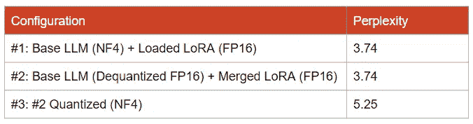

# QA-LoRA：在你的 GPU 上微调量化的大型语言模型

> 原文：[`towardsdatascience.com/qa-lora-fine-tune-a-quantized-large-language-model-on-your-gpu-c7291866706c?source=collection_archive---------0-----------------------#2023-10-14`](https://towardsdatascience.com/qa-lora-fine-tune-a-quantized-large-language-model-on-your-gpu-c7291866706c?source=collection_archive---------0-----------------------#2023-10-14)

## 量化感知微调

[](https://medium.com/@bnjmn_marie?source=post_page-----c7291866706c--------------------------------)[](https://towardsdatascience.com/?source=post_page-----c7291866706c--------------------------------) [Benjamin Marie](https://medium.com/@bnjmn_marie?source=post_page-----c7291866706c--------------------------------)

·

[关注](https://medium.com/m/signin?actionUrl=https%3A%2F%2Fmedium.com%2F_%2Fsubscribe%2Fuser%2Fad2a414578b3&operation=register&redirect=https%3A%2F%2Ftowardsdatascience.com%2Fqa-lora-fine-tune-a-quantized-large-language-model-on-your-gpu-c7291866706c&user=Benjamin+Marie&userId=ad2a414578b3&source=post_page-ad2a414578b3----c7291866706c---------------------post_header-----------) 发表在 [Towards Data Science](https://towardsdatascience.com/?source=post_page-----c7291866706c--------------------------------) · 10 分钟阅读 · 2023 年 10 月 14 日 [](https://medium.com/m/signin?actionUrl=https%3A%2F%2Fmedium.com%2F_%2Fvote%2Ftowards-data-science%2Fc7291866706c&operation=register&redirect=https%3A%2F%2Ftowardsdatascience.com%2Fqa-lora-fine-tune-a-quantized-large-language-model-on-your-gpu-c7291866706c&user=Benjamin+Marie&userId=ad2a414578b3&source=-----c7291866706c---------------------clap_footer-----------)

--

[](https://medium.com/m/signin?actionUrl=https%3A%2F%2Fmedium.com%2F_%2Fbookmark%2Fp%2Fc7291866706c&operation=register&redirect=https%3A%2F%2Ftowardsdatascience.com%2Fqa-lora-fine-tune-a-quantized-large-language-model-on-your-gpu-c7291866706c&source=-----c7291866706c---------------------bookmark_footer-----------)

作者插图 — 使用了来自 Pixabay 的图像 ([1](https://pixabay.com/vectors/llama-alpaca-animal-mammal-zoo-297668/),[2](https://pixabay.com/vectors/skateboard-skating-skate-silhouette-7192315/))

最先进的大型语言模型（LLMs）经过数十亿参数的预训练。虽然预训练的 LLMs 可以执行许多任务，但经过微调后，它们的性能会大幅提升。

多亏了 LoRA，微调成本可以显著降低。LoRA 在冻结的原始参数上添加了低秩张量，即少量参数（百万级）。在微调过程中，只有添加的张量中的参数会被训练。

LoRA 仍然需要将模型加载到内存中。为了降低内存成本并加快微调速度，一种新的方法提出了量化感知 LoRA (QA-LoRA) 微调。

在这篇文章中，我将解释 QA-LoRA，并对其与之前的工作（特别是 QLoRA）的性能进行评估。我还展示了如何使用 QA-LoRA 来微调你自己量化感知的 LoRA 以适应 Llama 2。

# QLoRA 存在什么问题？

在量化的 LLM 上微调 LoRA 是 QLoRA 已经可以做到的事情。在我之前的文章中，我多次使用它来微调 LLM，例如 Llama 2 和 GPT-NeoX，在我的台式电脑上或使用免费的 Google Colab 实例。

[](https://kaitchup.substack.com/p/fine-tune-llama-2-on-your-computer?source=post_page-----c7291866706c--------------------------------) [## 在你的计算机上使用 QLoRa 和 TRL 微调 Llama 2

### 在 Guanaco 上以及使用正确的填充

kaitchup.substack.com](https://kaitchup.substack.com/p/fine-tune-llama-2-on-your-computer?source=post_page-----c7291866706c--------------------------------)

在深入探讨 QA-LoRA 之前，了解 QLoRA 的当前局限性是很有趣的。

## NormalFloat4 (NF4) 量化

LLM 量化算法通常将参数量化为 4 位精度，使用 INT4 数据类型。使用这种数据类型的计算在最近的 GPU 上得到了越来越多的优化。

QLoRA 默认不使用 INT4，而是另一种称为 NormalFloat4 (NF4) 的数据类型。你可以将其视为压缩的浮点数。根据 [QLoRA](https://arxiv.org/abs/2305.14314) 作者的说法，NF4 优于 INT4。使用 NF4 量化的 LLM 实现了更低的困惑度。

然而，NF4 计算对于快速推理并不理想。这是为什么使用 GPTQ 量化的模型比使用 bitsandbytes NF4 量化的模型更快的原因之一。在之前的文章中，我确认了 GPTQ 模型确实更快。

[](https://kaitchup.substack.com/p/gptq-or-bitsandbytes-which-quantization?source=post_page-----c7291866706c--------------------------------) [## GPTQ 或 bitsandbytes：哪个量化方法适用于 LLM - Llama 2 的示例

### 大型语言模型量化，以便在你的计算机上进行负担得起的微调和推理

kaitchup.substack.com](https://kaitchup.substack.com/p/gptq-or-bitsandbytes-which-quantization?source=post_page-----c7291866706c--------------------------------)

NF4 也是 [QA-LoRA](https://arxiv.org/abs/2309.14717) 作者指出的一个弱点。

## NF4 基础模型，但 FP16 LoRA

虽然基础模型使用 NF4 进行量化，但训练后的 LoRA 参数仍保持较高的精度，通常是 FP16，如下图所示。


图由作者提供

这对于 QLoRA 性能至关重要，因为天真地训练量化参数会导致性能较差。

因此，在推理时，我们有两种不同的方法来使用用 QLoRA 训练的 LoRA 适配器：

+   将它们加载到基础 LLM 之上，就像我们在 QLoRA 微调期间所做的那样

+   将它们与基础 LLM 合并

加载它们是保持性能的最佳方式。我们将 LoRA 的参数保持在 16 位精度，但由于它们仅有几百万个参数，相对于量化的基础 LLM，它们并不会消耗太多 VRAM。

另一种选择是将 LoRA 参数与基础模型合并。我在[上一篇文章中探索了几种合并方案](https://kaitchup.substack.com/p/lora-adapters-when-a-naive-merge)。

理想情况下，我们需要将基础模型解量化到 LoRA 参数所使用的相同精度，然后将 LoRA 参数与解量化的基础模型合并。

但结果是，合并模型不再被量化（FP16）。它是一个大规模解量化模型。我们可以对整个合并模型进行量化，但量化总是会丢失信息。我们将得到一个性能低于原始 QLoRA 微调结束时的性能的模型。

这是我获得的[不同配置的结果](https://kaitchup.substack.com/p/lora-adapters-when-a-naive-merge)：



表格和作者提供的结果

*注意：较低的困惑度更好。*

我们可以看到，量化合并模型会导致显著更高的困惑度。我们不能在不显著降低性能的情况下合并 QLoRA 适配器，同时保持量化。QLoRA 适配器不是“量化感知”的。

# 使用 QA-LoRA 的量化感知微调

QA-LoRA 在这篇 arXiv 论文中提出：

[QA-LoRA: 量化感知的大型语言模型低秩适应](https://arxiv.org/abs/2309.14717)（Xu 等人，2023）

这篇论文不容易阅读。QA-LoRA 动机充分，大部分结果/实验令人信服。然而，理解其工作原理需要对量化背后的机制有所了解。

我不会深入探讨数学理论和证明。我认为理解 QA-LoRA 最简单的方法是将其视为**联合量化和微调 LoRA 参数的过程**。适配器的参数和量化参数都是在微调过程中学习和应用的。

为了突出与 QLoRA 的区别，我们可以参考论文中的这一段：

> *我们引入了分组操作，将量化的参数数量从 Dout 增加到 L×Dout，同时将适应的参数数量从 Din×Dint+Dint×Dout 减少到 L × Dint + Dint × Dout。正如我们在实验中将看到的，适度的 L 可以在保持计算效率的同时实现令人满意的语言理解准确性。*

此外，QA-LoRA 使用标准的 INT4 数据类型，而 QLoRA 使用 NF4。

# QA-LoRA 性能

让我们看看 QA-LoRA 的作者报告的性能。他们报告了许多实验，但我认为下面的表格最能概述 QA-LoRA 的性能，相比 QLoRA 以及在各种量化精度下：


表格来自 [Xu et al. (2023)](https://arxiv.org/abs/2309.14717)

在此表中，我们比较了原始的 LLaMA 7B（16-bit）与：

+   标准 QLoRA 与 NF4 量化基础 LLM 和 FP16 LoRA（标记为 QLoRA”）

+   LLaMA 7B 量化为 GPTQ 到 INT4（标记为 “LLaMA-7B w/ GPTQ”）

+   合并的 QLoRA 适配器量化为 GTPQ（标记为 “QLoRA w/ GPTQ”）

+   QA-LoRA

标准 QLoRA 的表现最佳。这是预期的，因为它使用了非常好的量化数据类型（NF4），而 LoRA 的参数仍然是 FP16。

我们可以看到，当我们想要合并 QLoRA 适配器并对合并后的模型进行量化（QLoRA w/ GPTQ）时，性能显著下降。正如我们在本文前面的部分讨论的那样，这是预期中的情况。

另一方面，QA-LoRA 的表现几乎与标准 QLoRA 相当，同时 LLM 完全量化为 INT4。换句话说，QA-LoRA 能够正常工作。

QA-LoRA 也比 QLoRA 更灵活，允许用量化到较低精度的 LLM 进行微调。QA-LoRA 的 3-bit 精度优于 QLoRA 合并并量化到 4-bit（QA-LoRA 3-bit 的准确率为 60.1%，而 QLoRA w/ GPTQ 4-bit 为 59.8%）。

总体而言，QA-LoRA 的结果看起来非常令人印象深刻。

# QA-LoRA 实现概述

[QA-LoRA 的作者在 GitHub 上发布了他们的实现](https://github.com/yuhuixu1993/qa-lora/tree/main)（MIT 许可证）。[注意：原始实现已不再提供。我做了一个分支，你可以在这里找到。](https://github.com/benjamin-marie/qa-lora)

QA-LoRA 实现严重依赖于 [AutoGPTQ](https://github.com/PanQiWei/AutoGPTQ)（MIT 许可证）。它利用 AutoGPTQ 的一个特定分支并替换了几个函数。

你希望微调的 LLM 必须已经用这个特定的 AutoGPTQ 分支进行量化。你可以尝试使用来自 Hugging Face Hub 的量化 LLM，但由于 AutoGPTQ 经常变化，这些量化的 LLM 可能不完全兼容 QA-LoRA。例如，[我为上一篇文章量化的 Llama 2 7B](https://huggingface.co/kaitchup/llama-2-7b-4bit-autogptq) 的量化配置不受这个 AutoGPTQ 分支支持。

如果你想了解 QA-LoRA 在 AutoGPTQ 中的更改，可以更详细地查看文件 “[peft_utils.py](https://github.com/yuhuixu1993/qa-lora/blob/main/peft_utils.py)” 中的 “GPTQLoraLinear” 类。QA-LoRA 的主要创新在于两行代码：

```py
torch.nn.Linear.__init__(self, linear_module.in_features, linear_module.out_features)
LoraLayer.__init__(self, linear_module.in_features//group_size, linear_module.out_features)
```

# **Llama 2** 支持的代码适配

我不得不修补 QA-LoRA 的实现，使其在 Llama 2 上运行。

如果 QA-LoRA 在你阅读本文时仍然无法运行 Llama 2，可以用这个文件替换 “qalora.py”：

[`about.benjaminmarie.com/data/py/qalora/qalora.py`](https://about.benjaminmarie.com/data/py/qalora/qalora.py)

我只做了两个修改：

+   将“model.config.torch_dtype=(torch.float32 if args.fp16 else (torch.bfloat16 if args.bf16 else torch.float32))”替换为“model.config.torch_dtype=torch.float16”（当前版本的第 300 行）

+   将“module = module.to(torch.float32)”替换为“module = module.to(torch.float16)”（当前版本的第 340 行）

当前实现仅适用于使用 pad token 的模型。Llama 2 不使用 pad token。我不得不手动修改量化的 Llama 2 的 config.json，添加这一行：

```py
"pad_token_id": 0,
```

它仅指定了用于填充的“unk_token”，其 ID 为 0。

# 使用 QA-LoRA 微调 Llama 2 的要求

我在一个笔记本中实现了以下所有部分，你可以在这里找到：

[获取笔记本 (#21)](https://kaitchup.substack.com/p/notebooks)

## QA-LoRA 依赖项

我建议在设置 QA-LoRA 之前创建一个沙箱，例如使用 conda。当前实现使用了几个包的过时版本。

由于我们必须替换 AutoGPTQ 中的源文件以添加 QA-LoRA 支持，AutoGPTQ 必须从源代码编译。

由于这一替换，我们必须首先克隆 AutoGPTQ 和 QA-LoRA 两个存储库，然后替换 AutoGPTQ 中的文件：

```py
git clone -b v0.3.0 https://github.com/PanQiWei/AutoGPTQ.git 
git clone https://github.com/yuhuixu1993/qa-lora.git
cp qa-lora/peft_utils.py ./AutoGPTQ/auto_gptq/utils/
```

应用我的补丁（如有必要）：

```py
wget https://about.benjaminmarie.com/data/py/qalora/qalora.py
cp qalora.py qa-lora/
```

AutoGPTQ 现在可以安装了：

```py
cd AutoGPTQ
pip install .[triton]
cd ..
```

这可能需要多达 10 分钟。

安装 QA-LoRA 依赖项：

```py
cd qa-lora
pip install -r requirements.txt
cd ..
```

我还根据 QA-LoRA 文档的推荐从源代码安装了 bitsandbytes，但我认为这不是必须的。你可以尝试使用“pip install bitsandbytes”代替（速度更快）。

```py
git clone https://github.com/timdettmers/bitsandbytes.git
cd bitsandbytes
# CUDA_VERSIONS in {110, 111, 112, 113, 114, 115, 116, 117, 118, 119, 120, 120}
# make argument in {cuda110, cuda11x, cuda12x}
# if you do not know what CUDA you have, try looking at the output of: python -m bitsandbytes
CUDA_VERSION=118 make cuda11x
python setup.py install
pip install -r requirements.txt
pip install protobuf==3.20.*
cd ..
```

## 预量化 LLM

目前，QA-LoRA 仅微调已经通过 AutoGPTQ 量化的 LLM（支持 INT4、INT3 和 INT2）。如果你想微调一个 fp16/32 LLM，你需要先使用我们安装的 AutoGPTQ 版本进行量化。

你也可以查看笔记本末尾，我在其中写了量化代码。对于本文，我量化了 Llama 2 7B 并将其上传到 Hugging Face Hub。你可以使用它来运行本教程：

+   [kaitchup/Llama-2-7b-4bit-32g-autogptq](https://huggingface.co/kaitchup/Llama-2-7b-4bit-32g-autogptq)

*注意：safetensors 格式尚不支持。QA-LoRA 期望在存储库中找到文件 pytorch_model.bin。*

量化的组大小设置为 32（32g）。我选择这个组大小是因为在 QA-LoRA 中硬编码为 32。

## 硬件要求

以下部分可以在免费的 Google Colab 实例或至少具有 10 GB VRAM 的 GPU 上运行。

# QA-LoRA 微调

我使用默认数据集 Alpaca 进行了 100 步的微调。批次大小为 1，梯度累积步骤为 16。它消耗了大约 7 GB 的 VRAM。

如果你的微调出现不稳定的情况，调整学习率和/或 LoRA alpha/rank 也可能提高稳定性。

```py
cd /content/qa-lora/
python qalora.py  --model_path kaitchup/Llama-2-7b-4bit-32g-autogptq \
                  --save_steps 10 \
                  --output_dir output \
                  --per_device_train_batch_size 1 \
                  --gradient_accumulation_steps 16 \
                  --max_steps 100 \
                  --lora_r 16
```

使用 Google Colab 的 T4 GPU，这次微调用了 28 分钟。

我在 Hugging Face Hub 上上传了最终的检查点：

+   [kaitchup/Llama-2-7b-4bit-32g-autogptq-QALoRA](https://huggingface.co/kaitchup/Llama-2-7b-4bit-32g-autogptq-QALoRA/)

# 合并 QA-LoRA 适配器

与 QLoRA 相比，QA-LoRA 适配器可以在不损失性能的情况下与量化基础 LLM 合并。

这里是合并代码：

```py
import torch

#Path the quantized base model
model_path = 'Llama-2-7b-4bit-32g-autogptq/gptq_model-4bit-32g.bin'
#Path to the adapter fine-tuned with QA-LoRA
lora_path = 'output/adapter_model.bin'
#Where the merged model will be saved
merged_path = 'output_model'
#The scale is the LoRA alpha divided by the LoRA rank. I trained with LoRA_alpha = LoRA_rank = 16
scale = 16 / 16
#The group size of the quantized base LLN
group_size = 32

#We merge using the CPU
model = torch.load(model_path, map_location='cpu')
lora = torch.load(lora_path, map_location='cpu')
tmp_keys = [key[17:-14] for key in lora.keys() if 'lora_A' in key]
for tmp_key in tmp_keys:
    model[tmp_key+'.qzeros'] -= (lora['base_model.model.'+tmp_key+'.lora_B.weight'] @ lora['base_model.model.'+tmp_key+'.lora_A.weight']).t() * scale / group_size /model[tmp_key+'.scales']

torch.save(model, merged_path)
```

该代码在 CPU 上运行，因此你只需要足够的 CPU RAM 来加载要合并的模型。注意基础 LLM 和我们微调的 QA-LoRA 适配器必须在本地可访问。

一旦合并，模型就准备好进行推理。它是一个标准的 GPTQ 模型。

# 结论

QA-LoRA 有效。我们对 Llama 2 进行了量化感知的 LoRA 微调。

我们发现量化感知微调相较于 QLoRA 有两个显著的优势：

+   这更快

+   它微调了一个可以与基础 LLM 完美合并的适配器。

当前的实现还不够灵活。这仍然是一个非常年轻的项目。主要问题在于它依赖于旧版本的 AutoGPTQ。QA-LoRA 的作者计划稍后支持最新版本的 AutoGPTQ。

注意在我的实验中使用了 4-bit 量化。QA-LoRA 已支持 2-bit 和 3-bit 量化。你可以尝试这些更低的精度以进一步减少内存消耗。

为了支持我的工作，请考虑订阅我的通讯：

[](https://kaitchup.substack.com/?source=post_page-----c7291866706c--------------------------------) [## Kaitchup - 预算内的 AI | 本杰明·玛丽，博士 | Substack]

### 每周的新闻、提示和有关在你的计算机上微调、运行和服务大型语言模型的教程。每个...

[kaitchup.substack.com](https://kaitchup.substack.com/?source=post_page-----c7291866706c--------------------------------)
