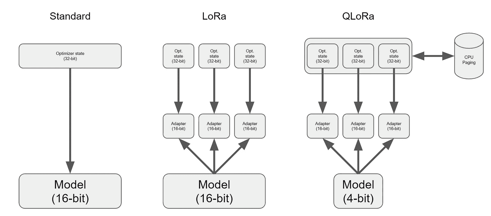

# QLoRa：在你的 GPU 上微调大型语言模型

> 原文：[`towardsdatascience.com/qlora-fine-tune-a-large-language-model-on-your-gpu-27bed5a03e2b?source=collection_archive---------1-----------------------#2023-05-30`](https://towardsdatascience.com/qlora-fine-tune-a-large-language-model-on-your-gpu-27bed5a03e2b?source=collection_archive---------1-----------------------#2023-05-30)

## 在消费级硬件上微调拥有数十亿参数的模型现在已经成为可能

[](https://medium.com/@bnjmn_marie?source=post_page-----27bed5a03e2b--------------------------------)[](https://towardsdatascience.com/?source=post_page-----27bed5a03e2b--------------------------------) [本杰明·玛丽](https://medium.com/@bnjmn_marie?source=post_page-----27bed5a03e2b--------------------------------)

·

[关注](https://medium.com/m/signin?actionUrl=https%3A%2F%2Fmedium.com%2F_%2Fsubscribe%2Fuser%2Fad2a414578b3&operation=register&redirect=https%3A%2F%2Ftowardsdatascience.com%2Fqlora-fine-tune-a-large-language-model-on-your-gpu-27bed5a03e2b&user=Benjamin+Marie&userId=ad2a414578b3&source=post_page-ad2a414578b3----27bed5a03e2b---------------------post_header-----------) 发表在 [Towards Data Science](https://towardsdatascience.com/?source=post_page-----27bed5a03e2b--------------------------------) ·6 min read·2023 年 5 月 30 日[](https://medium.com/m/signin?actionUrl=https%3A%2F%2Fmedium.com%2F_%2Fvote%2Ftowards-data-science%2F27bed5a03e2b&operation=register&redirect=https%3A%2F%2Ftowardsdatascience.com%2Fqlora-fine-tune-a-large-language-model-on-your-gpu-27bed5a03e2b&user=Benjamin+Marie&userId=ad2a414578b3&source=-----27bed5a03e2b---------------------clap_footer-----------)

--

[](https://medium.com/m/signin?actionUrl=https%3A%2F%2Fmedium.com%2F_%2Fbookmark%2Fp%2F27bed5a03e2b&operation=register&redirect=https%3A%2F%2Ftowardsdatascience.com%2Fqlora-fine-tune-a-large-language-model-on-your-gpu-27bed5a03e2b&source=-----27bed5a03e2b---------------------bookmark_footer-----------)

插图由作者提供。

大多数大型语言模型（LLM）过于庞大，无法在消费级硬件上进行微调。例如，微调一个拥有 650 亿参数的模型需要超过 780GB 的 GPU 内存。这相当于十个 A100 80GB 的 GPU。换句话说，你需要云计算才能微调你的模型。

现在，使用 QLoRa（[Dettmers 等人，2023](https://arxiv.org/pdf/2305.14314.pdf)），你只需一个 A100 就可以做到这一点。

在这篇博客文章中，我将介绍 QLoRa。我将简要描述它的工作原理，并展示如何在你的 GPU 上使用它来微调一个拥有 200 亿参数的 GPT 模型。

*注意：我使用了自己的 nVidia RTX 3060 12 Gb 运行了本文中的所有命令。你也可以使用 Google Colab 的免费实例获得相同的结果。如果你想使用内存较小的 GPU，你需要使用更小的大语言模型。*

我在这篇文章中提供了运行 QLoRa 进行微调所需的所有代码。如果你不想自己编写代码，[我还在 The Kaitchup（我的 Substack 通讯）上创建了一个 Google Colab 笔记本。这是笔记本 #2。](https://newsletter.kaitchup.com/p/notebooks)

# QLoRa：低秩适配器的量化大语言模型

在 2021 年 6 月，[Hu 等人（2021）](https://arxiv.org/abs/2106.09685)介绍了针对大语言模型的低秩适配器（LoRa）。

LoRa 为 LLM 的每一层添加了一小部分可训练的参数，即适配器，并冻结了所有原始参数。对于微调，我们只需更新适配器权重，这大大减少了内存占用。

QLoRa 通过引入：4-bit 量化、双重量化以及利用 nVidia 统一内存进行分页，进一步向前迈进了三步。

简而言之，每个步骤的工作原理如下：

+   **4-bit NormalFloat 量化**：这是一种改进量化分位数的量化方法。它确保每个量化箱中有相等数量的值。这可以避免计算问题和对异常值的错误。

+   **双重量化**：QLoRa 的作者将其定义为：“*对量化常数进行量化以节省额外内存的过程。*”

+   **统一内存分页**：它依赖于 NVIDIA 统一内存功能，自动处理 CPU 和 GPU 之间的页到页传输。它确保了无错误的 GPU 处理，尤其是在 GPU 可能内存不足的情况下。

所有这些步骤都大幅减少了微调的内存要求，同时性能几乎与标准微调相当。

# 使用 QLoRa 对 GPT 模型进行微调

## QLoRa 的硬件要求：

+   **GPU**：以下演示在具有 12 Gb VRAM 的 GPU 上运行，适用于参数少于 20 亿的模型，例如 GPT-J。例如，我在我的 RTX 3060 12 Gb 上运行了它。如果你有一张具有 24 Gb VRAM 的更大显卡，你可以使用 20 亿参数的模型，例如 GPT-NeoX-20b。

+   **RAM**：我建议至少 6 Gb。大多数现代计算机都有足够的 RAM。

+   **硬盘**：GPT-J 和 GPT-NeoX-20b 都是非常大的模型。我建议至少有 80 Gb 的可用空间。

如果你的机器不满足这些要求，Google Colab 的免费实例也足够了。

## QLoRa 的软硬件要求：

我们需要 CUDA。确保它已安装在你的机器上。

我们还需要安装所有依赖项：

+   **bitsandbytes**：一个包含量化 LLM 所需所有工具的库。

+   **Hugging Face Transformers 和 Accelerate**：这些是用于高效训练来自 Hugging Face Hub 模型的标准库。

+   **PEFT**：一个提供各种方法实现的库，用于只微调少量（额外）模型参数。我们需要它用于 LoRa。

+   **数据集**：这不是必需的。我们仅用它来获取一个用于微调的数据集。当然，你可以提供你自己的数据集。

我们可以通过 PIP 获取它们全部：

```py
pip install -q -U bitsandbytes
pip install -q -U git+https://github.com/huggingface/transformers.git 
pip install -q -U git+https://github.com/huggingface/peft.git
#pip install -q -U git+https://github.com/huggingface/accelerate.git
#current version of Accelerate on GitHub breaks QLoRa
#Using standard pip instead
pip install -q -U accelerate
pip install -q -U datasets
```

接下来，我们可以开始编写 Python 脚本。

## GPT 模型的加载和量化

我们需要以下导入来加载和量化 LLM。

```py
import torch
from transformers import AutoTokenizer, AutoModelForCausalLM, BitsAndBytesConfig
```

对于这个演示，我们将微调 [GPT NeoX](https://huggingface.co/EleutherAI/gpt-neox-20b) 模型，这个模型由 [EleutherAI](https://www.eleuther.ai/) 预训练。这个模型拥有 200 亿个参数。 *注意：GPT NeoX 具有允许商业使用的宽松许可（Apache 2.0）。*

我们可以从 Hugging Face Hub 获取这个模型和相关的分词器：

```py
model_name = "EleutherAI/gpt-neox-20b"

#Tokenizer
tokenizer = AutoTokenizer.from_pretrained(model_name)
```

然后，我们需要详细说明量化器的配置，如下：

```py
quant_config = BitsAndBytesConfig(
    load_in_4bit=True,
    bnb_4bit_use_double_quant=True,
    bnb_4bit_quant_type="nf4",
    bnb_4bit_compute_dtype=torch.bfloat16
)
```

+   load_in_4bit: 模型将以 4-bit 精度加载到内存中。

+   bnb_4bit_use_double_quant: 我们将进行 QLoRa 提议的双量化。

+   bnb_4bit_quant_type: 这是量化类型。“nf4”表示 4-bit NormalFloat。

+   bnb_4bit_compute_dtype: 当我们以 4-bit 加载和存储模型时，我们会在需要时部分去量化，并以 16-bit 精度（bfloat16）进行所有计算。

所以现在我们可以以 4-bit 加载模型：

```py
model = AutoModelForCausalLM.from_pretrained(model_name, quantization_config=quant_config, device_map={"":0})
```

然后，我们启用梯度检查点：

```py
model.gradient_checkpointing_enable()
```

## 为 LoRa 预处理 GPT 模型

这里我们使用 PEFT。我们为 LoRa 准备模型，为每一层添加可训练的适配器。

```py
from peft import prepare_model_for_kbit_training, LoraConfig, get_peft_model

model = prepare_model_for_kbit_training(model)

config = LoraConfig(
    r=8, 
    lora_alpha=32, 
    target_modules=["query_key_value"], 
    lora_dropout=0.05, 
    bias="none", 
    task_type="CAUSAL_LM"
)

model = get_peft_model(model, config)
```

在 LoraConfig 中，你可以调整 r、alpha 和 dropout 以获得更好的任务结果。你可以在 [PEFT 仓库](https://github.com/huggingface/peft/tree/main) 找到更多选项和细节。

使用 LoRa，我们仅增加了 800 万参数。我们只训练这些参数，冻结其他所有参数。微调应该会很快。

## 准备好你的数据集

对于这个演示，我使用“english_quotes”数据集。 [这是一个由著名名言组成的数据集](https://huggingface.co/datasets/Abirate/english_quotes) 以 [CC BY 4.0 许可](https://creativecommons.org/licenses/by/4.0/) 进行分发。

```py
from datasets import load_dataset
data = load_dataset("Abirate/english_quotes")
data = data.map(lambda samples: tokenizer(samples["quote"]), batched=True)
```

## 使用 QLoRa 微调 GPT-NeoX-20B

最终，使用 Hugging Face Transformers 进行微调是非常标准的。

```py
import transformers

tokenizer.pad_token = tokenizer.eos_token

trainer = transformers.Trainer(
    model=model,
    train_dataset=data["train"],
    args=transformers.TrainingArguments(
        per_device_train_batch_size=1,
        gradient_accumulation_steps=8,
        warmup_steps=2,
        max_steps=20,
        learning_rate=2e-4,
        fp16=True,
        logging_steps=1,
        output_dir="outputs",
        optim="paged_adamw_8bit"
    ),
    data_collator=transformers.DataCollatorForLanguageModeling(tokenizer, mlm=False),
)
trainer.train()
```

别忘了 optim=”paged_adamw_8bit”。它激活了分页以更好地管理内存。没有它，我们会遇到内存不足的错误。

在 Google Colab 上运行这个微调只需 5 分钟。

VRAM 消耗应达到 15Gb 峰值。

就这样，我们免费微调了一个 LLM！

它有效吗？让我们尝试推理。

# GPT 推理与 QLoRa

我们微调的 QLoRa 模型可以直接用于标准的 Hugging Face Transformers 推理，具体如下：

```py
text = "Ask not what your country"
device = "cuda:0"
inputs = tokenizer(text, return_tensors="pt").to(device)

outputs = model.generate(**inputs, max_new_tokens=20)
print(tokenizer.decode(outputs[0], skip_special_tokens=True))
```

你应该得到以下输出：

```py
Ask not what your country can do for you, ask what you can do for your country.”

– John F.
```

我们得到了预期的报价。对于 5 分钟的微调来说还不错！

# 结论

大型语言模型变得更大，但同时，我们终于拥有了在消费者硬件上进行微调和推理的工具。

多亏了 LoRa，现在 QLoRa 的出现使我们能够在不依赖云计算的情况下微调具有亿级参数的模型，并且根据[QLoRa 论文](https://arxiv.org/abs/2106.09685)性能下降并不显著。

如果你在运行代码时遇到任何问题，请留言，我会尽量帮助你。你还可以在[官方 GitHub 仓库中找到关于 QLoRa 实现的更多信息](https://github.com/artidoro/qlora)。

如果你想部署 LLM，可以查看我使用 nVidia Triton 推理服务器的教程：

[](/deploy-your-local-gpt-server-with-triton-a825d528aa5d?source=post_page-----27bed5a03e2b--------------------------------) ## 使用 Triton 部署本地 GPT 服务器

### 如何在本地服务器上运行大型语言模型

towardsdatascience.com

*如果你喜欢这篇文章并且对阅读下一篇感兴趣，支持我工作的最佳方式是订阅 Kaitchup：*

[](https://newsletter.kaitchup.com/?source=post_page-----27bed5a03e2b--------------------------------) [## Kaitchup - AI 预算低 | Benjamin Marie | Substack

### 每周提供有关微调、运行和服务大型语言模型的教程、技巧和新闻。…

newsletter.kaitchup.com](https://newsletter.kaitchup.com/?source=post_page-----27bed5a03e2b--------------------------------)
