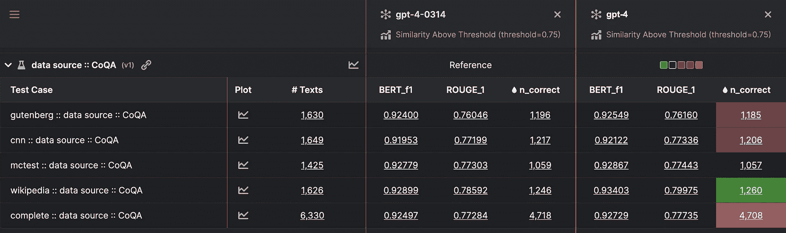

# 量化 GPT-4 的隐藏回归

> 原文：[`towardsdatascience.com/quantifying-gpt-4s-hidden-regressions-over-time-368d3a16dca?source=collection_archive---------7-----------------------#2023-09-22`](https://towardsdatascience.com/quantifying-gpt-4s-hidden-regressions-over-time-368d3a16dca?source=collection_archive---------7-----------------------#2023-09-22)

## 研究生成型 AI 使用和测试的第三部分

[](https://markopolocheno.medium.com/?source=post_page-----368d3a16dca--------------------------------)[](https://towardsdatascience.com/?source=post_page-----368d3a16dca--------------------------------) [Mark Chen](https://markopolocheno.medium.com/?source=post_page-----368d3a16dca--------------------------------)

·

[关注](https://medium.com/m/signin?actionUrl=https%3A%2F%2Fmedium.com%2F_%2Fsubscribe%2Fuser%2F377682c0f342&operation=register&redirect=https%3A%2F%2Ftowardsdatascience.com%2Fquantifying-gpt-4s-hidden-regressions-over-time-368d3a16dca&user=Mark+Chen&userId=377682c0f342&source=post_page-377682c0f342----368d3a16dca---------------------post_header-----------) 发布于[Towards Data Science](https://towardsdatascience.com/?source=post_page-----368d3a16dca--------------------------------) ·5 分钟阅读·2023 年 9 月 22 日[](https://medium.com/m/signin?actionUrl=https%3A%2F%2Fmedium.com%2F_%2Fvote%2Ftowards-data-science%2F368d3a16dca&operation=register&redirect=https%3A%2F%2Ftowardsdatascience.com%2Fquantifying-gpt-4s-hidden-regressions-over-time-368d3a16dca&user=Mark+Chen&userId=377682c0f342&source=-----368d3a16dca---------------------clap_footer-----------)

--

[](https://medium.com/m/signin?actionUrl=https%3A%2F%2Fmedium.com%2F_%2Fbookmark%2Fp%2F368d3a16dca&operation=register&redirect=https%3A%2F%2Ftowardsdatascience.com%2Fquantifying-gpt-4s-hidden-regressions-over-time-368d3a16dca&source=-----368d3a16dca---------------------bookmark_footer-----------)

由[Randy Fath](https://unsplash.com/@randyfath?utm_source=medium&utm_medium=referral)拍摄，来源于[Unsplash](https://unsplash.com/?utm_source=medium&utm_medium=referral)

GPT-4 比 GPT-3 更大更好。GPT-4 可以撰写优美的演讲，[通过标准化考试](https://openai.com/research/gpt-4#:~:text=among%20test%20takers)-,Exam%20results,-(ordered%20by%20GPT)，甚至[解读图像](https://openai.com/research/gpt-4#:~:text=Visual%20inputs%3A%20VGA%20charger)。自 2023 年 3 月 14 日发布以来，OpenAI 不断迭代和更新 GPT-4，以提升其对每天接收的数百万个查询的处理能力。然而，**OpenAI 的 API 中最新版本的 GPT-4，即“gpt-4”，真的比三月份的初始版本** “gpt-4–0314” **更好吗？**

从[Kolena](https://www.kolena.io/)机器学习工程师的角度来看，这篇文章是系列讨论的继续，强调了一种针对 LLM 的测试范式，比较了不同场景下 GPT 模型的表现。

尽管通过各种测试基准和指标，“gpt-4”的整体表现可能比“gpt-4–0314”更好，但“更好”一词是相对的。用户在线分享了他们**最近在不同环境中** [**经历了 GPT-4 模型性能回退**](https://arxiv.org/pdf/2307.09009.pdf)。一个广为流传的 GPT-4 性能回退实例是，它无法像之前一样识别 17077 是一个质数。

自然地，使用最先进的模型时，它在主观和客观表现上不断下降，这是一个问题。**可能还存在什么其他隐藏的回归？**

我们可以通过使用 CoQA（[对话问答](https://stanfordnlp.github.io/coqa/)）**数据集来测试 GPT-4 的隐藏回归。CoQA 数据集包含多篇文章，每篇文章有一系列相关的问题，其中理解问题*n*对于回答问题*n+1*是必要的。以一篇关于体育历史的文章为例，这里有一些潜在的问题：

1\. 谁是获得奖牌最多的奥运选手？

2\. 他们来自哪个国家？

3\. 他们获得了多少枚金牌？

无法单独回答这些问题，因为在回答第一个问题之前，我们不知道感兴趣的对象。

## 发现

从高层次来看，**GPT-4 的表现比 GPT-3 显著更好**，但它仍然不完美：

```py
+------------+-------------+-------------+-----------+
|   model    | avg_BERT_F1 | avg_ROUGE_1 | n_correct |
+------------+-------------+-------------+-----------+
| gpt-4      |     0.92729 |     0.77735 |      4708 |
| gpt-4–0314 |     0.92497 |     0.77284 |      4718 |
| gpt-3      |     0.90845 |     0.71676 |      4348 |
+------------+-------------+-------------+-----------+
```

> *注意：“gpt-3”是 GPT-3.5 系列的最新 Turbo 模型，而 n_correct 是平均值* [*BERT_F1*](https://huggingface.co/spaces/evaluate-metric/bertscore) *和* [*ROUGE_1*](https://huggingface.co/spaces/evaluate-metric/rouge) *大于 0.75 的问题数量*

从上述内容来看，**为什么“gpt-4–0314”在指标（BERT_F1 和 ROUGE_1）上表现更差**却有更多正确回答问题的次数？也许这两个模型在回答相同问题时都存在错误，但不能保证“gpt-4”和“gpt-4–0314”的失败集是同质的。在假设新模型应该具有更高性能的情况下，当我们观察指标时，无法解释这种差异或退步的原因。我们可以通过逻辑上将数据分解为更小的组来深入理解潜在的失败根源。

当我们根据每篇文章的数据源对 CoQA 数据集进行分层时，我们会发现**涉及维基百科文章的问题回答数据在最新的 GPT-4 模型中表现更好**，但整体上以及在所有其他数据源中的表现较差。



通过 BERT_F1、ROUGE_1 和正确答案数量对“gpt-4”和“gpt-4–0314”进行比较，数据来自[Kolena](https://www.kolena.io/)

上图展示了“gpt-4–0314”作为基准与“gpt-4”的比较，突出了在不同数据源中正确答案数量的差异，这些差异表明了改进或退步。**在正确答案的数量方面，GPT-4 唯一的改进来自于维基百科的数据点，而在其他所有地方表现都在下降。**

## 分析

**这是否揭示了“gpt-4”是“gpt-4–0314”在维基百科文章上经过微调的版本？** 不幸的是，我们并不知道。

那么我们是否可以说 GPT-4 变得更糟了？按照这个标准，不一定。尽管学术界认为维基百科是不可靠的信息来源，但许多人仍然经常使用它以获取快速且可访问的信息。如果 OpenAI 希望 GPT 能回答任何领域的任何问题，那么**对维基百科的全面理解比理解新闻文章更有价值，因为用户每天进行数百万次随机查询**。新闻文章往往有共同的主题，而普通人可能不会向 GPT 提问涉及新闻文章的维基百科中不存在的话题。

在对数据集进行不同数据源的分层之前，没有具体的解释说明为什么“gpt-4–0314”相比于“gpt-4”获得了更多正确结果。通过一次分层，我们获得了一个合理的解释，说明模型之间的差异及其原因。

## 结论

**随着时间的推移，GPT-4 在处理多个数据源的对话式问题回答上有所退步，但在涉及维基百科文章的查询上表现有所改善。**

能够识别隐藏的退步应成为所有工程师在将模型部署到生产环境之前的优先事项。寻找 LLM 的隐藏退步并非易事，但采用正确的方法可以简化这一过程。**最佳模型并不一定是整体性能最好的模型，而是最能在最重要的场景中取得最佳结果的模型。**

我们将在未来的博客文章中深入探讨 CoQA 的更多层次，以进一步了解 GPT-4 随时间的变化。敬请关注！

**[CoQA 数据集包含来自七个不同数据集的数据](https://stanfordnlp.github.io/coqa/#:~:text=Submission%20Tutorial-,License,-CoQA%20contains%20passages)**，这些数据集拥有不同的许可证。在本文中，我们不会透露数据集中的任何数据，仅使用这些商业数据源中的数据进行测试和分析，包括 Gutenberg、CNN、MCTest 和 Wikipedia，这些数据源具有 [CC BY-SA 4.0](https://creativecommons.org/licenses/by-sa/4.0/)、[MSR-LA](https://github.com/mcobzarenco/mctest/blob/master/data/MCTest/LICENSE.pdf) 或 [Apache](https://github.com/deepmind/rc-data/blob/master/LICENSE) 许可证。
