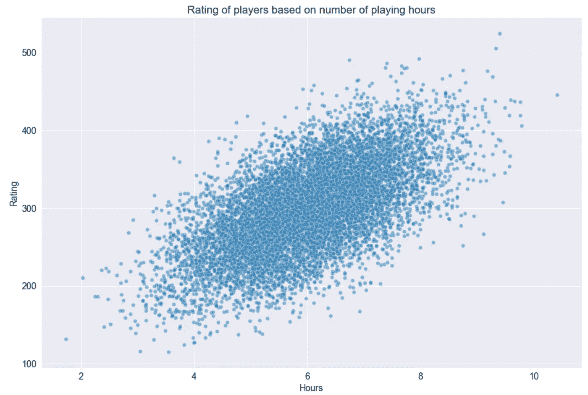

# 分位数损失与分位数回归

> 原文：[`towardsdatascience.com/quantile-loss-and-quantile-regression-b0689c13f54d?source=collection_archive---------0-----------------------#2023-01-28`](https://towardsdatascience.com/quantile-loss-and-quantile-regression-b0689c13f54d?source=collection_archive---------0-----------------------#2023-01-28)

## 学习如何调整回归算法以预测数据的任意分位数

 [Vyacheslav Efimov](https://medium.com/@slavahead?source=post_page-----b0689c13f54d--------------------------------)

·

[关注](https://medium.com/m/signin?actionUrl=https%3A%2F%2Fmedium.com%2F_%2Fsubscribe%2Fuser%2Fc8a0ca9d85d8&operation=register&redirect=https%3A%2F%2Ftowardsdatascience.com%2Fquantile-loss-and-quantile-regression-b0689c13f54d&user=Vyacheslav+Efimov&userId=c8a0ca9d85d8&source=post_page-c8a0ca9d85d8----b0689c13f54d---------------------post_header-----------) 发表在 [Towards Data Science](https://towardsdatascience.com/?source=post_page-----b0689c13f54d--------------------------------) ·6 分钟阅读·2023 年 1 月 28 日

--

# 介绍

回归是一个机器学习任务，其目标是基于一组特征向量预测一个实际值。存在各种回归算法：线性回归、逻辑回归、梯度提升或神经网络。在训练过程中，这些算法中的每一个都根据用于优化的损失函数调整模型的权重。

损失函数的选择依赖于特定任务和所需实现的度量值。许多损失函数（如 MSE、MAE、RMSLE 等）专注于根据特征向量预测变量的期望值。

在本文中，我们将查看一种特殊的损失函数，称为 **分位损失**，用于预测特定变量分位数。在深入分位损失的细节之前，让我们简要回顾一下分位数的术语。

# 分位数

> **分位数** qₐ 是一个值，它将给定的数字集合划分为使得 α ** 100%* 的数字小于该值，而 *(1 —* α*) * 100%* 的数字大于该值。
> 
> 分位数 *qₐ* 对于 *α = 0.25*、*α = 0.5* 和 *α = 0.75* 经常在统计中使用，被称为 **四分位数**。这些四分位数分别表示为 *Q₁*、*Q₂* 和 *Q₃*。三个四分位数将数据分成 4 个相等的部分。
> 
> 类似地，有 **百分位数** p，将给定的数字集合分成 100 个相等的部分。一个百分位数表示为 pₐ，其中 α 是小于相应值的数字百分比。
> 
> 四分位数 Q₁、Q₂ 和 Q₃ 分别对应于百分位数 p₂₅、p₅₀ 和 p₇₅。

在下面的例子中，找到了给定数字集合的所有三个四分位数。

一个示例显示了给定数字集合的所有三个四分位数。第一个四分位数 Q₁ 等于 10，因为 25%的值小于 10，而 75%的值大于 10。类似地，这种类推适用于其他四分位数。

# 分位损失

旨在预测特定变量分位的机器学习算法使用分位损失作为损失函数。在进行表述之前，让我们考虑一个简单的例子。

假设有一个问题，其目标是预测一个变量的第 75 百分位。实际上，这句话等同于预测误差在 75%的情况下必须为负，而在其余 25%的情况下必须为正。这就是在分位损失背后的实际直觉。

## 表述

分位损失公式如下所示。*α* 参数指的是需要预测的分位数。

分位损失公式

分位损失的值取决于预测值是否小于或大于真实值。为了更好地理解其背后的逻辑，假设我们的目标是预测第 80 分位数，因此将 *α* = 0.8 插入公式。结果，公式看起来是这样的：

基本上，在这种情况下，分位损失对低估的预测处罚是对高估的预测的 4 倍。这样，模型对低估的误差会更加严格，并且更频繁地预测较高的值。结果是，拟合的模型在平均情况下会高估结果，大约在 80%的情况下，并且在 20%的情况下会产生低估。

现在假设为同一目标获得了两个预测。目标值为 40，而预测值为 30 和 50。让我们计算两种情况的分位损失。尽管在两种情况下绝对误差都是 10，但损失值却不同：

+   对于 30，损失值为*l = 0.8 * 10 = 8*

+   对于 50，损失值为*l =* *0.2 * 10 = 2*。

下面的图表显示了在真实值为 40 时，不同*α*参数的损失值。

相反，如果*α*值为 0.2，则高估的预测将比低估的预测受到 4 倍的惩罚。

> 预测某个变量分位数的问题称为**分位数回归**。

# 示例

我们将创建一个包含 10,000 个样本的合成数据集，其中玩家在视频游戏中的评分将基于游戏时长来估计。

数据集生成

预测变量（小时）与目标（评分）之间的散点图

我们将数据按 80:20 的比例拆分为训练集和测试集：

按 80:20 比例拆分数据集

为了比较，我们将建立三个具有不同*α*值的回归模型：0.2、0.5 和 0.8。每个回归模型将由 LightGBM 创建——这是一个高效实现梯度提升的库。

根据[官方文档](https://lightgbm.readthedocs.io/en/v3.3.5/)的信息，LightGBM 允许通过将**objective**参数指定为*‘quantile’*并传递相应的**alpha**值来解决分位数回归问题。

训练了 3 个模型后，可以用它们来获得预测（第 6 行）。

训练 LGBM 模型，目标 = ‘quantile’

我们通过下面的代码片段来可视化预测：

预测变量（小时）与真实/预测目标值之间的散点图

从上面的散点图可以看出，随着*α*值的增大，模型生成的结果往往会更加高估。此外，我们还将比较每个模型的预测与所有目标值。

不同模型的预测比较

这将产生以下输出：

从输出中可以清楚地看到：对于任何*α*，预测值在大约*α * 100%*的情况下都高于真实值。因此，我们可以实验性地得出结论，我们的预测模型工作正常。

> 分位数回归模型的预测误差在大约*α ** 100%*的情况下为负值，而在*(1 —* α*) * 100%*的情况下为正值。

# 结论

我们发现了分位数损失——一种灵活的损失函数，可以纳入任何回归模型中以预测某个变量的分位数。以 LightGBM 为例，我们看到如何调整模型以解决分位数回归问题。事实上，许多其他流行的机器学习库也允许将分位数损失设置为损失函数。

> 本文中使用的代码可在 [GitHub](https://github.com/slavastar/ML-medium/blob/master/quantile_regression.ipynb) 上获取。

 [## ML-medium/quantile_regression.ipynb at master · slavastar/ML-medium

### 本库包含了我在 Medium 博客上的数据科学文章中的可重现代码……

github.com](https://github.com/slavastar/ML-medium/blob/master/quantile_regression.ipynb?source=post_page-----b0689c13f54d--------------------------------)

# 资源

+   [分位数 | 维基百科](https://en.wikipedia.org/wiki/Quantile)

+   [分位数回归 | 维基百科](https://en.wikipedia.org/wiki/Quantile_regression)

+   [LightGBM 文档](https://lightgbm.readthedocs.io/en/v3.3.5/)

*除非另有说明，否则所有图片均由作者提供。*
