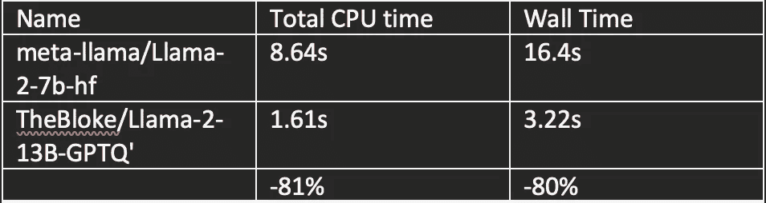

# 量化及其他：将 LLMs 的推理时间减少 80%

> 原文：[`towardsdatascience.com/quantisation-and-co-reducing-inference-times-on-llms-by-80-671db9349bdb`](https://towardsdatascience.com/quantisation-and-co-reducing-inference-times-on-llms-by-80-671db9349bdb)

[](https://medium.com/@christopher_karg?source=post_page-----671db9349bdb--------------------------------)[](https://towardsdatascience.com/?source=post_page-----671db9349bdb--------------------------------) [Christopher Karg](https://medium.com/@christopher_karg?source=post_page-----671db9349bdb--------------------------------)

·发布于[Towards Data Science](https://towardsdatascience.com/?source=post_page-----671db9349bdb--------------------------------) ·12 分钟阅读·2023 年 10 月 27 日

--


来源：[`www.pexels.com/photo/cropland-in-autumn-18684338/`](https://www.pexels.com/photo/cropland-in-autumn-18684338/)

量化是一种用于多种算法的技术，但随着最近大型语言模型（LLMs）的涌现，这一技术变得越来越普及。在本文中，我旨在提供有关 LLMs 量化的信息，以及这一技术对在本地运行这些模型的影响。我将探讨量化之外的另一种策略，这可以进一步减少运行这些模型的计算需求。我将解释这些技术为何可能对你有兴趣，并展示一些带有代码示例的基准测试，以说明这些技术的有效性。我还简要介绍了硬件需求/建议以及实现 LLM 目标的现代工具。在后续文章中，我计划提供逐步说明和代码，用于微调你自己的 LLM，请留意。

TL;DR — 通过量化我们的 LLM 并更改张量*dtype*，我们能够在具有 2 倍参数的 LLM 上进行推理，同时将*Wall time*减少 80%。

一如既往，如果你希望讨论我在这里提到的任何内容，请[联系我](http://www.linkedin.com/in/-christopherkarg)。

本文中的所有观点均为我个人意见。本文未获得赞助。

# 量化（LLMs 的量化）是什么？

量化使我们能够通过将网络的权重和偏差从原始的浮点格式（例如 32 位）转换为更低精度的格式（例如 8 位），来减少神经网络的大小。原始的浮点格式可以根据模型的架构和训练过程有所不同。量化的最终目的是减少模型的大小，从而减少内存和计算需求，以运行推理和训练模型。如果你尝试自己量化模型，量化过程可能会变得非常繁琐。这主要是因为某些供应商的硬件不支持。幸运的是，可以通过使用特定的第三方服务和软件来绕过这些限制。

就我个人而言，我在 Mac 上量化 Meta 的 Llama-2 等 LLMs 时遇到了不少麻烦。这主要是由于对标准库（或任何带有自定义 CUDA 内核的内容）的支持不足。不过，[optimum](https://github.com/huggingface/optimum) 和 [onnx](https://onnxruntime.ai/docs/performance/model-optimizations/quantization.html) 等第三方工具确实存在，可以使我们的生活稍微轻松一些。

快速且简单的选项是下载[HuggingFace](https://huggingface.co/)（HF）上提供的任何预量化模型。我特别想提到[TheBloke](https://huggingface.co/TheBloke)，他们提供了许多流行 LLMs 的量化版本，包括本文中将演示的 LLama-2 模型。有关如何对每个模型进行推理的说明可以在各自的模型卡上找到。

如果你想自己运行量化模型但没有自己的 GPU，我建议在以下网站租用 NVIDIA 硬件：

· [**Runpod.io**](https://www.runpod.io/)

· [**Lambdalabs.com**](https://lambdalabs.com/)

· [**Vast.ai**](https://vast.ai/)— 免责声明 — 使用时请自行判断。这里实际上是租用随机人的 GPU。建议在使用此服务时不要共享任何敏感信息。不过，它确实非常便宜。

如果你想购买 NVIDIA 硬件并希望获得最佳性价比，我建议购买 2 个二手 RTX3090。虽然更新的 RTX4090 具有[更好的基准性能](https://technical.city/en/video/GeForce-RTX-3090-vs-GeForce-RTX-4090)，但大型语言模型（LLMs）更需要高内存读写速度，而不是更高的处理器速度。3090 和 4090 型号在内存读写速度上差异不大，因此我认为较旧的型号提供了更好的价值。

如果你有预算，选择几乎没有限制。

作为免费的选项，我建议：

· [**Google colab**](https://colab.google/)— 在运行时提供免费的 GPU，但有一定的限制（免费层的 RAM 也有限制，不过你可以付费获得更多）。

· [**Kaggle**](https://www.kaggle.com/) 也在他们的笔记本中提供 GPU。

如果你坚持使用 Mac 硬件，我建议使用 M2 Ultra，并配备尽可能多的 RAM（理想情况下为 64GB 以上）。这仍会比上述 NVIDIA 选项慢，但如果你只是希望在 LLM 上运行推理而不是训练自己的模型，这绝对是可行的。如果你在 Mac 硬件上量化自己的模型时遇到问题，我只能推荐[Georgi Greganov 的 llama.cpp](https://github.com/ggerganov/llama.cpp)。使用这个 repo，你可以下载并编译 Meta 的 llama 2 模型为 C++并将其量化为 4 位精度。然后我们可以在这些模型上运行推理。该 repo 的 README 提供了清晰的操作说明。

# 那么，为什么我们要在本地运行/托管自己的 LLM 呢？

简短的答案是，一如既往，这取决于情况。撰写本文时，OpenAI 的 GPT4（通过 ChatGPT 提供）被广泛[认为是表现最好的 LLM](https://paperswithcode.com/paper/gpt-4-technical-report-1)。我认为定价也非常合理，而且模型本身无疑比我上述提到的策略更容易互动。你唯一需要安装的依赖是你的账户信息和信用卡号码；）。

我确实认为运行本地 LLM 有很强的理由：

**询问关于专有文档/数据的问题。**

你可以使用自己的上下文和数据对 LLM 进行微调。通过自己进行这些操作，你不会将任何信息分享给第三方，这是一大优势。

**询问关于 2021 年 9 月知识截止后的主题** **（GPT4）**。

我看到了一些 GPT4 在此时间段之后提供详细信息的情况，但模型经常指出知识截止存在。

**对模型进行微调以解决特定于你场景的问题。**

再次回到第一点，你可以调整自己的 LLM 模型以适应你的需求。

**你可以看到这些 LLM 的底层工作原理。你可以检查模型架构，并进一步发展你对技术的理解。**

**这很免费（前提是你已经有自己的硬件，并且不计算运行所需的电费）**

量化最终将帮助你在本地运行 LLM，使用比在未量化模型上运行推理时更少的计算资源。

# 基准比较 Llama-2

我现在将演示量化对 Meta 的 Llama-2 7B 和 13B 模型的影响。我在租用的 GPU 上进行了这些实验，如上所述，但也在 Google Colab 笔记本中进行了测试，以确认结果是可重复的。我们唯一需要做的编辑是运行 7B 参数模型的 8 位量化版本作为我们在 Colab 笔记本中的基准，否则在运行推断时会超出内存限制（在我看来，这已经充分证明了在运行 LLMs 时使用量化的理由！）。不过可以跟着代码示例操作 — 这些代码示例直接来自于我的免费 Colab 笔记本版本。

如果你使用的是 colab 笔记本 — 当安装诸如*accelerate*和*bitsandbytes*等依赖项时，请在笔记本中使用常规的 pip 安装。安装完成后，重启运行时。否则，软件包将无法被识别。另外，不要忘记将运行时更改为 GPU，选择运行时 > 更改运行时类型 > T4 GPU。

我应该补充说明，这一切的前提是你已经获得了 Meta 和 HF 的模型访问权限。为此，你必须首先通过此链接向 Meta 提交申请表：

[`ai.meta.com/resources/models-and-libraries/llama-downloads/`](https://ai.meta.com/resources/models-and-libraries/llama-downloads/)

接受确认的时间可能从 2 分钟到 2 天不等。请注意，你用于 Meta 表单和 HF 账户的电子邮件地址必须匹配，以便通过 HF API 使用模型。

一旦确认已收到，你可以登录到 Hugging Face 并开始使用模型。

让我们开始吧。

# 在 8 位量化下对 Llama2–7B 基础模型进行推断。

首先处理我们的导入 — 在此阶段，如果你遇到任何错误消息，请根据需要运行 pip 安装 — 安装完成后不要忘记重启你的运行时（如上所述）。

```py
from transformers import AutoModelForCausalLM,AutoTokenizer
import torch
from accelerate import Accelerator
```

接下来我们从 Hugging Face 复制模型名称，以便 API 可以下载相关模型。我们还需要输入我们的 HF 访问令牌。可以通过在 HF 网站的右上角选择你的个人资料 > 设置 > 访问令牌 > 生成令牌或复制现有令牌来找到它。

```py
model_name = "meta-llama/Llama-2-7b-hf"
hf_key = "insertyourkeyhere"
```

现在让我们下载模型：

```py
model = AutoModelForCausalLM.from_pretrained(model_name, device_map=0, load_in_8bit=True, token=hf_key)
```

在这里我们使用*device_map*参数来选择我们希望使用的硬件。在这种情况下，它选择了第一个可用的 GPU。这里可以加载自定义的*device_maps*，但这超出了本文的范围。还要注意*load_in_8bit*参数。这是我们为了减少推断运行时的内存需求而进行的量化步骤。如果你希望使用 LLMs 构建更大的项目/产品，这个简单的技术可以用于在资源有限的设备（边缘设备或手机等）上部署模型。

接下来我们设置我们的分词器：

```py
tokeniser = AutoTokenizer.from_pretrained(model_name, token=hf_key)
prompt = "A great hobby to have is "
toks = tokeniser(prompt, return_tensors="pt")
```

输入你希望的提示。我们使用的基础模型经过了文本补全的训练。

现在让我们对标记化的提示进行推理。如果有任何语法对你来说是新的，请随意查看 HF 文档。本质上，我们正在解包*toks*对象的内容并将其传递给我们的 GPU。输出限制为最多 15 个标记（如果愿意，可以编辑此参数）。*model.generate()*方法用于使用我们的 Llama2 模型生成输出。完成后，我们再次将输出传输到 CPU 内存中，以便查看我们的输出。

```py
%%time
res = model.generate(**toks.to("cuda"), max_new_tokens=15).to('cpu')
res
# OUPUT
# CPU times: user 7.47 s, sys: 1.17 s, total: 8.64 s
# Wall time: 16.4 s
```

让我们分解这些时间指标，以更好地理解我们所看到的内容。*CPU 时间*分解为三个主要组成部分：

1\. *user* — 这表示在用户模式代码中花费的时间。换句话说，就是 CPU 执行 Python 代码所需的时间。在这种情况下，花费了 7.47 秒。这个指标通常也被称为用户时间。

2\. *sys* — 这表示在系统调用或内核模式代码中花费的 CPU 时间。它是 CPU 执行操作系统相关任务的时间。在我们的案例中是 1.17 秒。

3\. *total* — 是用户时间和系统时间的总和。

接下来是*墙时间*。这指的是运行我们代码块所需的‘现实世界’时间。

*CPU 时间*和*墙时间*（7.76 秒）之间的差异是由于运行模型推理时涉及的其他内存密集型操作。这些操作包括但不限于 GPU 内存传输、调度、I/O 操作等。

让我们解码结果以查看模型的输出：

```py
tokeniser.batch_decode(res)
# OUTPUT
# ['<s> A great hobby to have is 3D printing.\nYou can make whatever you want in 3D']
```

太棒了。我们已经成功地在一个基础量化 LLM 上进行了推理。

我们可以进一步使用的一种技术是将不同的*数据类型*分配给我们在计算过程中使用的 Llama2 模型中的张量。在之前，我们通过使用*load_in_8bit=True*参数来量化模型的参数，而现在我们将使用*torch_dtype=torch.bfloat16*参数，以减少模型在推理过程中的内存使用。这第二种方法不被认为是量化技术，因为它只改变了模型张量使用的数据类型，而第一种方法涉及通过在加载期间将模型参数的精度降低到 8 位来进行量化。

这两种方法被认为是减少运行我们的 LLM 的计算需求的有效技术。让我们看看第二种技术的有效性如何。

让我们用新的参数更新我们的模型：

```py
model = AutoModelForCausalLM.from_pretrained(model_name, device_map=0, torch_dtype=torch.bfloat16)
```

此阶段 colab 可能会提示内存不足。只需通过选择 Runtime > Restart runtime 来重启运行时，并重新运行笔记本中的所有相关单元格。

现在我们用更新后的张量*数据类型*在模型上运行推理：

```py
%%time
res = model.generate(**toks.to("cuda"), max_new_tokens=15).to('cpu')
res
# OUTPUT
# CPU times: user 1.65 s, sys: 440 ms, total: 2.09 s
# Wall time: 4.7 s
```

哇。通过调整张量的*数据类型*，我们将总 CPU 时间减少了 6.66 秒。我们的墙时间减少了约 71%。让我们解码输出，看看是否注意到任何*数据类型*的变化影响：

```py
tokeniser.batch_decode(res)
# OUTPUT
# ['<s> A great hobby to have is 3D printing. It’s a fun way to create new things,']
```

我们可以使用各种指标和测试来评估和比较模型的输出。在这篇文章中，我将简单地采用人工评估。两个输出都合格、连贯且相关。考虑到在我们的第二个示例中墙上时间减少了 71%，我认为我们目前的技术是成功的。

让我们看看我们能多快在预量化的 Llama2–7B 模型上运行推理。

# 在具有更新张量数据类型的预量化 Llama2–7B 上进行推理。

托[TheBloke](https://huggingface.co/TheBloke)的福，我们能够访问 Meta 的 Llama-2 模型的预量化版本。有关量化过程的详细信息可以在[模型卡](https://huggingface.co/TheBloke/Llama-2-7b-Chat-GPTQ)中找到。

我们将使用相同的张量*数据类型*技术，这种技术使我们在墙上时间上取得了显著的减少。这次使用预量化模型。

让我们更新模型：

```py
model_name = 'TheBloke/Llama-2-7b-Chat-GPTQ'
```

名称末尾的 Q 表示模型已经完成了量化处理。

现在我们下载具有更新张量*数据类型*的模型：

```py
model = AutoModelForCausalLM.from_pretrained(model_name, device_map=0, torch_dtype=torch.float16)
```

更新分词器：

```py
tokeniser = AutoTokenizer.from_pretrained(model_name, token=hf_key)
prompt = "A great hobby to have is "
toks = tokeniser(prompt, return_tensors="pt")
```

运行推理：

```py
%%time
res = model.generate(**toks.to("cuda"), max_new_tokens=15).to('cpu')
res
# OUTPUT
# CPU times: user 1.44 s, sys: 351 ms, total: 1.79 s
# Wall time: 4.33 s
```

我们进一步进行了改进。正如你所见，总 CPU 时间减少了约 14%。墙上时间减少了约 8%。

让我们检查输出：

```py
tokeniser.batch_decode(res)
# OUTPUT
# ['<s> A great hobby to have is 3D printing.\n 3D printing is a fascinating hob']
```

现在很明显，由于我们的令牌限制设置为 15，最终的词被裁剪了。我确认我增加了令牌限制，最终的词被评估为 hobby。在人工验证方面，我仍然认为这是合格的。

现在让我们结合我们学到的所有内容，并对更大的 Llama-2–13B 模型进行推理。该模型的参数数量几乎是我们之前测试的模型的 2 倍。我们将与我们训练的第一个模型（基础的 Llama-2–7B，使用 8 位量化）进行基准测试，看看两者的比较情况。

# 在具有更新张量数据类型的预量化 Llama2–13B 上进行推理。

我们将使用相同的语法，但当然会更新模型名称。

```py
model_name = 'TheBloke/Llama-2-13B-GPTQ'
```

下载具有更新张量*数据类型*的模型：

```py
model = AutoModelForCausalLM.from_pretrained(model_name, device_map=0, torch_dtype=torch.float16)
```

更新分词器：

```py
tokeniser = AutoTokenizer.from_pretrained(model_name, token=hf_key)
prompt = "A great hobby to have is "
toks = tokeniser(prompt, return_tensors="pt")
```

运行推理：

```py
%%time
res = model.generate(**toks.to("cuda"), max_new_tokens=15).to('cpu')
res
# OUTPUT
# CPU times: user 1.45 s, sys: 167 ms, total: 1.61 s
# Wall time: 3.22 s
```

让我们将其放入上下文中：



推理时间 Meta-Llama-2–7B（8 位量化）与预量化的 LLama-2–13B（使用 float16 张量）

我们几乎将参数数量翻倍（从 7B 增加到 13B）。我们将总 CPU 时间减少了 81%，墙上时间减少了 80%。我不会撒谎，我对这个结果非常满意。

让我们获取输出：

```py
tokeniser.batch_decode(res)
# OUTPUT
# ['<s> A great hobby to have is 3D printing. It is a great way to create things that you want']
```

我们不仅通过减少计算需求大幅缩短了推理时间，而且我认为 13B 模型的输出也比我们运行推理的第一个 7B 模型更为连贯。

我希望这篇文章能向你展示这些技术在大幅度减少这些大语言模型（LLMs）推理时间方面的有效性。在我们的第一个例子中，甚至在没有应用我们自己的量化方法之前，模型是无法加载到笔记本中的。通过使用这些技术，我们能够部署一个更大的大语言模型（参数数量），将推理时间减少大约 80%，并且改善输出。如果这还不是一个积极的结果，我不知道什么是了！

我很高兴讨论和交流这里涉及的任何话题。

*所有图片属于作者，除非另有说明。*
