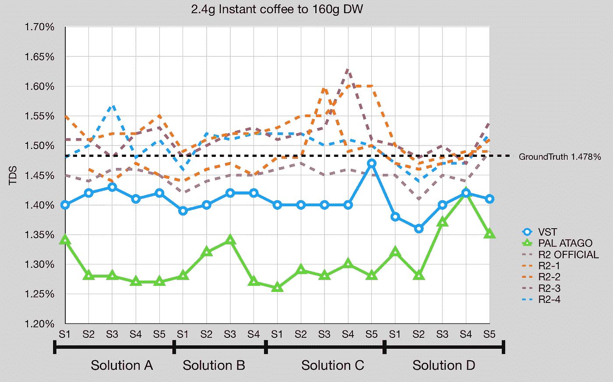

# 咖啡数据中的数量与质量

> 原文：[`towardsdatascience.com/quantity-vs-quality-in-coffee-data-d9693a3bf953?source=collection_archive---------13-----------------------#2023-03-24`](https://towardsdatascience.com/quantity-vs-quality-in-coffee-data-d9693a3bf953?source=collection_archive---------13-----------------------#2023-03-24)

## 咖啡数据科学

## 我的实验数据收集

 [Robert McKeon Aloe](https://rmckeon.medium.com/?source=post_page-----d9693a3bf953--------------------------------)

·

[关注](https://medium.com/m/signin?actionUrl=https%3A%2F%2Fmedium.com%2F_%2Fsubscribe%2Fuser%2Fae592466d35f&operation=register&redirect=https%3A%2F%2Ftowardsdatascience.com%2Fquantity-vs-quality-in-coffee-data-d9693a3bf953&user=Robert+McKeon+Aloe&userId=ae592466d35f&source=post_page-ae592466d35f----d9693a3bf953---------------------post_header-----------) 发表在 [Towards Data Science](https://towardsdatascience.com/?source=post_page-----d9693a3bf953--------------------------------) ·5 min read·Mar 24, 2023

--

在咖啡中，味道是至高无上的，但使用总溶解固体 (TDS) 来测量提取效率的量化数据已经成为评估硬件和技术的有用工具。TDS 是通过折射仪来测量的，通常偏好使用数字折射仪。

在过去一年里，数字折射仪的成本显著下降。DiFluid 推出了两款价格远低于标准的 VST 或 Atago 的折射仪。目前的数据表明，[DiFluid R2](https://medium.com/@rmckeon/difluid-r2-coffee-refractometer-device-variation-20cf1a663d99) 与 VST 或 Atago 一样有效。我认为这款折射仪提出了一个有趣的问题，即咖啡数据的可获取性越来越高：在数据收集过程中，质量还是数量更为重要？

一些数据的示例，所有图片均由作者提供。

总结一下，折射仪可以测量总溶解固体（TDS），这是理解咖啡浓度和计算萃取效率的绝佳指标。它在我的探索中已成为一个重要工具。

需要明确的是，我只制作高浓度的浓缩咖啡（12% 到 20% TDS，16% 到 24% EY），而折射仪可能在处理如过滤咖啡等低浓度饮品时面临其他挑战。然而，我不会讨论这些话题。

尽管我拥有三台数字折射仪：Atago、DiFluid 和 DiFluid R2，但我尚未发布如何使用折射仪进行 TDS 测量的常规操作。我一直在通过多次探索，以数据证明我的某些操作是否相对于收集样品所花费的时间是有价值的，例如：

1.  [冷却](https://rmckeon.medium.com/total-dissolved-solids-tds-in-coffee-is-slightly-affected-by-sample-temperature-929390babf2d)样品至指定温度（通常与校准温度相同）。

1.  过滤样品时使用注射器过滤器

1.  每个样品使用新的移液管

1.  用酒精清洁玻璃样品盘

1.  每个样品都需校准设备

包含所有步骤的常规操作可能需要一段时间，而且这样会减少在相同时间内收集的数据量。

# 协议遵守

我做数据相关工作已经很长时间了（超过十年）。在用户研究中通常会出现的问题之一是数据质量与数量的关系。为了获得更好的数据质量，一个人必须更好地遵守协议，但遵守协议需要时间。然而，一旦应用机器学习算法，数据中仍会添加一定量的噪音。结果显示，即使质量较低的更多数据，对于某些实验来说也可能更可取，因为我们没有整天的时间去做所有事情。

所以即使信号中存在噪音，快速收集更多样品可以使噪音被平均。我也喜欢将这一点应用到咖啡上，因为我还有其他生活中的事情要做。

并不是每个人都有实验室、资金和时间来控制所有变量。所以尽可能控制。即使有噪音，只要噪音是稳定的，那么它比随机噪音更可控。最糟糕的是噪音中的系统偏差。

# 咖啡样品

另一个需要考虑的因素是，咖啡的折射测量尚不完全明确。我们知道折射率与 TDS 之间有联系，但仍有一些灰色地带。糖水有非常清晰的折射率，但通过光学折射仪观察，咖啡并没有那么明显的分界线。

从咖啡开始到结束的溶解物是否造成相同的折射？

任何给定的咖啡饮品有多均匀？

基本上，假设折射仪是完美的，那么固有噪声是多少？如果这个噪声比其他协议步骤大得多，那么这些步骤应重新考虑。

# 其他需要考虑的问题：

1.  数字折射仪是否会出现校准漂移？

1.  这些设备是否也能优雅地老化？

1.  如果两个样品在比校准更高的温度下采集，这重要吗？温度是否以相同的方式影响读数，还是一个受控变量？

DiFluid 设备很有趣，因为它们还输出折射率。这有助于显示读数是否由于温度变化或其他因素造成。

# 当前常规

我将分享我目前的常规，但这可能会有所变化。这一常规是数据驱动的，以下是简短版本，后跟长版本及其理由：

1.  设备：DiFluid R2

1.  校准：我很少校准我的设备。

1.  样品采集：我搅拌样品并使用移液管进行采集。之后我会冲洗并重复使用移液管。

1.  样品过滤：我不过滤我的样品。

1.  样品温度：我没有对样品温度进行校正。

1.  样品数量：1

1.  清洁镜头：我使用微纤维毛巾。

长格式：

1.  [R2 至少与 Atago 一样准确](https://medium.com/@rmckeon/difluid-r2-coffee-refractometer-device-variation-20cf1a663d99)，数据表明它更准确，可能比 VST 更准确。它还比 Atago 提供的读数更快。

1.  校准：我很少校准我的设备。我没有测试校准漂移，但如果有漂移，它应该会对我的所有样品产生相同的影响并进行平均。如果其他数据已经产生，我愿意调整我的常规。

1.  样品采集：我搅拌样品并使用移液管进行采集。我不喜欢浪费移液管，所以之后我会冲洗它们并继续使用，直到我决定更换。对于折射仪上的糖测试，我使用新的移液管。目前还不确定这对样品的影响有多大。

1.  样品过滤：我不过滤样品。证据表明过滤样品不会提高准确性，只能提高精确度。我通常会收集比需要更多的样品来弥补精确度。

1.  样品温度：我没有对样品温度进行校正。我查看了样品温度，发现冷却样品与使用热样品时有一个小但统计上显著的变化。然而，只要我对所有样品都做相同的处理，这个变量就不会影响结论，因为性能是相对的。奇怪的是，我最近一直在做提取冷却，所以我的样品比以前冷得多。

1.  样本数量：一个。我对收集更多样本不感兴趣，但我在 过去 曾展示过，如果你把样本留在设备上几分钟，它会蒸发，读取结果会发生变化。我也不确定多次取样是否会提高质量。

1.  清洁镜头：我使用微纤维毛巾。我不使用酒精或酒精擦拭布。如果你留意，玻璃会清洁得相当干净。

我希望例行程序不会阻碍你收集数据。最终，数据分析会告诉你是否需要改进数据收集，因为关键因素是你收集和分析数据的经验。

如果你愿意，可以关注我的 [Twitter](https://mobile.twitter.com/espressofun)、[YouTube](https://m.youtube.com/channel/UClgcmAtBMTmVVGANjtntXTw) 和 [Instagram](https://www.instagram.com/espressofun/)，我会在这些平台上发布不同机器上的浓缩咖啡镜头和相关内容。你也可以在 [LinkedIn](https://www.linkedin.com/in/dr-robert-mckeon-aloe-01581595) 找到我。你还可以在 [Medium](https://towardsdatascience.com/@rmckeon/follow) 关注我并 [订阅](https://rmckeon.medium.com/subscribe)。

# [我的进一步阅读](https://rmckeon.medium.com/story-collection-splash-page-e15025710347)

[我的书](https://www.kickstarter.com/projects/espressofun/engineering-better-espresso-data-driven-coffee)

[我的链接](https://rmckeon.medium.com/my-links-5de9eb69c26b)

[浓缩咖啡文章汇集](https://rmckeon.medium.com/a-collection-of-espresso-articles-de8a3abf9917?postPublishedType=repub)

[工作和学校故事的汇集](https://rmckeon.medium.com/a-collection-of-work-and-school-stories-6b7ca5a58318)
