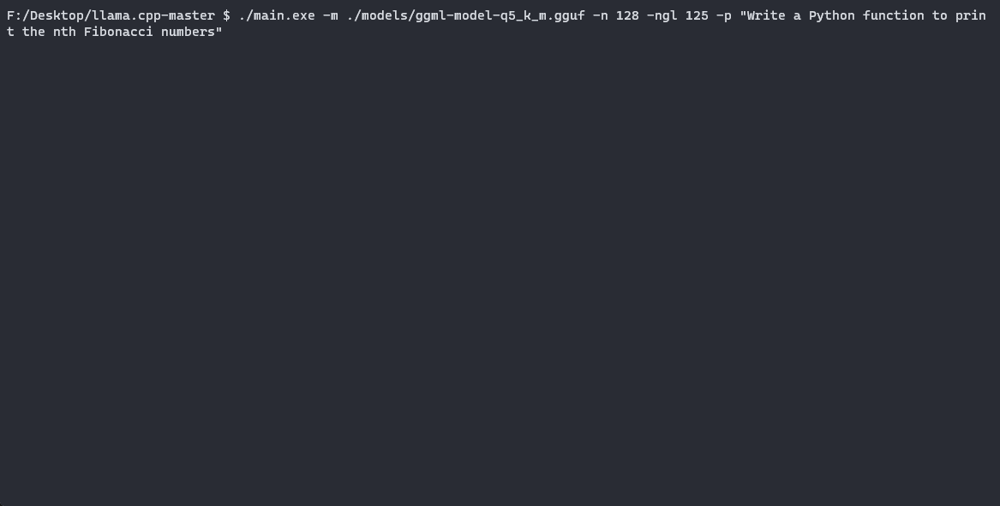
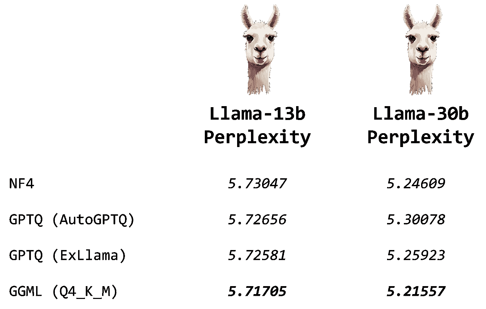

# 使用 GGUF 和 llama.cpp 对 Llama 模型进行量化

> 原文：[`towardsdatascience.com/quantize-llama-models-with-ggml-and-llama-cpp-3612dfbcc172?source=collection_archive---------0-----------------------#2023-09-04`](https://towardsdatascience.com/quantize-llama-models-with-ggml-and-llama-cpp-3612dfbcc172?source=collection_archive---------0-----------------------#2023-09-04)

## GGML 与 GPTQ 与 NF4

[](https://medium.com/@mlabonne?source=post_page-----3612dfbcc172--------------------------------)[](https://towardsdatascience.com/?source=post_page-----3612dfbcc172--------------------------------) [Maxime Labonne](https://medium.com/@mlabonne?source=post_page-----3612dfbcc172--------------------------------)

·

[关注](https://medium.com/m/signin?actionUrl=https%3A%2F%2Fmedium.com%2F_%2Fsubscribe%2Fuser%2Fdc89da634938&operation=register&redirect=https%3A%2F%2Ftowardsdatascience.com%2Fquantize-llama-models-with-ggml-and-llama-cpp-3612dfbcc172&user=Maxime+Labonne&userId=dc89da634938&source=post_page-dc89da634938----3612dfbcc172---------------------post_header-----------) 发表在 [Towards Data Science](https://towardsdatascience.com/?source=post_page-----3612dfbcc172--------------------------------) · 9 分钟阅读 · 2023 年 9 月 4 日[](https://medium.com/m/signin?actionUrl=https%3A%2F%2Fmedium.com%2F_%2Fvote%2Ftowards-data-science%2F3612dfbcc172&operation=register&redirect=https%3A%2F%2Ftowardsdatascience.com%2Fquantize-llama-models-with-ggml-and-llama-cpp-3612dfbcc172&user=Maxime+Labonne&userId=dc89da634938&source=-----3612dfbcc172---------------------clap_footer-----------)

--

[](https://medium.com/m/signin?actionUrl=https%3A%2F%2Fmedium.com%2F_%2Fbookmark%2Fp%2F3612dfbcc172&operation=register&redirect=https%3A%2F%2Ftowardsdatascience.com%2Fquantize-llama-models-with-ggml-and-llama-cpp-3612dfbcc172&source=-----3612dfbcc172---------------------bookmark_footer-----------)

作者提供的图片

由于大型语言模型（LLMs）的庞大规模，量化已成为高效运行这些模型的关键技术。通过降低权重的精度，可以节省内存并加速推理，同时保持模型的绝大部分性能。近期，8 位和 4 位量化技术使**在消费级硬件上运行 LLMs**成为可能。加上 Llama 模型的发布及其参数高效微调技术（如 LoRA、QLoRA），这形成了一个丰富的本地 LLM 生态系统，与 OpenAI 的 GPT-3.5 和 GPT-4 竞争。

除了在[这篇文章](https://medium.com/towards-data-science/introduction-to-weight-quantization-2494701b9c0c)中讨论的天真方法外，还有三种主要的量化技术：NF4、GPTQ 和 GGML。[NF4](https://huggingface.co/blog/4bit-transformers-bitsandbytes)是一种静态方法，QLoRA 使用它以 4 位精度加载模型进行微调。[在上一篇文章中](https://medium.com/towards-data-science/4-bit-quantization-with-gptq-36b0f4f02c34)，我们探讨了 GPTQ 方法，并将自己的模型量化以在消费级 GPU 上运行。在这篇文章中，我们将介绍 GGML 技术，看看如何量化 Llama 模型，并提供实现最佳结果的技巧和窍门。

你可以在[Google Colab](https://colab.research.google.com/drive/1pL8k7m04mgE5jo2NrjGi8atB0j_37aDD?usp=sharing)和[GitHub](https://github.com/mlabonne/llm-course)上找到代码。

# 什么是 GGML？

GGML 是一个专注于机器学习的 C 语言库。它由 Georgi Gerganov 创建，"GG"就是这个名字的缩写。这个库不仅提供了机器学习的基础元素，如张量，还提供了**独特的二进制格式**以分发 LLM。

这个格式最近更改为**GGUF**。这个新格式旨在可扩展，以便新功能不会破坏与现有模型的兼容性。它还将所有元数据集中在一个文件中，如特殊令牌、RoPE 缩放参数等。简而言之，它解决了一些历史痛点，并且应该具有未来保障。有关更多信息，你可以阅读[这个地址](https://github.com/philpax/ggml/blob/gguf-spec/docs/gguf.md)上的规范。在本文的其余部分，我们将称所有使用 GGUF 或以前格式的模型为“GGML 模型”。

GGML 旨在与[llama.cpp](https://github.com/ggerganov/llama.cpp)库一起使用，该库也由 Georgi Gerganov 创建。这个库是用 C/C++编写的，以便高效推断 Llama 模型。它可以加载 GGML 模型并**在 CPU 上运行**。最初，这与 GPTQ 模型的主要区别在于 GPTQ 模型是在 GPU 上加载和运行的。然而，现在你可以通过 llama.cpp 将一些 LLM 的层卸载到 GPU 上。举个例子，7b 参数模型有 35 层。这大大加快了推断速度，并允许你运行那些无法完全装入 VRAM 的 LLM。



图片由作者提供

如果命令行工具是你的强项，llama.cpp 和 GGUF 支持已集成到许多 GUI 中，如 oobabooga 的 [text-generation-web-ui](https://github.com/oobabooga/text-generation-webui)、[koboldcpp](https://github.com/LostRuins/koboldcpp)、[LM Studio](https://lmstudio.ai/) 或 [ctransformers](https://github.com/marella/ctransformers)。你可以使用这些工具加载你的 GGML 模型，并以类似 ChatGPT 的方式与其互动。幸运的是，许多量化模型直接可以在 [Hugging Face Hub](https://huggingface.co/models?search=gg) 上获得。你会很快注意到，大多数模型都是由 LLM 社区中的知名人物 [TheBloke](https://huggingface.co/TheBloke) 进行量化的。

在下一部分，我们将看到如何量化我们自己的模型并在消费级 GPU 上运行它们。

# 如何用 GGML 对 LLM 进行量化？

我们来看看 [TheBloke/Llama-2–13B-chat-GGML](https://huggingface.co/TheBloke/Llama-2-13B-chat-GGML/tree/main) 仓库中的文件。我们可以看到**14 种不同的 GGML 模型**，对应不同的量化类型。它们遵循特定的命名规则：“q” + 存储权重的位数（精度）+ 特定变体。以下是所有可能的量化方法及其对应的使用场景，基于 TheBloke 制作的模型卡：

+   `q2_k`：对 attention.vw 和 feed_forward.w2 张量使用 Q4_K，对其他张量使用 Q2_K。

+   `q3_k_l`：对 attention.wv、attention.wo 和 feed_forward.w2 张量使用 Q5_K，其余张量使用 Q3_K

+   `q3_k_m`：对 attention.wv、attention.wo 和 feed_forward.w2 张量使用 Q4_K，其余张量使用 Q3_K

+   `q3_k_s`：对所有张量使用 Q3_K

+   `q4_0`：原始量化方法，4 位。

+   `q4_1`：比 q4_0 精度更高，但不如 q5_0 高。不过推理速度比 q5 模型快。

+   `q4_k_m`：对一半的 attention.wv 和 feed_forward.w2 张量使用 Q6_K，其余张量使用 Q4_K

+   `q4_k_s`：对所有张量使用 Q4_K

+   `q5_0`：更高的精度，更高的资源使用和较慢的推理。

+   `q5_1`：更高的精度，更高的资源使用和更慢的推理。

+   `q5_k_m`：对一半的 attention.wv 和 feed_forward.w2 张量使用 Q6_K，其余张量使用 Q5_K

+   `q5_k_s`：对所有张量使用 Q5_K

+   `q6_k`：对所有张量使用 Q8_K

+   `q8_0`：几乎无法与 float16 区分。高资源使用和较慢。不推荐给大多数用户。

作为经验法则，**我推荐使用 Q5_K_M**，因为它保留了大部分模型的性能。或者，如果你想节省一些内存，可以使用 Q4_K_M。一般来说，K_M 版本比 K_S 版本更好。我不推荐 Q2 或 Q3 版本，因为它们会大幅降低模型性能。

既然我们对可用的量化类型有了更多了解，接下来我们来看看如何在真实模型中使用它们。你可以在[Google Colab](https://colab.research.google.com/drive/1pL8k7m04mgE5jo2NrjGi8atB0j_37aDD?usp=sharing)上的**免费 T4 GPU**上执行以下代码。第一步是编译 llama.cpp 并在我们的 Python 环境中安装所需的库。

```py
# Install llama.cpp
!git clone https://github.com/ggerganov/llama.cpp
!cd llama.cpp && git pull && make clean && LLAMA_CUBLAS=1 make
!pip install -r llama.cpp/requirements.txt
```

现在我们可以下载我们的模型了。我们将使用我们在[上一篇文章](https://medium.com/towards-data-science/a-beginners-guide-to-llm-fine-tuning-4bae7d4da672)中微调过的模型，`[mlabonne/EvolCodeLlama-7b](https://huggingface.co/mlabonne/EvolCodeLlama-7b)`。

```py
MODEL_ID = "mlabonne/EvolCodeLlama-7b"

# Download model
!git lfs install
!git clone https://huggingface.co/{MODEL_ID}
```

这一步可能需要一些时间。一旦完成，我们需要将权重转换为 GGML FP16 格式。

```py
MODEL_NAME = MODEL_ID.split('/')[-1]

# Convert to fp16
fp16 = f"{MODEL_NAME}/{MODEL_NAME.lower()}.fp16.bin"
!python llama.cpp/convert.py {MODEL_NAME} --outtype f16 --outfile {fp16}
```

最后，我们可以使用一种或几种方法来量化模型。在这种情况下，我们将使用我之前推荐的 Q4_K_M 和 Q5_K_M 方法。这是唯一实际上需要 GPU 的步骤。

```py
QUANTIZATION_METHODS = ["q4_k_m", "q5_k_m"]

for method in QUANTIZATION_METHODS:
    qtype = f"{MODEL_NAME}/{MODEL_NAME.lower()}.{method.upper()}.gguf"
    !./llama.cpp/quantize {fp16} {qtype} {method}
```

我们的两个量化模型现在**已准备好进行推断**。我们可以检查 bin 文件的大小，以查看我们压缩了多少。FP16 模型占用 13.5 GB，而 Q4_K_M 模型占用 4.08 GB（小了 3.3 倍），Q5_K_M 模型占用 4.78 GB（小了 2.8 倍）。

让我们使用 llama.cpp 来高效运行它们。由于我们使用的是具有 16 GB VRAM 的 GPU，我们可以将每一层都卸载到 GPU 上。在这种情况下，它代表 35 层（7b 参数模型），因此我们将使用 `-ngl 35` 参数。在下面的代码块中，我们还将输入一个提示和我们想使用的量化方法。

```py
import os

model_list = [file for file in os.listdir(MODEL_NAME) if "gguf" in file]

prompt = input("Enter your prompt: ")
chosen_method = input("Name of the model (options: " + ", ".join(model_list) + "): ")

# Verify the chosen method is in the list
if chosen_method not in model_list:
    print("Invalid name")
else:
    qtype = f"{MODEL_NAME}/{MODEL_NAME.lower()}.{method.upper()}.gguf"
    !./llama.cpp/main -m {qtype} -n 128 --color -ngl 35 -p "{prompt}"
```

让我们使用 Q5_K_M 方法向模型提出“编写一个 Python 函数来打印第 n 个斐波那契数”的请求。如果我们查看日志，我们可以确认我们成功将层卸载了，感谢“llm_load_tensors: offloaded 35/35 layers to GPU”这一行。这里是模型生成的代码：

```py
def fib(n):
    if n == 0 or n == 1:
        return n
    return fib(n - 2) + fib(n - 1)

for i in range(1, 10):
    print(fib(i))
```

这不是一个非常复杂的提示，但它很快生成了一个有效的代码片段。使用 llama.cpp，你可以在终端中使用交互模式（`-i` 标志）将本地 LLM 作为助手。注意，这也适用于配备苹果 Metal 性能着色器（MPS）的 Macbook，这是一种运行 LLM 的优秀选择。

最后，我们可以将我们的量化模型推送到 Hugging Face Hub 上的新仓库，并使用“ -GGUF”后缀。首先，让我们登录并修改以下代码块以匹配你的用户名。

```py
!pip install -q huggingface_hub

username = "mlabonne"

from huggingface_hub import notebook_login, create_repo, HfApi
notebook_login()
```

最后，我们可以将量化后的模型推送到 Hugging Face Hub 上的新仓库，并使用 "-GGUF" 后缀。首先，让我们登录并修改以下代码块以匹配你的用户名。你可以在 Google Colab 的“Secrets”选项卡中输入你的 Hugging Face 令牌（[`huggingface.co/settings/tokens`](https://huggingface.co/settings/tokens)）。我们使用 `allow_patterns` 参数仅上传 GGUF 模型，而不是整个目录。

```py
!pip install -q huggingface_hub
from huggingface_hub import create_repo, HfApi
from google.colab import userdata

# Defined in the secrets tab in Google Colab
hf_token = userdata.get('huggingface')

api = HfApi()
username = "mlabonne"

# Create empty repo
create_repo(
    repo_id = f"{username}/{MODEL_NAME}-GGUF",
    repo_type="model",
    exist_ok=True,
    token=hf_token
)

# Upload gguf files
api.upload_folder(
    folder_path=MODEL_NAME,
    repo_id=f"{username}/{MODEL_NAME}-GGUF",
    allow_patterns=f"*.gguf",
    token=hf_token
)
```

我们已经成功量化、运行并推送了 GGML 模型到 Hugging Face Hub！在下一部分，我们将深入探讨 GGML 如何实际量化这些模型。

# 使用 GGML 进行量化

GGML 量化权重的方式不如 GPTQ 那么复杂。基本上，它将值块分组并将它们舍入到较低的精度。一些技术，如 Q4_K_M 和 Q5_K_M，实现了**对关键层的更高精度**。在这种情况下，每个权重都以 4 位精度存储，除了注意力.wv 和 feed_forward.w2 张量的一半。实验结果表明，这种混合精度在准确性和资源使用之间提供了一个良好的折衷。

如果我们查看[ggml.c 文件](https://github.com/ggerganov/ggml/blob/master/src/ggml.c)，可以看到块是如何定义的。例如，`block_q4_0` 结构定义如下：

```py
#define QK4_0 32
typedef struct {
    ggml_fp16_t d;          // delta
    uint8_t qs[QK4_0 / 2];  // nibbles / quants
} block_q4_0;
```

在 GGML 中，权重按块处理，每块包含 32 个值。对于每块，从最大权重值派生出一个缩放因子（delta）。然后对块中的所有权重进行缩放、量化，并高效打包以进行存储（nibbles）。这种方法显著减少了存储需求，同时允许在原始权重和量化权重之间进行相对简单且确定的转换。

现在我们对量化过程有了更多了解，我们可以将结果与 NF4 和 GPTQ 进行比较。

# NF4 vs. GGML vs. GPTQ

哪种技术更适合 4 位量化？为了回答这个问题，我们需要介绍运行这些量化 LLM 的不同后端。对于 GGML 模型，使用 Q4_K_M 模型的 llama.cpp 是最佳选择。对于 GPTQ 模型，我们有两个选项：[AutoGPTQ](https://github.com/PanQiWei/AutoGPTQ) 或 [ExLlama](https://github.com/turboderp/exllama)。最后，NF4 模型可以直接在 transformers 中通过 `--load-in-4bit` 标志运行。

Oobabooga 在一篇出色的[博客文章](https://oobabooga.github.io/blog/posts/perplexities/)中进行了多个实验，比较了不同模型在困惑度方面的表现（困惑度越低越好）：



基于这些结果，我们可以说 GGML 模型在困惑度方面略有优势。差异并不特别显著，这也是为什么在生成速度（以 token/秒计）方面更值得关注。最佳技术取决于你的 GPU：如果你有足够的 VRAM 可以容纳整个量化模型，**GPTQ 和 ExLlama** 将是最快的。如果不是这样，你可以卸载一些层并使用**GGML 模型和 llama.cpp** 来运行你的 LLM。

# 结论

在这篇文章中，我们介绍了 GGML 库和新的 GGUF 格式，以高效地存储这些量化模型。我们使用它来**量化我们自己的 Llama 模型**为不同格式（Q4_K_M 和 Q5_K_M）。随后，我们运行了 GGML 模型，并将我们的二进制文件推送到了 Hugging Face Hub。最后，我们深入研究了 GGML 的代码，以理解它是如何实际量化权重的，并将其与 NF4 和 GPTQ 进行了比较。

量化是使大型语言模型（LLMs）变得更加普及的强大手段，通过降低运行成本来实现。在未来，混合精度和其他技术将不断提升我们使用量化权重时可以达到的性能。在此之前，希望你喜欢阅读这篇文章，并从中学到了新知识。

如果你对 LLMs 的更多技术内容感兴趣，[请在 Medium 上关注我](https://medium.com/@mlabonne)。

# 关于量化的文章

[](/introduction-to-weight-quantization-2494701b9c0c?source=post_page-----3612dfbcc172--------------------------------) ## 第一部分：权重量化简介

### 使用 8 位量化减少大型语言模型的体积

towardsdatascience.com [](/4-bit-quantization-with-gptq-36b0f4f02c34?source=post_page-----3612dfbcc172--------------------------------) ## 第二部分：使用 GPTQ 的 4 位量化

### 使用 AutoGPTQ 量化你自己的 LLMs

towardsdatascience.com

*通过一次点击了解更多关于机器学习的信息并支持我的工作 — 立即成为 Medium 会员：*

[](https://medium.com/@mlabonne/membership?source=post_page-----3612dfbcc172--------------------------------) [## 通过我的推荐链接加入 Medium — Maxime Labonne

### 作为 Medium 会员，你的一部分会员费用将用于支持你阅读的作者，同时你可以完全访问每一个故事…

medium.com](https://medium.com/@mlabonne/membership?source=post_page-----3612dfbcc172--------------------------------)
