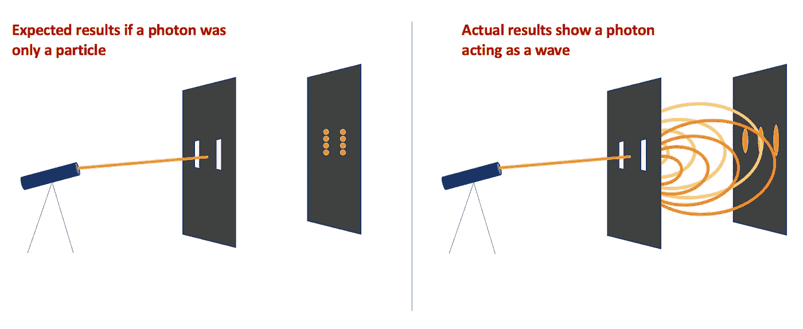
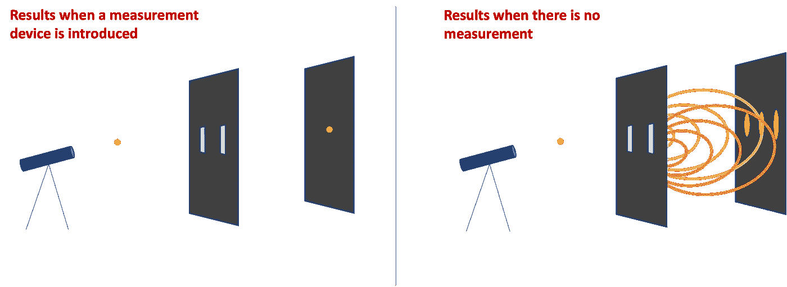
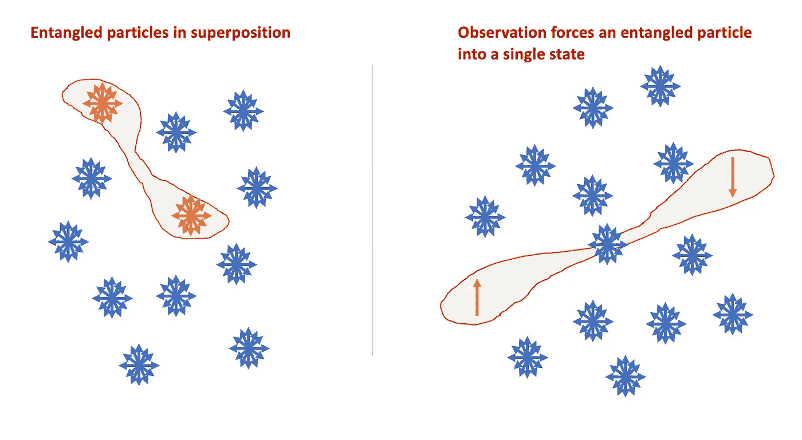

# 量子计算机在人工智能和机器学习革命中的作用

> 原文：[`towardsdatascience.com/quantum-computers-in-the-revolution-of-artificial-intelligence-and-machine-learning-c5b0356903f3`](https://towardsdatascience.com/quantum-computers-in-the-revolution-of-artificial-intelligence-and-machine-learning-c5b0356903f3)

 [Molly Ruby](https://medium.com/@molly.ruby?source=post_page-----c5b0356903f3--------------------------------)

·发表于 [Towards Data Science](https://towardsdatascience.com/?source=post_page-----c5b0356903f3--------------------------------) ·阅读时间 7 分钟·2023 年 3 月 18 日

--

一个易于理解的量子计算机工作原理介绍，说明它们为何在演进 AI 和 ML 系统中至关重要。获得对这些机器背后量子原理的简单理解。

由作者使用 Microsoft Icons 创建的图像。

量子计算是一个迅速发展的领域，有能力彻底改变人工智能（AI）和机器学习（ML）。随着对更大、更好和更准确的 AI 和 ML 的需求加速，标准计算机将被推到其能力的极限。量子计算机基于并行化，并能够处理更复杂的算法，将是解锁下一代 AI 和 ML 模型的关键。本文旨在通过拆解一些实现量子计算的关键原理来揭示量子计算机的工作原理。

量子计算机是一种可以并行执行多个任务的机器，使其能够非常快速地解决极其复杂的问题。尽管传统计算机将继续满足普通人的日常需求，但量子计算机的快速处理能力有潜力彻底改变许多行业，远远超出传统计算工具的可能性。通过同时运行数百万次模拟，量子计算可以应用于，

+   **化学和生物工程：**复杂的模拟能力可能使科学家能够发现和测试新药物和资源，而无需耗费实验室实验的时间、风险和费用。

+   **金融投资：**市场波动极其难以预测，因为它们受大量复合因素的影响。这些几乎无限的可能性可以通过量子计算机进行建模，从而比标准机器提供更高的复杂性和更好的准确性。

+   **操作与制造：**一个给定的过程可能有成千上万的相互依赖的步骤，这使得制造中的优化问题变得复杂。由于有如此多的可能排列，模拟制造过程需要大量计算，通常需要假设以缩小可能性的范围以适应计算限制。量子计算机的固有并行性将使不受限制的模拟成为可能，从而在制造中实现前所未有的优化水平。

# 叠加态——固有的并行性

量子计算机依赖于叠加态的概念。在量子力学中，叠加态是指同时存在于多个状态的概念。叠加态的一个条件是它不能被直接观察，因为观察本身会迫使系统进入一个单一状态。在叠加态中，观察任何给定状态的概率是一定的。

## 对叠加态的直观理解

在 1935 年，物理学家厄尔温·薛定谔在给阿尔伯特·爱因斯坦的一封信中分享了一个思想实验，这个实验概括了叠加态的概念。在这个思想实验中，薛定谔描述了一只被封闭在一个容器中的猫，容器里有一个放射性原子，这个原子有 50%的几率衰变并释放出致命的辐射。薛定谔解释说，在观察者打开箱子并查看里面之前，猫是活着还是死去的概率是相等的。在箱子未被打开之前，可以认为猫同时存在于活着*和*死去的状态。打开箱子并观察猫的行为使其被迫进入一个单一的死或活的状态。

## 对叠加态的实验理解

1801 年，托马斯·扬进行的一个更具象的实验展示了叠加态，尽管叠加态的含义直到许多年后才被理解。在这个实验中，一束光线被照射到一个有两个狭缝的屏幕上。期望是每个狭缝后面会在板上出现一束光。然而，扬观察到了几个光强度增强的峰值和光强度减少的谷值，而不仅仅是两个光点。这一模式使扬得出结论，光子在通过屏幕上的狭缝时必须表现为波动现象。他得出这个结论是因为他知道，当两条波相互干涉时，如果它们都是峰值，它们会叠加在一起， resulting in a 增强的统一波（产生光点）。相反，当两条波处于相反位置时，它们会相互抵消（产生黑暗的谷值）。

双缝实验。**左**：如果光子仅作为粒子存在时的预期结果。**右**：实际结果表明光子可以作为波动存在。图像由作者创建。

虽然波粒二象性的结论一直存在，但随着技术的发展，这一实验的意义也发生了变化。科学家们发现，即使一次只发射一个光子，波动模式也会出现在后面的屏幕上。这意味着单个粒子通过了两个缝隙，并作为两波交汇。然而，当光子击中屏幕并被测量时，它显示为单独的光子。测量光子位置的行为迫使它重新组合为单一状态，而不是在通过屏幕时的多重状态。这一实验展示了叠加态。

双缝实验显示了叠加态，因为光子在测量发生之前存在于多种状态中。**左**：引入测量设备时的结果。**右**：没有测量时的结果。图像由作者创建。

## 叠加态在量子计算机中的应用

标准计算机通过操作二进制数字（比特）来工作，比特存储在两种状态中的一种，0 和 1。相比之下，量子计算机使用量子比特（qubits）。量子比特可以处于叠加态，因此它们不仅限于 0 或 1，而是同时存在于 0 和 1 以及若干种介于 0 和 1 之间的状态。这种状态的叠加使得量子计算机能够并行处理数百万个算法。

量子比特通常由如光子和电子等亚原子粒子构成，双缝实验确认这些粒子可以处于叠加态。科学家们通过激光或微波束将这些亚原子粒子强制进入叠加态。

[约翰·戴维森](https://www.afr.com/technology/quantum-computing-101-what-s-superposition-entanglement-and-a-qubit-20191218-p53l2j)用一个简单的例子解释了使用量子比特而非比特的优势。因为标准计算机中的一切都是由 0 和 1 构成的，当在标准机器上运行模拟时，机器会遍历不同的 0 和 1 序列（即比较 00000001 与 10000001）。由于量子比特同时存在于 0 和 1 状态，不需要尝试不同的组合。相反，单次模拟将同时包含所有可能的 0 和 1 组合。这种固有的并行性使得量子计算机能够同时处理数百万次计算。

# 纠缠 — 指数级的处理能力

在量子力学中，纠缠的概念描述了量子粒子相互作用并纠缠在一起的倾向，以至于它们无法孤立描述，因为一个粒子的状态受到另一个粒子状态的影响。当两个粒子纠缠在一起时，它们的状态是相互依赖的，无论彼此的距离如何。如果一个量子位的状态发生变化，配对的量子位状态也会瞬间变化。爱因斯坦惊叹地将这种距离无关的伙伴关系描述为“遥远的诡异行动”。

因为观察一个量子粒子会迫使其进入孤立状态，科学家们发现如果一个纠缠对中的粒子具有向上的自旋，则配对粒子将具有相反的、向下的自旋。尽管我们仍未完全理解这种现象的发生原因，但其对量子计算的影响已十分强大。

**左**：两个处于叠加态的粒子变得纠缠在一起。 **右**：一次观察迫使一个粒子进入向上的自旋。作为回应，配对粒子进入向下的自旋。即使这些粒子被距离分隔，它们仍然保持纠缠状态，并且它们的状态彼此依赖。图片由作者创作。

在量子计算中，科学家利用了这一现象。空间设计的算法在纠缠的量子位上工作，从而大幅加速计算。在标准计算机中，添加一个比特会线性增加处理能力。因此，如果比特数翻倍，处理能力也会翻倍。在量子计算机中，添加量子位会指数级增加处理能力。因此，添加一个量子位会极大地提高计算能力。

# 去相干 —— 量子错误

尽管纠缠为量子计算提供了巨大的优势，但实际应用却面临严峻的挑战。如前所述，观察一个量子粒子会迫使其进入一个特定的状态，而不是继续处于叠加态。在量子系统中，任何外部干扰（温度变化、振动、光线等）都可以被视为一种“观察”，迫使量子粒子假设一个特定的状态。由于粒子变得越来越纠缠和状态依赖，它们尤其容易受到外部干扰的影响。这是因为干扰只需影响一个量子位，就会对许多纠缠的量子位产生连锁反应。当一个量子位被强迫进入 0 或 1 状态时，它会丧失叠加态中包含的信息，导致算法完成前出现错误。这一挑战被称为去相干，已阻碍了量子计算机的实际使用。去相干的测量方式是错误率。

某些物理误差减少技术已被用来最小化外界干扰，包括将量子计算机保持在冰冻温度和真空环境中，但到目前为止，这些措施在量子误差率方面并未产生足够显著的改善。科学家们还在探索错误更正代码，以修复错误而不影响信息。虽然[谷歌最近部署了一个错误更正代码](https://www.nature.com/articles/d41586-023-00536-w)，这导致了历史上最低的错误率，但信息丢失仍然过高，无法在实际中使用量子计算机。误差减少目前是物理学家的主要关注点，因为这是实际量子计算的最大障碍。

尽管还需要更多工作来实现量子计算机的实际应用，但显然有巨大的机会利用量子计算来部署高度复杂的人工智能和机器学习模型，从而提升各种行业。

快乐学习！

## 来源

叠加态: [`scienceexchange.caltech.edu/topics/quantum-science-explained/quantum-superposition`](https://scienceexchange.caltech.edu/topics/quantum-science-explained/quantum-superposition)

纠缠: [`quantum-computing.ibm.com/composer/docs/iqx/guide/entanglement`](https://quantum-computing.ibm.com/composer/docs/iqx/guide/entanglement)

量子计算机: [`builtin.com/hardware/quantum-computing`](https://builtin.com/hardware/quantum-computing)
