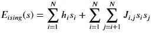
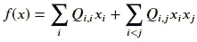
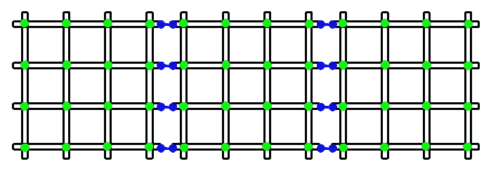
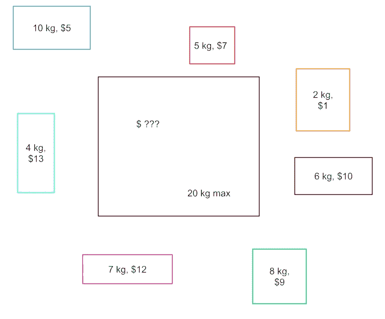

# 量子计算在优化问题中的应用——解决背包问题

> 原文：[`towardsdatascience.com/quantum-computing-for-optimization-problems-solving-the-knapsack-problem-274f01e78ed8?source=collection_archive---------7-----------------------#2023-01-16`](https://towardsdatascience.com/quantum-computing-for-optimization-problems-solving-the-knapsack-problem-274f01e78ed8?source=collection_archive---------7-----------------------#2023-01-16)

## 如何使用量子计算解决优化问题，与传统解决方案相比

[](https://florin-andrei.medium.com/?source=post_page-----274f01e78ed8--------------------------------)[](https://towardsdatascience.com/?source=post_page-----274f01e78ed8--------------------------------) [Florin Andrei](https://florin-andrei.medium.com/?source=post_page-----274f01e78ed8--------------------------------)

·

[关注](https://medium.com/m/signin?actionUrl=https%3A%2F%2Fmedium.com%2F_%2Fsubscribe%2Fuser%2Faeaeb9d7d248&operation=register&redirect=https%3A%2F%2Ftowardsdatascience.com%2Fquantum-computing-for-optimization-problems-solving-the-knapsack-problem-274f01e78ed8&user=Florin+Andrei&userId=aeaeb9d7d248&source=post_page-aeaeb9d7d248----274f01e78ed8---------------------post_header-----------) 发表在 [Towards Data Science](https://towardsdatascience.com/?source=post_page-----274f01e78ed8--------------------------------) ·12 分钟阅读·2023 年 1 月 16 日[](https://medium.com/m/signin?actionUrl=https%3A%2F%2Fmedium.com%2F_%2Fvote%2Ftowards-data-science%2F274f01e78ed8&operation=register&redirect=https%3A%2F%2Ftowardsdatascience.com%2Fquantum-computing-for-optimization-problems-solving-the-knapsack-problem-274f01e78ed8&user=Florin+Andrei&userId=aeaeb9d7d248&source=-----274f01e78ed8---------------------clap_footer-----------)

--

[](https://medium.com/m/signin?actionUrl=https%3A%2F%2Fmedium.com%2F_%2Fbookmark%2Fp%2F274f01e78ed8&operation=register&redirect=https%3A%2F%2Ftowardsdatascience.com%2Fquantum-computing-for-optimization-problems-solving-the-knapsack-problem-274f01e78ed8&source=-----274f01e78ed8---------------------bookmark_footer-----------)

许多问题涉及找到一个函数的最大值或最小值，这个函数称为目标函数，依赖于几个（或许多）变量；某些约束可能需要或不需要应用于这些变量。这些变量可以是二进制的、整数的、集合中的元素、浮点数等。约束可能应用于单个变量，也可能更复杂。

具体来说，这些问题可能提供优化工业过程的解决方案，或优化工厂和仓库之间的货物流动（按成本、时间、吞吐量），还可以优化驾驶路线，找到满足某些复杂标准的社交网络成员——示例可以继续列举下去。

解决这些问题的算法有很多：线性规划、整数规划、模拟退火、纯模拟技术等等。这些算法通常在你可能熟悉的领域如规范分析、运筹学等中进行研究。一般来说，这些算法运行在传统的 CPU 上，适用时也会使用 GPU 求解器。

量子计算是一个面向未来的话题，近年来越来越受到关注。虽然目前（2023 年 1 月）全面通用的量子计算机尚未普遍可用，但某些专用机器已经可以用来极其快速地解决优化问题。[这是 Ars Technica 发布的一篇文章](https://arstechnica.com/science/2023/01/companies-are-relying-on-quantum-annealers-for-useful-computations/)，展示了一些这些早期量子系统的应用。

在这篇文章中，我们将简要描述其中一种早期的量子架构，并将其与解决典型优化问题的经典方法——背包问题进行比较。

但首先，让我们讨论一下模型。

# 二次模型——二元、离散、约束

有一类模型称为二次二元模型（BQM）。它们的变量是二元的（可以取两个可能值中的一个），并且它们是线性和二次项的组合。Ising 公式提供了一个 BQM 模型的目标函数示例：



Ising 模型，目标函数

变量 s 可以取 {-1, +1} 的值。h 系数是线性偏差。J 系数是二次耦合。目标函数可以被看作是系统的能量——稍后会详细讲解。

描述相同 BQM 模型的等效方式是 QUBO 公式：



QUBO 模型，目标函数

模型变量是二元值向量 x——可能的值为 {0, 1}。上对角矩阵 Q 包含对角线上的线性系数，二次系数则在非对角线位置。

Ising 和 QUBO 方程描述的是相同的模型，它们之间的转换应该是微不足道的。Ising 从物理背景看可能更为熟悉，而 QUBO 更类似于计算机科学模型。解决这些模型意味着找到使目标函数最小化的变量值。

如果变量可以取自一个比二进制更大的离散值集合，则模型称为离散二次模型——DQM。如果变量可以取任意整数或实数值，并且可能受到各种约束，那么模型称为受约束的二次模型——CQM。这些是基本 BQMs 描述的推广。

让我们探讨一种能够高效解决此类模型的硬件架构。

# D-Wave 量子退火机

通用量子计算机可能包含通过量子逻辑门连接的一些量子位（量子比特，值为 0 或 1）。这样的机器可以通过像[Qiskit](https://qiskit.org/)这样的 SDK 进行编程，并可以解决几乎任何问题——因此被称为“通用”。目前，没有这样的机器能够解决实际问题，因为硬件仍然受到量子位数量有限和高错误率的严重限制。

但对于专业应用，量子计算机已经可以使用。[D-Wave](https://www.dwavesys.com/) 已经建立了可以用于解决各种优化问题的量子计算机。这是 D-Wave QPU 的架构：



D-Wave Chimera QPU

这些细长的黑色形状，分布在 4+4 网格（单元格）中，是微小的超导环路，交错布置在芯片表面。由于每个环路是超导的，它可以承载电流。由于电流的存在，环路会产生一个小的磁场。磁场的方向可以是向上或向下（即+1 或-1）。把这些环路看作是量子位——量子比特。

绿色点称为内部耦合器——它们是每个 4x4 单元格内部的耦合器。它们通过一定程度耦合两个交叉环路的磁场，因此这些磁场的值是部分相互依赖的。环路之间并不接触，它们只是通过磁力耦合。

蓝色点称为外部耦合器。它们耦合不同单元格中环路的磁场。

在 Chimera QPU 中有许多单元格，总的量子位数量超过每个 QPU 的 2000 个。

还记得 BQMs 中的 Ising 公式吗？环路中的磁场是模型中的变量 s。每个环路可以有一个硬件偏置，用来增强或削弱磁场——这些偏置是 Ising 公式中的线性系数 h。而耦合器（内部或外部）是 Ising 模型中的二次系数 J。

系统的总能量，通过 Ising 公式计算，表示为：

+   每个环路磁场的方向（向上或向下）（在 Ising 模型中的 s 变量，可以是+1 或-1）

+   每个环路的偏置（在 Ising 模型中的 h 系数）

+   耦合（在 Ising 模型中的 J 系数）

换句话说，量子设备的总能量与 Ising 模型中的目标函数是相同的。如果物理系统达到了其可能的最小能量，那么这应该与目标函数的最小值相同。

为了解决 BQM，需要根据问题的具体情况编写 Ising 公式。Ising 公式中的 h 和 J 系数提供了 QPU 内部的偏差和耦合，并被编码到硬件中。最初，所有回路都被设置在量子叠加状态，其中它们的磁场指向上下，这对应于高能量状态。整个设置过程可以通过 D-Wave API 在 Python 中完成。

系统的总能量随后会逐渐降低（一个叫做退火的过程），直到达到给定 h 和 J 系数（偏差和耦合）下的最小可能值。此时，磁场的量子叠加状态被破坏；任何回路的磁场将指向上或下。

总能量的最小值是对应于 BQM 解的目标函数值。回路的磁场方向是解决优化问题的变量值（上=+1，下=-1）。在那个点读取回路即可得到问题的解决方案。

实际上，量子退火只需几分之一秒。无论问题的大小如何，只要 Ising BQM 可以适配到 QPU 芯片上，解决方案（退火后的最终状态）都能非常迅速地得到。D-Wave 利用物理系统趋向低能量状态的倾向，快速解决 NP 难题。Ising 这个名字可能会让你想起——一个世纪前由 Lenz 和 Ising 确定的方程是铁磁性的一种统计模型，在这里用于通过物理过程解决特定类型的模型。

从某种意义上讲，量子退火机（D-Wave QPU）就像一个模拟计算机，通过物理过程模拟数值问题。它也可以被看作与 FPGA 相关，因为它是一个可以为特定问题配置的设备，快速解决问题后，可以重新配置以处理不同的问题。

# 回到模型

只要你的问题可以表示为 BQM，它就可以通过 D-Wave 量子退火机直接并且非常快速地解决。

如果问题不是二次的呢？它可能是线性的、立方的等等。通常，通过引入虚拟变量及其他技术，模型可以被重新制定，直到它们变为二次模型。[D-Wave 问题解决手册](https://docs.dwavesys.com/docs/latest/doc_handbook.html)描述了几种这样的技术。

如果模型在重新表述后仍然是二次的但不是纯粹的二进制的怎么办？有些可能是离散模型（DQM——每个变量有多个值），其他的可能有约束且变量可以是任何东西（CQM——受约束的二次模型）。DQM 和 CQM 不能直接在量子退火器上运行。然而，你仍然可以使用 D-Wave API 编码问题，并将其提交到云中的求解器。D-Wave 会将问题分解为 BQM（可以由量子机器解决）和其余部分（由 D-Wave 使用常规求解器解决）。可以将其视为分而治之：D-Wave 尝试使用量子退火器解决尽可能多的模型，但某些问题仍有不符合 BQM 方程的部分。可以解决不同类型二次模型的量子和经典求解器的组合称为混合求解器。

在实践中，即使用混合求解器解决 DQM 或 CQM，过程通常仍然非常迅速。问题的硬核部分被解决为 BQM（可能从大参数空间中采样了许多 BQM），而经典算法可以被看作是对大量 BQM 样本集进行总结。

花时间将问题表述为 BQM 是值得的，因为它将在量子退火器上极其迅速地解决。将问题表述为 DQM 或 CQM 仍然是值得的，因为在许多情况下，问题仍将由 D-Wave 混合求解器在非常短的时间内解决。

如果目标函数需要最大化而不是最小化，只需将整个公式的符号反转。如果你需要解一个等式而不是最小化某些表达式，将所有项移到左侧（这样等式就变为零），然后平方——当平方值最小化时，它将达到零，这就是你所期望的。

可以使用许多类似的数学技巧将问题表述为接近于 D-Wave 求解器（量子和混合型）可以非常高效解决的二次模型——最小化一个看起来很像二次模型的函数。

# 背包问题

我们在这里用来比较量子技术和传统方法的例子叫做背包问题。



背包问题

你有一个背包，具有重量限制——它只能承载一定的最大重量。你有许多物品，每个物品都有不同的重量和货币价值。你想选择一些物品放入背包中，同时最大化整个运输的货币价值，但又不超过最大允许的重量。

目标函数显然是背包中所有物品的货币价值——越大越好。约束是物品的总重量，必须在某个值以下或等于该值。

解决这个问题的方法有很多。如果项的数量较少，蛮力方法是可行的。但即使对于适中的项数，这种方法也很快变得不可行。

我们将下面描述的经典方法称为整数编程。然后我们将其与 D-Wave 混合求解器进行比较。

# 整数编程

在解决这个问题的众多方法中，我们将选择[Pyomo 库](http://www.pyomo.org/)来构建整数编程模型，然后使用[GLPK 求解器](https://www.gnu.org/software/glpk/)来解决它。当然，存在更快的方法，但这段代码很简单，并且与下一节的量子代码相似。

完整的 Jupyter notebook 链接在文章末尾。这只是整数编程部分：

```py
print(f"solving for {len(values)} items")
print("build the model")
pecm = pe.ConcreteModel(name="Knapsack")
pecm.x = pe.Var(range(0, len(values)), domain=pe.Boolean)
pecm.worth = pe.Objective(
    expr=sum(values[j] * pecm.x[j] for j in range(0, len(values))),
    sense=pe.maximize,
)
pecm.weight = pe.ConstraintList()
pecm.weight.add(
    sum(weights[j] * pecm.x[j] for j in range(0, len(values))) <= max_weight
)

solver_name = "glpk"
print(f"submit model to solver {solver_name}")
solver = pe.SolverFactory(solver_name)
solver.solve(pecm)

print("parse the solver output")
total_value = int(pecm.worth())
total_weight = int(sum(weights[j] * pecm.x[j]() for j in range(0, len(values))))
selected_items = pecm.x
```

值和权重列表包含所有项的货币价值和重量。目标函数是通过求和所有选定项的货币价值来创建的。约束是通过求和所有选定项的重量来建立的，然后将该总和限制为不超过 max_weight。

完整的模型被发送到本地运行的求解器。当求解器完成后，结果从求解器输出中解析出来。

# 量子编程

我们使用 D-Wave SDK，它构建模型，然后将其提交给在云端运行的 D-Wave 求解器。

```py
print(f"solving for {len(values)} items")
print("build the model")
cqm = ConstrainedQuadraticModel()
obj = BinaryQuadraticModel(vartype="BINARY")
constraint = QuadraticModel()

for i in range(len(values)):
    obj.add_variable(i)
    obj.set_linear(i, -values[i])
    constraint.add_variable("BINARY", i)
    constraint.set_linear(i, weights[i])

cqm.set_objective(obj)
cqm.add_constraint(constraint, sense="<=", rhs=max_weight, label="capacity")

sampler = LeapHybridCQMSampler()
print(f"submit model to solver {sampler.solver.name}")
sampleset = sampler.sample_cqm(cqm, label="knapsack problem")

print("parse the solver output")
feasible_sampleset = sampleset.filter(lambda row: row.is_feasible)
if not len(feasible_sampleset):
    raise ValueError("No feasible solution found")
best = feasible_sampleset.first

selected_items = [key for key, val in best.sample.items() if val == 1.0]
total_weight = sum(list(weights.loc[selected_items]))
total_value = sum(list(values.loc[selected_items]))
```

我们从相同的权重和值列表开始。这个问题的模型不能是纯 BQM，因为我们有一个约束。因此，我们选择了一个混合采样器。

一个有趣的变化是，D-Wave 可能会返回许多样本集作为解决方案的一部分。其中一些不可行（例如，违反约束），我们需要将它们从结果中筛除。在可行的样本集中，一个或多个将具有最低的 Ising 能量——这些就是量子计算机找到的最佳解决方案。

假设存在一个“最佳”解决方案，量子退火机并不总是能收敛到它。具体细节较为复杂，请参见 D-Wave 手册，但本质上有时会使用启发式搜索来找到一个“足够好”的解决方案。在其他情况下，可以引导求解器更强烈地收敛到绝对最佳的解决方案。最后，另一种方法是反复采样解决方案，直到获得绝对最佳的组合。D-Wave 文档非常优秀，并提供了许多微调求解器以寻找最佳解决方案的技巧。

# 结果

我们测试了两种算法，使用了一个包含 50,000 项的随机生成数据集，这些项的权重和值在 1 到 9999 的离散均匀分布中随机变化。背包的重量限制设置为所有项总重量的 80%——因此一些项总是会被丢弃。

这是来自 Pyomo / GLPK 的输出：

```py
solving for 50000 items
build the model
submit model to solver glpk
parse the solver output
solver time:         129.44616556167603
knapsack max weight: 200052600
items total weight:  200052581
items total value:   241399378
```

GLPK 解决问题花费了超过 2 分钟。它得出了一种组合，这种组合的重量略低于允许的最大背包重量。

这是来自 D-Wave 的输出：

```py
solving for 50000 items
build the model
submit model to solver hybrid_constrained_quadratic_model_version1
parse the solver output
solver time server side: 18.006079
solver time QPU:         0.016048
knapsack max weight:     200052600
items total weight:      200052560
items total value:       240318952
best sol. energy:        -240318952.0
```

D-Wave 混合求解器总共花费了 18 秒。这还没有达到比整数编程的数量级改进，但已经在接近了。此外，项目数量的轻微增加会迫使整数编程代码花费更长时间来解决问题——这种增加是非线性的。

D-Wave 求解器并非如此。它也需要更长时间来解决更大的问题，但所需时间并不会随着项目数量的增加而急剧增长。

实际 QPU（量子退火机）上花费的时间仅为 16 毫秒。18 秒的总时间中，大部分时间花费在分解问题、采样解决方案空间，然后将结果返回给编码器上。问题在实际 QPU 上运行的部分越大，速度提升越显著。

对于非常大的问题，你的互联网连接可能会成为限制因素。在我的情况下，使用一个中等质量的连接运行这个问题时，我的代码花了几秒钟的额外时间在互联网上推送和拉取数据。

最后，请注意，混合求解器找到的解决方案实际上比整数编程求解器找到的解决方案稍差。混合求解器可以优化以找到更好的解决方案，如上所述，但这超出了本文的范围。

# 注释

这篇文章中使用的完整代码的笔记本以及其他文件和材料可以在这里找到：

[](https://github.com/FlorinAndrei/misc/tree/master/quantum_computing_knapsack_article?source=post_page-----274f01e78ed8--------------------------------) [## misc/quantum_computing_knapsack_article at master · FlorinAndrei/misc

### 你目前无法执行该操作。你在另一个标签或窗口中登录。你在另一个标签或窗口中注销了…

github.com](https://github.com/FlorinAndrei/misc/tree/master/quantum_computing_knapsack_article?source=post_page-----274f01e78ed8--------------------------------)

量子求解器代码基于 D-Wave 自己的示例库，经过了重新整理以便于理解：

[](https://github.com/dwave-examples?source=post_page-----274f01e78ed8--------------------------------) [## D-Wave 系统示例

### D-Wave Ocean 代码示例。D-Wave 系统示例有 50 个可用的仓库。关注他们在 GitHub 上的代码。

github.com](https://github.com/dwave-examples?source=post_page-----274f01e78ed8--------------------------------)

本文中显示的所有图像均由作者创建。
