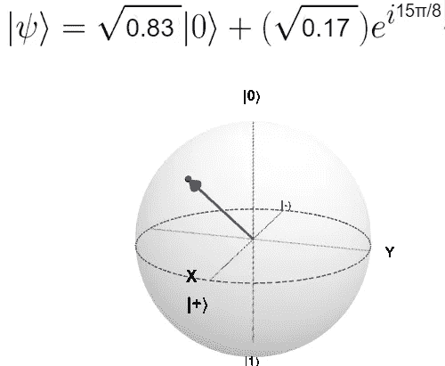
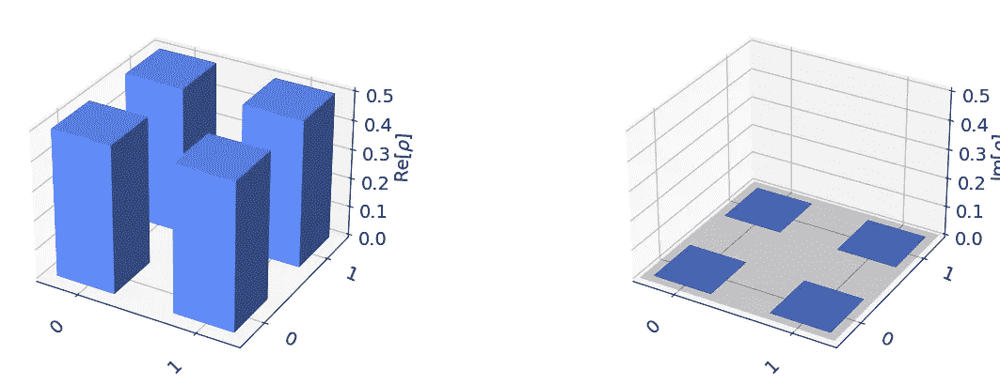
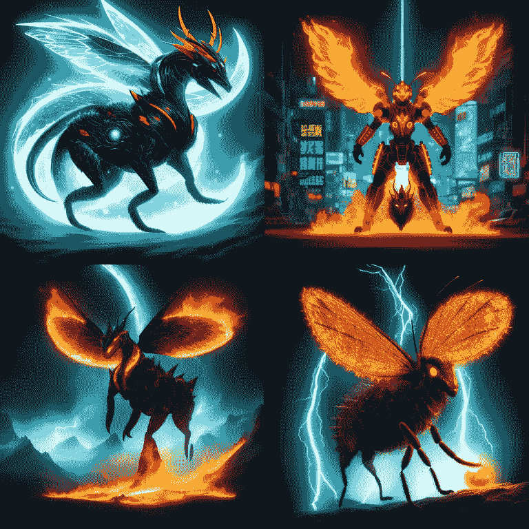

# 量子比特魔法：用量子计算创建神话生物

> 原文：[`towardsdatascience.com/qubit-magic-creating-mythical-creatures-with-quantum-computing-49bea0fabf4`](https://towardsdatascience.com/qubit-magic-creating-mythical-creatures-with-quantum-computing-49bea0fabf4)

## 教程

## 利用量子比特和大型语言模型生成美丽的图像。

[](https://medium.com/@KoryBecker?source=post_page-----49bea0fabf4--------------------------------)[](https://towardsdatascience.com/?source=post_page-----49bea0fabf4--------------------------------) [Kory Becker](https://medium.com/@KoryBecker?source=post_page-----49bea0fabf4--------------------------------)

·发表于[Towards Data Science](https://towardsdatascience.com/?source=post_page-----49bea0fabf4--------------------------------) ·阅读时间 6 分钟·2023 年 9 月 18 日

--


一个具有量子态向量[1/√2 e^(π/2)i 1/√2]的神话生物。来源：[Stable Diffusion](https://stablediffusionweb.com)。

# 你能用量子比特做什么？

想想单个量子比特的本质。乍一看，它可能并不那么宏伟。

事实上，单个量子比特似乎没有太多有趣的用途。

然而，凭借一些[创造力](https://medium.com/towards-data-science/programming-in-3d-my-first-steps-into-quantum-computing-566b9b93929d)，我们可以实现许多令人印象深刻的壮举。其中之一是生成图像、音乐，甚至在本文中——神话生物！

# 在量子层面生成惊人的图像

可视化量子比特可能看起来是一个相当抽象的概念。毕竟，量子比特在微观层面，使其难以理解。

然而，我们可以利用量子比特的惊人特性，将其可视化为富有想象力和美丽的方式。

一种方法是利用量子比特的独特特性，以生成可用于创建图像、声音等描述属性。

# 叠加的特性

量子计算使得一个量子比特可以同时表示两个值。这一特性称为[叠加](https://medium.com/towards-data-science/programming-in-3d-my-first-steps-into-quantum-computing-566b9b93929d)。

当一个量子比特处于叠加态时，它可以同时表示零和一。这使得计算可以实现二次甚至指数级的增长。

当量子比特处于叠加态时，它具有独特的幅度和相位属性。这些属性指的是量子比特的自旋，也对应于其测量为 0 或 1 的可能性。



可视化一个具有高概率（83%）测量为 1 的 q 球体。来源：[理解 Bloch 球体](https://javafxpert.github.io/grok-bloch/)。

我们可以从量子比特中提取这些属性，并将其解码为描述性文本属性，然后可以通过大型语言模型生成图像，例如 StableDiffusion、Huggingface 或 DALL-E。

# 创建量子电路

让我们从创建一个单量子比特的量子电路开始。下面的示例展示了这一过程。

```py
# Define the initial state vector.
initial_state = [1/np.sqrt(2), 1/np.sqrt(2)]

# Create a quantum circuit with one qubit.
qc = QuantumCircuit(1)

# Initialize the qubit with the initial state vector.
qc.initialize(initial_state, 0)
```

接下来，我们将允许用户从一系列[量子门](https://arcb.csc.ncsu.edu/~mueller/qc/qc18-2/qc18/readings/quantum_circuits_part1.pdf)（X, Y, Z, H, S, T）中选择，以应用于量子比特以改变其属性。每个门对量子比特执行不同的操作，修改其幅度和相位。

例如，X 门[翻转](https://quantum.microsoft.com/en-us/explore/concepts/single-qubit-gates)量子比特的状态从 0 到 1。相比之下，Z、S 和 T 门修改量子比特的相位。这会导致其围绕 Z 轴旋转。

每个操作稍微改变量子比特的测量属性，正是这种精确的变化可以被用来生成独特的图像！

# 获取状态向量

一旦用户对量子比特执行了一系列量子操作，我们可以测量结果并获取状态向量。

量子比特的状态向量类似于其指纹。它提供了对量子比特当前持有的幅度和相位属性的独特视图。

```py
# Simulate the circuit using the statevector simulator
simulator = Aer.get_backend("statevector_simulator")
result = execute(qc, simulator).result()
statevector = result.get_statevector()
```

下面展示了一个量子比特状态向量的示例：[查看](https://qiskit.org/documentation/stubs/qiskit.visualization.plot_state_city.html)。

> [-0.70710678–4.44089210e-16j -0.70710678–3.33066907e-16j]



使用状态城市图可视化一个量子比特状态向量。来源：作者。

# 提取颜色、力量和魔法

状态向量由两个分量组成，我们可以称之为 alpha 和 beta。

状态向量中的每个分量可以进一步分解为幅度（r）和相位（theta）。这导致从量子比特中获得四个不同的值（r1、theta1、r2、theta2）。我们可以将这些值直接映射到描述性文本属性。

```py
# Get the first and second components of the state vector.
alpha = state_vector[0]
beta = state_vector[1]

# Get the magnitude and phase of each component.
r1 = np.abs(alpha)
theta1 = np.angle(alpha)
r2 = np.abs(beta)
theta2 = np.angle(beta)
```

由于我们想生成神奇的神话生物图像，我们使用的属性可以包括大小、颜色、力量和魔法。

```py
# Define a dictionary of words for each attribute.
attribute_words = {
    "size": ["tiny", "small", "medium", "large", "huge"],
    "color": ["red", "green", "blue", "black", "rainbow"],
    "power": ["feeble", "weak", "strong", "powerful", "mighty"],
    "magic": ["mundane", "ordinary", "magical", "enchanting", "mystical"]
}

# Map the magnitude and phase values to indices
size_index = map_value_to_index(r1, 0, 1, len(attribute_words["size"]))
color_index = map_value_to_index(r2, 0, 1, len(attribute_words["color"]))
# ...

# Get the attribute words from the dictionary using the indices
size_word = attribute_words["size"][size_index]
color_word = attribute_words["color"][color_index]
# ...

# Concatenate the attribute words into a string separated by commas
attribute_string = f"{size_word}, {color_word}, {power_word}, {magic_word}"
```

在上述代码示例中，我们定义了一个文本属性列表，用于描述我们的神话生物。每个属性映射到量子比特的状态向量。

结果是一个句子，可以作为大型语言模型图像生成的提示。

# 生成 LLM 提示

现在我们已经获得了神话生物的属性，我们需要生成 LLM 提示。

将上述代码整合成一个方法，结果是以下这个辅助方法，用于生成所需的文本。

```py
def generate_prompt(statevector):
    # Generate an image from Huggingface using the prompt "A mythical creature with the quantum state vector [α β]".
    alpha = statevector[0]
    beta = statevector[1]

    # Get list of attributes from the state vector.
    attributes = generate_attribute_words(statevector)

    # Create an LLM prompt with the quantum state vector [{alpha} {beta}].
    prompt = f"A mythical monster that is " + attributes + " with the quantum state vector " + statevector

    return prompt
```

生成的状态向量现在将被转换为 LLM 提示。

> 一种神话怪物，体型巨大，蓝色，强大，神秘，具有量子状态向量 [α β]。

# 让量子比特成为令人惊叹的生物

最后一步是通过程序调用 LLM 图像生成服务，为我们的量子比特状态向量注入一些生命。

惊人的是，一些大型语言模型（例如 Bing 的 [DALL-E](https://www.bing.com/images/create)）能够直接将量子计算状态向量解读为图像。它们可以直接使用这些向量来以创造性的方式进行可视化。

例如，下面是 Bing 的 DALL-E 在被要求根据量子状态向量创建图像后的响应。

> 这只昆虫有两只翅膀，形状像量子状态向量 [-0.70710678–4.44089210e-16j -0.70710678–3.33066907e-16j]，其中翅膀的长度和角度分别代表实部和虚部。

LLM 的这一强大能力在下面通过可视化量子比特的状态向量，并结合我们程序中的描述属性进一步展示。



一种神话生物，体型巨大，橙色，强大，神秘，具有量子状态向量 [-1/√2 -i/√2]。来源：[Stable Diffusion](https://stablediffusionweb.com)。

完整的源代码可以在 [这里](https://gist.github.com/primaryobjects/7af184fc839094f7a9bcd09cbbc9d761) 找到。

# 现实世界应用的潜力

通过大型语言模型生成来自量子比特的内容，具有超越图像的潜力。事实上，凭借一点 [创造力](https://www.primaryobjects.com/2022/01/22/quantum-computing-hello-world/) 和 [实践](https://www.primaryobjects.com/2021/09/15/the-ultimate-guide-to-a-quantum-computing-certification-with-qiskit/)，这项技术也具有现实世界的应用。

考虑从量子计算状态中生成更抽象的产品的想法。示例可能包括：

+   诗歌或书面故事

+   音乐或演讲

+   商业创意

+   图表和图示

+   软件程序

LLM 擅长生成各种内容，并且能够结合量子计算的力量来完成这些任务。

# 天空是极限

希望这篇文章能激发你对量子计算的兴趣，并打开更多可能性的大门。

通过结合量子计算和 LLM 的两种令人难以置信的新兴技术，并加入一点想象力，我们可以带来令人惊叹的可能性。

现在，轮到你了！

# 关于作者

如果你喜欢这篇文章，请考虑在 [Medium](https://medium.com/@KoryBecker)、[Twitter](https://twitter.com/PrimaryObjects) 和我的 [网站](https://primaryobjects.com/) 上关注我，以便收到我未来的帖子和研究工作通知。
