# 在 Azure “Prompt Flow” 中以 GPT 模式查询文档语料库

> 原文：[`towardsdatascience.com/querying-a-corpus-of-documents-in-gpt-mode-with-azure-prompt-flow-3a79ec23f59c`](https://towardsdatascience.com/querying-a-corpus-of-documents-in-gpt-mode-with-azure-prompt-flow-3a79ec23f59c)

## 如何自动向量化内容并创建类似 LangChain 的机制，以高效查询 *语料库* 文档

[](https://pl-bescond.medium.com/?source=post_page-----3a79ec23f59c--------------------------------)[](https://towardsdatascience.com/?source=post_page-----3a79ec23f59c--------------------------------) [Pierre-Louis Bescond](https://pl-bescond.medium.com/?source=post_page-----3a79ec23f59c--------------------------------)

·发布于 [Towards Data Science](https://towardsdatascience.com/?source=post_page-----3a79ec23f59c--------------------------------) ·6 分钟阅读·2023 年 7 月 21 日

--


由 [Kenny Eliason](https://unsplash.com/@neonbrand?utm_source=medium&utm_medium=referral) 拍摄，发布于 [Unsplash](https://unsplash.com/?utm_source=medium&utm_medium=referral)

# GPT 热潮

全球所有精通技术的人们已经玩了一段时间的 ChatGPT…

+   他们中的许多人将其用作非常聪明的知识数据库🔎，

+   一些人探索了“提示工程”（或“Prompt Engineering”）的艺术，以获得更相关的结果，有时使用他们自己的数据🤖，

+   但只有少数人进一步利用了诸如 LangChain 等解决方案，来构建复杂的工作流并创建实际应用📚。

的确，掌握诸如“嵌入”或“向量存储”等概念，再加上编程要求，可能对许多人来说显得复杂，阻碍他们真正发挥大型语言模型的潜力。

这时“[**Prompt Flow**](https://learn.microsoft.com/en-us/azure/machine-learning/prompt-flow/overview-what-is-prompt-flow?view=azureml-api-2)”来拯救大家！

让我们发现如何在 Azure 中使用低代码构建一个强大的问答工具现在变得可能了！

# 前提条件

我假设你拥有创建本教程所需资源的必要权限，其中最重要的一项是拥有一个“Azure 机器学习工作室工作区”。


Azure 机器学习工作室登陆页面（图片来源：作者）

“**Prompt Flow**”功能，以及“**模型目录**”（允许你部署由 Azure、Hugging Face、Meta 等策划的大型语言模型），目前处于私人或公开预览阶段，因此你需要加入[等待列表](https://forms.office.com/Pages/ResponsePage.aspx?id=v4j5cvGGr0GRqy180BHbR3NZX0G6POdDmpxIQWUqHJNUQlJXS0M4SVFZT1haVFNDTUpFQjlBUDA3QS4u)才能激活和使用。

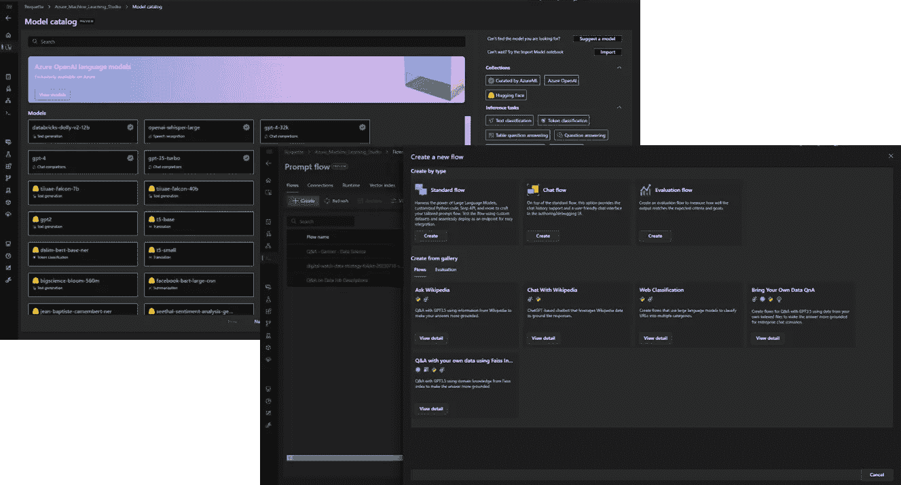

在 Azure 机器学习工作室中的模型目录和 Prompt Flow（图片由作者提供）

# 建立向量索引

## 理解嵌入

为了高效处理大规模的*语料库*并克服当前模型的标记限制，你需要将每个文档拆分成块（例如，每一页），并将相应的内容转换成“嵌入”。

嵌入是一个**数字向量，允许数学上比较不同内容的潜在含义和概念**，如下所示：

+   **我爱狗**: [-0.020993631333112717, …, -0.013046476989984512]

+   **我爱动物**: [-0.004775667563080788, …, -0.02461422048509121]

+   **我的车坏了**: -0.029365260154008865, …, -0.032723452895879745

当使用[NumPy “dot” 函数](https://numpy.org/doc/stable/reference/generated/numpy.dot.html)比较前两个嵌入的相似性时，我们得到接近 1 的结果（约 0.94），显示它们的含义非常接近。

相反，将第三个嵌入与前两个嵌入进行比较时（约 0.77），结果表明它们对应于不同的概念。

```py
 # skipping the code to connect to Azure Open AI API
# and convert the 3 sentences into embeddings

np.dot(emb_results[0], emb_results[1])
0.9428616001086217

np.dot(emb_results[0], emb_results[2])
0.7730676233478093

np.dot(emb_results[1], emb_results[2])
0.7718532811989359
```

> 这将成为下游分析的基础：能够将查询中嵌入的概念与之前审阅过的内容进行比较，以找到相似性。

## 向量存储或索引

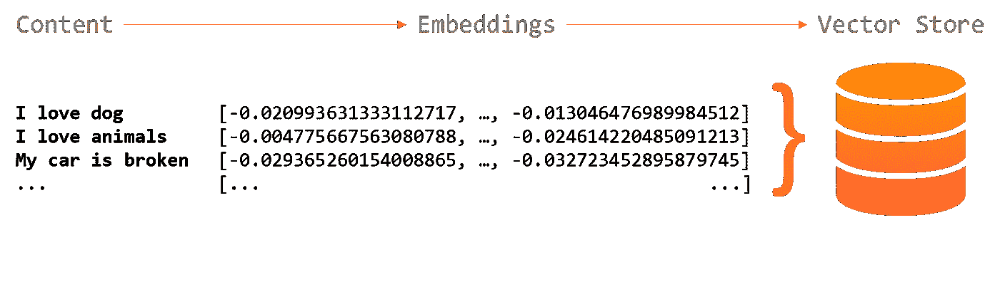

从内容到向量存储（图片由作者提供）

正如你可能猜到的，我们现在需要一个地方来收集所有这些向量，并将它们与初始文档链接在一起……这是“向量存储”的核心功能：

[document.pdf]

— 第 1 页

— 第 1 页 => 分割-1 => 嵌入 #1

— 第 1 页 => 分割-2 => 嵌入 #2

— 第 2 页

— 第 2 页 => 分割-1 => 嵌入 #3

— 第 2 页 => 分割-2 => 嵌入 #4

向量存储创建过程可能繁琐，但“Prompt Flow”简化并加速了这一过程。

对于这个例子，我们将使用三个文档作为*语料库*：

+   **《爱丽丝梦游仙境（第一章）》**，作者：刘易斯·卡罗尔

+   **《迷失的小机器人》**，伊萨克·阿西莫夫的短篇小说（我最喜欢的作家！）

+   **关于互联网的几段文字**，由 GPT-4 生成

我们启动“stories-vector-index”的创建，并选择存储在我计算机上的 3 个文件。

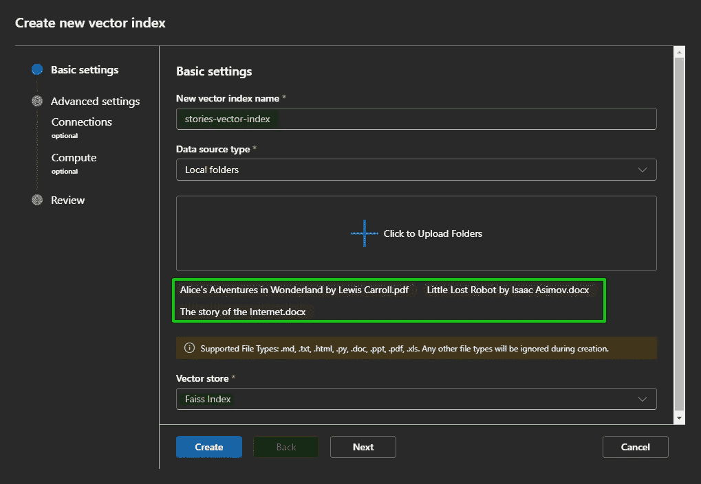

在 Azure Prompt Flow 中创建新的向量索引（图片由作者提供）

在第二步中，你需要选择一个包含“嵌入”模型的 Azure Open AI 资源。

这适用于标准的“Azure Open AI”资源，这些资源附带 GPT-3.5 模型并提供“text-embedding-ada-002”：

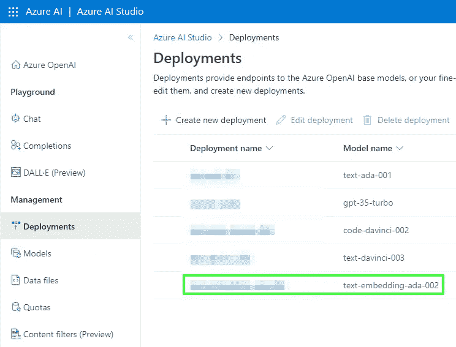

Azure Open AI — 部署在资源中的模型（图片作者提供）

然后，只需在“无服务器计算”或“计算集群”之间选择，并耐心等待 🤔

*根据我的经验，使用“无服务器计算”处理少量文档大约需要 10 分钟，而处理 1,000 个文档（约 1GB）的时间可能长达一个小时，包括各种格式如 PDF、PPT、DOC、CSV、XLS、TXT 等。*

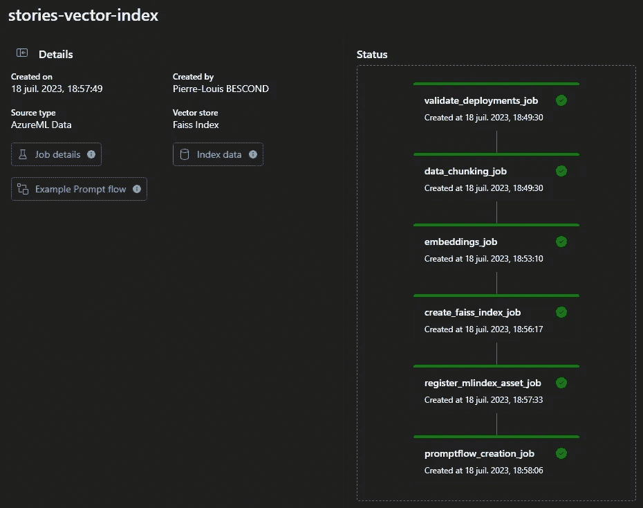

向量索引创建成功过程在 Azure Prompt Flow 中（图片作者提供）

当过程完成后，向量索引在 AZML 中变得可用：

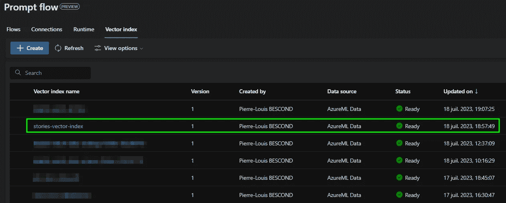

Azure Prompt Flow 中的可用向量索引（图片作者提供）

*注意：到目前为止，我遇到的唯一失败案例是当初始文档包含一个或多个“受保护的 PDF”时，因为脚本无法访问文件的内容。*

*在这种情况下，您需要检查日志以检测哪个文档导致了问题：*

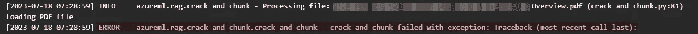

向量索引创建失败登录 Azure Prompt Flow（图片作者提供）

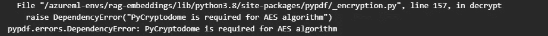

向量索引创建失败登录 Azure Prompt Flow（图片作者提供）

# 创建新流程

从画廊（不断演变中）中，我们将选择并克隆“带来您自己的数据 QnA”：

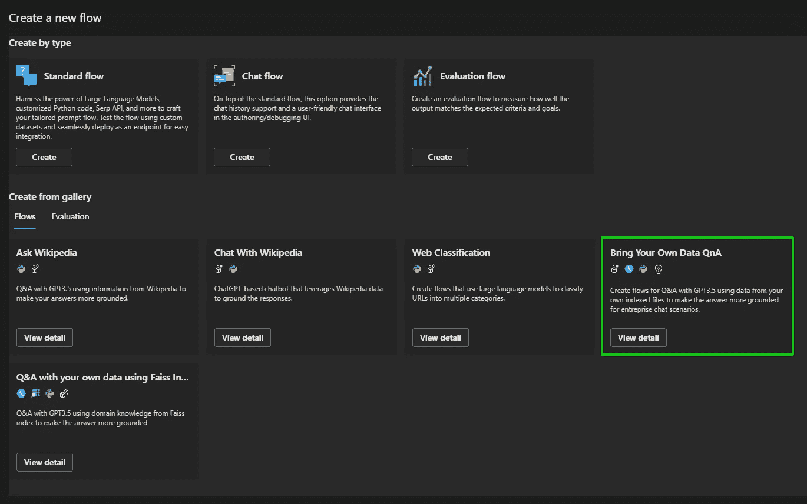

Prompt Flow 中的流程画廊（图片作者提供）

这创建了一个完整的类似 LangChain 的机制，只需要几个配置步骤：

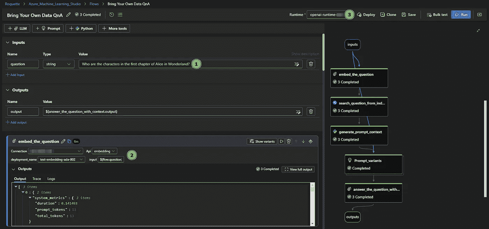

克隆的问答提示流配置（图片作者提供）

1.  更新初始查询/问题

1.  选择一个包括嵌入能力的 Azure Open AI 资源

1.  选择一个与运行中的计算实例相关联的运行时

1.  更新向量索引的位置（使用其“存储 URI”）

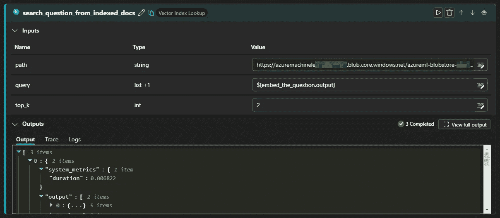

克隆的问答提示流配置（图片作者提供）

成功运行后，您可以检查答案的相关性：

```py
"output":"The main character in the first chapter of Alice in Wonderland is 
Alice. The only other character mentioned is the White Rabbit with pink eyes 
who runs close by her and leads her down the rabbit hole.
(Source: Alice’s Adventures in Wonderland by Lewis Carroll)"
```

确实，有人可能会认为您无需提供第一章，因为 GPT 模型能够在没有它的情况下回答……但您明白这是仅用于演示目的 😉

运用相同的原则，我们可以为企业文档创建一个强大的问答应用程序：

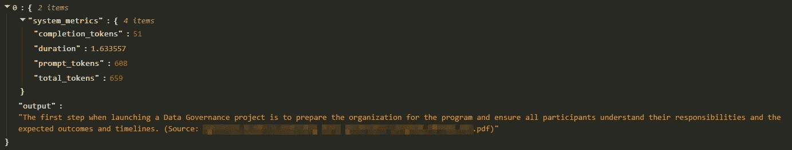

基于专有文档的流程输出（图片作者提供）

# 通过 Web-App 利用该端点

经过几次“合理性检查”以确保提供的答案有意义后，我们可以通过相应的按钮在几次点击中部署应用程序。

该流程变成一个 REST Azure 端点，简单的 Python、C# 或 R 代码片段可以使用：

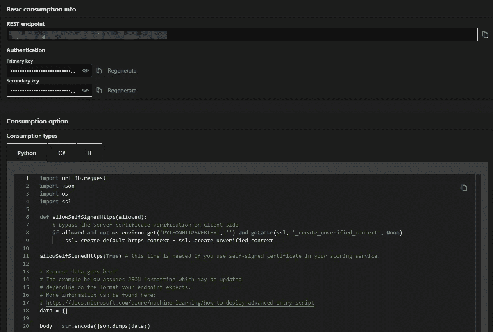

来自 Azure 的端点消费片段（作者提供的图片）

我的一项建议是使用如 Streamlit 这样的包来使模型易于访问，并设计一个简单的界面，允许用户以自然的方式提问，并获得相应来源的答案，如下所示：

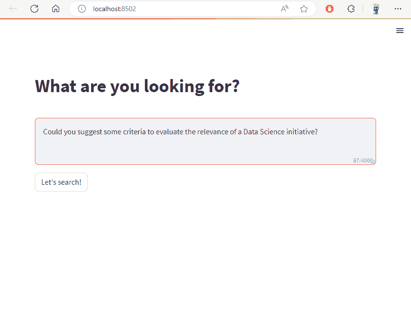

使用 Streamlit 创建的可能的 Web 应用程序设计和 UX（作者提供的图片）

就这样！🎉

凭借如此少的编码，我们从原始的文档语料库转变为一个利用 LLM 功能的 web 应用程序，帮助最终用户以简单自然的方式提取见解和知识！

在即将到来的各种生成式 AI 使用场景中，我真的相信它将成为许多公司或组织处理和利用大量 TB 数据或文档的**游戏规则改变者**。

像往常一样，我尝试确定所有所需的步骤，但如果在本教程中有任何遗漏的说明，请随时联系我！

不要犹豫，浏览我在 Medium 上的其他贡献：

[](https://pl-bescond.medium.com/pierre-louis-besconds-articles-on-medium-f6632a6895ad?source=post_page-----3a79ec23f59c--------------------------------) [## 皮埃尔-路易斯·贝斯孔在 Medium 上的文章]

### 数据科学、机器学习与创新

pl-bescond.medium.com](https://pl-bescond.medium.com/pierre-louis-besconds-articles-on-medium-f6632a6895ad?source=post_page-----3a79ec23f59c--------------------------------)
