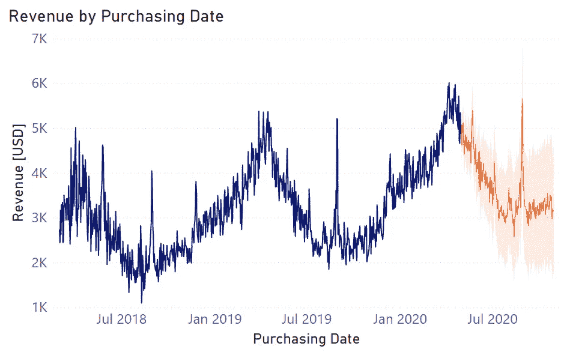
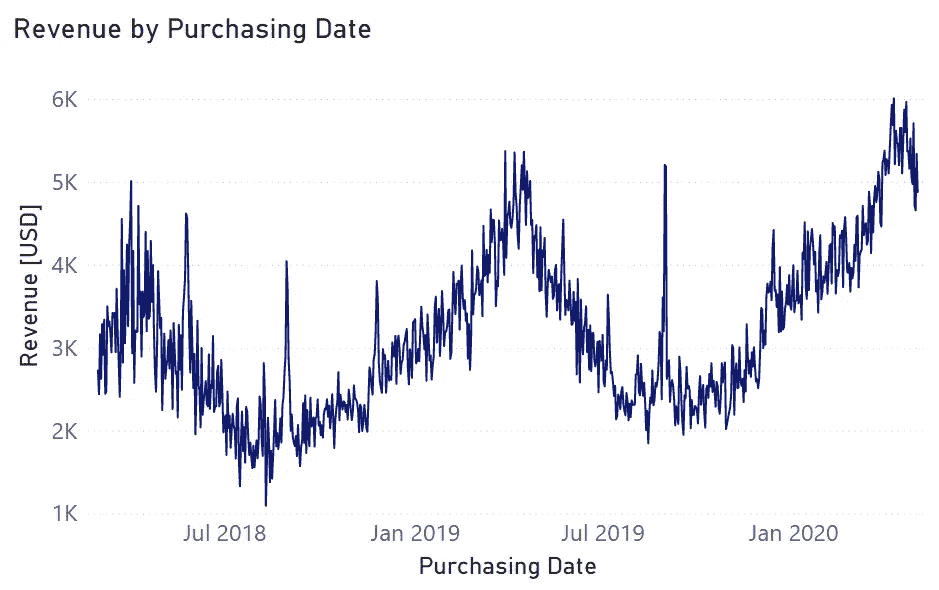
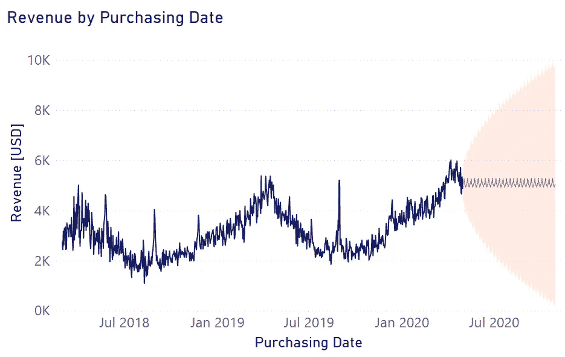
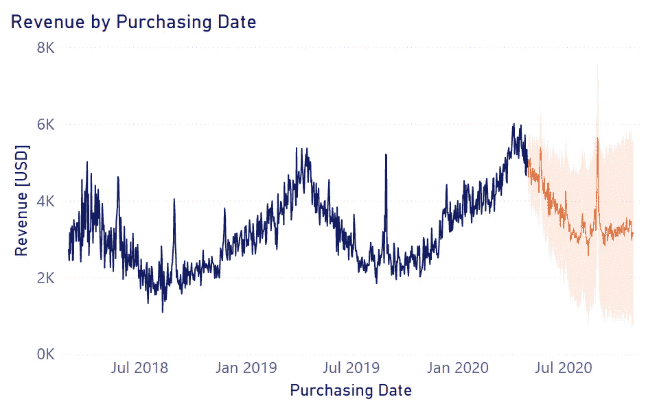
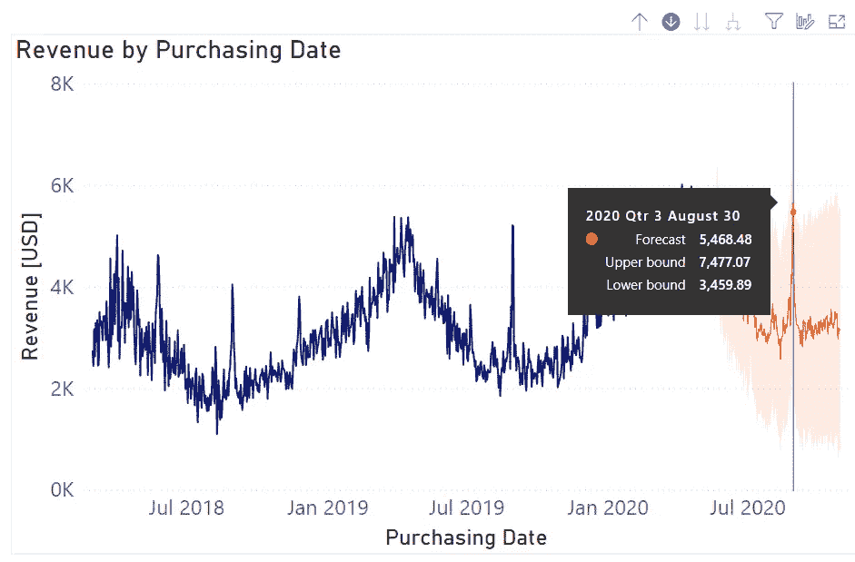
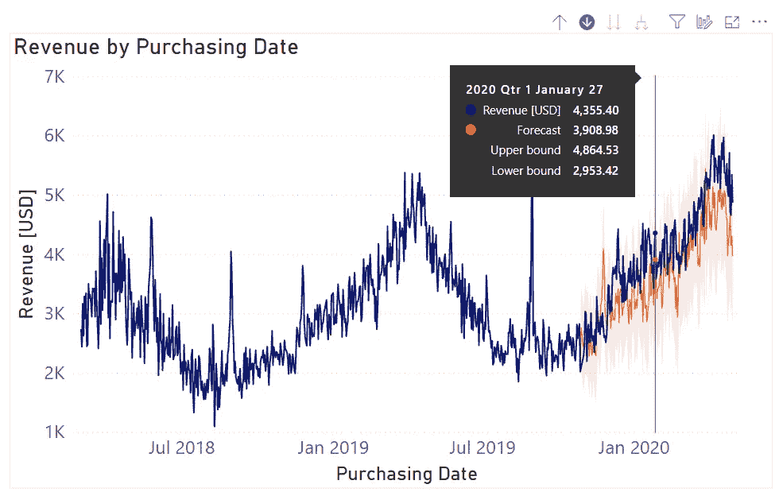

# PowerBI 中的快速而简单的时间序列预测：实用指南

> 原文：[`towardsdatascience.com/quick-and-easy-time-series-forecasting-in-powerbi-a-practical-guide-c31a858ee220`](https://towardsdatascience.com/quick-and-easy-time-series-forecasting-in-powerbi-a-practical-guide-c31a858ee220)

## 如何仅用几次点击就设置和配置一个预测系统

 [Thomas A Dorfer](https://thomasdorfer.medium.com/?source=post_page-----c31a858ee220--------------------------------)

·发布于 [Towards Data Science](https://towardsdatascience.com/?source=post_page-----c31a858ee220--------------------------------) ·阅读时间 7 分钟·2023 年 5 月 1 日

--

作者提供的图片。

# 介绍

时间序列预测已成为商业、政府和个人普遍使用的工具。现在，它几乎被应用于每一个可以想象的领域：在金融领域预测股票和利率，在医疗保健中预测医院床位容量，在交通领域规划路线和交通模式，在能源领域预测电力供应和需求等等。

因此，存在对一个用户友好、易于上手且快速无缝设置的工具的需求。幸运的是，PowerBI 解决了这个问题。凭借其内置工具，用户能够仅需几次点击就能设置和配置预测系统。

本文将为你提供一个逐步指南，教你如何实现这一目标。但在深入实际操作之前，让我们先了解一下在后台运行的算法。

# 算法：指数平滑

PowerBI 使用指数平滑——一种能够捕捉时间序列数据趋势的强大算法，同时抑制噪声和不必要的变化。

简单来说，指数平滑采用过去观察值的加权平均值，给予最近的观察值更多权重。这意味着权重随着观察值的变老而指数递减。其背后的思想是，最近的观察值比远离的观察值对未来行为的预测更具信息量。

指数平滑有几种变体，每种方法使用不同的水平、趋势和季节性组件的组合来进行预测。

PowerBI 的工具会根据用户提供的历史数据的季节性，自动在[ETS 模型系列](https://www.statsmodels.org/dev/examples/notebooks/generated/ets.html)的两个算法之间进行选择：（1）用于季节性数据的 ETS AAA，和（2）用于非季节性数据的 ETS AAN。

## 季节性数据：ETS AAA

首先让我们拆解这个相当令人生畏的缩写。有趣的是——或者说令人困惑，取决于你的视角——缩写的第二部分描述了第一部分所代表的组件的性质。

第一部分，*ETS*，告诉我们时间序列模型所考虑的组件。在这种情况下，它包括误差（E）、趋势（T）和季节性（S）。*AAA*中的*A*代表*加性*。有了这些信息，我们现在可以得出结论，我们的时间序列模型考虑了*加性误差*、*加性趋势*和*加性季节性*。

+   **加性误差**指的是时间序列中的误差或随机波动被加到预期值上。

+   **加性趋势**意味着时间序列的预期值随时间以固定的量发生变化。例如，如果时间序列的趋势组件为 2，则在时间*t+1*时的预期值将比时间*t*时的预期值高 2 个单位。

+   **加性季节性**意味着时间序列的季节性组件在每个季节的预期值上增加一个固定量。例如，如果时间序列在七月份的季节性组件为 5，则七月份的预期值将比其他任何月份高 5 个单位。

## 非季节性数据：ETS AAN

基于前一节对如何解释这个缩写的解释，你可能已经得出结论，*ETS AAN*也使用了*加性误差*和*加性趋势*。*AAN*末尾的*N*仅表示*非季节性*，表明该模型不考虑时间序列中的季节性模式。

# 在 PowerBI 中的实现

现在让我们来看看在 PowerBI 中设置时间序列预测系统所需遵循的各个步骤。

***步骤 1:*** 将你的时间序列数据加载到 PowerBI 中。

***步骤 2:*** 创建一个包含你的时间序列的*折线图*，并确保 X 轴类型设置为*连续*。在本文的插图中，我使用了微软提供的[示例数据](https://github.com/microsoft/powerbi-desktop-samples/blob/main/Monthly%20Desktop%20Blog%20Samples/2020/2020SU09%20Blog%20Demo%20-%20September.pbix)。

作者提供的图像。数据使用的许可信息：[MIT 许可证](https://github.com/microsoft/powerbi-desktop-samples/blob/main/LICENSE)。

***步骤 3:*** 在*可视化*窗格中，导航到*将更多分析添加到您的视觉效果*，然后打开*预测*。

***步骤 4:*** 在*选项*下，你可以设置一些参数和自定义配置，如*单位*、*预测长度*、*忽略最后*、*季节性*和*置信区间*。

*单位*参数适用于*预测长度*和*忽略最后*（稍后我们将看到这个参数的含义）。在我们的例子中，我将*单位*设置为“月份”，将*预测长度*设置为“6”，表示我正在尝试对未来 6 个月进行预测。

如果不提供进一步的输入，结果将如下所示：

作者提供的图片。

看起来不太好，是吗？这是因为*季节性*的默认值设置为“自动”，而且，可能我们的数据没有足够的季节性周期以便工具准确检测到它。

仅通过查看折线图，我们可以看到我们的数据具有年度季节性。收入通常在夏季达到低点，然后稳步上升直到 4 月中旬，之后开始再次下降，循环重复。

因此，我们可以手动将*季节性*设置为“365”点。这里的点指的是时间序列数据的粒度。在我们的例子中，我们具有每日粒度——图表中的每个数据点代表一天。因此，365 点意味着 365 天。

按照描述调整参数后，我们得到以下结果：

作者提供的图片。

好多了！模型明显捕捉到了数据中的季节性，并且还预测了过去两年 8 月底的峰值。此外，通过查看每年 8 月中旬的低点，我们可以看到模型还捕捉到了这个时间序列中存在的轻微上升趋势。

当悬停在图表上时，我们还可以检查预测的确切值以及置信区间的上下限，默认情况下设置为 95%。这意味着我们的模型以 95%的概率预测数据将落在这个预测范围内。

作者提供的图片。

我们对数据进行的预测越远，置信区间就越宽。这是因为未来值的预测不确定性增加（想象一下天气预报——我们可以对接下来一两天的天气进行合理的预测，但对于 7 天或 14 天的预报，不确定性会大得多）。

## 模型评估

一旦你设置了预测系统，你可以通过一种叫做*回溯预测*的过程来评估模型的表现。回溯预测不是预测未来值，而是对过去的值进行“预测”，并将这些预测与实际值进行比较。

使用这种方法可以让我们了解模型的表现，通过评估它在过去的表现情况来实现。

现在是利用*ignore the last*参数的时候。将此参数设置为“6”，我们告诉模型对我们时间序列数据的最后 6 个月进行回溯预测。

图片来源于作者。

查看这个回溯预测，我们可以看到，虽然模型不是 100%准确——实际上没有模型是——但总体表现还是相当不错的。平均而言，预测值似乎略低于实际值。这可能是由于模型没有很好地捕捉数据的整体上升趋势，或者上升趋势的斜率在这一周期中实际上在增加。更多的历史数据通常能解决这个问题。

# 结论

PowerBI 提供了一种真正无缝的方法来设置时间序列预测系统，这只需几分钟的最小调整即可完成。利用这一工具，组织和个人可以利用其历史数据生成对未来趋势和事件的可操作预测。然而，也必须记住，预测需要不断的调整和评估，而预测的准确性在很大程度上依赖于基础历史数据的质量和数量。

## 喜欢这篇文章吗？

让我们保持联系！你可以在 [Twitter](https://twitter.com/ThomasADorfer)、[LinkedIn](https://www.linkedin.com/in/thomasdorfer/) 和 [Substack](https://thomasdorfer.substack.com/) 找到我。

如果你喜欢支持我的写作，可以通过 [Medium 会员](https://thomasdorfer.medium.com/membership) 来支持我，这样你可以访问我所有的故事以及 Medium 上成千上万其他作家的故事。

[## 加入 Medium，通过我的推荐链接 - Thomas A Dorfer](https://medium.com/@thomasdorfer/membership?source=post_page-----c31a858ee220--------------------------------)

### 阅读 Thomas A Dorfer 的每个故事（以及 Medium 上成千上万的其他作家的故事）。您的会员费直接支持…

[medium.com](https://medium.com/@thomasdorfer/membership?source=post_page-----c31a858ee220--------------------------------)
