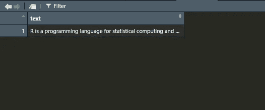
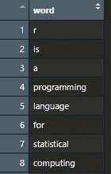
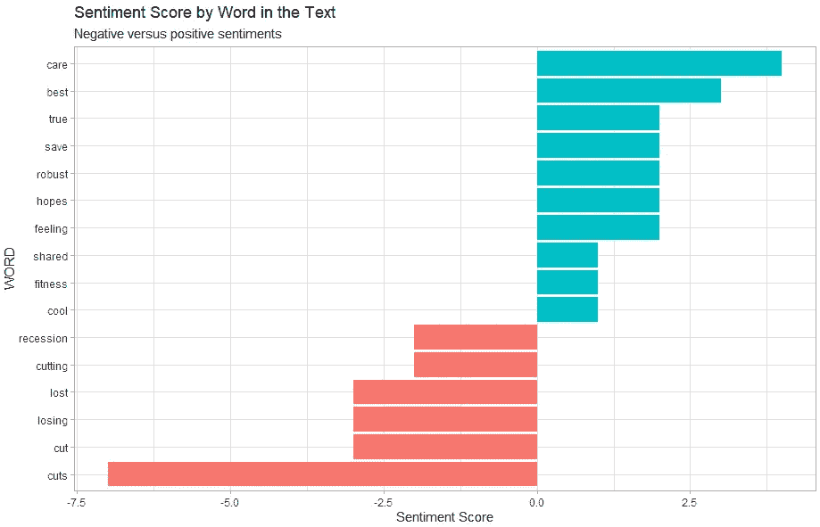
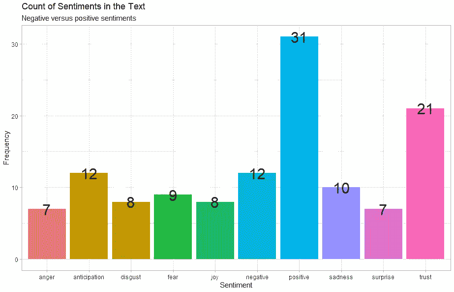
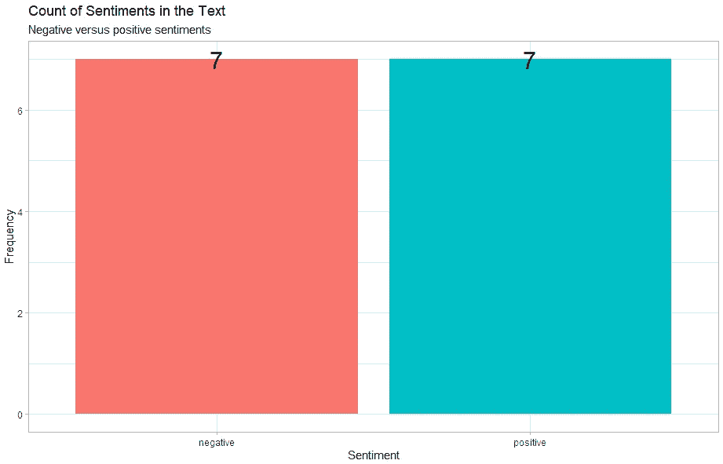
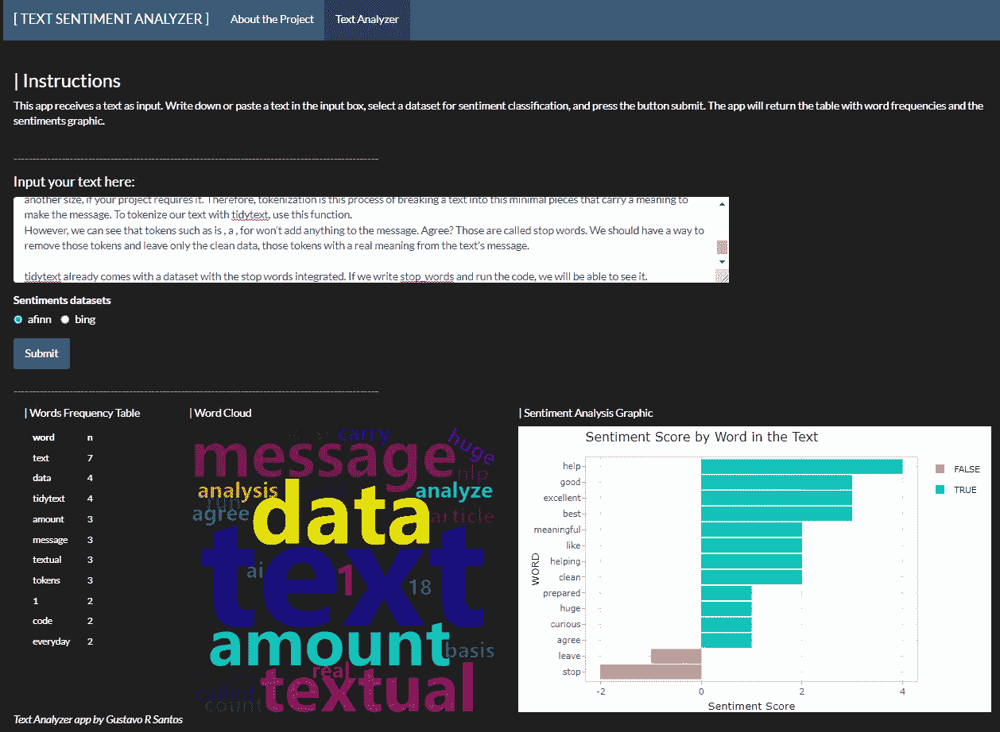

# 使用 R 进行快速文本情感分析

> 原文：[`towardsdatascience.com/quick-text-sentiment-analysis-with-r-2cc4f04c35c1`](https://towardsdatascience.com/quick-text-sentiment-analysis-with-r-2cc4f04c35c1)

## 使用 TidyText 创建一个简洁且快速的文本分析工具与 R

[](https://gustavorsantos.medium.com/?source=post_page-----2cc4f04c35c1--------------------------------)[](https://towardsdatascience.com/?source=post_page-----2cc4f04c35c1--------------------------------) [Gustavo Santos](https://gustavorsantos.medium.com/?source=post_page-----2cc4f04c35c1--------------------------------)

·发布于 [Towards Data Science](https://towardsdatascience.com/?source=post_page-----2cc4f04c35c1--------------------------------) ·阅读时间 9 分钟·2023 年 3 月 10 日

--


[Kenny Eliason](https://unsplash.com/@neonbrand?utm_source=unsplash&utm_medium=referral&utm_content=creditCopyText) 拍摄的照片，来源于 [Unsplash](https://unsplash.com/photos/jxmVsYjglnQ?utm_source=unsplash&utm_medium=referral&utm_content=creditCopyText)

# 介绍

到处都是文本！自从互联网传播到全球以来，我们每天生成的文本数据量巨大。仅每日发送的文本消息，就估计有大约 180 亿条在 [日常基础](https://seedscientific.com/how-much-data-is-created-every-day/)上流通。

现在想象一下生成的新闻量。这个数量如此庞大，以至于围绕新闻剪辑建立了整个业务，分离出关于特定话题的最佳信息，以帮助公司制定营销策略。

人工智能如何提供帮助？显然，自然语言处理（NLP）在其中发挥了重要作用，提供了良好的工具和算法来分析文本信息。作为数据科学家，我们可以利用 `tidytext`，这是 `R` 的一个优秀库，帮助我们构建快速分析工具来检查文本内容。

接下来，让我们在实践中看看这个。

# 文本分析

## 准备你的环境

为了准备好与本文一起编写代码，加载下列列出的库。

```py
# Installing libraries
install.packages('tidyverse')
install.packages('tidytext')

# Loading libraries
library(tidyverse)
library(tidytext)
library(textdata)
```

`tidytext` 库的工作方式与 `tidyverse` 类似，利用直观的函数名称，并通过管道符号 `%>%` 链接它们。

让我们使用 [这篇关于 *R 语言* 的维基百科文本](https://en.wikipedia.org/wiki/R_(programming_language)) 来创建我们第一个简单的 **文本分析器**。

```py
text <- "R is a programming language for statistical computing and graphics
supported by the R Core Team and the R Foundation for Statistical Computing.
Created by statisticians Ross Ihaka and Robert Gentleman, R is used among data
 miners, bioinformaticians and statisticians for data analysis and developing 
statistical software. Users have created packages to augment the functions
of the R language.
According to user surveys and studies of scholarly literature databases, 
R is one of the most commonly used programming languages in data mining.[8]
As of December 2022, R ranks 11th in the TIOBE index, a measure of programming
language popularity, in which the language peaked in 8th place in August 2020.
The official R software environment is an open-source free software 
environment within the GNU package, available under the GNU General Public 
License.  It is written primarily in C, Fortran, and R itself 
(partially self-hosting). 
Precompiled executables are provided for various operating systems. R has a 
command line interface.[11] Multiple third-party graphical user interfaces are 
also available, such as RStudio, an integrated development environment, 
and Jupyter, a notebook interface."
```

下一步是将这个文本转换为 `tibble` 对象，可以理解为 `data.frame`。

```py
# Transform to tibble
df_text <- tibble(text)
```

它不会改变太多你的对象，但这是我们能够使用`tidytext`函数所必需的，因为这些函数要求数据来自 tibble 或 data.frame 对象。如果你感兴趣的话，这里是转换后的样子。



文本转换为 tibble 对象。图片来源：作者。

## 频率计数

继续，我们将对文本进行标记化。令牌是文本中最小的有意义单位。大多数项目使用 1 个单词=1 个令牌，但如果你的项目需要，也可以是其他大小。因此，**标记化**就是将文本分解为这种最小的有意义的片段，以构成信息。要使用`tidytext`标记化我们的文本，请使用此函数。

> 令牌是文本中最小的有意义单位。[1]

```py
# Tokenizing the text
tokens <- df_text %>% 
  unnest_tokens(input = text, #name of the input column
                output = word) #name of the output column
```

结果如下。



经过标记化的文本。图片来源：作者。

不过，我们可以看到诸如`is`、`a`、`for`之类的令牌不会为信息添加任何内容。认同吗？这些被称为**停用词**。我们应该有办法去除这些令牌，只留下干净的数据，即文本信息中的实际意义的令牌。

`tidytext`已经附带了集成了停用词的数据集。如果我们输入`stop_words`并运行代码，我们将能看到它。

```py
# View stop_words
stop_words

# A tibble: 1,149 × 2
   word        lexicon
   <chr>       <chr>  
 1 a           SMART  
 2 a's         SMART  
 3 able        SMART  
 4 about       SMART  
 5 above       SMART  
 6 according   SMART  
 7 accordingly SMART  
 8 across      SMART  
 9 actually    SMART  
10 after       SMART  
# … with 1,139 more rows
```

注意到包含单词的列命名为`word`。这也是我们将标记化列命名为该变量名的原因，这样更容易将两个数据集连接起来。因此，我们现在的工作是将它们连接起来，去除停用词。我们可以使用`anti_join()`函数，它只保留数据集 A 中存在但在 B 中不存在的单词。在序列中，我们只需计数并按出现频率排序。

```py
# Removing stopwords and counting frequencies
tokens %>% 
  anti_join(stop_words) %>% 
  count(word, sort = TRUE)

# Result
# A tibble: 79 × 2
   word            n
   <chr>       <int>
 1 language        4
 2 data            3
 3 environment     3
 4 programming     3
 5 software        3
 6 statistical     3
 7 computing       2
 8 created         2
 9 gnu             2
10 interface       2
# … with 69 more rows
```

惊人吧？这样我们就很容易了解这段文本的主题。*用于统计数据分析的软件或编程语言。*

我们可以使用前面的代码创建一个函数，快速给出任何文本的频率计数。

```py
text_freq_counter <- function(text){

  # Transform to tibble
  df_text <- tibble(text)

  # Tokenizing the text
  tokens <- df_text %>% 
    unnest_tokens(input = text, #name of the input column
                  output = word) #name of the output column

  # Removing stopwords and counting frequencies
  freq_count <- tokens %>% 
    anti_join(stop_words) %>% 
    count(word, sort = TRUE)

  # Return
  return(freq_count)

}#close function
```

让我们来测试一下。我会回到这篇文章的第一部分，复制它，让我们的函数计算频率。

```py
text <- "Text everywhere! Since the Internet was spread around the world, 
the amount of textual data we generate everyday is ginormous. Only textual 
messages sent everyday, it is estimated that there are around 18 Billion of
 them circulating on a daily basis*. 
Now imagine the amount of news generated as well. It's a so overwhelming 
amount that there are whole businesses built around news clipping, separating 
the best information about a given topic to help companies in their marketing
 strategies.
How is AI helping that? Certainly, NLP plays a huge part on that providing 
good tools and algorithms to analyze textual information. As Data Scientists, 
we can profit of tidytext, an excellent library from R to help us building 
quick analytical tools to check the content of a text.
Let's see that in practice, next."

# Running the function
text_freq_counter(text)

[OUT]
# A tibble: 50 × 2
   word            n
   <chr>       <int>
 1 amount          3
 2 textual         3
 3 data            2
 4 everyday        2
 5 information     2
 6 news            2
 7 text            2
 8 tools           2
 9 18              1
10 ai              1
# … with 40 more rows
```

效果非常好。

# 额外进阶

我们可以在这里停下来，但这个话题非常有趣，我觉得我们应该再深入一点。让我们现在向我们的文本分析器添加情感分析吧。

`tidytext`还准备好了情感分析，因为它提供了几个情感数据集。选项包括“Bing”、“Afinn”和“nrc”。让我们看看它们之间的区别。

*Bing*情感数据集包含分类为正面或负面的单词。因此，一个选项是检查你的文本中正面与负面单词的数量，从而了解情感。

```py
# Bing sentiments
get_sentiments('bing')
# A tibble: 6,786 × 2
   word        sentiment
   <chr>       <chr>    
 1 2-faces     negative 
 2 abnormal    negative 
 3 abolish     negative 
 4 abominable  negative 
 5 abominably  negative 
 6 abominate   negative 
 7 abomination negative 
 8 abort       negative 
 9 aborted     negative 
10 aborts      negative 
# … with 6,776 more rows
```

*Afinn*情感数据集，可能来源于 affinity，将单词与数字分类。数字越正面，单词越正面，反之亦然。它需要加载`library(textdata)`。

```py
library(textdata)

# Sentiments Afinn
get_sentiments('afinn')

# A tibble: 2,477 × 2
   word       value
   <chr>      <dbl>
 1 abandon       -2
 2 abandoned     -2
 3 abandons      -2
 4 abducted      -2
 5 abduction     -2
 6 abductions    -2
 7 abhor         -3
 8 abhorred      -3
 9 abhorrent     -3
10 abhors        -3
# … with 2,467 more rows
```

最终，*NRC* 会将单词分类为情感名称，如信任、惊讶等。

```py
# Sentiments Afinn
get_sentiments('nrc')

# A tibble: 13,875 × 2
   word        sentiment
   <chr>       <chr>    
 1 abacus      trust    
 2 abandon     fear     
 3 abandon     negative 
 4 abandon     sadness  
 5 abandoned   anger    
 6 abandoned   fear     
 7 abandoned   negative 
 8 abandoned   sadness  
 9 abandonment anger    
10 abandonment fear     
# … with 13,865 more rows
```

所以，我们接下来要做的是使用*afinn*创建一个评分，然后绘制我们文本中正面和负面单词的结果。

我将使用关于科技行业裁员的网络文本。现在该功能包含一个图形，显示单词根据*afinn*值和频率的评分。

```py
# Function for frequency count
text_freq_counter <- function(text){

  # get sentiments
  sentiments <- get_sentiments(‘afinn’)

  # Transform to tibble
  df_text <- tibble(text)

  # Tokenizing the text
  tokens <- df_text %>% 
    unnest_tokens(input = text, #name of the input column
                  output = word) #name of the output column

  # Removing stopwords and counting frequencies
  freq_count <- tokens %>% #dataset
    inner_join(sentiments, by=’word’) %>% #join the sentiments
    count(word, value, sort = TRUE) %>% #count the words by sentiment value
    mutate(score = n * value) %>%  # create score by multiplying score * value
    arrange( desc(score)) # sort

  # Plot
  g <- freq_count %>% 
    ggplot( aes(x= score, y= reorder(word, score),
                fill= score > 0) ) +
    geom_col(show.legend = F) +
    labs( x= ‘Sentiment Score’,
          y= ‘WORD’,
          subtitle = ‘Negative versus positive sentiments’) +
    ggtitle(‘Sentiment Score by Word in the Text’)+
    theme(plot.subtitle =  element_text(color = "gray", face = "italic")) +
    theme_light()

  # Return
  return(list(freq_count, g))

}#close function

#Applying the function
text_freq_counter(text3)

# Resulting table
# A tibble: 16 × 4
   word      value     n score
   <chr>     <dbl> <int> <dbl>
 1 care          2     2     4
 2 best          3     1     3
 3 feeling       1     2     2
 4 hopes         2     1     2
 5 robust        2     1     2
 6 save          2     1     2
 7 true          2     1     2
 8 cool          1     1     1
 9 fitness       1     1     1
10 shared        1     1     1
11 cutting      -1     2    -2
12 recession    -2     1    -2
13 cut          -1     3    -3
14 losing       -3     1    -3
15 lost         -3     1    -3
16 cuts         -1     7    -7
```

上述结果表格已显示。这是结果图形。



针对关于科技行业裁员的新闻文本进行情感分析。图片由作者提供。

在我的 GitHub 上，还有另一个函数，你也可以选择要使用的情感包。结果如下所示，随后是代码链接。

```py
# Enhanced Function
text_freq_sentiment(text3, .sentiment = 'nrc')
text_freq_sentiment(text3, .sentiment = 'bing')
```



使用“nrc”包捕获的单词频率情感。图片由作者提供。



使用“Bing”包捕获的单词频率情感。图片由作者提供。

你可以在这里查看完整代码: [GitHub 代码链接](https://github.com/gurezende/Sentiment_Analysis_TidyText)。

你也可以使用这个代码创建的 Shiny 应用进行尝试。

[## [ 文本情感分析器 ]

### 这个项目 - 由 Gustavo R Santos 创建 - 用于快速创建文本分析，以计算单词频率并绘制图形…

gurezende.shinyapps.io](https://gurezende.shinyapps.io/Sentiment_Analysis/?source=post_page-----2cc4f04c35c1--------------------------------) 

[Shiny 应用：文本情感分析器](https://gurezende.shinyapps.io/Sentiment_Analysis/)。图片由作者提供。

# 在你离开之前

我喜欢研究自然语言处理和文本挖掘的数据科学工具。我们可以从文本中提取出很多信息，这非常有趣。

我建议你查看下方参考部分的链接，并找到资源以深化你的知识。我的书中也包含一些关于处理文本数据的有趣练习，包括文本挖掘。

如果你喜欢这些内容，别忘了关注我的博客。[在 LinkedIn 上找到我](https://www.linkedin.com/in/gurezende/)。

[](https://gustavorsantos.medium.com/?source=post_page-----2cc4f04c35c1--------------------------------) [## Gustavo Santos - Medium

### 阅读 Gustavo Santos 在 Medium 上的文章。数据科学家。我从数据中提取洞察，以帮助个人和公司…

gustavorsantos.medium.com](https://gustavorsantos.medium.com/?source=post_page-----2cc4f04c35c1--------------------------------)

# 参考文献

[1] *Santos, G. 2023. 用 R 进行数据处理。第 1 版。Packt Publishing.*

[](https://www.tidytextmining.com/tidytext.html?source=post_page-----2cc4f04c35c1--------------------------------) [## 1 整洁文本格式 | 用 R 进行文本挖掘

### 使用整洁数据原则是使数据处理更简单、更有效的强大方法，这一点也不例外…

[Tidytext Mining](https://www.tidytextmining.com/tidytext.html?source=post_page-----2cc4f04c35c1--------------------------------) [R (编程语言) - 维基百科](https://en.wikipedia.org/wiki/R_%28programming_language%29?source=post_page-----2cc4f04c35c1--------------------------------) [## R (编程语言) - 维基百科

### R 是一种用于统计计算和图形绘制的编程语言，由 R Core Team 和 R Foundation 支持…

[数据整理与 R](https://en.wikipedia.org/wiki/R_%28programming_language%29?source=post_page-----2cc4f04c35c1--------------------------------) [数据整理与 R: 加载、探索、转换和可视化数据以进行建模，使用 tidyverse 库](https://www.amazon.com/Data-Wrangling-Transform-Visualize-tidyverse/dp/1803235403/ref=sr_1_4?crid=2GAN2WONI7ZS5&keywords=Data+Wrangling+with+R&qid=1672819697&sprefix=data+wrangling+with+%2Caps%2C324&sr=8-4&source=post_page-----2cc4f04c35c1--------------------------------) [## 数据整理与 R：加载、探索、转换和可视化数据以进行建模，使用 tidyverse 库

### 数据整理与 R：加载、探索、转换和可视化数据以进行建模，使用 tidyverse 库[Santos…

[Amazon](https://www.amazon.com/Data-Wrangling-Transform-Visualize-tidyverse/dp/1803235403/ref=sr_1_4?crid=2GAN2WONI7ZS5&keywords=Data+Wrangling+with+R&qid=1672819697&sprefix=data+wrangling+with+%2Caps%2C324&sr=8-4&source=post_page-----2cc4f04c35c1--------------------------------)
