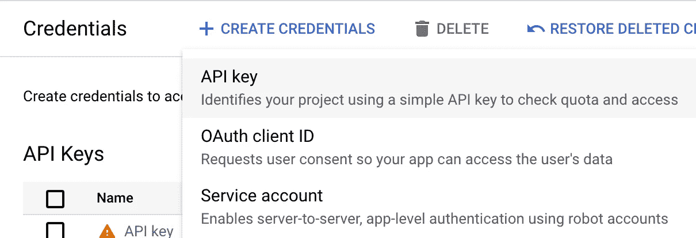
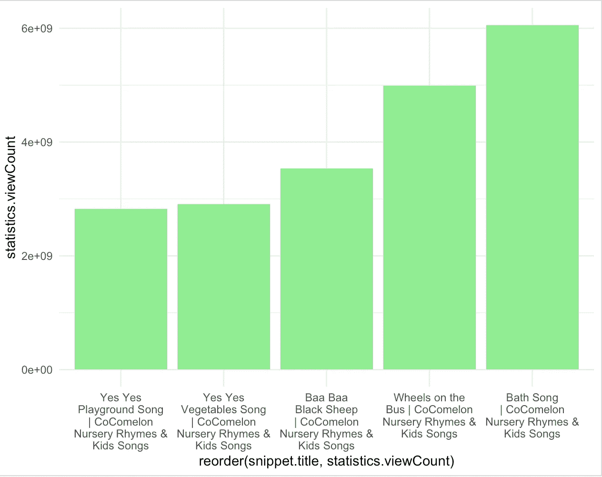
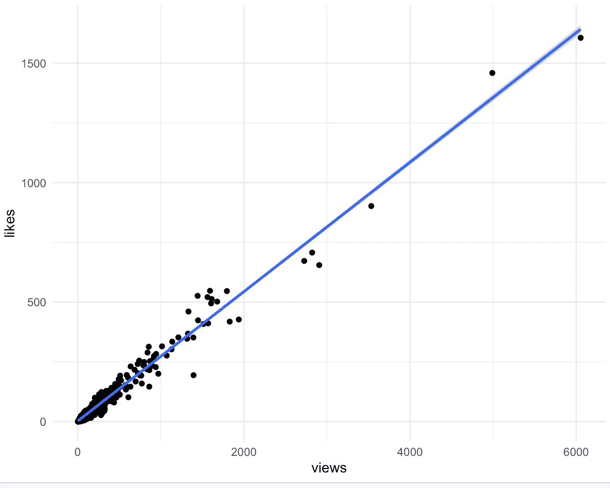
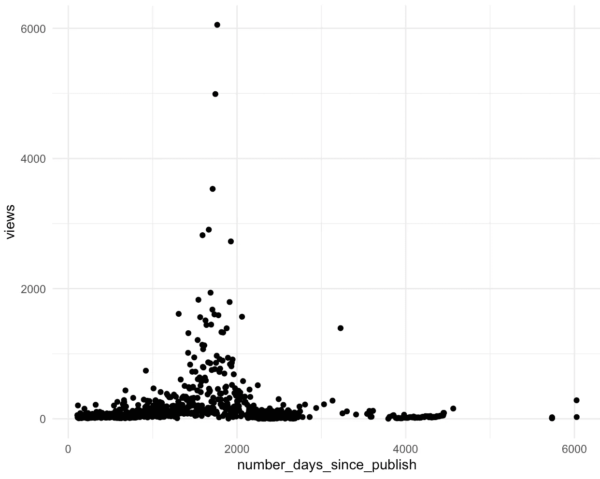
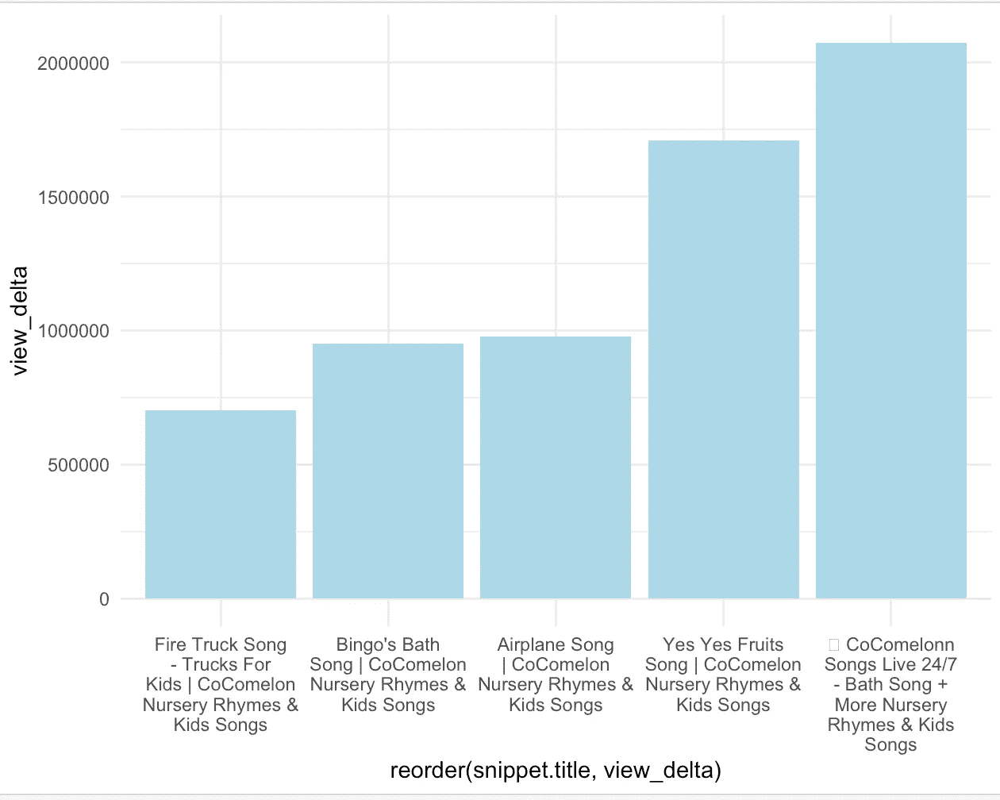

# R 数据分析：如何为您的孩子找到完美的 Cocomelon 视频

> 原文：[`towardsdatascience.com/r-for-data-analysis-how-to-find-the-perfect-cocomelon-video-for-your-kids-833d6b2d9267`](https://towardsdatascience.com/r-for-data-analysis-how-to-find-the-perfect-cocomelon-video-for-your-kids-833d6b2d9267)

## 如何使用 R 从头开始构建一个端到端的数据项目，探索新的流行 Cocomelon 视频

[](https://chengzhizhao.medium.com/?source=post_page-----833d6b2d9267--------------------------------)[](https://towardsdatascience.com/?source=post_page-----833d6b2d9267--------------------------------) [Chengzhi Zhao](https://chengzhizhao.medium.com/?source=post_page-----833d6b2d9267--------------------------------)

·发布于 [Towards Data Science](https://towardsdatascience.com/?source=post_page-----833d6b2d9267--------------------------------) ·9 分钟阅读·2023 年 3 月 4 日

--


由 [Tony Sebastian](https://unsplash.com/@tonyzebastian?utm_source=unsplash&utm_medium=referral&utm_content=creditCopyText) 提供的照片，来源于 [Unsplash](https://unsplash.com/photos/7sWm1yRJZhg?utm_source=unsplash&utm_medium=referral&utm_content=creditCopyText)

Cocomelon — Nursery Rhymes 是全球第二大 YouTube 频道（155M+ 订阅者）。这是一个如此受欢迎和有用的频道，对于幼儿和父母来说都是不可或缺的。我喜欢和我的儿子一起观看 Cocomelon。

在观看 Cocomelon 视频一个月后，我注意到 YouTube 上重复推荐相同的视频。像 “The wheel on the bus” 和 “bath song” 这样的热门视频虽然有趣，但它们已经发布多年，孩子们看了会感到厌倦。作为父亲，我希望展示一些较新的高质量 Cocomelon 视频。作为数据专业人士，我也希望深入探索全球第二大 YouTube 频道的数据，以获得更多见解并发现有趣的数据。

YouTube 频道中的所有视频只提供用户两个选项：最近上传（按时间排序）和热门（按观看次数排序）。我可以去最近上传的标签页，逐个点击。然而，Cocomelon 频道有 800 多个视频，这会很耗时间。

好消息是，我是一名工程师，知道如何利用数据构建某些东西。因此，我开始编写代码，收集数据，进行清理、可视化，并获得更多见解。**我将分享我使用 R 进行数据分析的历程：从头开始构建一个端到端的解决方案，用于探索流行的 Cocomelon 视频。**

*注意：虽然我在 R 中编写的示例代码和 Youtube 频道是针对 Cocomelon 的，但它们是我的偏好。你也可以使用 Python 或 Rust 的数据分析工具进行编写，我将展示如何从 Youtube 获取数据适用于其他频道。*

# 如何使用 R 获取 Youtube 数据

数据源总是任何数据项目的起点。我已经进行了几次尝试来达到最终解决方案。

我首先在 Google 上搜索了术语：“Cocomelon 的 Youtube 观看统计”，它显示了一些关于频道的统计数据，但没有覆盖每个视频的更详细数据。这些网站广告泛滥，网络爬虫可能会很困难。

然后我查看了 [Kaggle](https://www.kaggle.com/) 上的公共数据集，像 [CC0](https://creativecommons.org/publicdomain/zero/1.0/) 数据集中的 [Trending YouTube Video Statistics](https://www.kaggle.com/datasets/datasnaek/youtube-new) 可能是一个不错的选择。然而，在探索数据集后，我发现了两个问题：

1.  数据集中不包含 Cocomelon

1.  内容是几年前获取的，需要我想要搜索的更新视频。

我唯一的选择是直接从 Youtube 拉取最新数据。这里还有两个选项：

+   **网络爬虫**：我可以设置一个爬虫或在 GitHub 上找到一个项目直接使用。我的担忧是，如果爬虫过于激进，可能会封锁我的 Youtube 账户。而且爬虫对于从众多视频中拉取数据并不是很高效。

+   [**Youtube API**](https://developers.google.com/youtube/v3)**:** 我最终找到了这个解决方案。它高效且提供一些基本的视频统计信息：观看次数和点赞数。我们可以进一步利用这些信息来构建我们的数据分析项目。

# 将 Youtube 数据加载到 R 数据框

## 获取 Youtube API 密钥以拉取数据

Youtube API 允许你从 Youtube 拉取数据。你首先需要访问 [`console.cloud.google.com/apis`](https://console.cloud.google.com/apis)，然后使用 API 密钥“创建凭据”。默认密钥没有限制；你可以将 API 密钥仅限于 Youtube 使用。



Google Cloud 创建凭据 | 作者图片

## 使用 R 获取 Youtube 频道播放列表

一旦你有了 API 密钥，请参考 [Youtube 数据 API](https://developers.google.com/youtube/v3/docs) 获取更多关于支持的潜在数据的参考。为了在查询阶段检查 API，我们可以使用 [Postman](https://www.postman.com/) 等工具或直接复制完整 URL。

例如，我们想拉取 Cocomelon 的频道信息；然而，我通过检查其 URL 没有找到其频道 id，但通过一些谷歌搜索找到了它。

```py
https://www.youtube.com/channel/UCbCmjCuTUZos6Inko4u57UQ
```

现在我们可以使用频道 id 来构建 GET 方法，并将 API 密钥填入密钥字段：

```py
https://www.googleapis.com/youtube/v3/channels?part=snippet,contentDetails,statistics&id=UCbCmjCuTUZos6Inko4u57UQ&key=
```

从返回的 JSON 中，最关键的信息是播放列表信息，它进一步告诉我们所有视频的情况。

```py
"contentDetails": {
  "relatedPlaylists": {
    "likes": "",
    "uploads": "UUbCmjCuTUZos6Inko4u57UQ"
  }
}
```

由于新采用了分页，每页最多 50 项，调用 `playlistItems` 将需要时间才能达到最终列表。我们需要使用当前的令牌来检索下一页，直到找不到下一页为止。我们可以在 R 中将所有内容整合在一起。

```py
library(shiny)
library(vroom)
library(dplyr)
library(tidyverse)
library(httr)
library(jsonlite)
library(ggplot2)
library(ggthemes)
library(stringr)

key <- "to_be_replace"
playlist_url <-
  paste0(
    "https://www.googleapis.com/youtube/v3/playlistItems?part=snippet,contentDetails,status&maxResults=50&playlistId=UUbCmjCuTUZos6Inko4u57UQ&key=",
    key
  )

api_result <- GET(playlist_url)
json_result <- content(api_result, "text", encoding = "UTF-8")
videos.json <- fromJSON(json_result)
videos.json$nextPageToken
videos.json$totalResults

pages <- list(videos.json$items)
counter <- 0

while (!is.null(videos.json$nextPageToken)) {
  next_url <-
    paste0(playlist_url, "&pageToken=", videos.json$nextPageToken)
  api_result <- GET(next_url)
  print(next_url)
  message("Retrieving page ", counter)
  json_result <- content(api_result, "text", encoding = "UTF-8")
  videos.json <- fromJSON(json_result)
  counter <- counter + 1
  pages[[counter]] <- videos.json$items
}
## Combine all the dataframe into one
all_videos <- rbind_pages(pages)
## Get a list of video
videos <- all_videos$contentDetails$videoId
```

`all_videos` 应该会给我们所有视频的字段。我们在这个阶段只关心 videoId，这样我们才能获取每个视频的详细信息。

## 迭代视频列表并获取每个视频的数据

一旦所有视频都存储在一个向量中，我们可以复制类似于播放列表的处理过程。这次会更容易，因为我们不需要处理分页。

在这个阶段，我们会更关注最终从视频 API 调用中提取的数据。我选择了那些用于后续数据分析和可视化的。为了节省再次提取数据的时间，最好将数据持久化到 CSV 文件中，这样我们就不必多次运行 API 调用了。

```py
videos_df = data.frame()
video_url <-
  paste0(
    "https://www.googleapis.com/youtube/v3/videos?part=contentDetails,id,liveStreamingDetails,localizations,player,recordingDetails,snippet,statistics,status,topicDetails&key=",
    key
  )

for (v in videos) {
  a_video_url <- paste0(video_url, "&id=", v)
  print(v)
  print(a_video_url)
  api_result <- GET(a_video_url)
  json_result <- content(api_result, "text", encoding = "UTF-8")
  videos.json <- fromJSON(json_result, flatten = TRUE)
  # colnames(videos.json$items)
  video_row <- videos.json$items %>%
    select(
      snippet.title,
      snippet.publishedAt,
      snippet.channelTitle,
      snippet.thumbnails.default.url,
      player.embedHtml,
      contentDetails.duration,
      statistics.viewCount,
      statistics.commentCount,
      statistics.likeCount,
      statistics.favoriteCount,
      snippet.tags
    )
  videos_df <- rbind(videos_df, video_row)
}

write.csv(videos_df, "~/cocomelon.csv", row.names=TRUE)
```

# 在 R 中探索 Cocomelon YouTube 视频数据

数据已为我们下一阶段探索 Cocomelon YouTube 视频做好准备。现在是进行一些清理并创建可视化以展示发现的结果的时候了。

默认的对象数据类型在后续排序中效果不佳，因此我们需要将一些对象转换为浮点数或日期类型。

```py
videos_df <- videos_df %>%  transform(
  statistics.viewCount = as.numeric(statistics.viewCount),
  statistics.likeCount = as.numeric(statistics.likeCount),
  statistics.favoriteCount = as.numeric(statistics.favoriteCount),
  snippet.publishedAt = as.Date(snippet.publishedAt)
)
```

## 最受欢迎的 5 个 Cocomelon 视频是什么？

这部分很简单。我们需要选择感兴趣的字段，然后按字段 `viewCount` 降序排序视频。

```py
videos_df %>%
  select(snippet.title, statistics.viewCount) %>% 
  arrange(desc(statistics.viewCount)) %>% head(5)

# Output:
#                                                    snippet.title statistics.viewCount
#1               Bath Song | CoComelon Nursery Rhymes & Kids Songs           6053444903
#2       Wheels on the Bus | CoComelon Nursery Rhymes & Kids Songs           4989894294
#3     Baa Baa Black Sheep | CoComelon Nursery Rhymes & Kids Songs           3532531580
#4 Yes Yes Vegetables Song | CoComelon Nursery Rhymes & Kids Songs           2906268556
#5 Yes Yes Playground Song | CoComelon Nursery Rhymes & Kids Songs           2820997030
```

对于你之前观看过 Cocomelon 视频的人来说，看到“Bath Song”、“Wheels on the Bus”和“Baa Baa Black Sheep”排名前三并不意外。这与 Cocomelon 在 YouTube 上的 `popular` 标签相匹配。此外，“Bath Song”的播放次数比第二名“Wheels on the Bus”多 20% 以上。我可以看出许多幼儿在洗澡时遇到困难，让孩子们观看这个视频可以让他们知道如何洗澡，并安慰他们让他们平静下来。

我们还创建了一个包含前 5 个视频的条形图：

```py
ggplot(data = chart_df, mapping = aes(x = reorder(snippet.title, statistics.viewCount), y = statistics.viewCount)) +
  geom_bar(stat = "identity",fill="lightgreen") +
  scale_x_discrete(labels = function(x) str_wrap(x, width = 16)) +
  theme_minimal()
```



最受欢迎的 5 个 Cocomelon 视频 | 图片作者

# 观看次数和点赞数之间的相关性是什么？

观看次数和点赞数之间是否存在相关性：视频是否更有可能因观看次数多而获得点赞？

我们可以进一步用数据证明这一点。首先，标准化 `viewCount` 和 `likeCount` 以便更好地进行可视化。其次，我们还计算了自视频上传以来的天数，以获取流行视频的创建时间。

```py
chart_df <- videos_df %>%
  mutate(
    views = statistics.viewCount / 1000000,
    likes = statistics.likeCount / 10000,
    number_days_since_publish = as.numeric(Sys.Date() - snippet.publishedAt)
  )

ggplot(data = chart_df, mapping = aes(x = views, y = likes)) +
  geom_point() +
  geom_smooth(method = lm) + 
  theme_minimal()

cor(chart_df$views, chart_df$likes, method = "pearson")
## 0.9867712
```



Cocomelon 视频观看次数和点赞数的相关性 | 图片作者

相关系数为 0.98，非常高的相关性：视频的观看次数越多，获得点赞的可能性越大。令人着迷的是，只有六个视频的观看次数超过 20 亿：家长和孩子们喜欢这六个视频，并且可能会观看很多次。

我们可以进一步绘制热门视频，并发现最热门的视频，年龄在 1500–2000 天之间，显示这些视频大约在 2018 或 2019 年制作。



按观看次数计算的发布天数 | 作者提供的图片

# 如何检查新的热门 Cocomelon 视频？

热门视频很容易获取。然而，4、5 年前制作的热门视频由于大量的每日视频仍然可能保持热门。

怎么样找到新的 Cocomelon 视频的观看次数？由于我们只能从 Youtube API 拉取当前状态下的观看次数，我们需要在几天之间从 API 拉取数据，暂时存储数据。

```py
f1 <- read_csv("~/cocomelon_2023_2_28.csv")
df2 <- read_csv("~/cocomelon_2023_3_2.csv")

df1<- df1 %>% transform(
  statistics.viewCount = as.numeric(statistics.viewCount)
)

df2<- df2 %>% transform(
  statistics.viewCount = as.numeric(statistics.viewCount),
  snippet.publishedAt = as.Date(snippet.publishedAt)
)

df1 <- df1 %>% select(snippet.title,
                      statistics.viewCount)
df2 <- df2 %>% select(snippet.title,
                      snippet.publishedAt,
                      statistics.viewCount)

# Join data by snippet.title
joined_df <- inner_join(df1, df2, by = 'snippet.title')
joined_df <- joined_df %>%
  mutate(
    view_delta = statistics.viewCount.y - statistics.viewCount.x,
    number_days_since_publish = as.numeric(Sys.Date() - snippet.publishedAt)
  )

# Recent Video uploaded within 200 days and top 5 of them by view delta
chart_df <- joined_df %>%
  filter(number_days_since_publish<=200) %>% 
  select(snippet.title, view_delta) %>%
  arrange(desc(view_delta)) %>% head(5)

ggplot(data = chart_df,
       mapping = aes(
         x = reorder(snippet.title, view_delta),
         y = view_delta
       )) +
  geom_bar(stat = "identity", fill = "lightblue") +
  scale_x_discrete(
    labels = function(x)
      str_wrap(x, width = 16)
  ) +
  theme_minimal()

# Output
#                                                                 snippet.title view_delta
#1 🔴 CoComelon Songs Live 24/7 -  Bath Song + More Nursery Rhymes & Kids Songs    2074257
#2                  Yes Yes Fruits Song | CoComelon Nursery Rhymes & Kids Songs    1709434
#3                        Airplane Song | CoComelon Nursery Rhymes & Kids Songs     977383
#4                    Bingo's Bath Song | CoComelon Nursery Rhymes & Kids Songs     951159
#5    Fire Truck Song - Trucks For Kids | CoComelon Nursery Rhymes & Kids Songs     703467
```



新的热门 Cocomelon 视频 | 作者提供的图片

顶级热门视频是 🔴 CoComelon Songs Live 24/7。这个视频展示了家长可以让孩子们自动轮播视频而无需明确切换视频。其他视频也展示了潜在的好单曲，值得推荐。

# 最后的想法

在 Youtube 上有很多适合孩子观看的视频。Cocomelon 有许多视频，我希望在孩子每天允许的观看时间内展示好的视频。寻找这些热门视频对数据专业人士来说是一次迷人的探索。

希望我的帖子对你有帮助。接下来，我将继续我的 R 之旅，并使用 Shiny 构建一个与用户互动的应用程序。

希望这个故事对你有帮助。本文是**我工程与数据科学故事系列的一部分**，目前包括以下内容：


[赵成智](https://chengzhizhao.medium.com/?source=post_page-----833d6b2d9267--------------------------------)

## 数据工程与数据科学故事

[查看列表](https://chengzhizhao.medium.com/list/data-engineering-data-science-stories-ddab37f718e7?source=post_page-----833d6b2d9267--------------------------------) 53 个故事！[](../Images/8b5085966553259eef85cc643e6907fa.png)

你也可以 [**订阅我的新文章**](https://chengzhizhao.medium.com/subscribe) 或成为 [**推荐的 Medium 会员**](https://chengzhizhao.medium.com/membership)，享受对 Medium 上所有故事的无限访问。

如果有任何问题/评论，**请随时在此故事的评论中留言**或通过 [Linkedin](https://www.linkedin.com/in/chengzhizhao/) 或 [Twitter](https://twitter.com/ChengzhiZhao) **直接联系我**。
