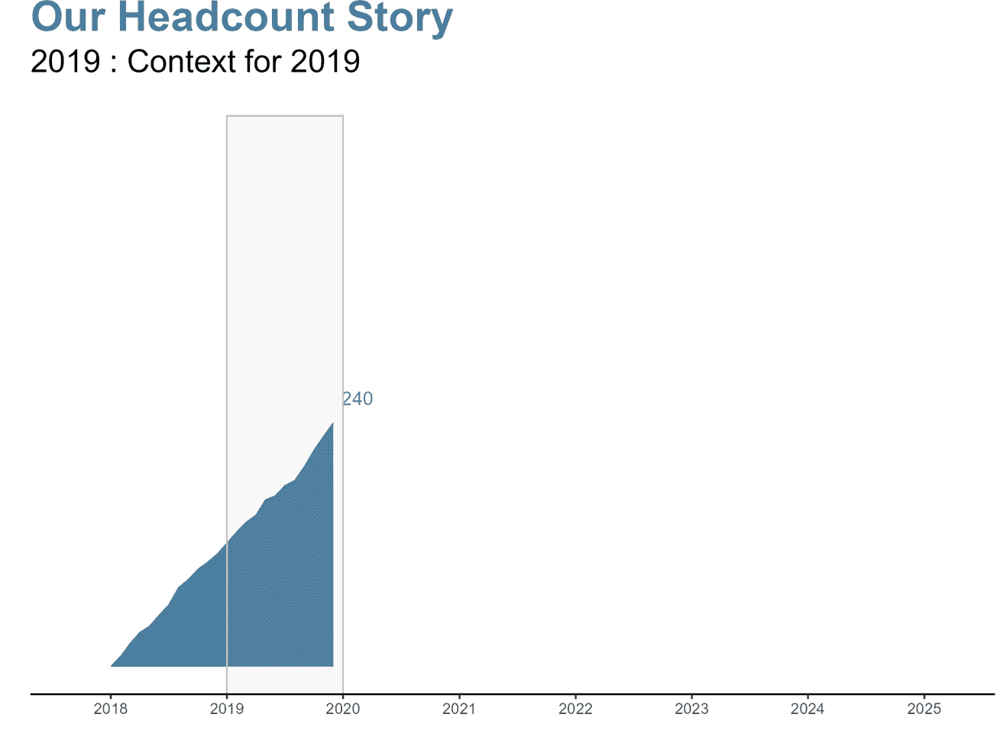
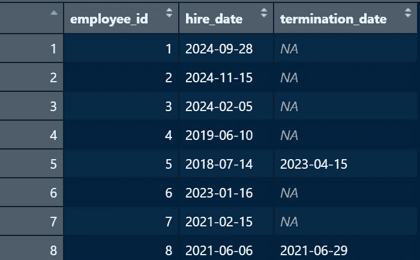
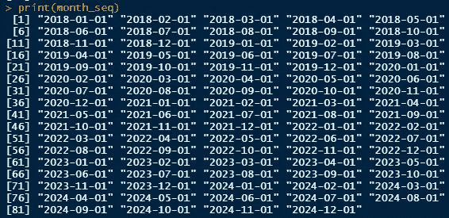
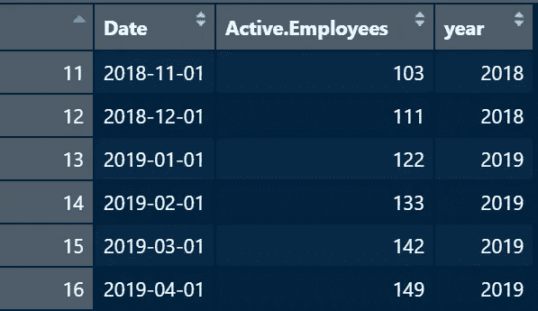
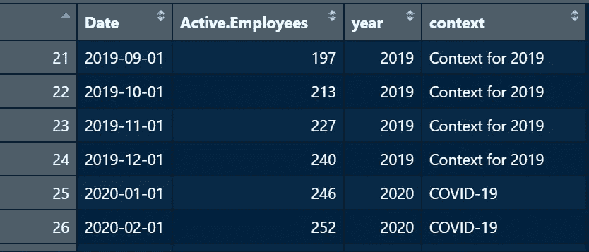
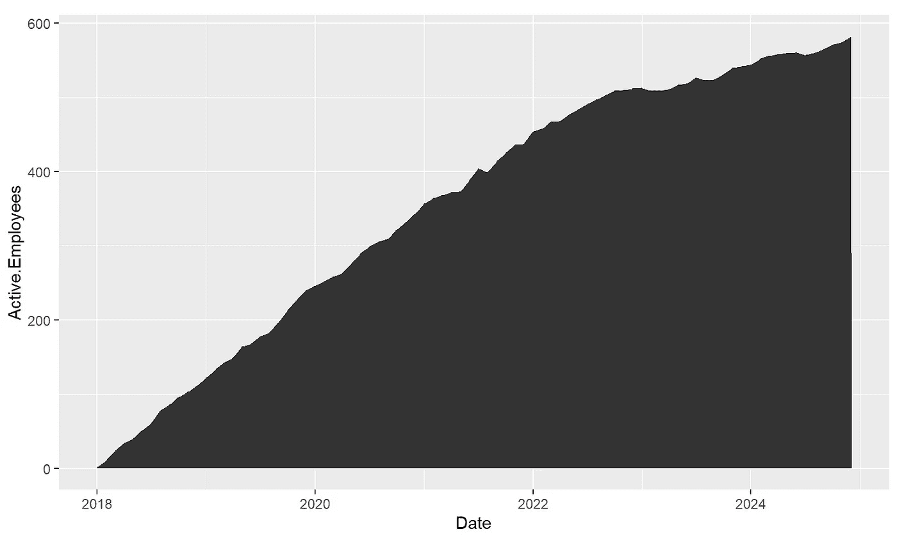
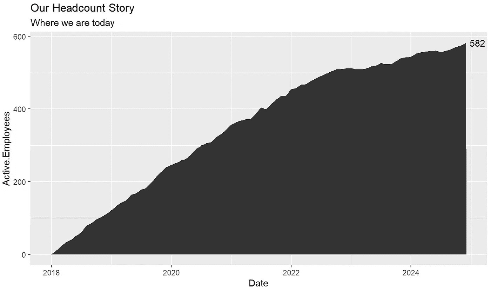
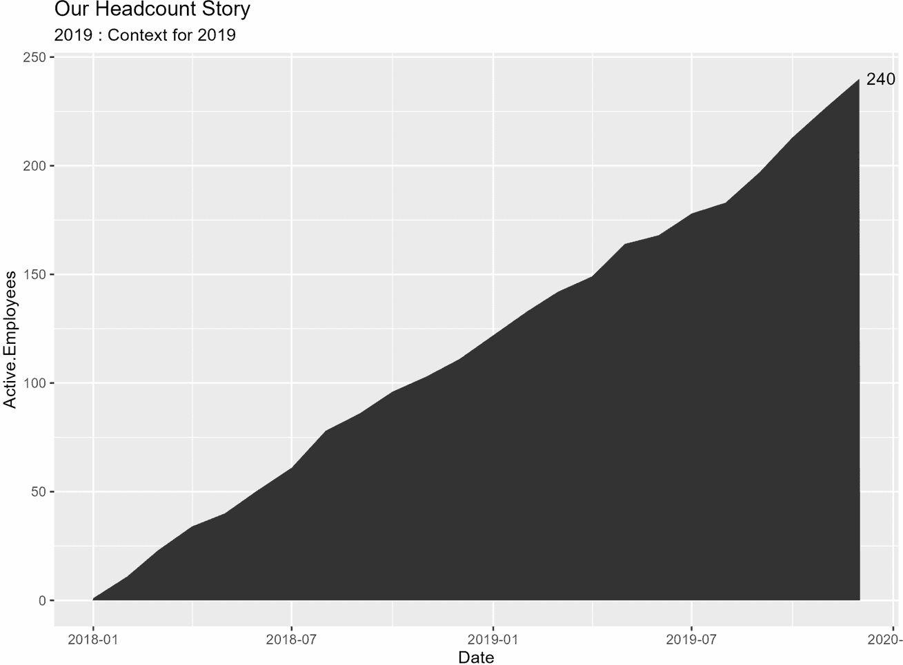

# R 工具包用于人力分析：讲述你的员工人数故事

> 原文：[`towardsdatascience.com/r-toolkit-for-people-analytics-telling-your-headcount-story-d872402d4e8b`](https://towardsdatascience.com/r-toolkit-for-people-analytics-telling-your-headcount-story-d872402d4e8b)

## 使用 R 解决的人力分析中的常见挑战

[](https://jeagleson.medium.com/?source=post_page-----d872402d4e8b--------------------------------)[](https://towardsdatascience.com/?source=post_page-----d872402d4e8b--------------------------------) [Jenna Eagleson](https://jeagleson.medium.com/?source=post_page-----d872402d4e8b--------------------------------)

·发布于[Towards Data Science](https://towardsdatascience.com/?source=post_page-----d872402d4e8b--------------------------------) ·阅读时间 11 分钟·2023 年 7 月 6 日

--

在人力分析工作中，你经常需要讲述公司员工人数的变化及公司如何演变成今天的样子。我经常看到这被展示为[瀑布图](https://www.storytellingwithdata.com/blog/2020/11/16/what-is-a-waterfall)，这很好，但在分享逐年变化时，特别是对不太懂技术的观众，可能会变得模糊。

为了满足这个需求，我创建了逐年的迭代图，突出显示每年的一些额外背景信息。这些图表可以添加到 PowerPoint 中逐年展示，或者可以动画化为一个 gif。让我们一起制作吧！



用区域图的 gif 讲述员工人数的变化。图片由作者提供。

挑战：讲述我们的员工人数如何逐年变化，最终达到今天的状态。

步骤：

1\. 加载必要的包和数据

2\. 计算每月员工人数

3\. 为每一年增加相关的背景信息

4\. 创建图表

5\. 设置自动为每年创建图表

6\. 调整主题和图表格式

# 1\. 加载必要的包和数据

对于这个挑战，我们将需要以下包：

- tidyverse

- hrbrthemes（用于美化我们的图表）

要创建我们的视觉效果，我们需要一个包含唯一标识符（即员工 ID）、入职日期和离职日期的文件。我将使用模拟数据来进行这个例子（在底部我包含了生成模拟数据的代码，如果你想逐步跟随）。

```py
# load packages
library(tidyverse)
library(hrbrthemes)

# load data
employee_data <- mock_data 

# alternatively you could use something like employee_data <- read.csv("input.csv")
```

顺便提一下，我通常会给我最初读取的数据分配一个变量，然后创建一个新变量用于后续的操作。这并不总是必要的，但在处理大数据集时可以加快速度，这样你就不需要每次修改代码时都重新加载数据。



原始输入数据的概览。图片来源于作者。

为了确保计算正确，我们需要确保 R 知道入职日期和终止日期实际上是日期。一般来说，在 R 中处理日期可能会很麻烦，但为了这个挑战，我们需要将日期列格式化为日期，并确保没有 NA。

```py
df <- employee_data %>%
  mutate(Hire.Date = as.Date(Hire.Date, format = "%m/%d/%Y"),
         Termination.Date = as.Date(Termination.Date, format = "%m/%d/%Y"))
```

在我的输入文件中，仍在职的员工终止日期为空，因为他们尚未离职。如果日期列中有空值，R 会变得很挑剔，所以我们要添加一行代码，给这些空值赋一个很远的未来日期。

```py
df <- employee_data %>%
  mutate(Hire.Date = as.Date(Hire.Date, format = "%m/%d/%Y"),
         Termination.Date = as.Date(Termination.Date, format = "%m/%d/%Y")) %>%
  mutate(Termination.Date = if_else(is.na(Termination.Date), 
         as.Date("2100-12-31"), Termination.Date))
```

这一行代码表示在终止日期列中只要有 NA/空白，就赋一个很远的未来日期。在这种情况下，选择 2100 年 12 月 31 日。希望到那时我还不在工作。

# 2\. 计算每月人员数量

希望这一步看起来很简单，但我在弄明白这个过程时遇到了不少困难，所以请对自己有耐心。

首先，我们将创建一个包含每个月日期的序列，然后设置一个数据框作为我们每月人员数量的占位符，最后我们将使用`sapply`函数计算每个月的人员数量。开始吧！

为每个月创建一个日期序列（例如，2023 年 1 月 1 日、2023 年 2 月 1 日等）：

```py
month_seq <- seq(from = min(df$hire_date),
                 to = max(df$hire_date),
                 by = "1 month")
```

这表示从最早的入职日期开始，到最晚的入职日期，按月份生成序列。这给我们每个月的数据留下一个值。它的样子是这样的：



显示每月序列。图片来源于作者。

现在我们要利用这个序列来创建一个起始数据框，然后我们可以在其中添加人员数量。

```py
headcount_data <- data.frame(Date = month_seq)
```

好的，现在进入棘手的部分。我们将计算`headcount_data`数据框中每个日期的在职员工人数。也就是说，计算 2018 年 1 月 1 日、2018 年 2 月 2 日等日期的在职员工数量。

假设我们要计算 2018 年 1 月 1 日的情况。我们需要找出入职日期早于或等于 2018 年 1 月 1 日且终止日期晚于 2018 年 1 月 1 日的员工数量。换句话说，就是已经被雇佣但尚未离职的员工数量。

然后我们只需使用`sapply`对`headcount_data`中的每个日期进行操作。

```py
headcount_data <- headcount_data %>%
  mutate(Active.Employees = sapply(Date, function(x) {
           sum(x >= df$hire_date & (is.na(df$termination_date) | x < df$termination_date))
         })) 
```

还跟得上吗？如果你已经把所有内容都搞定了，给自己一个大大的鼓励吧！如果你遇到问题，也要为自己走到这一步而感到骄傲，并查看[完整代码在这里](https://github.com/jeagleso/headcount_story/blob/main/example.R)，看看是否能发现代码中的任何不一致之处。

# 3\. 添加相关背景

这是讲故事部分的开始。根据你对组织的了解程度，你可能需要采访一些主题专家或资深员工。基本上，你希望添加有助于解释 headcount 增减的背景信息。

我想为每一年添加背景（你也可以按月添加），所以我将向 headcount_data 添加一个年份列。

```py
headcount_data <- headcount_data %>% 
  mutate(year = as.integer(year(Date))
```

这将为每个日期添加一个年份列：



为每个日期添加了年份列。图片来源：作者。

现在，我们要为每一年添加背景。假设对于 2020 年，我们想添加背景“COVID-19”，并希望在 2020 年的每个月都显示出来。

为此，我们将使用 case_when 来添加一个基于年份的“context”列。

```py
headcount_data <- headcount_data %>%
  mutate(context = case_when(
    year == 2018 ~ "Context for 2018",
    year == 2019 ~ "Context for 2019",
    year == 2020 ~ "COVID-19",
    TRUE ~ "No additional context"
))
```

上面的例子中，我们是说对于每一行年份为 2018 的数据，我们希望背景列为“2018 的背景”。你可以为每一年感兴趣的年份添加背景，然后在 TRUE 条件下，可以指定对未在上面指定的年份的背景是什么。

到这个时候，你的 headcount_data 应该看起来像这样：



添加了背景列的数据集。图片来源：作者。

现在进入有趣的部分！我们可以开始绘图了。

# 4\. 创建图表

首先，我们将使用 ggplot 创建一个包含所有数据的基本面积图。我们将把 Date 放在 x 轴上，把 Active.Employees 放在 y 轴上，这样我们就可以看到 headcount 随时间的变化。

```py
headcount_data %>%
  ggplot(aes(x = Date, y = Active.Employees)) +
  geom_area()
```

这将给你这个基本图表：



完整数据集的基本面积图。图片来源：作者。

现在我们开始进行一些基本的 zhushing，然后再进行一些更高级的 zhushing：

1\. 添加注释

2\. 添加标题和副标题

我们将添加包含最终 headcount 和年份的注释（当我们为每一年制作图表时，这会变得更相关）。让我们先将它们分配给变量，以便于每年更新：

```py
# annotations
annotation_ending_year <- max(headcount_data$year)
annotation_ending_headcount <- max(headcount_data$Active.Employees)

# titles
labels_title <- "Our Headcount Story"
labels_subtitle <- last(headcount_data$context)
```

现在我们将把这些添加到我们的基本图表中：

```py
headcount_data %>%
  ggplot(aes(x = Date, y = Active.Employees)) +
  geom_area() +
  labs(title = labels_title,
       subtitle = labels_subtitle) +
  annotate("text", 
           x = max(headcount_data$Date),
           y = max(headcount_data$Active.Employees),
           label = annotation_ending_headcount,
           hjust = -.25)
```

这将给我们一个基本的图表，并附带一些额外的背景信息：



带有标题和注释的基本图表。图片来源：作者。

既然我们创建了基本图表，我们希望自动为每一年创建一个附加图表。所以将会有一个从 2018 年开始到 2018 年底的图表，一个从 2018 年到 2019 年底的图表，一个从 2018 年到 2020 年底的图表，等等。

# 5\. 自动为每年创建一个图表

我们将使用 for 循环来为数据集中的每一年创建一个图表。

基本上，我们将把数据集中每个独特的年份放到一个名为“years”的向量中。然后对于“years”中的每一年，我们将创建一个数据子集，然后绘制该子集的图表。这听起来可能很混乱，但查看代码可能会更清楚。

首先进行一些设置：

```py
# create a vector for unique years
years <- unique(headcount_data$year)

# empty list for plots to go to
plots <- list()
```

现在进入循环！这可能看起来很复杂，但一步一步来就好：

```py
# loop over the each year in years and create plots
for (i in 2:length(years)) {
  # create subset adding one year at a time
  subset_df <- headcount_data %>% 
    filter(year <= years[i])

  # calculations for annotation
  annotation_ending_year <- max(subset_df$Date)

  annotation_ending_active <- subset_df %>% 
    filter(Date == ending_year) %>% 
    select(Active.Employees) %>% 
    as.numeric()

  # create a plot (p) using the subset
  p <- subset_df %>%
    ggplot(aes(x = Date, y = Active.Employees)) +
    geom_area() +
    labs(title = labels_title,
         subtitle = labels_subtitle) +
    annotate("text", 
             x = max(subset_df$Date),
             y = max(subset_df$Active.Employees),
             label = ending_active,
             hjust = -.25)

  # save each plot 
  ggsave(p, 
         file = paste("example_plot_", years[i], ".png"), 
         height = 6, width = 8, units = "in")
}
```

你现在应该在你的工作目录中有一个名为“example_plot_year”的每年图表。我喜欢每年一个单独的图表，这样我可以把每一个放在幻灯片中，并在大家有问题时暂停。或者，你可以[将图表动画化](https://gganimate.com/)并创建一个 gif，或者使用像[ScreenToGif](https://www.screentogif.com/)这样的屏幕录制工具，得到这样的效果：



使用 ScreenToGif 合成的图表动画 gif。图片由作者提供。

我们做到了！！！！剩下的就是添加一些样式，以使图表更符合你的品牌，并添加一个矩形来突出显示最近的一年。

# 6\. 调整主题和图表格式

我想做的第一件事是添加一个矩形来突出显示最近的一年。这将帮助观众知道要关注的重点，并且在每个图表中都会更新，这样我们可以在更大的背景下逐年查看。

我们将通过添加另一个“rect”注解层来完成，这看起来会是这样的：

```py
annotate("rect", xmin = , xmax = , ymin = , ymax = )
```

这是另一个花了我一段时间才调整到我想要的方式，但关键点在于：

**X 轴**：我希望矩形从给定年份内的第一个（即底部）日期（即我们数据子集中的最大年份）开始，并在给定年份内的最后一个（即顶部）日期（即我们数据子集中的最大年份）结束。因此，对于 2019 年的图表，我们希望矩形从 2019 年 1 月 1 日开始，到 2019 年 12 月 1 日结束。

```py
annotate("rect", 
          xmin = floor_date(max(subset_df$Date), "year"), 
          xmax = ceiling_date(max(subset_df$Date), "year")
```

**Y 轴**：我希望矩形从 y 轴开始，到该年最终人数以上的位置结束，这样更容易阅读而不会显得拥挤。再看一下 2019 年，我希望矩形从 y 轴开始，并在最终人数 240 之上(+300)的位置结束。

```py
 annotate("rect",
             xmin = floor_date(max(subset_df$Date), "year"),
             xmax = ceiling_date(max(subset_df$Date), "year"),
             ymin = -Inf, ymax = ending_active + 300)
```

**样式**：最后，我会把框设置为灰色，并将透明度改为 0.1，使其相当透明，你可以看到下面的区域图：

```py
 annotate("rect",
             xmin = floor_date(max(subset_df$Date), "year"),
             xmax = ceiling_date(max(subset_df$Date), "year"),
             ymin = -Inf, ymax = ending_active + 300,
             alpha = .1, color = "gray", fill = "gray")
```

**限制坐标轴**：为了使过渡更平滑，我将对 x 轴和 y 轴设置限制，使每个图表的比例相同。

```py
scale_x_date(breaks = "1 year", date_labels = "%Y",
                 expand = c(.1,.1),
                 limits = c(min(headcount_data$Date), max(headcount_data$Date)))
```

太棒了！我们快完成了，现在我要对主题进行一些更改，然后给自己倒一杯酒。现在是时候发挥你自己的创意了，我的最终效果是这样的：


最终产品！图片由作者提供。

这是我最终的 for 循环代码：

```py
# loop over the each year in years and create plots
for (i in 2:length(years)) {
  # create subset adding one year at a time
  subset_df <- headcount_data %>%
    filter(year <= years[i])

  # calculations for annotation
  ending_year <- max(subset_df$Date)

  ending_active <- subset_df %>%
    filter(Date == ending_year) %>%
    select(Active.Employees) %>%
    as.numeric()

  # create a plot (p) using the subset
  p <- subset_df %>%
    ggplot(aes(x = Date, y = Active.Employees)) +
    geom_area(fill = "#457b9d") +
    labs(title = "Our Headcount Story",
         subtitle = paste(years[i],":", last(subset_df$context)),
         x = "", y = "") +
    scale_x_date(breaks = "1 year", date_labels = "%Y",
                 expand = c(.1,.1),
                 limits = c(min(headcount_data$Date), max(headcount_data$Date))) +
    theme_classic(base_family = "Arial") +
    theme(plot.title = element_text(size = 24, face = "bold", color = "#457b9d"),
          plot.subtitle = element_text(size = 18),
          panel.grid.major = element_blank(),
          panel.grid.minor = element_blank(),
          axis.ticks.y = element_blank(),
          axis.text.y = element_blank(),
          axis.line.y = element_blank()) +
    annotate("text", x = ending_year,
             y = ending_active, label = ending_active,
             vjust = -1.25, hjust = -.25, color = "#457b9d") +
    annotate("rect",
             xmin = floor_date(max(subset_df$Date), "year"),
             xmax = ceiling_date(max(subset_df$Date), "year"),
             ymin = -Inf, ymax = ending_active + 300,
             alpha = .1, color = "gray", fill = "gray")

  # save each plot
  ggsave(p,
         file = paste("example_plot_final", years[i], ".png"),
         height = 6, width = 8, units = "in")

}
```

全部完成！

我们现在有了一个动态视图，展示了我们的员工人数如何随着时间的推移而变化，并在副标题中提供了额外的背景。一些未来迭代的想法：使用 gganimate 制作图表，为每年的员工人数添加百分比变化，如果员工人数增加或减少则改变图表颜色，添加增长趋势线的预测，可能性无穷无尽！

你尝试制作了吗？如果是的话，我很想看看你做了什么！

[Github 上的完整代码，请点击这里。](https://github.com/jeagleso/headcount_story/blob/main/example.R)

想要更多通用的人员分析资源吗？

[](https://jeagleson.medium.com/12-free-resources-to-get-started-in-people-analytics-53ff169dccb6?source=post_page-----d872402d4e8b--------------------------------) [## 12+ 个免费资源，助你入门人员分析

### 我推荐给那些想要开始人员分析职业生涯的人的免费资源。

[jeagleson.medium.com](https://jeagleson.medium.com/12-free-resources-to-get-started-in-people-analytics-53ff169dccb6?source=post_page-----d872402d4e8b--------------------------------)

如果你想要更多这样的资源，并且访问网站上的所有优质内容，可以使用我的链接以每月$5 注册（我将获得少量佣金，但你无需额外支付费用）。

[](https://jeagleson.medium.com/membership?source=post_page-----d872402d4e8b--------------------------------) [## 使用我的推荐链接加入 Medium - Jenna Eagleson

### 阅读 Jenna Eagleson 的每一个故事（以及 Medium 上成千上万其他作者的故事）。你的会员费直接支持…

[jeagleson.medium.com](https://jeagleson.medium.com/membership?source=post_page-----d872402d4e8b--------------------------------)

[**Jenna Eagleson**](https://medium.com/@jeagleson)

我的背景是工业组织心理学，我在人员分析领域找到了归属。数据可视化让我的工作生动起来。我喜欢使用 Power BI、R、Tableau 以及我遇到的其他工具进行学习和开发。我很想了解你的经历！可以通过[Linkedin](https://www.linkedin.com/in/jenna-eagleson/)或[Twitter](https://twitter.com/JennaEagleson)与我联系。
