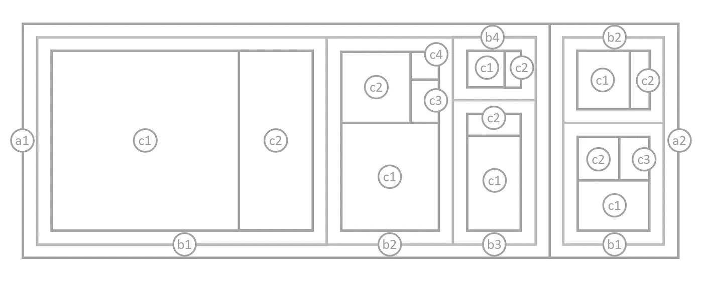

# 径向树图：将树图扩展到圆形映射

> 原文：[`towardsdatascience.com/radial-treemaps-extending-treemaps-to-circular-mappings-7b47785191da`](https://towardsdatascience.com/radial-treemaps-extending-treemaps-to-circular-mappings-7b47785191da)

## 了解径向树图并用 Python 创建自己的树图

[](https://medium.com/@nickgerend?source=post_page-----7b47785191da--------------------------------)[](https://towardsdatascience.com/?source=post_page-----7b47785191da--------------------------------) [Nick Gerend](https://medium.com/@nickgerend?source=post_page-----7b47785191da--------------------------------)

·发表于 [Towards Data Science](https://towardsdatascience.com/?source=post_page-----7b47785191da--------------------------------) ·阅读时间 16 分钟·2023 年 12 月 10 日

--


径向树图，作者 Nick Gerend

# **背景**

## **树图概念**

“树图”由 Ben Shneiderman 在 1990 年代初期于马里兰大学提出¹。简而言之，它是一种将层次数据以嵌套矩形的形式高效展示的方法。尽管这一概念很简单，但矩形的排列受美学偏好的影响，因此已经开发出各种排列算法来改善最终布局的外观。

## **树图原理**

给定一个层次结构，树图将层次结构中的每个分支表示为一个矩形，然后用代表子分支的较小矩形进行拼接。树图中的空间是根据数据的特定属性（通常是大小或值）进行划分的，每个矩形的面积对应于该属性的大小，使得比较层次结构中的不同部分变得容易。



树图中 a、b 和 c 组的顺序 -> 每个层级的最大项：(a1)、(a1,b1)、(a1,b1,c1)

为了考虑矩形的排列，以下是一些常见的算法，它们控制树图的构造和最终外观：

+   方形树图² - 通过调整矩形的长宽比，使矩形尽可能接近正方形

+   条形树图³ - 根据数据的层次结构，以水平或垂直方式布置矩形

+   切片和切割⁴ - 交替进行水平和垂直分割，虽然直观，但可能会生成较长的矩形

## **树图特征**

+   比例 - 每个矩形的大小与其代表的数据点成比例，使得快速识别较大和较小的项变得容易

+   线条和颜色 - 边框、边框大小和颜色以及缓冲区的巧妙使用可以划分层次级别，而容器颜色通常用来表示数据的不同维度

+   空间效率 - Treemaps 特别适合可视化大型数据集，因为它们有效利用空间，允许同时显示成千上万的项目，平铺算法确定最终布局

+   顺序 - 当收集的数据独立于已知层次结构时，分组中维度的顺序很重要，因为它决定了层次结构每一级的父子关系

总体而言，Treemap 的优势在于能够以空间高效和视觉吸引的方式展示复杂的层次数据，使其成为任何研究领域中受欢迎的可视化工具。

## 多态性

层次数据及其作为嵌套多边形和形状的表示已经有各种有用且视觉吸引的实现。我最喜欢的之一是 Voronoi Treemaps⁵，而且我特别喜欢与 Voronoi 形状结合的 3D 映射（如 3D Voronoi Treemap Sphere）的想法。

可能还有许多 Treemap 表现形式等待开发，下面我将介绍我自己实现的径向 Treemap。在撰写这篇文章时，我还发现了一个名为 Krona⁶ 的工具（它似乎有类似的输出风格），这是通过反向图像搜索我自己的径向 Treemap 图表时发现的。

# **径向 Treemap**

## **灵感**

当我创建我的第一个径向 Treemap 时，我并没有考虑实现一种 Treemap 类型，而是一个关于飞行器⁷的数据集。我的目标是将这个数据集呈现成一个喷气发动机的样子，作为一种艺术可视化作品。


“Takeoff” 作者：Nick Gerend (3/11/2021)

我最终得到的东西，最初我称之为“饼图树”图表，但后来我意识到这实际上只是 Treemapping 的一种形式，所以现在我称它为径向 Treemap！

这种类型的 Treemap 特别之处在于其“径向”布局，这种布局在圆形空间中打开了各种有用且有趣的组件。我发现将它与其他类型的径向图表结合以分解层次数据的不同方面特别有趣。

在下一部分，我将讨论构建径向 Treemap 时涉及的组件。

## 数学、算法与布局

**元素**

径向 Treemap 的数学基础利用了一些基本元素来确定多边形容器的尺寸：

+   内半径 - 勾勒出容器较短的弯曲边缘

+   外半径 - 勾勒出容器较长的弯曲边缘

+   起始角度 - 勾勒出容器在最小角度处的直边

+   结束角度 - 勾勒出容器在最大角度处的直边

这些容器本质上是沿两个半径分割的饼图或甜甜圈楔形，与传统树图的矩形容器相比显得不规则，但在相对大小比较上保持相同的直观性。


来自树图和径向树图的形状，具有类似的区域

**函数**

现在我们已经确定了容器的基本要素，接下来我们将进入数学部分，从层次结构第一层的外部父容器的面积开始。假设我们希望对外部容器的形状有一定的灵活性，我们可以为甜甜圈切片实现一个面积函数（func_area）：

```py
# area of the outer container:
#  > r1: inner radius
#  > r2: outer radius
#  > start_angle: degrees between 0-360
#  > end_angle: degress > start_angle

area = (pi*r2**2-pi*r1**2)*((end_angle-start_angle)/360)
```

这允许在甜甜圈的中间（原点和内半径之间）和起始角度与结束角度之间留有空隙。这种灵活性鼓励以独特和创造性的方式配置布局，以最大限度地利用当前的用例。可能性无限！

接下来我们需要根据容器的预期方向来确定容器的角点（func_container）：

```py
# given 3 of the 4 child container paramters (r1, r2, a1, a2),
# gathered from the parent container, and the area of the child container:
#  > r1: inner radius
#  > r2: outer radius
#  > a1: starting angle
#  > a2: ending angle
#  > area: area of the child container

# split the current container between two angles at a constant radius
# find the radius:
r2 = sqrt(((area/(a2-a1))+pi*r1**2)/pi)

# split the current container at a specific angle between two radii
# find the angle:
a2 = a1 + (area)/(pi*r2**2-pi*r1**2)
```

为了实现一个好的默认方向方法，让我们计算两个方向选项的弧长和半径长度，以选择具有最小最大长度的容器方向（我称之为“智能”方法）：

```py
# "smart" container orientation method:
# calculate the max lengths between both
# orientation options using the following:
arc_length = (2*pi*r2)*((a2-a1)/360)
radius_length = r2-r1
max_lnegth = max(arc_length, radius_length)

# select the orientation with the smallest max_length
# to avoid skinny polygons
```

剩下的就是将极坐标转换为笛卡尔坐标进行绘图（func_convertion）：

```py
# assuming a starting position of 12 o'clock:
#  > ad: angle in degrees
#  > ar: angles in radians
#  > r: radius
ar = (ad-90)*pi/180
x, y = r*cos(ar), r*sin(ar)
```

**径向树图算法**

使用已建立的函数，这里是通用算法：

1.  从一组互斥的组开始，具有 1 到多个维度，以及它们的计数或值，这些将决定多边形的面积，例如：({a1,b1,c1}, 12.3), ({a1,b2,c1}, 4.5), ({a2,b1,c2}, 32.3), ({a1,b2,c2}, 2.1), ({a2,b1,c1}, 5.9), ({a3,b1,c1}, 3.5], ({a4,b2,c1}, 3.1)

1.  设置配置输入：（位置：{起始角度、结束角度、内半径、外半径、旋转}），（排序：{降序、升序、手动}），（容器方向方法：{交替、向外、绕行、智能、图例}），（分组：{开启、关闭}）

1.  计算外部容器的面积（func_area）

1.  递归计算子容器的位置，利用它们相对于外部容器面积的相对面积百分比作为容器函数（func_container）的输入，配合所选择的容器方向方法

1.  用点填充弧段中的多边形边界（更多的点以获得更高的曲线分辨率），并将极坐标转换为笛卡尔坐标以进行绘图

**容器方向方法**

我开发的原始构建方法恰好在半径分割和同心圆分割之间交替（如上所示的“起飞”信息图），类似于早期的树图，这些树图使用了“切片和切割”算法，在水平和垂直分割之间交替。

这是我目前为径向树图创建的容器方向方法：

+   替代 - 原始的！（类似于切片和骰子的替代方法）

+   向外 - 所有分区都绘制为半径

+   周围 - 所有分区都绘制为同心圆

+   智能 - 为每个选项计算弧长和半径长度，并选择最小的作为防止细长多边形的机制

+   图例 - 层级结构的第一层总是绘制为半径，以对齐相应的图例甜甜圈

还可以选择是否首先对项目进行分组。可以切换扁平化数据（移除层次分组）以按元素最低级的自然顺序排序，为另一个层次的见解提供更多信息（特别是对图例很有用）。


使用上述示例数据的径向树图配置

**布局**

通过包括中心和楔形空白区域、堆叠和旋转径向树图的灵活性，布局选项是无限的！

外围布局参数：

+   总面积（作为两个或更多径向树图之间的相对度量）

+   布局约束（甜甜圈切片由两个角度和两个半径确定）

+   旋转（围绕中心的旋转）

+   与其他径向树图的相对定位（堆叠等）


径向树图周边示例

图例：

+   补充的径向树图（内部、外部或两侧）(有助于说明不同级别的元素排序)


径向树图图例

可视化扩展（内/外/线性连接）：


适用的可视化扩展示例（桑基图，和弦图）

**3D 径向树图**

径向树图结构可以轻松地在数学上扩展到 3D，并且附带了一个额外的切片和切割平面！

可用于容器化的几何形状从球坐标系统中可以看出：

+   径向距离：r ≥ 0，

+   极角：0° ≤ θ ≤ 180°（0 rad ≤ θ ≤ π rad）

+   方位角：0° ≤ φ < 360°（0 rad ≤ φ < 2π rad）

就 3D 径向树图输入而言，这是每个表面可用空间的投影：


3D 径向树图容器边界

方便的是，3D 的通用算法与 2D 相同，调整面积过渡到体积的效果，并解决半径、极角和方位角的三种可能方向。以下是一个简单的 3D 径向树图：


由 Nick Gerend 渲染的 3D 树图，使用 Autodesk Fusion 360

接下来，我将展示一个生成 2D 径向树图可视化的 Python 实现。3D 版本在开发计划中！

## Python 实现

我已经通过我的 [vizmath](https://pypi.org/project/vizmath/) 包在 PyPI 上提供了我径向树图算法的初步实现。以下是一个使用示例：

```py
 from vizmath import rad_treemap as rt # pip install vizmath==0.0.9
import pandas as pd

# using the example data from above:
data = [
    ['a1', 'b1', 'c1', 12.3],
    ['a1', 'b2', 'c1', 4.5],
    ['a2', 'b1', 'c2', 32.3],
    ['a1', 'b2', 'c2', 2.1],
    ['a2', 'b1', 'c1', 5.9],
    ['a3', 'b1', 'c1', 3.5],
    ['a4', 'b2', 'c1', 3.1]]
df = pd.DataFrame(data, columns = ['a', 'b', 'c', 'value'])

# create a rad_treemap object
#   > df: DataFrame with 1 or more categorical columns of data
#     and an optional 'value' column for the areas
#     (otherwise groups counts are used for areas)
#   > groupers: group-by columns
#   > value: optional value column
#   > r1, r2: inner and outer radius positions
#   > a1, a2: start and end angle positions
#   > rotate_deg: overall rotation around the center
#   > mode: container orientation method
#   > other options: 'points', 'default_sort', 'default_sort_override',
#     'default_sort_override_reversed', 'mode', 'no_groups', 'full'
rt_1 = rt(df=df, groupers=['a','b','c'], value='value', r1=0.5, r2=1,
  a1=0, a2=180, rotate_deg=-90, mode='alternate')

# plot the Radial Treemap
rt_1.plot_levels(level=3, fill='w')
```


使用组值作为区域的 Radial Treemap 通过 vizmath 渲染，使用 Matplotlib

让我们来看看 Radial Treemap 算法的输出：

+   level - 层级：从 1 到 N 层

+   group - 代表树上的每个节点：例如，组 {a1,b1,c1} 属于组 {a1,b1}，而 {a1,b1} 属于 {a1}

+   count - 组的计数：下方可以看到在第 1 层（最高层），组 {a2} 包含 2 个项目

+   value - 组的值（如果指定）：可以使用提供的数字来表示大小，而不是使用组中项目的计数

+   层级排名 - 项目在其组中的排名，按其值（如果值不可用则按计数）从高到低排序：1 到 N

+   总体排名 - 项目在所有组中的总体排名，按其值（如果值不可用则按计数）从高到低排序：1 到 N

+   x, y - 布局中点的笛卡尔 2D 坐标

+   path - 描述封闭多边形的整数有序集合，与 Radial Treemap 中每个 (x, y) 点相结合，用于每个组：1 到 N（由‘points’参数指定）

```py
# sample the Radial Treemap DataFrame
rt_1.to_df()[['level','group','count','value',
    'level_rank','overall_rank','x','y','path']].head()
```


Radial Treemap DataFrame

最后，让我们看看一个忽略组值的基于计数的版本是什么样的。

```py
# set 'value' to None or just leave it out since None is the default
# doing this sets the areas equal to the group counts
# in this case, each count will be one since there are no duplicates

rt_2 = rt(df=df, groupers=['a','b','c'], value=None, r1=0.5, r2=1,
  a1=0, a2=180, rotate_deg=-90, mode='alternate')

# plot the Radial Treemap
rt_2.plot_levels(level=3, fill='w')
```


使用组计数作为区域的 Radial Treemap 通过 vizmath 渲染，使用 Matplotlib

## Tableau Public 实现

在这一部分，我将展示如何在 Tableau Public (v 2023.3.0) 中实现我的 Radial Treemap 可视化，并介绍一些有趣的交互功能。

要开始，请向我们之前的示例中添加更多的组和值，并将数据输出到 csv 文件中以供 Tableau Public 使用。首先，创建一个包含 3 个类别列和一个数值列的 DataFrame：

```py
import pandas as pd

data = [
    ['a1', 'b1', 'c1', 9.3],
    ['a1', 'b1', 'c2', 6.7],
    ['a1', 'b1', 'c3', 2.4],
    ['a1', 'b2', 'c1', 4.5],
    ['a1', 'b2', 'c2', 3.1],

    ['a2', 'b1', 'c1', 5.9],
    ['a2', 'b1', 'c2', 32.3],
    ['a2', 'b1', 'c3', 12.3],
    ['a2', 'b1', 'c4', 2.3],
    ['a2', 'b2', 'c1', 9.1],
    ['a2', 'b2', 'c2', 17.3],
    ['a2', 'b2', 'c3', 6.7],
    ['a2', 'b2', 'c4', 4.4],
    ['a2', 'b2', 'c5', 11.3],

    ['a3', 'b1', 'c1', 7.5],
    ['a3', 'b1', 'c2', 9.5],
    ['a3', 'b2', 'c3', 17.1],

    ['a4', 'b2', 'c1', 5.1],
    ['a4', 'b2', 'c2', 2.1],
    ['a4', 'b2', 'c3', 11.1],
    ['a4', 'b2', 'c4', 1.5]]

df = pd.DataFrame(data, columns = ['a', 'b', 'c', 'value'])
```

接下来，我们将使用 vizmath 创建 Radial Treemap 图表和图例，将两者合并到一个文件中，并将绘图信息输出到 csv：

```py
from vizmath import rad_treemap as rt
import os

# Radial Treemap chart object
rt_obj = rt(df=df, groupers=['a','b','c'], value='value', 
    r1=0.5, r2=1, a1=0, a2=180, rotate_deg=-90 ,mode='legend')
rt_df = rt_obj.to_df()
rt_df['type'] = 'chart'

# Radial Treemap legend object
rt_legend_obj = rt(df=df, groupers=['a','b','c'], value='value', 
    r1=1.04, r2=1.09, a1=0, a2=180, rotate_deg=-90 ,mode='legend',
    no_groups=True)
rt_legend_df = rt_legend_obj.to_df()
rt_legend_df['type'] = 'legend'

# export the drawing data
df_out = pd.concat([rt_df, rt_legend_df], axis=0)
df_out.to_csv(os.path.dirname(__file__) + '/radial_treemap.csv', 
  encoding='utf-8', index=False)
```

使用 ***文本文件*** 选项将文件导入 Tableau，导航到 ***Sheet 1***，并创建这些参数和计算字段，我们将使用它们绘制图表和图例：

创建参数（从左侧“数据”标签下的汉堡菜单中选择“创建参数…”）：

> ***[Chart Level]***: {整数, 范围, 最小值: 1, 最大值: 3, 步长: 3}
> 
> ***[Legend Level]***: {整数, 范围, 最小值: 1, 最大值: 3, 步长: 3}

创建计算字段（从相同菜单下选择“创建计算字段…”）：

> ***[rad_treemap]***: 如果 [type] = ‘chart’ 且 [Level] = [Chart Level]，则 MAKEPOINT([Y],[X]) 否则为 null 结束
> 
> ***[rad_treemap_legend]***: 如果 ([type] = ‘legend’ 且 [Level] = [Legend Level])，则 MAKEPOINT([Y],[X]) 否则为 null 结束
> 
> ***[rad_treemap_lines]***: 如果 [type] = ‘chart’ 且 [Level] <= [Chart Level]，则 MAKEPOINT([Y],[X]) 否则为 null 结束

首先将***[radial_treemap]***拖动到***标记***下的***详细信息***中，以生成第一个地图层，然后右键点击地图区域，选择***背景层***来调整这些选项：

+   取消选择所有***背景地图层***（基础、土地覆盖等）。

+   现在在地图区域右键单击，选择***地图选项***并取消选择所有选项。

关闭***背景层***并继续以下步骤：

+   将***[Group]***拖到***标记***下的***详细信息***中。

+   在***标记***下拉菜单中选择***多边形***（如果此时看起来有些奇怪也不用担心）。

+   将***[Path]***拖动到***标记***下的***路径***中，右键点击现在的***SUM(Path)***并选择***维度***。

+   将***[Value]***拖动到***颜色***中，并重复将其转换为***维度***的过程。

+   在***颜色***下选择“编辑颜色…”，并配置以下选项：{反向，高级：（起始：0，结束：10）}

+   点击确定，然后在***颜色***下将不透明度调整为 50%。

现在，径向树图的结构应该可见。让我们添加另一个层级，以使用层级的第一级项来增强颜色。首先添加一些新的计算列：

> ***[Label]***：replace(replace(replace([Group],”’”,’’),’(‘,’’),’)’,’’)
> 
> ***[Level 1]***：split([Label],’,’,1)
> 
> ***[Level 2]***：split([Label],’,’,2)
> 
> ***[Level 3]***：split([Label],’,’,3)

现在让我们使用***[Level 1]***进行着色：

+   将***[radial_treemap]***拖动到地图区域，弹出窗口将显示：***添加标记层*** - 将该图标拖入此处以创建新的地图层。

+   重复上述步骤，但现在使用***[Level 1]***作为***颜色***。

+   在***颜色***下选择黑色边框，将不透明度设置为 50%。

让我们通过添加一些不同厚度的线条来总结图表部分，以指示层级边界的位置：

+   使用***[rad_treemap_lines]***作为地图层，***线条***作为***标记***下拉菜单中的图表类型，并将***颜色***设置为中等黑色，重复前面的步骤。

+   将***[Level]***拖动到***标记***下的***大小***，并转换为***维度***和***离散***。

+   在图表右侧的大小部分标记为***Level***，从容器右上角显示的下拉菜单中选择“***编辑大小…***”。

+   选择***反向***选项，点击确定，然后右键单击图表右下角的空值图标，选择***隐藏指示器***以隐藏空值标签。

现在图表部分已就位，应与下图类似：


让我们添加一个图例来补充图表：

+   使用***[rad_treemap_legend]***添加两个图表层，重复之前的所有步骤。

为了完成可视化，让我们添加一些标签层。首先添加这些参数和计算列来定位标签：

创建参数：

> ***[Show Labels Chart]***: {布尔值，别名：（True: Yes，False: No）}
> 
> ***[Show Labels Legend]***: {布尔值，别名：（True: Yes，False: No）}

创建计算列：

> ***[point_angle]***: atan2([X]，[Y])*180/pi() — 90
> 
> ***[group_angle]***: {固定 [Type]，[Group]：avg([point_angle])}
> 
> ***[point_radius]***: [X]/cos([point_angle]*pi()/180)
> 
> ***[group_radius_min]***: {固定 [Type]，[Group]：min([point_radius])}
> 
> ***[group_radius_max]***: {固定 [Type]，[Group]：max([point_radius])}
> 
> ***[group_radius]***: ([group_radius_max]-[group_radius_min])/2+[group_radius_min]
> 
> ***[chart_group_legend]***: 如果 [Type] = ‘chart’ 且 [Level] = [Chart Level] 且 [Show Labels Chart] 则
> 
> MAKEPOINT(
> 
> -[group_radius]*sin(([group_angle])*pi()/180),
> 
> [group_radius]*cos(([group_angle])*pi()/180)
> 
> ) 否则为空结束
> 
> ***[legend_group_legend]***: 如果 [Type] = ‘legend’ 且 [Level] = [Legend Level] 且 [Show Labels Legend] 则
> 
> MAKEPOINT(
> 
> -[group_radius]*sin(([group_angle])*pi()/180),
> 
> [group_radius]*cos(([group_angle])*pi()/180)
> 
> ) 否则为空结束

现在我们将添加最后两层以完成 Radial Treemap：

+   将 ***[chart_group_legend]*** 作为地图图层添加，并将 ***[Group]*** 添加到 ***Marks*** 下的 ***Detail***。

+   将图表类型更改为 ***Circle***，并将 ***[Label]*** 拖到 ***Marks*** 下的 ***Label***。

+   将 ***Color*** 调整为 50%不透明的白色，并没有边框或光晕，将滑块拖动到 ***Size*** 的中心右侧。

+   在 ***Label*** 下，点击 ***[…]*** 菜单旁的 ***Text***，在对话框中选择文本，将大小更改为 {8，粗体}，然后点击 OK。

+   返回主 ***Label*** 菜单，选择 ***Allow labels to overlap other marks***，并将 ***Alignment*** 调整为 {center，center}。

+   目前将参数 ***[Show Labels Chart]*** 切换为 False，并重复上述步骤使用 ***[legend_group_legend]*** 向图例添加标签。

要完成 ***Sheet 1***，通过将 ***[Label]*** 拖到 ***Marks*** 下的 ***Tooltip*** 中的 ***Attribute***，并右键点击该 pill 选择 ***Attribute***，将 ***[ATTR(Label)]*** 添加到 Tooltips 中。以相同方式添加 ***[ATTR(Items)]*** 和 ***[ATTR(Value)]***。

为了帮助交互式探索 Radial Treemap 中的数据，让我们创建一个简单的表格条形图。

+   使用底部面板上的第一个加号创建新工作表，生成 ***Sheet 2***。

+   在新工作表中，将 ***[Level 1]***、***[Level 2]***、***[Level 3]*** 和 ***[Label]*** 拖到 ***Rows***。

+   现在将 ***[Count]*** 拖到 Rows 并更改为 ***Dimension*** 和 ***Discrete***。

+   对 ***[Value]*** 进行相同操作，将图表类型更改为 ***Bar***，并将 ***[Value]*** 拖到 ***Marks*** 下的 ***Color*** 和 ***Size***。

+   对于 ***[Value]*** 使用与之前工作表相同的颜色方案，并添加 80%不透明度的黑色边框。

+   右键点击列并选择 ***Rename***，将 ***[Count]*** 重命名为 ***[Items]***。

最后，将两个工作表汇总到仪表盘中。在创建仪表盘并添加工作表后，在***仪表盘***顶部菜单中的***操作***下设置一个操作。点击***添加操作***下拉菜单，选择***高亮显示***。在***目标高亮显示***下选择***选择字段***并选择***[标签]***和***[ATTR(标签)]***字段。最后在右侧的***运行操作于***菜单下选择***悬停***选项，现在当鼠标悬停在表格或图表中的每一层级上时，整个仪表盘将高亮显示！

添加参数到仪表盘并以有序的方式进行定位后，这里是我们在 Tableau Public 上的新仪表盘：


## 结论

在这篇文章中，我简要介绍了树图的历史以及我称之为“径向树图”的内容，这是一种我开发的可视化工具，用于检查循环布局中的层级关系，提供了在甜甜圈切片、堆叠、图例和与其他径向图表类型的协同方面的灵活性。它可以以多种方式使用，从数据中得出新的见解，希望你发现这种可视化技术充满启发性和潜力！

如果你对其他径向图表类型感兴趣，查看我的多弦图：

[](/introducing-the-multi-chord-diagram-visualizing-complex-set-relationships-c6fe6cc1cb8b?source=post_page-----7b47785191da--------------------------------) ## 介绍多弦图：可视化复杂的集合关系

### 背景

towardsdatascience.com

如果你发现任何有趣或专业的使用案例，请告诉我，谢谢阅读！

**参考文献**

本文中的所有图像均由作者创建，除非另有说明。

[1] 本·施奈德曼， “[使用树图的树状可视化：二维空间填充方法](https://dl.acm.org/doi/10.1145/102377.115768)” (1992)，《ACM 图形学报告》

[2] 马克·布鲁尔斯，凯斯·惠辛，贾尔克·J·范·维克，“[方形树图](http://www.win.tue.nl/~vanwijk/stm.pdf)” (2000)，《数据可视化 2000：欧洲图形学和 IEEE TCVG 联合会议论文集》，荷兰阿姆斯特丹，2000 年 5 月 29-30 日

[3] 本杰明·贝德森，本·施奈德曼，马丁·瓦滕贝格，“[有序和量子树图：有效利用二维空间显示层级结构](http://www.cs.umd.edu/hcil/trs/2001-18/2001-18.pdf)” (2002)，《ACM 图形学报告》

[4] 本·施奈德曼，马丁·瓦滕贝格，“[有序树图布局](http://cvs.cs.umd.edu/~ben/papers/Shneiderman2001Ordered.pdf)” (2001)，《INFOVIS》第 73-78 页

[5] 迈克尔·巴尔泽，奥利弗·德伊森，“[Voronoi 树图](https://graphics.uni-konstanz.de/publikationen/Balzer2005VoronoiTreemaps/Balzer2005VoronoiTreemaps.pdf)” (2005)，IEEE 信息可视化研讨会

[6] 布莱恩·昂多夫，尼古拉斯·伯格曼，亚当·菲利皮，“[在网页浏览器中的交互式宏基因组可视化](https://www.ncbi.nlm.nih.gov/pmc/articles/PMC3190407/)”（2011 年），BMC 生物信息学

[7] 联邦航空管理局，“[飞机登记数据库](https://www.faa.gov/licenses_certificates/aircraft_certification/aircraft_registry/releasable_aircraft_download)”（2020 年），美国运输部
