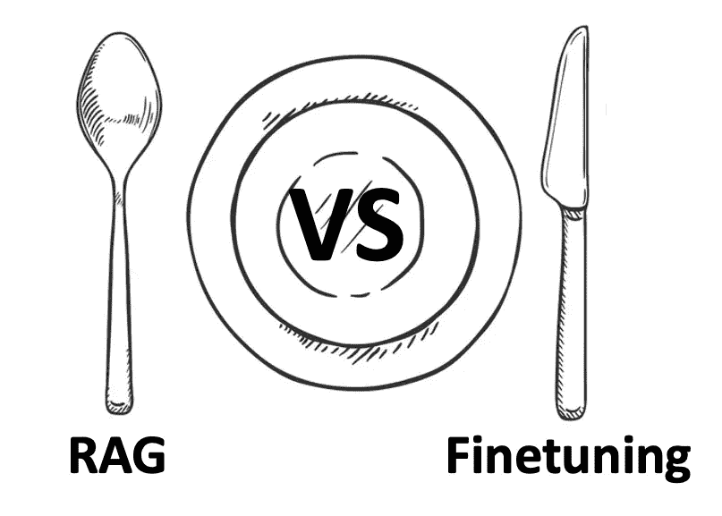
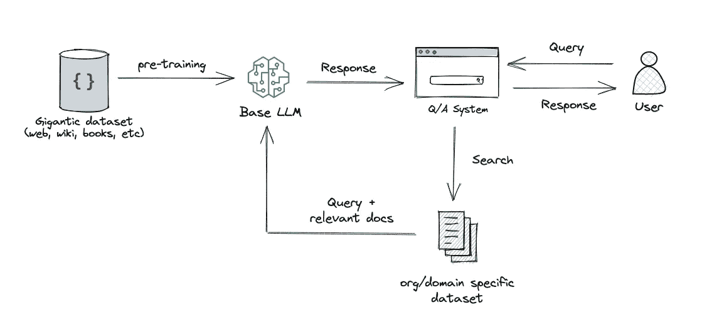

# RAG 与微调 — 哪种是提升 LLM 应用的最佳工具？

> 原文：[`towardsdatascience.com/rag-vs-finetuning-which-is-the-best-tool-to-boost-your-llm-application-94654b1eaba7?source=collection_archive---------0-----------------------#2023-08-24`](https://towardsdatascience.com/rag-vs-finetuning-which-is-the-best-tool-to-boost-your-llm-application-94654b1eaba7?source=collection_archive---------0-----------------------#2023-08-24)

## 为你的使用案例选择正确方法的终极指南

 [Heiko Hotz](https://heiko-hotz.medium.com/?source=post_page-----94654b1eaba7--------------------------------)

·

[关注](https://medium.com/m/signin?actionUrl=https%3A%2F%2Fmedium.com%2F_%2Fsubscribe%2Fuser%2F993c21f1b30f&operation=register&redirect=https%3A%2F%2Ftowardsdatascience.com%2Frag-vs-finetuning-which-is-the-best-tool-to-boost-your-llm-application-94654b1eaba7&user=Heiko+Hotz&userId=993c21f1b30f&source=post_page-993c21f1b30f----94654b1eaba7---------------------post_header-----------) 发表在 [Towards Data Science](https://towardsdatascience.com/?source=post_page-----94654b1eaba7--------------------------------) ·19 min read·2023 年 8 月 24 日

--

作者图片

# 序言

随着对大型语言模型（LLMs）兴趣的激增，许多开发者和组织忙于构建利用其力量的应用。然而，当预训练的 LLMs 直接使用时未能达到预期效果时，如何提升 LLM 应用的性能成为了问题。最终，我们会问自己：我们应该使用 [检索增强生成](https://arxiv.org/abs/2005.11401)（RAG）还是模型微调来改善结果？

在深入讨论之前，让我们先解密这两种方法：

**RAG**：这种方法将检索（或搜索）的力量融入到 LLM 文本生成中。它结合了一个检索系统，该系统从大型语料库中提取相关的文档片段，以及一个 LLM，使用这些片段中的信息生成回答。本质上，RAG 帮助模型“查找”外部信息以改善其响应。

作者提供的图片
