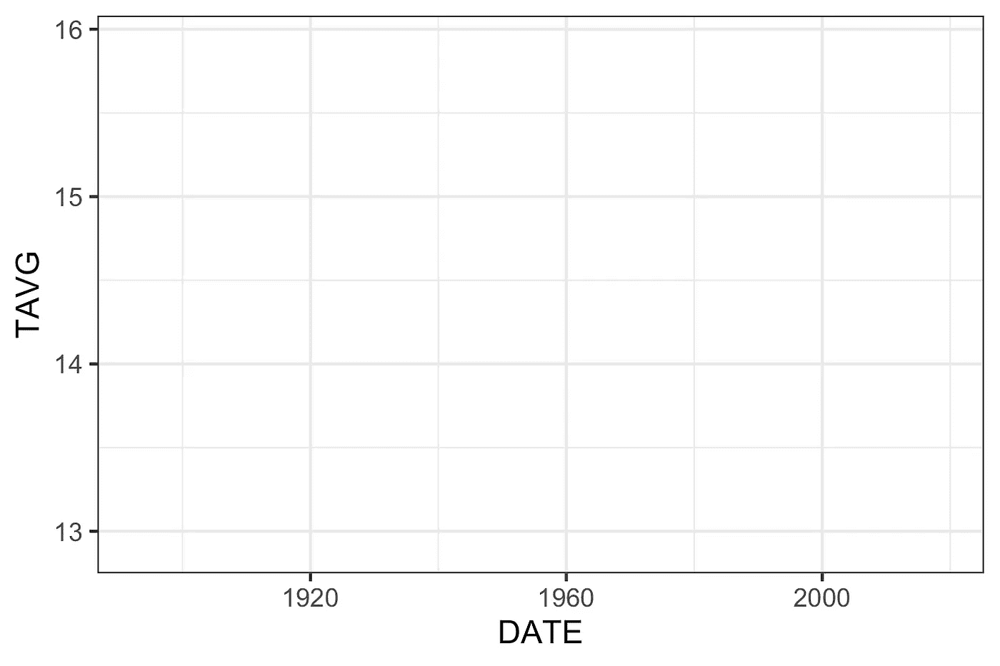
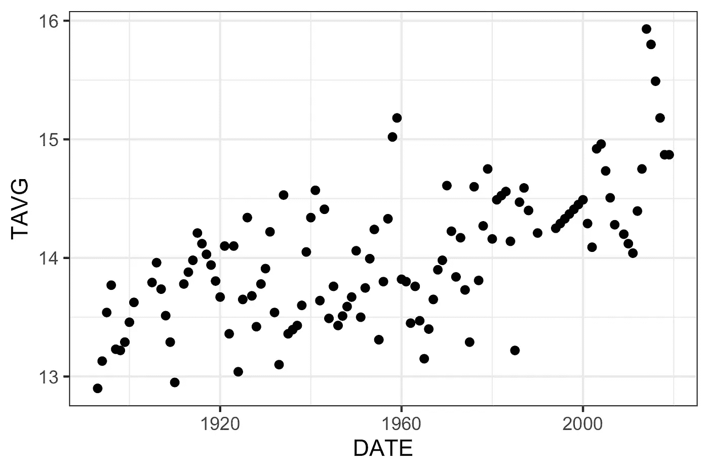
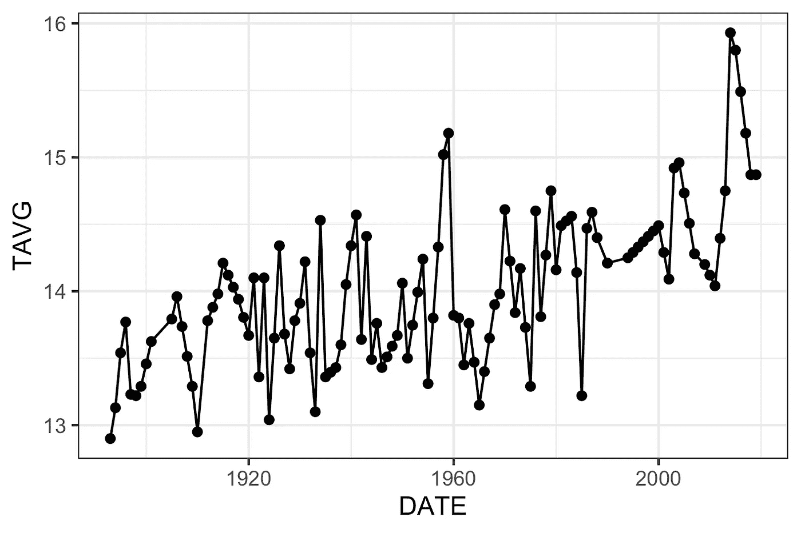
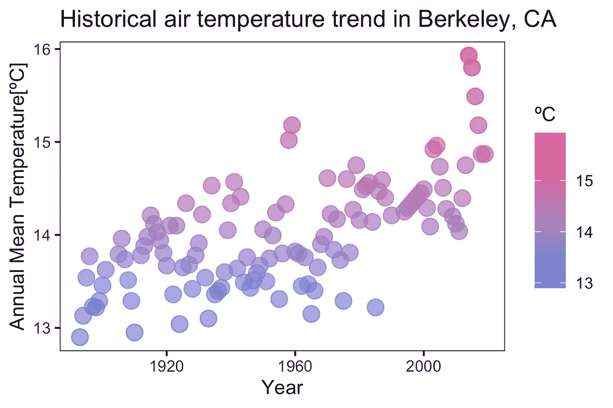
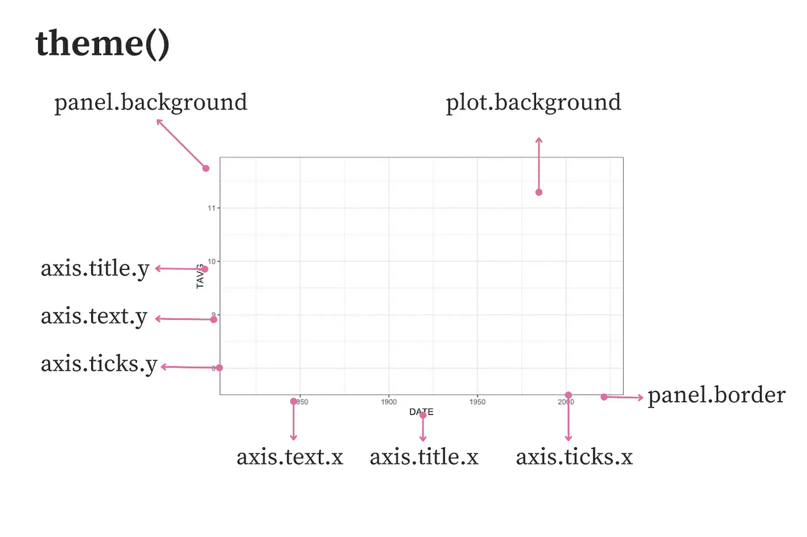
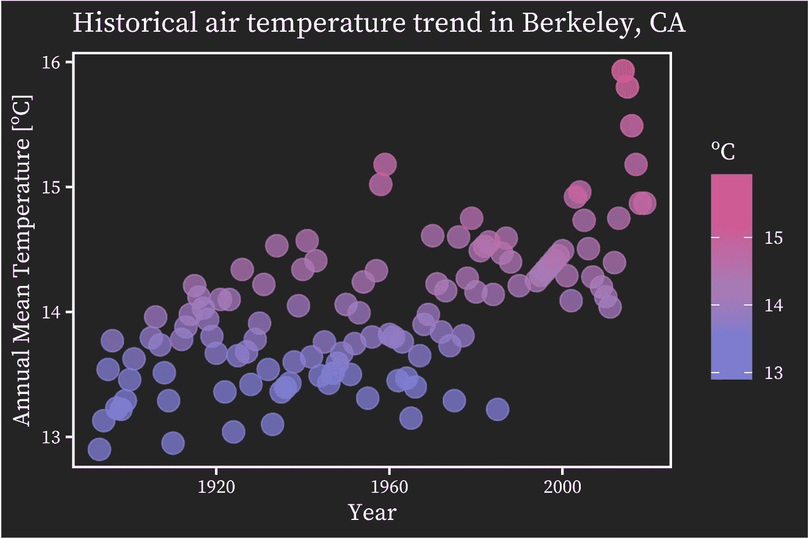
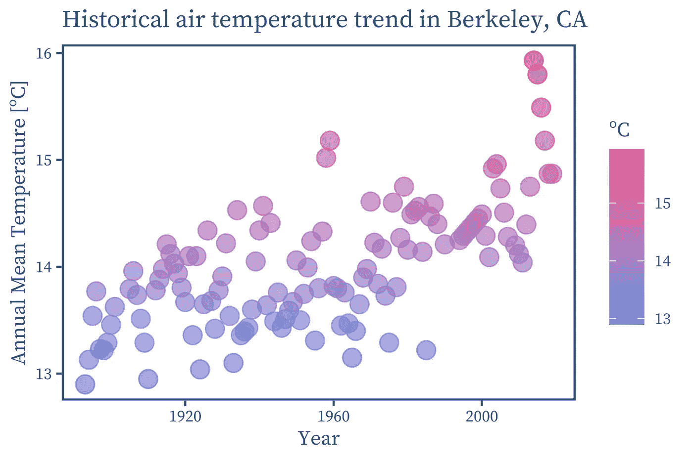
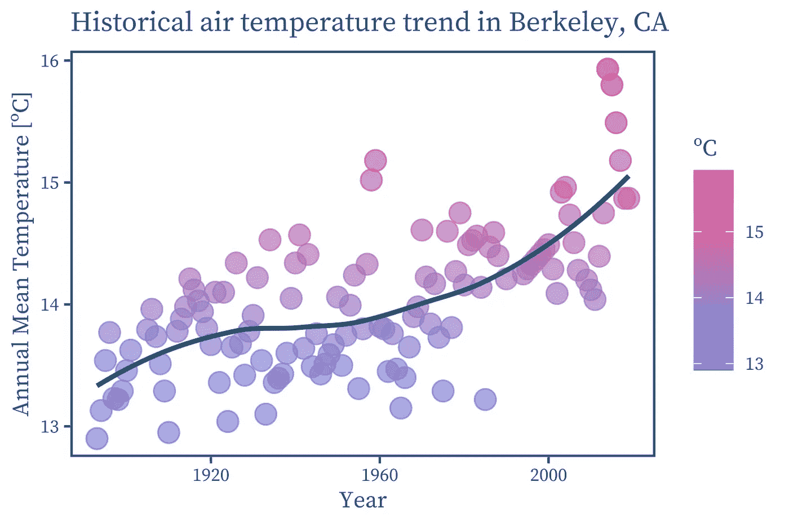

# 使用 ggplot2 提高对气候变化的意识

> 原文：[`towardsdatascience.com/raise-awareness-about-climate-change-with-ggplot2-f31f0cae3c70`](https://towardsdatascience.com/raise-awareness-about-climate-change-with-ggplot2-f31f0cae3c70)

## 学会有效绘制历史天气数据

[](https://medium.com/@bruno.ponne?source=post_page-----f31f0cae3c70--------------------------------)[](https://towardsdatascience.com/?source=post_page-----f31f0cae3c70--------------------------------) [布鲁诺·波讷](https://medium.com/@bruno.ponne?source=post_page-----f31f0cae3c70--------------------------------)

·发表于 [Towards Data Science](https://towardsdatascience.com/?source=post_page-----f31f0cae3c70--------------------------------) ·8 分钟阅读·2023 年 4 月 17 日

--


图片由 [Ganapathy Kumar](https://unsplash.com/@gkumar2175?utm_source=medium&utm_medium=referral) 在 [Unsplash](https://unsplash.com/?utm_source=medium&utm_medium=referral) 提供

> 全球变暖不是预测，而是正在发生的现实。
> 
> *詹姆斯·汉森*

有确凿证据表明地球上的温度正在上升。随着气候变化威胁到人类的生存，了解、研究和提高对这一关键问题的认识比以往任何时候都更为重要。

无论你是学生、政府工作人员、非政府组织成员还是私人公司员工，向同事展示你对相关全球问题的关注是非常重要的。

在本教程中，你将学习如何找到可靠的历史温度数据并使用 ggplot2 将其可视化。在你完成这篇文章后，你将：

+   知道在哪里找到精心整理的历史天气数据集；

+   感到舒适地使用 ggplot2 绘制历史天气数据；

+   能够自定义你的 ggplot2 图表以讲述你的故事。

## 第一步：查找并加载数据

本教程的数据可在 [**国家环境信息中心 (NCEI)**](https://www.ncei.noaa.gov/access/search/data-search/global-summary-of-the-year)*** 上获取。NCEI 是美国环境数据的权威机构，提供有关气候、生态系统和水资源的高质量数据。全球年度总结（GSOY）数据集提供按城市和站点划分的历史天气数据。在本教程中，我们将使用来自加州伯克利的数据。如果你愿意，你可以选择你喜欢的城市。如果要使用与本教程相同的数据集，请搜索伯克利并选择包含自 1893 年以来的数据的文件。

文件将通过 `read_csv` 加载。唯一的参数是文件路径。数据框加载后，我们仅选择 `DATE` 和 `TAVG` 变量。`DATE` 包含观察到温度的年份，`TAVG` 是以摄氏度表示的年均温度。要了解更多可用变量的信息，请参考 [**数据集说明书**](https://www.ncei.noaa.gov/pub/data/metadata/documents/GSOYReadme.txt)。

```py
library(readr)
library(dplyr)

df <- read_csv('USC00040693.csv') %>% 
  select("DATE", "TAVG")

summary(df)
```

R 的 `summary()` 函数告诉我们数据的范围从 1893 年到 2019 年，在此期间观察到的最小年均温度为 12.9 ºC（地点：加州伯克利）。最大年均温度为 15.93 ºC。它还显示有 33 个温度数据缺失。

## 第 2 步：使用 `na_interpolation()` 填补缺失值

由于我们正在处理时间序列，我们将使用线性插值填补缺失值。这种方法假设在缺失期间数据线性变化。实际上，当您使用折线图绘制时间序列时，观察间隔也会用连接两个点的直线填补。

要进行线性插值，我们将使用 [*imputeTS* 包](https://cran.r-project.org/web/packages/imputeTS/imputeTS.pdf)。安装并加载库后，您可以使用 `na_interpolation()` 填补缺失值。传递两个参数：第一个是您希望处理的数据框列，第二个是您希望用来执行插补的方法。

```py
library(imputeTS)

df$TAVG <- na_interpolation(df$TAVG, option ="linear")
```

## 第 3 步：编码我们图表的第一个版本

ggplot2 可视化由多个层组成。如下面的图所示，每一层包含一个 *geom* 对象，即您在图表中看到的一个元素（例如线条和点）。


图片由作者创建

首先，您需要将数据集传递给 `ggplot()` 函数。其次，您将变量映射到美学属性——*geom* 对象的视觉属性。例如，美学属性包括 y 轴位置、x 轴位置、颜色或大小。下面，我们还设置了黑白 ggplot2 主题。如果不添加其他 *geom* 对象，图表将只有两个轴。

```py
library(ggplot2)

theme_set(theme_bw())

axes <- ggplot(data = df, aes(x = DATE, y = TAVG))

axes
```



图片由作者创建

现在，您可以添加第二层，用点表示时间上的温度。**注意**，您可以使用“+”符号将此层添加到前一步骤中制作的图中。

```py
axes + 
geom_point()
```



图片由作者创建

最后，您可以添加第三层，其中包含线条。重要的是要指出，一些作者声称这些线条并不代表观察到的数据，应谨慎使用。有关详细讨论，请查看 [**《数据可视化基础》第十三章***](https://clauswilke.com/dataviz/time-series.html)，作者 Claus O. Wilke。



图片由作者创建

## 第 4 步：自定义您的图表

在这一部分，你将学习如何定制你的图表，使其既清晰又美观。

首先，为了使温度的增加更加明显，我们将点的颜色美学也映射到`TAVG`。由于它是一个数值变量，ggplot2 将使用渐变色来表示连续的值。你可以使用`scale_color_gradient()`函数选择代表低温和高温的颜色。

此外，你可以分别使用`xlab()`和`ylab()`设置 x 和 y 轴的标签。标题可以通过`ggtitle()`添加。我们还将增加点的大小，并添加透明度以使重叠的数据可见。

[爱德华·塔夫特](https://politicalscience.yale.edu/people/edward-tufte)，数据可视化领域的专家，建议最大限度地利用墨水来显示非冗余数据。作者声称，这会使你的图表更清晰，避免分散读者的注意力。

我们正在使用的 ggplot2 主题`theme_bw()`已经符合 Tufte 的建议，但我们仍然可以去除图表的面板网格。为了实现这一点，使用`theme()`函数并传递两个参数：`panel.grid.minor = element_blank()`和`panel.grid.major = element_blank()`。



图片由作者创建

## 第 5 步：为你的可视化创建一个主题

你现在将学习如何创建你自己的 ggplot2 主题。作为示例，我们将创建`theme_tds()`。

首先，我们将加载 Google 字体“Source Serif Pro”。它是 Medium 文章中使用的字体。你可以通过`showtext`包轻松加载它。如果你没有这个包，请安装它。安装包后，加载它并使用`font_add_google()`函数来加载“Source Serif Pro”。我们还告诉 R 使用`showtext`来渲染文本，通过`showtext_auto()`。

```py
library(showtext)

font_add_google("Source Serif Pro")

showtext_auto()
```

**注意**，一些作者建议在图表中只使用**无衬线**字体。请查看[这篇文章](https://blog.datawrapper.de/fonts-for-data-visualization/#:~:text=For%20data%20visualizations%2C%20sans%2Dserif,when%20it%20comes%20to%20numbers.)，以了解关于这一问题的讨论。

现在我们将使用`theme()`来定制图表。下图展示了一些你可以使用的参数。有关完整的列表，请查看这个[ggplot2 参考](https://ggplot2.tidyverse.org/reference/theme.html)。



图片由作者创建

你可以通过调用包含你自定义规范的 ggplot2 `theme()`函数来创建一个新的主题。**注意**，我们从黑白主题(`theme_bw`)开始，然后去除网格，改变背景、面板和文本颜色。为了便于将来的修改，创建了两个参数供用户指定所需的文本、面板和背景颜色。

```py
theme_tds <- function(text_panel_color, background_color) {
  theme_bw()+
    theme(text=element_text(size=10, 
          family="Source Serif Pro", 
          color = text_panel_color),
          # Eliminates grids
          panel.grid.minor = element_blank(),
          panel.grid.major = element_blank(),
          # Changes panel, plot and legend background
          panel.background = element_rect(fill = background_color),
          plot.background = element_rect(fill =  background_color),
          legend.background = element_rect(fill= background_color),
          # Changes legend texts color
          legend.title = element_text(color = text_panel_color),
          # Changes plot border color and size
          panel.border = element_rect(size = 1, color = text_panel_color),
          # Changes color of axis texts
          axis.text.x = element_text(color = text_panel_color),
          axis.text.y = element_text(color = text_panel_color),
          axis.title.x = element_text(color= text_panel_color),
          axis.title.y = element_text(color= text_panel_color),
          # Changes axis ticks color
          axis.ticks.y = element_line(color = text_panel_color),
          axis.ticks.x = element_line(color = text_panel_color),
    )
}
```

现在你可以简单地将`theme_tds()`添加到你的图表中，并指定你喜欢的颜色。以下是一个示例：

```py
ggplot(data = df, aes(x = DATE, y = TAVG, color = TAVG))+
  geom_point(size = 4, alpha = 0.7)+
  scale_color_gradient(name = "ºC", low =  "#4F88EC", high = "#ec4f88")+
  ggtitle("Historical air temperature trend in Berkeley, CA")+
  xlab("Year")+
  ylab("Annual Mean Temperature [ºC]")+
  theme_tds(text_panel_color = "white", 
            background_color = "#252525")
```



图片由作者创建

另一个例子，背景为白色，字体颜色为 Towards Data Science：

```py
ggplot(data = df, aes(x = DATE, y = TAVG, color = TAVG))+
  geom_point(size = 4, alpha = 0.7)+
  scale_color_gradient(name = "ºC", low =  "#4F88EC", high = "#ec4f88")+
  ggtitle("Historical air temperature trend in Berkeley, CA")+
  xlab("Year")+
  ylab("Annual Mean Temperature [ºC]")+
  theme_tds(text_panel_color = "#365A77", 
            background_color = "white")
```



图片由作者创建

最后，你可以使用 LOESS（局部回归散点平滑）平滑器来展示温度趋势，正如 Claus O. Wilke 在[《数据可视化基础》第十四章](https://clauswilke.com/dataviz/visualizing-trends.html)中推荐的那样。你可以通过添加一个包含元素 `geom_smooth()` 的 ggplot2 图层来实现。

```py
ggplot(data = df, aes(x = DATE, y = TAVG, color = TAVG))+
  geom_point(size = 4, alpha = 0.7)+
  geom_smooth(color = "#365A77", se = FALSE)+
  scale_color_gradient(name = "ºC", low =  "#4F88EC", high = "#ec4f88")+
  ggtitle("Historical air temperature trend in Berkeley, CA")+
  xlab("Year")+
  ylab("Annual Mean Temperature [ºC]")+
  theme_tds(text_panel_color = "#365A77", 
            background_color = "white")
```



图片由作者创建

## 结论

ggplot2 是一个强大的 R 库，允许你创建和自定义引人入胜的可视化。在本文中，你学会了如何使用它创建一个图表，以提高对全球变暖的认识，并使用了来自[NCEI 网站](https://www.ncei.noaa.gov/)的可靠数据。

如果你对研究和可视化气候数据的更多方法感兴趣，可以查看这篇文章，其中我通过回归分析关联了碳排放和空气温度：[R 编程在气候数据分析和可视化中的应用](https://www.codingthepast.com/2023/02/07/Linear-Models-in-R.html)

我希望这篇文章能为你提供新的数据可视化视角，使你的图表更具效果和吸引力。

***数据集使用条款**

根据国家海洋和大气管理局（NOAA）的[网站](https://www.ngdc.noaa.gov/ngdcinfo/privacy.html)，“政府网页上的信息属于公共领域，在美国不受版权保护，除非另有特别说明（版权可能在其他地方持有）。”
