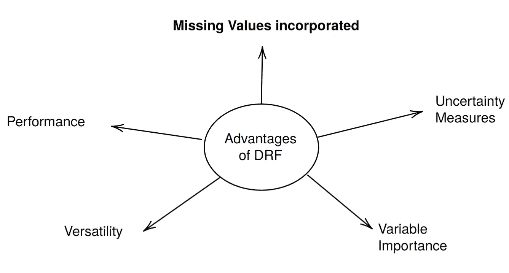
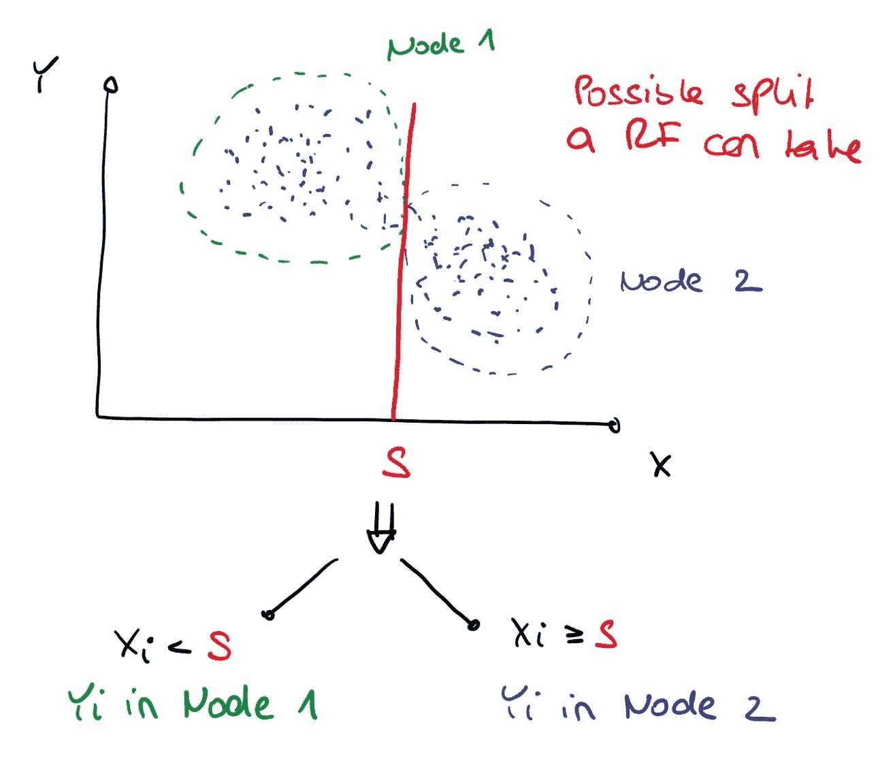
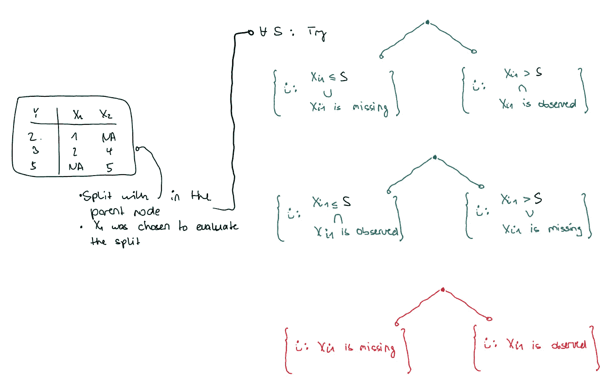
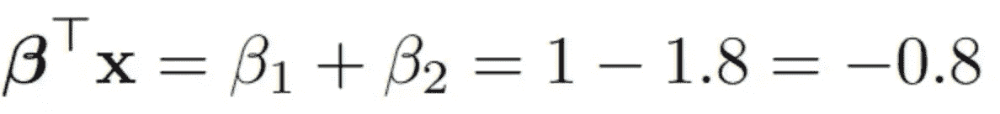
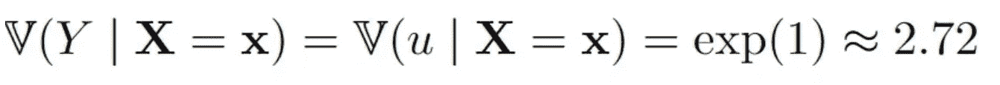

# 随机森林与缺失值

> 原文：[`towardsdatascience.com/random-forests-and-missing-values-3daaea103db0?source=collection_archive---------7-----------------------#2023-06-21`](https://towardsdatascience.com/random-forests-and-missing-values-3daaea103db0?source=collection_archive---------7-----------------------#2023-06-21)

## 这是一个非常引人入胜的实际解决方案

[](https://medium.com/@jeffrey_85949?source=post_page-----3daaea103db0--------------------------------)[](https://towardsdatascience.com/?source=post_page-----3daaea103db0--------------------------------) [Jeffrey Näf](https://medium.com/@jeffrey_85949?source=post_page-----3daaea103db0--------------------------------)

·

[关注](https://medium.com/m/signin?actionUrl=https%3A%2F%2Fmedium.com%2F_%2Fsubscribe%2Fuser%2Fca780798011a&operation=register&redirect=https%3A%2F%2Ftowardsdatascience.com%2Frandom-forests-and-missing-values-3daaea103db0&user=Jeffrey+N%C3%A4f&userId=ca780798011a&source=post_page-ca780798011a----3daaea103db0---------------------post_header-----------) 发表在 [Towards Data Science](https://towardsdatascience.com/?source=post_page-----3daaea103db0--------------------------------) ·9 分钟阅读·2023 年 6 月 21 日[](https://medium.com/m/signin?actionUrl=https%3A%2F%2Fmedium.com%2F_%2Fvote%2Ftowards-data-science%2F3daaea103db0&operation=register&redirect=https%3A%2F%2Ftowardsdatascience.com%2Frandom-forests-and-missing-values-3daaea103db0&user=Jeffrey+N%C3%A4f&userId=ca780798011a&source=-----3daaea103db0---------------------clap_footer-----------)

--

[](https://medium.com/m/signin?actionUrl=https%3A%2F%2Fmedium.com%2F_%2Fbookmark%2Fp%2F3daaea103db0&operation=register&redirect=https%3A%2F%2Ftowardsdatascience.com%2Frandom-forests-and-missing-values-3daaea103db0&source=-----3daaea103db0---------------------bookmark_footer-----------)

(分布式)随机森林的特点。在这篇文章中：处理缺失值的能力。来源：作者。

除了在网上找到的一些过度清理的数据集之外，缺失值无处不在。实际上，数据集越复杂、规模越大，缺失值出现的可能性就越高。缺失值是统计研究中的一个有趣领域，但在实际应用中，它们常常是一种麻烦。

如果你处理的是预测问题，希望从 *p-* 维协变量 ***X***=(X_1，…，X_p)* 中预测一个变量 *Y*，并且你在 ***X*** 中面临缺失值，对于基于树的方法有一个有趣的解决方案。这种方法实际上已经存在很久，但在广泛的数据集中表现得非常好。我所说的是“缺失值纳入属性标准”（MIA；[1]）。虽然关于缺失值有许多好的文章（如[这篇](https://medium.com/@vinitasilaparasetty/guide-to-handling-missing-values-in-data-science-37d62edbfdc1)），但这种强大的方法似乎在使用上有所欠缺。特别是，你不需要以任何方式填补、删除或预测缺失值，而是可以像处理完全观测到的数据一样进行预测。

我将快速解释方法本身的工作原理，然后展示一个用分布随机森林（DRF）进行的示例，详细说明见[这里](https://medium.com/towards-data-science/drf-a-random-forest-for-almost-everything-625fa5c3bcb8)。我选择 DRF 是因为它是随机森林的一个非常通用的版本（特别是，它也可以用来预测随机向量***Y***），并且我在这里有些偏向。MIA 实际上是为广义随机森林（[GRF](https://grf-labs.github.io/grf/)）实现的，涵盖了广泛的森林实现。特别是，由于 [CRAN](https://cran.r-project.org/web/packages/drf/index.html) 上的 DRF 实现基于 GRF，经过轻微修改后，它也可以使用 MIA 方法。

当然，要注意这是一个快速修复（据我所知）没有理论保障。根据缺失机制，这可能会严重偏倚分析。另一方面，大多数处理缺失值的常用方法没有任何理论保障，或者明确已知会偏倚分析，至少在经验上，MIA 似乎效果很好。

# 它是如何工作的

请记住，在 RF 中，拆分的形式为 *X_j < S* 或 *X_j ≥ S*，对于维度 *j=1，…，p*。为了找到这个拆分值 *S*，它优化某种关于 *Y* 的标准，例如 CART 标准。因此，观察值通过依赖于 ***X*** 的决策规则逐步划分。



RF 中拆分的示意图。图片作者提供。

原始论文解释得有些混乱，但根据我的理解，MIA 的工作原理如下：我们考虑一个样本（*Y_1*，***X***_1），……，（Y_n，* ***X***_n），其中*

***X***_i=(X_i1，…，X_ip)’。*

没有缺失值的拆分只是寻找如上所述的值 *S*，然后将所有 *Y_i*，其中 *X_ij < S*，丢入节点 1，将所有 *Y_i*，其中 *X_ij ≥ S*，丢入节点 2。计算每个值 *S* 的目标标准，例如 CART，我们可以选择最佳的一个。有缺失值时，对于每个候选拆分值 *S*，需要考虑 3 种选项：

+   对于所有观察值*i*，如果*X_ij*被观察到，则使用通常的规则，如果*X_ij*缺失，则将*i*发送到节点 1。

+   对于所有观察值 i，如果*X_ij*被观察到，则使用通常的规则，如果*X_ij*缺失，则将*i*发送到节点 2。

+   忽略通常的规则，只要*X_ij*缺失就将 i 发送到节点 1，若被观察到则发送到节点 2。

遵循这些规则的选择再次根据我们对*Y_i*的标准来决定。



说明我如何理解 MIA 过程。给定父节点中的观察值，我们寻找最佳分裂值 S。对于每个分裂值，我们考虑 3 个选项并进行尝试，直到找到最小值。左侧的{}表示被发送到左侧或右侧的观察值 i。图片由作者提供。

# 一个小例子

需要提到的是，[CRAN](https://cran.r-project.org/web/packages/drf/index.html)上的 drf 包尚未更新到最新的方法。未来会有一个时间点，所有这些将会在 CRAN 上的一个包中实现！然而，目前有两个版本：

如果你想使用带有缺失值的**快速 drf 实现**（**不带**置信区间），可以使用附在这篇文章末尾的“drfown”函数。这段代码改编自

[lorismichel/drf: Distributional Random Forests (Cevid et al., 2020) (github.com)](https://github.com/lorismichel/drf)

如果你想要使用带有**置信区间**的参数，请使用这段（较慢的）代码。

[drfinference/drf-foo.R at main · JeffNaef/drfinference (github.com)](https://github.com/JeffNaef/drfinference/blob/main/drf-foo.R)

特别是，drf-foo.R 包含了在后一种情况下所需的一切。

我们将关注带有置信区间的较慢代码，如在[这篇文章](https://medium.com/towards-data-science/inference-for-distributional-random-forests-64610bbb3927)中所解释，并考虑与该文章中相同的例子：

```py
set.seed(2)

n<-2000
beta1<-1
beta2<--1.8

# Model Simulation
X<-mvrnorm(n = n, mu=c(0,0), Sigma=matrix(c(1,0.7,0.7,1), nrow=2,ncol=2))
u<-rnorm(n=n, sd = sqrt(exp(X[,1])))
Y<- matrix(beta1*X[,1] + beta2*X[,2] + u, ncol=1)
```

请注意，这是一个异方差线性模型，*p=2*，误差项的方差取决于*X_1*的值。现在我们还以“随机缺失”（MAR）的方式向*X_1*中添加缺失值：

```py
prob_na <- 0.3
X[, 1] <- ifelse(X[, 2] <= -0.2 & runif(n) < prob_na, NA, X[, 1]) 
```

这意味着*X_1*在*X_2*的值小于-0.2 时，以 0.3 的概率缺失。因此，*X_1*缺失的概率取决于*X_2*，这被称为“随机缺失”（Missing at Random）。这已经是一个复杂的情况，通过查看缺失值的模式可以获得信息。也就是说，缺失情况不是“完全随机缺失（MCAR）”，因为*X_1*的缺失取决于*X_2*的值。这反过来意味着我们从中抽取的*X_2*的分布在*X_1*缺失与否的条件下是不同的。这尤其意味着删除缺失值的行可能会严重偏倚分析结果。

现在我们固定 ***x*** 并估计给定 ***X****=****x,*** 的条件期望值和方差，就像在[上一篇文章](https://medium.com/towards-data-science/inference-for-distributional-random-forests-64610bbb3927)中一样。

```py
# Choose an x that is not too far out
x<-matrix(c(1,1),ncol=2)

# Choose alpha for CIs
alpha<-0.05
```

我们还拟合了 DRF，并预测测试点 ***x*** 的权重（这相当于预测 *Y|****X****=****x*** 的条件分布）：

```py
## Fit the new DRF framework
drf_fit <- drfCI(X=X, Y=Y, min.node.size = 5, splitting.rule='FourierMMD', num.features=10, B=100)

## predict weights
DRF = predictdrf(drf_fit, x=x)
weights <- DRF$weights[1,]
```

## 示例 1：条件期望

我们首先估计条件期望值 *Y|****X****=****x.***

```py
# Estimate the conditional expectation at x:
condexpest<- sum(weights*Y)

# Use the distribution of weights, see below
distofcondexpest<-unlist(lapply(DRF$weightsb, function(wb)  sum(wb[1,]*Y)  ))

# Can either use the above directly to build confidence interval, or can use the normal approximation.
# We will use the latter
varest<-var(distofcondexpest-condexpest)

# build 95%-CI
lower<-condexpest - qnorm(1-alpha/2)*sqrt(varest)
upper<-condexpest + qnorm(1-alpha/2)*sqrt(varest)
round(c(lower, condexpest, upper),2)

# without NAs: (-1.00, -0.69 -0.37)
# with NAs: (-1.15, -0.67, -0.19)
```

值得注意的是，通过缺失数据（NAs）获得的结果与[上一篇文章](https://medium.com/towards-data-science/inference-for-distributional-random-forests-64610bbb3927)中首次分析得到的结果非常接近！这让我感到相当惊讶，因为处理缺失机制并不容易。有趣的是，估计量的估计方差也翻倍了，从没有缺失值时的大约 0.025 增加到有缺失值时的大约 0.06。

真相为：



所以我们有一个轻微的误差，但置信区间包含了真相，正如应该的那样。

对于更复杂的目标，例如条件方差，结果看起来相似：

```py
# Estimate the conditional expectation at x:
condvarest<- sum(weights*Y²) - condexpest²

distofcondvarest<-unlist(lapply(DRF$weightsb, function(wb)  {
  sum(wb[1,]*Y²) - sum(wb[1,]*Y)²
} ))

# Can either use the above directly to build confidence interval, or can use the normal approximation.
# We will use the latter
varest<-var(distofcondvarest-condvarest)

# build 95%-CI
lower<-condvarest - qnorm(1-alpha/2)*sqrt(varest)
upper<-condvarest + qnorm(1-alpha/2)*sqrt(varest)

c(lower, condvarest, upper)

# without NAs: (1.89, 2.65, 3.42)
# with NAs: (1.79, 2.74, 3.69)
```

在这里，估计值的差异略大一些。真相为



估计值在有缺失值时甚至略微更准确（虽然这当然可能只是随机性）。再次强调，估计方差（方差）在有缺失值时增加，从 0.15（无缺失值）增加到 0.23。

# 结论

在本文中，我们讨论了 MIA，它是对随机森林中分割方法的适应，以处理缺失值。由于它在 GRF 和 DRF 中实现，因此可以广泛使用，我们观察到的小示例表明它表现得非常好。

然而，我想再次指出，即使对于大量数据点，也没有理论保证一致性或置信区间的合理性。缺失值的原因很多，必须非常小心，以免由于粗心处理此问题而使分析产生偏差。MIA 方法绝不是解决此问题的一个充分理解的修复方法。然而，它似乎是一个合理的快速修复方法，能够在某种程度上利用数据中的缺失模式。如果有人做了/有更广泛的模拟分析，我会对结果感到好奇。

# 代码

```py
require(drf)            

drfown <-               function(X, Y,
                              num.trees = 500,
                              splitting.rule = "FourierMMD",
                              num.features = 10,
                              bandwidth = NULL,
                              response.scaling = TRUE,
                              node.scaling = FALSE,
                              sample.weights = NULL,
                              sample.fraction = 0.5,
                              mtry = min(ceiling(sqrt(ncol(X)) + 20), ncol(X)),
                              min.node.size = 15,
                              honesty = TRUE,
                              honesty.fraction = 0.5,
                              honesty.prune.leaves = TRUE,
                              alpha = 0.05,
                              imbalance.penalty = 0,
                              compute.oob.predictions = TRUE,
                              num.threads = NULL,
                              seed = stats::runif(1, 0, .Machine$integer.max),
                              compute.variable.importance = FALSE) {

  # initial checks for X and Y
  if (is.data.frame(X)) {

    if (is.null(names(X))) {
      stop("the regressor should be named if provided under data.frame format.")
    }

    if (any(apply(X, 2, class) %in% c("factor", "character"))) {
      any.factor.or.character <- TRUE
      X.mat <- as.matrix(fastDummies::dummy_cols(X, remove_selected_columns = TRUE))
    } else {
      any.factor.or.character <- FALSE
      X.mat <- as.matrix(X)
    }

    mat.col.names.df <- names(X)
    mat.col.names <- colnames(X.mat)
  } else {
    X.mat <- X
    mat.col.names <- NULL
    mat.col.names.df <- NULL
    any.factor.or.character <- FALSE
  }

  if (is.data.frame(Y)) {

    if (any(apply(Y, 2, class) %in% c("factor", "character"))) {
      stop("Y should only contain numeric variables.")
    }
    Y <- as.matrix(Y)
  }

  if (is.vector(Y)) {
    Y <- matrix(Y,ncol=1)
  }

  #validate_X(X.mat)

  if (inherits(X, "Matrix") && !(inherits(X, "dgCMatrix"))) {
        stop("Currently only sparse data of class 'dgCMatrix' is supported.")
    }

  drf:::validate_sample_weights(sample.weights, X.mat)
  #Y <- validate_observations(Y, X)

  # set legacy GRF parameters
  clusters <- vector(mode = "numeric", length = 0)
  samples.per.cluster <- 0
  equalize.cluster.weights <- FALSE
  ci.group.size <- 1

  num.threads <- drf:::validate_num_threads(num.threads)

  all.tunable.params <- c("sample.fraction", "mtry", "min.node.size", "honesty.fraction",
                          "honesty.prune.leaves", "alpha", "imbalance.penalty")

  # should we scale or not the data
  if (response.scaling) {
    Y.transformed <- scale(Y)
  } else {
    Y.transformed <- Y
  }

  data <- drf:::create_data_matrices(X.mat, outcome = Y.transformed, sample.weights = sample.weights)

  # bandwidth using median heuristic by default
  if (is.null(bandwidth)) {
    bandwidth <- drf:::medianHeuristic(Y.transformed)
  }

  args <- list(num.trees = num.trees,
               clusters = clusters,
               samples.per.cluster = samples.per.cluster,
               sample.fraction = sample.fraction,
               mtry = mtry,
               min.node.size = min.node.size,
               honesty = honesty,
               honesty.fraction = honesty.fraction,
               honesty.prune.leaves = honesty.prune.leaves,
               alpha = alpha,
               imbalance.penalty = imbalance.penalty,
               ci.group.size = ci.group.size,
               compute.oob.predictions = compute.oob.predictions,
               num.threads = num.threads,
               seed = seed,
               num_features = num.features,
               bandwidth = bandwidth,
               node_scaling = ifelse(node.scaling, 1, 0))

  if (splitting.rule == "CART") {
    ##forest <- do.call(gini_train, c(data, args))
    forest <- drf:::do.call.rcpp(drf:::gini_train, c(data, args))
    ##forest <- do.call(gini_train, c(data, args))
  } else if (splitting.rule == "FourierMMD") {
    forest <- drf:::do.call.rcpp(drf:::fourier_train, c(data, args))
  } else {
    stop("splitting rule not available.")
  }

  class(forest) <- c("drf")
  forest[["ci.group.size"]] <- ci.group.size
  forest[["X.orig"]] <- X.mat
  forest[["is.df.X"]] <- is.data.frame(X)
  forest[["Y.orig"]] <- Y
  forest[["sample.weights"]] <- sample.weights
  forest[["clusters"]] <- clusters
  forest[["equalize.cluster.weights"]] <- equalize.cluster.weights
  forest[["tunable.params"]] <- args[all.tunable.params]
  forest[["mat.col.names"]] <- mat.col.names
  forest[["mat.col.names.df"]] <- mat.col.names.df
  forest[["any.factor.or.character"]] <- any.factor.or.character

  if (compute.variable.importance) {
    forest[['variable.importance']] <- variableImportance(forest, h = bandwidth)
  }

  forest
}
```

## ***引文***

[1] Twala, B. E. T. H., M. C. Jones, 和 David J. Hand. 应对决策树中缺失数据的良好方法。*模式识别信函 29*, 2008。
