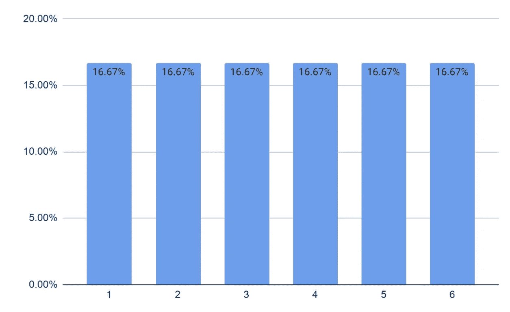

# 随机变量和概率分布

> 原文：[`towardsdatascience.com/random-variables-and-probability-distributions-9a1f17d77503?source=collection_archive---------12-----------------------#2023-04-10`](https://towardsdatascience.com/random-variables-and-probability-distributions-9a1f17d77503?source=collection_archive---------12-----------------------#2023-04-10)

## *掌握随机变量和概率分布，利用我们统计学备忘单系列的第三部分，破解你的下一次数据科学面试*

 [Nathan Rosidi](https://nathanrosidi.medium.com/?source=post_page-----9a1f17d77503--------------------------------)

·

[关注](https://medium.com/m/signin?actionUrl=https%3A%2F%2Fmedium.com%2F_%2Fsubscribe%2Fuser%2Fab636cbf3611&operation=register&redirect=https%3A%2F%2Ftowardsdatascience.com%2Frandom-variables-and-probability-distributions-9a1f17d77503&user=Nathan+Rosidi&userId=ab636cbf3611&source=post_page-ab636cbf3611----9a1f17d77503---------------------post_header-----------) 发表在 [Towards Data Science](https://towardsdatascience.com/?source=post_page-----9a1f17d77503--------------------------------) ·16 分钟阅读·2023 年 4 月 10 日

--

图片由 [Naser Tamimi](https://unsplash.com/ja/@tamiminaser?utm_source=medium&utm_medium=referral) 提供，来源于 [Unsplash](https://unsplash.com/?utm_source=medium&utm_medium=referral)

# 随机变量

从数学角度来看，随机变量是一个数值，其值依赖于随机事件的结果。例如，如果我们定义随机变量 (X) 为投掷两次硬币得到正面的次数。

注：我们用大写字母表示变量，用小写字母表示 X 的单一值。这里，x = 1 表示在两次掷硬币中恰好出现一个正面。

让我们再看一个例子。设 Y 表示掷骰子时出现的数字。随机变量 Y 可以是 1 到 6 之间的任何一个数字。

# 概率分布

让我们写下结果的概率。X（掷硬币两次时出现的正面数）的概率分布可以写作 Pr(X = x)。我们得到以下概率。

我们可以在直方图中绘制这些值

作者提供的图片

对于随机变量 Y（骰子面上的数字），概率如下所示。

Y 的直方图如下所示。

作者提供的图片

表格和直方图描述了随机变量的概率分布。

*概率分布是对随机事件中不同结果的概率（或可能性）的数学描述。*

# 概率质量函数

到目前为止，我们考虑的例子都有有限的结果。在掷硬币两次时，我们不可能得到 1.4 个正面。因此，与这些结果相关的概率也是有限的。随机变量因此是*离散随机变量*。离散随机变量的概率分布也称为概率质量函数（PMF）。我们将在文章稍后部分讨论连续变量。

# 累积分布函数

另一种表示与随机变量相关的概率的方法是绘制累积分布概率。随机变量 X 在值 x 处的累积分布概率是 X 取值小于或等于 x 的概率。通常我们用大写字母 F 来表示累积分布概率。因此 F(x = a ) = Pr(X ≤ a)。这个函数称为累积分布函数（CDF）。CDF 的优势在于无论变量是离散的还是连续的，其定义都是相同的。对于上述例子，我们可以通过将 PDF 累加来构建 CDF。

对于我们的掷硬币的例子

CDF 可以这样绘制。

作者提供的图片

对于骰子的掷骰子事件，

CDF 可以如下绘制。

作者提供的图片

# 离散概率分布

理论上，可以有无限多种概率分布。然而，有一些概率分布出现得非常频繁，以至于值得特别提及。让我们看一些突出的离散概率分布。

# 均匀分布

离散均匀分布描述了一个可以取有限个离散值的随机变量，所有值的概率相等。一个很常见的例子是抛一次硬币。得到正面或反面是等可能的。另一个例子是掷骰子。六个数字中的每一个都是等可能的。

从数学上讲，离散均匀分布的 PMF 由两个参数 a 和 b 定义，其中 a 是随机变量可以取的最小值，b 是最大值。PMF 由下式给出

其中 x 是随机变量的结果，x 的值从 a 到 b，包含 a 和 b。

将其应用于掷骰子的情况

a = 1, b = 6

# 二项分布

二项分布描述了在固定次数的试验或重复中成功的次数 (x)。每个试验只有两种可能的结果：成功或失败。此外，在给定的试验中成功的概率始终保持不变。我们称之为 p。每个这样的试验或重复被称为伯努利试验。概率分布由下式给出

其中 x 是 n 次试验中的成功次数，

上述表示由下式给出的二项系数

## 二项分布的应用

在一个办公室中，80% 的员工在早上 8 点到 9 点之间到达。找出在某一天，至少七名员工在早上 8 点到 9 点之间到达的概率。

上述问题表示一个具有 10 次试验和 80% 或 0.8 成功概率的二项分布。

我们需要计算 X ≥ 7 的概率。因此，我们需要计算

P(X = 7) + P(X = 8) + P(X = 9) + P(X = 10)

应用二项公式，我们得到

类似地

P(X = 8) = 0.302

P(X = 9) = 0.268

P(X = 10) = 0.107

因此，P(X ≥ 7) = 0.201 + 0.302 + 0.268 + 0.107 = 0.878 或 87.8%

# 几何分布

几何分布建立在二项分布的基础上。在这里，试验（或重复）会继续进行，直到成功发生，而不是固定次数的试验。从理论上讲，试验可以无限期地继续。例如，假设你继续掷骰子，直到你得到数字 6。理论上，我们可能会经历一个极其不幸的周期而得不到六。

几何分布的 PDF 由下式给出

其中 X 表示获得第一次成功所需的重复次数。

这是几何分布的 PDF，其中 p = 0.2。

图片来源于作者

## 几何分布的应用

在一个城镇中，60% 的人口是女性。找到一个人需要见到三个人才会遇到第一个男性的概率。

让我们用简单的英语写下这个问题。

仅第三个人是男性的概率是

+   第一个遇到的人是女性，第二个遇到的人是女性，第三个遇到的人是男性的概率

现在计算这些值更容易了。遇到女性的概率是 60%，而遇到男性的概率是 (100–60)% = 40%

因此，所需的概率 = 60% x 60% x 40% = 14.44%

或者，我们可以使用公式。这里 x = 3 和 p = 40% 或 0.4

因此

或 14.44%

# 泊松分布

另一个非常常见的离散分布是等待时间分布或泊松分布。泊松分布描述了在一个固定的时间或空间间隔内发生给定数量事件的概率，前提是这些事件以已知的平均速率发生，并且与上一个事件的时间无关。常见的应用包括确定一个购物中心应该设置多少个排队线，以免系统过载。只需一个参数——间隔期间的平均发生次数。这个参数通常用 λ 表示。

泊松过程的概率分布由以下公式给出

其中 λ 是间隔内的平均发生次数，x 是给定间隔内事件的发生次数（或成功次数），e 是自然对数（大约为 2.718）。

不同 λ 值的泊松分布的概率密度函数（PDF）

作者提供的图像

## 泊松分布的应用

观察到一个 WhatsApp 群组每天收到 45 条消息。它在下一个半小时内收到超过两条消息的概率是多少？

我们关注的时间框架（或间隔）是半小时。我们首先计算每半小时收到的平均消息数量。

一天有 24 小时，所以 24x2 = 48 个半小时周期。

每半小时收到的平均消息数量（λ）=

我们需要找出 P(x > 2)。我们可以通过以下方式找到这个值

将 x = 0, 1, 2 和 λ = 0.9375 代入公式，我们得到

# 连续概率分布

迄今为止，我们只看了具有有限值集合的变量（如硬币上的正面或反面、骰子上的数字等）。但在现实生活中，变量可以有无限多的值。我们以一个人在下午 1 点到 2 点之间到达进行午餐预约的情况为例。假设一个人可以随时到达，他在下午 1:10 到 1:30 之间到达的机会可以计算为

有利时间段 = 下午 1:10 到 1:30 = 20 分钟

总时间周期 = 1 小时 = 60 分钟。

因此概率 = ⅓..

但是，如果你想计算他在 1:15 PM 准确到达的概率，这将取决于我们如何准确地测量时间。如果我们按最接近的分钟来测量，它将是 1/60。如果我们测量到最后一秒钟，那么就是 1/3600。如果我们测量到毫秒，则是 1/360 万，如此等等。正如你所见，到达的确切时刻可以被进一步分割成更小的段。它可以取无限多个值。因此，在给定时刻他到达的概率是零。

这样的变量称为连续变量。正式来说，如果你绘制一个连续随机变量的累积分布函数（CDF），它将没有像我们在掷骰子时看到的那样的中断（或阶跃）。

作者提供的图片

连续变量的累积分布函数（CDF）如下所示。

作者提供的图片

对于连续随机变量，我们找到的是区间的概率（如上面描述的到达时间的情况），而不是单个值。虽然数学上有点复杂，因为涉及到微积分，但直观上，我们可以使用离散随机变量的概念来处理连续变量，因为我们可以通过四舍五入将连续随机变量转换为离散变量（就像我们在上述秒到分钟的例子中做的那样）。

# 概率密度函数

正如我们所看到的，连续随机变量在特定值处的概率总是零。因此，对于连续变量，我们找到的是 CDF 在任何时刻的变化量。这种变化称为概率密度函数（PDF）。从微积分的角度来看，PDF 是 CDF 的微分。连续随机变量的 PDF 将如下所示。

作者提供的图片

要找到两个点之间的概率，我们需要找到曲线下的面积（使用积分微积分在这两个点之间积分 PDF）。幸运的是，我们不需要自己计算这些值。我们可以使用 Python 或任何电子表格软件轻松计算这些值。

注意：对于任何连续概率分布，

这是因为特定值的精确概率总是零。

# 连续均匀分布

与离散均匀分布类似，对于连续均匀分布，事件发生的概率是均等的。只不过可能的值的范围是无限的。

连续分布的概率密度函数（PDF）由以下公式给出：

对于 a ≤ x ≤ b

其中 a 是最低可能值，b 是最高可能值。

## 连续均匀分布的应用

从在 Suber 应用程序上预定出租车到出租车到达之间的时间通常在五分钟到十五分钟之间。客户等待出租车超过十二分钟的概率是多少？

让我们尝试在不使用公式的情况下解决这个问题。类似于离散均匀分布的 PMF，我们可以绘制连续分布的 PDF。

作者提供的图片

整个曲线下的面积应该等于 1，因为确定在这个时间段内出租车会来。矩形的宽度是 15–5 = 10 单位。由于面积是 1，因此高度应该低于 0.1。

为了找到 P(x > 12)，我们可以找到阴影部分 P(5 ≤ x ≤ 12)的面积，然后从 1 中减去。

作者提供的图片

阴影部分的面积

因此，

# 指数分布

另一种常见的连续分布是指数分布。它建模了直到发生特定事件所需的时间。例如，服务客户所需的时间、一个部件在更换前的使用寿命等。指数分布的 PDF 由下式给出

其中 m 称为衰减因子。它是历史平均等待时间的倒数。

该分布的 CDF 由下式给出

## 指数分布的应用

平均而言，如果每天使用，一辆车需要在 120 天后进行维护。服务时间可以用指数分布建模。

1.  车辆在 150 天后进行服务的概率是多少？

1.  多少比例的车辆将在 90 天后但少于 120 天进行服务？

这里的衰减因子(m) =

首先让我们解决 A 部分。

我们需要找到 P(x > 150)。所需的概率由图中的阴影部分给出。

作者提供的图片

在这种情况下，更容易找到未阴影区域的面积。如果你回忆一下 CDF 的讨论，未阴影区域的面积是 CDF (X = 150)。一旦我们找到它，我们可以简单地从 1 中减去以找到阴影部分的面积。

由于我们已经有了 CDF 函数，我们可以将所需的概率重新写为

在这种情况下，x = 150\。以及衰减因子

插入值，我们得到

这在直观上是正确的——由于大多数车在 120 天后需要维护，因此在 150 天后需要维护的车非常少。

完成这个之后，我们也可以类似地解决 B 部分。

B 部分要求我们找到一辆车在 90 到 120 天之间被服务的概率，即 P(90<X<120)。从图形上看，阴影部分的面积就是所需的概率。

图像由作者提供

我们可以将其分解为

再次，我们将使用累积分布函数（CDF）的属性来找到这些值。

因此

从图形上，这可以用以下方式表示。

图像由作者提供

我们现在可以轻松计算概率。

CDF(X = 120) = 0.6321

CDF(X = 90) = 0.5276

P(90 < X < 120) = 0.6321–0.5276 = 0.1045 或 10.45%

## 泊松分布和指数分布的比较

指数分布中的衰减因子 m 是泊松分布中平均发生时间λ的倒数。然而，它们之间存在一些差异。在泊松分布中，随机变量 x（给定时间段内的发生次数）是离散的。然而，在指数分布中，随机变量 x（下一个成功的时间）是连续的。

以我们之前 WhatsApp 小组中的示例为例。我们在特定时间段内收到的消息数量是离散变量，只能取正整数值（0, 1, 2, 3, …）；而下一个消息的时间是连续变量，可以取分数值（2.3 分钟，4.8 小时等）。这种差异可以通过下图来说明。

图像由作者提供

# 正态分布

不论你的学术或专业背景如何，你都应该听说过正态分布。它是最常用（也是最滥用）的概率分布之一。理解正态分布对于理解推断统计至关重要。正态分布的概率密度函数（PDF）具有钟形曲线，描述如下：

这里μ是分布的均值，σ是标准差。

正态分布的概率密度函数（PDF）图形如下。图形围绕均值对称。

图像由作者提供

注：你无需记住公式，只需知道如何使用它。

由于曲线下的面积必须等于 1，标准差的变化会导致曲线变得更胖或更高，具体取决于σ。

图像由作者提供

因此，我们可以有无限多的正态分布。

## 标准正态分布

标准正态分布的均值为 0，标准差为 1。我们可以通过执行简单的变换将任何均值为μ、标准差为σ的正态分布转换为标准正态分布。

z 分数表示 x 距离均值有多少个标准差。

这确保了我们只需[一个这样的表](https://www.math.arizona.edu/~rsims/ma464/standardnormaltable.pdf)来处理所有的概率计算。这是在电子表格和统计程序出现之前的做法，但仍然非常有用。

## 如何使用 z-scores 来找出概率？

大多数软件能够非常轻松地提供 PDF 和 CDF 值。为了更好地理解，让我们使用这里提供的[z-score 表](https://www.math.arizona.edu/~rsims/ma464/standardnormaltable.pdf)。

正如标题所示，表格提供了 z-score 左侧的面积。

图片由作者提供

换句话说，表格提供了特定 z-score 的 CDF 值。因此，如果我们想找出 P(z < -1.63)的概率，我们可以直接从表中读取，如下图所示。首先，垂直读取前两位有效数字（-1.6），然后水平读取最后一位数字（3）。因此，CDF (z = -1.63) = P (z < -1.63) = 0.05155 或 5.155%。

如果我们想找出 P (-1.8 < z < 1.2)，可以用与之前处理指数分布相同的方法。

从表格中读取值，

P (-1.8 < z < 1.2) = 0.88493–0.03593 = 0.849 或 84.9%

## 正态分布的经验规则

图片由作者提供

对于任何具有均值μ和标准差σ的正态分布，经验规则指出

+   均值两侧一个σ范围内的面积大约为 0.68。换句话说，68%的时间，你可以期待 x 在μ — σ和μ + σ之间

我们可以很容易地使用 z-score 表找到这个。我们从将 x 值转换为 z-scores 开始。x = μ + σ的值会给我们一个 z-score

同样，x = μ — σ的值将转换为 z-score -1

我们现在可以通过使用之前的 CDF 表找到这两个 z-score 之间的面积

图片由作者提供

P (-1 < z < 1) = CDF (z < 1) — CDF (z < -1) = 0.84134–0.15866 = 0.68269 或 68.27%

+   类似地，约 95%的情况下，x 会在μ — 2σ和μ + 2σ之间

+   并且，约 99.7%的时间，x 会在μ — 3σ和μ + 3σ之间

让我们在实际生活中使用正态分布。

## 正态分布的应用

如果已知欧洲成年男性的平均体重为 183 磅，标准差为 19 磅。则在欧洲有多少成年男性体重大于 160 磅但低于 200 磅？

已知：μ = 183，σ = 19。我们需要找出 P (160 < x < 200)。

这个问题可以通过将 x 值转换为 z-score 来解决，如前所述。

因此，问题简化为

P (160 < x < 200) = P (-0.684 < z < 0.895)

= CDF (0.895) — CDF(-0.684)

= 0.8146–0.2470

= 0.5676 或 56.76%

# 结论

在这篇文章中，我们探讨了处理随机变量所涉及的基本术语和技术。我们还介绍了离散和连续随机变量的不同概率分布，并通过正态分布进行了总结。我们还推荐了这份全面的 [统计学备忘单](https://www.stratascratch.com/blog/a-comprehensive-statistics-cheat-sheet-for-data-science-interviews/?utm_source=blog&utm_medium=click&utm_campaign=tds+random+variables+probability+distributions)，其中包含了统计学和概率论的重要术语和方程式。

*最初发布于* [*https://www.stratascratch.com*](https://www.stratascratch.com/blog/random-variables-and-probability-distributions/?utm_source=blog&utm_medium=click&utm_campaign=tds+random+variables+probability+distributions)*。 
