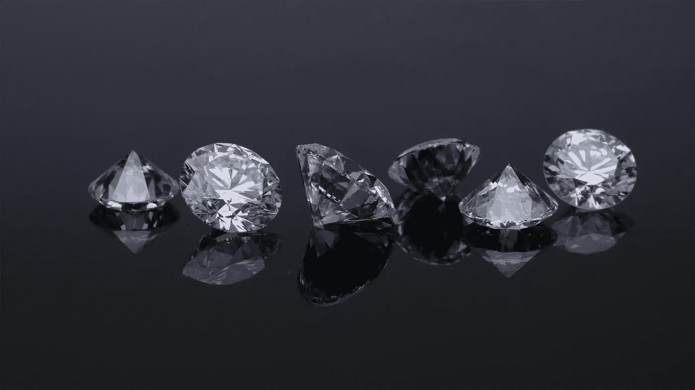
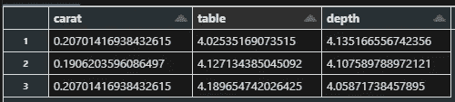
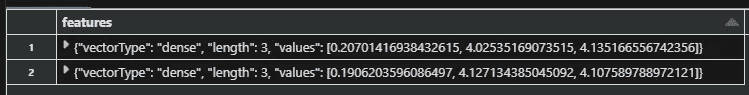
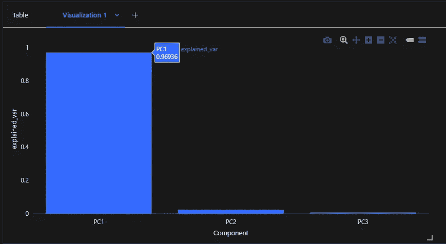
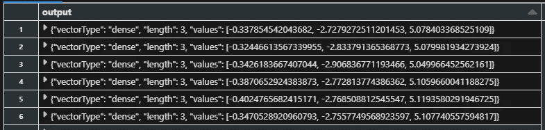
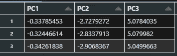
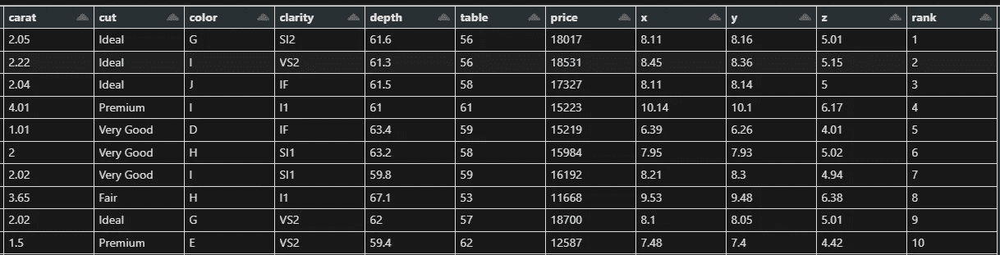

# 使用 PCA 在 PySpark 中对钻石进行排名

> 原文：[`towardsdatascience.com/ranking-diamonds-with-pca-in-pyspark-a59cab7f4f1a`](https://towardsdatascience.com/ranking-diamonds-with-pca-in-pyspark-a59cab7f4f1a)

## 在 PySpark 中运行主成分分析的挑战

[](https://gustavorsantos.medium.com/?source=post_page-----a59cab7f4f1a--------------------------------)[](https://towardsdatascience.com/?source=post_page-----a59cab7f4f1a--------------------------------) [Gustavo Santos](https://gustavorsantos.medium.com/?source=post_page-----a59cab7f4f1a--------------------------------)

·发布于 [Towards Data Science](https://towardsdatascience.com/?source=post_page-----a59cab7f4f1a--------------------------------) ·阅读时间 8 分钟·2023 年 12 月 22 日

--



照片由 [Edgar Soto](https://unsplash.com/@edgardo1987?utm_content=creditCopyText&utm_medium=referral&utm_source=unsplash) 提供，来源于 [Unsplash](https://unsplash.com/photos/two-diamond-studded-silver-rings-gb0BZGae1Nk?utm_content=creditCopyText&utm_medium=referral&utm_source=unsplash)

# 介绍

这里是另一篇关于 PySpark 的帖子。我很享受写关于这个主题的文章，因为我感觉我们缺乏关于 PySpark 的优质博客，特别是当我们谈论 MLlib 中的机器学习时——顺便说一下，MLlib 是 Spark 的**M**achine **L**earning **Lib**rary，旨在与大数据在并行环境中一起工作。

我可以说 Spark 文档非常出色。它组织得很有条理，示例也很容易跟随。但是，在 Spark 中进行机器学习并不是最友好的事情。

在这篇文章中，我使用 PCA 模型来帮助我创建钻石的排名，并且遇到了一些挑战，我们将在接下来的内容中讨论这些挑战。

我之前已经 [写过关于 PCA 的文章](https://medium.com/towards-data-science/pca-beyond-the-dimensionality-reduction-e352eb0bdf52)，以及它在降维方面的作用，还有 [创建排名](https://medium.com/towards-data-science/creating-scores-and-rankings-with-pca-c2c3081fdb26) 的方法。然而，这是我第一次使用 Spark 进行这个操作，目的是在大数据环境中复现这一技术。

让我们看看结果。

# 编码

让我们从导入模块开始我们的编码。

```py
from pyspark.sql.functions import col, sum, when, mean, countDistinct
from pyspark.sql import functions as F
from pyspark.ml.feature import PCA
from pyspark.ml.feature import VectorAssembler
from pyspark.sql.window import Window
```

## 数据集

本练习中使用的数据集是 *Diamonds*，来自 ggplot2 包，并且按照 Creative Commons 4.0 许可协议使用。

在这里，我从 Databricks 示例数据集中加载数据，并从一个变量中删除两个已知的异常值。PCA 受到异常值的影响。它们由于非常大的扭曲方差而倾向于主导一个组件。

```py
# Point file path
path = '/databricks-datasets/Rdatasets/data-001/csv/ggplot2/diamonds.csv'

# Load Data
df = spark.read.csv(path, header=True, inferSchema= True)
df = df.filter( col('y') < 30)
```

接下来，由于 PCA 是一种用于数值值的技术，我选择使用数据中的`carat`、`table`和`depth`变量。我没有使用`price`，因为它完全主导了组件的方差，使得模型失效。

此外，由于尺度不同，我还将数据转换为对数值，以便它们在相同的尺度上。

```py
# Get only our selected columns
cols = [ 'carat', 'table', 'depth']

df_num = df.select(F.log1p('carat').alias('carat'), 
                   F.log1p('table').alias('table'), 
                   F.log1p('depth').alias('depth'))
```

这就是它的样子。



选择变量的对数值。图片来源于作者。

下一步是对我们的数据集进行向量化。

## 向量化

当我们在 Spark 中处理大数据时面临的挑战之一是机器学习算法要求数据以向量形式输入。这可能更直接，但不幸的是，它给我们的代码增加了几个步骤。

如果我们在向量化之前还有其他步骤可以执行，我们可以创建一个`Pipeline`，可以一次运行之前编写的*步骤*。在我们的案例中，这一步是不必要的，因为我们只有一个步骤。

所以，接下来我们将创建一个`VectorAssembler`。顾名思义，它会获取数字并将它们汇集成一个单一的向量，通过观察，将所有这些数字放在一个名为`features`的列中。

```py
assembler = VectorAssembler(inputCols= cols, outputCol="features")
prepared_df = assembler.transform(df_num)
```

结果将如下所示。



向量化的数据。图片来源于作者。

## PCA

使用 MLlib 运行算法非常简单。我们实例化 PCA 并拟合数据。

```py
# Run PCA it with all the possible components
pca = PCA(k= len(df_num.columns), inputCol="features")
pca.setOutputCol("pca_features")

# Fit
model = pca.fit(prepared_df)
```

如果我们想查看 PCA 运行后每个主成分的解释方差，我们需要 Pandas 来简化我们的工作，能够快速创建一个数据框架并从`model.explainedVariance`中插入一个新列，列名为 PC 名称。

```py
# See explained variance of the PCs
df_var = ps.DataFrame(model.explainedVariance, columns=['explained_var'])
df_var.insert(0, 'Component', 
              value= ['PC'+str(n) for n in range(1,len(df_num.columns)+1)])
```

在 Databricks 中，创建这个图表只需点击几下按钮。



PC1 解释了 96%的方差。图片来源于作者。

## 获取转换后的数据

鉴于 Spark 是为大数据设计的，它缺乏对主成分的更完整的输出。像*特征向量、特征值*和*载荷*这样的数字不容易找到作为 PCA 模型的属性。

我们得到的输出只有 PC 解释的方差和转换后数据的表。这些数字可以给我们以下信息：（1）方向，对于那些在 PC 相同方向上变化的数据点为正值，而当其变化方向相反时为负值；（2）值，数值越高，表示在该组件中变化越大。

这是获取转换后数据的代码片段。

```py
# Get transformed Output
model.setOutputCol("output")
pca_transformed = model.transform(prepared_df).select('output')
```

以及生成的向量。



PCA 结果。图片来源于作者。

看看观察值#5 是与 PC1 方向相反的方差最大，同时也是 PC3 中方差最大的。

这些数字可以为我们提供排名观察值的基础。由于我们知道它们在每个组件中的变异程度以及每个组件解释的方差，我们可以通过将每个 PC 中的值乘以相应的解释方差来快速创建分数。

让我们看看怎么做。

## 清理变换后的数据

这里还有另一个挑战。这些向量并不太容易操作。所以我们必须绕过这个问题。

首先，我们只需收集变换后的值。

```py
# Collect the transformed results
temp = spark.createDataFrame(pca_transformed.collect())
```

好的。但这些数据还不能直接使用。每行仍然是一个`DenseVector`。我找到的处理方法是将临时数据集转换为字符串，以便将其拆分成 3 列。

```py
# Cast data to text
temp = temp.select(col('output').cast('string'))

[OUT]
output
[-0.31666817904639416,-2.8476048469770308,5.090764334358518]
[-0.32446613567339955,-2.833791365368773,5.079981934273924]
[-0.3312692998472932,-2.777878254082261,5.094343264160385]
[-0.33271613063654204,-2.830862619169142,5.089337919087877]
```

由于值现在是字符串，因此必须去除首尾的`[]`。使用`split`函数，我们可以用`,`作为分隔符拆分行。要去除方括号，只需切除 PC1 的第一个字符和 PC3 的最后一个字符。所有列都`cast('float')`以再次转换为数值。

```py
# split columns
df_transformed = (
    temp
    .select(
        F.split('output', ',')[0][2:15].alias('PC1').cast('float'),
        F.split('output', ',')[1].cast('float').alias('PC2'),
        F.split('output', ',')[2][0:14].alias('PC3').cast('float')       ) 
        .fillna(0)
        )
```

*瞧*。我们的数据准备好了用于排名。



清理后的数据。图像由作者提供。

## 计算分数

分数可以通过将每个 PC 的变换数据乘以相应的解释方差然后相加来计算。

> PC1 * 解释的方差 PC1 +
> 
> PC2 * 解释的方差 PC2 +
> 
> PC3 * 解释的方差 PC3

然后，我们将创建一个带有索引的列，使用`row_number`和`Window`，以便将结果与原始数据连接。最后创建一个`dense_rank`列，这就是我们的钻石排名。

```py
# Explained variance array
expl_var = model.explainedVariance

df_transformed = (
        df_transformed
        .withColumn('_c0', F.row_number().over(Window.partitionBy().orderBy(F.lit(1))))
        .withColumn('score', (col('PC1') * expl_var[0]) + (col('PC2') * expl_var[1]) + (col('PC3') * expl_var[2]) )
        .withColumn('rank', F.dense_rank().over(Window.partitionBy().orderBy('score')) )
        .sort('_c0')
        )
```

让我们展示一下。



排名前 10 名。图像由作者提供。

前面的表格是基于`carat`、`table`和`depth`变量的钻石排名。效果相当不错。我们可以看到，至少在这前 10 个结果中，即使没有考虑分类列，我们仍然看到更好的颜色和更高的清晰度排名。颜色从 D（最好）到 J（最差），清晰度的顺序是：（I1（最差）、SI2、SI1、VS2、VS1、VVS2、VVS1、IF（最好））。

例如：排名 1 的颜色比排名 2 好，但克拉更小且清晰度较差。排名 5 的颜色和清晰度都比排名 6 和 7 好，价格更好，但克拉较小。`depth`、`table`的确在其中起了作用。

# 离开前

我们已经结束了这篇文章。我在 Spark 中执行 PCA 时发现了一些挑战。这不是我工作过的最友好的方法之一。

我认为目前的功能还远不如统计工具如 R，后者能提供更优的算法实现。另一方面，Spark 并不是为了做统计分析而设计的。它最初是一个为 ETL 创建的大数据工具，后来不断发展并添加了更多功能。

此外，PCA 可以用于降维，当我们更改`k`值来提取组件时。对于大数据应用，它可以作为一个辅助工具来减少数据集的维度，并作为分析中其他步骤的输入。

```py
# Reduce to k components
pca = PCA(k = k, inputCol="features")
```

如果你喜欢这些内容，请关注我的博客获取更多信息。

[](https://gustavorsantos.medium.com/?source=post_page-----a59cab7f4f1a--------------------------------) [## Gustavo Santos - Medium

### 阅读 Gustavo Santos 在 Medium 上的文章。数据科学家。我从数据中提取洞察，以帮助个人和公司……

gustavorsantos.medium.com](https://gustavorsantos.medium.com/?source=post_page-----a59cab7f4f1a--------------------------------)

你也可以在[LinkedIn](https://www.linkedin.com/in/gurezende/)找到我。

GitHub 上的完整代码：

[](https://github.com/gurezende/Studying/tree/master/PySpark/PCA?source=post_page-----a59cab7f4f1a--------------------------------) [## Studying/PySpark/PCA at master · gurezende/Studying

### 这是一个包含我测试和研究新包的代码库 - Studying/PySpark/PCA at master · gurezende/Studying

github.com](https://github.com/gurezende/Studying/tree/master/PySpark/PCA?source=post_page-----a59cab7f4f1a--------------------------------)

# 有兴趣了解更多关于 PySpark 的内容吗？


[点击这里注册：Master Data Wrangling With PySpark](https://www.udemy.com/course/master-data-processing-pyspark/?couponCode=WEBINAR70)。图片由作者提供。

这是我的课程链接，已应用折扣优惠券：[**Mater Data Wrangling With PySpark**](https://www.udemy.com/course/master-data-processing-pyspark/?couponCode=WEBINAR70) **在 Udemy 上。**

# 参考资料

[](/creating-scores-and-rankings-with-pca-c2c3081fdb26?source=post_page-----a59cab7f4f1a--------------------------------) ## Creating Scores and Rankings with PCA

### 使用 R 语言根据多个变量为观察值创建评分

towardsdatascience.com [](/pca-beyond-the-dimensionality-reduction-e352eb0bdf52?source=post_page-----a59cab7f4f1a--------------------------------) ## PCA: Beyond Dimensionality Reduction

### 学习如何使用 PCA 算法来找到共同变化的变量

towardsdatascience.com  [## PCA - PySpark 3.5.0 documentation

### pyspark.sql.SparkSession.builder.getOrCreate

[spark.apache.org](https://spark.apache.org/docs/latest/api/python/reference/api/pyspark.ml.feature.PCA.html?source=post_page-----a59cab7f4f1a--------------------------------)
