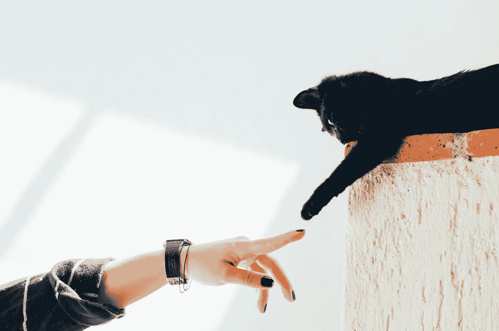
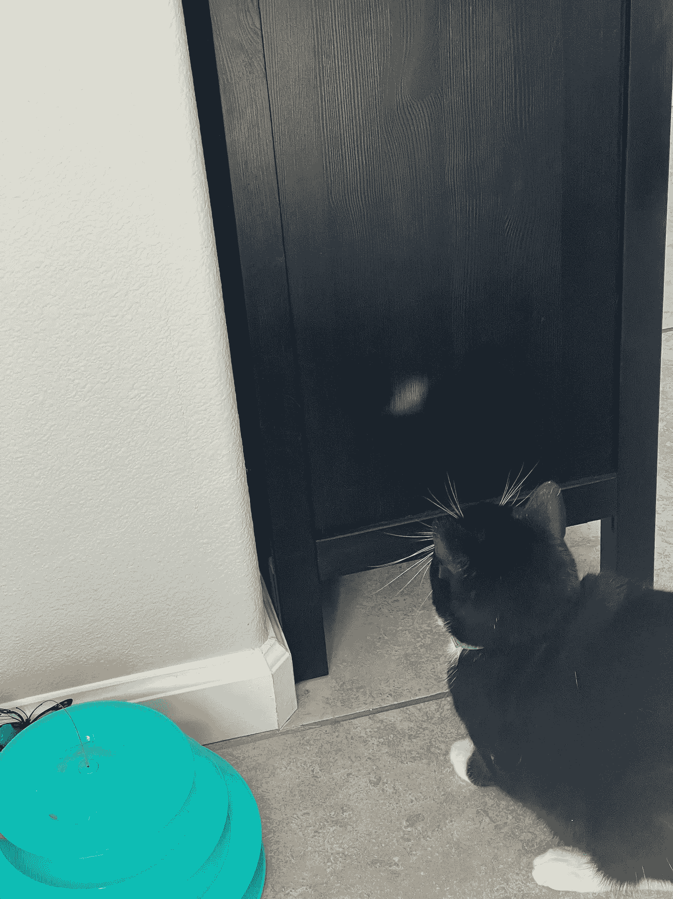
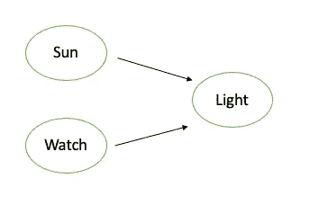
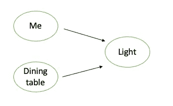
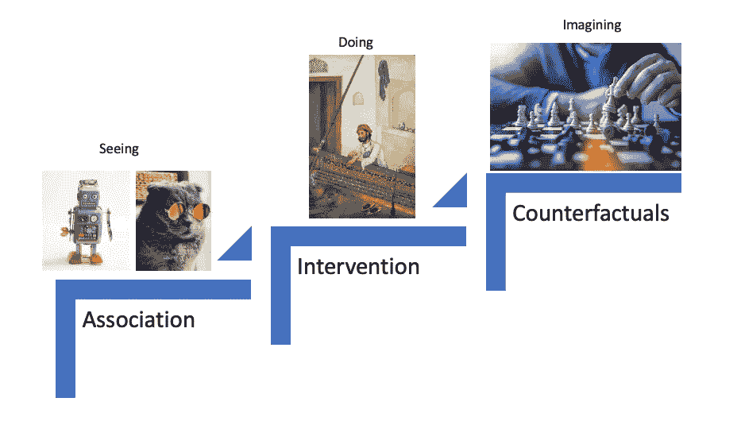
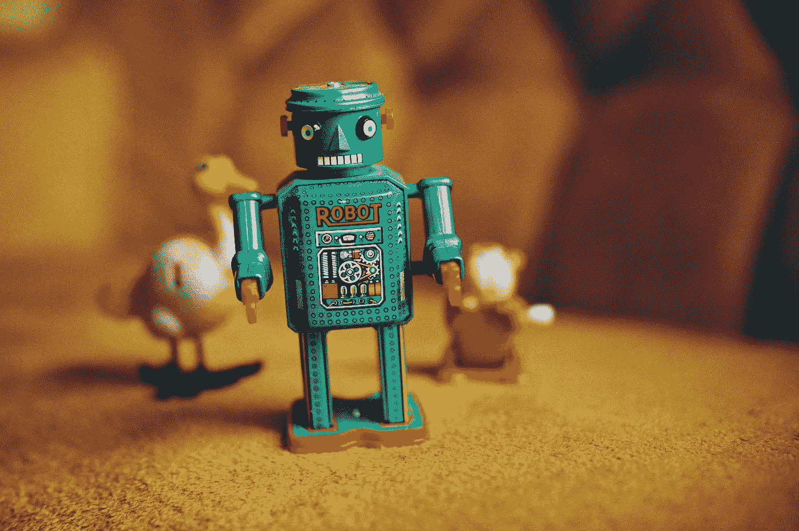

# 伴我阅读：因果关系书籍俱乐部

> 原文：[`towardsdatascience.com/read-with-me-a-causality-book-club-edd7085d6ae6`](https://towardsdatascience.com/read-with-me-a-causality-book-club-edd7085d6ae6)



图片由[Humberto Arellano](https://unsplash.com/@bto16180?utm_source=medium&utm_medium=referral)提供，在[Unsplash](https://unsplash.com/?utm_source=medium&utm_medium=referral)上

## 从一个猫咪的故事开始……

[](https://zzhu17.medium.com/?source=post_page-----edd7085d6ae6--------------------------------)[](https://towardsdatascience.com/?source=post_page-----edd7085d6ae6--------------------------------) [Zijing Zhu, PhD](https://zzhu17.medium.com/?source=post_page-----edd7085d6ae6--------------------------------)

·发表于[Towards Data Science](https://towardsdatascience.com/?source=post_page-----edd7085d6ae6--------------------------------) ·阅读时间 8 分钟·2023 年 10 月 26 日

--

我有三只猫。我爱它们所有的猫，但我不得不承认它们的智力水平不同。最聪明的一只是毛毛。最近，我注意到毛毛养成了一个新习惯。每当我吃午餐时，它就坐在我旁边。我愿意相信它爱我并想和我待在一起，但它冷漠的性格暗示着相反的事情。我还注意到它在我旁边坐着时很警觉，不断寻找什么。经过一些观察，我意识到它在等待一个光线反射去追逐。你知道猫咪对激光、光线反射等是多么狂热。餐桌在正午时能接受到充足的阳光，有时我手表的反射会出现在附近的墙壁或天花板上。



作者提供的图片

毛毛已经发现了一个规律——每当我坐在桌旁时，就会有光线吸引它。我的另外两只猫还没有发现这个规律，但它们有自己的策略。每当它们听到毛毛追逐光线的声音时，它们知道光线来了，很快就会加入追逐。我每次吃午餐时都会看着它们玩，这成了从忙碌的早晨恢复过来的最放松的活动。

你可能会问，这是一篇关于因果关系的技术博客还是猫的故事？尽管研究表明，看猫玩耍或做傻事能显著减轻压力，但这并不是这篇文章的主要目的。这个故事只是我为了更易理解地提出因果关系重要性的一种方式。此外，我很高兴地介绍我的第一个‘**跟我读**’系列，在这个系列中，我邀请你和我一起读一本书。我希望能提供一个平台，让我们深入探讨共同兴趣并分享我们的学习。我要开始的书是[《因果之书》由朱迪亚·珀尔著](https://www.amazon.com/Book-Why-Science-Cause-Effect/dp/046509760X)，这本书“彻底改变了对因果关系的理解。”

我对因果关系深感兴趣，不仅因为我在工作中广泛使用它，还因为我相信它是真正的科学。你可能经常听到‘**相关性不是因果关系**’。然而，真正的问题是，为什么要追逐因果关系，而相关性已经能为我们做很多事情？这就是猫的故事发挥作用的地方。

## 基于相关性的模型 vs. 因果结构

在毛毛的脑海中，他对光线反射感兴趣，而且信不信由你，他脑中有一个预测模型。这个模型是：每当我坐在餐桌旁，光线就会出现。这个模型可以用数学方程表示：

```py
P(Light) = 1, if I sit at the dining table
P(Light) = 0, otherwise
```

因此，每当他观察到我坐在餐桌旁，他就准备去追逐一些光线。很多时候，他是对的。如果我计算他的预测准确率，他在晴天时 99%的时间是对的。1%的不准确可能来自于我没有佩戴手表的情况。其他跟随毛毛行为的猫咪用这些方程表示：

```py
P(Light) = 1, if MaoMao is chasing it
P(Light) = 0, otherwise
```

它们的准确性也类似。然而，它们动作较慢，总是错过光线争夺中的先机。

这两种猫咪预测模型可能总结了所有**基于相关性**的预测模型。模型从历史数据中学习模式，并找到最能预测目标变量的变量。在我猫的脑海中，这两种模型比人类聪明开发的机器学习和深度学习模型要简单得多。然而，它们遵循相同的原则，只是复杂性不同。

**系统有效！** **很多时候都是！** 只要我佩戴手表并坐在合适的位置、在合适的天气下，我的猫咪们总是在午餐时间进行日常锻炼。然而，在阴天、晚餐时间太阳下山时，或者当我不佩戴手表时，它们的预测模型准确率都会降到 0。为什么？因为它们没有通过学习因果结构来正确解决问题：



image by author

它们脑海中的模型和心理模型是：



image by author

尽管我们人类很容易判断结构是否错误，我的猫们依然坚持使用它们的预测模型。MaoMao 每当我吃饭时，无论是白天还是晚上，总是和我待在一起。这就是在做预测时不了解因果关系的问题。当一切保持不变，或者没有制度变更时，基于相关性的模型效果非常好，以至于人们怀疑搞清楚因果结构的必要性。然后，当像 COVID、地缘政治摩擦和商业调整等事情发生时，模型表现突然大幅下降，你会摸不着头脑。在这种情况下，你唯一的选择就是重新训练和重建你的模型，以适应新的制度，通常可用的训练数据有限。另一种更糟的情况是你像我的其他猫一样，始终做出滞后的模型预测。在这种情况下，你只是被动反应，而不是主动，这从来不是预测模型的目的，而且你总是迟到。

## 因果关系如何帮助？

如果 MaoMao 理解了太阳和我的手表之间的因果关系，导致光线出现在墙上，它就会知道在晴天应该去哪里寻找光线。此外，MaoMao 还会知道在雨天或我没有戴手表的时候等待光线是没有意义的。遵循相同的原则，如果我坐在有阳光的沙发上，光线也会出现在对面的墙上；如果我不戴手表但手上拿着手机，手机也会在墙上反射光线。此外，一旦它们搞清楚了结构，它们可以通过它们的可爱来影响我的行为，促使我坐在有阳光的地方。它们可以充分发挥因果关系的潜力，享受光线的乐趣。理解因果关系的猫难道不好吗？

当然，我们的预测模型比猫的模型复杂得多。我们需要面对众多特征来构建和构建更复杂的因果结构。然而，回报也远超玩耍。这是每个公司都想知道的百万美元问题 —— **如果我做 X，我的销售会增加吗？我的客户会减少流失吗？我的利润会更高吗？**

这就是 Judea Pearl 希望通过《为什么的书》帮助我们回答的问题。在介绍中，他解释了因果关系的阶梯。



参考 Judea Pearl 的 “[因果关系的阶梯](https://hpccsystems.com/resources/causality-2021/)”

第一个层级基于被动观察做出预测，它回答类似“如果我看到我的顾客买了牙膏，那么我看到他们买牙线的可能性有多大？”的问题。

第二层级基于干预，即超越观察并改变现状。这个层级的一个典型问题是，“如果我们将牙膏价格翻倍，牙线的销售会发生什么？”或者更直接地，“我们应该设置什么价格才能卖出最多的牙线？”

第三层级涉及反事实。它位于顶层，因为它涉及**想象力**，这是在认知革命期间展现出的，区别于动物的能力。这里的一个典型问题是，“如果我没有提高牙膏的价格，牙线销售会发生什么？”

## 类人智能还是类动物能力



图片由[Phillip Glickman](https://unsplash.com/@phillipglickman?utm_source=medium&utm_medium=referral)拍摄，来源于[Unsplash](https://unsplash.com/?utm_source=medium&utm_medium=referral)

从直立行走到揭示火的力量，从皮尔逊相关系数到复杂的深度神经网络再到 LLM，人类不断进行创新。我们在构建类似人类智能的预测 AI 模型方面取得了许多进展，这些模型赋予了机器令人印象深刻的能力。然而，没有因果关系的嵌入，就不会实现智能。我们可以创建更复杂的具有多个隐藏层和数学方程的模型，但基本原理与我猫的简单模型类似。它们都是基于相关性的初级解决方案，用于复杂问题。

有了这些，我将启动**因果关系书友会**，邀请你和我一起阅读“**因果关系之书**”。我计划每周阅读一章，并每两周更新一篇关于两章内容的文章。文章可以是我阅读章节后的笔记或与内容相关的有用信息。如果时间允许，我强烈鼓励你阅读这本书。如果不行，请关注我的总结和学习。这本书共有十章，按照这个速度，我们可能在年底前读完。以下是我迄今为止写的文章：

+   [**第一章和第二章：数据告诉我们“是什么”，我们总是寻求“为什么”**](https://medium.com/towards-data-science/data-tells-us-what-and-we-always-seek-for-why-66da7dc3f24d)

+   [**第三章和第四章：因果图：面对观察数据中的阿基琉斯之踵**](https://medium.com/towards-data-science/causal-diagram-confronting-the-achilles-heel-in-observational-data-a69cdb1c4818)

+   [**第五章和第六章：理解数据生成过程比数据本身更重要**](https://medium.com/towards-data-science/why-understanding-the-data-generation-process-is-more-important-than-the-data-itself-f1b3b847e662)

+   [**第七章和第八章：你无法踏入同一条河流两次**](https://medium.com/towards-data-science/you-cant-step-in-the-same-river-twice-cfacf7cee305)

+   [**第九章和第十章：什么造就了强大的 AI**](https://medium.com/towards-data-science/what-makes-a-strong-ai-012315722793)

+   **附加内容：因果推断在学术界和工业界的区别是什么？**

**与我一起阅读** 通过 [订阅我的邮件列表](https://zzhu17.medium.com/subscribe)。欢迎在下方评论中分享你的学习体会。同时，这也是我第一次尝试**与我一起阅读**系列，请告诉我你是否有任何建议。我也非常鼓励你开设自己的博客，记录你在这个过程中的学习或想法。正如我在[最新的 YouTube 视频](https://youtu.be/oFDl0-SKAL8?si=r1QiRIizhDBdvX-A)中提到的，写作让我获得了比预期更丰富的经历。这也可能是你尝试一下的机会。

感谢阅读。希望我的猫的故事能激励你更多地了解因果关系，并与我一起踏上这段旅程。如果你喜欢这篇文章，不要忘记：

+   ***查看我最近的文章，内容包括*** [***数据讲故事中的 4D：将科学变为艺术***](https://medium.com/towards-data-science/the-4ds-in-data-storytelling-making-art-out-of-science-c4998ed7875e)；***数据科学中的持续学习******；*** ***我如何成为数据科学家******；***

+   ***查看我的*** [***其他文章***](https://zzhu17.medium.com/my-blog-posts-gallery-ac6e01fe5cc3) ***，涵盖*** [***数据科学面试准备***](https://zzhu17.medium.com/list/data-science-interview-preparation-bfb0986a61a3)***；*** ***因果推断******；***

+   [***订阅***](https://zzhu17.medium.com/subscribe) ***我的邮件列表；***

+   [***注册成为 Medium 会员***](https://zzhu17.medium.com/membership)***；***

+   ***或者在*** [***YouTube***](https://youtube.com/channel/UCMs6go1pvY5OOy1DXVtMo5A) ***上关注我，并观看我最新的 YouTube 视频，了解我的工作日常：***

+   我读过的其他书籍：

+   ***观看我参与的其他创作：***

## 参考资料

***《为什么的书》作者：Judea Pearl***

***因果关系的阶梯照片：***

*[1] 机器人照片由* [*Rock’n Roll Monkey*](https://unsplash.com/@rocknrollmonkey?utm_source=medium&utm_medium=referral) *提供，发布在* [*Unsplash*](https://unsplash.com/?utm_source=medium&utm_medium=referral)*上；*

*[2] 猫的照片由* [*Raoul Droog*](https://unsplash.com/@raouldroog?utm_source=medium&utm_medium=referral) *提供，发布在* [*Unsplash*](https://unsplash.com/?utm_source=medium&utm_medium=referral)*上；*

*[3] 干预照片由* [*British Library*](https://unsplash.com/@britishlibrary?utm_source=medium&utm_medium=referral) *提供，发布在* [*Unsplash*](https://unsplash.com/?utm_source=medium&utm_medium=referral)*上；*

*[4] 人类下棋照片由* [*JESHOOTS.COM*](https://unsplash.com/@jeshoots?utm_source=medium&utm_medium=referral) *提供，发布在* [*Unsplash*](https://unsplash.com/?utm_source=medium&utm_medium=referral)*上；*
