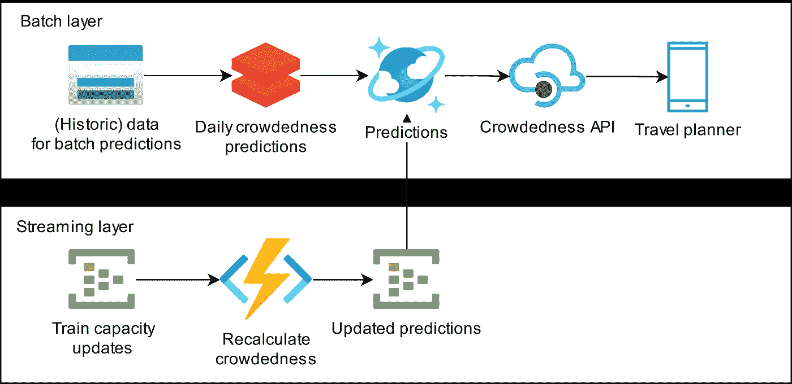
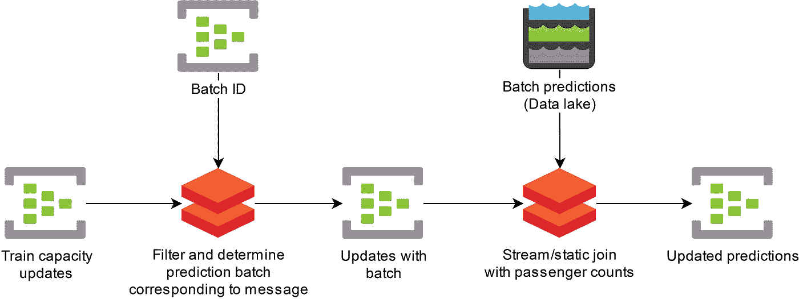
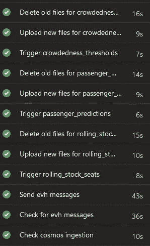

# 实时火车乘客拥挤度预测

> 原文：[`towardsdatascience.com/real-time-crowdedness-predictions-for-train-travelers-a5a5d2858bed?source=collection_archive---------6-----------------------#2023-07-07`](https://towardsdatascience.com/real-time-crowdedness-predictions-for-train-travelers-a5a5d2858bed?source=collection_archive---------6-----------------------#2023-07-07)

## 使用无服务器的 Azure 技术为我们的旅行规划应用提供流式预测

[](https://rikjongerius.medium.com/?source=post_page-----a5a5d2858bed--------------------------------)[](https://towardsdatascience.com/?source=post_page-----a5a5d2858bed--------------------------------) [Rik Jongerius](https://rikjongerius.medium.com/?source=post_page-----a5a5d2858bed--------------------------------)

·

[关注](https://medium.com/m/signin?actionUrl=https%3A%2F%2Fmedium.com%2F_%2Fsubscribe%2Fuser%2F8d3b69256f17&operation=register&redirect=https%3A%2F%2Ftowardsdatascience.com%2Freal-time-crowdedness-predictions-for-train-travelers-a5a5d2858bed&user=Rik+Jongerius&userId=8d3b69256f17&source=post_page-8d3b69256f17----a5a5d2858bed---------------------post_header-----------) 发布于 [Towards Data Science](https://towardsdatascience.com/?source=post_page-----a5a5d2858bed--------------------------------) ·11 分钟阅读·2023 年 7 月 7 日[](https://medium.com/m/signin?actionUrl=https%3A%2F%2Fmedium.com%2F_%2Fvote%2Ftowards-data-science%2Fa5a5d2858bed&operation=register&redirect=https%3A%2F%2Ftowardsdatascience.com%2Freal-time-crowdedness-predictions-for-train-travelers-a5a5d2858bed&user=Rik+Jongerius&userId=8d3b69256f17&source=-----a5a5d2858bed---------------------clap_footer-----------)

--

[](https://medium.com/m/signin?actionUrl=https%3A%2F%2Fmedium.com%2F_%2Fbookmark%2Fp%2Fa5a5d2858bed&operation=register&redirect=https%3A%2F%2Ftowardsdatascience.com%2Freal-time-crowdedness-predictions-for-train-travelers-a5a5d2858bed&source=-----a5a5d2858bed---------------------bookmark_footer-----------)

与 [Wessel Radstok](https://medium.com/@wradstok)


[图像来源：vecstock](https://www.freepik.com/free-photo/transportation-speed-blurred-railroad-track-generative-ai_40965146.htm#query=train&position=4&from_view=search&track=sph) 于 Freepik

荷兰铁路公司（Dutch Railways）的旅行者可以使用荷兰铁路公司提供的应用程序来规划他们的行程。在规划行程时，应用程序会显示相关火车的拥挤程度预测。这被分为三个类别：低占用、中等或高。旅行者可以使用这些信息来决定是否要乘坐其他可能稍微不那么拥挤的火车。


*图 1：带有预测乘客拥挤程度的旅行应用（使用 1、2 或 3 人表示）。图像由作者提供。*

这些预测是通过批处理过程进行的。一个机器学习模型会定期在历史数据上进行训练，每天早晨一个过程会运行以预测未来几天火车的拥挤程度。这是通过预测预期的乘客数量并将其与为该线路计划的火车的容量结合起来完成的。

然而，在白天可能会发生事故，导致火车被取消、改道，或者可能原计划是双层火车，但只提供了单层火车。因此，旅行者将看到过时的拥挤信息。大约 20% 的出发火车在旅行当天会更改容量，且往往是在出发前不久。

在这篇博客中，我们解释了如何构建一个流式处理管道，该管道接收有关计划线路的火车长度和类型的实时信息，并更新应用程序中的预期拥挤程度。我们遵循 Lambda 架构，其中我们的夜间预测实现了批处理层，而更新过程实现了流处理层。该管道目前在生产环境中运行，为使用我们应用程序的荷兰所有火车旅行者提供更实时的预期拥挤程度视图。



*图 2：使用 Lambda 架构的应用程序架构简化视图。图像由 draw.io 创建。*

我们描述了实现此架构的方法。我们的第一次实现是使用 Spark Structured Streaming，但结果并未如我们预期的那样。基于我们的经验（我们将讨论这一点），我们决定采用不同的方法，即使用 Azure 云中的无服务器资源。

# 初步尝试：Spark Structured Streaming

我们的每日拥挤度预测在 Databricks 上使用 Spark 进行数据处理。由于 Spark 支持流式数据处理，因此在 Spark Structured Streaming 中实现我们预测的实时更新似乎是一个合乎逻辑的选择。这个决定的好处是平台已经可用，我们可以使用我们已有经验的 DataFrame 方式实现逻辑。

我们从一个批量版本的模型开始实现，然后将其转换为纯 Spark Structured Streaming 实现。最终，我们得到一个小笔记本以引导流作业和一个包含所需逻辑的自定义 Python 包。

在开发过程中，我们学到了一些关于使用 Structured Streaming 编程的知识。首先，SQL DataFrames 和 Structured Streaming DataFrames 的编程接口是不一样的。Structured Streaming 在可做的事情上限制更多，这意味着我们不能将批量模型逐一实现为流模式，因此不得不多次修订算法以使其有效。Structured Streaming 接口的有限表达能力导致代码变得难以阅读，因此也难以维护。

一个简单的例子是，我们希望在两个数据流上基于时间窗口执行外连接。然而，Spark Structured Streaming 需要在连接条件中有等式，而我们没有两个相同数据的列。我们尝试向两个数据流中添加两个具有相同值的文字字段以实现等式，但 Spark 并不那么容易被欺骗。最终我们创建了一个“千年”字段，因为我们的时间戳都在第三千年：这样做有效，但实际上我们制造了一个“Y3K”错误。

此外，我们不得不将算法拆分成多个步骤，因为模型的不同部分有不同的时间限制，而这些限制无法在一个单一的结构化流作业中实现。我们选择将模型拆分成几个部分，使用 Azure Event Hubs 作为持久存储层将它们连接起来。这种方法的好处是处理的每一部分都有明确的目标，并且可以单独测试。



*图 3：使用 Spark Structured Streaming 处理列车容量更新的流处理概述。图像使用 draw.io 创建。*

我们用两种方式测试了我们的流程。对于单元测试，我们会简单地使用手工制作的批量 Spark SQL DataFrames 来测试流逻辑。这意味着我们可以测试流动流程的部分而无需实际启动流作业。这种方法捕获了许多功能需求，但无法捕获任何时间问题。第二步测试使用了 Spark Structured Streaming 内存接收器，以流模式运行查询来捕获一些时间效应。

最终，我们部署了代码，并且发现我们的云账单急剧增加。我们确定了两个原因：首先，Databricks 是一个很好的批处理分析作业解决方案，但它持续运行以处理流式作业的成本非常高。其次，我们雇主的信息安全政策要求我们记录数据访问。由于结构化流的状态存储可能包含数据，我们也必须记录这些数据。然而，状态存储更新非常频繁，包含许多小文件，这导致产生大量日志，捕获这些日志的成本很高。

最终，我们决定放弃这种方法。由于我们尝试解决的问题导致的云成本过高，再加上 Spark Structured Streaming 表达能力有限，使得模型实现非常难以理解和维护，我们得出结论认为我们不愿进一步投资改进这种方法，而是看看是否可以以不同的方式解决这个问题。

# 使用无服务器技术重新设计

注意到流程中的许多部分不需要状态，我们选择了一个使用 Azure Functions 作为计算平台的系统，以便每条消息可以单独处理。需要状态的地方我们使用 Stream Analytics。这使我们能够比较消息、重放消息或将其与另一个流连接。为了快速访问辅助数据，我们使用 Cosmos 数据库。我们仍然使用 Azure Event Hubs 将所有部分连接在一起。


*图 4：使用无服务器技术的最终架构。图像使用 draw.io 创建。*

## Azure Functions

Azure Functions 是对事件流应用操作的简单方法。它们对流中的每个事件分别调用，使得业务逻辑容易理解。它们原生支持 Python，使编写可维护的操作变得简单。由于平台管理所有的云连接样板代码，它们可以很容易地在本地开发和测试。我们在流程的各个部分使用它们：

+   一些函数仅仅过滤传入的消息，从而减少后续步骤的计算负载，降低容量和成本；

+   一些函数通过将消息与例如 Cosmos DB 中的其他数据源进行连接来丰富消息；

+   其他功能将消息从一种格式转换为例如最终输出格式；

+   最终，我们使用 Azure Functions 将数据从批处理层摄取到流处理层。

## 过滤、丰富和转换

执行这些步骤的函数是直接的 Python 代码。例如，过滤函数的主要部分仅仅是几行代码：

```py
def main(event: func.EventHubEvent, evh: func.Out[bytes]) -> None:
  """
  Filter messages to only send relevant messages for our streaming flow.
  """
  message = json.loads(event.get_body().decode("utf-8"))

  if _is_ns_operator(message):
    message = _remove_keys(message)
    message = _add_build_id(message)

    evh.set(str.encode(json.dumps(message)))
```

*列表 1：示例 Azure Function 代码，用于过滤和转换消息。*

在这里，我们处理每条消息，过滤出与我们公司运营的列车相关的消息，并从消息中移除我们不感兴趣的键（数据字段）。最后，我们向消息中添加构建 ID 元数据，以便我们在调试时有一些追踪信息。对于感兴趣的读者，JSON 字符串使用 *str.encode()* 编码为 Bytes 对象。如果将普通字符串发送到 Event Hub，它会自动被美化显示，这会在消息中引入大量空白。Bytes 对象则不会发生任何更改。

## 数据摄取到快速 Cosmos 数据库

为了重新计算列车拥挤度，需要快速访问预测的乘客数量、新的滚动库存的容量以及低、中和高分类的边界。这些数据是我们批处理流程的一部分，每天生成，并以 parquet 格式写入到我们的数据湖中。每次重新计算时从数据湖加载这些数据太慢。我们利用 Azure Cosmos 数据库的键值存储，以低延迟提供所需的静态数据，用于 Azure Functions 重新计算列车拥挤度。

理想的情况是，我们从每晚的批处理流程中触发数据摄取，并且能够接收到摄取是否成功或失败的反馈。摄取过程还需要能够读取包含复杂类型的 parquet 文件，这些文件在 Azure 数据工厂复制活动中不再受支持。我们的解决方案是利用 Azure Durable Functions。这是标准 Azure Functions 平台的扩展，支持有状态的长期运行函数。具体而言，Durable Functions 支持 webhooks，这使我们能够向协调器反馈摄取是否成功。

数据摄取的工作流程如下。我们的每晚批处理流程触发一个 Durable Function。该 Durable Function 选择正确的 Activity Function 以处理需要摄取的数据源，并针对每个可用的 parquet 文件触发该 Activity。然后，我们使用 pandas 读取每个文件，执行一些简单的转换，并将记录批量插入到 Cosmos 数据库中。Durable Function 会自动跟踪任何失败情况，并重新尝试该函数。

## Azure Stream Analytics

有些操作我们无法通过 Azure Functions 轻松完成。这主要适用于有状态的操作，或涉及在时间窗口内合并消息的操作。

我们的每日拥挤度预测是在一个批处理流程中完成的，该流程不会立即计算预测结果。这个过程需要时间，在这段时间内可能会有新的列车容量更新。如果发生这种情况，我们希望更新拥挤度两次：首先是在最新的上一个预测上，然后是在新的预测结果变得可用时。我们在这里使用 Azure Stream Analytics 来保持更新消息的状态，并在新批次预测可用时从特定时间戳重新播放这些消息。

Azure Stream Analytics 查询是用 SQL 方言编写的。实现转换相对简单。然而，当消息吞吐量需要很高时，需要特别注意。在我们的案例中，直接实现无法跟上输入流，我们必须确保流分析查询能够以尴尬并行的方式运行。

尴尬并行查询有一些要求和限制。它们需要处理分区数据，并且需要在分区内执行有状态操作（例如连接）。这意味着在连接两个 Event Hub 流时，它们必须具有相同数量的分区，且第一个 Event Hub 的分区 1 上的数据只能与第二个 Event Hub 的分区 1 上的数据进行连接。

为了解决这个问题，我们在多个 Event Hub 分区上复制了一些数据，并基本上实现了广播连接操作。我们在下面的查询中展示了这一点。在这里，我们的每个拥挤度预测都会被分配一个批次 ID 和一个批次开始时间，用于决定哪个火车容量更新消息适用于哪个预测。如果消息在计算新一组预测期间到达，它可以适用于多个预测。在这种情况下，会输出多个消息。每个批次 ID 会在多个 Event Hub 分区上复制。

```py
SELECT
 batchid.batch_id,
 batchid.batch_start_time,
 event.message,
 event.message_timestamp INTO [Target]
FROM
 [SourceData] event TIMESTAMP BY event.message_timestamp PARTITION BY PartitionId
 JOIN [BatchId] batchid TIMESTAMP BY batchid.EventEnqueuedUtcTime PARTITION BY PartitionId
 ON
 -- Join if the batch id message was received before the message (positive DATEDIFF) and
 -- when replay when a batch id message was received after the message (negative DATEDIFF),
 -- but only if the message was enqueued after the batch start time.
 -- To allow fast re-ingesting data we discard messages which are no longer valid for the batch
  DATEDIFF(HOUR, batchid, event) BETWEEN - 24 AND 24
  AND CAST(batchid.batch_start_time AS datetime) <= CAST(event.message_timestamp AS datetime)
  AND CAST(event.message.valid_until AS datetime) >= CAST(batchid.batch_start_time AS datetime)
  AND event.PartitionId = batchid.PartitionId
```

*清单 2：将相应的批次 ID 添加到每条消息中的示例 Azure Stream Analytics 查询。*

## 端到端集成测试

从项目的初始提交开始，我们决定对流处理流执行自动化端到端集成测试。这种测试的形式是用我们生成的示例消息对入口 Event Hubs 进行种子填充，然后验证在输出 Event Hubs 上创建的消息。我们还将 Cosmos 数据库摄取包含在这个集成测试流程中。将这些测试作为我们持续部署的一部分，让我们在更改时充满信心，因为流中的组件数量增加，并且复杂性也随之增加。



*图 5：用于集成测试流的 CI/CD 流程步骤概述。如果需要，我们会删除早期测试中的任何遗留数据，上传新数据并启动三个数据源的数据摄取功能。然后，我们向 Event Hub 提供事件消息，并检查它们是否正确地从另一端输出。最后，我们对 Cosmos 数据库摄取进行额外检查。图片由作者提供。*

# 结论和关键学习

在我们努力为火车旅行者提供最新的乘客拥挤度信息，即使在火车服务发生变化的情况下，我们也采用了 lambda 架构来更新我们的预测，以应对火车容量的变化。

我们最初使用 Spark Structured Streaming 的实现未能达到预期效果，因此我们转向了使用 Azure Event Hubs、Azure Functions、Azure Stream Analytics 和 Azure Cosmos DB 的无服务器架构。

这种方法的关键好处包括：

+   作为开发者，你掌控全局：哪些部分性能不佳，哪些部分产生最高成本都很清楚；

+   与 Spark Structured Streaming 相比，Azure Functions 中的纯 Python 代码可读性强、可维护性好且表达力丰富；

+   对于无状态操作，Azure Functions 成本低廉；

+   Azure 流分析是最昂贵的部分，只能在重要的地方使用（有状态或时间窗口操作）；

+   新解决方案显著降低了云基础设施成本。

关键的缺点：

+   使用解耦组件如 Azure Functions 和 Azure Cosmos DB 可能导致竞争条件，前提是设计不够完善；

+   需要管理许多基础设施和小块代码：逻辑没有集中在一个地方，需要更多的测试。
