# 如何检测 LLM 中的幻觉

> 原文：[`towardsdatascience.com/real-time-llm-hallucination-detection-9a68bb292698`](https://towardsdatascience.com/real-time-llm-hallucination-detection-9a68bb292698)

## 教导聊天机器人说“我不知道”

[](https://medium.com/@brezeanu.iulia?source=post_page-----9a68bb292698--------------------------------)[](https://towardsdatascience.com/?source=post_page-----9a68bb292698--------------------------------) [尤利娅·布雷泽安努](https://medium.com/@brezeanu.iulia?source=post_page-----9a68bb292698--------------------------------)

·发表于[数据科学前沿](https://towardsdatascience.com/?source=post_page-----9a68bb292698--------------------------------) ·10 分钟阅读·2023 年 12 月 31 日

--


[视觉](https://unsplash.com/@visuals?utm_source=medium&utm_medium=referral)提供的照片，发布在[Unsplash](https://unsplash.com/?utm_source=medium&utm_medium=referral)上

> **伊夫琳·哈特维尔是谁？**
> 
> **伊夫琳·哈特维尔**是一位美国作家、演讲者和生活教练…
> 
> **伊夫琳·哈特维尔**是一位加拿大芭蕾舞演员以及创始艺术总监…
> 
> **伊夫琳·哈特维尔**是一位美国演员，以其在…中的角色而闻名

不，**伊夫琳·哈特维尔**并不是一个拥有多个虚假身份的诈骗犯，她过着一种伪装的三重生活，拥有各种职业。实际上，她根本不存在，但模型并没有告诉我它不知道，而是开始编造事实。我们正面临 LLM 幻觉的问题。

长篇详细的输出可能看起来非常可信，即使是虚构的。这是否意味着我们不能信任聊天机器人，每次都需要手动核实输出的真实性？幸运的是，通过正确的保护措施，可能会有方法使聊天机器人不太容易编造信息。

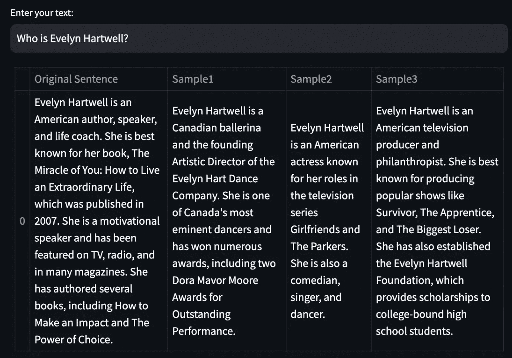

text-davinci-003 在虚构人物上的提示完成。图片由作者提供。

对于上述输出，我设置了较高的温度 0.7。我允许 LLM 更改句子的结构，以避免每次生成相同的文本。输出之间的差异应仅为语义上的，而非事实上的。

这个简单的想法引入了一种基于样本的幻觉检测机制。如果 LLM 对相同的提示产生的输出相互矛盾，那么这些输出很可能是幻觉。如果它们相互包含，这意味着信息是事实的。[2]

对于这种类型的评估，我们只需要 LLM 的文本输出。这被称为黑箱评估。此外，由于我们不需要任何外部知识，这也被称为零资源。[5]

# 句子嵌入的余弦距离

让我们从一种非常基本的相似性度量方法开始。我们将计算嵌入句子对应对的成对余弦相似性。我们对其进行归一化，因为我们只需要关注向量的方向，而不是大小。下面的函数以原始生成的句子 *output* 和一个包含 3 个样本输出的列表 *sampled_passages* 作为输入。所有的完成都在文章开头的图片中找到。

为生成嵌入，我使用了轻量级模型 *all-MiniLM-L6-v2*。嵌入一个句子将其转换为向量表示。

```py
output = "Evelyn Hartwell is a Canadian dancer, actor, and choreographer." 
output_embeddings= model.encode(output)

array([ 6.09108340e-03, -8.73148292e-02, -5.30637987e-02, -4.41815751e-03,
 1.45469820e-02, 4.20340300e-02, 1.99541822e-02, -7.29453489e-02,
…
 -4.08893749e-02, -5.41420840e-02, 2.05906332e-02, 9.94611382e-02,
 -2.24501686e-03, 2.29083393e-02, 7.80007839e-02, -9.53456461e-02],
 dtype=float32)
```

我们为 LLM 的每个输出生成嵌入；然后，使用 *pairwise_cos_sim* 函数计算成对余弦相似性。我们将原始响应与每个新样本响应进行比较，然后计算平均值。

```py
from sentence_transformers.util import pairwise_cos_sim
from sentence_transformers import SentenceTransformer

def get_cos_sim(output,sampled_passages):
    model = SentenceTransformer('all-MiniLM-L6-v2')
    sentence_embeddings = model.encode(output).reshape(1, -1)
    sample1_embeddings = model.encode(sampled_passages[0]).reshape(1, -1)
    sample2_embeddings = model.encode(sampled_passages[1]).reshape(1, -1)
    sample3_embeddings = model.encode(sampled_passages[2]).reshape(1, -1)
    cos_sim_with_sample1 = pairwise_cos_sim(
    sentence_embeddings, sample1_embeddings
    )
    cos_sim_with_sample2  = pairwise_cos_sim(
    sentence_embeddings, sample2_embeddings
    )
    cos_sim_with_sample3  = pairwise_cos_sim(
    sentence_embeddings, sample3_embeddings
    )
    cos_sim_mean = (cos_sim_with_sample1 + cos_sim_with_sample2 + cos_sim_with_sample3) / 3
    cos_sim_mean = cos_sim_mean.item()
    return round(cos_sim_mean,2)
```

这是函数如何在二维笛卡尔空间中使用一对非常简单的向量的直观解释。A 和 B 是原始向量，而 Â 和 B̂ 是归一化后的向量。

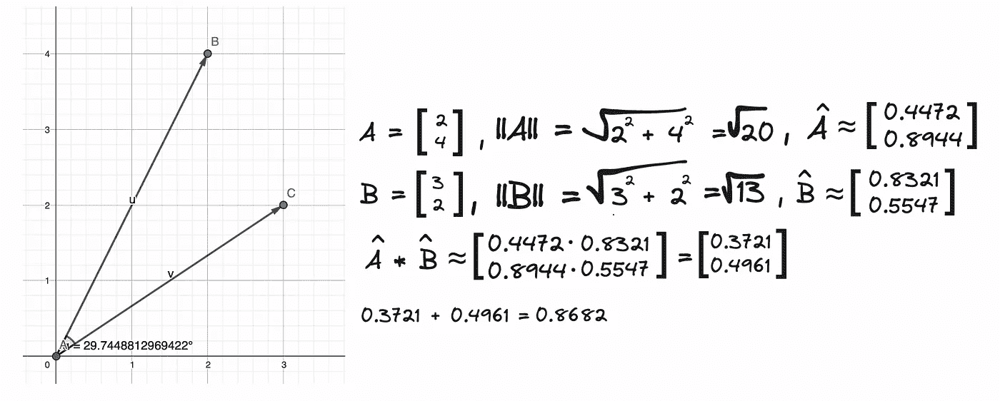

成对余弦相似性计算。图片由作者提供。

从上面的图片中，我们可以看到向量之间的角度大约是 30⁰，所以它们彼此接近。余弦值大约是 0.87。余弦值越接近 1，向量之间就越接近。

```py
cos_sim_score = get_cos_sim(output, [sample1,sample2,sample3])
```

我们的嵌入输出的 *cos_sim_score* 平均值为 0.52。

为了理解如何解读这个数字，让我们将其与一些有效输出的余弦相似性分数进行比较，这些输出涉及关于现有人物的信息。

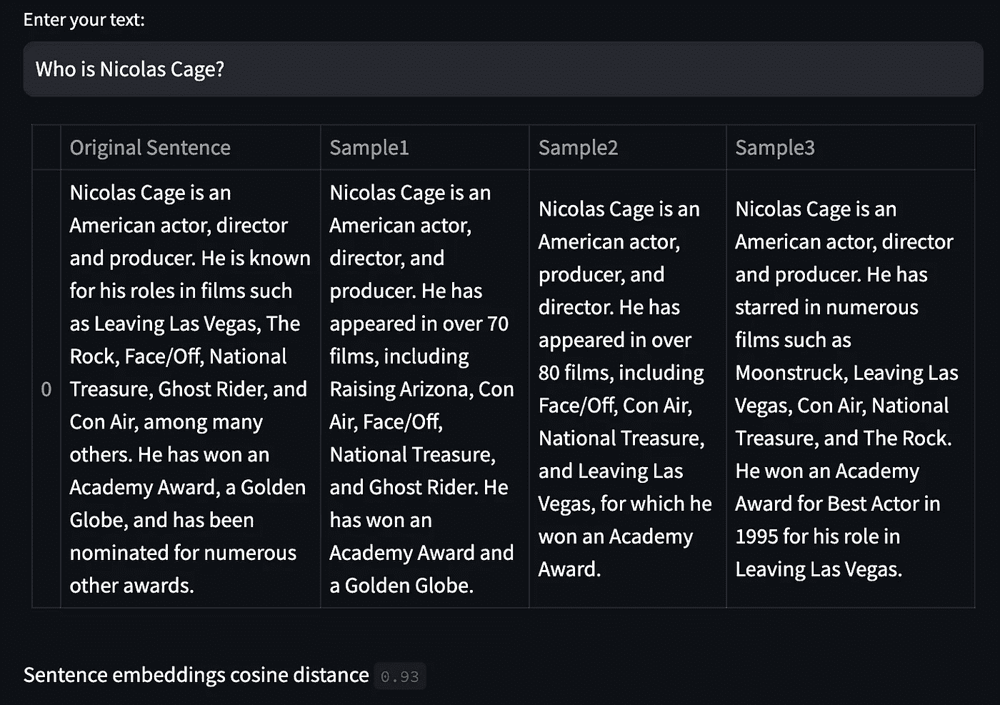

作者提供的图片 — text-davinci-003 在尼古拉斯·凯奇上的提示完成

在这种情况下，成对余弦相似性分数是 0.93。这看起来很有前景，特别是作为一种非常快速的方法来评估输出之间的相似性。


余弦相似性计算的持续时间。图片由作者提供。

# SelfCheckGPT- BERTScore

BERTScore 基于我们之前实现的成对余弦相似性思想。

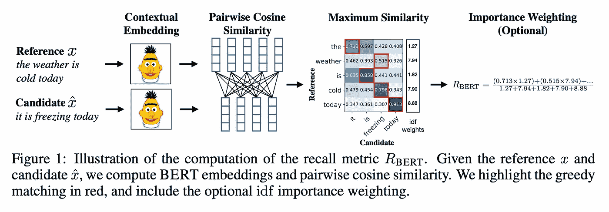

[1]

用于计算上下文嵌入的默认分词器是 RobertaTokenizer。上下文嵌入不同于静态嵌入，因为它们考虑了词汇周围的上下文。例如，“bat” 这个词会根据上下文是指“飞行的哺乳动物”还是“棒球棒”而对应不同的标记值。

```py
def get_bertscore(output, sampled_passages):
    # spacy sentence tokenization
    sentences = [sent.text.strip() for sent in nlp(output).sents] 
    selfcheck_bertscore = SelfCheckBERTScore(rescale_with_baseline=True)
    sent_scores_bertscore = selfcheck_bertscore.predict(
        sentences = sentences, # list of sentences
        sampled_passages = sampled_passages, # list of sampled passages
    )
    df = pd.DataFrame({
    'Sentence Number': range(1, len(sent_scores_bertscore) + 1),
    'Hallucination Score': sent_scores_bertscore
    })
    return df
```

让我们深入了解一下*自检 _bert 评分.predict*函数。我们没有将完整的原始输出作为参数传递，而是将其拆分为单独的句子。

```py
['Evelyn Hartwell is an American author, speaker, and life coach.',
 'She is best known for her book, The Miracle of You: How to Live an Extraordinary Life, which was published in 2007.',
 'She is a motivational speaker and has been featured on TV, radio, and in many magazines.',
 'She has authored several books, including How to Make an Impact and The Power of Choice.']
```

这个步骤很重要，因为*s*elfcheck_bertscore.predict*函数计算了每个原始响应中的句子与样本中的每个句子的 BERTScore。首先，它创建一个数组，其中行数等于原始输出中的句子数，列数等于样本的数量。

```py
array([[0., 0., 0.],
       [0., 0., 0.],
       [0., 0., 0.],
       [0., 0., 0.]])
```

用于计算候选句子和参考句子之间 BERTScore 的模型是具有 17 层的 RoBERTa large。我们的原始输出有 4 个句子，我将其称为 r1、r2、r3 和 r4。第一个样本有两个句子：c1 和 c2。我们计算原始输出中每个句子与第一个样本中每个句子的 F1 BERTScore。然后，我们进行基于基线张量 b = **tensor([0.8315, 0.8315, 0.8312])**的基础重标定。基线*b*是通过使用来自 Common Crawl 单语数据集的 100 万对随机句子计算的。他们计算了每对句子的 BERTScore 并取其平均值。这代表了一个下界，因为随机对的语义重叠很少。[1]

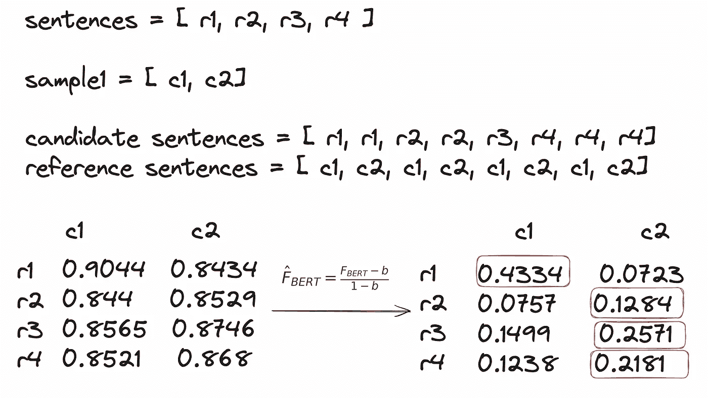

F1 BERTScore。图片来源：作者。

我们保留原始响应中每个句子与每个抽样样本中最相似句子的 BERTScore。逻辑是，如果某条信息出现在从相同提示生成的多个样本中，那么该信息很可能是事实。如果某个声明仅出现在一个样本中，而在相同提示的其他样本中没有出现，则更可能是虚构的。

让我们为第一个样本添加数组中的最大相似度：

```py
bertscore_array
array([[0.43343216, 0\.        , 0\.        ],
       [0.12838356, 0\.        , 0\.        ],
       [0.2571277 , 0\.        , 0\.        ],
       [0.21805632, 0\.        , 0\.        ]])
```

现在我们对另外两个样本重复这个过程：

```py
array([[0.43343216, 0.34562832, 0.65371764],
       [0.12838356, 0.28202596, 0.2576825 ],
       [0.2571277 , 0.48610589, 0.2253703 ],
       [0.21805632, 0.34698656, 0.28309497]])
```

然后我们计算每一行的平均值，从而得到原始响应中每个句子与每个后续样本的相似度评分。

```py
array([0.47759271, 0.22269734, 0.32286796, 0.28271262])
```

每个句子的幻觉评分通过从 1 中减去上述每个值来获得。

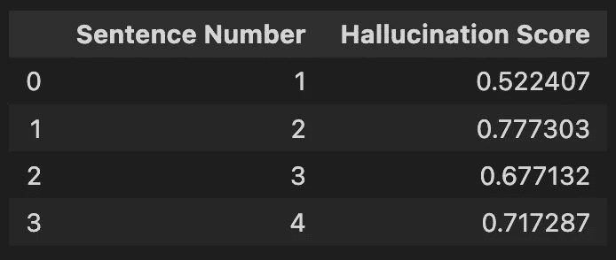

**伊夫琳·哈特维尔**的幻觉评分。图片来源：作者。

将结果与尼古拉斯·凯奇的答案进行比较。

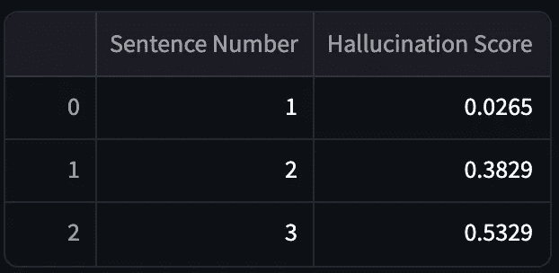

**尼古拉斯·凯奇**的幻觉评分。图片来源：作者。

看起来很合理；有效输出的幻觉评分较低，而虚构输出的幻觉评分较高。不幸的是，计算 BERTScore 的过程非常耗时，这使得它不适合实时幻觉检测。


BERTScore 计算的持续时间。图片来源：作者。

# SelfCheckGPT-NLI

自然语言推断（NLI）涉及确定一个假设是否从给定的前提中逻辑推导出来，或与之矛盾。关系被分类为蕴含、矛盾或中立。对于 SelfCheck-NLI，我们使用经过 MNLI 数据集微调的 DeBERTa-v3-large 模型来执行 NLI。

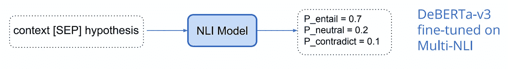

NLI 流程图 [5]

以下是一些前提—假设对及其标签的示例。

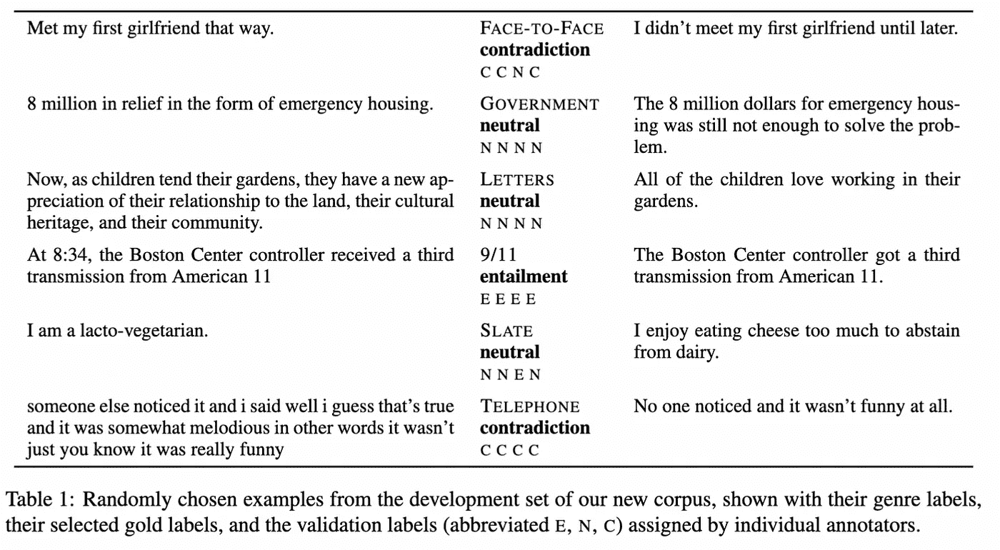

上下文—假设对的示例 [4]

```py
def get_self_check_nli(output, sampled_passages):
    # spacy sentence tokenization
    sentences = [sent.text.strip() for sent in nlp(output).sents] 
    selfcheck_nli = SelfCheckNLI(device=mps_device) # set device to 'cuda' if GPU is available
    sent_scores_nli = selfcheck_nli.predict(
        sentences = sentences, # list of sentences
        sampled_passages = sampled_passages, # list of sampled passages
    )
    df = pd.DataFrame({
    'Sentence Number': range(1, len(sent_scores_nli) + 1),
    'Probability of Contradiction': sent_scores_nli
    })
    return df
```

在 *selfcheck_nli.predict* 函数中，将原始响应中的每个句子与三个样本中的每一个配对。

```py
logits = model(**inputs).logits # neutral is already removed
probs = torch.softmax(logits, dim=-1)
prob_ = probs[0][1].item() # prob(contradiction)
```

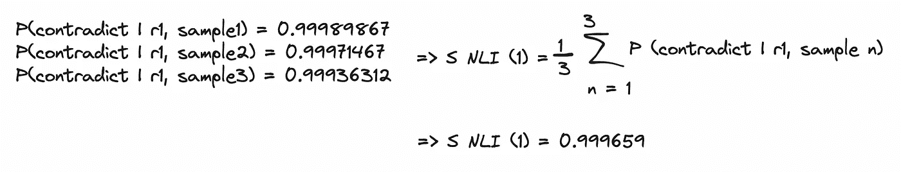

相对于第一个句子和每个样本的矛盾概率。图像由作者提供。

现在我们对每个四个句子重复这个过程。

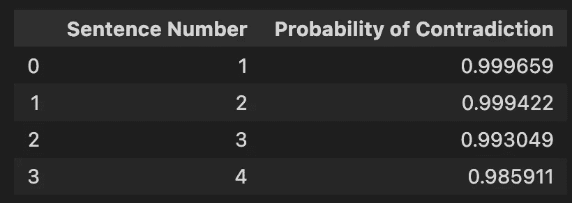

**Evelyn Hartwell** 的 SelfCheck-NLI。图像由作者提供。

我们可以看到模型输出了一个极高的矛盾概率。现在我们与实际输出进行比较。


**Nicolas Cage** 的 SelfCheck-NLI。图像由作者提供。

模型表现得非常好！不幸的是，NLI 检查时间有点长。


NLI 计算的持续时间。图像由作者提供。

# SelfCheckGPT-Prompt

更新的方法已经开始使用 LLMs 自身来评估生成的文本。我们将输出和三个样本一起发送到 gpt-3.5-turbo，而不是使用公式来计算评分。模型将决定原始输出与生成的其他三个样本的相符程度。 [3]

```py
def llm_evaluate(sentences,sampled_passages):
    prompt = f"""You will be provided with a text passage \
                and your task is to rate the consistency of that text to \
                that of the provided context. Your answer must be only \
                a number between 0.0 and 1.0 rounded to the nearest two \
                decimal places where 0.0 represents no consistency and \
                1.0 represents perfect consistency and similarity. \n\n \
                Text passage: {sentences}. \n\n \
                Context: {sampled_passages[0]} \n\n \
                {sampled_passages[1]} \n\n \
                {sampled_passages[2]}."""

    completion = client.chat.completions.create(
    model="gpt-3.5-turbo",
    messages=[
        {"role": "system", "content": ""},
        {"role": "user", "content": prompt}
    ]
    )

    return completion.choices[0].message.content
```

对于 Evelyn Hartwell，返回的自相似度评分是**0**。与此同时，与 Nicolas Cage 相关的输出评分是**0.95**。获取评分所需的时间也相当短。


LLM 自相似度评分计算的持续时间。图像由作者提供。

这似乎是我们案例的最佳解决方案，因为我们从源论文的比较分析中也预期到了这一点 [2]。SelfCheckGPTPrompt 显著优于所有其他方法，NLI 是表现第二好的方法。

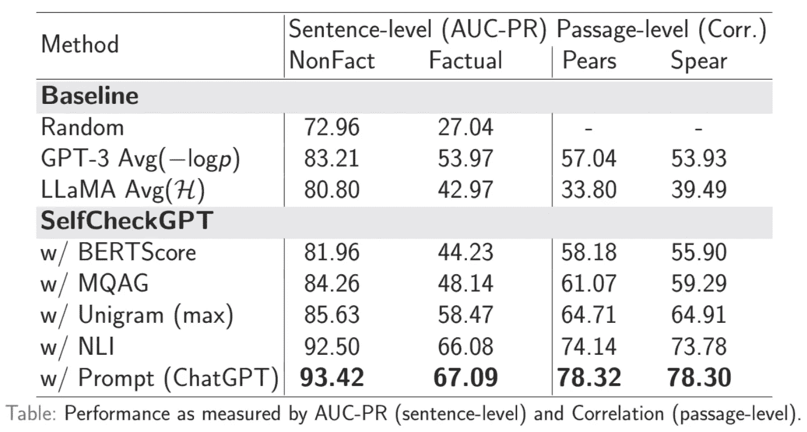

幻觉检测评估结果 [6]

评估数据集是通过使用 WikiBio 数据集和 GPT-3 生成合成的维基百科文章创建的。为了避免模糊的概念，从最长的文章的前 20%中随机抽取了 238 个文章主题。GPT-3 被提示以维基百科风格为每个概念生成首段。

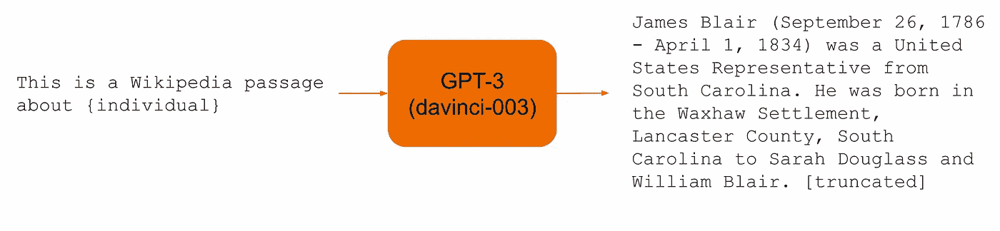

评估数据集创建 [5]

接下来，这些生成的段落被人工注释以评估其准确性。根据预定义的指南，每个句子被标记为主要不准确、次要不准确或准确。总共标注了 1908 个句子，其中约 40%为主要不准确，33%为次要不准确，27%为准确。

为了评估标注者的一致性，200 个句子有双重标注。如果标注者达成一致，则使用该标签；否则，选择最坏的标签。通过 Cohen’s kappa 测量的标注者间一致性在选择准确、轻微不准确和主要不准确之间为 0.595，而在将轻微/主要不准确合并为一个标签时为 0.748。

评估指标 AUC-PR 指的是精确度-召回曲线下的面积，这是用于评估分类模型的指标。

# 实时幻觉检测

作为最终应用，我们来构建一个 Streamlit 应用以实现实时幻觉检测。如前所述，最佳指标是 LLM 自相似性分数。我们将使用 0.5 的阈值来决定是显示生成的输出还是免责声明。

```py
import streamlit as st
import utils
import pandas as pd

# Streamlit app layout
st.title('Anti-Hallucination Chatbot')

# Text input
user_input = st.text_input("Enter your text:")

if user_input:

    prompt = user_input

    output, sampled_passages = utils.get_output_and_samples(prompt)

    # LLM score
    self_similarity_score = utils.llm_evaluate(output,sampled_passages)

    # Display the output
    st.write("**LLM output:**")
    if float(self_similarity_score) > 0.5:
        st.write(output)
    else:
        st.write("I'm sorry, but I don't have the specific information required to answer your question accurately. ")
```

现在，我们可以可视化最终结果。

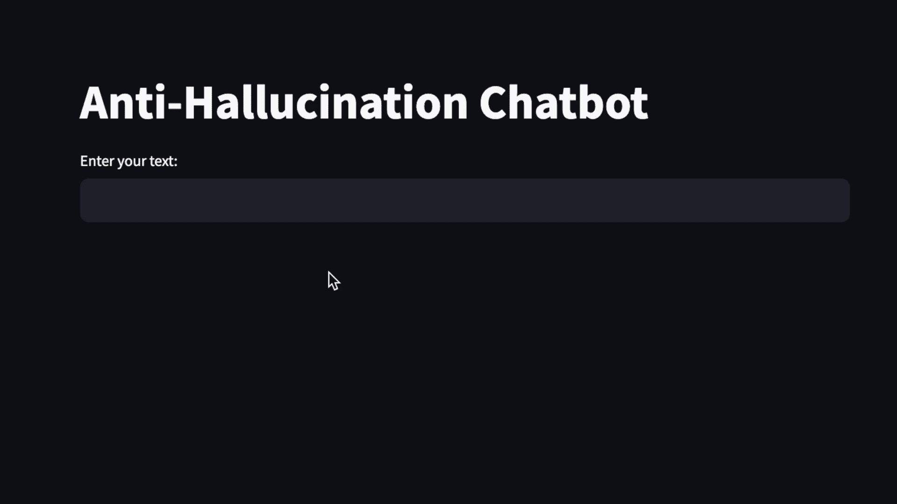

Streamlit 应用演示。图片由作者提供。

# 结论

结果非常令人鼓舞！聊天机器人中的幻觉检测一直是一个长期讨论的质量问题。

这里所述技术之所以令人兴奋，是因为采用了使用 LLM 评估其他 LLM 输出的新颖方法。具体做法是生成多个对同一提示的响应并比较其一致性。

仍然需要做更多的工作，但与其依赖人工评估或手工制定规则，不如让模型本身捕捉不一致性，这似乎是一个不错的方向。

. . .

*如果你喜欢这篇文章，加入* [***文本生成***](https://textgeneration.substack.com/) *——我们的新闻通讯每周发布两篇文章，提供有关生成 AI 和大语言模型的最新见解。*

*你可以在* [*GitHub*](https://github.com/partycia/real-time-hallucination-detection.git)*上找到这个项目的完整代码。*

*你也可以在* [*LinkedIn*](https://www.linkedin.com/in/ibrezeanu/)*上找到我。*

. . .

# 参考文献：

1.  [BERTSCORE: 使用 BERT 评估文本生成](https://arxiv.org/abs/1904.09675)

1.  [SELFCHECKGPT: 生成大语言模型的零资源黑箱幻觉检测](https://arxiv.org/abs/2303.08896)

1.  [`learn.deeplearning.ai/quality-safety-llm-applications`](https://learn.deeplearning.ai/quality-safety-llm-applications)

1.  [广覆盖挑战语料库用于

    通过推断进行句子理解](https://aclanthology.org/N18-1101)

1.  [`drive.google.com/file/d/13LUBPUm4y1nlKigZxXHn7Cl2lw5KuGbc/view`](https://drive.google.com/file/d/13LUBPUm4y1nlKigZxXHn7Cl2lw5KuGbc/view)

1.  [`drive.google.com/file/d/1EzQ3MdmrF0gM-83UV2OQ6_QR1RuvhJ9h/view`](https://drive.google.com/file/d/1EzQ3MdmrF0gM-83UV2OQ6_QR1RuvhJ9h/view)
