# 推荐系统：基于矩阵分解的协同过滤

> 原文：[`towardsdatascience.com/recommendation-system-with-matrix-factorization-ebc4736869e4`](https://towardsdatascience.com/recommendation-system-with-matrix-factorization-ebc4736869e4)

## 通过矩阵分解解释推荐

 [Christie Natashia](https://medium.com/@christienatashia?source=post_page-----ebc4736869e4--------------------------------)

·发表于 [Towards Data Science](https://towardsdatascience.com/?source=post_page-----ebc4736869e4--------------------------------) ·阅读时间 8 分钟·2023 年 4 月 26 日

--

图片来源：[freestocks](https://unsplash.com/es/@freestocks?utm_source=medium&utm_medium=referral) 于 [Unsplash](https://unsplash.com/?utm_source=medium&utm_medium=referral)

Netflix 是一个受欢迎的在线流媒体平台，为其订阅者提供了各种电影、纪录片和电视节目。为了提升用户体验，Netflix 开发了一个复杂的推荐系统，根据你的观看历史、评分和偏好来推荐电影。

推荐系统使用复杂的算法分析大量数据，以预测用户最可能喜欢的内容。Netflix 的推荐系统是其成功的关键因素之一，并为流媒体行业设立了标准，全球拥有超过 2 亿用户。以下是 Netflix 如何通过个性化实现 80%观看时间的来源 [link](https://www.youtube.com/watch?v=f8OK1HBEgn0)。

# 那么，什么是推荐系统？

**推荐**系统是一种无监督学习，通过信息过滤向用户推荐产品或内容，基于他们的偏好、兴趣和行为。这些系统广泛应用于电子商务和在线流媒体设置，以及其他应用程序中，以帮助发现可能感兴趣的新产品和内容。

推荐系统经过训练，以了解**用户** **和** **产品**的偏好、**过去**的**决策**和特征，使用关于**用户-产品**互动的数据**收集**。

推荐系统有两种类型，如下：

## 基于内容的过滤

推荐是基于用户或物品属性作为算法的输入。然后，使用共享属性空间的内容来创建用户和物品档案。

例如，**蜘蛛侠：英雄无归** 和 **蚁人和黄蜂女：量子狂潮** 有类似的属性，因为这两部电影都属于动作/冒险类型。不仅如此，它们都是漫威的一部分。因此，如果爱丽丝观看了蜘蛛侠电影，基于内容的推荐系统可能会推荐具有类似属性的电影，比如动作/漫威电影。

## 协同过滤

基于多个具有类似历史互动的用户。这种方法的关键思想是利用协作概念来生成新的推荐。

例如，爱丽丝和鲍勃对特定电影类型有类似兴趣。协同过滤推荐系统可能会向爱丽丝推荐鲍勃之前看过但爱丽丝没看过的项目，因为他们的偏好非常相似。鲍勃也适用相同的情况。

# 更多关于协同过滤的信息

推荐系统模型类型范围广泛，如下图所示，但今天本文将重点讨论协同过滤 (CF) 与矩阵分解。

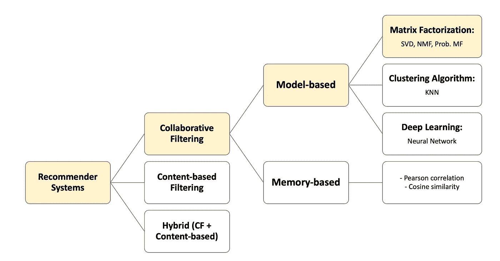

**推荐系统类型** - 作者插图

# 基于矩阵分解的协同过滤

简言之，矩阵分解是一种数学过程，将复杂的矩阵转换为低维空间。在推荐系统中，最流行的矩阵分解技术包括奇异值分解 (SVD)、非负矩阵分解 (NMF) 和概率矩阵分解。

以下是矩阵分解概念如何预测用户-电影评分的示意图

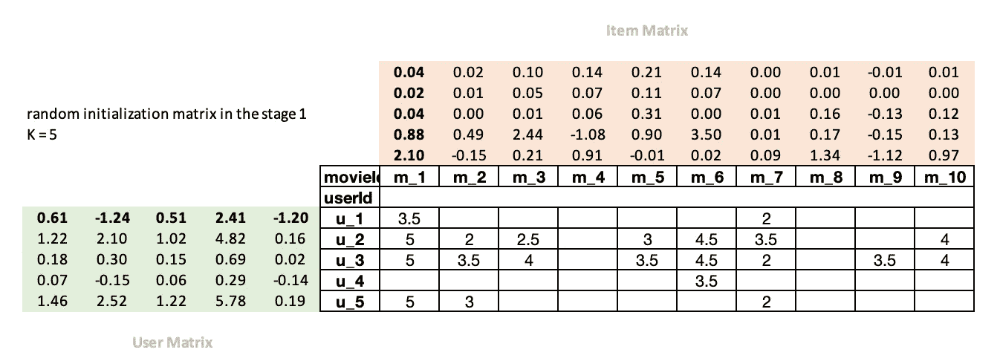

作者插图

**阶段 1：** 矩阵分解会随机初始化数字，并设置因子数量 (K)。在此示例中，我们将 K 设为 5。

+   用户矩阵（绿色框）表示每个用户与特征之间的关联

+   项目矩阵（橙色框）表示每个项目与特征之间的关联

> 在这里，例如，我们创建了 5 个特征 (k=5) 来表示 **m_1** 电影的特性：*喜剧* 为 2.10，*恐怖* 为 0.88，*动作* 为 0.04，家长指南为 0.02，适合家庭观看为 0.04。用户矩阵的情况也是类似的。用户矩阵表示用户的特征，如喜欢的演员或导演、最喜欢的电影制作等。

**阶段 2：** 评分预测是通过 *用户矩阵* 和 *项目矩阵* 的点积计算的。

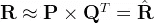

其中 R 为真实评分，P 为用户矩阵，Q 为项目矩阵，结果 R’ 为预测评分。

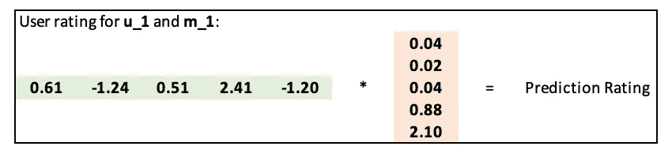

作者插图

在更好的数学符号表示中，**预测评分 R’** 可以在以下方程中表示：

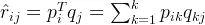

**阶段 3：** 使用平方误差来计算真实评分与预测评分之间的差异

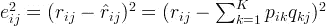

一旦这些步骤到位，我们可以使用随机梯度下降来优化我们的参数。它将计算此值的导数。

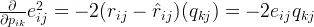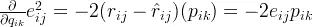

在每次迭代中，优化器将通过使用点积计算每部电影和每个用户之间的匹配，然后将其与用户给出的实际评分进行比较。然后，它将计算此值的导数，并通过将其乘以学习率⍺来更新权重。随着我们多次重复这一过程，损失将得到改善，从而提供更好的推荐。

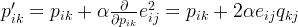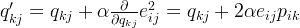

广泛用于推荐系统的矩阵分解模型之一是[奇异值分解](https://en.wikipedia.org/wiki/Singular_value_decomposition)（SVD）。SVD 本身具有广泛的应用，包括图像压缩和信号处理中的噪声减少。此外，SVD 通常用于推荐系统，因为它擅长解决大型用户-项目矩阵中固有的稀疏性问题。

本文还将提供**SVD 实现的概述**，使用 Surprise 包。

所以让我们开始**实现**吧！！

## 实现内容

+   数据导入

+   数据预处理

+   实现#1：从头开始用 Python 实现矩阵分解

+   实现#2：使用 Surprise 包的矩阵分解

完整的矩阵分解实现笔记本可以在[这里](https://github.com/christienatashiaarchie/Recommendation-System-with-Matrix-Factorization/blob/main/Recomender_Systems_Final.ipynb)找到。

# 数据导入

由于我们正在开发一个类似于 Netflix 的推荐系统，但可能没有访问其大数据的权限，我们将使用来自[MovieLens](https://grouplens.org/datasets/movielens/)的优秀数据集进行实践[1]*已获许可*。此外，你可以阅读并查看他们的[README](https://files.grouplens.org/datasets/movielens/ml-latest-small-README.html)文件以了解使用许可和其他细节。该数据集包含数百万部电影、用户和用户过去的互动评分。

提取 zip 文件后，将会提供 4 个 csv 文件，如下所示：

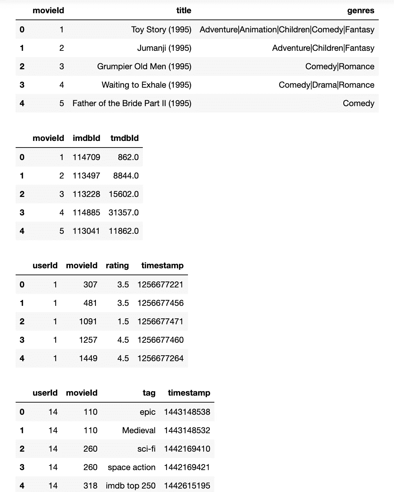

**数据快照** - 作者提供的图片

# 数据预处理

顺便提一下，协同过滤有 *用户冷启动* 的问题。冷启动问题指的是系统或算法无法对没有先前信息的新用户、项目或实体做出准确的预测或推荐。这可能发生在对新用户或项目几乎没有历史数据时，使得系统难以了解他们的偏好或特征。

冷启动问题是推荐系统中的一个常见挑战，系统需要为与用户交互历史有限或没有交互历史的用户提供个性化推荐。

在这个阶段，我们将选择与至少 2000 部电影互动过的用户以及被 1000 用户评分的电影（这可以是减少数据规模和空数据的一种好方法。此外，我的 RAM 无法处理大规模表格）

**我的 RAM 状况** - 来源：KC Green 的 2013 年网页漫画

实际上，你也可以使用 [MovieLens](https://grouplens.org/datasets/movielens/) 提供的 100k 评分的小子集。我只是想尽可能优化我的计算机资源，减少空数据。

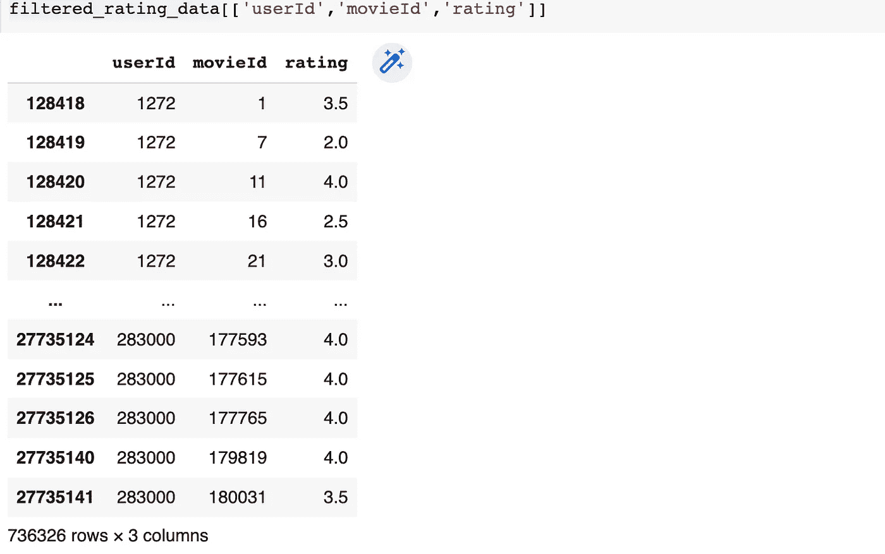

**数据预处理后的输出** - 作者图片

按照惯例，我们将数据分为两组：训练集和测试集——通过使用 train_test_split 方法。

尽管我们需要的信息存在，但它的呈现方式并不利于人类理解。不过，我创建了一个表格，以一种更容易理解的格式呈现相同的数据。

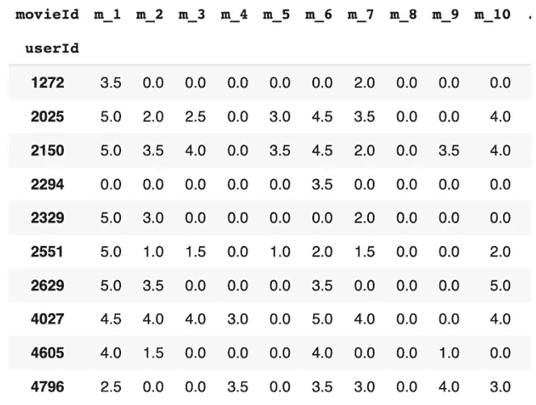

**原始数据** - 作者图片

# **实现 #1：从头开始用 Python 实现矩阵分解**

这里是实现矩阵分解与梯度下降的 Python 代码片段。`matrix_factorization` 函数返回两个矩阵：**nP (用户矩阵)** 和 **nQ (项目矩阵)**。

然后，将训练数据集拟合到模型中，这里我设置了 n_factor K = 5。接下来，可以通过 **使用点积方法将 nP 与 nQ 的转置相乘** 来计算预测，如下代码片段所示。

结果是，矩阵分解产生了最终的预测

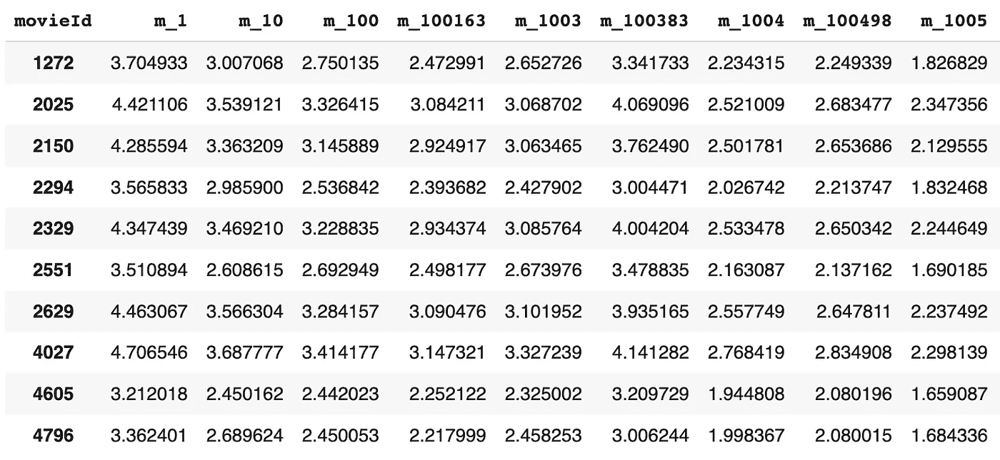

**训练集中的新预测评分** - 作者图片

## **测试集上的预测**

以下代码片段利用给定的 **nP (用户矩阵)** 和 **nQ (电影矩阵)** 对测试集进行预测

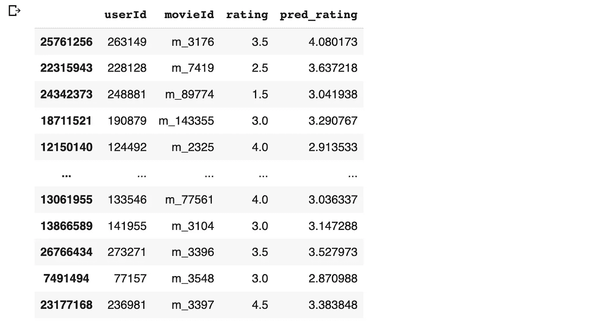

**测试集的评分和预测评分输出** - 作者图片

## 评估预测性能

尽管推荐系统有多种评估指标，如 Precision@K、Recall@K、MAP@K 等，但在这个练习中，我将使用一个基本的准确度指标，即 RMSE。我可能会在后续的文章中更详细地描述其他评估指标。

结果显示，测试集上的 RMSE 为**0.829**，即使在超参数调整之前也相当不错。显然，我们可以调整一些参数，如学习率、n_factor、epochs 步数，以获得更好的结果。

# 实现 #2: 使用 Surprise 包的矩阵分解

在这一部分，我们选择了名为**surprise package**的 Python 库。一个[surprise package](https://surprise.readthedocs.io/en/latest/getting_started.html)是用于构建和评估推荐系统的 Python 库。它提供了一个简单易用的接口，用于加载和处理数据集，以及实现和评估不同的推荐算法。

## **数据导入和模型训练**

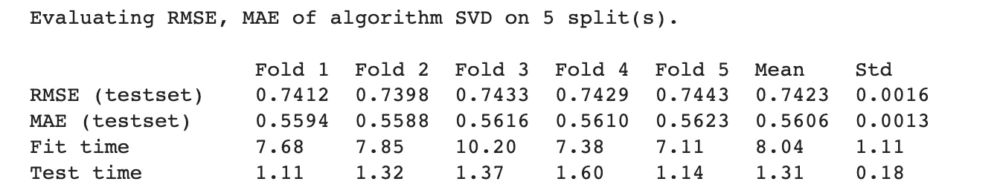

## **Top-N 推荐生成器**

对于 UserId: `231832`，以下是前 10 个电影推荐列表：

*m_912, m_260, m_1198, m_110, m_60069, m_1172, m_919, m_2324, m_1204, m_3095*

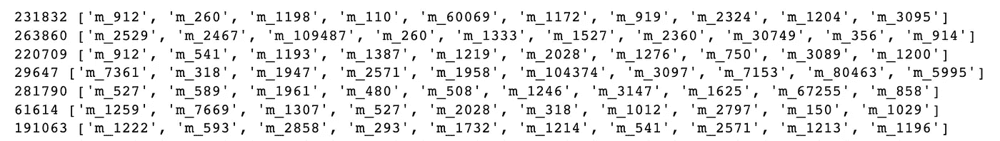

**前 10 推荐结果** - 图片由作者提供

# 总结

在现代娱乐如 Netflix 中使用矩阵分解有助于理解用户偏好。这些信息随后用于向最终用户推荐最相关的项目/产品/电影。

这是我创建的矩阵分解示例的总结，以备将来需要向我的孙子们解释时使用……

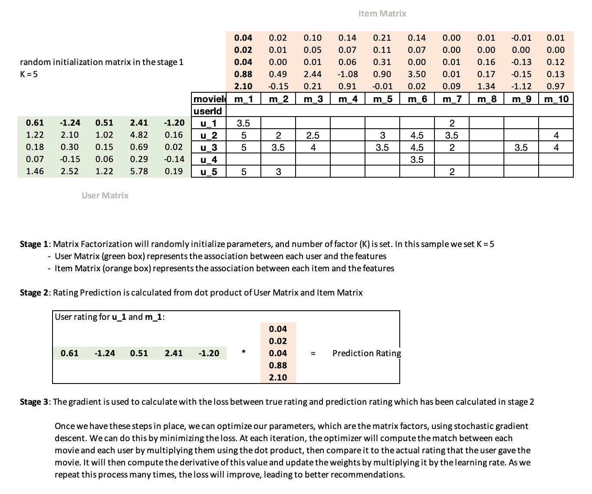

图片由作者提供

# 参考

[1] *Maxwell Harper 和 Joseph A. Konstan. 2015\. The MovieLens Datasets: History and Context. ACM Transactions on Interactive Intelligent Systems (TiiS) 5, 4: 19:1–19:19\.* [*https://doi.org/10.1145/2827872*](https://doi.org/10.1145/2827872)

[## Collaborative Filtering Deep Dive](https://www.kaggle.com/code/jhoward/collaborative-filtering-deep-dive/notebook?source=post_page-----ebc4736869e4--------------------------------)

### 使用 Kaggle Notebooks 探索和运行机器学习代码 | 无附加数据源

[## Recommender Systems in Python 101](https://www.kaggle.com/code/jhoward/collaborative-filtering-deep-dive/notebook?source=post_page-----ebc4736869e4--------------------------------) 

### 使用 Kaggle Notebooks 探索和运行机器学习代码 | 使用来自 CI&T 的文章分享和阅读数据……

[矩阵分解：Python 中的简单教程和实现](https://www.kaggle.com/code/gspmoreira/recommender-systems-in-python-101?source=post_page-----ebc4736869e4--------------------------------) 

### 现在的网络上信息量过大，这点可能无需多言。搜索引擎帮助我们获取…

[www.quuxlabs.com](http://www.quuxlabs.com/blog/2010/09/matrix-factorization-a-simple-tutorial-and-implementation-in-python/?source=post_page-----ebc4736869e4--------------------------------)
