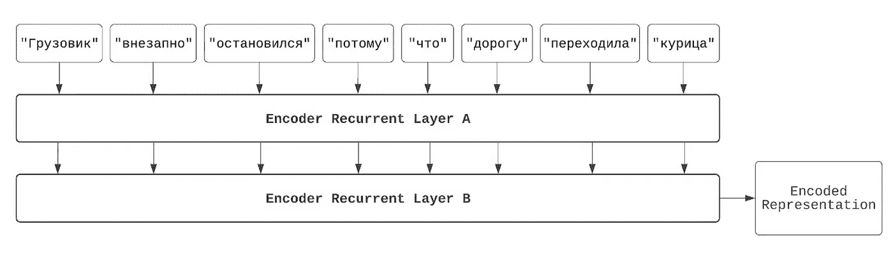

# 从基础到高层次讲解和可视化的递归神经网络

> 原文：[`towardsdatascience.com/recurrent-neural-networks-explained-and-visualized-from-the-ground-up-51c023f2b6fe`](https://towardsdatascience.com/recurrent-neural-networks-explained-and-visualized-from-the-ground-up-51c023f2b6fe)

[Unsplash](https://unsplash.com/photos/rSrK-P0Wips)

## 机器翻译的应用

 [Andre Ye](https://andre-ye.medium.com/?source=post_page-----51c023f2b6fe--------------------------------)

·发表于 [Towards Data Science](https://towardsdatascience.com/?source=post_page-----51c023f2b6fe--------------------------------) ·阅读时间 23 分钟·2023 年 6 月 22 日

--

递归神经网络（RNNs）是可以顺序操作的神经网络。虽然它们不像几年前那样流行，但它们在深度学习的发展中代表了一个重要的进步，并且是前馈网络的自然扩展。

在这篇文章中，我们将涵盖以下内容：

+   从前馈网络到递归网络的过渡

+   多层递归网络

+   长短期记忆网络（LSTM）

+   顺序输出（‘文本输出’）

+   双向性

+   自回归生成

+   机器翻译的应用（对 Google Translate 2016 模型架构的高层次理解）

本文的目的是不仅解释 RNN 的工作原理（已有许多文章对此进行了说明），还通过插图探索其设计选择和高层次直观逻辑。希望这篇文章不仅能为你对这一技术话题的理解提供独特的价值，还能更广泛地提升对深度学习设计灵活性的理解。

[递归神经网络](https://apps.dtic.mil/dtic/tr/fulltext/u2/a164453.pdf)（1985）的设计基于两个观察，即理想模型（如人类阅读文本）如何处理顺序信息：

+   *它应该跟踪“已学习”的信息，以便能够将新信息与之前看到的信息相关联*。为了理解句子“the quick brown fox jumped over the lazy dog”，我需要跟踪词‘quick’和‘brown’，以便后续理解这些词适用于‘fox’。如果我没有在‘短期记忆’中保留这些信息，我将无法理解信息的顺序意义。当我在‘lazy dog’处完成句子时，我会将这个名词与之前遇到的‘quick brown fox’联系起来阅读。

+   *尽管后来的信息总是会在早期信息的背景下被阅读，我们希望以类似的方式处理每一个词（标记），无论它的位置如何*。我们不应该出于某种原因将第三个位置的词系统地转换成与第一个位置的词不同，即使我们可能会根据后者来阅读前者。请注意，之前提出的方法——将所有标记的嵌入并排堆叠并同时呈现给模型——不具备这一特性，因为没有保证第一个词的嵌入与第三个词的嵌入遵循相同的规则。这种通用特性也称为位置不变性。

循环神经网络的核心由循环层组成。一个循环层，像前馈层一样，是一组可学习的数学变换。事实证明，我们可以通过多层感知机来大致理解循环层。

循环层的‘短期记忆’被称为它的*隐藏状态*。这是一个向量——只是一组数字——它传达了网络迄今为止学到的重要信息。然后，对于标准化文本中的每个标记，我们*将新信息融入隐藏状态*。我们使用两个 MLP 来完成这项工作：一个 MLP 转换当前的嵌入，另一个转换当前的隐藏状态。这两个 MLP 的输出相加，形成更新后的隐藏状态，或称为‘更新后的短期记忆’。

然后我们对下一个标记重复这一过程——嵌入被传递到一个 MLP 中，而更新后的隐藏状态被传递到另一个 MLP 中；两个 MLP 的输出相加。这对序列中的每个标记重复：一个 MLP 将输入转换为可以融入短期记忆（隐藏状态）的形式，而另一个准备更新短期记忆（隐藏状态）。这满足了我们的第一个要求——我们希望在旧信息的背景下读取新信息。此外，这两个 MLP*在每个时间步都是相同的*。也就是说，我们使用相同的规则来合并当前隐藏状态与新信息。这满足了我们的第二个要求——我们必须对每个时间步使用相同的规则。

这两种 MLP 通常仅实现为单层深度：也就是说，它们只是一个大的逻辑回归堆栈。例如，下面的图示展示了 MLP A 的架构是如何工作的，假设每个嵌入长度为八个数字，隐藏状态也由八个数字组成。这是一种简单但有效的转换，将嵌入向量映射到适合与隐藏状态合并的向量。

当我们完成将最后一个标记融入隐藏状态后，循环层的任务也就完成了。它生成了一个向量——一个数字列表——代表了通过按顺序读取标记所累积的信息。然后，我们可以将这个向量传递通过第三个 MLP，MLP 学习“当前记忆状态”与预测任务之间的关系（在这个案例中，是股票价格是上涨还是下跌）。

更新权重的机制过于复杂，无法在本书中详细讨论，但其逻辑类似于反向传播算法。额外的复杂性在于追踪每个参数对其自身输出重复作用的累积效应（因此模型具有“递归”特性），这可以通过一种称为“时间反向传播”的修改算法在数学上解决。

递归神经网络是一种相当直观的方法来处理序列数据建模。它是线性回归模型复杂排列的另一种情况，但它非常强大：它允许我们系统地处理如语言这样的困难序列学习问题。

为了方便图示和简洁性，你通常会看到递归层被简单地表示为一个块，而不是作为一个扩展的单元，顺序处理一系列输入。

这是用于文本的最简单的递归神经网络变种：标准化的输入标记被映射到嵌入中，然后输入到循环层；循环层的输出（“最新的记忆状态”）由 MLP 处理，并映射到预测目标。

# 循环网络的复杂变种

循环层使得网络能够处理序列问题。然而，我们当前的递归神经网络模型存在一些问题。为了理解递归神经网络如何在实际应用中用于建模复杂问题，我们需要添加一些附加功能。

其中一个问题是*深度不足*：一个递归层只是简单地遍历一次文本，因此仅获得了内容的表面级、粗略的阅读。考虑哲学家伊曼纽尔·康德的句子“幸福不是理性的理想，而是想象的理想”。要真正理解这句话的深度，我们不能仅仅遍历一次文字。相反，我们需要读过这些文字，然后——这是关键的一步——*我们阅读我们的思考*。我们评估对句子的即时解释是否合理，并可能对其进行修改以使其更有深度。我们甚至可能阅读我们对我们思考的思考。这一切发生得非常快，通常在我们没有意识的情况下，但这是一个使我们能够从文本内容中提取多个层次深度的过程。

相应地，我们可以添加*多个递归层*来增加理解的深度。当第一个递归层获取文本的表面级信息时，第二个递归层则读取第一个递归层的“思考”。然后，将*第二*层的双重信息“最近记忆状态”作为输入传递给最终决策的 MLP。或者，我们可以添加多于两个递归层。

为了具体说明这种堆叠机制如何工作，请参阅下图：我们不仅将每个隐藏状态传递给下一个递归层进行更新，还将该输入状态提供给*下一个*递归层。虽然第一个递归层的第一个输入是嵌入，第一个递归层的*第二*个输入是“第一个递归层对第一个输入的思考”。

几乎所有用于现实世界语言建模问题的递归神经网络都使用递归层的堆栈而不是单个递归层，因为这样可以增加理解深度和语言推理。对于大堆栈的递归层，我们通常使用*递归残差连接*。回忆一下残差连接的概念，其中早期版本的信息被添加到后来的信息版本中。类似地，我们可以在每层的隐藏状态之间放置残差连接，使得各层可以参考不同的“思维深度”。

虽然递归模型在短小简单的句子如“美联储宣布经济衰退”中表现良好，但金融文档和新闻文章通常远比几个词要长。对于较长的序列，标准递归模型会遇到持续的*长期记忆丧失*问题：序列中较早的单词的信号或重要性常常被后面的单词稀释和掩盖。由于每个时间步都会对隐藏状态产生影响，它会部分破坏早期信息。因此，在序列结束时，大部分起始处的信息变得不可恢复。递归模型的关注/记忆窗口很窄。如果我们希望创建一个能够以类似人类的理解和深度来查看和分析文档的模型，我们需要解决这个记忆问题。

[长短期记忆（LSTM）](https://www.bioinf.jku.at/publications/older/2604.pdf)（1997）层是一个更复杂的递归层。其具体机制过于复杂，无法在本书中准确或完全讨论，但我们可以大致理解为试图将“长期记忆”与“短期记忆”分开。两个组件在“读取”序列时都很重要：我们需要长期记忆来追踪跨越时间的大量信息，同时也需要短期记忆来专注于特定的、本地化的信息。因此，LSTM 层不仅存储单一的隐藏状态，还使用“细胞状态”（代表“长期记忆”）。

每一步中，输入与隐藏状态以与标准递归层相同的方式结合。然而，之后会有三个步骤：

1.  *长期记忆清除*。长期记忆是宝贵的；它保存了我们会持久保留的信息。当前的短期记忆状态用于确定长期记忆中哪些部分不再需要，并“剪切”这些部分以腾出空间给新的记忆。

1.  *长期记忆更新*。现在长期记忆中的空间已被清除，短期记忆被用来更新（添加到）长期记忆，从而将新信息记录到长期记忆中。

1.  *短期记忆通知*。此时，长期记忆状态已经根据当前时间步完全更新。因为我们希望长期记忆能够指导短期记忆的功能，长期记忆帮助剪切和修改短期记忆。理想情况下，长期记忆对什么是重要的、什么是不重要的有更大的监督。

因此，短期记忆和长期记忆——请记住，这两者都是数字列表——在每个时间步与彼此及输入进行交互，以一种允许仔细阅读而不会发生灾难性遗忘的方式读取输入序列。这个三步过程在下图中以图形方式描述。`+` 表示信息添加，而 `x` 表示信息移除或清理。（加法和乘法是实现这些思想的数学运算。例如，假设当前隐藏状态的值为 10。如果我将其乘以 0.1，它变成 1——因此，我已经‘减少’了隐藏状态中的信息。）

使用带有残差连接的 LSTM 堆叠，我们可以构建强大的语言理解模型，这些模型能够阅读（如果你愿意，也可以说是‘理解’）段落甚至整篇文章。除了用于金融分析以浏览大量金融和新闻报告外，这些模型还可以用于预测社交媒体帖子和消息中的潜在自杀或恐怖分子，推荐客户可能会购买的新产品（根据他们以前的产品评论），以及检测在线平台上的有毒或骚扰性评论和帖子。

这样的应用迫使我们批判性地思考其材料的哲学意义。政府对检测潜在恐怖分子有强烈的兴趣，而最近大屠杀的枪手往往有令人担忧的公共社交媒体记录——但悲剧在于，他们在海量的互联网信息中未被发现。语言模型，如你所见，纯粹是数学性的：它们试图找到最能建模输入文本和输出文本之间关系的权重和偏置。但在这些权重和偏置有意义的程度上，它们可以以有效且极其迅速的方式‘阅读’信息——比人类读者更快，甚至可能更有效。这些模型可能使政府能够在潜在恐怖分子行动之前检测、追踪和阻止他们。当然，这可能会以隐私为代价。此外，我们已经看到，尽管语言模型能够机械地追踪数据中的模式和关系，但它们实际上只是能够犯错的数学算法。如何调和模型对个体的错误标记为潜在恐怖分子的情况呢？

社交媒体平台在用户和政府的压力下，想要减少在线论坛中的骚扰和有害言论。从概念上看，这可能看似一个简单的任务：将社交媒体评论的语料库标记为有害或无害，然后训练语言模型预测特定文本样本的有害程度。然而，直接的问题是，数字话语因为依赖于迅速变化的参考（如表情包）、内部笑话、隐晦的讽刺以及必需的背景知识而极具挑战性。然而，更有趣的哲学问题是，是否可以且是否应该真正训练一个数学模型（一个‘客观’模型）来预测一个看似‘主观’的目标，如有害言论。毕竟，对一个人来说有害的东西，对另一个人可能并无害。

随着我们进入处理越来越个人化数据的模型——语言是我们沟通和吸收几乎所有知识的媒介——我们发现思考和致力于回答这些问题的重要性不断增加。如果你对这一研究方向感兴趣，你可能需要了解对齐、陪审学习、宪法 AI、RLHF 和价值多元化。

# 神经机器翻译

*概念*：多输出递归模型，双向性，注意力机制

机器翻译是一项令人惊叹的技术：它使得那些以前无法进行有效沟通的个体能够自由对话。一个讲印地语的人可以通过点击‘翻译此页面’按钮阅读用西班牙语写的网站，反之亦然。一个讲英语的人观看俄语电影时，可以启用实时翻译字幕。一个在法国的中国游客可以通过获取菜单的照片翻译来点餐。从非常字面意义上讲，机器翻译将语言和文化融合在一起。

在深度学习兴起之前，机器翻译的主流方法是基于查找表。例如，在中文中，‘I’翻译为‘我’，‘drive’翻译为‘开’，而‘car’翻译为‘车’。因此，‘I drive car’会被逐字翻译为‘我开车’。然而，任何双语者都知道这种系统的缺陷。许多拼写相同的词具有不同的含义。一种语言中的多个词可能在另一种语言中被翻译为一个词。此外，不同的语言有不同的语法结构，因此翻译后的词本身需要重新排列。英语中的冠词在像西班牙语和法语这样的有性别语言中有多种不同的上下文依赖翻译。许多试图通过巧妙的语言解决方案来调和这些问题的方法已经被提出，但其效果仅限于短小简单的句子。

深度学习则为我们提供了构建更深层次理解语言的模型的机会——甚至可能接近人类理解语言的方式——从而更有效地执行翻译这一重要任务。在这一部分，我们将介绍语言深度建模的多个额外想法，并最终深入探索 Google 翻译的工作原理。

# 文本输出递归模型

目前，构建可行的递归模型的最大障碍是无法*输出文本*。之前讨论的递归模型可以‘读取’但不能‘写入’——输出的结果是一个单一的数字（或一组数字，向量）。为了解决这个问题，我们需要赋予语言模型输出整个文本序列的能力。

幸运的是，我们不需要做太多工作。回顾之前介绍的递归层堆叠概念：我们不是仅在递归层处理完整个序列后收集‘记忆状态’，而是在*每个时间步*收集‘记忆状态’。因此，为了输出一个序列，我们可以在每个时间步收集一个记忆状态的输出。然后，我们将每个记忆状态传递给指定的 MLP，它预测给定记忆状态下输出词汇中的哪个词（标记为‘MLP C’）。概率最高的词被选为输出。

为了绝对清楚地了解每个记忆状态是如何转化为输出预测的，请考虑以下图示的进展。

在第一个图中，第一个输出的隐藏状态（这是在层读取了第一个词‘the’后得到的隐藏状态）被传递到 MLP C。MLP C 输出一个*输出词汇的概率分布*；即，它为输出词汇中的每个词提供一个概率，指示该词在该时间点作为翻译被选择的可能性。这是一个前馈网络：我们本质上是在对隐藏状态进行逻辑回归，以确定给定词的可能性。理想情况下，概率最大的词应该是‘les’，因为这是‘the’的法语翻译。

下一个隐藏状态是在递归层读取了‘the’和‘machines’之后得到的，再次传递到 MLP C。这次，概率最高的词应该是‘machine’（这是‘machines’在法语中的复数形式）。

在最后一个时间步中最可能选择的词应该是‘gagnent’，它是‘win’在特定时态中的翻译。模型应该选择‘gagnent’，而不是‘gagner’或其他不同的时态，基于它之前阅读的信息。这就是使用深度学习模型进行翻译的优势所在：能够掌握贯穿整句话的语法规则。

实际上，我们通常希望将多个递归层堆叠在一起，而不仅仅是一个递归层。这允许我们发展多层次的理解，首先是‘理解’输入文本的含义，然后以输出语言重新表达输入文本的‘意义’。

# 双向性

请注意，递归层是顺序进行的。当它读取文本“the machines win”时，它首先读取“the”，然后是“machines”，再是“win”。虽然最后一个词“win”是根据前面的词“the”和“machines”来读取的，但这种反向关系并不成立：第一个词“the”*不是*在*后面*的词“machines”和“win”上下文中读取的。这是一个问题，因为语言通常是为了预期我们将要说的内容而被说出的。在像法语这样的性别语言中，像“the”这样的冠词可以有许多不同的形式——“la”用于阴性物体，“le”用于阳性物体，而“les”用于复数物体。我们不知道要翻译哪个版本的“the”。当然，一旦我们阅读了句子的其余部分——“the machines”——我们就知道对象是复数的，应该使用“les”。这是文本的早期部分受到后期部分影响的一个例子。更一般地说，当我们重新阅读一个句子时——我们常常在不自觉中这样做——我们是在以句子的开始部分为背景来阅读开始部分。尽管语言是按顺序读取的，但它往往需要以‘非顺序’的方式解释（即，不严格从开始到结束的单向顺序）。

为了解决这个问题，我们可以使用*双向性*——这是一种对递归模型的简单修改，使得层能够‘前向’和‘后向’读取。*双向递归层*实际上是两个不同的递归层。一个层向前读取时间，而另一个层向后读取。两个层都读取完成后，它们在每个时间步的输出会被加在一起。

双向性使模型能够以一种方式读取文本，使得过去的内容在未来的上下文中被读取，同时也在过去的上下文中读取未来的内容（递归层的默认功能）。请注意，双向递归层在每个时间步的输出是由整个序列而不仅仅是所有之前的时间步所提供的信息。例如，在一个 10 时间步的序列中，时间步 *t* = 3 是由一个已经读取了序列 [*t* = 0] → [*t* = 1] → [*t* = 2] → [*t* = 3] *以及* 另一个已经读取了序列 [*t* = 9] → [*t* = 8] → [*t* = 7] → [*t* = 6] → [*t* = 5] → [*t* = 4] → [*t* = 3] 的“记忆状态”所提供的信息。

这个简单的修改使得语言理解的深度显著丰富。

# 自回归生成

我们当前的翻译模型工作模型是一个大型（双向）递归层的堆栈。然而，存在一个问题：当我们将一些文本 *A* 翻译成其他文本 *B* 时，我们不仅仅是根据 *A* 来写 *B*，还要根据 *B 自身* 来写 *B*。

我们不能直接将复杂的俄语句子“Грузовик внезапно остановился потому что дорогу переходила курица”翻译成英语“ The truck suddenly stopped because a chicken was crossing the road”，因为直接从俄语逐字翻译会得到“Truck suddenly stopped because road was crossed by chicken”。在俄语中，宾语位于名词之后，但在英语中保留这种形式虽然可读但不流畅，也不是“最佳”的。因此，关键思想是：为了获得易于理解和使用的翻译，我们不仅需要确保翻译忠实于原文，还需要“忠实于自身”（自洽）。

为了实现这一点，我们需要一种不同的文本生成方法，称为 *自回归生成*。这使得模型能够不仅根据原始文本，还根据模型已经翻译过的内容来翻译每个单词。自回归生成不仅是神经翻译模型的主流范式，也是各种现代文本生成模型，包括高级聊天机器人和内容生成器的主流。

我们从一个“编码器”模型开始。在这种情况下，编码器模型可以表示为一个递归层的堆栈。编码器读取输入序列并生成一个输出，即编码后的表示。这一串数字表示输入文本序列的“本质”以定量形式呈现——如果你愿意，可以称其为“普遍/真实意义”。编码器的目标是将输入序列提炼成这个基本的意义包。

一旦获得了这个编码表示，我们就开始*解码*的任务。解码器的结构与编码器类似——我们可以将其视为另一个接受序列并生成输出的递归层堆栈。在这种情况下，解码器接受编码表示（即编码器的输出）*和*一个特殊的‘开始标记’（表示为</s>）。开始标记表示句子的开头。解码器的任务是预测给定句子中的下一个词；在这种情况下，它给定了一个‘零词句子’，因此必须预测第一个词。在这种情况下，没有以前的翻译内容，因此解码器完全依赖于编码表示：它预测第一个词‘The’。

接下来是关键的自回归步骤：我们将解码器的先前输出重新输入到解码器中。现在我们有了一个‘单词句子’（开始标记后跟词‘The’）。两个标记都被传入解码器，以及编码表示——和之前一样，由编码器输出——现在解码器预测下一个词“truck”。

这个标记随后被视作另一个输入。在这里，我们可以更清楚地意识到为什么自回归生成是文本生成的一个有用算法框架：给定当前工作的句子是“The truck”，这限制了我们如何完成它。在这种情况下，下一个词很可能是动词或副词，这是我们作为语法结构“知道”的。另一方面，如果解码器仅能访问原始俄语文本，它将无法有效地限制可能性的集合。在这种情况下，解码器能够参考先前翻译的内容和原始俄语句子的含义，从而正确预测下一个词为“突然”。

这个自回归生成过程继续进行：

最后，为了结束一个句子，解码器模型预测一个指定的‘结束标记’（表示为</e>）。在这种情况下，解码器将‘匹配’当前翻译句子与编码表示，以确定翻译是否令人满意并停止句子生成过程。

# 2016 Google Translate

到现在为止，我们已经覆盖了很多内容。现在，我们掌握了开发对 Google 翻译模型的较全面理解所需的大部分要素。我不需要多说这种模型的重要性：即使粗略，一个准确且易于使用的神经机器翻译系统也能打破许多语言障碍。对我们来说，这个特定的模型有助于将我们讨论的许多概念统一到一个连贯的应用中。

这些信息摘自 2016 年的[Google 神经机器翻译论文](https://arxiv.org/abs/1609.08144)，该论文介绍了 Google 的深度学习机器翻译系统。尽管在这些年里使用的模型几乎肯定已经发生了变化，但该系统仍然为神经机器翻译系统提供了有趣的案例研究。为了清楚起见，我们将该系统称为“Google 翻译”，并承认它可能不是最新的。

Google 翻译使用了编码器-解码器自回归模型。也就是说，该模型由*编码器组件*和*解码器组件*组成；解码器是自回归的（回顾前述：它在接受其他信息的同时，还接受之前生成的输出作为输入，这里是编码器的输出）。

编码器是由*七层*长短期记忆（LSTM）层组成的堆叠。第一层是双向的（因此技术上有 8 层，因为双向层“算作两个”），这使得它能够捕捉输入文本中双向的重要模式（底部图像，左侧）。此外，该架构在每一层之间采用了*残差连接*（底部图像，右侧）。回顾之前的讨论，残差连接在递归神经网络中可以通过将输入添加到递归层的输出上来实现，从而使递归层学习到对输入施加的最佳差异。

解码器也是由八层 LSTM 组成的堆叠。它以自回归的方式接收之前生成的序列，从开始标记`</s>`开始。然而，Google 神经机器翻译架构使用了自回归生成*和*注意力机制。

注意力分数是为每个原始文本单词计算的（由编码器中的隐藏状态表示，编码器迭代地转换文本但仍保持位置表示）。我们可以把注意力看作是解码器和编码器之间的对话。解码器说：“我已经生成了[sentence]，我想预测下一个翻译词。原始句子中的哪些词与下一个翻译词最相关？”编码器回答：“让我看看你在想什么，我会将其与我对原始输入中每个词的了解进行匹配……啊，你应该关注[word A]，但不要过多关注[word B]和[word C]，它们与预测下一个特定词的关系较小。”解码器感谢编码器：“我会考虑这些信息来确定如何生成，以便确实关注[word A]。”关于注意力的信息被发送到每个 LSTM 层，使得这种注意力信息在生成的所有层级中都可知。

这代表了谷歌神经机器翻译系统的主要部分。该模型在一个大型翻译任务数据集上进行训练：给定英文输入，预测西班牙文输出。模型学习读取的最佳方式（即编码器中的参数）、关注输入的最佳方式（即注意力计算）以及将关注的输入与西班牙文输出关联的最佳方式（即解码器中的参数）。

后续工作扩展了神经机器翻译系统的多语言能力，在这种能力下，一个模型可以用于在多个语言对之间进行翻译。这不仅从实际角度来看是必要的——为每对语言训练和存储一个模型是不可行的——而且也已显示出能改善任何两对语言之间的翻译。此外，GNMT 论文提供了训练的细节——这是一个受硬件限制的非常深的架构——以及实际部署——大型模型不仅训练慢，预测也慢，但谷歌翻译用户不希望等待超过几秒钟来翻译文本。

虽然 GNMT 系统确实是计算语言理解的一个里程碑，但仅仅几年后，一种在某些方面极简化的新方法将彻底改变语言建模——并完全摆脱曾经常见的递归层，我们曾如此费力地去理解。请关注关于 Transformers 的第二篇文章！

## 感谢阅读！

在这篇文章中，我们对递归神经网络进行了深入的调查：它们的设计逻辑、更多复杂特性和应用。

一些关键点：

+   RNN（循环神经网络）是前馈网络的自然扩展，可以用于机器翻译。RNN 旨在跟踪迄今为止学习到的信息，并将新信息与先前见过的信息相关联，类似于人类处理顺序信息的方式。

+   RNN 使用递归层，其中隐藏状态代表短期记忆。

+   可以堆叠递归层，以增加网络对理解和推理的深度。

+   长短期记忆（LSTM）网络是更复杂的递归层类型，它将长期记忆与短期记忆分开。LSTM 具有清除、更新和通知长期记忆和短期记忆的机制。

+   RNN 在金融分析、社交媒体分析、推荐系统和语言翻译等多个领域都有应用。

+   RNN 在现实世界应用中的使用引发了关于隐私、模型错误以及在标记有毒或有害内容时的主观性等哲学和伦理问题。

+   神经机器翻译是 RNN 的一个强大应用，它使不同语言之间的翻译成为可能，促进了沟通和文化交流。

*所有照片由作者提供。*
