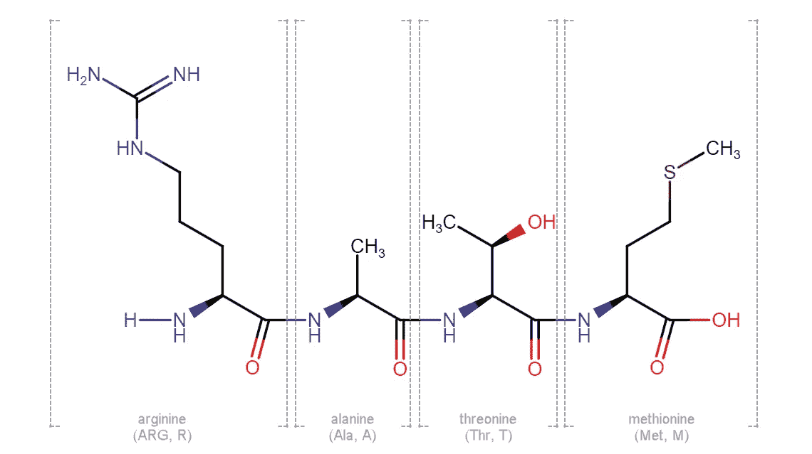
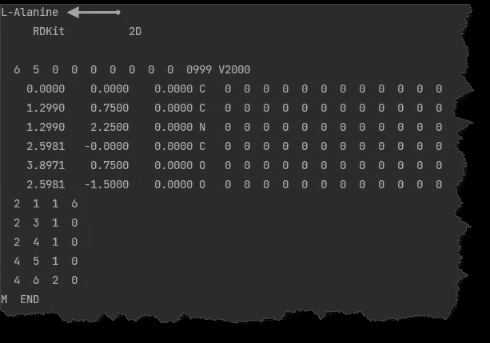
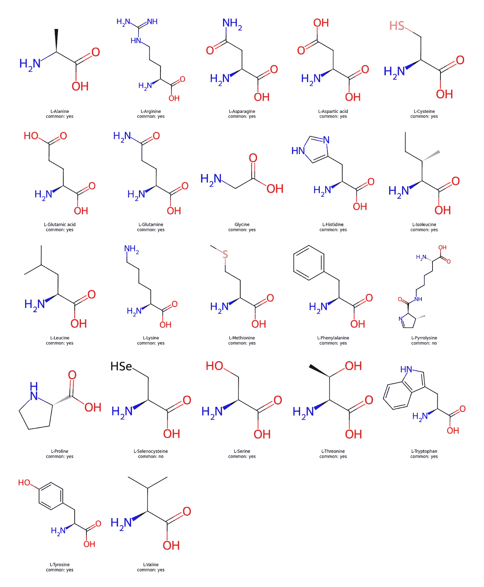
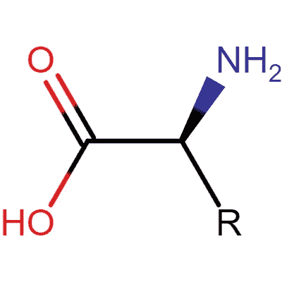
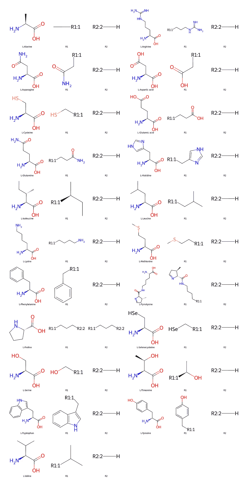
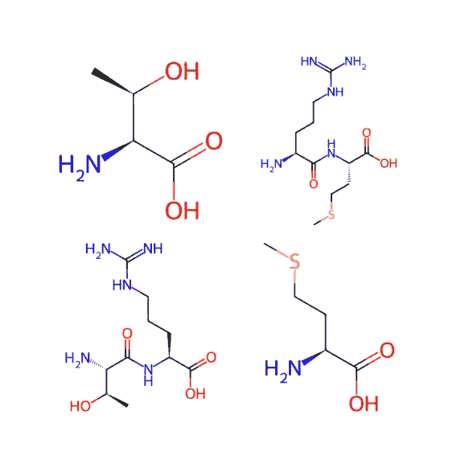
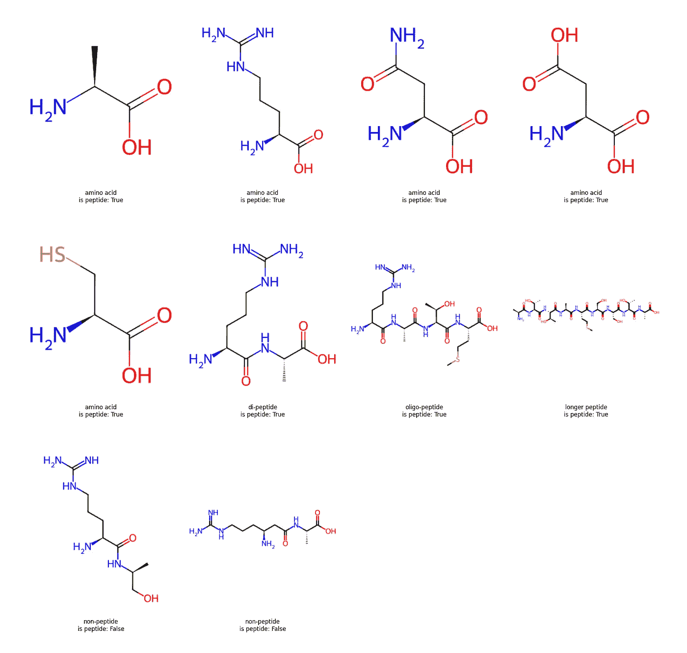

# 递归化学反应

> 原文：[`towardsdatascience.com/recursive-chemical-reactions-how-to-algorithmicallyanalyze-chemical-structures-c6a0fab95fa0?source=collection_archive---------11-----------------------#2023-03-07`](https://towardsdatascience.com/recursive-chemical-reactions-how-to-algorithmicallyanalyze-chemical-structures-c6a0fab95fa0?source=collection_archive---------11-----------------------#2023-03-07)

## 使用 RDKit 对化学结构进行算法分析

[](https://medium.com/@cretanpan?source=post_page-----c6a0fab95fa0--------------------------------)[](https://towardsdatascience.com/?source=post_page-----c6a0fab95fa0--------------------------------) [Pan Cretan](https://medium.com/@cretanpan?source=post_page-----c6a0fab95fa0--------------------------------)

·

[关注](https://medium.com/m/signin?actionUrl=https%3A%2F%2Fmedium.com%2F_%2Fsubscribe%2Fuser%2Fff990ba57425&operation=register&redirect=https%3A%2F%2Ftowardsdatascience.com%2Frecursive-chemical-reactions-how-to-algorithmicallyanalyze-chemical-structures-c6a0fab95fa0&user=Pan+Cretan&userId=ff990ba57425&source=post_page-ff990ba57425----c6a0fab95fa0---------------------post_header-----------) 发表在[Towards Data Science](https://towardsdatascience.com/?source=post_page-----c6a0fab95fa0--------------------------------) ·8 分钟阅读·2023 年 3 月 7 日[](https://medium.com/m/signin?actionUrl=https%3A%2F%2Fmedium.com%2F_%2Fvote%2Ftowards-data-science%2Fc6a0fab95fa0&operation=register&redirect=https%3A%2F%2Ftowardsdatascience.com%2Frecursive-chemical-reactions-how-to-algorithmicallyanalyze-chemical-structures-c6a0fab95fa0&user=Pan+Cretan&userId=ff990ba57425&source=-----c6a0fab95fa0---------------------clap_footer-----------)

--

[](https://medium.com/m/signin?actionUrl=https%3A%2F%2Fmedium.com%2F_%2Fbookmark%2Fp%2Fc6a0fab95fa0&operation=register&redirect=https%3A%2F%2Ftowardsdatascience.com%2Frecursive-chemical-reactions-how-to-algorithmicallyanalyze-chemical-structures-c6a0fab95fa0&source=-----c6a0fab95fa0---------------------bookmark_footer-----------)

图片来源于[Manuel Darío Fuentes Hernández](https://pixabay.com/users/drfuenteshernandez-7757554/?utm_source=link-attribution&amp%3Butm_medium=referral&amp%3Butm_campaign=image&amp%3Butm_content=4897327)来自[Pixabay](https://pixabay.com)

[RDKit](https://www.rdkit.org/docs/Overview.html) 是一个用 C++ 编写的开源化学信息学工具包，也可以在 Java、Python 和 [KNIME](https://www.knime.com/rdkit) 中使用。它提供了广泛的化学信息学功能，例如读取和写入分子、处理原子、键和环、生成 2D 或 3D 坐标、搜索子结构、应用化学转换以及计算指纹和描述符。RDKit 还为 PostgreSQL 提供了高性能的 [cartridge](https://www.rdkit.org/docs/Cartridge.html) 数据库。RDKit 理解 [SMARTS](https://www.daylight.com/dayhtml/doc/theory/theory.smarts.html) 语言（用于描述分子模式），以及 SMIRKS 语言（用于应用反应转换），这两者都以 SMILES 为基础，SMILES 是用于输入和表示分子及反应的著名线性符号。

RDKit 可以应用反应转换，并结合 Python 的递归功能，支持如本文所述的特殊用例。特别是，我们将递归地应用化学反应，以检查输入的分子结构是否为肽，即氨基酸的线性序列。我发现递归应用反应是算法分析化学结构的一个好方法，例如，通过反复分割结构、去除定义明确的片段并分类剩余基团，当不再能应用更多的转换时。

· 介绍

· 构建模块：氨基酸

· 识别肽键

· 打破肽键

· 结论

# 介绍

下图是一个由四个氨基酸组成的线性寡肽，即精氨酸、丙氨酸、苏氨酸和蛋氨酸，最近在我分析的数据集中发现。我从事工业化学工作，看到我们的数据库中有这样的结构感到惊讶，因为我们与生物分子无关，肽也不常见。进一步挖掘发现，我们通过将化学名称解释为化学名称到结构的算法错误地生成了这些结构。除了全名，氨基酸还可以用一个或三个字符表示，这些字符有时出现在文本中，并被错误地解释为化学结构。这种数据质量问题可能会影响公开可用的数据集，因此我认为找到检测这些情况并在其意外出现时加以消除的方法可能会很有用。



一小段含有四个氨基酸的肽。图像来源：作者。

解决这个问题有很多方法，我认为所有线性肽序列都可以通过复杂的 SMARTS 查询来匹配。开发这个方法对我来说似乎很具有挑战性，因此我认为通过将问题拆分成更小的问题来解决可能更为可行。在化学术语中，这意味着我们需要通过逐一水解肽键，将初始分子分解成更小的片段，直到没有更多的键可以断裂。如果所有获得的片段都是氨基酸，那么起始结构必须是肽。这样做还可以确定精确的氨基酸序列。我们需要的是一种递归应用化学反应的方法。如果你有兴趣了解如何使用 RDKit 实现这一点，并在过程中发现这个丰富的化学信息学库的一些功能，请继续阅读。

本文的代码可以在我的 GitHub 博客 [仓库](https://github.com/karpanGit/myBlogs/tree/master/RecursiveChemicalReactions) 中找到。我们将使用 RDKit 版本 2022.9.4 和 Python 3.9.13。该仓库还包括了提供的要求 [文件](https://github.com/karpanGit/myBlogs/blob/4dcc6f3b3a983b9be4b75fd97737ba44f2a42b5a/RecursiveChemicalReactions/requirements.txt) 中的所有依赖项。

# 基础单元：氨基酸

组成蛋白质的氨基酸共有 20 种。此外，还有两种额外的氨基酸，这些氨基酸在某些物种中由通常解释为终止密码子的密码子编码。所有这些都是α-氨基酸，即氨基直接连接到α-碳上，即连接到羧基的碳原子。为了方便起见，我为这 22 种氨基酸创建了 SMILES，这些 SMILES 可以在 [仓库](https://github.com/karpanGit/myBlogs/blob/4dcc6f3b3a983b9be4b75fd97737ba44f2a42b5a/RecursiveChemicalReactions/input/amino_acids.smiles) 中找到。

第一步是读取 22 种氨基酸，并同时导入所有必要的 RDKit 模块。

在倒数第二行中，微笑表情被转换为本地的 RDKit Mol [对象](https://www.rdkit.org/docs/source/rdkit.Chem.rdchem.html#rdkit.Chem.rdchem.Mol)。最后一行可能看起来有些神秘，但它的作用只是将氨基酸名称包含在分子中，具体可以通过

```py
print(Chem.MolToMolBlock(amino_acids['mol'].iloc[0]))
```

打印出来



L-丙氨酸 [Mol](https://docs.chemaxon.com/display/docs/mdl-molfiles-rgfiles-sdfiles-rxnfiles-rdfiles-formats.md#src-1806565-safe-id-turmtu9mzmlszxmsukdmawxlcyxtrgzpbgvzlfj4bmzpbgvzlfjezmlszxnmb3jtyxrzlw1vbe1ptfyymdawzmlszxm) 块，其中包含了化学名称。图片由作者提供。

氨基酸可以使用 [matplotlib](https://matplotlib.org/stable) 在定制的网格中进行可视化，如下所示。

最后一行将下方的图像保存为 PNG 文件，你可以在仓库中找到这个文件以及本文中所有其他 [图像](https://github.com/karpanGit/myBlogs/tree/master/RecursiveChemicalReactions/images)。



出现在遗传密码中的 22 种氨基酸。图片来源于作者。

RDKit 可以无缝地在 jupyter notebooks 中使用，其中 Draw 模块允许通过`Draw.MolsToGridImage()` [函数](https://www.rdkit.org/docs/source/rdkit.Chem.Draw.html)轻松可视化分子结构。但我发现使用 matplotlib 可以提供更多灵活性，特别是如果遵循这些出色的 [建议](https://medium.com/towards-data-science/advanced-tutorial-how-to-master-matplotlib-like-an-absolute-boss-aae2d4936734) 来调整图表组件。所有氨基酸共享以下对映体骨架。



α氨基酸骨架。图片来源于作者。

在这一阶段，我们可以引入一个有用的 RDKit 功能，即所谓的 [R 基团分解](https://greglandrum.github.io/rdkit-blog/posts/2023-01-09-rgd-tutorial.html)。在下面的代码中，我们定义了氨基酸骨架核心，其 smiles 为 [*:1]C@HC(O)=O，具有两个明确的 R 基团标签。使用两个 R 基团标签的原因是 L-脯氨酸中的呋喃环。通过明确设置 R 基团分解，我们将其约束为仅匹配明确指定的 R 基团。

其余的代码创建了必要的输入数组，包含分子和图例，用于生成图像，使用的是与之前相同的实用函数。如果你仔细观察，你会注意到甘氨酸未能被分解为 R 基团。原因是它不是手性分子，而用于分解的核心结构是手性的。如果我们从核心中移除手性中心，甘氨酸的分解会成功，但 R 基团分解会失去一些特异性，这可能是不希望的。



氨基酸 R 基团分解。图片来源于作者。

R 基团分解在氨基酸骨架需要进一步处理的情况下很有用。本文不再对此深入探讨。

# 识别肽键

在我们尝试断裂肽键之前，我们可以检查是否能够识别这些肽键。我们使用一个由苏氨酸、蛋氨酸和精氨酸形成的线性三肽作为例子。肽键被定义为一种结构模式，用来定位原始分子中的匹配原子和键。

这产生了下面的图像。


苏氨酸、精氨酸、蛋氨酸三肽，突出显示了两个肽键。图片来源于作者。

使用 `rdkit.Chem.Draw.rdMolDraw2D`，肽键被很好地定向。子结构搜索返回了一个原子索引的元组，其中的元组被展平，并用于在展平列表中找到所有原子对之间的键索引。在分子结构被保存为 PNG 图像之前，使用浅灰色突出显示了肽链中原子和键的索引。这里的关键消息是，通过使用 RDKit，可以控制到原子和键的级别，这些原子和键实质上形成了适合任何想象中的算法的图形。

# 打破肽键

打破肽键需要使用 SMIRKS 定义一个反应。之前定义的肽模式用于子结构匹配，成为 SMIRKS 反应的反应物部分。产品只是水解产物，其中两个氨基酸使用点符号分隔。苏氨酸、精氨酸、蛋氨酸三肽有两个肽键，因此可以应用两次反应，导致两个反应结果，这两个结果都包括一个氨基酸和一个二肽。

上述代码生成了一个 PNG 图像，其中包含两行的两个反应可能性。



苏氨酸、精氨酸、蛋氨酸三肽的水解。图片由作者提供。

如果我们想将一个肽完全分解成其组成的氨基酸，我们需要反复应用反应，直到不能再打破更多肽键。在每个阶段不必列举所有可能的反应。我们可以简单地应用一次反应，然后分别对两个反应物进行水解。RDKit 允许通过将 `maxProducts` [参数](https://www.rdkit.org/docs/source/rdkit.Chem.rdChemReactions.html#rdkit.Chem.rdChemReactions.ChemicalReaction.RunReactants) 设置为 1 来控制产品数量。什么使得起始结构成为肽？如果在应用所有可能的肽水解反应后我们只产生了一种或多种已知的氨基酸，那么起始结构就是一个肽。相反，如果在某个时点无法应用任何肽水解反应，并且结构不是已知氨基酸之一，那么起始结构就不是肽。

上述代码使用了两个实用函数，一个用于检查两个结构是否通过彼此为子结构的方式在化学上等效，另一个用于检查结构是否可以在结构列表中找到。[递归](https://realpython.com/python-recursion/)肽键水解在第三个也是最后一个函数中实现。

使用这个递归函数，我们检查一组九个示例分子是否是肽。

该算法正确地将前 8 个结构分类为肽，将最后两个分类为非肽。值得注意的是，我们使用了氨基酸本身就是一个肽的约定，这严格来说可能并不准确，但这对于应用递归来说是方便的。



通过递归水解检查结构是否为肽。图像由作者提供。

通过将反应物结果添加到图中，可以增强算法，例如使用[NetworkX](https://networkx.org/)并通过在每个节点上绘制结构来可视化反应进程。叶子节点将是可以进一步分析的氨基酸，以获取肽中氨基酸的确切序列。可能性无穷无尽；RDKit 已经完成了它的部分工作，然后可以依赖 Python 的表现力完成其余部分。

# 结论

RDKit 是一个丰富的化学信息学库。现在可以通过 pip 轻松部署，并打开了在化学应用中使用 Python 及其数据分析和数据科学生态系统的可能性。RDKit 的[文档](https://www.rdkit.org/docs/GettingStartedInPython.html)虽说并非最好，但现在有很多教程和[博客](https://greglandrum.github.io/rdkit-blog/)可以参考。该库不断发展，新增了许多功能。希望这篇文章对展示 RDKit 的一些功能和潜力有所帮助。
