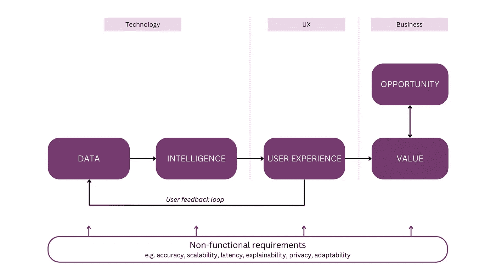
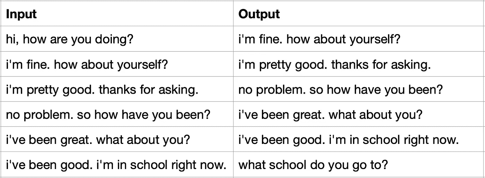
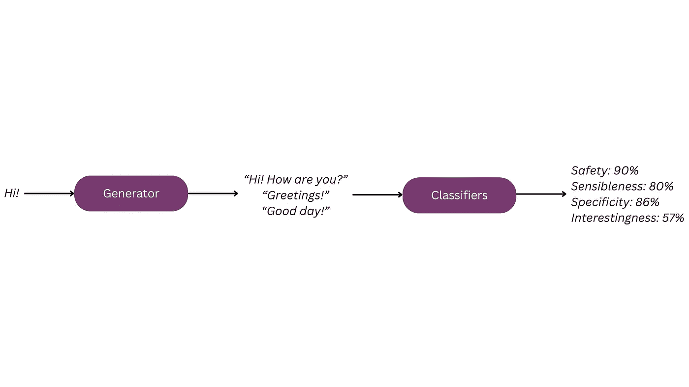
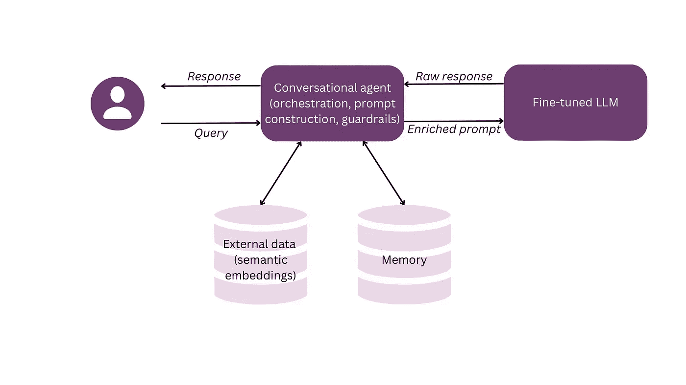
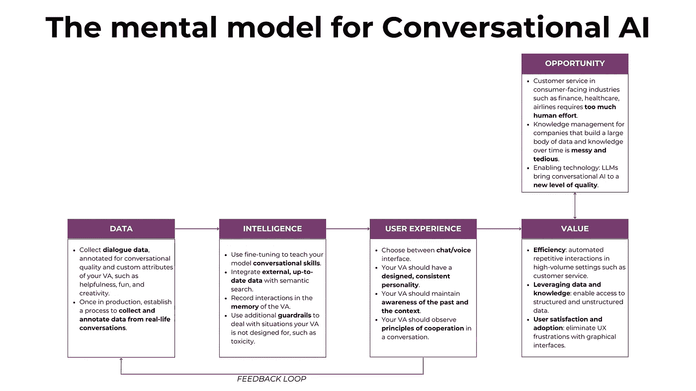

# 通过大型语言模型重新定义对话式人工智能

> 原文：[`towardsdatascience.com/redefining-conversational-ai-with-large-language-models-1ded152c3398?source=collection_archive---------1-----------------------#2023-09-28`](https://towardsdatascience.com/redefining-conversational-ai-with-large-language-models-1ded152c3398?source=collection_archive---------1-----------------------#2023-09-28)

## 实现对话式人工智能以提供统一用户体验的指南

 [Dr. Janna Lipenkova](https://medium.com/@janna.lipenkova_52659?source=post_page-----1ded152c3398--------------------------------)

·

[关注](https://medium.com/m/signin?actionUrl=https%3A%2F%2Fmedium.com%2F_%2Fsubscribe%2Fuser%2Ff215f8e427a2&operation=register&redirect=https%3A%2F%2Ftowardsdatascience.com%2Fredefining-conversational-ai-with-large-language-models-1ded152c3398&user=Dr.+Janna+Lipenkova&userId=f215f8e427a2&source=post_page-f215f8e427a2----1ded152c3398---------------------post_header-----------) 发表在 [Towards Data Science](https://towardsdatascience.com/?source=post_page-----1ded152c3398--------------------------------) · 21 分钟阅读 · 2023 年 9 月 28 日 

--

来源: [rawpixel.com](https://www.rawpixel.com/image/7665902/robert-delaunay-rythme-joie-vivre)

对话式人工智能是大型语言模型（LLMs）的一种应用，因其在多个行业和用例中的可扩展性而引发了大量关注。尽管对话式系统已经存在了几十年，但 LLMs 带来了大规模应用所需的质量提升。在本文中，我们将使用图 1 所示的心理模型来剖析对话式人工智能应用（参见 [**用整体心理模型构建 AI 产品**](https://medium.com/towards-data-science/building-ai-products-with-a-holistic-mental-model-33f8729e3ad9)以了解心理模型）。在考虑了对话式人工智能系统的市场机会和商业价值之后，我们将解释需要设置的额外“机制”，包括数据、LLM 微调和对话设计，以使对话不仅成为可能，而且有用和愉悦。

图 1：AI 系统的心理模型（参见 [**用整体心理模型构建 AI 产品**](https://medium.com/towards-data-science/building-ai-products-with-a-holistic-mental-model-33f8729e3ad9)**)**

# 1\. 机会、价值和局限

传统的用户体验（UX）设计围绕着大量的人工 UX 元素、滑动、点击和触碰展开，这要求每个新应用都有一个学习曲线。通过使用对话式人工智能，我们可以摆脱这些繁琐的操作，代之以自然流畅对话的优雅体验，这样我们可以忘记不同应用、窗口和设备之间的过渡。我们使用语言——我们通用且熟悉的沟通协议——与不同的虚拟助手（VAs）互动并完成任务。

对话式用户界面（UI）并不是全新的热门事物。交互式语音响应系统（IVRs）和聊天机器人自 1990 年代以来就已经存在，而自然语言处理（NLP）的重大进展也一直伴随着语音和聊天界面的希望和发展浪潮。然而，在大型语言模型（LLMs）出现之前，大多数系统都是以符号范式实现的，依赖于规则、关键字和对话模式。它们还局限于特定的、预定义的“能力”领域，用户如果超出这些领域很快就会陷入困境。总的来说，这些系统充满了潜在的失败点，在经历了几次令人沮丧的尝试后，许多用户再也没有回到这些系统中。下图展示了一个对话示例。一个希望为特定音乐会订票的用户耐心地经过了一系列详细的询问流程，结果在最后发现音乐会已经售罄。

图 2：糟糕对话流程的示例

作为一种赋能技术，LLMs 可以将对话界面提升到新的质量和用户满意度水平。对话系统现在能够展示更广泛的世界知识、语言能力和对话能力。利用预训练模型，它们也可以在更短的时间内开发完成，因为编写规则、关键词和对话流程的繁琐工作现在被 LLM 的统计知识所取代。让我们来看看两个对话式 AI 可以大规模提供价值的突出的应用场景：

+   **客户支持**，更一般来说，是那些由大量用户使用的应用，这些用户经常提出类似的请求。在这里，提供客户支持的公司在信息上相对于用户具有明显的优势，可以利用这一点创造出更直观和愉悦的用户体验。以重新预订航班为例。对于我这样一个经常乘坐飞机的人来说，这是一年中会发生 1 到 2 次的事情。在这段时间内，我往往会忘记过程的细节，更不用说特定航空公司的用户界面了。相比之下，航空公司的客户支持将重新预订请求置于其操作的核心。与其通过复杂的图形界面展示重新预订过程，不如将其逻辑“隐藏”在联系支持的客户面前，他们可以使用自然语言作为通道来完成重新预订。当然，仍然会有一些较少见的请求。例如，想象一下一个突发的情绪波动使得一位商务客户决定将她心爱的狗作为超额行李添加到已预订的航班中。这些更具个性化的请求可以交给人工客服处理，或通过连接到虚拟助手的内部知识管理系统来解决。

+   **知识管理**依赖于大量的数据。对于许多现代公司而言，他们在运营、迭代和学习过程中积累的内部知识是一项核心资产和差异化因素——前提是这些知识以高效的方式存储、管理和访问。虽然公司拥有隐藏在协作工具、内部维基、知识库等中的大量数据，但他们常常未能将其转化为可操作的知识。随着员工离职、新员工加入，以及你永远无法完成三个月前开始的文档页面，有价值的知识会受到熵的影响。找到内部数据迷宫中的出路并获取特定业务情境所需的信息变得越来越困难。这导致了知识工作者的巨大效率损失。为了解决这个问题，我们可以通过在内部数据源上增强 LLM 的语义搜索功能来应对。LLM 允许使用自然语言问题而不是复杂的正式查询来对数据库进行提问。这样，用户可以专注于他们的信息需求，而不是知识库的结构或查询语言（如 SQL）的语法。由于这些系统是基于文本的，它们在丰富的语义空间中处理数据，在“幕后”进行有意义的连接。

除了这些主要的应用领域，还有许多其他应用，例如远程医疗、心理健康助手和教育聊天机器人，它们可以以更快、更高效的方式优化用户体验并为用户带来价值。

# 2\. 数据

大型语言模型（LLMs）最初并不是为了进行流畅的小谈话或更深入的对话而训练的。相反，它们在每一步推理中学习生成下一个标记，最终形成连贯的文本。这种低级别的目标与人类对话的挑战不同。对人类来说，对话非常直观，但当你想教会机器做到这一点时，它就变得极其复杂和微妙。例如，让我们来看一下意图的基本概念。当我们使用语言时，我们是为了特定的目的，这就是我们的沟通意图——可能是传达信息、社交或要求别人做某事。前两种目的对 LLM 来说相对直接（只要它在数据中见过所需的信息），而后者则更具挑战性。LLM 不仅需要以连贯的方式组合和组织相关信息，还需要在正式性、创造力、幽默感等软性标准方面设定正确的情感基调。这是对话设计（参见第五部分）的挑战，与创建微调数据的任务紧密相关。

从传统语言生成转向识别和响应特定的交流意图是提升对话系统可用性和接受度的重要步骤。与所有微调工作一样，这从编制适当的数据集开始。

微调数据应尽可能接近（未来的）实际数据分布。首先，它应该是对话（对话）数据。其次，如果你的虚拟助手将专注于特定领域，你应该尝试组装反映必要领域知识的微调数据。第三，如果你的应用程序中有典型的流程和请求会频繁出现，例如客户支持中的情况，请尽量将这些的多样化示例纳入你的训练数据中。下表显示了来自[**3K Conversations Dataset for ChatBot**](https://www.kaggle.com/datasets/kreeshrajani/3k-conversations-dataset-for-chatbot)的对话微调数据示例，该数据集在 Kaggle 上免费提供：

表 1：来自[**3K Conversations Dataset for ChatBot**](https://www.kaggle.com/datasets/kreeshrajani/3k-conversations-dataset-for-chatbot)的对话微调数据示例

手动创建对话数据可能是一项昂贵的工作——众包和使用 LLMs 来帮助生成数据是扩展的两种方式。一旦对话数据收集完成，就需要对对话进行评估和注释。这使你能够向模型展示正面和负面的示例，并推动其捕捉到“正确”对话的特征。评估可以通过绝对分数或不同选项之间的排名来进行。后一种方法能够提供更准确的微调数据，因为人类通常更擅长对多个选项进行排名，而不是单独评估它们。

在数据就绪后，你可以对模型进行微调，并为其增添额外的功能。在下一节中，我们将探讨微调、从记忆和语义搜索中集成额外信息，以及将代理连接到你的对话系统以使其能够执行特定任务。

# 3\. 组装对话系统

一个典型的对话系统由一个协调和组织系统组件和能力的对话代理构建，例如 LLM、内存和外部数据源。对话 AI 系统的开发是一个高度实验性和经验性的任务，你的开发人员将不断在优化数据、改进微调策略、尝试额外组件和增强功能以及测试结果之间反复进行。非技术团队成员，包括产品经理和用户体验设计师，也将持续测试产品。根据他们的客户发现活动，他们能够很好地预测未来用户的对话风格和内容，并应积极贡献这一知识。

# 3.1 教授你的 LLM 对话技能

对于微调，你需要你的微调数据（参见第二部分）和一个预训练的 LLM。LLM 已经对语言和世界有很多了解，我们的挑战是教会它们对话的原则。在微调中，目标输出是文本，模型将被优化以生成尽可能与目标相似的文本。对于监督微调，你首先需要清晰定义你希望模型执行的对话 AI 任务，收集数据，然后运行和迭代微调过程。

随着对 LLM 的炒作，各种微调方法应运而生。对于一个相对传统的对话微调示例，你可以参考 LaMDA 模型的描述。[1] LaMDA 通过两个步骤进行微调。首先，使用对话数据教会模型对话技能（“生成”微调）。然后，使用评估数据时由注释员产生的标签来训练分类器，这些分类器可以评估模型在所需属性（包括合理性、具体性、趣味性和安全性）上的输出。这些分类器随后用于引导模型的行为朝向这些属性。

图 3：LaMDA 通过两个步骤进行微调

此外，事实基础性——将其输出建立在可靠的外部信息上的能力——是 LLM 的一个重要属性。为了确保事实基础性并最小化幻觉，LaMDA 通过一个数据集进行了微调，该数据集涉及在需要外部知识时调用外部信息检索系统。因此，模型学会了在用户提出需要新知识的查询时，首先检索事实信息。

另一种流行的微调技术是来自人类反馈的强化学习（RLHF）[2]。RLHF “重定向”了大型语言模型（LLM）的学习过程，从简单但人为的下一个词预测任务转向在特定交流情境中学习人类偏好。这些人类偏好直接编码在训练数据中。在标注过程中，人类会收到提示，或者写下期望的回应，或者对一系列现有回应进行排序。然后，LLM 的行为被优化以反映人类的偏好。

# 3.2 添加外部数据和语义搜索

除了编译对话用于微调模型之外，你可能还想用可以在对话中利用的专门数据来增强你的系统。例如，你的系统可能需要访问外部数据，如专利或科学论文，或内部数据，如客户档案或你的技术文档。这通常通过语义搜索（也称为检索增强生成，或 RAG）[3] 完成。额外的数据以语义嵌入的形式保存在数据库中（参见[这篇文章](https://jannalipenkova.com/tpost/7ln0d1jhin-word-embeddings-your-secret-weapon-for-i)以了解嵌入的解释和进一步参考）。当用户请求到来时，它会被预处理并转换为语义嵌入。语义搜索然后识别与请求最相关的文档，并将其作为提示的上下文。通过将额外数据与语义搜索结合，你可以减少幻觉并提供更有用、基于事实的回应。通过不断更新嵌入数据库，你还可以保持系统的知识和回应的最新状态，而不需要不断重新运行微调过程。

# 3.3 记忆与上下文意识

想象一下你去参加一个派对，遇到了彼得，一位律师。你很兴奋，开始介绍你正在计划构建的法律聊天机器人。彼得看起来很感兴趣，朝你倾斜身体，嗯嗯作声并点头。在某个时刻，你想知道他是否愿意使用你的应用程序。你听到的不是一个能弥补你口才的有信息性的声明，而是：“嗯……这个应用程序来做什么的？”

人类之间的未书面沟通契约假定我们在倾听对话伙伴，并在我们共同创建的上下文基础上构建自己的言语行为。在社交环境中，这种共同理解的出现标志着一次富有成效、充实的对话。在更平凡的场景中，比如预订餐厅桌位或购买火车票，这是完成任务并向用户提供期望价值的绝对必要条件。这要求您的助理了解当前对话的历史，也包括过去对话的历史——例如，它不应该在用户每次发起对话时重复询问用户的姓名和其他个人信息。

维护上下文意识的挑战之一是共指消解，即理解代词指代的对象。人类在解释语言时直观地使用了很多上下文线索——例如，您可以问一个小孩：“请把红色盒子里的绿球拿出来给我，”孩子会知道您指的是球，而不是盒子。对于虚拟助手来说，这项任务可能相当具有挑战性，如以下对话所示：

助理：*谢谢，我现在将为您预订航班。您是否还想为航班订餐？*

用户：*嗯……我可以稍后决定是否需要吗？*

助理：*抱歉，这个航班不能更改或取消。*

在这里，助理未能识别用户的代词*it*指的不是航班，而是餐食，因此需要进行另一次迭代以纠正这一误解。

# 3.4 附加保护措施

即使是最好的 LLM，也会偶尔出现行为不当和幻觉。在许多情况下，幻觉只是简单的准确性问题——而且，您需要接受没有任何 AI 是 100% 准确的。与其他 AI 系统相比，用户与 AI 之间的“距离”相对较小。简单的准确性问题很快会转变为被认为是有害的、歧视性的或一般性的有害内容。此外，由于 LLM 对隐私没有固有的理解，它们还可能泄露诸如个人身份信息（PII）之类的敏感数据。您可以通过使用额外的保护措施来抵制这些行为。工具如 Guardrails AI、Rebuff、NeMo Guardrails 和 Microsoft Guidance 允许您通过对 LLM 输出制定额外要求并阻止不良输出来降低系统的风险。

对话 AI 中可能有多种架构。以下示例展示了如何通过对话代理将微调的 LLM、外部数据和记忆集成在一起，代理还负责提示构建和保护措施。

图 4：包含微调 LLM、语义搜索数据库和记忆组件的对话 AI 系统示意图

# 4\. 用户体验与对话设计

对话界面的魅力在于它们在不同应用程序中保持的简单性和一致性。如果用户界面的未来是所有应用看起来或多或少都一样，那么 UX 设计师的工作就注定要失败了吗？绝对不是——对话是一门艺术，需要教给你的 LLM，以便它能够进行对用户有帮助、自然且舒适的对话。良好的对话设计是在结合我们对人类心理学、语言学和 UX 设计的知识时产生的。接下来，我们将首先考虑在构建对话系统时的两个基本选择，即你是否会使用语音和/或聊天，以及你系统的更大背景。然后，我们将看看对话本身，并了解如何设计你的助手的个性，同时教会它进行有帮助和合作的对话。

# 4.1 语音与聊天

对话界面可以通过聊天或语音实现。简而言之，语音更快，而聊天允许用户保持隐私，并受益于丰富的 UI 功能。让我们深入了解这两种选项，因为这是构建对话应用时你将面临的第一个也是最重要的决策之一。

要在这两种选择之间做出决定，首先要考虑你的应用将使用的物理环境。例如，为什么几乎所有汽车中的对话系统，如 Nuance Communications 提供的那些，都是基于语音的？因为司机的双手已经忙碌，他们不能不断在方向盘和键盘之间切换。这同样适用于其他活动，如烹饪，在这些活动中，用户希望在使用你的应用时保持活动的流畅。汽车和厨房通常是私人环境，因此用户可以享受语音交互的乐趣，而无需担心隐私问题或打扰他人。相比之下，如果你的应用将在办公室、图书馆或火车站等公共场所使用，语音可能不是你的首选。

在了解了物理环境后，考虑情感方面。语音可以有意地传达语调、情绪和个性——这在你的背景中是否增添了价值？如果你为休闲目的构建应用，语音可能会增加趣味性，而一个用于心理健康的助手可以更具同情心，并允许潜在的困扰用户有更大的表达范围。相比之下，如果你的应用将帮助用户在专业环境中，如交易或客户服务，基于文本的更匿名交互可能有助于做出更客观的决策，并免去设计过于情感化体验的麻烦。

下一步，考虑功能性。基于文本的界面允许你通过其他媒体（如图片）和图形用户界面元素（如按钮）来丰富对话。例如，在一个电子商务助手中，通过展示产品图片和结构化描述来推荐产品的应用程序将比通过语音描述产品并可能提供其标识符的应用程序更具用户友好性。

最后，让我们谈谈构建语音用户界面的额外设计和开发挑战：

+   在用户输入可以通过 LLM 和自然语言处理（NLP）处理之前，还有一个额外的语音识别步骤。

+   语音是一种更具个人化和情感化的沟通媒介——因此，为虚拟助手设计一致、合适且愉快的个性化要求更高，你需要考虑“语音设计”的额外因素，如音色、重音、语调和语速。

+   用户期望你的语音对话速度与人类对话速度相同。为了通过语音提供自然的互动，你需要比聊天更短的延迟。在人类对话中，转折之间的典型间隔为 200 毫秒——这种快速响应是可能的，因为我们在听对方讲话时开始构建我们的发言。你的语音助手需要达到这种流畅度。相比之下，对于聊天机器人，你需要与几秒钟的时间跨度竞争，一些开发者甚至引入额外的延迟，使对话感觉像是人类之间的输入聊天。

+   语音沟通是线性的、一发即成的事业——如果用户没有听懂你说的话，你将进入一个冗长且容易出错的澄清循环。因此，你的发言需要尽可能简洁、清晰和信息丰富。

如果你选择语音解决方案，确保你不仅清楚了解相对于聊天的优势，还具备应对这些额外挑战的技能和资源。

# 4.2 你的对话 AI 将生活在哪里？

现在，让我们考虑你可以集成对话 AI 的更大背景。我们都熟悉公司网站上的聊天机器人——当我们打开商业网站时，屏幕右侧弹出的那些小部件。就我个人而言，更多时候，我的直觉反应是寻找“关闭”按钮。这是为什么呢？通过最初尝试“与这些机器人对话”，我了解到它们无法满足更具体的信息需求，最终我仍然需要浏览网站。故事的寓意？不要因为聊天机器人很酷和时尚而构建它——而是因为你确定它能为用户创造额外的价值。

除了公司网站上有争议的小部件，还有几个令人兴奋的背景，可以集成那些随着 LLMs 变得可能的更通用的聊天机器人：

+   **副驾驶**：这些助手在特定的流程和任务中为你提供指导和建议，比如用于编程的 GitHub CoPilot。通常，副驾驶是“绑定”到特定应用程序（或一小套相关应用程序）的。

+   **合成人物**（也称数字人物）：这些生物在数字世界中“模仿”真实人类。它们看起来、行动和说话都像人类，因此也需要丰富的对话能力。合成人物通常用于沉浸式应用，如游戏、增强现实和虚拟现实。

+   **数字双胞胎**：数字双胞胎是现实世界过程和物体的数字“副本”，例如工厂、汽车或引擎。它们用于模拟、分析和优化真实物体的设计和行为。与数字双胞胎的自然语言交互使得对数据和模型的访问更加顺畅和多样化。

+   **数据库**：如今，任何主题的数据都是可用的，无论是投资建议、代码片段还是教育材料。通常难的是找到用户在特定情况下需要的非常具体的数据。图形界面的数据库要么过于粗糙，要么布满了无尽的搜索和过滤小部件。诸如 SQL 和 GraphQL 等多功能查询语言仅对具备相应技能的用户开放。对话式解决方案允许用户以自然语言查询数据，而处理请求的 LLM 会自动将其转换为相应的查询语言（参见[这篇文章](https://medium.com/towards-data-science/enabling-the-data-driven-organisation-with-text2sql-f8e07089dd0c)以了解 Text2SQL 的解释）。

# 4.3 在你的助手上印刻个性

作为人类，我们天生倾向于拟人化，即在看到某些与人类略微相似的事物时附加额外的人类特征。语言是人类最独特和迷人的能力之一，对话产品将自动与人类相关联。人们会想象屏幕或设备背后有一个人——而且最好不要让这个特定的人物依赖于用户的想象，而是赋予其与您的产品和品牌一致的个性。这个过程被称为“角色设计”。

角色设计的第一步是理解你希望角色展示的特质。理想情况下，这应该在训练数据层面上完成——例如，在使用 RLHF 时，你可以要求标注者根据有用性、礼貌性、趣味性等特质对数据进行排名，从而使模型偏向于所需的特征。这些特征可以与您的品牌属性相匹配，以创建一个一致的形象，通过产品体验不断地促进品牌建设。

除了一般特征外，你还应该考虑你的虚拟助手如何处理“幸福路径”之外的特定情况。例如，它将如何回应超出其范围的用户请求，回答关于自身的问题，以及处理辱骂或粗俗的语言？

重要的是要制定明确的内部指南，以供数据标注员和对话设计师使用。这将使你能够以有目的的方式设计你的角色，并在团队内及随着应用程序经过多个迭代和优化的过程中保持一致性。

# 4.4 使用“合作原则”使对话更有帮助

你是否曾经有过和砖墙对话的感觉，即便你实际上是在和一个人交谈？有时，我们发现我们的对话伙伴根本不愿意将对话引向成功。幸运的是，在大多数情况下，事情会更顺利，人们会直观地遵循由语言哲学家保罗·格赖斯提出的“合作原则”。根据这一原则，成功沟通的人遵循四个准则，即量、质量、相关性和方式。

**量的准则**

量的准则要求说话者提供信息，并使他们的贡献尽可能有信息量。在虚拟助手的角度，这也意味着积极推动对话。例如，请考虑这个来自电子商务时尚应用的片段：

助理：*你在寻找什么类型的衣物？*

用户：*我在找一件橙色的连衣裙。*

助理：不要：*对不起，我们目前没有橙色的连衣裙。*

*做：对不起，我们没有橙色的连衣裙，但我们有这件很棒且非常舒适的黄色连衣裙：…*

用户希望从你的应用中找到合适的物品。由于没有符合确切描述的物品而停止对话会使成功的可能性丧失。然而，如果你的应用能提出替代物品的建议，它会显得更有帮助，并留住成功互动的可能性。

尤其是在语音交互中，找到提供用户可能需要的所有信息与不使他们被不必要的信息淹没之间的正确平衡非常重要，以免干扰对话。

**质量的准则**

质量的准则要求说话者要真实，不说他们认为是虚假的或缺乏充分证据的事物。在这里涉及大量主观性和个人信念——因此，这一准则不能直接投射到大型语言模型上。正如我们所见，大型语言模型倾向于产生虚假信息，这种风险在对话进入不熟悉的领域时尤其高。可以使用额外的保护措施来避免误导性陈述，并将对话引回正轨。

**相关性准则**

相关原则要求我们要——确切地说，要相关。作为前提，虚拟助理必须理解用户的真实意图。以下是一个违反这一原则的航空公司助理的例子：

用户：*我需要一张明天早上从柏林到苏黎世的航班。*

助理：*好的，我找到了一些明天早上从柏林到苏黎世的航班。航班 BZ36294 在早上 6:30 从柏林起飞，8 点到达苏黎世。航班 BZ96294 在早上 8 点从柏林起飞，9:30 到达。航班 BZ96294 在早上 8 点从柏林起飞，9:30 到达苏黎世。航班 BZ95614 在早上 11 点从柏林起飞，12:30 到达苏黎世。此外，还有一个中转航班的可能性，即你将在 11:45 离开柏林，3 点到达苏黎世。*

用户：*对不起……你能再重复一遍吗？*

助理用大量可能不相关的详细信息让用户感到不知所措。通过将这些信息分解并引导用户缩小搜索范围，对话会变得更易于理解：

用户：*我需要一张明天早上从柏林到苏黎世的航班。*

助理：*好的，我找到了一些明天早上从柏林出发的航班，分别是 6:30、8 点和 11 点。你想选择哪个时间出发？*

用户：*我需要在早上 9 点前到达苏黎世。*

助理：*好的，你可以选择航班 BZ36294。它在 6:30 出发，8 点到达。我要为你购买机票吗？*

用户：*是的，谢谢。*

**表述原则**

最后，表述原则指出我们的言语行为应当清晰、简洁、有序，避免歧义和模糊表达。你的虚拟助理应避免技术或内部术语，倾向于使用简单、普遍易懂的表述。

虽然格赖斯的原则适用于所有对话，无论具体领域如何，但没有专门针对对话进行训练的 LLMs 往往无法满足这些原则。因此，在编制训练数据时，重要的是要有足够的对话样本，以便模型能够学习这些原则。

对话设计领域发展迅速。无论你是已经在构建人工智能产品还是考虑在人工智能领域的职业道路，我鼓励你深入探讨这个话题（参见[5]和[6]中的优秀介绍）。随着人工智能逐渐成为一种商品，良好的设计和可辩护的数据策略将成为人工智能产品的重要差异化因素。

# 摘要

让我们总结一下文章的要点。此外，图 5 提供了一个“备忘单”，其中包含主要内容，你可以下载作为参考。

+   大型语言模型（LLMs）提升了对话型人工智能的质量和可扩展性：大型语言模型（LLMs）显著提高了各个行业和应用场景中对话型人工智能应用的质量和可扩展性。

+   对话型人工智能可以为处理大量类似用户请求（例如客服）或需要访问大量非结构化数据（例如知识管理）的应用增加很多价值。

+   数据：为对话任务微调 LLMs 需要高质量的对话数据，这些数据应尽可能贴近现实世界的互动。众包和 LLM 生成的数据可以是扩大数据收集的宝贵资源。

+   组建系统：开发对话型 AI 系统是一个迭代和实验的过程，涉及对数据、微调策略和组件集成的持续优化。

+   教授对话技巧给 LLMs：微调 LLMs 涉及训练它们识别和响应特定的交流意图和情境。

+   使用语义搜索添加外部数据：通过使用语义搜索整合外部和内部数据源，可以通过提供更多上下文相关的信息来增强 AI 的响应。

+   记忆和上下文意识：有效的对话系统必须保持上下文意识，包括跟踪当前对话和过去互动的历史，以提供有意义和连贯的回应。

+   设置保护措施：为了确保负责任的行为，对话型 AI 系统应采用保护措施，以防止不准确、虚假信息和隐私泄露。

+   人物设定：为你的对话助手设计一个一致的人物设定对创建连贯且具有品牌特色的用户体验至关重要。人物特征应与产品和品牌属性相一致。

+   语音与聊天：选择语音还是聊天界面取决于物理环境、情感背景、功能和设计挑战等因素。在决定对话型 AI 的界面时，请考虑这些因素。

+   在各种环境中的集成：对话型 AI 可以在不同的环境中集成，包括副驾驶、合成人物、数字双胞胎和数据库，每种情况都有特定的应用场景和需求。

+   观察合作原则：遵循对话中的数量、质量、相关性和方式原则可以使与对话型 AI 的互动更加有帮助和用户友好。

图 5：对话型 AI 的关键要点和最佳实践

# 参考文献

[1] Heng-Tze Chen 等. 2022\. [LaMDA: 迈向安全、扎根且高质量的对话模型](https://blog.research.google/2022/01/lamda-towards-safe-grounded-and-high.html)。

[2] OpenAI. 2022\. ChatGPT: [优化对话模型](https://openai.com/blog/chatgpt)。2022 年 1 月 13 日检索。

[3] Patrick Lewis 等. 2020\. [检索增强生成用于知识密集型 NLP 任务](https://arxiv.org/abs/2005.11401)。

[4] Paul Grice. 1989\. 《言语的方式研究》。

[5] Cathy Pearl. 2016\. 《语音用户界面设计》。

[6] Michael Cohen 等. 2004\. 《语音用户界面设计》。

*注意：除非另有说明，所有图片均由作者提供。*
