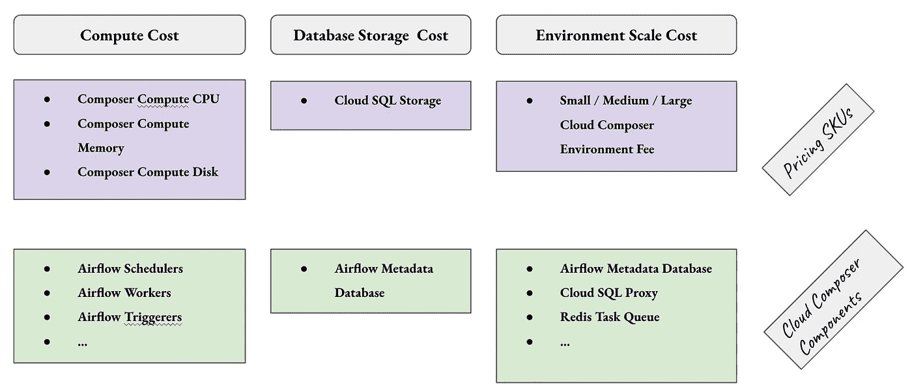
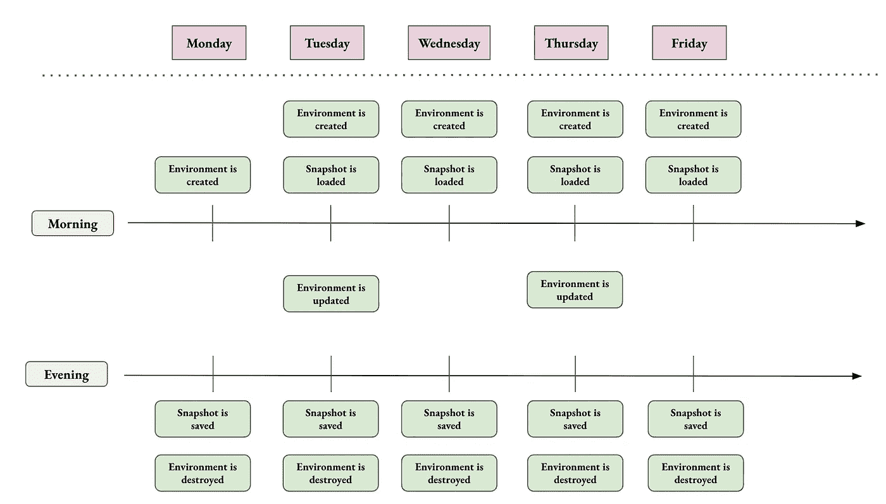
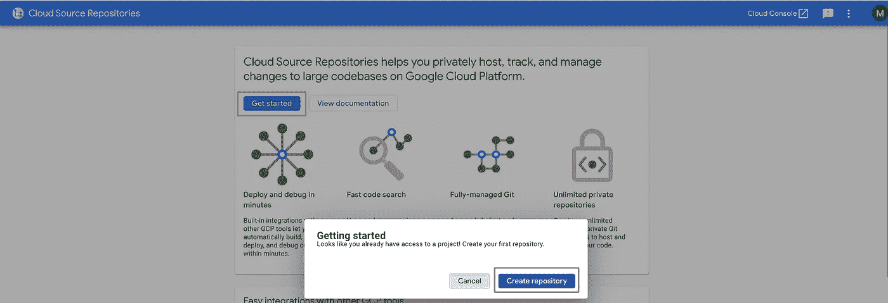
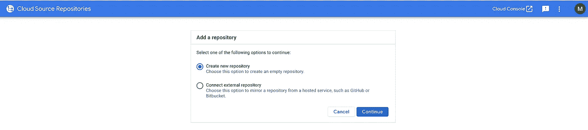
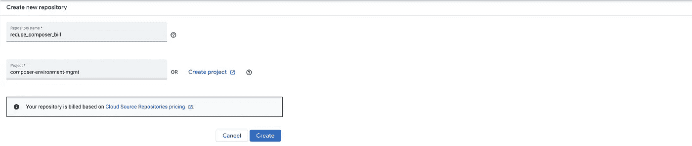

# 减少你的 Cloud Composer 账单（第一部分）

> 原文：[`towardsdatascience.com/reduce-your-cloud-composer-bills-f03e112df689`](https://towardsdatascience.com/reduce-your-cloud-composer-bills-f03e112df689)

## 使用定时 CICD 流水线关闭环境并恢复到之前的状态

[](https://marcgeremie.medium.com/?source=post_page-----f03e112df689--------------------------------)[](https://towardsdatascience.com/?source=post_page-----f03e112df689--------------------------------) [Marc Djohossou](https://marcgeremie.medium.com/?source=post_page-----f03e112df689--------------------------------)

·发表于 [Towards Data Science](https://towardsdatascience.com/?source=post_page-----f03e112df689--------------------------------) ·阅读时间 9 分钟·2023 年 3 月 24 日

--


图片由 [Sasun Bughdaryan](https://unsplash.com/@sasun1990?utm_source=medium&utm_medium=referral) 提供，来源于 [Unsplash](https://unsplash.com/?utm_source=medium&utm_medium=referral)

[Cloud Composer](https://cloud.google.com/composer) 是一个托管的、可扩展的流行复杂作业调度器 [Airflow](https://airflow.apache.org/) 的安装版本。该服务在 Google Cloud Platform (GCP) 上提供两种版本：Cloud Composer 1 和 Cloud Composer 2，主要区别在于只有 Cloud Composer 2 才提供 Workers Autoscaling。

> 由于我已经使用该服务多年，我可以肯定地说它值得一试。然而，一些公司会避免使用这项服务，这个原因可能不会让你感到太意外。**钱**。

在这篇文章中，我将分享一个**减少 Cloud Composer 账单的有效方法**。尽管代码片段仅适用于 Cloud Composer 2，但提倡的策略仍适用于 Cloud Composer 1 用户。

请注意，这是一系列两部分中的第一部分。第二篇文章可以在 这里 查阅。

以下是将要涵盖的主要主题：

> 理解 Cloud Composer 2 定价（第一部分）
> 
> 使用快照关闭 Composer 并保留其状态（第一部分）
> 
> 使用快照创建 Composer 环境（第一部分）
> 
> 总结（第一部分）
> 
> 销毁 Composer 环境以节省费用（第二部分）
> 
> 更新 Composer 环境（第二部分）
> 
> 自动化 Composer 环境的创建与销毁（第二部分）
> 
> 总结（第二部分）

## 理解 Cloud Composer 2 定价

Cloud Composer 的主要概念是[环境](https://cloud.google.com/composer/docs/composer-2/composer-overview)。基本上，一个环境对应于一个 Airflow 实例，具有一个名称和版本。每个环境由一组 Google Cloud 服务组成，这些服务的使用会产生一些费用。例如，Airflow 元数据数据库在每个环境中作为[Cloud SQL 实例](https://cloud.google.com/sql?hl=en)提供，而 Airflow Scheduler 在每个环境中作为[Google Kubernetes Engine Pod](https://cloud.google.com/kubernetes-engine/docs/concepts/network-overview?hl=en#pods)进行部署。

Cloud Composer 定价有 3 个主要部分：

+   **计算成本**：这是运行 Airflow Scheduler、Airflow Workers、Airflow Triggerers、Airflow Web Servers 和其他 Cloud Composer 组件的 Google Kubernetes Engine 节点的成本。

+   **数据库存储成本**：这对应于 Airflow 元数据数据库存储的 Cloud SQL 存储成本。

+   **环境规模成本**：环境规模与某些完全由 Google Cloud 控制的 Cloud Composer 组件相关。这些组件的规模根据为*环境大小*参数（小型 | 中型 | 大型）设置的值自动调整。Airflow 元数据数据库的 Cloud SQL 实例、Cloud SQL 代理和 Redis 任务队列就是这些组件的例子。

关于 Cloud Composer 2 定价的更详细文档可在[这里](https://cloud.google.com/composer/pricing)找到。



图片来源：作者，Cloud Composer 定价

## 快照作为关闭 Composer 并仍然保留其状态的一种方式

在降低使用 Cloud Composer 的成本方面，尝试的方案并不多。人们通常会尝试调整环境的规模，以避免资源浪费。这意味着根据将要部署在 Composer 环境上的实际工作负载，使用最少数量的 GKE 节点和最小可能的 Cloud SQL 实例。

坦率地说，这比说起来容易。凭借其自动扩缩功能，Cloud Composer 2 通过使 Airflow Workers 数量在环境需求不大时自动减少到 1，从而简化了我们的生活。然而，不支持缩减到零，并且没有办法停止或禁用 Cloud Composer 环境。

这对许多 Cloud Composer 用户来说是一个严重的痛点，他们可能会觉得在 Cloud Composer 上花费的费用超过了他们实际获得的好处。实际上，在大多数情况下，开发和测试 Composer 环境不需要在夜间和周末保持开启。我所说的是，保持非生产环境全天候运行是不经济的，但由于缺乏原生的*启动和停止功能*，Cloud Composer 用户最终会这样做。

Google 于 2022 年 4 月推出了[环境快照](https://cloud.google.com/composer/docs/composer-2/save-load-snapshots)作为预览功能，并于 2022 年 12 月正式推出。顾名思义，环境快照会创建 Cloud Composer 环境的快照，这些快照可以加载以将环境恢复到创建快照时的状态。

> 使用此功能，可以模拟*启动与停止功能*，因为环境可以被销毁并重建而不会丢失其状态。
> 
> **注意：** 请注意，Cloud Composer 快照不会保留 Airflow 任务日志

以下是如何在非生产环境中大幅削减 Cloud Composer 费用的 3 步秘诀：

1.  创建环境并加载最新的快照（首次创建环境时将没有快照可加载）

1.  在环境上执行所需的任何更新

1.  保存快照并销毁环境，当你不再需要它时

在专业环境中，上述步骤将通过 CICD 管道执行，这正是接下来部分将涵盖的内容。



图片由作者提供，Cloud Composer 的启动与停止功能通过快照实现

## 使用快照创建 Composer 环境

假设我们想要每天（周末除外）在早上 7 点创建 Composer 开发环境，并在每天晚上 9 点销毁它。我们需要按照以下步骤进行：

1.  创建 Cloud Storage 备份桶和环境服务帐户

1.  在 Cloud Source Repositories 中创建一个仓库来存放环境创建管道

1.  配置一个 Cloud Build 触发器来运行环境创建管道

> **注意：** 在继续之前，你需要安装 gcloud。如果没有，请参考[gcloud 安装指南](https://cloud.google.com/sdk/docs/install?hl=en)

**步骤 1：创建 Cloud Storage 备份桶和环境服务帐户**

你在问为什么吗？Cloud Storage 桶将存储环境快照和任务日志，而这些日志不会作为快照的一部分保存

```py
gsutil mb gs://<PROJECT_ID>-europe-west1-backup
```

至于环境服务帐户，使用具有最小权限的用户创建的服务帐户是一个良好的实践，遵循所谓的*最小权限原则*。该帐户将被授予 Composer Worker 角色。

```py
# Enable the Composer Service
gcloud services enable composer.googleapis.com

# Create the Environment service account. Name it "sac-cmp"
gcloud iam service-accounts create sac-cmp

# Add the role Composer Worker to the sac-cmp service account
gcloud projects add-iam-policy-binding <PROJECT_ID> \
  --member serviceAccount:sac-cmp@<PROJECT_ID>.iam.gserviceaccount.com \
  --role roles/composer.worker

# Add the role Composer ServiceAgentV2Ext to the Composer Agent
# Watch out, do not confuse the Project ID with the Project Number
gcloud iam service-accounts add-iam-policy-binding sac-cmp@<PROJECT_ID>.iam.gserviceaccount.com \
  --member serviceAccount:service-<PROJECT_NUMBER>@cloudcomposer-accounts.iam.gserviceaccount.com \
  --role roles/composer.ServiceAgentV2Ext
```

> **注意：** 此外，Cloud Composer 服务代理在用户创建的环境服务帐户上被授予 Service Agent V2 Ext 角色

这就是所有前提条件。下一步是在 Cloud Source Repositories 中创建一个仓库来存放环境创建管道。

**步骤 2：在 Cloud Source Repositories 中创建一个存放环境创建管道的仓库**

让我们绕个弯，介绍一下 [Cloud Source Repositories](https://cloud.google.com/source-repositories/docs)（CSR），这是 Google Cloud 提供的私有 Git 仓库托管服务。实际上，为了运行环境创建 CICD 管道，我们需要创建一个 [Cloud Build Trigger](https://cloud.google.com/build/docs/automating-builds/create-manage-triggers)，它通过克隆 Git 仓库的内容来工作。Cloud Build 支持许多流行的 Git 仓库托管服务，如 [BitBucket](https://bitbucket.org/)、[Github](https://docs.github.com/en/get-started/quickstart/hello-world) 和 [Gitlab](https://about.gitlab.com/)。为了简化起见，本文使用 CSR 作为 Cloud Build Git 仓库的来源。

在能够在 CSR 内创建任何 Git 仓库之前，必须处理一些先决条件。简而言之，我们需要启用 CSR API 并配置 Git 以便与 CSR 进行交互。

```py
# Enable the CSR API
gcloud services enable sourcerepo.googleapis.com

# Configure Git. Make sure git is installed before
gcloud init && git config --global credential.https://source.developers.google.com.helper gcloud.sh
```

现在，我们可以继续创建 CSR Git 仓库 *reduce_composer_bill*，该仓库将包含环境创建 CICD 管道。为此，我们需要访问 *source.cloud.google.com*，点击 *开始使用*，然后点击 *创建仓库* 按钮。



作者提供的图片，创建 CSR 仓库

然后选择 *创建新仓库* 并点击 *继续*



作者提供的图片，创建 CSR 仓库

然后将仓库命名为 *reduce_composer_bill* 并选择你希望创建 CSR Git 仓库的 GCP 项目。

> **警告**：请不要使用 composer-environment-mgmt，因为这对你不起作用。使用你自己的 GCP 项目。



作者提供的图片，创建 CSR 仓库

接下来的步骤是将这个 [Gitlab 仓库](https://gitlab.com/marcdjoh/reduce_composer_bill) 克隆到你的计算机上，并将其内容推送到 CSR 仓库 *reduce_composer_bill*。在推送到 CSR 仓库之前，编辑 3 个文件 *create_environment.yaml*、*destroy_environment.yaml* 和 *update_environment.yaml*，将 *PROJECT_ID* 和 *ENV_NAME* 变量分别替换为 GCP 项目名称和你希望给 Composer 环境起的名称。

> **注意**：变量 PROJECT_ID 和 ENV_NAME 可能在 3 个文件中出现多次。

```py
# Clone the Git repository
git clone git@gitlab.com:marcdjoh/reduce_composer_bill.git

# Push the edited files into the CSR repository reduce_composer_bill
# To do that, follow the instructions in the CSR console 
```

**步骤 3：配置云构建触发器以运行环境创建管道**

[Cloud Build](https://cloud.google.com/build) 是 Google Cloud 提供的持续集成和持续部署（CICD）服务。环境创建管道完成 3 件事：

1.  它创建一个环境

1.  它加载最新的快照（如果有的话）

1.  它恢复环境任务的日志

```py
steps:

  - name: gcr.io/cloud-builders/gcloud
    entrypoint: /bin/bash
    id: 'Create environment'
    args:
      - -c
      - |
        set -e  
        # This is an example project_id and env_name. Use your own
        project_id=reduce-composer-bill
        env_name=my-basic-environment
        gcloud composer environments create ${env_name} --location europe-west1 \
          --project ${project_id} --image-version=composer-2.1.10-airflow-2.4.3 \
          --service-account sac-cmp@${project_id}.iam.gserviceaccount.com

  - name: gcr.io/cloud-builders/gcloud
    entrypoint: /bin/bash
    id: 'Load Snapshot'
    args:
      - -c
      - |
        set -e
        # This is an example project_id and env_name. Use your own
        project_id=reduce-composer-bill
        env_name=my-basic-environment
        if gsutil ls gs://${project_id}-europe-west1-backup/snapshots/* ; then
          snap_folder=$(gsutil ls gs://${project_id}-europe-west1-backup/snapshots)
          gcloud composer environments snapshots load ${env_name} --project ${project_id} \
            --location europe-west1 \
            --snapshot-path ${snap_folder}
        else
          echo "There is no snapshot to load"
        fi

  - name: gcr.io/cloud-builders/gcloud
    entrypoint: /bin/bash
    id: 'Restore Tasks Logs'
    args:
      - -c
      - |
        set -e
        # This is an example project_id and env_name. Use your own
        project_id=reduce-composer-bill
        env_name=my-basic-environment
        if gsutil ls gs://${project_id}-europe-west1-backup/tasks-logs/* ; then
          dags_folder=$(gcloud composer environments describe ${env_name} --project ${project_id} \
            --location europe-west1 --format="get(config.dagGcsPrefix)")
          logs_folder=$(echo $dags_folder | cut -d / -f-3)/logs
          gsutil -m cp -r gs://${project_id}-europe-west1-backup/tasks-logs/* ${logs_folder}/
        else
          echo "There is no task logs to restore"
        fi
```

构建由 Cloud Build 服务帐户触发。因此，我们将 Project Editor 角色添加到 Cloud Build 服务帐户，以便它可以创建、（也可以销毁和更新）Composer 环境，并将文件复制到 Cloud Storage 存储桶中。最后，我们创建了一个 Cloud Build 触发器来运行环境创建管道。

```py
# Add the project editor role to the Cloud Build service account
gcloud projects add-iam-policy-binding <PROJECT_ID> \
  --member serviceAccount:<PROJECT_NUMBER>@cloudbuild.gserviceaccount.com \
  --role roles/editor

# Create a Cloud Build trigger for the Environment creation CICD pipeline
gcloud builds triggers create manual --name trg-environment-creator \
  --build-config create_environment.yaml --repo reduce_composer_bill \
  --branch main --repo-type CLOUD_SOURCE_REPOSITORIES
```

## 总结

本文是一个两部分系列的第一部分，旨在详细讲解一种高效的方式，以减少所有 Cloud Composer 用户的费用。该策略主要依靠保存和加载环境快照，以便在关闭非生产环境时不会丢失其状态。

CICD 管道代码可在此 [Gitlab repository](https://gitlab.com/marcdjoh/reduce_composer_bill) 中找到。请随意查看。此外，系列的第二部分可以在这里查阅。

感谢您的时间，敬请关注更多内容。
