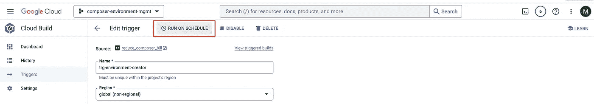
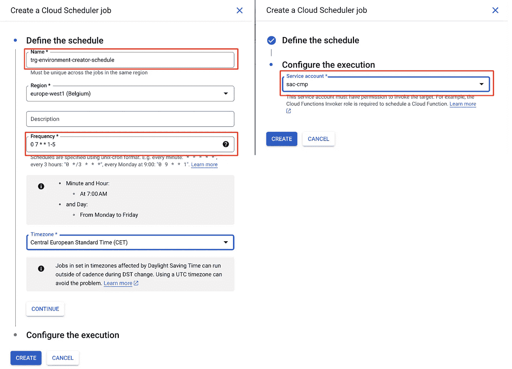

# 减少 Cloud Composer 账单（第二部分）

> 原文：[`towardsdatascience.com/reduce-your-cloud-composer-bills-part-2-af63da03806f`](https://towardsdatascience.com/reduce-your-cloud-composer-bills-part-2-af63da03806f)

## 使用定时 CICD 管道关闭环境，并将其恢复到先前的状态

[](https://marcgeremie.medium.com/?source=post_page-----af63da03806f--------------------------------)[](https://towardsdatascience.com/?source=post_page-----af63da03806f--------------------------------) [Marc Djohossou](https://marcgeremie.medium.com/?source=post_page-----af63da03806f--------------------------------)

·发布于 [Towards Data Science](https://towardsdatascience.com/?source=post_page-----af63da03806f--------------------------------) ·阅读时间 5 分钟·2023 年 3 月 31 日

--


图片来源：[Sasun Bughdaryan](https://unsplash.com/@sasun1990?utm_source=medium&utm_medium=referral) 在 [Unsplash](https://unsplash.com/?utm_source=medium&utm_medium=referral)

这是 2 部分系列的第二部分，旨在介绍一种在使用 Cloud Composer 进行作业编排时节省开支的有效方法。因此，如果还没有的话，我强烈推荐查看[第一部分](https://medium.com/towards-data-science/reduce-your-cloud-composer-bills-f03e112df689)。

以下是将要涉及的主要主题：

> 了解 Cloud Composer 2 定价（第一部分）
> 
> 使用快照作为关闭 Composer 的方式，同时仍然保留其状态（第一部分）
> 
> 使用快照创建 Composer 环境（第一部分）
> 
> 总结（第一部分）
> 
> 为了节省开支销毁 Composer 环境（第二部分）
> 
> 更新 Composer 环境（第二部分）
> 
> 自动化 Composer 环境的创建和销毁（第二部分）
> 
> 总结（第二部分）

## 为了节省开支销毁 Composer 环境

这里是如何减少 Cloud Composer 账单的方法：**在环境未使用时关闭它**。

成本降低策略的关键是，在销毁 Composer 环境之前保存其快照或状态。请注意，这一策略不适用于那些 24 小时、7 天不间断运行编排作业的环境，例如生产环境。

销毁 Composer 环境的管道包含 3 个步骤：

1.  保存环境的快照

1.  将任务日志复制到备份 Cloud Storage 存储桶

1.  删除环境及其存储桶

```py
 steps:

  - name: gcr.io/cloud-builders/gcloud
    entrypoint: /bin/bash
    id: 'Save snapshot'
    args:
      - -c
      - |
        set -e
        # This is an example project_id and env_name. Use your own
        project_id=reduce-composer-bill
        env_name=my-basic-environment
        snap_folder=$(gsutil ls gs://${project_id}-europe-west1-backup/snapshots) || snap_folder=empty
        gcloud composer environments snapshots save ${env_name} \
          --location europe-west1 --project ${project_id} \
          --snapshot-location gs://${project_id}-europe-west1-backup/snapshots
        if [[ $snap_folder != empty ]]
        then
          gsutil -m rm -r $snap_folder
        fi

  - name: gcr.io/cloud-builders/gcloud
    entrypoint: /bin/bash
    id: 'Save Tasks Logs'
    args:
      - -c
      - |
        set -e
        # This is an example project_id and env_name. Use your own
        project_id=reduce-composer-bill
        env_name=my-basic-environment
        dags_folder=$(gcloud composer environments describe ${env_name} --project ${project_id} \
              --location europe-west1 --format="get(config.dagGcsPrefix)")
        logs_folder=$(echo $dags_folder | cut -d / -f-3)/logs
        gsutil -m cp -r ${logs_folder}/* gs://${project_id}-europe-west1-backup/tasks-logs/

  - name: gcr.io/cloud-builders/gcloud
    entrypoint: /bin/bash
    id: 'Delete Composer Environment'
    args:
      - -c
      - |
        set -e
        # This is an example project_id and env_name. Use your own
        project_id=reduce-composer-bill
        env_name=my-basic-environment
        dags_folder=$(gcloud composer environments describe ${env_name} --project ${project_id} \
              --location europe-west1 --format="get(config.dagGcsPrefix)")
        gcloud composer environments delete --project ${project_id} --quiet \
          ${env_name} --location europe-west1
        dags_bucket=$(echo $dags_folder | cut -d / -f-3)
        gsutil -m rm -r $dags_bucket
```

类似于环境创建，我们创建一个触发器来运行环境销毁 CICD 管道

```py
gcloud builds triggers create manual --name trg-environment-destroyer \
  --build-config destroy_environment.yaml --repo reduce_composer_bill \
  --branch main --repo-type CLOUD_SOURCE_REPOSITORIES
```

## 更新 Composer 环境

随着时间的推移，需要更新 Cloud Composer 环境。更新环境会作为一个独立的 CICD 流水线处理。

预计随着更新操作数量的增加，该流水线的步骤数量也会增加。以下是一个简单的更新流水线示例，其中在环境创建后向 Cloud Composer 环境添加了一个环境变量。

```py
steps:

  - name: gcr.io/cloud-builders/gcloud
    entrypoint: /bin/bash
    id: 'Add environment variables'
    args:
      - -c
      - |
        set -e
        # This is an example project_id and env_name. Use your own
        project_id=reduce-composer-bill
        env_name=my-basic-environment
        gcloud composer environments update ${env_name} --location europe-west1 \
          --project ${project_id} --update-env-variables ENV=dev
```

关联的 CICD 流水线触发器需要按照环境创建和销毁的相同原则进行创建。

```py
gcloud builds triggers create manual --name trg-environment-updater \
  --build-config update_environment.yaml --repo reduce_composer_bill \
  --branch main --repo-type CLOUD_SOURCE_REPOSITORIES
```

## 自动化 Composer 环境的创建、更新和销毁

目前，有 3 个流水线来实施 Cloud Composer 成本削减策略：

1.  创建流水线从最新快照中创建 Composer 环境，以保持编排作业执行的状态。

1.  销毁流水线在保存环境状态到快照后销毁 Composer 环境。

1.  更新流水线用于不时地对 Composer 环境进行更新。

> 虽然保持更新流水线的手动运行是可以的，但成本削减策略要求自动化创建和销毁流水线。这可以借助[Cloud Scheduler](https://cloud.google.com/scheduler?hl=fr)来实现。

Cloud Scheduler，顾名思义，是一个由 Google Cloud 管理的服务，可用于计划不同的任务。在我们的案例中，需要按计划运行的任务是 Composer 环境创建和销毁的 Cloud Build 触发器。

从 Cloud Build 界面，可以为触发器添加计划。首先，我们启用 Cloud Scheduler API。

```py
gcloud services enable cloudscheduler.googleapis.com
```

然后，我们打开环境创建触发器，点击*按计划运行*



作者提供的图片，添加计划到 Cloud Build 触发器

然后我们配置计划。最重要的参数是计划名称、频率以及用于运行计划的服务账户。例如，将计划命名为*trg-environment-creator-schedule*，设置为*每天早上 7 点运行（周末除外）*，并使用*sac-cmp* 服务账户来运行计划任务。



作者提供的图片，添加计划到 Cloud Build 触发器

环境创建就完成了。现在每天早上 7 点，环境将会从最新快照中自动重建。

最后，我们为环境销毁流水线添加一个计划。我们可以使用名称*trg-environment-destroyer-schedule*和频率*0 21 * * 1–5*，意味着 Composer 环境将会在每天晚上 9 点自动销毁。

## 总结

Cloud Composer 不允许启动和停止环境，这使得该服务的成本相对较高。在我看来，显著降低 Cloud Composer 成本的最佳方法是销毁并重建环境。

然而，当环境被销毁时，环境的状态会丢失。这就是快照发挥作用的地方。在提出的成本减少策略中，利用快照来保存环境的状态。此外，任务日志也会保存到 Cloud Storage 备份桶中，因为它们不会作为快照的一部分被原生保存。

通过 Cloud Build 和 Cloud Scheduler 的帮助，销毁和重建过程对用户是透明的。环境更新通过一个单独的管道进行处理，该管道旨在根据需要手动触发，每当需要更新时。

CICD 管道的代码可以在这个 [Gitlab 仓库](https://gitlab.com/marcdjoh/reduce_composer_bill) 中找到。欢迎查看。感谢您的时间，敬请关注更多更新。
