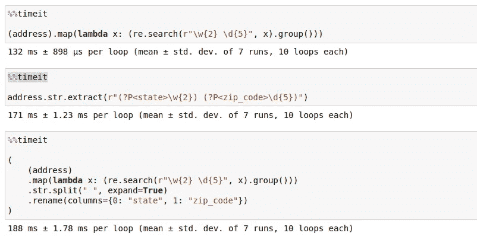

# 如何在 Pandas 中使用正则表达式模式处理复杂字符串

> 原文：[`towardsdatascience.com/regex-patterns-in-pandas-api-afe70178f9e9`](https://towardsdatascience.com/regex-patterns-in-pandas-api-afe70178f9e9)

## 正则表达式简化了大规模文本的模式匹配任务——Pandas 使它变得优雅

[](https://thuwarakesh.medium.com/?source=post_page-----afe70178f9e9--------------------------------)[](https://towardsdatascience.com/?source=post_page-----afe70178f9e9--------------------------------) [Thuwarakesh Murallie](https://thuwarakesh.medium.com/?source=post_page-----afe70178f9e9--------------------------------)

·发表于[Towards Data Science](https://towardsdatascience.com/?source=post_page-----afe70178f9e9--------------------------------) ·阅读时间 7 分钟·2023 年 2 月 27 日

--


图片由[Chris Moore](https://unsplash.com/@chrismoore_?utm_source=medium&utm_medium=referral)拍摄，发布在[Unsplash](https://unsplash.com/?utm_source=medium&utm_medium=referral)

正则表达式是清理和提取数据的最强大技术。如果你曾经处理过大型文本数据集，你会知道这是一项多么耗时和耗力的工作。

我经常使用正则表达式来清理电话号码和电子邮件，并标准化地址。但也有复杂的用例。

我们在最近的数据管道中注意到了来自特定数据源的办公栏位不一致。我们只需要这个栏位中的办公代码。它由两个或三个字母后跟一个冒号和一个两位数字组成。早期，我们使用简单的替换操作将该栏位映射到我们期望的值。但由于新数据与我们的假设不一致，我们不得不改变策略。由于我们可以确保模式的一致性，我们使用正则表达式来清理它们。这样，我们就不必担心更改栏位值的问题。

但如果你的数据集非常大，并且你需要将提取的值存储在每行旁边的新列中，你可能会倾向于使用 Pandas 中的 map 或 apply 方法。但 Pandas 原生提供了优秀的字符串操作 API。几乎所有的 API 都支持正则表达式。

```py
# With apply
import re
df.office.apply(lambda x: re.search(r'\d+', x).group(0))

# With native string operation
df.office.str.extract(r'(\d+)')
```

在我们讨论这些原生 API 相较于 map/apply 方法的优势之前，这里是我所说的意思。

## 比较 Pandas 字符串提取与常规正则表达式

以下代码使用 Faker 生成一个合成数据集。它生成 10 万条虚假地址，并将它们存储在 Pandas Series 中。你可以通过将 n 更改为计算机支持的更大值来调整大小。

```py
import pandas as pd
from faker import Faker

faker = Faker()

n = 100000

address= pd.Series([faker.address() for i in range(n)])

"""
|    | address                      |
|---:|:-----------------------------|
|  0 | 548 Small Parkways Suite 832 |
|    | South Brianborough, DC 50474 |
|  1 | 94291 Jerry Pass Suite 992   |
|    | East Rebecca, PR 87881       |
|  2 | 3973 Wise Spring             |
|    | Grantfort, AS 52002          |
|  3 | 62589 David Island           |
|    | East Kathleenville, OH 45208 |
|  4 | 0415 Jimenez Hill Apt. 642   |
|    | Gambleland, WA 99356         |
""" 
```

我们的目标是将状态和邮政编码提取到不同的列。这项任务在电子表格软件中足够简单。但让我们将其保留用于讨论。假设我们使用正则表达式。

这是我通常的正则表达式应用或映射方法。

```py
(
    (address)
    .map(lambda x: (re.search(r"\w{2} \d{5}", x).group()))
    .str.split(" ", expand=True)
    .rename(columns={0: "state", 1: "zip_code"})
)

"""
|    | state   |   zip_code |
|---:|:--------|-----------:|
|  0 | DC      |      50474 |
|  1 | PR      |      87881 |
|  2 | AS      |      52002 |
|  3 | OH      |      45208 |
|  4 | WA      |      99356 |
"""
```

上面的代码很容易理解。我们匹配所有两个字母后跟空格和五位数字。然后我们进行字符串分割，并将其展开到不同的列。最后，我们将列命名为“state”和“zip_code”。

但这是 Pandas 的处理方式。

```py
address.str.extract(r"(?P<state>\w{2}) (?P<zip_code>\d{5})")

"""
|    | state   |   zip_code |
|---:|:--------|-----------:|
|  0 | DC      |      50474 |
|  1 | PR      |      87881 |
|  2 | AS      |      52002 |
|  3 | OH      |      45208 |
|  4 | WA      |      99356 |
"""
```

这无疑比之前的代码更优雅。我们在正则表达式模式中使用了命名组，这些组成为了列名。

另外，你可以通过将正则表达式模式的一部分用括号括起来，使其成为一个组。你可以通过在描述模式之前添加`?P<group_name>`来命名每个组。

好吧，原生方法在可读性方面表现出色。但性能怎么样呢？

我在 Jupyter notebook 中使用 `timit` 工具记录了执行时间。我不认为原生方法在性能上占有优势。映射更快。

但我们期望的输出并没有通过单一的 map 函数完成。我们需要做额外的步骤才能实现。整个操作集所花费的时间略多于提取方法。



将映射/应用方法性能与提取方法进行比较 — 作者截图。

除了可读性，两个方法之间没有太大区别。但如果你处理的是大规模数据集，差异就会变得显著。

[## 使用 Black 和 GitHub Actions 保持 Python 代码整洁](https://towardsdatascience.com/black-with-git-hub-actions-4ffc5c61b5fe?source=post_page-----afe70178f9e9--------------------------------)

### 没有人想要一个混乱的代码库；很少有人有耐心去清理它。

[## 使用 Black 和 GitHub Actions 保持 Python 代码整洁](https://towardsdatascience.com/black-with-git-hub-actions-4ffc5c61b5fe?source=post_page-----afe70178f9e9--------------------------------)

此外，如果你的代码运行在资源受限的环境中，你必须仔细决策。这通常是我的情况，因为我主要构建数据管道。我需要确保我使用的是最优代码，以便更快、更便宜地处理实时数据。

我们知道在 Pandas 中有多种处理方式。如果你预见到将来会重新运行这些脚本，你可能需要花时间尝试不同的替代方案。

[## 一个小巧的 Pandas 技巧处理有限内存的大数据集](https://towardsdatascience.com/a-little-pandas-hack-to-handle-large-datasets-with-limited-memory-6745140f473b?source=post_page-----afe70178f9e9--------------------------------)

### Pandas 的默认设置并不理想。稍微调整一下配置，可以压缩你的 dataframe 以适应内存。

[## 一个小巧的 Pandas 技巧处理有限内存的大数据集](https://towardsdatascience.com/a-little-pandas-hack-to-handle-large-datasets-with-limited-memory-6745140f473b?source=post_page-----afe70178f9e9--------------------------------)

## 有用的 Pandas 字符串方法与正则表达式

现在我们知道如何直接使用正则表达式操作，而无需映射或应用函数，下面是一些我经常使用的方法。

在上一节中我们已经看到过使用 `extract` API 的一个示例。它在处理正则表达式模式时非常方便，也许这是我使用最频繁的一个。

这里有另外三种我经常使用的技巧。

**1\. 将文本分割为带有复杂模式的单独列。**

假设一个列包含州和邮政编码。我们需要将它们分离成单独的列。由于这些数据来自自由格式的输入表单，因此分隔符不总是空格或逗号。

```py
import pandas as pd

# Create a sample dataframe
df = pd.DataFrame(
    {
        "location": [
            "New York 10001",
            "California 90001",
            "Texas-75201",
            "Georgia 30301",
            "Oregon97205",
            "Arizona 85001",
            "Illinois 60601",
            "Florida 33101",
            "Ohio 44101",
            "Pennsylvania-19104",
        ]
    }
)

df["location"].str.split(r"[\s|-]*(\d{5})", expand=True)

'''
|    | 0            |     1 |
|---:|:-------------|------:|
|  0 | New York     | 10001 |
|  1 | California   | 90001 |
|  2 | Texas        | 75201 |
|  3 | Georgia      | 30301 |
|  4 | Oregon       | 97205 |
|  5 | Arizona      | 85001 |
|  6 | Illinois     | 60601 |
|  7 | Florida      | 33101 |
|  8 | Ohio         | 44101 |
|  9 | Pennsylvania | 19104 |
''' 
```

**2\. 筛选包含文本模式的记录。**

我曾经有一个数据集，其中有一个办公室序列号。这个号码有一个模式。前两个字母表示国家的简码。紧接着是位置代码，包含三位数字。然后是一个连字符和一个部门编号，也是一组三位数字。

假设我们需要筛选与国家的财务部门相关的记录，包括英国、印度和澳大利亚。我们可以这样做。

```py
import pandas as pd

# Create a sample dataframe
data = {
    "office_serial_number": [
        "US101-001",
        "UK201-006",
        "CA301-003",
        "AU401-004",
        "UK202-005",
        "IN302-006",
        "IR102-007",
        "AU402-006",
        "SL303-009",
        "UK203-010",
        "FR403-011",
        "US103-012",
    ]
}

df = pd.DataFrame(data)

df[df.office_serial_number.str.contains("^(UK|IN|AU)\d{3}-006")]

'''
|    | office_serial_number   |
|---:|:-----------------------|
|  1 | UK201-006              |
|  5 | IN302-006              |
|  7 | AU402-006              |
'''
```

如果没有正则表达式，这可能是个棘手的任务。而且它也不是一个容易阅读的任务。

**3\. 用新字符串替换模式**

替换是一个常见的字符串操作。即使在 Excel 中，我们也经常这样做。但有些替换操作比简单的查找和替换更复杂。

我们需要找到模式并将其替换为新的字符串。

以电话号码列为例。你需要从列中删除国家代码。有些记录有国家代码，有些没有。即使有国家代码的记录也有不同的格式。

下面是一个简单的正则表达式示例。

```py
import pandas as pd
import re

# create a sample dataframe (dummy)
df = pd.DataFrame({'phone': ["+1 555-555-5555", "+44 20 7123 4567", "+81 3-1234-5678", "0049 30 12345678", "+61 2 1234 5678", "+33 1 23 45 67 89", "+86 10 1234 5678", "011 52 55 1234 5678", "+971 4 123 4567", "+49 911 12345678", "(+81) 3-1234-5678"]})

# define a regular expression pattern to match the country code
pattern = r'^\+?\d{1,3}[\s-]?'   # match + or digit(s) followed by space/hyphen

# apply the pattern to the 'phone' column and replace the matches with an empty string
df['phone'] = df['phone'].apply(lambda x: re.sub(pattern, '', x))

print(df)

          phone
0  555-555-5555
1  20 7123 4567
2  3-1234-5678
3   30 12345678
4   2 1234 5678
5  1 23 45 67 89
6  10 1234 5678
7  52 55 1234 5678
8   4 123 4567
9  911 12345678
10  3-1234-5678
```

# 结论

对于基本的字符串操作，你的电子表格软件已经足够了。但对于更复杂的用例，编程语言可以节省你大量的时间。

一些操作即使使用编程语言的基本 API 也很复杂，特别是涉及模式的操作。这时候我们需要正则表达式的帮助。

如果你是 Pandas 用户，可以直接在其原生 API 中使用正则表达式。这具有代码简洁、行数更少的优势。这也是本文的重点。

我已经讨论了一些我喜欢的 Pandas 中的正则表达式技巧。虽然没有显著的性能提升，但我仍然偏爱这些方法，因为它们简单明了。

> 感谢你的阅读，朋友！在 [**LinkedIn**](https://www.linkedin.com/in/thuwarakesh/)、[**Twitter**](https://twitter.com/Thuwarakesh) 和 [**Medium**](https://thuwarakesh.medium.com/) 上向我打个招呼吧！
> 
> 还不是 Medium 会员？请使用这个链接来 [**成为会员**](https://thuwarakesh.medium.com/membership)，因为在不增加你额外费用的情况下，我可以通过推荐你赚取少量佣金。
