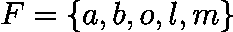
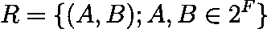
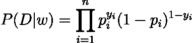
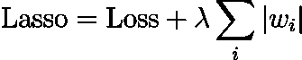

# 现代偏好引导中的回归与贝叶斯方法

> 原文：[`towardsdatascience.com/regression-and-bayesian-methods-in-modern-preference-elicitation-39a21435898d?source=collection_archive---------5-----------------------#2023-08-29`](https://towardsdatascience.com/regression-and-bayesian-methods-in-modern-preference-elicitation-39a21435898d?source=collection_archive---------5-----------------------#2023-08-29)

## 简单果昔制作的应用

[](https://ouaguenouni-hachemi.medium.com/?source=post_page-----39a21435898d--------------------------------)[](https://towardsdatascience.com/?source=post_page-----39a21435898d--------------------------------) [Ouaguenouni Mohamed](https://ouaguenouni-hachemi.medium.com/?source=post_page-----39a21435898d--------------------------------)

·

[关注](https://medium.com/m/signin?actionUrl=https%3A%2F%2Fmedium.com%2F_%2Fsubscribe%2Fuser%2F6c5dbf6956c8&operation=register&redirect=https%3A%2F%2Ftowardsdatascience.com%2Fregression-and-bayesian-methods-in-modern-preference-elicitation-39a21435898d&user=Ouaguenouni+Mohamed&userId=6c5dbf6956c8&source=post_page-6c5dbf6956c8----39a21435898d---------------------post_header-----------) 发表在 [Towards Data Science](https://towardsdatascience.com/?source=post_page-----39a21435898d--------------------------------) ·14 min read·2023 年 8 月 29 日[](https://medium.com/m/signin?actionUrl=https%3A%2F%2Fmedium.com%2F_%2Fvote%2Ftowards-data-science%2F39a21435898d&operation=register&redirect=https%3A%2F%2Ftowardsdatascience.com%2Fregression-and-bayesian-methods-in-modern-preference-elicitation-39a21435898d&user=Ouaguenouni+Mohamed&userId=6c5dbf6956c8&source=-----39a21435898d---------------------clap_footer-----------)

--

[](https://medium.com/m/signin?actionUrl=https%3A%2F%2Fmedium.com%2F_%2Fbookmark%2Fp%2F39a21435898d&operation=register&redirect=https%3A%2F%2Ftowardsdatascience.com%2Fregression-and-bayesian-methods-in-modern-preference-elicitation-39a21435898d&source=-----39a21435898d---------------------bookmark_footer-----------)

摄影：[Denis Tuksar](https://unsplash.com/@dtuksar?utm_source=medium&utm_medium=referral) 在 [Unsplash](https://unsplash.com/?utm_source=medium&utm_medium=referral)

线性回归通常被视为预测建模的主力，但其应用超越了简单的预测任务。本文旨在通过引入 Probit 线性回归作为建模偏好的有效工具来丰富关于回归技术的对话。此外，我们使用贝叶斯框架从经典线性回归过渡到贝叶斯线性回归，阐明了基于成本的优化——特别是二元交叉熵（BCE）损失最小化——与最大似然估计之间的内在关系。

通过这样做，我们旨在展示正则化可以被视为一种贝叶斯先验选择形式，从而将成本函数方法与概率推理连接起来。

最后，我们将讨论贝叶斯线性回归如何不仅提供点估计，还提供这些预测的分布，提供一种更丰富、考虑不确定性的视角。

# 贝叶斯框架

贝叶斯框架识别出两个主要组成部分：数据 *D* 和模型 *w*。通过指定似然 *P*(*D*∣*w*) 和模型的先验 *P*(*w*)，我们旨在找到最大化后验 *P*(*w*∣*D*) 的模型，该后验通过贝叶斯定理得出，如下：


在偏好学习中，对 *w* 的分布提供了捕捉人类偏好固有不确定性的优势，从而不仅提供一个‘最佳猜测’，而是一个合理模型的范围。

# 偏好引导问题

偏好引导是决策理论中的关键组成部分，旨在根据可用数据识别决策者的选择。在这项研究中，我们通过拟合一个模型到部分偏好集来处理偏好引导问题。在我们的案例中，偏好以最简单的形式表达：成对比较。为了说明这一概念，考虑一组水果，记作 *F*，包括苹果、香蕉、橙子、荔枝和芒果。



在我们的背景下，备选集 *A* 包含所有可以使用来自集合 *F* 的一个或多个成分制作的可能的冰沙。


用户通过一组有序对（*A*，*B*）表达他们的偏好，其中 *A* 被严格偏好于 *B*。



本文的下一部分将介绍专门选择的用于捕捉用户偏好的函数家族：加性函数。这些数学构造提供了一个直接而强大的框架，用于理解不同因素如何影响个人偏好，从而有效建模通过成对比较表达的选择。

# 加性模型

线性加性模型是最简单的模型，可以用来捕捉用户的偏好。

## 加性线性模型

加性效用模型是一个将特定权重分配给我们集合中每个成分的模型。果昔的整体效用或“受欢迎程度”通过汇总其组成成分的权重来计算。正式来说，给定一个权重向量


从成分子集 A 制成的果昔的效用是：


其中 I 是测试是否在 A 中的单位函数。

## 带有二元交互的加性模型

2-additive 模型在 1-additive 模型的基础上引入了额外的复杂度。权重向量不仅包含每个单独成分的权重，还包括每对成分的权重。这使得模型能够捕捉成分对之间的协同效应，有效识别两个成分的组合如何影响整体效用。正式来说，权重向量**w**被扩展为包括每对(*i*,*j*)的权重，除了单一成分：


使用 2-additive 线性模型，果昔的效用由以下公式给出：


其中 F²是单一成分和成对的集合。

## n-additive 模型

进一步扩展概念，*n*-additive 模型提供了一个高度灵活的效用框架。在这个模型中，权重向量不仅考虑单个成分和成对，还扩展到包括任何最多*n*成分的子集的权重。这种概括使得模型能够同时捕捉多个成分之间的复杂关系和协同效应。

正式来说，权重向量**w**被扩展为包括所有可能的最多*n*成分的组合的权重：


这个*n*-additive 模型可以捕捉成分之间的全部交互，成为理解复杂偏好结构的强大工具。

为了这项分析，我们将限制在 2-additive 模型上，因为我们认为成分之间的偏好关系复杂性不太可能超过成对交互。

# 通过解决 Probit 回归问题来学习偏好

虽然传统回归模型输出实值预测，但我们的目标是预测二元偏好关系。

为了实现这一点，我们修改回归模型以输出选项*A*优于选项*B*的概率。然后我们推导出一个合适的成本函数，以有效地将这个概率模型拟合到我们的数据中。

一种经典的将值压缩到 0 和 1 之间的方法是使用 Probit 函数。Probit 函数定义如下


下图展示了其形状


概率单位函数的形状（由我绘制）

通过将此函数应用于 *f*(*A*) 和 *f*(*B*) 之间的差异，我们的模型将产生一个接近 1 的概率，如果 *f*(*A*) 显著超过 *f*(*B*)。相反，如果 *f*(*A*) 大约等于 *f*(*B*)，它将产生一个接近 0.5 的概率。

因此，偏好引导问题可以重新表述为寻找一个最优的权重向量 **w**，使得：


## 二元交叉熵 (BCE) 损失

二元交叉熵 (BCE) 损失，也称为对数损失，是一种用于输出范围为 0 到 1 概率的分类模型的性能指标，通常用于二元分类任务。数学上，给定真实标签 *y*（0 或 1）和预测概率 *p*，BCE 定义为：


# 玩具数据生成

为了验证我们的方法，我们引入了一个生成合成数据的协议。

该过程首先通过随机采样一个权重向量 **w** 开始。然后我们将其某些参数设置为零，以引入现实性和简单性。

在假设用户的偏好与这个采样函数一致的前提下，我们可以将其作为基准来评估我们预测模型的准确性。

```py
def singletons_and_pairs(lst):
    singletons = [(x,) for x in lst]
    pairs = list(combinations(lst, 2))
    return singletons + pairs

ingredients = ["o", "a", "b","l", "m"]
model = singletons_and_pairs(ingredients)
w = np.random.normal(0, 1, size = (len(model),))
p = np.random.randint(0, 2, size = (len(model),))
w = w * p
```

然后我们使用以下函数将每个备选方案编码为一个二进制向量，其中组件的顺序与模型参数中的顺序相同

```py
def vectorize_smoothie(smoothie):
    arr = np.zeros(len(model))
    print(list(smoothie))
    for i in range(arr.shape[0]):
        if all(j in list(smoothie) for j in model[i]):
            arr[i] = 1
    return arr
```

然后，为了评估特定的平滑度，我们使用乘积

```py
vectorize_smoothie("oa") @ w
# Return w_a + w_o + w_oa
```

为了构建我们的数据集，我们首先采样一个权重向量 **w**。接下来，我们生成一组平滑度，并根据采样的权重对每个平滑度进行评估。对于每对平滑度 *A* 和 *B*，其中 *f*(*A*) > *f*(*B*)，我们将相应的偏好添加到我们的数据集中。每个 *A* 和 *B* 之间的偏好都被捕捉在一个向量中，定义如下：


对于每对 *A* 和 *B*，其中 *f*(*A*) > *f*(*B*)，我们添加了两行 v(*A*,*B*) 和 v(*B*,*A*)，第一行标记为类别 1，第二行标记为类别 0。

以下代码为我们提供了一个关于 n 个平滑度的数据集。

```py
def sample_dataset(n):
    ingredients = ["o", "a", "b","l", "m"]
    model = singletons_and_pairs(ingredients)
    X = []
    y = []
    w = sample_w(model)
    subsets = set()
    while len(subsets) != n:
        s = random_subset(ingredients)
        subsets.add(s)
    subsets = list(subsets)
    for i in range(len(subsets)-1):
        x_i = vectorize_smoothie(subsets[i])
        for j in range(i+1, len(subsets)):
            x_j = vectorize_smoothie(subsets[j])
            x1 = x_i - x_j
            x2 = x_j - x_i
            if f(subsets[i], w) == f(subsets[j], w):
                continue
            if f(subsets[i], w) > f(subsets[j], w):
                X.append(x1)
                X.append(x2)
                y.append(1)
                y.append(0)
                continue
            if f(subsets[i], w) < f(subsets[j], w):
                X.append(x1)
                X.append(x2)
                y.append(0)
                y.append(1)
                continue
    X = np.array(X)
    y = np.array(y)
    return X,y,w,model
```

# 基于成本的分辨率

解决这个问题的一种方法是利用 BCE 损失的凸性以及类似 Torch 的库。

我们首先将生成的数据包装到 PyTorch 提供的适当数据集加载器中。

```py
X,y,w,model = sample_dataset(30)

X_tensor = torch.FloatTensor(X)
y_tensor = torch.FloatTensor(y)

dataset = TensorDataset(X_tensor, y_tensor)
train_size = int(0.3 * len(dataset))
test_size = len(dataset) - train_size
train_dataset, test_dataset = random_split(dataset, [train_size, test_size])
train_loader = DataLoader(dataset=train_dataset, batch_size=32, shuffle=True)
test_loader = DataLoader(dataset=test_dataset, batch_size=1, shuffle=False)
```

现在，我们创建一个简单的线性模型

```py
class BinaryClassifier(nn.Module):
    def __init__(self, input_dim):
        super(BinaryClassifier, self).__init__()
        self.fc1 = nn.Linear(input_dim, 1)

    def forward(self, x):
        x = torch.sigmoid(self.fc1(x))
        return x
```

并使用 PyTorch 的自动梯度功能对其进行训练。

```py
input_dim = X.shape[1]
model = BinaryClassifier(input_dim)

# Loss and optimizer
criterion = nn.BCELoss()
optimizer = optim.Adam(model.parameters(), lr=0.01)

losses = []

# Train the model
epochs = 200
for epoch in range(epochs):
    for batch_idx, (data, target) in enumerate(train_loader):
        optimizer.zero_grad()
        output = model(data).squeeze()
        loss = criterion(output, target)
        loss.backward()
        optimizer.step()
```

然后，我们使用测试数据集来测试获得的模型

```py
model.eval()
with torch.no_grad():
  correct = 0
  total = 0
  for data, target in test_loader:
    output = model(data).squeeze()
    predicted = (output > 0.5).float()
    total += target.size(0)
    correct += (predicted == target).sum().item()
  acc = correct / total
  accuracy.append(acc)

if (epoch+1) % 50 == 0:
  print(f'Epoch [{epoch+1}/{epochs}], Loss: {loss.item():.4f}')
  print(f'Test Accuracy: {100 * correct / total:.2f}%')
```

使用 20% 的数据进行训练，我们获得了约 98.32% 的准确率，这已经相当不错了。

# 最大似然估计 (MLE)

解决 probit 回归挑战的另一种方法是明确地制定给定权重向量 **w** 的数据的似然函数。

我们首先假设模型产生一个概率 *p*，表示 *A* 相对于 *B* 的偏好。该情景的预测分布表示如下：


给定一对（x, y）的权重向量的可能性可表示为：


数据集的概率为



似然值可能非常小，这在将许多概率相乘时尤为重要。这可能导致数值下溢（非常小的浮点数被四舍五入为零）。对这些值取对数会将其转化为更可管理的数字，这些数字通常为负值且具有更大的量级。

对数似然因此给出为


你可能会注意到，这个损失是 BCE 损失的负值，这就是**最大化似然等同于最小化 BCE 损失**的原因。


# 正则化技术

正则化是机器学习中的一项关键技术，用以对抗过拟合，即模型过度适应训练数据，包括其噪声，从而影响在新数据上的表现。它通过在损失函数中添加惩罚项来限制模型参数的复杂性。这促进了更简单的模型，平衡了对训练数据的拟合与保持模型简洁性之间的关系。

L1（Lasso）和 L2（Ridge）是常见的正则化形式，每种形式都向模型的目标函数中引入了独特的惩罚项。

L1 通过基于参数的绝对值添加惩罚，导致稀疏模型，其中一些权重为零。



相比之下，L2 惩罚参数的平方大小，缩小权重但不将其设为零。


L1（Lasso）和 L2（Ridge）正则化技术在惩罚模型参数的方式上有所不同。L1 应用一个与绝对值成比例的惩罚，导致一些权重完全为零，从而便于特征选择。相反，L2 惩罚权重的平方大小，确保权重保持较小但通常不为零，从而保留所有特征并减少其影响。

# 最大后验

如前所述，贝叶斯定理允许我们通过利用似然函数和选定的参数先验分布*P*(*w*)来估计模型参数的后验分布*P*(*w*∣*X*,*y*)。

从本质上讲，先验包含了我们在观察到任何数据之前对参数的初步信念或假设，而似然量化了参数解释观察到的数据的效果。贝叶斯定理将这些元素结合起来，生成一个后验分布，代表了在先验和数据的基础上我们对参数的更新信念。

两个非常著名的先验是**拉普拉斯**先验和**高斯**先验。

拉普拉斯先验假设权重 *w* 服从位置参数 *μ*=0 和尺度参数 b 的拉普拉斯分布。

换句话说，它假设权重的分布围绕零中心，并且随着值偏离这一中心点而指数衰减，反映了对稀疏模型的偏好，在这些模型中，许多权重可能被设为零。


高斯先验假设权重 *w* 服从均值 *μ*=0 和方差 *σ* 的高斯（或正态）分布。

本质上，它假设权重的分布对称地围绕零中心，具有钟形曲线轮廓，表明权重最有可能接近均值，而随着远离均值的距离增加，可能性逐渐降低。这导致对平滑正则化的模型有偏好，确保权重保持较小的幅度，而不必精确地设为零。


对数后验分布由以下公式给出


通过优化我们的模型，我们发现最大化对数后验分布在本质上等同于最小化特定的正则化损失。

值得注意的是，L1 和 L2 正则化的区别在于所考虑的先验分布形式。

# 使用 MCMC 方法中的后验分布

在贝叶斯框架中，一切都以概率的方式对待。因此，与经典线性回归中估计回归系数的固定值不同，贝叶斯线性回归估计的是可能系数值的分布。

使用后验分布的一种方法是从分布 P(w|X,y) 中抽取一组权重。

一种简单的方法是使用 MCMC 方法，理解 MCMC 方法的起点是 Metropolis-Hasting 方法。

## Metropolis-Hasting 方法

Metropolis-Hastings (M-H) 算法是贝叶斯统计中用于从复杂概率分布中采样的一种方法。

它使用一个更简单的“提议分布”来探索目标分布，根据计算出的概率接受或拒绝样本。值得注意的是，M-H 算法不需要确切的目标分布知识；只需具有与之成比例的分布即可。

我们不会使用它，因为其他方法更可靠、更高效，但我们仍将简要说明它的工作原理，因为 M-H 算法是一个基础的 MCMC 方法。

+   选择一个初始猜测

+   设定一个提议分布，通常是一个以当前值 w 为中心的高斯分布。


然后对于每次迭代，我们按如下步骤进行：

+   从提议分布 P(w’|w) 中抽取一个新的 w’。

+   计算接受概率


+   从[0,1]的均匀分布中抽取一个随机数 u。如果 u ≤ α，则接受 w'作为新样本；否则，保留 w。

## NUTS 采样器和 PyMC3

Metropolis-Hastings 方法涉及在参数空间中提议一个新点，然后根据新点的似然与当前点的似然进行比较来决定是否接受这个新点。其效率在很大程度上依赖于提议分布的选择，并且在高维空间中可能会出现随机游走行为，从而导致收敛速度缓慢。

NUTS（无转弯采样器）是哈密顿蒙特卡罗（HMC）方法的扩展。NUTS 不依赖随机游走，而是利用目标分布的梯度信息来提议跃迁步伐，从而使得其能够更有效地遍历分布。它的一个主要优点是自动确定跃迁步伐的最优数量，从而避免了随机游走问题以及手动调整的繁琐任务。

PyMC3 是一个流行的概率编程框架，它无缝集成了这些方法（以及其他方法），使用户能够轻松拟合复杂的贝叶斯模型，而不会被底层算法的复杂性所困扰。

在我们的案例中，这段代码将从后验分布 P(w|X,y) 中采样一系列权重。

```py
import pymc3 as pm

with pm.Model() as probit_model:

    # Priors for weights and bias
    weights = pm.Normal('weights', mu=0, sd=4, shape=X.shape[1])
    bias = pm.Normal('bias', mu=0, sd=4)

    # Probit link function
    mu = pm.math.dot(X, weights) + bias
    phi = pm.math.invprobit(mu)  # Inverse probit link function

    # Likelihood
    y_obs = pm.Bernoulli('y_obs', p=phi, observed=y)

    # Sample from the posterior
    trace = pm.sample(5000, tune=1000, chains=5, target_accept = 0.90)
```

我们可以绘制每个权重的不同分布。


权重的分布及其收敛图（由我提供）

我们看到每个权重都收敛到高斯分布。因此，现在每个预测都可以以概率的方式进行，并且预测的分布也将是高斯分布。

例如，我们虚拟决策者对橙子冰沙、橙子-苹果冰沙和香蕉-苹果冰沙的偏好分别由以下高斯分布给出。


使用生成数据的模型，我们可以看到三种冰沙的真实效用分别为 -0.66、-0.24 和 0.79，因此高斯分布实际上很好地反映了偏好及其之间的差距。

# 结论

在这篇博客文章中，我们从偏好引导的复杂性到贝叶斯线性回归模型的复杂性进行了探讨。我们的讨论从 2-additive 模型的探索开始，这些模型作为捕捉用户偏好的现实但计算上可处理的方式。通过从基础线性回归过渡到更高级的 probit 模型，我们提供了一个理解偏好数据的新视角。

我们还探讨了基于成本的视角与概率视角之间的等价性，阐明了最小化二元交叉熵损失如何类似于最大化似然，以及正则化如何作为对先验的隐式选择。

最后，我们讨论了贝叶斯框架在生成不仅仅是点估计而是整个预测分布的实用性。这种方法为我们的模型提供了更高的信心和可解释性，特别是在偏好学习这一微妙任务中十分有用。

在奠定了这些基础后，未来的研究可以更深入地探讨将这些复杂模型应用于越来越复杂的大规模偏好数据中。

## 致谢

特别感谢我的同事/朋友[Anissa Hacene](https://medium.com/u/7bb6c80751ad?source=post_page-----39a21435898d--------------------------------)在这项工作中的贡献，以及 TDS 团队的及时审查和有见地的评论。
