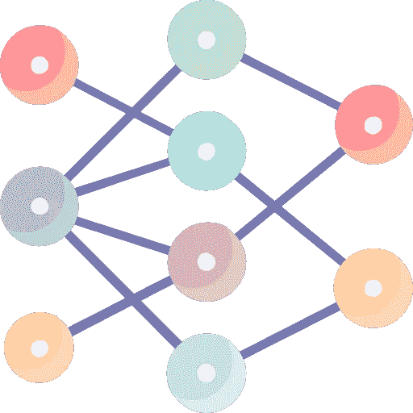
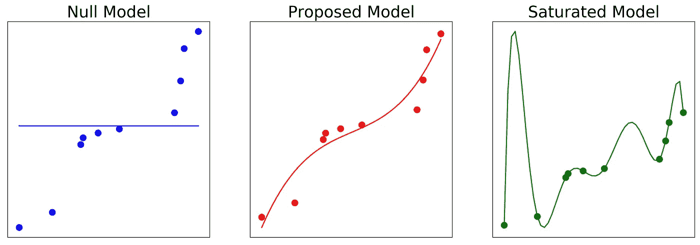
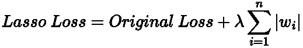
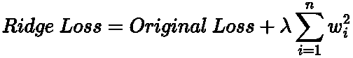
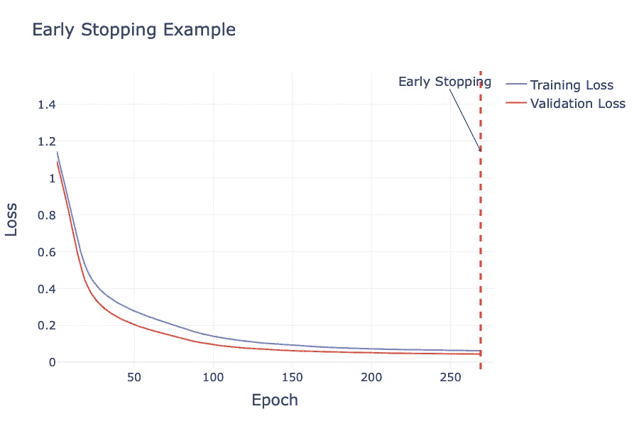
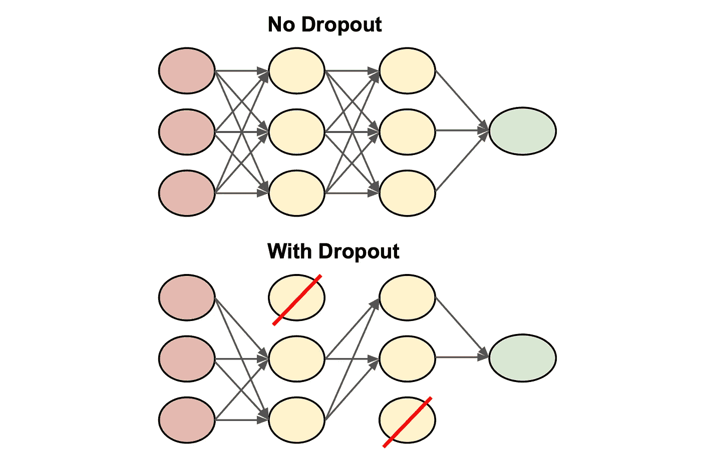

# 神经网络中的正则化

> 原文：[`towardsdatascience.com/regularisation-techniques-neural-networks-101-1f746ad45b72`](https://towardsdatascience.com/regularisation-techniques-neural-networks-101-1f746ad45b72)

## 如何在训练神经网络时避免过拟合

[](https://medium.com/@egorhowell?source=post_page-----1f746ad45b72--------------------------------)[](https://towardsdatascience.com/?source=post_page-----1f746ad45b72--------------------------------) [Egor Howell](https://medium.com/@egorhowell?source=post_page-----1f746ad45b72--------------------------------)

·发表于 [Towards Data Science](https://towardsdatascience.com/?source=post_page-----1f746ad45b72--------------------------------) ·阅读时间 8 分钟·2023 年 12 月 2 日

--



[`www.flaticon.com/free-icons/neural-network`](https://www.flaticon.com/free-icons/neural-network) 的标题是“neural network icons.” 神经网络图标由 Vectors Tank 创建 — Flaticon。

# 内容目录

1.  **背景**

1.  **什么是过拟合？**

1.  **Lasso (L1) 和 Ridge (L2) 正则化**

1.  **早停法**

1.  **Dropout**

1.  **其他方法**

1.  **总结**

# 背景

到目前为止，在这个神经网络 101 系列中，我们讨论了两种提高神经网络性能的方法：**超参数调整** 和更快的梯度下降优化器。你可以查看下面的帖子：

[](/hyperparameter-tuning-neural-networks-101-ca1102891b27?source=post_page-----1f746ad45b72--------------------------------) ## 超参数调整：神经网络 101

### 如何通过调整超参数来改进神经网络的“学习”和“训练”

towardsdatascience.com [](/optimisation-algorithms-neural-networks-101-256e16a88412?source=post_page-----1f746ad45b72--------------------------------) ## 优化算法：神经网络 101

### 如何改进超越“普通”梯度下降算法的训练

towardsdatascience.com

还有另一组技术有助于提高性能，那就是正则化。这有助于防止模型对训练数据集过拟合，从而获得更准确和一致的预测。

在本文中，我们将涵盖一系列正则化神经网络的方法以及如何在 PyTorch 中实现它！

# 什么是过拟合？

让我们快速回顾一下在机器学习和统计中我们所说的过拟合是什么意思。

[维基百科](https://en.wikipedia.org/wiki/Overfitting) 描述了过拟合为：

> “一种分析的生产，该分析与特定数据集过于密切或完全对应，因此可能无法适应额外数据或可靠预测未来观察结果”

通俗来说，这就是说模型正在学习它训练的数据，但未能进行泛化。因此，它在未见过的数据上会有较差的预测。

以下是一个视觉示例，描述了 [***空***](https://en.wikipedia.org/wiki/Null_model) 模型（欠拟合）、***提出的*** 模型（良好泛化）和 [***饱和***](https://en.wikipedia.org/wiki/Saturated_model#:~:text=In%20mathematical%20logic%2C%20and%20particularly,reasonably%20expected%22%20given%20its%20size.) 模型（过拟合）：



图显示了从左到右的空模型、提出的模型和饱和模型。图像由作者用 Python 生成。

注意到过拟合（饱和）模型通过了每一个数据点（其“连接点”），所以它直接拟合了数据。而提出的模型明显更好地进行了泛化，即使它的线没有通过每一个数据点。

用于生成上述图的代码可以在我的 GitHub 上找到：

[](https://github.com/egorhowell/Medium-Articles/blob/main/Statistics/General/saturated_models.py?source=post_page-----1f746ad45b72--------------------------------) [## Medium-Articles/Statistics/General/saturated_models.py at main · egorhowell/Medium-Articles

### 我在我的 Medium 博客/文章中使用的代码。通过创建帐户来为 egorhowell/Medium-Articles 的开发做出贡献…

[github.com](https://github.com/egorhowell/Medium-Articles/blob/main/Statistics/General/saturated_models.py?source=post_page-----1f746ad45b72--------------------------------)

# 套索与岭回归正则化

[***套索回归***](https://en.wikipedia.org/wiki/Lasso_%28statistics%29) 和 [***岭回归***](https://en.wikipedia.org/wiki/Ridge_regression) 正则化可以类似于它们在 ***线性回归*** 中的应用，用于神经网络。它们在损失函数中应用额外的惩罚项，以帮助保持模型权重小或稀疏，从而鼓励更简单的模型以减少过拟合的机会。

## **套索回归**

对于套索回归（***L1***），惩罚项是模型中权重的绝对值之和。



神经网络的套索回归。方程由作者用 LaTeX 表示。

其中：

+   ***λ****: 正则化参数*

+   ***原始损失：*** *未考虑正则化项的初始损失。*

+   ***w_i****:*​ *模型的权重*

Lasso 可以使一些权重变为零，从而创建一个更稀疏的神经网络。这减少了网络的复杂性。

Lasso 在 PyTorch 中没有直接提供，但我们可以通过编辑代码中的损失函数来添加它：

```py
import torch

# Define L1 regularisation
l1_lambda = 0.01

# Training loop for the model
for input, target in data_loader:
    optimizer.zero_grad()
    output = model(input)
    loss = loss_function(output, target)

    # Calculate L1 penalty
    l1_penalty = torch.tensor(0.).to(input.device)
    for param in model.parameters():
        l1_penalty += torch.sum(torch.abs(param))

    # Add L1 penalty to the loss
    loss += l1_lambda * l1_penalty

    # Backward pass and optimize
    loss.backward()
    optimizer.step()
```

## 岭回归

岭回归通过将权重的平方作为惩罚项来添加正则化：



神经网络的岭回归。方程由作者在 LaTeX 中编写。

> 这个方程中的术语与上述 Lasso 正则化相同。

与 Lasso 正则化的区别在于权重的平方。这导致权重不会变为零，但会最小化其值，从而有助于减轻过拟合。

与 Lasso 相比，岭回归在 PyTorch 中的实现要简单得多。它是通过指定`weight_decay`参数来完成的，这是正则化的强度：

```py
optimizer = optim.Adam(model.parameters(), lr=0.001, weight_decay=1e-5)
```

如果`weight_decay`过小，则会导致最小的正则化。因此，必须正确初始化。这可以通过试验和错误或使用超参数调优来实现。

# 早期停止

早期停止可能是神经网络和机器学习中最好的正则化方法。

早期停止在模型“学习”时通过外部验证集来衡量性能。如果验证集上的性能在每个训练周期都有所提高，那么神经网络将继续在训练数据上学习。

然而，如果验证集上的性能在一定数量的周期内没有改善，通常称为*耐心*，则训练将提前终止。

验证集使我们能够在未用于训练模型的保留数据集上评估模型。这就是早期停止如何帮助解决潜在的过拟合问题。

> 一些研究表明，即使验证集上的表现开始下降，神经网络仍然可以进行泛化。这被称为[**双重下降**](https://en.wikipedia.org/wiki/Double_descent)或[**grokking**](https://arxiv.org/abs/2201.02177)，强烈推荐查看，因为这是一个非常有趣的结果。

以下是如何在著名的[***鸢尾花数据集***](https://scikit-learn.org/stable/auto_examples/datasets/plot_iris_dataset.html) ([MIT 许可证](https://github.com/olafplacha/Iris-Dataset/blob/master/LICENSE)) 上使用[***PyTorch***](https://pytorch.org/)实现早期停止的示例：

```py
import torch
import torch.nn as nn
import torch.optim as optim
from torch.utils.data import DataLoader, TensorDataset
from sklearn.datasets import load_iris
from sklearn.model_selection import train_test_split
from sklearn.preprocessing import StandardScaler
import plotly.graph_objects as go

class Model(nn.Module):
    def __init__(self):
        super(Model, self).__init__()
        self.input_layer = nn.Linear(4, 10)
        self.output_layer = nn.Linear(10, 3)

    def forward(self, x):
        x = torch.relu(self.input_layer(x))
        x = self.output_layer(x)
        return x

# Training function
def train_one_epoch(model, data_loader, optimiser, criterion):
    model.train()
    for inputs, targets in data_loader:
        optimiser.zero_grad()
        preds = model(inputs)
        loss = criterion(preds, targets)
        loss.backward()
        optimiser.step()

# Validation function
def validate(model, data_loader, criterion):
    model.eval()
    total_loss = 0
    with torch.no_grad():
        for inputs, targets in data_loader:
            preds = model(inputs)
            loss = criterion(preds, targets)
            total_loss += loss.item()
    return total_loss / len(data_loader)

# Main Training Function with Early Stopping
def train_model(model, train_loader, val_loader, optimiser, criterion, epochs, patience):
    best_val_loss = float('inf')
    epochs_no_improve = 0
    train_losses = []
    val_losses = []
    early_stop = 0

    for epoch in range(epochs):
        train_loss = 0
        for inputs, targets in train_loader:
            optimiser.zero_grad()
            preds = model(inputs)
            loss = criterion(preds, targets)
            loss.backward()
            optimiser.step()
            train_loss += loss.item()
        train_loss /= len(train_loader)
        train_losses.append(train_loss)

        # Get the validation dataset loss
        val_loss = validate(model, val_loader, criterion)
        val_losses.append(val_loss)

        # Early stopping check
        if val_loss < best_val_loss:
            best_val_loss = val_loss
            epochs_no_improve = 0
        else:
            epochs_no_improve += 1
        if epochs_no_improve == patience:
            early_stop = epoch + 1
            break

    # Plot the early stopping
    fig = go.Figure()
    fig.add_trace(go.Scatter(x=list(range(1, epochs)), y=train_losses, mode='lines', name='Training Loss'))
    fig.add_trace(go.Scatter(x=list(range(1, epochs)), y=val_losses, mode='lines', name='Validation Loss'))

    if early_stop:
        fig.add_vline(x=early_stop, line_width=3, line_dash="dash", line_color="red")
        fig.add_annotation(x=early_stop, y=max(max(train_losses), max(val_losses)),
                           text="Early Stopping", showarrow=True, arrowhead=1, ax=-50, ay=-100)

    fig.update_layout(title='Early Stopping Example', xaxis_title='Epoch', yaxis_title='Loss', template='plotly_white',
                      width=900, height=600, font=dict(size=18), xaxis=dict(tickfont=dict(size=16)),
                      yaxis=dict(tickfont=dict(size=16)), title_font_size=24)
    fig.show()

    return train_losses, val_losses

# Load and split the data
iris = load_iris()
X = iris.data
y = iris.target
X_train, X_val, y_train, y_val = train_test_split(X, y, test_size=0.2, random_state=42)

# Normalise the data
scaler = StandardScaler()
X_train = scaler.fit_transform(X_train)
X_val = scaler.transform(X_val)

# Convert the data into PyTorch Tensors
X_train_tensor = torch.tensor(X_train, dtype=torch.float32)
y_train_tensor = torch.tensor(y_train, dtype=torch.long)
X_val_tensor = torch.tensor(X_val, dtype=torch.float32)
y_val_tensor = torch.tensor(y_val, dtype=torch.long)

# Load the data into PyTorch DataLoaders to allow mini-batch training
train_dataset = TensorDataset(X_train_tensor, y_train_tensor)
val_dataset = TensorDataset(X_val_tensor, y_val_tensor)
train_loader = DataLoader(train_dataset, batch_size=8, shuffle=True)
val_loader = DataLoader(val_dataset, batch_size=8)

# Model initialisation
model = Model()
optimiser = optim.Adam(model.parameters(), lr=0.001)
criterion = nn.CrossEntropyLoss()

# Train and visualise results
train_losses, val_losses = train_model(model, train_loader, val_loader, optimiser, criterion, epochs=800, patience=10)
```



早期停止的示例。图表由作者用 Python 生成。

如你所见，尽管将训练设置为***800***个周期，但训练在***~260***个周期时终止，因为验证集上的性能在***10***个周期内没有改善。

上述图表的代码可以在我的 GitHub 上找到：

[## Medium-Articles/Neural Networks/regularisation.py at main · egorhowell/Medium-Articles

### 我在我的中等博客/文章中使用的代码。通过创建一个账户来贡献 egorhowell/Medium-Articles 的开发…

github.com](https://github.com/egorhowell/Medium-Articles/blob/main/Neural%20Networks/regularisation.py?source=post_page-----1f746ad45b72--------------------------------)

# Dropout

[***Dropout***](https://en.wikipedia.org/wiki/Dilution_%28neural_networks%29) 是深度学习“教父”[***Geoffrey Hinton***](https://en.wikipedia.org/wiki/Geoffrey_Hinton) 提出的最著名的正则化技术之一。研究表明，它能使最先进的神经网络的性能提高几个百分点。

Dropout 的基本思想非常简单。在每个 epoch 中，每个神经元都有一定的概率 ***p*** 被“丢弃”在学习过程中，并且被忽略。然而，在下一个 epoch 中，它可能会“激活”，继续学习其最佳的权重和偏置。

> 注意：输出神经元不考虑在 Dropout 中。

Dropout 发生的概率，***p***，是一个超参数，可以且应该为你所考虑的网络进行超参数调整。通常，它的范围在 10% 到 50% 之间，具体取决于你正在构建的神经网络类型。包括 [***递归神经网络***](https://en.wikipedia.org/wiki/Recurrent_neural_network) 和 [***卷积神经网络***](https://en.wikipedia.org/wiki/Convolutional_neural_network)。

下面的图示展示了三层网络的 dropout 技术：



Dropout 的示意图，其中两个神经元被“丢弃”在训练过程中。由作者创建。

Dropout 之所以如此有效，是因为它教会神经元独立发挥作用，而不是与邻近神经元共同适应。这使得它们能更好地泛化，因为它们对输入的敏感度更高。

另一种理解方式是，Dropout 导致我们训练多个不同的神经网络。如果我们的网络有 ***n*** 个神经元，那么我们就有 ***2^n*** 种网络排列，因为每个神经元有两种状态：“激活”或“丢弃”。因此，在 1,000 个 epoch 后，我们训练了 1,000 个神经网络。最终模型只是所有这些较小网络的平均值。

在 PyTorch 中，当声明网络的架构时，容易添加 Dropout：

```py
import torch
import torch.nn as nn
from torch.nn.functional import relu

class NerualNet(nn.Module):
    def __init__(self, input_size, hidden_size, output_size, dropout_rate):
        super(NerualNet, self).__init__()
        self.input_layer = nn.Linear(input_size, hidden_size)
        self.dropout = nn.Dropout(dropout_rate)
        self.output_layer = nn.Linear(hidden_size, output_size)

    def forward(self, x):
        x = relu(self.input_layer(x))
        x = self.dropout(x)
        x = self.output_layer(x)
        return x

# Example: Network with 100 input features, 10 hidden units
#          2 output classes, and 20% dropout rate
model = NerualNet(100, 10, 2, 0.2)
```

# 其他方法

## 架构

你可以减少隐藏层的数量和这些层中的神经元数量，以降低复杂性，从而减少过拟合的可能性。

## 更多数据

一如既往，数据越多越好。模型用于学习的训练样本越多，神经网络找到最佳权重和偏置的可能性就越大。

## 增强数据

特别是对于计算机视觉任务，你可以通过随机变换（翻转、旋转、剪切等）来增强数据，从而增加训练数据的池。

# 总结与进一步思考

正则化是确保你的神经网络模型避免在训练数据上过拟合的重要概念。我推荐的主要正则化方法是早停法和 dropout。这两者的结合在减少过拟合的可能性方面非常有效。

# 另一个事情！

我有一个免费的新闻通讯，[**Dishing the Data**](https://dishingthedata.substack.com/)，我在其中每周分享成为更好的数据科学家的技巧。没有“虚 fluff”或“点击诱饵”，只有来自实践数据科学家的纯粹可操作的见解。

[](https://newsletter.egorhowell.com/?source=post_page-----1f746ad45b72--------------------------------) [## Dishing The Data | Egor Howell | Substack

### 如何成为更好的数据科学家。点击阅读**Egor Howell**的《Dishing The Data》，这是一个 Substack 出版物，包含…

[newsletter.egorhowell.com](https://newsletter.egorhowell.com/?source=post_page-----1f746ad45b72--------------------------------)

# 与我联系！

+   [**YouTube**](https://www.youtube.com/@egorhowell)

+   [**LinkedIn**](https://www.linkedin.com/in/egor-howell-092a721b3/)

+   [**Twitter**](https://twitter.com/EgorHowell)

+   [**GitHub**](https://github.com/egorhowell)

# 参考文献与进一步阅读

+   [*Andrej Karpathy 神经网络课程*](https://www.youtube.com/watch?v=i94OvYb6noo)

+   [*PyTorch 网站*](https://pytorch.org/)

+   [*《Scikit-Learn、Keras 和 TensorFlow 实战，第 2 版》. Aurélien Géron. 2019 年 9 月. 出版社：O’Reilly Media, Inc. ISBN: 9781492032649*](https://www.oreilly.com/library/view/hands-on-machine-learning/9781492032632/)*.*

+   *Dropout 论文：* [*https://jmlr.org/papers/v15/srivastava14a.html*](https://jmlr.org/papers/v15/srivastava14a.html)
