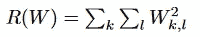

# 正则化为何真的有效？

> 原文：[`towardsdatascience.com/regularization-996a4967984a`](https://towardsdatascience.com/regularization-996a4967984a)

## 解构机器学习中的正则化数学概念

 [Günter Röhrich](https://guenterroehrich.medium.com/?source=post_page-----996a4967984a--------------------------------)

·发表于 [Towards Data Science](https://towardsdatascience.com/?source=post_page-----996a4967984a--------------------------------) ·9 分钟阅读·2023 年 1 月 2 日

--

虽然有许多优秀的资源展示了正则化在机器学习中的实现，这个指南是对为何添加一个项对我们的模型具有有益性质的简要介绍。本文将讨论在线性回归背景下的正则化概念，并涵盖以下主题：

1.  OLS 的基本概念

1.  提赫诺夫正则化（L2 正则化）

1.  L1 正则化

1.  指定 Lambda

1.  深度学习中的正则化

1.  结论

## OLS 的基本概念

首先，让我们快速回顾一下基本的普通最小二乘（OLS）方程，它在线性回归中起着至关重要的作用。在线性回归中，我们的目标是找到一个预测值（y-hat），使其尽可能接近真实（观测）值。为实现这一目标，我们通常尝试找出一组系数，以便通过数据点绘制一条直线。当这条直线**最小化数据点的距离**时，被认为是最优的。以下是使用 R 语言中的著名汽车数据集的示例：

一个简单的线性回归演示 — 作者使用“汽车”数据集制作的图像

红线是响应值“*y*”的估计值。根据估计值的定义，我们计算出的值很可能接近**但不完全等于**真实的*响应变量 y*。

估计值（y-hat）在图表中以红线显示

如前所述，OLS 描述了**最小化红线（估计值，y-hats）和真实值（响应值，y）之间的距离**的基本思想，但实际如何找到这条最佳线呢？有几种方法可以将线拟合到数据上，例如，我们可以使用梯度下降的思想逐步调整（移动、倾斜）红线，使其最终达到上述位置。在**回归背景下，我们更倾向于使用矩阵求逆**，这会为我们的估计结果提供相同的结果。

如果梯度下降方法对你来说很有趣，接下来的逐步指南可能会很有趣：

## 梯度下降简单指南——线性回归示例

### 当翻开一本机器学习书籍时，很难在前十页内不遇到…

towardsdatascience.com

无论哪种情况，我们的起点都是损失或目标函数，可以表达为如下：

损失函数简单地形式化了“最小化线与真实值之间距离”的思想。

为了最小化这个函数，我们需要寻找相对于系数（betas）集合的导数。可以如下所示：

通过将上述导数设为零，可以得到函数的最小值。此外，我们能够求解出 beta 值，即我们的模型系数。正如你在指数中看到的，我们需要对 X 值的矩阵进行求逆——这就是我们需要注意这些列的线性独立性的地方！

注意，损失函数是一个凸函数，因此我们应该能找到局部最小值。如果我们有兴趣*展示这一点*，我们需要查看二阶导数（这等同于*Hessian 矩阵*）。

> **这里的关键是，我们可以通过对损失函数进行导数运算来找到估计系数，如演示所示。**

现在让我们继续讨论“**OLS 如何以及为何与正则化的概念相关？**”这个问题。

## 提赫诺夫正则化（岭回归）

在正则化过程中，你可能经常会遇到类似下面的方程：

快速拆解，方程显示了两个部分，即我们刚刚分析过的 OLS 部分，以及一个新项，该项将平方 betas 的总和添加到整体损失函数中。

我决定首先提供 L2 正则化（如上所示的“平方范数”），因为这在不仅在线性回归中很常见，而且在**深度学习中的权重矩阵正则化**中也非常流行。

*但为什么我们要将这个新的最后一项添加到我们的损失（或目标）函数中？*

*我们可以将相同的项添加到 n 次幂吗？*

OLS 对数据做出了一些假设。如前所述，其中一个假设是由于线性独立性（[为了确保我们可以反转矩阵](https://textbooks.math.gatech.edu/ila/invertible-matrix-thm.html)），我们能够找到一组系数，以为给定的问题提供唯一解决方案，但这可能不是事实。在某些情况下，**没有一组** betas 或甚至**多个** betas 组可以找到，导致非唯一解决方案。

**这为什么是个问题？** 回归要求线性独立的观测值，并且考虑到我们使用矩阵反演，还需要线性独立的列。这是一个问题，因为我们可能会发现自己处于一个过度或不足确定的方程组中——这意味着有几个非唯一或甚至没有解决方案！这正是正则化发挥作用的地方：

> **引入更多的约束到我们的优化问题中，可以改善方程的限制/条件，这可能进一步允许我们确定唯一的解集。**

如我们所见，方程中添加了一个带有拉格朗日乘数的项。这个拉格朗日引入了以下约束：

注意，c 是一个常数，在推导函数时将被省略，留下一个“beta²”项。考虑到最小化整个方程时，许多大系数与最小化系数的总和相矛盾，这一点相当明显。这意味着，我们可以预期看到较小的系数。

这将引导我们进入以下步骤：

与 OLS 导数相比，我们现在引入了一个“+ lambda * Identity”项

## L1 正则化

关于前一个问题，即我们是否可以使用不同的正则化变体（例如，幂），简单的答案是肯定的。最常见的例子还是与 OLS 紧密相关，被称为 LASSO 回归。LASSO 增加了一个引入绝对值惩罚的约束，如下所示：

LASSO L1 约束下的损失

如你所见，拉格朗日项与我们之前在 Ridge 回归中看到的相似，不过在这种情况下，我们看到 betas 的范数和幂发生了变化。

与 L2 范数（其中 betas 被平方）相比，L1 下的 betas 可以是负值！因此，我们需要查看 betas 可能的几个值，并为每种情况得出推导：

从上面的方程展开开始：

以下推导可以得到

**Betas > 0:**

**Betas < 0:**

**贝塔 = 0：** *这对应于标准 OLS 情况*

LASSO 不仅仅被称为正则化方法，还被用作处理多种特征时的变量选择技术。下面的插图提供了一个几何解释，展示了为什么 L1 范数可以用于变量选择任务，因为一些权重被推到 0（因此可以被省略）。

L2 惩罚（右侧）可以表示为圆形，这种惩罚导致圆的直径缩小。这意味着，系数或贝塔（在这里称为“权重”，w1 和 w2）将收缩趋向于零。

图片来自[维基百科](https://en.wikipedia.org/wiki/Lasso_(statistics)#/media/File:L1_and_L2_balls.svg)

正如你可能注意到的，*一个与约束边界相切的凸对象在 L1 范数下更可能遇到角点，* 这意味着一个或多个贝塔正好为零，而对于 L2 情况，凸对象与边界相切的点，不比圆上的其他点更有可能。

由于 L1 允许系数为零，因此惩罚通常被称为对权重（或在回归上下文中称为贝塔）集的“引入稀疏性”。系数可能被缩小到 0，而在二次约束下不太可能发生。

## 指定 Lambda

查看上述正则化示例后，很明显 lambda 的选择对建模方法至关重要。Lambda 在平衡偏差-方差权衡中发挥了重要作用，因此应仔细选择。

实际操作中，**交叉验证**用于找到一个 lambda 值，该值使模型误差保持低，同时考虑合理的方差水平。可以在下面的链接中进一步阅读这个话题：

 ## 通过交叉验证进行正确的模型选择

### 交叉验证是最先进的技术。这不是一项有趣的任务，但对于所有处理数据的人来说却至关重要……

towardsdatascience.com

## 深度学习中的正则化

到目前为止，我们已经查看了 L1 和 L2 正则化，并快速参考了“如何确定 lambda”。正则化不仅在回归过程中至关重要，而且还会导致比没有正则化的“普通”实现更好的泛化能力的深度学习模型。

尽管如此，深度学习中的正则化并不是完全重新发明轮子。类似于平方贝塔（L2）损失的想法，我们可以很容易地将其转化为神经网络中使用的权重矩阵：

这个方程会得到一个单一的标量值，由整个权重矩阵上的平方和组成。这等同于之前展示的 beta 的平方和。将上述正则化损失与从目标函数（例如 Softmax 或 Sigmoid 函数）中获得的“数据损失”相结合，记作 Li：

损失 = L（目标函数） + lambda*L（权重矩阵）

在展示了神经网络的 L2 正则化后，请注意有很多不同的方式可以实现正则化或类似的行为。正确的选择可以节省大量训练时间，并使模型更具通用性。非常受欢迎的正则化（如）选项包括：

1.  L1 和 L2 正则化

1.  Dropout

1.  [批量/层/空间归一化](http://static.googleusercontent.com/media/research.google.com/en//pubs/archive/43442.pdf)（可以防止协变量偏移）

1.  “早停”

有时你还会发现“早停”这个概念，即当满足某个条件时（例如，损失在最后 x 轮次中没有改善 < epsilon），训练就会停止。虽然这个方法实际上只是查看模型结果/损失，但它常常被证明是一个很好的工具。早停可以在深度学习框架中应用于“回调”一词。

## 结论

正则化是一种将约束集纳入基础优化问题的好方法。向损失函数添加额外的约束可以显著帮助提高模型的泛化能力，减少过拟合风险，克服不适定问题（如线性回归中的多重共线性），同时也支持变量选择过程。

*如果你觉得这篇文章有趣，请点关注！*

*{照顾好自己，如果可以的话，也照顾他人}*

*— 借用自 Stephen Dubner*

## 有趣的阅读：

**L1 正则化**

[`aswani.ieor.berkeley.edu/teaching/SP15/265/lecture_notes/ieor265_lec6.pdf`](https://aswani.ieor.berkeley.edu/teaching/SP15/265/lecture_notes/ieor265_lec6.pdf)

**L2 正则化**

[`cs229.stanford.edu/notes2021fall/lecture10-ridge-regression.pdf`](https://cs229.stanford.edu/notes2021fall/lecture10-ridge-regression.pdf)

**权重矩阵的 L2 正则化（深度学习）**

 [## CS231n 卷积神经网络用于视觉识别

### 目录：在上一节中，我们介绍了图像分类的问题，这是一项任务…

cs231n.github.io](https://cs231n.github.io/linear-classify/?source=post_page-----996a4967984a--------------------------------#multiclass-support-vector-machine-loss) 

不是一个约束边界 — 作者 Christoph Ungerböck
