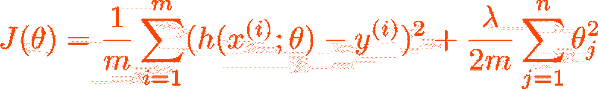

# 正则化：避免机器学习中的过拟合

> 原文：[`towardsdatascience.com/regularization-avoiding-overfitting-in-machine-learning-bb65d993e9cc`](https://towardsdatascience.com/regularization-avoiding-overfitting-in-machine-learning-bb65d993e9cc)

## 正则化如何工作以及何时使用

 [Rian Dolphin](https://medium.com/@riandolphin?source=post_page-----bb65d993e9cc--------------------------------)

·发表于 [Towards Data Science](https://towardsdatascience.com/?source=post_page-----bb65d993e9cc--------------------------------) ·阅读时间 7 分钟·2023 年 1 月 16 日

--

## 什么是正则化？

正则化是机器学习中用于解决我们都面临的问题的技术；当模型在训练数据上表现良好，但在新数据上表现差 — 这就是 [过拟合](https://medium.com/towards-data-science/overfitting-in-ml-avoiding-the-pitfalls-d5225b7118d) 的问题。

我陷入过拟合陷阱的一个明显迹象是模型在训练数据上表现很好，但在测试数据上表现极差。发生这种情况的原因是模型过于详细地学习了训练数据的所有复杂性，这意味着它不能对未见过的数据进行概括。

正则化是解决此问题的一种方法，通过对具有大值的过多参数进行惩罚来实现。使用这样的惩罚项意味着 *模型被鼓励只学习数据中最重要的模式*，而避免陷入特定于训练集的噪声中。

或者，至少，这就是其理念 👀 让我们深入探讨一下它的工作原理。

## 正则化是如何工作的？

图片由 [Ugur Akdemir](https://unsplash.com/ja/@ugur?utm_source=unsplash&utm_medium=referral&utm_content=creditCopyText) 提供，[Unsplash](https://unsplash.com/s/photos/lights?utm_source=unsplash&utm_medium=referral&utm_content=creditCopyText)

一般来说，在机器学习中，我们尝试学习一个模型（函数），该模型接受一些输入特征并输出一个数字（或者在多分类场景下是一个数字向量）。我们知道模型是否表现良好的一种方法是计算某种类型的误差，这个误差是模型输出和 *y* 的函数。因此，如果我们传入某个输入 *x* 并得到输出 *y*，我们可以计算与该输入相关的误差/成本。

然而，如果我们还希望对过于复杂的模型进行惩罚，我们可以在成本函数中添加另一个元素，即当模型具有许多大权重时，增加到成本函数中的惩罚项。因此，我们的成本函数现在是模型输出、*y* 和 *模型参数* 的函数。

惩罚项通常基于模型参数的大小进行计算，并且随着参数的增大，成本也会增加。这意味着模型必须明智地选择要赋予权重的特征，并减少或消除对不重要特征的权重。通过这样做，正则化有助于防止[过拟合](https://medium.com/towards-data-science/overfitting-in-ml-avoiding-the-pitfalls-d5225b7118d)，并且可以提高在新的、未见过的数据上的表现。

**一个例子**

一个正则化项的例子是 L2 正则化项，它通过对模型参数的平方和施加惩罚。我们稍后会详细讨论这个问题，但现在我们先看看它是如何在成本函数中实现的。

考虑一个通用的[均方误差](https://en.wikipedia.org/wiki/Mean_squared_error)（MSE）成本函数 *J(θ)*，它的形式如下：

作者提供的图像

其中 *m* 表示训练样本的数量，*h(x;θ)* 表示我们对输入 *x* 的模型输出，对于某个具有参数 *θ* 的模型 *h*，*y* 是真实值。在这里，我们看到成本函数（在正则化之前）所接受的两个输入 (*h(x;θ)* 和 *y*)。基于这个成本函数的输出，我们将更新模型参数 *θ* 以最小化成本，并可以使用像随机梯度下降这样的算法来实现。

> *关于均方误差的补充说明：* h(x;θ)-y *告诉我们模型预测与真实值* y *之间的距离，我们对其进行平方是因为我们希望对预测过高和过低的情况都进行惩罚（平方操作使得所有值都变为正值* *➕)*。

所以，现在我们希望对模型中的大（就其大小而言，这就是为什么我们对 *θ* 进行平方）参数进行惩罚。我们可以通过在损失函数中添加一个项来实现。请记住，模型参数的向量用 *θ* 表示。包含 L2 正则化项的成本函数形式如下：

作者提供的图像

其中 λ 是控制正则化强度的参数，需要由你选择。添加这个项会使当模型参数权重较大时，损失 *J(θ)* 变大。因此，在 *J(θ)* 的优化过程中，较小的参数值被鼓励使用。

调整 λ 是这里的关键。如果我们选择一个过高的 λ 值，则可能使正则化部分在成本函数中的影响大于原始的均方误差部分。这将是一个大问题，因为这实际上相当于牺牲模型性能仅仅为了获得较小的模型权重。

## 何时使用 L1 和 L2 正则化？

正则化主要有两种类型：L1 正则化和 L2 正则化。

**L1** 正则化，也称为 LASSO（最小绝对收缩和选择算子），在成本函数中添加了一个与模型参数的*绝对值*成正比的惩罚项（我们讨论的示例使用的是模型参数的平方）。这**鼓励模型只使用可用参数的一个子集，并且可能导致一些参数被设置为零**，从而有效地将其从模型中移除（这里可以考虑特征选择💭）。

**L2** 正则化，也称为岭回归，在模型参数的*平方*上添加了一个与之成正比的惩罚项。这**鼓励模型使用所有参数但减少其值**，从而生成一个较不复杂且较不容易过拟合的模型。

## 正则化什么时候有用？

一般来说，当*训练数据有限*或*模型复杂度较高*时，例如具有许多参数的深度神经网络，正则化效果最佳。在这些情况下，模型更容易过拟合，而正则化可以通过鼓励模型仅学习数据中最重要的模式来帮助防止这一点。

此外，由于正则化鼓励模型尝试仅使用部分特征，它还可以提高模型的可解释性并带来有趣的见解。例如，在线性回归中应用正则化可以突出显示那些在模型中权重最大的最重要预测变量。

*要了解更多关于 ML 中过拟合的信息，请查看这篇文章：*

 ## 机器学习中的过拟合：避免陷阱

### 探索机器学习模型中过拟合的原因和解决方案

[towardsdatascience.com

## 正则化的挑战

图片来源：[Olav Ahrens Røtne](https://unsplash.com/@olav_ahrens?utm_source=unsplash&utm_medium=referral&utm_content=creditCopyText) 在 [Unsplash](https://unsplash.com/s/photos/challenge?utm_source=unsplash&utm_medium=referral&utm_content=creditCopyText)

正则化的一大挑战是选择正确的正则化参数，通常表示为 λ。这个参数控制正则化的强度，如前所述，需要谨慎设置，以实现正确的平衡，并确保正则化组件的权重足够，以便有用但又不会过于强大，从而压倒成本函数的实际误差部分。找到合适的 λ 值可能很具挑战性，并且需要使用 [验证集](https://en.wikipedia.org/wiki/Training,_validation,_and_test_data_sets) 进行实验。⚖️

正则化的另一个挑战是它可能计算开销很大，特别是对于参数众多的大型模型。这是因为正则化项需要计算并添加到 *每次训练迭代* 的成本函数中。这可能显著减慢训练过程，对于 L2 正则化尤为突出，因为它涉及到参数的平方计算。

## 实施技巧

尽管存在这些挑战，正则化仍然是提升机器学习模型性能和防止过拟合的强大工具。以下是实施正则化时需要记住的一些关键点：

1.  选择正确类型的正则化。例如，L1 正则化在特征选择方面更有效，而 L2 正则化在防止过拟合方面更有效。

1.  设置正则化参数 λ。这个参数控制正则化的强度，需要谨慎设置，以实现模型复杂性和过拟合之间的理想平衡。可能需要尝试不同的 λ 值，以找到最适合你模型的最佳值。

1.  将正则化纳入你的成本函数中。为了使用正则化，需要将正则化项添加到模型优化的成本函数中。这可以通过简单地将正则化项添加到现有成本函数中，或者使用机器学习库提供的预构建正则化函数来实现。通常不需要重新发明轮子！

## 结论

我希望这篇文章能让你更好地理解正则化如何成为你机器学习工具箱中的宝贵工具。它绝不是万能的，可能并不适用于所有情况，但如果模型出现过拟合，通常可以作为一个良好的起点。
