# 强化学习：价值迭代的简单介绍

> 原文：[`towardsdatascience.com/reinforcement-learning-an-easy-introduction-to-value-iteration-e4cfe0731fd5?source=collection_archive---------0-----------------------#2023-09-10`](https://towardsdatascience.com/reinforcement-learning-an-easy-introduction-to-value-iteration-e4cfe0731fd5?source=collection_archive---------0-----------------------#2023-09-10)

## 学习强化学习（RL）的基础知识以及如何将价值迭代应用于一个简单的示例问题。

[](https://medium.com/@carlbettosi?source=post_page-----e4cfe0731fd5--------------------------------)[](https://towardsdatascience.com/?source=post_page-----e4cfe0731fd5--------------------------------) [Carl Bettosi](https://medium.com/@carlbettosi?source=post_page-----e4cfe0731fd5--------------------------------)

·

[关注](https://medium.com/m/signin?actionUrl=https%3A%2F%2Fmedium.com%2F_%2Fsubscribe%2Fuser%2Fabe6f5e189c8&operation=register&redirect=https%3A%2F%2Ftowardsdatascience.com%2Freinforcement-learning-an-easy-introduction-to-value-iteration-e4cfe0731fd5&user=Carl+Bettosi&userId=abe6f5e189c8&source=post_page-abe6f5e189c8----e4cfe0731fd5---------------------post_header-----------) 发表在 [Towards Data Science](https://towardsdatascience.com/?source=post_page-----e4cfe0731fd5--------------------------------) · 15 分钟阅读 · 2023 年 9 月 10 日[](https://medium.com/m/signin?actionUrl=https%3A%2F%2Fmedium.com%2F_%2Fvote%2Ftowards-data-science%2Fe4cfe0731fd5&operation=register&redirect=https%3A%2F%2Ftowardsdatascience.com%2Freinforcement-learning-an-easy-introduction-to-value-iteration-e4cfe0731fd5&user=Carl+Bettosi&userId=abe6f5e189c8&source=-----e4cfe0731fd5---------------------clap_footer-----------)

--

[](https://medium.com/m/signin?actionUrl=https%3A%2F%2Fmedium.com%2F_%2Fbookmark%2Fp%2Fe4cfe0731fd5&operation=register&redirect=https%3A%2F%2Ftowardsdatascience.com%2Freinforcement-learning-an-easy-introduction-to-value-iteration-e4cfe0731fd5&source=-----e4cfe0731fd5---------------------bookmark_footer-----------)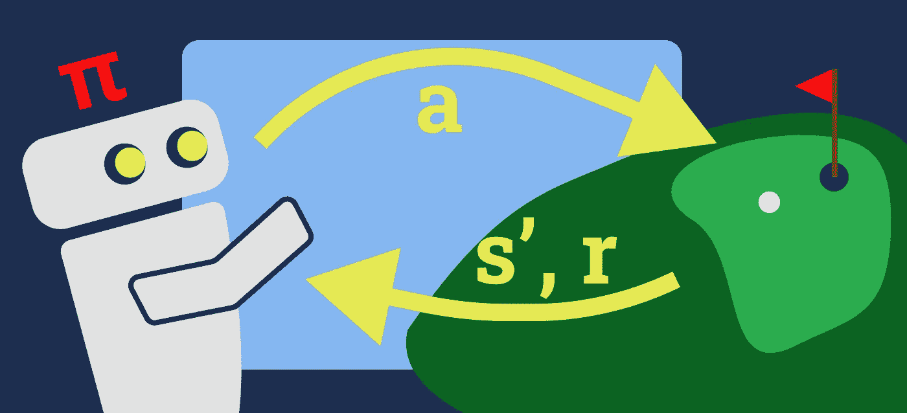

价值迭代（VI）通常是强化学习（RL）学习路径中首先引入的算法之一。该算法的基本细节介绍了 RL 的一些最基本的方面，因此，在进阶到更复杂的 RL 算法之前，掌握 VI 是很重要的。然而，这可能有些难以理解。

本文旨在成为一个易于理解的价值迭代（VI）介绍，假设读者对强化学习领域是新的。让我们开始吧。

已经了解了 RL 的基础知识？→ **跳到如何使用价值迭代**。

## 强化学习的基础

让我们从教科书定义开始，然后用一个简单的例子来解释。

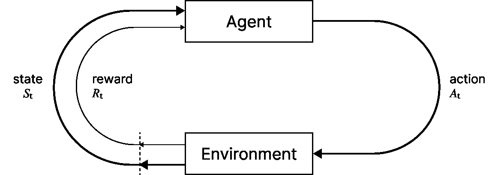

强化学习训练过程概述

强化学习（RL）是除了监督学习和无监督学习之外的三大主要机器学习范式之一。RL 不是单一的算法，而是一个框架，涵盖了一系列技术和方法，用于教导代理在其环境中学习和做出决策。

在 RL 中，代理通过采取各种动作与环境互动。当这些动作导致期望的状态时，代理会获得奖励；当动作未达到期望的状态时，代理会受到惩罚。代理的目标是学习一个策略，称为策略（policy），该策略指导其行动以最大化其随着时间积累的奖励。这个试错过程精炼了代理的行为策略，使其在环境中采取最优或接近最优的行为。

*理查德·S·萨顿和安德鲁·G·巴托的《强化学习导论》一书被认为是该领域的最佳读物之一，对于那些希望深入理解 RL 的人来说..而且它是* [*免费提供的*](http://incompleteideas.net/book/the-book-2nd.html)*！*

## 让我们定义一个示例问题

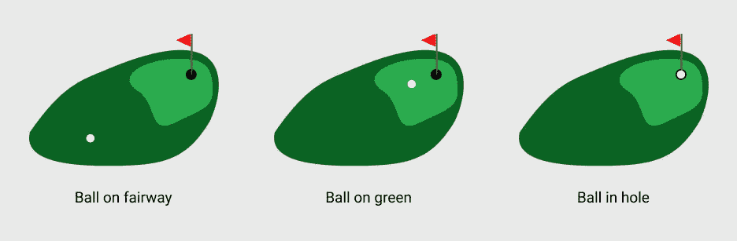

高尔夫游戏中的可能状态

这张图片以最简单的形式描绘了高尔夫游戏。我们将使用这个例子，因为高尔夫有一个明确的目标——把球打进洞里。

在我们的示例中，高尔夫球可以处于三种位置之一：*在球道上*；*在果岭上*；或*在洞里*。我们从球道开始，目标是每次击球都靠近洞，洞位于果岭上。

在强化学习（RL）中，这些位置中的每一个被称为***状态***或***环境状态***。你可以把状态看作是当前环境（高尔夫球场）的快照，同时记录球的位置。

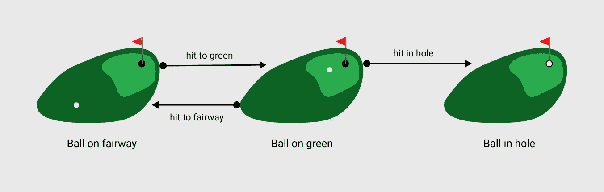

高尔夫球游戏中的可能动作

在我们的游戏中，***代理***进行击球动作，开始时处于*球在球道上*状态。***代理***仅指控制进行***动作***的实体。我们的游戏有三种可用的动作：*击球到球道*；*击球到果岭*；以及*击球进洞*。

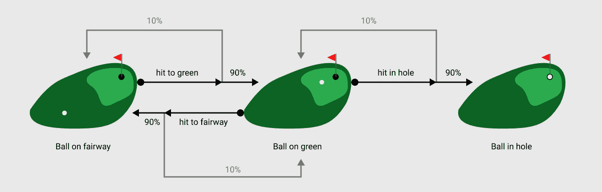

高尔夫游戏中的转移概率

当然，当你击球时，球可能不会落在你想要的位置。因此，我们引入了一个***转移函数***，通过一些概率权重将动作与状态关联起来。

例如，当我们从球道上击球时，可能会偏离果岭，仍然停留在球道上。用 RL 的术语来说，如果我们处于*球在球道上*状态，并采取*击球到果岭*的动作，则有 90%的概率进入*球在果岭上*状态，但也有 10%的概率重新进入*球在球道上*状态。

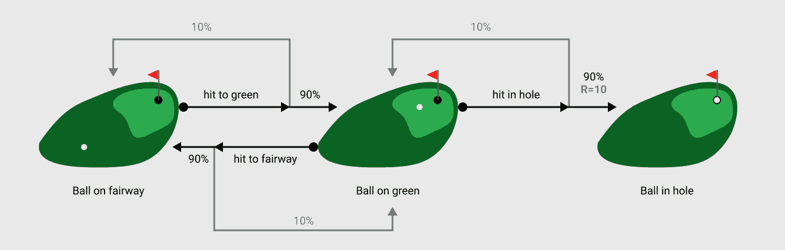

将球击入洞中的奖励为 10

每当代理执行一个动作时，我们称之为在环境中的 ***步***。根据刚刚采取的动作，代理观察到它所处的新状态以及一个 ***奖励***。奖励函数是一个激励机制，用于引导代理朝正确方向前进。换句话说，我们设计奖励函数以塑造代理的期望行为。在我们简化的高尔夫示例中，我们为将球击入洞中的行为提供 10 的奖励。

*环境动态（转换和奖励函数）的设计不是一项简单的任务。如果环境未能代表你试图解决的问题，代理将学习到一个反映不正确问题的正确解决方案的策略。我们在这里不讨论这些设计元素，但值得注意。*

## 马尔可夫决策过程

为了以代理能够理解的方式表示问题，我们必须将其形式化为马尔可夫决策过程（MDP）。

MDP 是一种数学模型，它以结构化的方式描述了我们的问题。它将代理与环境的互动表示为一个顺序决策过程（即，一个接一个的动作）。

它由环境动态组成（我将添加一些数学符号以简化说明）：

+   一个有限的状态集合 **s ∈ S**。

+   一个有限的动作集合 ***a* ∈ *A***。

+   一个转换函数 ***T*(*s*′∣*s*,*a*)** 返回在当前状态 ***s*** 和当前动作 ***a*** 下达到状态 ***s*′** 的概率。

+   一个奖励函数 ***R*(*s*,*a*,*s*′)** 基于从状态 ***s*** 到达下一个状态 ***s*′** 的情况返回一个标量奖励，并考虑采取动作 ***a***。

*注意，如果状态之间的转换涉及某些不确定性或随机性（即在相同状态下两次采取相同动作可能导致不同结果），我们称之为* ***随机*** *MDP。我们也可以创建一个* ***确定性*** *MDP，其中转换和奖励是完全可预测的。这意味着当代理在特定状态下采取一个动作时，动作与结果状态及奖励之间是一一对应的。*

以 MDP 形式可视化，我们的高尔夫问题看起来与之前描述的图像几乎相同。我们将使用 S = {s1, s2, s3} 作为简写。

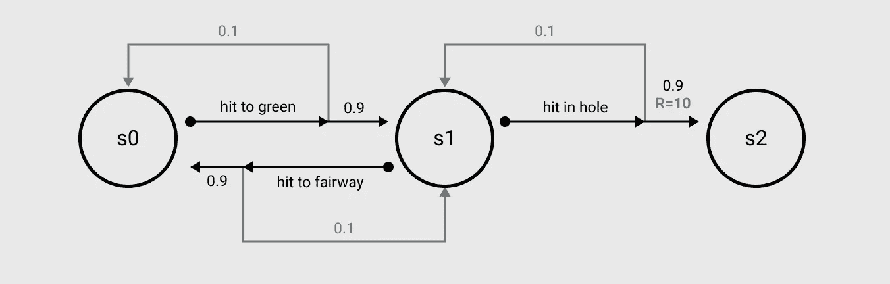

我们的高尔夫示例问题以 MDP 形式呈现

*MDP 的使用假设环境中接下来会发生的事情只依赖于现在的状态和动作，而不依赖于之前发生的事情。这被称为* **马尔可夫性质** *，它在强化学习中很重要，因为它降低了计算复杂性。我稍后会详细解释这一点。*

## 什么是价值迭代？

值迭代（VI）是一种用于解决类似于上述高尔夫球例子中的强化学习（RL）问题的算法，其中我们对 MDP 的所有组件有完全的了解。它通过迭代改进对每个状态“价值”的估计来实现。它通过考虑不同可用动作时的即时奖励和期望的未来奖励来完成这项工作。这些值通过一个值表进行跟踪，该表在每一步都会更新。最终，这一系列的改进将会收敛，产生一个状态 → 动作映射的最优策略，使代理可以在给定环境中做出最佳决策。

VI 利用 *动态规划* 的概念，其中将一个大问题分解成较小的子问题来解决。为了在 VI 中实现这一点，使用 *贝尔曼方程* 来指导迭代更新每个状态的价值估计的过程，提供一个递归关系，用于表示状态的价值与其邻近状态的价值之间的关系。

现在这可能不太容易理解。学习 VI 的最简单方法是逐步分解，我们就这样做吧。

## 值迭代算法是如何工作的？

下图展示了算法的步骤。不要被吓到，它比看起来更简单。

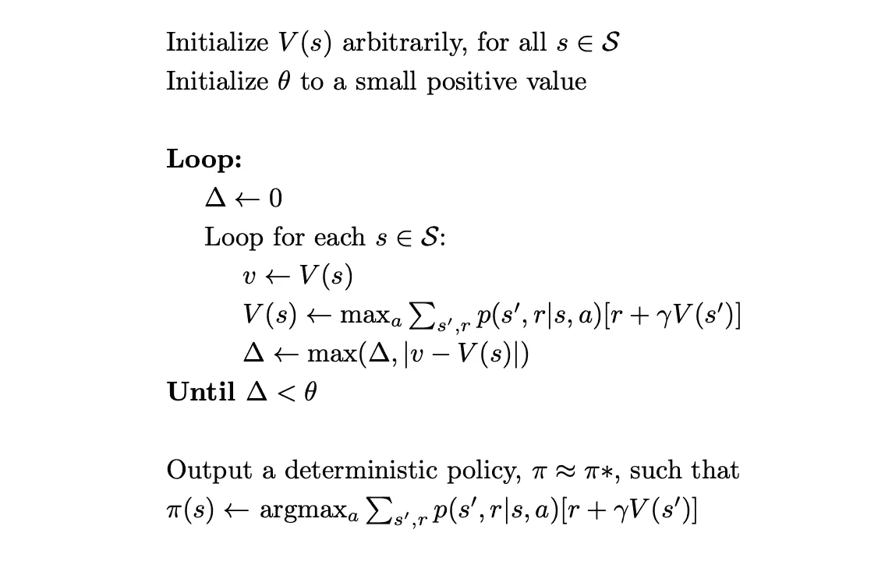

值迭代算法

首先，我们需要为我们的训练定义一些参数。

+   Theta **θ** 代表收敛的阈值。一旦我们达到 **θ**，就可以终止训练循环并生成策略。它本质上只是一种确保我们创建的策略足够准确的方法。如果我们过早停止训练，可能无法学习到最佳的行动。

+   Gamma **γ** 代表 *折扣因子*。这是一个值，决定了我们的代理对未来奖励的重视程度与对即时奖励的重视程度相比。较高的折扣因子（接近 1）表示代理更重视长期奖励，而较低的折扣因子（接近 0）则更强调即时奖励。

*为了更好地理解折扣因子，考虑一个玩国际象棋的 RL 代理。假设你有机会在下一步捕获对手的皇后，这将带来显著的即时奖励。然而，你还注意到，通过现在牺牲一个不太重要的棋子，你可以为未来的优势铺平道路，可能会导致将死并获得更大的奖励。折扣因子帮助你平衡这个决定。*

**(1) 初始化：** 现在我们已经定义了参数，我们想要初始化我们所有状态的 *价值函数* ***V(s)***。这通常意味着我们将每个状态的所有值设置为 0（或其他任意常数）。可以把价值函数想象成一个表格，跟踪每个状态的值，并频繁更新。

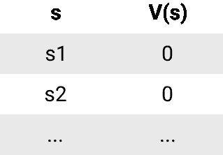

初始化的值表

**(2) 外层循环：** 现在一切都准备好了，我们可以开始更新值的迭代过程。我们从外层循环开始，它会重复直到收敛标准满足（直到 Δ < θ）。

在每次外层循环中，我们首先设置Δ = 0。**Δ** 用来表示所有状态的价值估计变化，算法继续迭代，直到这一变化Δ低于指定的阈值θ。

**(3) 内层循环：** 对于每个状态 *s* 在 *S* 中，我们：

+   将变量 ***v*** 设置为当前状态的价值 ***V(s)***，记住 - 这是从我们的价值表中获取的（所以在第一次遍历时，***v*** = ***V(s)*** = 0）

+   执行贝尔曼方程来更新 ***V(s)***

+   更新 **Δ**（我们稍后会回来讨论）

**贝尔曼方程**

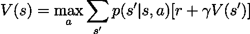

算法的这一行是最重要的。它要求我们更新当前循环中所看的状态的价值。这个价值是通过考虑从那个特定状态所有可用的动作（前瞻 1 步）来计算的。当我们采取这些可能的动作时，它会给我们一组可能的下一个状态 ***s*′** 和相应的奖励 ***r.***

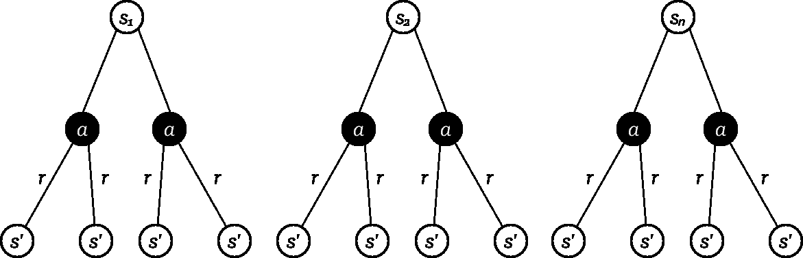

所以，对于每一个下一个状态 ***s*′** 和相应的奖励 ***r***，我们执行 ***p(s′, r|s, a)[r + γV(s′)].*** 让我们分解一下：

+   ***p(s′, r|s, a)*** 在状态 ***s*** 中，采取动作 ***a*** 并最终到达下一个状态 ***s*′** 的概率（这只是我们的转移函数）

+   ***[r + γV(s′)]*** 下一个状态 ***s*′** 的奖励 ***r***（我们从奖励函数中得到这个值） *+* 我们的折扣 **γ** * 乘以下一个状态的价值 ***s*′**（我们从价值表中得到这个值）

+   然后我们将这两个部分 ***p(s′, r|s, a) * [r + γV(s′)]*** 相乘

记住，这个计算只是针对**一个**下一个状态 ***s′***（树的第三层），我们需要对每一个可能的下一个状态 ***s′*** 在采取 ***a.*** 后重复这个过程。

一旦完成这一步，我们将所有刚获得的结果 ***Σₛ′, ᵣ p(s′, r|s, a) * [r + γV(s′)].*** 汇总起来。然后我们对每个动作 ***a*** 进行重复（树中的第二层）。

一旦完成这些步骤，我们将为当前状态 ***s*** 在内层循环中看到的每个可能的动作 ***a*** 关联一个值。我们使用 ***maxₐ*** 选择最高的，并将其设置为该状态的新值 ***V(s)←maxₐ Σₛ′, ᵣ p(s′, r|s, a) * [r + γV(s′)].***

记住，这个过程只涵盖了一个状态 ***s***（树的第一层）

*如果我们在编程，这将是树中每一层的 3* ***for*** *循环：*

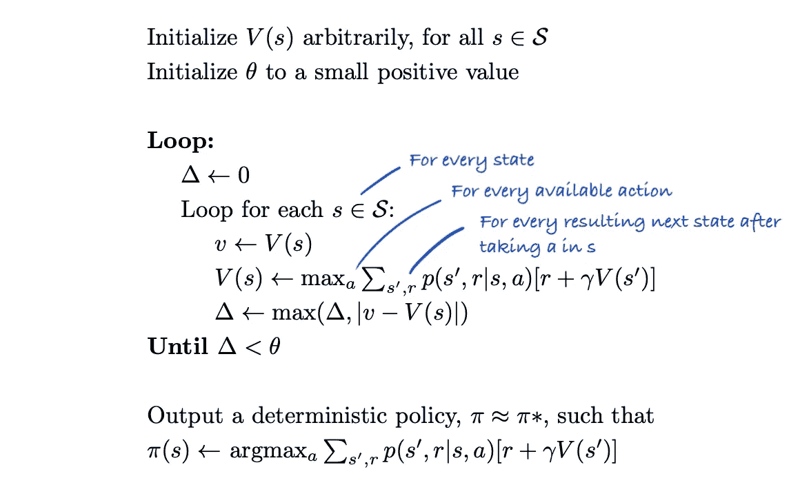

**(3) 内循环（继续）：** 在移动到内循环的下一次迭代之前，我们对当前***Δ***的值和该状态***v***的前一个值与刚计算的状态新值***V(s)***之间的差异进行比较。我们将***Δ***更新为这两者中的较大者：***Δ ← max(Δ,| v - V(s)|)***。这有助于我们跟踪离收敛的距离。

好的，这个过程完成了一次内循环的操作。 **我们对 S 中的每个 s 执行第（3）步**，然后再退出内循环并对收敛条件***Δ < θ***进行检查。如果满足此条件，我们退出外循环，否则返回第（2）步。

**(4) 策略提取：** 到目前为止，我们可能已经进行了多次外循环，直到收敛。这意味着我们的值表将被更新为表示每个状态的最终值（换句话说，‘处于每个状态的好处’）。我们现在可以从中提取策略。

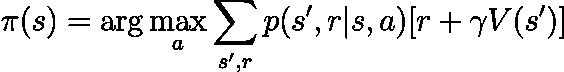

记住，策略**π**本质上是**状态 → 动作**的映射，对于每个状态，它选择最大化期望回报的动作。要计算这一点，我们执行与之前完全相同的过程，但不是使用***maxₐ***获得状态***s***的值，而是使用***argmaxₐ***获得给我们最佳值的动作***a***。

就这样！

***策略迭代*** *是另一种动态规划算法。它类似于 VI，只是它在通过使策略相对于当前值函数变得贪婪来改进策略和评估策略的表现直到收敛之间交替进行，通常需要较少的迭代但每次迭代需要更多计算。*

## 使用值迭代解决示例

一旦完成示例问题，VI 应该更有意义，所以让我们回到我们的高尔夫 MDP。我们已将其形式化为 MDP，但目前，代理不知道打高尔夫的最佳策略，因此让我们使用 VI 解决高尔夫 MDP。


我们将开始使用相当标准的值来定义我们的模型参数：

```py
γ = 0.9 // discount factor
θ = 0.01 // convergence threshold
```

然后我们将对***S***中的状态初始化我们的值表为 0：

```py
// value table

V(s0) = 0
V(s1) = 0
V(s2) = 0
```

我们现在可以开始外循环：

```py
Δ = 0
```

对于***S***中的每个状态，进行三次内循环：

```py
// Bellman update rule
// V(s) ← maxₐ Σₛ′, ᵣ p(s′, r|s, a) * [r + γV(s′)]

//******************* state s0 *******************//

v = 0

// we have only looked at one action here as only one is available from s0
// we know that the others are not possible and would therefore sum to 0

V(s0) = max[T(s0 | s0, hit to green) * (R(s0, hit to green, s0) + γ * V(s0)) +
            T(s1 | s0, hit to green) * (R(s0, hit to green, s1) + γ * V(s1))]

V(s0) = max[0.1 * (0 + 0.9 * 0) + 
            0.9 * (0 + 0.9 * 0)]

V(s0) = max[0] = 0

// Delta update rule
// Δ ← max(Δ,| v - V(s)|)

Δ = max[Δ, |v - v(s0)|] = max[0, |0 - 0|] = 0

//******************* state s1 *******************//

v = 0

// there are 2 available actions here

V(s1) = max[T(s0 | s1, hit to fairway) * (R(s1, hit to fairway, s0) + γ * V(s0)) + 
            T(s1 | s1, hit to fairway) * (R(s1, hit to fairway, s1) + γ * V(s1)),
            T(s1 | s1, hit in hole) * (R(s1, hit in hole, s1) + γ * V(s1)) + 
            T(s2 | s1, hit in hole) * (R(s1, hit in hole, s2) + γ * V(s2))]

V(s1) = max[0.9 * (0 + 0.9 * 0) + 
            0.1 * (0 + 0.9 * 0),
            0.1 * (0 + 0.9 * 0) + 
            0.9 * (10 + 0.9 * 0)]

V(s1) = max[0, 9] = 9

Δ = max[Δ, |v - v(s1)|] = max[0, |0 - 9|] = 9

//******************* state s2 *******************//

// terminal state with no actions
```

这为我们的值表提供了以下更新：

```py
V(s0) = 0
V(s1) = 9
V(s2) = 0
```

*我们不需要担心* ***s2*** *，因为这是一个终止状态，意味着这里不可能进行任何操作。*

我们现在分离内循环，继续外循环，对以下内容进行收敛检查：

```py
Δ < θ = 9 < 0.01 = **False**
```

由于尚未收敛，我们进行外循环的第二次迭代：

```py
Δ = 0
```

另进行 3 次内循环，使用更新后的值表：

```py
//******************* state s0 *******************//

v = 0

V(s0) = max[T(s0 | s0, hit to green) * (R(s0, hit to green, s0) + γ * V(s0)) +
            T(s1 | s0, hit to green) * (R(s0, hit to green, s1) + γ * V(s1))]

V(s0) = max[0.1 * (0 + 0.9 * 0) + 
            0.9 * (0 + 0.9 * 9)]

V(s0) = max[7.29] = 7.29

Δ = max[Δ, |v - v(s0)|] = max[0, |0 - 7.29|] = 7.29

//******************* state s1 *******************//

v = 9

V(s1) = max[T(s0 | s1, hit to fairway) * (R(s1, hit to fairway, s0) + γ * V(s0)) + 
            T(s1 | s1, hit to fairway) * (R(s1, hit to fairway, s1) + γ * V(s1)),
            T(s1 | s1, hit in hole) * (R(s1, hit in hole, s1) + γ * V(s1)) + 
            T(s2 | s1, hit in hole) * (R(s1, hit in hole, s2) + γ * V(s2))]

V(s1) = max[0.9 * (0 + 0.9 * 7.29) + 
            0.1 * (0 + 0.9 * 9),
            0.1 * (0 + 0.9 * 9) + 
            0.9 * (10 + 0.9 * 0)]

V(s1) = max(6.7149, 9.81) = 9.81

Δ = max[Δ, |v - v(s1)|] = max[7.29, |9 - 9.81|] = 7.29

//******************* state s2 *******************//

// terminal state with no actions
```

在第二次迭代结束时，我们的值是：

```py
V(s0) = 7.29
V(s1) = 9.81
V(s2) = 0
```

再次检查收敛：

```py
Δ < θ = 7.29 < 0.01 = **False**
```

仍未收敛，所以我们继续上述过程，直到 Δ < θ。我不会展示所有计算，以上两个步骤足以理解过程。

经过 6 次迭代，我们的策略已经收敛。这是我们的价值和收敛率在每次迭代中的变化情况：

```py
Iteration   V(s0)        V(s1)        V(s2)        Δ             Converged
1           0            9            0            9             False
2           7.29         9.81         0            7.29          False
3           8.6022       9.8829       0            1.3122        False
4           8.779447     9.889461     0            0.177247      False
5           8.80061364   9.89005149   0            0.02116664    False
6           8.8029969345 9.8901046341 0            0.0023832945  True
```

现在我们可以提取我们的策略：

```py
// Policy extraction rule
// π(s) = argmaxₐ Σₛ′, ᵣ p(s′, r|s, a) * [r + γV(s′)]

//******************* state s0 *******************//

// we know there is only one possible action from s0, but let's just do it anyway

π(s0) = argmax[T(s0 | s0, hit to green) * (R(s0, hit to green, s0) + γ * V(s0)) +
            T(s1 | s0, hit to green) * (R(s0, hit to green, s1) + γ * V(s1))

π(s0) = argmax[0.1 * (0 + 0.9 * 8.8029969345) + 
            0.9 * (0 + 0.9 * 9.8901046341)]

π(s0) = argmax[8.80325447773]

π(s0) = hit to green

//******************* state s1 *******************//

π(s1) = argmax[T(s0 | s1, hit to fairway) * (R(s1, hit to fairway, s0) + γ * V(s0)) + 
            T(s1 | s1, hit to fairway) * (R(s1, hit to fairway, s1) + γ * V(s1)),
            T(s1 | s1, hit in hole) * (R(s1, hit in hole, s1) + γ * V(s1)) + 
            T(s2 | s1, hit in hole) * (R(s1, hit in hole, s2) + γ * V(s2))]

V(s1) = max[0.9 * (0 + 0.9 * 8.8029969345) + 
            0.1 * (0 + 0.9 * 9.8901046341),
            0.1 * (0 + 0.9 * 9.8901046341) + 
            0.9 * (10 + 0.9 * 0)]

π(s1) = argmax[8.02053693401, 9.89010941707]

π(s1) = hit in hole
```

我们的最终策略是：

```py
π(s0) = hit to green
π(s1) = hit in hole
π(s2) = terminal state (no action)
```

所以，当我们的智能体处于 ***球在球道上*** 状态（s0）时，最佳行动是 ***击球到果岭***。这似乎很明显，因为这是唯一可用的行动。然而，在 ***s1*** 中，那里有两个可能的行动，我们的策略已经学会了 ***打入洞中***。我们现在可以将这个学到的策略提供给其他想打高尔夫的智能体！

就是这样！我们刚刚使用价值迭代解决了一个非常简单的 RL 问题。

## 动态编程的局限性

需要注意的是，价值迭代以及其他动态编程算法都有其局限性。首先，它假设我们对 MDP 的动态有完全的了解（我们称之为***基于模型的 RL***）。然而，在实际问题中这种情况很少见，例如，我们可能不知道转移概率。对于这种情况，我们需要使用其他方法，如*Q-learning*（***无模型 RL***）。

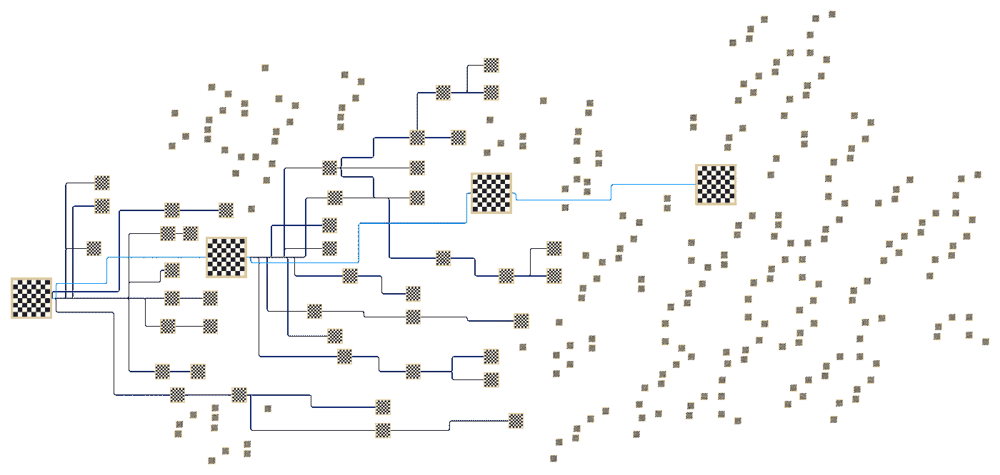

国际象棋中的维度诅咒

其次，对于更大的问题，随着状态和动作数量的增加，价值表的大小会呈指数增长（想象一下尝试定义所有可能的国际象棋状态）。这导致了‘*维度诅咒*’问题，其中计算和内存需求迅速增加，使得将 DP 应用于高维问题变得具有挑战性。

然而，VI 学习是很棒的，因为它介绍了一些 RL 的关键基础概念，这些概念构成了你可能会继续学习的更复杂算法的基础。

## 感谢阅读！

我希望这篇文章提供了一个易于理解的强化学习介绍，特别是价值迭代。

*如果你在这里学到了新的知识，请点赞👏并关注！*

除非另有说明，所有图片均由作者创作。
