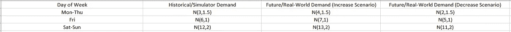
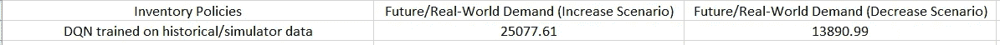
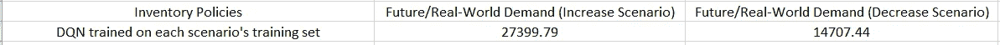
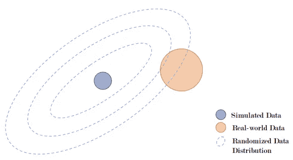
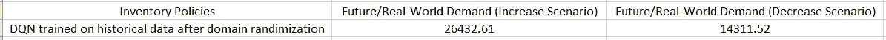

# 强化学习在库存优化中的应用系列 III：从模拟到现实的 RL 模型转移

> 原文：[`towardsdatascience.com/reinforcement-learning-for-inventory-optimization-series-iii-sim-to-real-transfer-for-the-rl-model-d260c3b8277d?source=collection_archive---------10-----------------------#2023-01-30`](https://towardsdatascience.com/reinforcement-learning-for-inventory-optimization-series-iii-sim-to-real-transfer-for-the-rl-model-d260c3b8277d?source=collection_archive---------10-----------------------#2023-01-30)

## 弥合模拟器与现实世界之间的差距

[](https://medium.com/@guanx92?source=post_page-----d260c3b8277d--------------------------------)[](https://towardsdatascience.com/?source=post_page-----d260c3b8277d--------------------------------) [Guangrui Xie](https://medium.com/@guanx92?source=post_page-----d260c3b8277d--------------------------------)

·

[关注](https://medium.com/m/signin?actionUrl=https%3A%2F%2Fmedium.com%2F_%2Fsubscribe%2Fuser%2F495b92f0c66d&operation=register&redirect=https%3A%2F%2Ftowardsdatascience.com%2Freinforcement-learning-for-inventory-optimization-series-iii-sim-to-real-transfer-for-the-rl-model-d260c3b8277d&user=Guangrui+Xie&userId=495b92f0c66d&source=post_page-495b92f0c66d----d260c3b8277d---------------------post_header-----------) 发表在 [数据科学前沿](https://towardsdatascience.com/?source=post_page-----d260c3b8277d--------------------------------) · 8 分钟阅读 · 2023 年 1 月 30 日[](https://medium.com/m/signin?actionUrl=https%3A%2F%2Fmedium.com%2F_%2Fvote%2Ftowards-data-science%2Fd260c3b8277d&operation=register&redirect=https%3A%2F%2Ftowardsdatascience.com%2Freinforcement-learning-for-inventory-optimization-series-iii-sim-to-real-transfer-for-the-rl-model-d260c3b8277d&user=Guangrui+Xie&userId=495b92f0c66d&source=-----d260c3b8277d---------------------clap_footer-----------)

--

[](https://medium.com/m/signin?actionUrl=https%3A%2F%2Fmedium.com%2F_%2Fbookmark%2Fp%2Fd260c3b8277d&operation=register&redirect=https%3A%2F%2Ftowardsdatascience.com%2Freinforcement-learning-for-inventory-optimization-series-iii-sim-to-real-transfer-for-the-rl-model-d260c3b8277d&source=-----d260c3b8277d---------------------bookmark_footer-----------)

照片由 [Suad Kamardeen](https://unsplash.com/@suadkamardeen?utm_source=medium&utm_medium=referral) 提供，来源于 [Unsplash](https://unsplash.com/?utm_source=medium&utm_medium=referral)

更新：这篇文章是我博客系列*库存优化中的强化学习*的第三篇文章。以下是同一系列其他文章的链接。如果您感兴趣，请查看。

[*库存优化中的强化学习系列 I：单一零售商的 RL 模型*](https://medium.com/towards-data-science/a-reinforcement-learning-based-inventory-control-policy-for-retailers-ac35bc592278)

[*库存优化中的强化学习系列 II：多级网络的 RL 模型*](https://medium.com/towards-data-science/reinforcement-learning-for-inventory-optimization-series-ii-an-rl-model-for-a-multi-echelon-921857acdb00)

在之前的文章中，我为单一零售商和多级供应链网络构建了两个 RL 模型。在这两篇文章中，我使用了基于历史需求数据的库存系统模拟器来训练 RL 模型，这些数据遵循不同正态分布的混合，其参数依赖于星期几。然后，我在一个测试集上测试了 RL 模型，其中的需求数据与历史训练数据的分布相同。这实际上假设模拟器与我们应用 RL 模型的现实世界完全匹配，且历史需求数据完全代表未来需求模式。然而，这一假设在实际应用中很少成立。

如何处理训练集与测试集之间分布的差距是机器学习领域中的一个著名问题。这个问题的核心是偏差与方差的权衡。如果我们过于依赖训练集来训练模型，那么模型容易过拟合，意味着它只会在训练集上表现良好，而在测试集上表现不佳。在 RL 领域也是如此。

# 由于模拟器与现实世界之间的差距导致的性能退化

以我之前构建的 RL 模型为例，这些模型通过大量的历史需求数据进行训练，因此很可能从训练的 RL 模型中学习到的库存政策过度拟合了历史需求数据所代表的需求模式。如果未来的需求模式继续保持相同，库存政策将表现良好，但如果未来的需求模式偏离历史模式，性能将会退化。

作为一个数值示例，假设未来需求分布在现实世界中偏离了用于训练 RL 模型的模拟器中的历史需求数据。我将[我第一篇文章](https://medium.com/towards-data-science/a-reinforcement-learning-based-inventory-control-policy-for-retailers-ac35bc592278)中训练的 RL 模型应用于现实世界的两个未来需求场景。在一个场景中，我们假设正态分布的均值增加 1，而在另一个场景中，均值减少 1。需求分布结构如下表所示。



两个未来/现实世界需求分布场景（图片由作者提供）

对于需求增加场景和需求减少场景（如上表的第二列和第三列），我生成了 100 个需求数据集，每个数据集包含 52 周的数据，使用其自身的需求分布设置。然后，我将基于历史/模拟器需求数据（如上表的第一列）训练的 DQN 策略应用于这两个场景，得到的平均利润如下表所示。



应用训练于历史/模拟器数据的 DQN 策略到每个需求场景中获得的平均利润（图片由作者提供）

为了评估训练的 DQN 策略表现如何，对于每个需求场景，假设我们知道未来/现实世界需求分布将如何偏离，并生成一个由 52 周需求数据组成的训练集，使用其自身的未来/现实世界需求分布设置。然后，我们为每个场景训练一个全新的 RL 模型，并将新 RL 模型应用于每个场景。得到的平均利润如下表所示。



应用训练于每个场景的训练集的 DQN 策略到每个需求场景中获得的平均利润（图片由作者提供）

从上面两张表的比较（$25077.61 对比 $27399.79 和 $13890.99 对比 $14707.44）可以看出，如果模拟器与现实世界之间存在差距，RL 模型的性能会下降。

# 使用领域随机化弥合差距

为了弥合模拟器和现实世界之间的差距，在实际应用中，可以选择最近一段时间的历史需求数据，并假设这段较短的时间更好地代表了未来需求模式或趋势。然后，我们可以通过使用最近更新的较短历史需求数据频繁重新训练 RL 模型。然而，我们也可以尝试在训练过程中使用领域随机化的概念来解决这个问题。

领域随机化是一种通常用于将模拟转移到实际的技术，尤其是在将强化学习应用于机器人时。机器人中的强化学习应用也面临现实差距的问题，因为模拟与现实世界之间的差距会降低将强化学习模型转移到实际机器人中的策略的性能[1]。在机器人领域，领域随机化的核心思想是通过在训练强化学习模型时随机化模拟环境的物理参数（例如摩擦系数和视觉属性如物体外观），强化学习模型将体验到更接近真实环境的情况，从而学习到的策略会更好地推广到实际环境中。下图展示了领域随机化的直觉。



领域随机化的直觉（图片来源于参考文献 [1]）

在库存优化的背景下，为了实现领域随机化，我们可以对历史需求数据进行随机化。具体而言，我们通过向需求观察值中添加正态分布噪声来扩展历史需求数据集。该想法的实现见下方代码块。

```py
import numpy as np
import matplotlib.pyplot as plt
np.random.seed(0)
demand_hist = []
for i in range(52):
    for j in range(4):
        random_demand = np.random.normal(3, 1.5)
        if random_demand < 0:
            random_demand = 0
        random_demand = np.round(random_demand)
        demand_hist.append(random_demand)
    random_demand = np.random.normal(6, 1)
    if random_demand < 0:
        random_demand = 0
    random_demand = np.round(random_demand)
    demand_hist.append(random_demand)
    for j in range(2):
        random_demand = np.random.normal(12, 2)
        if random_demand < 0:
            random_demand = 0
        random_demand = np.round(random_demand)
        demand_hist.append(random_demand)
plt.hist(demand_hist)

## add randomized noise
demand_hist_randomized = []
rand_list = []
for k in range(10):
    demand = demand_hist.copy()
    rand1 = np.random.normal(1, 1)
    rand2 = np.random.normal(1, 1)
    rand3 = np.random.normal(1, 1)
    rand_list.append([rand1,rand2,rand3])
    for i in range(52):
        for j in range(4):
            demand[i*7+j] += rand1
            if demand[i*7+j] < 0:
                demand[i*7+j] = 0
            demand[i*7+j] = np.round(demand[i*7+j])
        demand[i*7+4] += rand2
        if demand[i*7+4] < 0:
            demand[i*7+4] = 0
        demand[i*7+4] = np.round(demand[i*7+4])
        for j in range(5,7):
            demand[i*7+j] += rand3
            if demand[i*7+j] < 0:
                demand[i*7+j] = 0
            demand[i*7+j] = np.round(demand[i*7+j])
    demand_hist_randomized.extend(demand) 
```

在这里，我通过向每个场景的需求观察值中添加随机噪声来创建了 10 个历史需求场景。然后我将这些场景组合在一起，作为用于训练的完整历史需求数据，假装我们有 10 年的需求数据。请注意，这个想法的本质也与计算机视觉任务中的数据增强技术相一致，我们通过操控图像来丰富训练集，以避免过拟合。

我尝试了不同的正态分布均值来生成随机噪声。最初，我认为使用均值为 0 是有意义的，因为它更有可能生成相等数量的需求增加和减少场景。有趣的是，在尝试了不同的值之后，我发现将均值设置为 0 以上（更多的需求增加场景）在这个特定的例子中得到了更好的测试结果。这可能是因为需求数据在 0 处被截断，因此尽管我们生成均值为 0 的噪声，但需求分布向左移动的空间不大。所以生成均值为正数的噪声会使强化学习模型学到更多有用的知识。

现在我们使用通过领域随机化获得的新 10 年历史需求数据来训练 DQN 模型，然后将学习到的 DQN 策略应用于上一节中描述的需求增加和减少场景（详见第一个表）。下表展示了每个场景中获得的平均利润。



使用领域随机化后训练的 DQN 策略在每个场景中获得的平均利润（图片由作者提供）

我们看到，与没有领域随机化的结果相比，明显有所改善（增加场景中为 $26432.61 对 $25077.61，减少场景中为 $14311.52 对 $13890.99）。

为了表明性能提升不是偶然获得的，我进一步创建了更多随机化的测试需求场景，通过对需求分布的均值和方差添加随机噪声。见下面的`代码`。

```py
demand_test = []
for k in range(100,200):
    np.random.seed(k)
    rand1 = np.random.normal(0,1)
    rand2 = np.random.normal(0,1)
    rand3 = np.random.normal(0,1)
    rand4 = np.random.normal(0,0.5)
    rand5 = np.random.normal(0,0.5)
    rand6 = np.random.normal(0,0.5)
    demand_future = []
    for i in range(52):
        for j in range(4):
            random_demand = np.random.normal(3+rand1, 1.5+rand4)
            if random_demand < 0:
                random_demand = 0
            random_demand = np.round(random_demand)
            demand_future.append(random_demand)
        random_demand = np.random.normal(6+rand2, 1+rand5)
        if random_demand < 0:
            random_demand = 0
        random_demand = np.round(random_demand)
        demand_future.append(random_demand)
        for j in range(2):
            random_demand = np.random.normal(12+rand3, 2+rand6)
            if random_demand < 0:
                random_demand = 0
            random_demand = np.round(random_demand)
            demand_future.append(random_demand)
    demand_test.append(demand_future)
```

在领域随机化之前，DQN 策略在该测试集上的平均利润为 $20163.84，而领域随机化之后的 DQN 策略平均利润为 $21887.77，这仍然显示出性能的提升。

# **结论**

在这篇文章中，我重点指出并解决了我为库存优化构建的 RL 模型在训练/仿真和测试/现实世界环境之间的差距。很高兴看到，像领域随机化这样的技术在机器人领域中也能在库存优化领域发挥作用。实验结果表明，使用领域随机化等技术来操控历史需求数据以丰富训练集应该是一种良好的实践，这样实验室中训练的 RL 模型可以更好地推广到现实世界。

# 参考文献

[1] [深度强化学习在机器人领域的仿真到现实迁移：综述](https://arxiv.org/abs/2009.13303)
