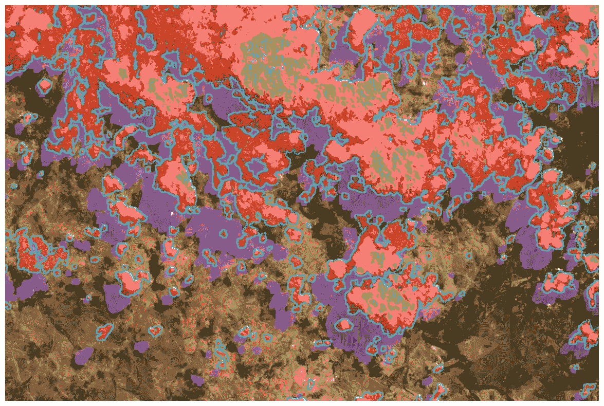

# 使用 Python 去除 Landsat 卫星图像中的云层

> 原文：[`towardsdatascience.com/removing-clouds-from-landsat-satellite-images-with-python-246e73494bc?source=collection_archive---------8-----------------------#2023-05-29`](https://towardsdatascience.com/removing-clouds-from-landsat-satellite-images-with-python-246e73494bc?source=collection_archive---------8-----------------------#2023-05-29)

## 计算你感兴趣区域的云覆盖，去除云层并使用其他卫星图像进行填补

 [Conor O'Sullivan](https://conorosullyds.medium.com/?source=post_page-----246e73494bc--------------------------------)

·

[关注](https://medium.com/m/signin?actionUrl=https%3A%2F%2Fmedium.com%2F_%2Fsubscribe%2Fuser%2F4ae48256fb37&operation=register&redirect=https%3A%2F%2Ftowardsdatascience.com%2Fremoving-clouds-from-landsat-satellite-images-with-python-246e73494bc&user=Conor+O%27Sullivan&userId=4ae48256fb37&source=post_page-4ae48256fb37----246e73494bc---------------------post_header-----------) 发表在 [Towards Data Science](https://towardsdatascience.com/?source=post_page-----246e73494bc--------------------------------) ·14 分钟阅读·2023 年 5 月 29 日

--

(来源: 作者)

我们的技术已经进步到征服浩瀚宇宙的地步。我们发射了配备最先进传感器的卫星，以监测我们变化的星球。然而，一个对手却使这些先进系统感到无力——云层。

无论你是想比较光谱指数的价值，还是在卫星图像上训练机器学习模型，云层都是一个问题。因此，我们将深入探讨如何使用云掩码来：

+   计算你感兴趣区域的**云覆盖百分比**

+   **去除** 图像中的云层

+   使用不同日期拍摄的图像来**修复**云像素

在实际掩膜方面，我们将探索两个选项：

+   在**Landsat QA 文件**中提供的（QA_PIXEL.tif）

+   替代的**机器学习方法**

我们将解释用于实现此功能的 Python 代码，完整项目可以在[GitHub](https://github.com/conorosully/medium-articles/blob/master/src/remote%20sensing/landsat_clouds.ipynb)上找到。让我们来清理这些天空！

# 下载卫星图像
