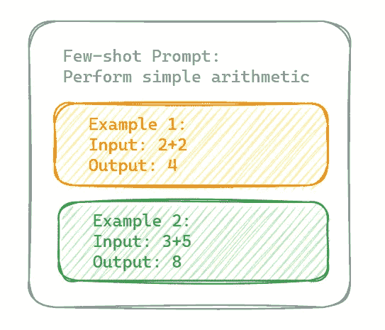
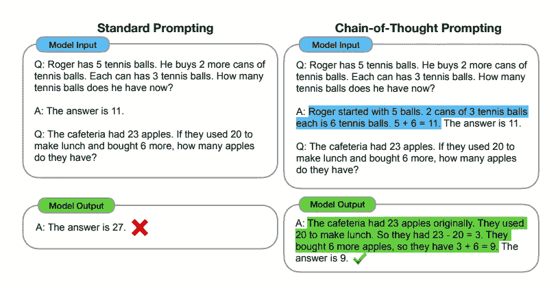
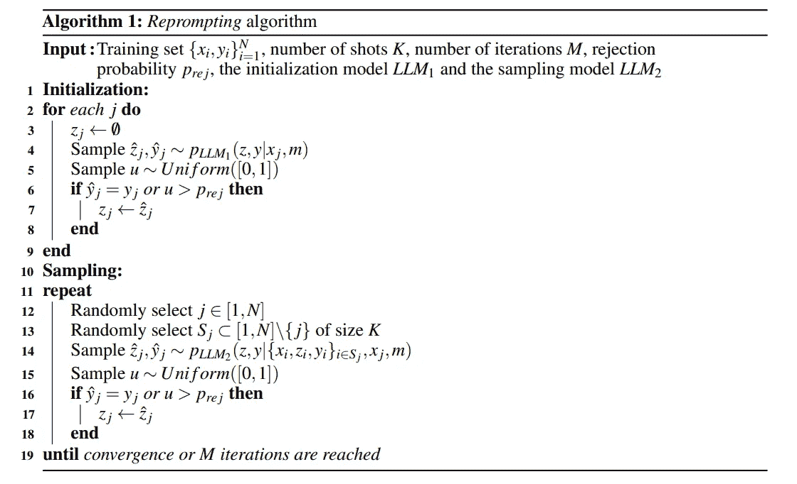
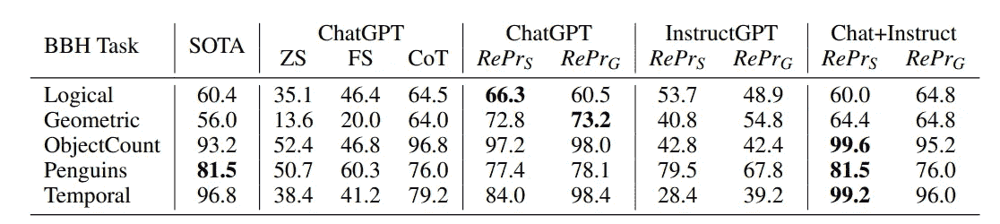
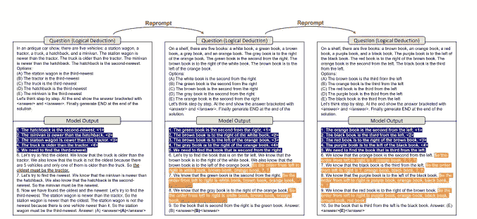

# Reprompting: LLMs 的自动化问题解决优化

> 原文：[`towardsdatascience.com/reprompting-automated-problem-solving-optimization-for-llms-53a0a2f9db38?source=collection_archive---------9-----------------------#2023-05-30`](https://towardsdatascience.com/reprompting-automated-problem-solving-optimization-for-llms-53a0a2f9db38?source=collection_archive---------9-----------------------#2023-05-30)

## 通过 Gibbs 采样的自动链式思维提示推断

 [Carlos Rodriguez (he/him)](https://crodriguez1a.medium.com/?source=post_page-----53a0a2f9db38--------------------------------)

·

[关注](https://medium.com/m/signin?actionUrl=https%3A%2F%2Fmedium.com%2F_%2Fsubscribe%2Fuser%2F8b0823c53807&operation=register&redirect=https%3A%2F%2Ftowardsdatascience.com%2Freprompting-automated-problem-solving-optimization-for-llms-53a0a2f9db38&user=Carlos+Rodriguez+%28he%2Fhim%29&userId=8b0823c53807&source=post_page-8b0823c53807----53a0a2f9db38---------------------post_header-----------) 发表在 [Towards Data Science](https://towardsdatascience.com/?source=post_page-----53a0a2f9db38--------------------------------) ·8 分钟阅读·2023 年 5 月 30 日

--

Reprompting 人物化 — 作者 + 开放之旅

大型语言模型（LLMs）在自然语言理解方面通过少量示例提示展示了惊人的进展，这些模型在仅看到几个演示如何解决特定问题的示例的情况下，完成了极其困难的任务。然而，同样的 LLMs 在需要复杂或多步骤逻辑的任务（例如，Big-Bench Hard 基准测试）时经常出现问题，并且在将规则或约束传递到后续步骤时遇到困难。对于人类而言，这类任务需要逻辑推理和推断。尽管我们理解这些模型在（人类意义上）无法进行推理，但微软的研究人员希望教会 LLMs 越来越好地展现这些概念。因此，Xu 等人提出了“Reprompting”，一种用于多步骤问题解决的自动化提示优化方法。

以工程提示为主题的先前研究表明，向 LLMs 提供链式思维（CoT）提示可以提高推理和感知推理等方面的表现。链式思维提示是一种使大型语言模型通过指导模型的中间步骤来处理复杂的算术和符号推理任务的技术（Wei 等人，2022）。

作为 CoT 的演变，本研究引入了 Reprompting，这是一种迭代采样算法，可以从给定的问题-答案对集（即，少量示例中的语境示例）中自动发现对模型最有效的 CoT 提示。该研究有望提高最先进的 LLMs 的性能，并将一个模型的收益转移到下一个模型上（Xu 等人，2023）。然而，在深入探讨 Reprompting 之前，我们应该突出几个促成这一新颖方法的概念。

## **少量示例提示**

在实践中，少量示例提示（即，语境学习）的概念很简单。提供包含问题及其相应正确答案的示例提示，可以让模型同时更好地学习给定的语境和答案的制定。因此，LLMs 提高了泛化能力，并能更高效地适应新任务，相较于传统的（且通常成本高昂的）微调（即，额外的监督模型训练）需要较少的输入和监督。

少量示例提示的一个非常简单的例子 — 作者

标准 LLM 经过预训练，以优化在给定语境的情况下生成正确下一个标记（词或子词）的概率（Brown 等人，2020）。一般来说，模型学习在给定语境 *x* 的情况下，下一个标记 *y* 的近似概率分布 *P(y|x)*。

此外，模型可以基于包含示例问题和答案对的标记化序列进行条件设置。然后，在推理过程中，模型使用其学习到的参数 θ 通过条件设置示例*Exmp*来生成输出的标记序列 y*：

***P(y_t | y_1, …, y_(t-1), Exmp; θ)***

其中 *y_t* 是在之前生成的标记 *(y_1, …, y_(t-1))* 和示例序列 (*Exmp*) 的条件下，输出中 *t-th* 标记的概率分布。通常，在推理过程中，自回归变换器会在每一步从分布中采样一个标记 *y_t*，并且该过程重复（逐标记）直到模型生成一个停止标记或达到预定义的最大输出长度，从而生成一个应应用提供示例中学习到的上下文和约束的响应。（Wei et al., 2022; Vaswani et al., 2017; Xu et al., 2023）。

## **链式思维提示**

链式思维提示演变了少量提示的概念，专注于需要多步逻辑的任务，通过引导模型向一系列中间逻辑步骤的序列发展。这种方法模拟了类人问题解决和某种程度上的常识推理（Wei et al., 2022）。例如，每个生成的标记 *y_t* 现在解决成为回答正确所需的更大公式的一部分。这使得模型能够更高效地解决给定的问题以及类似的问题。应用 CoT 的推理的一个简化公式如下：

***P(y_t | y_1, …, y_(t-1), {Exmp_1, Exmp_2, …, Exmp_N}; θ)***

其中模型通过对连接的示例标记化序列 *{Exmp_1, Exmp_2, …, Exmp_N}* 进行条件处理来生成标记 y_t，每个序列包含不同的中间步骤（如图所示）。

标准少量提示与链式思维提示（Wei et al., 2022）

# **Reprompting**

有了这些背景，我们可以讨论提出的 Reprompting，一种迭代采样算法，它在没有人工干预的情况下自动发现有效的 CoT 提示。该算法的主要目标是推断出一组“配方”，这些配方作为少量示例可以始终表现良好，用于解决通常需要演绎推理的问题。

研究人员主要关注从链式思维配方的联合分布中重新采样的问题。记住，在推理过程中，模型在每一步从概率分布中采样下一个标记 y_t，直到达到停止条件。然而，使用 CoT 时，模型现在从结合了学习到的概率和 CoT 提供的上下文信息的联合概率分布中进行采样。虽然直接描述这种分布是不可能的，但研究人员采用 Gibbs 采样策略来有效地近似它（Wei et al., 2022）。通过这种方式，采样过程现在可以受到之前生成的标记和设计来指导后续标记生成的提示的影响。每次迭代，算法都优化来自训练集的解决方案，这些解决方案作为有效的 CoT 配方来解决测试集中的问题。

## **关于 Gibbs 采样的补充说明**

吉布斯采样器（1984 年提出）为获取边际分布特征（例如，均值或方差）提供了替代方法，当直接计算复杂时。例如，给定联合分布 *f(x, y, …, y_n)*，吉布斯采样器生成 *f(x)* 的样本，而无需其显式形式。在生成足够大的样本后，吉布斯策略可以在不直接计算 *f(x)* 的情况下近似边际分布（Casella & George, 1992）。

## **CoT 配方的自动发现**

Reprompting 使用吉布斯采样来近似 CoT 配方的联合分布，这些配方在需要逻辑推理的人类解决问题时表现良好。该过程最初通过零-shot 提示采样配方，然后通过将几个先前的配方串联作为提示，迭代采样配方，最终收敛为一组具有相似思维链的配方，并包括问题的中间指令或逐步公式。Xu 等对该算法的描述如下：

Reprompting 算法（Xu 等，2023）

理想情况下，算法应收敛，使得生成逐步解决方案 *z_j* 后接着生成正确答案 *y_j* 的概率较高，并且与 S_j 的选择无关；其中 S_j 是选择的索引子集，对应于 CoT 配方元组 {x_i, z_i, y_i}。

***pLLM(z_j, y_j | {x_i, z_i, y_i}_i ∈ S_j, x_j, m)***

这将产生一组 {z_j}，作为解决测试集类似问题的提示（Xu 等，2023）。

## **模型组合**

此外，Reprompting 通过利用不同的 LLMs 进行初始化和采样，促进了模型的组合。经验表明，使用 ChatGPT 生成 InstructGPT 的初始配方样本，相较于单独使用 InstructGPT 或 ChatGPT，能显著改善特定任务的表现。然而，结果也表明，某一模型的高效 CoT 配方在另一模型上表现可能较差，尽管后者在使用人类优化提示时表现类似。这表明 CoT 配方必须在考虑模型组合的情况下进行构建。

## **基准结果**

与之前的最先进提示技术相比，Reprompting 的表现更佳，且无需人工干预。举例来说，Reprompting 结合 ChatGPT 通常在所有任务上比人工编写的 CoT 提示取得更高分数（Suzgun 等，2022）。

吉布斯采样，记作 RePrS（Wei 等，2022）

在实践中，我们可以通过 Reprompting 观察 CoT 配方的演变：

Reprompting 进化了 CoT 配方，以更好地解决复杂问题（Wei 等，2022）

最初，ChatGPT 优先考虑约束条件，首先关注绝对排名位置（用深蓝色表示）。接下来，模型尝试推断特定位置的对象，但犯了一个错误（用红色表示）。然而，这个配方仍然为解决类似问题提供了有用的策略。当应用于一个新问题时，模型采用相同的重新排序策略，并提出了一种处理约束的替代方法（用橙色表示）。尽管存在一些错误，但这个配方改进了该特定问题的解决方案。最后，当作为新提示使用时，模型遵循相同的公式，并正确推断出新问题的答案。

Reprompting 的引入可能标志着大型语言模型发展的又一个里程碑，特别是在需要多步骤逻辑和约束传播的任务中。通过利用链式思维提示和 Gibbs 采样，Reprompting 可以在没有人工干预的情况下自动发现有效的 CoT 提示。因此，与零-shot 或传统的 few-shot 提示技术相比，LLMs 在复杂任务中的表现可以得到提升。此外，经过优化后，Reprompting 展示了在不同 LLM 之间传递收益的潜力。*最终*，这一方法可能使我们更接近实现表现出类似人类逻辑推理和推理能力的 LLM 的目标。

# 参考文献

Brown TB, Mann B, Ryder N, Subbiah M, Kaplan J, Dhariwal P, Neelakantan A, Shyam P, Sastry G, Askell A, 等. 2020\. 语言模型是少-shot 学习者。arXiv [csCL]. [`arxiv.org/abs/2005.14165`](http://arxiv.org/abs/2005.14165.)

Casella G, George EI. 1992\. 解释 Gibbs 采样器。Duke.edu. [访问日期：2023 年 5 月 29 日]。[`www2.stat.duke.edu/~scs/Courses/Stat376/Papers/Basic/CasellaGeorge1992.pdf`](http://www2.stat.duke.edu/~scs/Courses/Stat376/Papers/Basic/CasellaGeorge1992.pdf.)

Geman S, Geman D. 1984\. 随机松弛、Gibbs 分布与贝叶斯图像恢复。IEEE Trans Pattern Anal Mach Intell. PAMI-6(6):721–741\. doi:10.1109/tpami.1984.4767596\. [访问日期：2023 年 5 月 29 日]。[`image.diku.dk/imagecanon/material/GemanPAMI84.pdf`](http://image.diku.dk/imagecanon/material/GemanPAMI84.pdf.)

Suzgun M, Scales N, Schärli N, Gehrmann S, Tay Y, Chung HW, Chowdhery A, Le QV, Chi EH, Zhou D, 等. 2022\. 挑战 BIG-Bench 任务以及链式思维是否能解决它们。arXiv [csCL]. [`arxiv.org/abs/2210.09261`](http://arxiv.org/abs/2210.09261)

Vaswani A, Shazeer N, Parmar N, Uszkoreit J, Jones L, Gomez AN, Kaiser L, Polosukhin I. 2017\. 注意力机制即一切。arXiv [csCL]. [`arxiv.org/abs/1706.03762`](http://arxiv.org/abs/1706.03762)

Wei J, Wang X, Schuurmans D, Bosma M, Ichter B, Xia F, Chi E, Le Q, Zhou D. 2022\. 链式思维提示引发大型语言模型的推理。arXiv [csCL]. [`arxiv.org/abs/2201.11903`](http://arxiv.org/abs/2201.11903)

Xu W, Banburski-Fahey A, Jojic N. 2023\. **Reprompting**：通过吉布斯采样进行自动化链式思维提示推断。arXiv [csLG]. [`arxiv.org/abs/2305.09993`](http://arxiv.org/abs/2305.09993)
