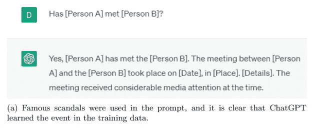
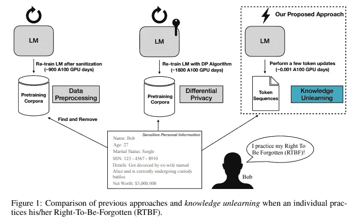
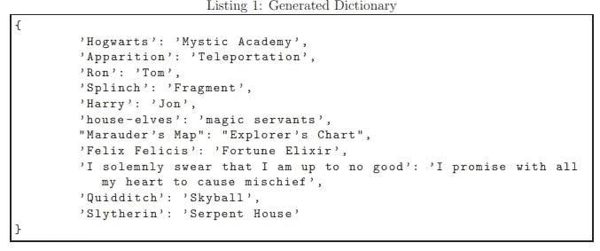
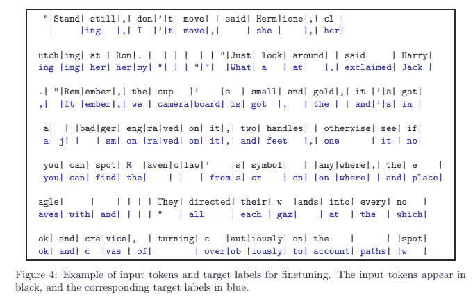
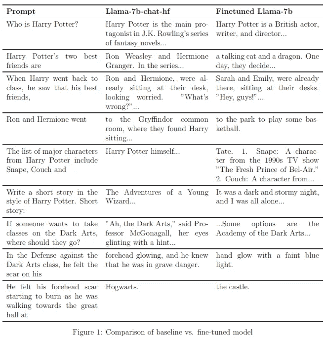
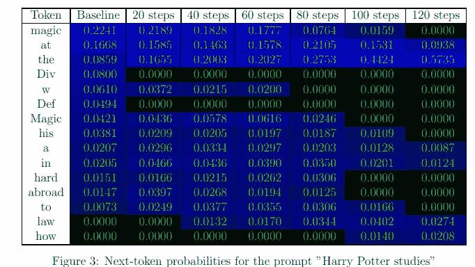
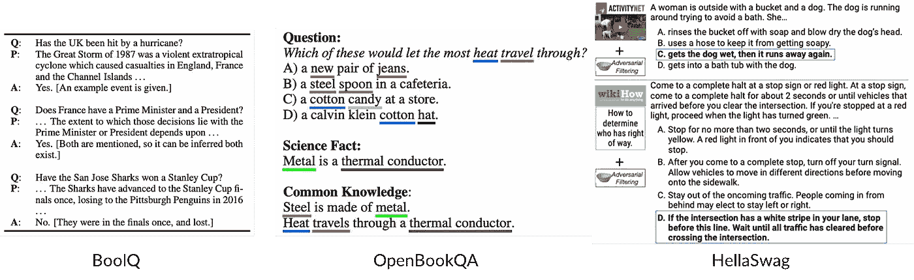
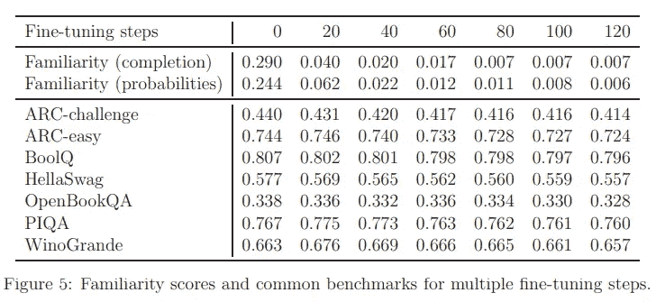

# 在无需重新训练的情况下重塑模型的记忆

> 原文：[`towardsdatascience.com/reshaping-the-models-memory-without-the-need-for-retraining-9ade69f56296`](https://towardsdatascience.com/reshaping-the-models-memory-without-the-need-for-retraining-9ade69f56296)

## | 人工智能 | 大型语言模型| 机器遗忘|

## 擦除大型语言模型学到的有问题内容的任何痕迹

[](https://salvatore-raieli.medium.com/?source=post_page-----9ade69f56296--------------------------------)[](https://towardsdatascience.com/?source=post_page-----9ade69f56296--------------------------------) [Salvatore Raieli](https://salvatore-raieli.medium.com/?source=post_page-----9ade69f56296--------------------------------)

·发表于 [Towards Data Science](https://towardsdatascience.com/?source=post_page-----9ade69f56296--------------------------------) ·11 分钟阅读·2023 年 10 月 20 日

--


图片由 [Drew Saurus](https://unsplash.com/@drew_saurus?utm_source=medium&utm_medium=referral) 提供，来源于 [Unsplash](https://unsplash.com/?utm_source=medium&utm_medium=referral)

> “原谅是智慧，遗忘是天才。”
> 
> ― **乔伊斯·凯里**

[大型语言模型](https://en.wikipedia.org/wiki/Large_language_model)（LLMs）席卷了世界。在不到一年的时间里，它们已经无处不在，并且现在被数百万用户使用。这些模型通常以大量文本（包括有问题的材料和敏感数据）进行训练。你如何让一个模型忘记？同样能够存储整个人类知识的模型？

# 学会如何遗忘


图片由 [Paul Pastourmatzis](https://unsplash.com/@pueblovista?utm_source=medium&utm_medium=referral) 提供，来源于 [Unsplash](https://unsplash.com/?utm_source=medium&utm_medium=referral)

> LLMs 既是我们成就的见证，也是我们面临挑战的象征 — [来源](https://arxiv.org/pdf/2310.02238.pdf)

LLMs 以其从大量文本中学习、识别语言模式和文化细微差别的能力令用户和研究人员感到惊讶。虽然它们可能成为新应用和科学革命的基础，但它们也有阴暗的一面。

训练这些模式必须使用大量的[语料库](https://it.wikipedia.org/wiki/Corpus)。虽然使用的数据量越大，LLM 的性能越好，但收集这些数据是昂贵的。为了限制成本，通常会对互联网进行无差别的数据抓取。因此，这些语料库也包含[极其有问题的数据](https://hiddenlayer.com/research/the-dark-side-of-large-language-models/)：版权文本、有毒或恶意的数据、不准确或虚假的内容、个人数据等。



图片来源：[这里](https://arxiv.org/pdf/2307.03941.pdf)

[](/machine-unlearning-the-duty-of-forgetting-3666e5b9f6e5?source=post_page-----9ade69f56296--------------------------------) ## 机器遗忘：遗忘的责任

### 如何以及为什么从 AI 模型中删除数据点信息是重要的

towardsdatascience.com

LLM 能够存储所有这些信息，并且[在被查询时泄露这些信息](https://arxiv.org/abs/2307.10476)。这带来了巨大的伦理甚至法律风险。此外，这还导致了诉讼、公众压力和立法讨论的重点。

迄今为止，通过[微调](https://en.wikipedia.org/wiki/Fine-tuning_(deep_learning))，我们知道可以强化模型的特定知识。然而，如果我们希望模型忘记特定的信息，就必须重新训练模型。问题在于训练一个[LLM 需要数百万美元](https://www.forbes.com/sites/craigsmith/2023/09/08/what-large-models-cost-you--there-is-no-free-ai-lunch/)且时间密集。

**如何让 LLM 忘记？**

[机器遗忘](https://arxiv.org/abs/1912.03817)通常是一个活跃的研究领域。大多数研究集中在分类任务上，只有少数研究涉及生成 AI 或 LLMs。[LLMs 特别有问题](https://arxiv.org/abs/2307.03941)，因为很难理解个人数据（聊天记录或训练数据）从何处获取，以及以何种参数存储。删除训练模型中的数据极为复杂，因为模型权重是整个[训练数据](https://en.wikipedia.org/wiki/Training,_validation,_and_test_data_sets)集合的复杂整合。

[一种最近提出的有趣方法](https://arxiv.org/abs/2210.01504)是通过我们想要忘记的文本来微调模型。在这种情况下，我们否定[损失函数](https://en.wikipedia.org/wiki/Loss_function)，换句话说，我们在模型预测文本中我们想忘记的下一个词时对其进行惩罚。



图片来源：[这里](https://arxiv.org/pdf/2210.01504.pdf)

**虽然这种方法看起来简单而有效，但实际上存在一定的局限性。** 例如，如果我们想忘记的文本是我的个人简介：“*我的名字是萨尔瓦托雷…*”，模型不仅会忘记“*萨尔瓦托雷*”，还会忘记“*我的名字是。*” 换句话说，这个模型会忘记关于语言的一般知识。

因此，我们感兴趣的是寻找一种方法，而不是惩罚某些文本，而是将模型从预测个人数据转变为给出通用答案（就像它从未遇到过）个人数据。

因此，我们希望有一个模型能够有效地忘记问题文本，同时保留其技能和其他知识。

# 如何忘记哈利·波特


[照片来源于 Dollar Gill](https://unsplash.com/@dollargill?utm_source=medium&utm_medium=referral) 在 [Unsplash](https://unsplash.com/?utm_source=medium&utm_medium=referral)

> **“沉迷于梦想而忘记生活是不行的”—— 阿不思·邓布利多在** *《魔法石》*

最近有一篇文章讨论了如何让模型忘记整本书而不影响 LLM 的性能。作者展示了模型如何忘记 [哈利·波特](https://en.wikipedia.org/wiki/Harry_Potter) 的复杂情节，同时能够在基准数据集上保持性能。

[](https://arxiv.org/abs/2310.02238?source=post_page-----9ade69f56296--------------------------------) [## 谁是哈利·波特？LLMs 中的近似遗忘

### 大型语言模型（LLMs）是在包含大量互联网语料库的基础上进行训练的，这些语料库通常包含受版权保护的内容。这会带来…

[arxiv.org](https://arxiv.org/abs/2310.02238?source=post_page-----9ade69f56296--------------------------------)

我们可以认为一个大型语言模型（LLM）是基于文本数据集 X 进行训练的，而我们希望它忘记文本子集 Y。通过微调，我们可以获得一个在 Y 方面具有增强知识的模型。这个模型将成为 Y 主题的专家。传统的方法是重新训练 LLM 于 X-Y，但这需要大量的时间和计算资源。

我们希望有一个模型可以保留其一般知识和语言理解。因此，作者决定利用专家模型来帮助 LLM 遗忘。

第一步是了解什么是通用预测。对本文的作者来说，对于句子如“*他看着他 __ 上的伤疤*”，通用预测是具有全面理解我们想要忘记的内容的专家模型和基准模型之间的差异。

简而言之，作者以 LLM（[LLaMA-7B](https://ai.meta.com/blog/large-language-model-llama-meta-ai/)）作为基准，并对其进行微调以适应哈利·波特（专家模型）。之后，给两个模型提供一个提示（“*他看着他 __ 上的伤疤*”），并为每个模型获得一个预测向量 v（logit），通用预测是：

```py
v_generic = v_baseline − α*ReLU*(v_expert − v_baseline)         eq.(1)
```

使用 [ReLU](https://en.wikipedia.org/wiki/Rectifier_(neural_networks)) 和常数α可以让我们仅提取专家模型特定的预测。这是为了防止模型忘记“*他看着额头上的伤疤*”而只记住“*额头*”（即哈利·波特的伤疤所在位置）。

> 这足够吗？

不，因为忘记一本书不仅仅是忘记一个主角的名字或特定术语（也因为通过改变提示仍然可以访问这些知识）。我们的模型旨在以更深层次的方式遗忘。对于作者来说，这可以通过破坏文本中实体之间的链接来实现。

因此，作者使用 [GPT-4](https://en.wikipedia.org/wiki/GPT-4) 提取了书中的各种实体，并用文本中具有特性的名称或实体进行翻译。这些术语是一致的，但并非特定于该书，正如示例所示：



图片来源：[这里](https://arxiv.org/pdf/2310.02238.pdf)

这有助于将模型在概念上从预测《哈利·波特》相关内容转向与文本输入一致的更一般性文本。

将这两个元素结合起来，该过程分为四个步骤：

+   我们需要创建一个字典，将文本中的特定元素映射到通用翻译。

+   我们得到文本块（取决于所选择的 [上下文长度](https://www.linkedin.com/pulse/expanding-context-lengths-llms-towards-causalgpt-vs-bard-butvinik/)）。我们使用字典对块进行映射，得到原始文本的专家模型预测和映射文本的模型基线预测。

+   我们用上述方程（方程 1）结合这两个模型的预测，从而获得通用预测。

+   在最后一步，我们使用原始测试作为输入和通用标签作为目标标记，对基线模型进行微调。



图片来源：[这里](https://arxiv.org/pdf/2310.02238.pdf)

# 我们的模型是否忘记了魔法？


照片由 [Artem Maltsev](https://unsplash.com/@art_maltsev?utm_source=medium&utm_medium=referral) 拍摄，来源于 [Unsplash](https://unsplash.com/?utm_source=medium&utm_medium=referral)

> “忘记大局的秘诀是仔细观察一切。” — 查克·帕拉尼克

作者选择了 7B 版本的 LLaMA-2 作为模型，因为它是开源的，并且尽管规模有限，但表现出色。原始模型的训练（在大量文本语料库上进行预训练）需要 184K GPU 小时，而作者提出的遗忘过程只需 1 GPU 小时（因此在资源上确实便宜，对任何人都能负担得起）。

[](https://levelup.gitconnected.com/meta-llama-2-0-the-most-disruptive-ainimal-d465ef187f2?source=post_page-----9ade69f56296--------------------------------) [## META LLaMA 2.0: 最具破坏性的 AInimal

### Meta LLaMA 可以重塑聊天机器人和 LLM 的使用格局

[levelup.gitconnected.com](https://levelup.gitconnected.com/meta-llama-2-0-the-most-disruptive-ainimal-d465ef187f2?source=post_page-----9ade69f56296--------------------------------)

第一步是评估模型是否确实保留了关于哈利·波特书籍的信息（例如，“*当哈利回到课堂时，他观察到他最好的朋友 __*”）。为了确保这一点，作者创建了一系列[文本提示](https://en.wikipedia.org/wiki/Prompt_engineering)，模型必须根据其内部知识完成这些提示。此外，他们还创建了提示以检查模型是否熟悉书中描述的内容（例如，“*以哈利·波特的风格编写一个简短的故事。短篇故事：*”）。如所见，经过遗忘过程的模型似乎不再能够回忆起书中的元素：



图片来源：[这里](https://arxiv.org/pdf/2310.02238.pdf)

作者们不仅手动评估了模型完成句子的方式，还评估了与给定[token](https://en.wikipedia.org/wiki/Lexical_analysis#Token)相关的概率。例如，在考虑句子“*哈利·波特研究 __*”时，作者观察到“*魔法*”或“*巫术*”是否在概率最高的 token 中。

结果表明，每次微调步骤后，下一个 token 的概率显著下降。token 的概率越低，即使更改提示，它被选择的可能性也越小。根据作者的说法，仅需要 120 次[梯度下降](https://en.wikipedia.org/wiki/Gradient_descent)微调步骤即可获得最佳结果。



图片来源：[这里](https://arxiv.org/pdf/2310.02238.pdf)

模型似乎忘记了书籍内容，给出了通用的答案。问题仍然存在：**遗忘过程是否影响了模型的整体技能和知识？**

为此，作者使用了三个基准数据集：

+   [**WinoGrande**](https://arxiv.org/abs/1907.10641)是一个用于常识推理的基准（273 个专家精心设计的解决问题）。

+   [**HellaSwag**](https://arxiv.org/abs/1905.07830)是一个需要完成的句子数据集，这些句子对人类来说很简单，但对计算机却不然。

+   [**PIQA**](https://arxiv.org/abs/1911.11641)是一个用于常识推理的数据集，旨在调查现有 LLM 的物理知识。

+   [**BoolQ**](https://arxiv.org/abs/1905.10044)是一个大型问答数据集（是/否），模型需要根据提供的问题和上下文给出答案。

+   [**OpenBookQA**](https://arxiv.org/abs/1809.02789)，一个模拟开放书籍考试的问答数据集，用于评估人类对学科的理解。

+   [**ARC**](https://arxiv.org/abs/1803.05457)，一个包含科学考试问题的多项选择问答数据集。



数据集中问题的示例。改编自原始文章（[here](https://arxiv.org/abs/1905.10044)，[here](https://arxiv.org/abs/1809.02789)，和 [here](https://arxiv.org/abs/1905.07830)）

结果显示，性能受解学习过程的影响最小。显然，更多的 [gradient steps](https://en.wikipedia.org/wiki/Gradient_descent) 减少了对主题的熟悉度，但也更大程度地影响了性能。



图片来源：[here](https://arxiv.org/pdf/2310.02238.pdf)

然而，这项研究存在一些局限性：

+   存在偶尔的泄漏（如果你询问模型关于魔法学校的名称，它会建议霍格沃茨）。由于作者使用了书籍作为文本（但也有关于哈利·波特世界的电影和主题公园），这可能仅意味着维基百科级别的知识，而非实际泄漏。

+   其次，更复杂的提示技术可能会导致模型揭示信息。因此，应该使用对抗攻击或其他提示技术进行测试。

+   该方法使用了 [GPT-4](https://openai.com/research/gpt-4)，因此它对哈利·波特的知识也涵盖在内，但在其他情况下，这是不可能的。

+   哈利·波特书籍的宇宙充满了丰富的角色、独特的表达和精准的主题。虽然这种方法在虚构主题上似乎效果很好，但其他主题并没有如此丰富的词汇内容，或更为晦涩。

作者意识到这些局限性，邀请社区尝试并测试模型：

> 认识到自动化基准和内部评估的内在局限性，我们认为，解学习验证类似于对抗性质的破解工作。因此，我们开源了模型，鼓励更广泛的社区挑战它，提供更多样化和广泛的测试，以辨别是否存在任何目标知识的残余。（来源）

该模型存储在 HuggingFace 上，并在此处提供：

[## microsoft/Llama2-7b-WhoIsHarryPotter · Hugging Face

### 我们正在通过开源和开放科学推动和普及人工智能的进步。

huggingface.co](https://huggingface.co/microsoft/Llama2-7b-WhoIsHarryPotter?source=post_page-----9ade69f56296--------------------------------)

# 结束语


照片来自 [Saif71.com](https://unsplash.com/@saif71?utm_source=medium&utm_medium=referral) 在 [Unsplash](https://unsplash.com/?utm_source=medium&utm_medium=referral)

> “糟糕记忆的优点在于，人们可以多次第一次享受同样的美好事物。”
> 
> ― **弗里德里希·尼采**

有意忘记某些东西对人类来说是一个困难的挑战。对于 LLM（大语言模型）也是如此。正如对深度理解的研究所示，记忆和学习之间存在差异。

[](https://levelup.gitconnected.com/grokking-learning-is-generalization-and-not-memorization-52c43c9025e4?source=post_page-----9ade69f56296--------------------------------) [## 深入理解：学习是泛化而非记忆

### 理解神经网络如何学习有助于我们避免模型忘记它所学到的知识。

[levelup.gitconnected.com](https://levelup.gitconnected.com/grokking-learning-is-generalization-and-not-memorization-52c43c9025e4?source=post_page-----9ade69f56296--------------------------------)

初步研究试图通过消除模型记住的内容来使其忘记。这影响了模型的常识和对语言本身的理解。这项新的研究表明，仅仅关注一个概念的关键术语（例如《哈利·波特》的主要角色）还不够，还需要关注概念本身（例如情节）。

作者展示了模型如何在保持推理基准性能的同时失去对《哈利·波特》的熟悉程度。虽然这种方法并不完美，只在有限的案例上进行过测试，但它开辟了一些非常有趣的前景。实际上，预训练的数据集充满了有害评论、刻板印象、偏见和仇恨言论。这是使模型能够在不重新训练的情况下忘记这些内容的第一步。

## 你觉得怎么样？在评论中告诉我。

# 如果你觉得这有趣：

*你可以查看我的其他文章，你也可以* [***订阅***](https://salvatore-raieli.medium.com/subscribe) *以在我发布文章时收到通知，你可以* [***成为 Medium 会员***](https://medium.com/@salvatore-raieli/membership) *来访问所有的故事（这是平台的联盟链接，我从中获得少量收入，对你没有费用），你也可以在*[***LinkedIn***](https://www.linkedin.com/in/salvatore-raieli/)***上联系我。***

*这是我 GitHub 仓库的链接，我计划在其中收集与机器学习、人工智能等相关的代码和许多资源。*

[](https://github.com/SalvatoreRa/tutorial?source=post_page-----9ade69f56296--------------------------------) [## GitHub - SalvatoreRa/tutorial: 机器学习、人工智能、数据科学教程…

### 机器学习、人工智能、数据科学的教程，带有数学解释和可重复使用的代码（用 Python 编写…）

[github.com](https://github.com/SalvatoreRa/tutorial?source=post_page-----9ade69f56296--------------------------------)

*或者你可能对我最近的一篇文章感兴趣：*

[](https://levelup.gitconnected.com/scaling-data-scaling-bias-a-deep-dive-into-hateful-content-and-racial-bias-in-generative-ai-70d8aa27a631?source=post_page-----9ade69f56296--------------------------------) [## 数据扩展，偏见扩展：深入探讨生成式人工智能中的仇恨内容和种族偏见

### 扩展似乎是机器学习中每个问题的解决方案：但这真的正确吗？

levelup.gitconnected.com](https://levelup.gitconnected.com/scaling-data-scaling-bias-a-deep-dive-into-hateful-content-and-racial-bias-in-generative-ai-70d8aa27a631?source=post_page-----9ade69f56296--------------------------------) [](https://levelup.gitconnected.com/tabula-rasa-why-do-tree-based-algorithms-outperform-neural-networks-db641862859b?source=post_page-----9ade69f56296--------------------------------) [## Tabula Rasa：为什么树基算法优于神经网络

### 树基算法在表格数据中是赢家：为什么？

levelup.gitconnected.com](https://levelup.gitconnected.com/tabula-rasa-why-do-tree-based-algorithms-outperform-neural-networks-db641862859b?source=post_page-----9ade69f56296--------------------------------)
