# 检索增强生成——直观而全面的解释

> 原文：[`towardsdatascience.com/retrieval-augmented-generation-intuitively-and-exhaustively-explain-6a39d6fe6fc9`](https://towardsdatascience.com/retrieval-augmented-generation-intuitively-and-exhaustively-explain-6a39d6fe6fc9)

## 制作能够检索信息的语言模型

[](https://medium.com/@danielwarfield1?source=post_page-----6a39d6fe6fc9--------------------------------)[](https://towardsdatascience.com/?source=post_page-----6a39d6fe6fc9--------------------------------) [Daniel Warfield](https://medium.com/@danielwarfield1?source=post_page-----6a39d6fe6fc9--------------------------------)

·发表于 [Towards Data Science](https://towardsdatascience.com/?source=post_page-----6a39d6fe6fc9--------------------------------) ·阅读时长 12 分钟·2023 年 10 月 12 日

--


“数据检索器”由 Daniel Warfield 使用 MidJourney 制作。所有图片由作者提供，除非另有说明。

在这篇文章中，我们将深入探讨“检索增强生成”（RAG）这一策略，该策略使我们能够向大型语言模型提供最新和相关的信息。我们将讨论理论，然后假设自己是餐厅老板；我们将实现一个系统，使我们的客户能够与 AI 讨论我们的菜单、季节性活动和一般信息。

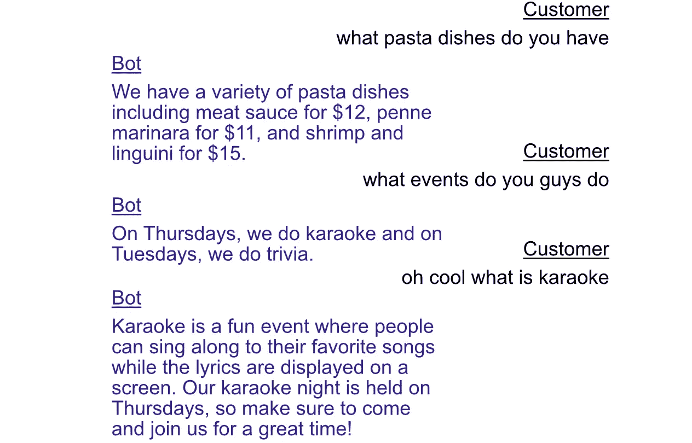

实践示例的最终结果是一个聊天机器人，能够提供有关我们餐厅的具体信息。

**谁对这个有用？** 对自然语言处理（NLP）感兴趣的任何人。

**这篇文章的难度如何？** 这是一个非常强大但又非常简单的概念；对初学者和专家都很合适。

**前提条件：** 一些大型语言模型（LLMs）的基础知识会有所帮助，但不是必须的。

# 问题的核心

训练 LLMs 成本高昂；例如，GPT-3 的计算资源成本高达 320 万美元。如果我们开了一家新餐厅，想用 LLM 回答有关菜单的问题，如果我们不必每次推出新的季节性沙拉时都花费数百万美元，那将非常棒。我们可以进行较小的训练步骤（称为微调），以尝试让模型学习少量高度特定的信息，但这个过程仍然可能花费数百到数千美元。

另一个 LLM 的问题是它们的自信心；有时它们以绝对确定的方式说出完全错误的内容（通常称为幻觉）。因此，很难辨别 LLM 获取信息的来源，以及这些信息是否准确。如果一个过敏的客户询问一道菜是否含有坚果，如果我们能确保我们的 LLM 使用准确的信息，那将非常棒，以免我们的顾客进入过敏性休克。

> 律师 Steven A. Schwartz 首次因使用 ChatGPT 而陷入麻烦，导致法律简报中引用了六个虚假的案例。— 幻觉的一个著名例子。[来源](https://www.legaldive.com/news/chatgpt-lawyer-fake-cases-lawyer-uses-chatgpt-sanctions-generative-ai/653925/#:~:text=Attorney%20Steven%20A.,cited%20in%20a%20legal%20brief.)

更新信息和使用适当来源的问题可以通过 RAG 来缓解。

# 检索增强生成，总结

上下文学习是大型语言模型（LLM）通过接收精心格式化的提示中的新信息来学习知识的能力，而不是通过训练。例如，假设你想询问 LLM 一个笑话的结尾部分，仅仅是结尾部分。笑话通常由设置和结尾组成，而由于 LLM 是统计模型，它们可能难以打破这种先前知识。


一个因缺乏上下文而导致 ChatGPT 任务失败的例子

我们可以通过给模型“上下文”来解决这个问题；我们可以在巧妙格式化的提示中给它一个样本，从而使 LLM 给出正确的信息。


当提供更多上下文时，ChatGPT 成功完成相同任务的一个例子

LLM 的这一特性有各种酷炫的应用。我曾写过一篇文章讲述[这一能力如何用于与 LLM 讨论图像](https://medium.com/towards-data-science/visual-question-answering-with-frozen-large-language-models-353d42791054)，以及[如何利用它从对话中提取信息](https://medium.com/towards-data-science/conversations-as-directed-graphs-with-lang-chain-46d70e1a846c)。在本文中，我们将利用这种能力，通过精心构建的提示，将信息注入模型，根据用户的询问，提供上下文信息。

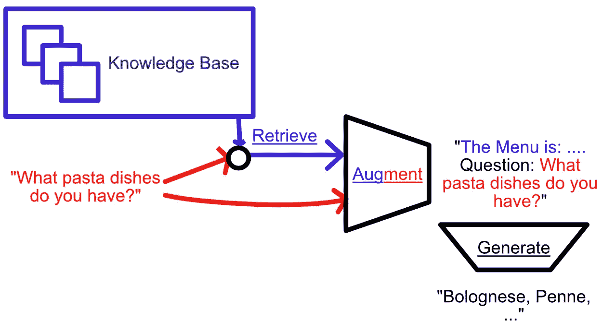

RAG 的概念图。提示用于从知识库中检索信息，这些信息又用于增强提示。增强后的提示然后被输入模型进行生成。

RAG 过程包括三个关键部分：

1.  **检索：** 根据提示，从知识库中检索相关知识。

1.  **增强：** 将检索到的信息与初始提示结合起来。

1.  **生成：** 将增强的提示传递给大型语言模型，生成最终输出。


RAG 提示的一个示例。

# 检索

RAG 的唯一真正概念性挑战在于检索：我们如何知道哪些文档与给定的提示相关？

这可以通过很多方式完成。简单地说，你可以遍历所有文档并询问 LLM“这个文档是否与问题相关”。你可以将文档和提示一起传递给 LLM，询问 LLM 该文档是否与提示相关，并使用某种查询解析器（我在[这里](https://medium.com/me/stats/post/46d70e1a846c)谈到了这些）来获取 LLM 的“是”或“否”回答。

或者，对于像我们这样简单的应用，我们可以直接提供所有数据。我们可能只需要参考几个文档；例如餐厅的菜单、活动，或许还有关于餐厅历史的文档。我们可以将所有这些数据注入到每个提示中，结合用户的查询。

然而，假设我们不仅仅有一家餐厅，而是一个餐饮连锁。我们会有大量客户可能会询问的信息：饮食限制，公司成立时间，店铺位置，与我们共进过餐的名人。我们将拥有整个连锁的文档；数据量太大，无法将所有数据放入每个查询中，也太多以至于不能要求 LLM 遍历所有文档并告诉我们哪些是相关的。

我们可以使用**词向量嵌入**来处理这个问题。通过词向量嵌入，我们可以快速计算不同文档和提示之间的相似度。下一节将简要介绍词向量嵌入，随后将详细说明如何在 RAG 中用于检索。

# 词向量嵌入概述

本节摘自我关于变压器的文章：

[](/transformers-intuitively-and-exhaustively-explained-58a5c5df8dbb?source=post_page-----6a39d6fe6fc9--------------------------------) [## Transformers — 直观且详尽的解释]

### 探索现代机器学习的浪潮：一步步拆解变压器

towardsdatascience.com](/transformers-intuitively-and-exhaustively-explained-58a5c5df8dbb?source=post_page-----6a39d6fe6fc9--------------------------------)

本质上，词向量嵌入将单个词翻译成一个向量，从而表示其含义。

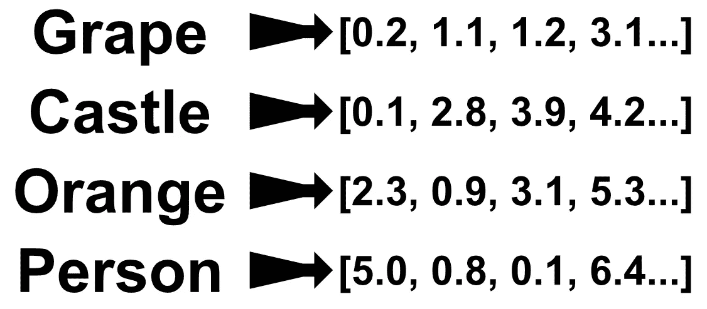

词到向量嵌入器的工作：将词转换为某种方式捕捉其一般含义的数字。

细节可能因实现而异，但最终结果可以被认为是一个“词空间”，这个空间遵循某些方便的关系。**单词很难进行数学运算，但包含有关单词及其与其他单词关系的信息的向量则显著更容易进行数学运算。** 将单词转换为向量的任务通常被称为“嵌入”。

Word2Vect，作为自然语言处理领域的一个里程碑论文，试图创建一个遵循某些有用特性的嵌入。基本上，他们希望能够对单词进行代数运算，并创建了一个嵌入来促进这一点。使用 Word2Vect，你可以对“king”进行嵌入，减去“man”的嵌入，添加“woman”的嵌入，你会得到一个其最近邻是“queen”嵌入的向量。

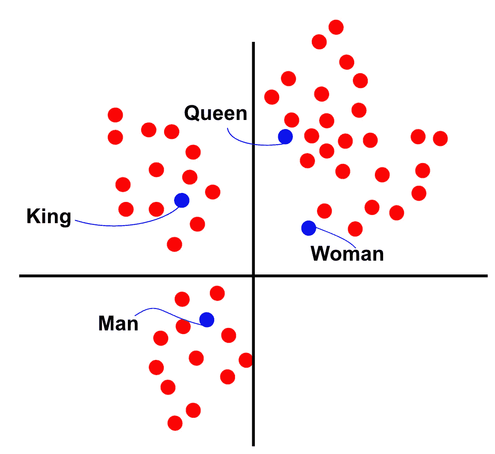

对单词嵌入进行代数运算的概念演示。如果你把每一个点看作是从原点的向量，如果你从“king”的向量中减去“man”的向量，并添加“woman”的向量，那么结果向量会接近于“queen”。实际上，这些嵌入空间的维度要高得多，“接近度”的测量可能不太直观（比如余弦相似度），但直觉仍然是一样的。

我将在未来的文章中更全面地讲解词嵌入，但就本文而言，它们可以被概念化为一种机器学习模型，该模型已经学会以有意义的方式将单词分组为向量。通过词嵌入，你可以开始以距离的方式思考单词。例如，提示和文档之间的距离。这种距离的概念就是我们将用来检索相关文档的东西。

# 使用词嵌入进行检索

我们知道如何将单词转换为某个高维空间中的点。我们如何利用这些点来知道哪些文档与给定提示相关？这可以通过很多方法来完成，这仍然是一个活跃的研究领域，但我们将考虑一种简单而有效的方法：均值向量嵌入的曼哈顿距离。

## 均值向量嵌入

我们有一个可以被视为单词列表的提示，也有一些可以被视为单词列表的文档。我们可以通过首先使用 Word2Vect 对每个单词进行嵌入，然后计算所有嵌入的平均值来总结这些单词列表。

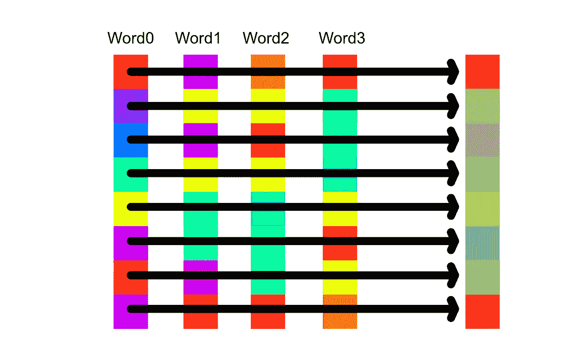

一个计算序列中所有嵌入的均值向量的概念图。结果向量中的每个索引只是每个单词中对应索引的平均值。

从概念上讲，因为单词向量编码了单词的含义，均值向量嵌入计算了整个短语的平均含义。

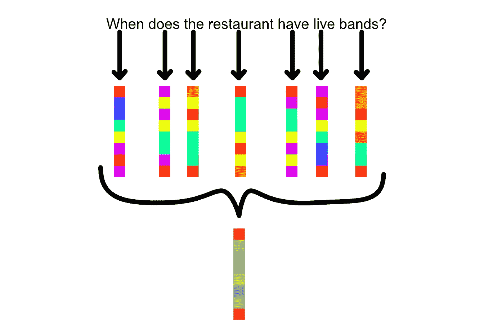

计算提示词均值向量的概念图。我们的餐馆的顾客问：“餐馆什么时候有现场音乐？”每一个单词都通过嵌入器（如 word2vect），然后计算这些向量的均值。通过计算每个索引的平均值来完成。这可以被视为计算整个短语的平均含义。

## 曼哈顿距离

现在我们已经创建了一个系统，可以将一系列单词的含义总结为一个向量，我们可以使用这个向量比较两个单词序列的相似性。在这个例子中，我们将使用曼哈顿距离，尽管也可以使用许多其他距离测量方法。

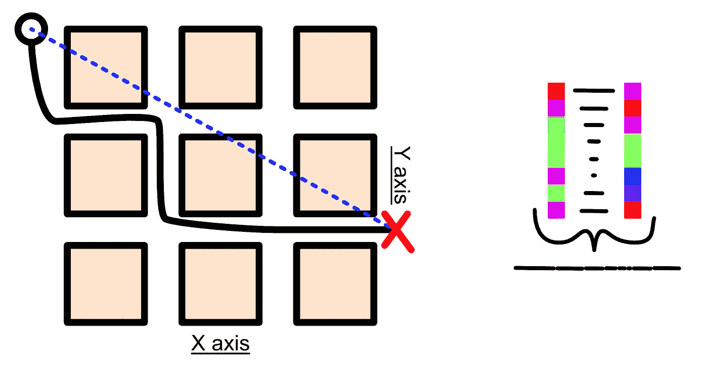

曼哈顿距离的概念图。左侧是其名字的由来：与传统的两点距离测量不同，曼哈顿距离是沿两个轴——y 轴和 x 轴的距离之和。右侧可以看到这个概念在比较向量时的表现。我们在元素逐一比较向量之间的距离，然后将这些距离相加得到曼哈顿距离。从概念上讲，这种距离计算方法在不同轴可能代表根本不同的事物时效果最佳，这在向量嵌入中是常见的直观感受。

将这两个概念结合起来，我们可以找到提示词和所有文档的均值向量嵌入，并使用曼哈顿距离根据距离对文档进行排序，这是相关性的代理。

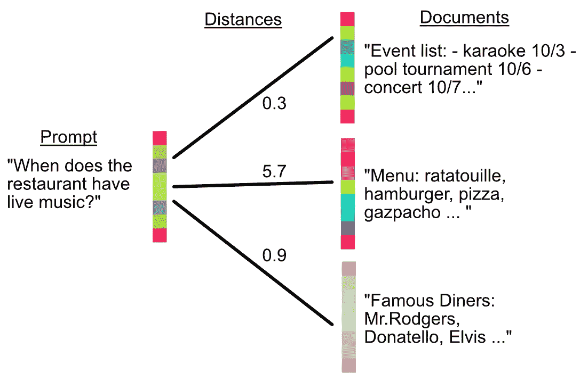

如何找到最相关的文档。计算提示词及所有文档的均值向量嵌入。计算提示词与所有文档之间的距离，从而使检索系统能够优先考虑哪些文档应包含在增强中。

这就是检索的本质；你为所有文本中的所有单词计算词向量嵌入，然后计算一个均值向量来表示每个文本。我们可以将曼哈顿距离作为相似性的代理。

在实际决定使用哪些文档时，有很多选择。你可以设定一个最大距离阈值，大于这个距离的文档将被视为不相关，或者你可以始终包含距离最小的文档。具体细节取决于应用的需求。为了简单起见，我们将始终检索距离提示词最近的文档。

# 关于向量数据库的说明

在我继续讲解增强和生成之前，有一点说明。

在这篇文章中，我想专注于 RAG 的概念，而不深入探讨向量数据库的具体细节。它们是令人着迷且极其强大的技术，我将在未来的帖子中从零开始构建。如果你在项目中实现 RAG，你可能希望使用向量数据库来提高在计算提示与大量文档之间的距离时的查询性能。以下是一些你可能感兴趣的选项：

+   [Chroma](https://www.trychroma.com/)

+   [Weaviate](https://weaviate.io/)

+   [Faiss](https://github.com/facebookresearch/faiss)

+   [Pinecone](https://www.pinecone.io/)

通常，RAG 是通过将这些数据库之一与 LangChain 连接来实现的，这是我计划在另一个未来帖子中解决的工作流程。

# 增强和生成

很好，我们能够检索哪些文档与用户的提示相关。那么我们如何实际使用这些文档呢？这可以通过格式化为特定应用程序的提示来完成。例如，我们可以声明以下格式：

```py
"Answer the customers prompt based on the folowing context:
==== context: {document title} ====
{document content}

...

prompt: {prompt}"
```

然后可以使用此格式以及被认为有用的文档来增强提示。这个增强的提示可以直接传递给 LLM，以生成最终输出。

# 从零开始的 RAG

我们已经涵盖了理论，包括检索、增强和生成。为了进一步理解，我们将从零开始实现 RAG。我们将使用预训练的词向量嵌入器和 LLM，但我们会自己进行距离计算和增强。

你可以在这里找到完整的代码：

[## MLWritingAndResearch/RAGFromScratch.ipynb at main · DanielWarfield1/MLWritingAndResearch

### 用于机器学习写作和研究的笔记本示例 - MLWritingAndResearch/RAGFromScratch.ipynb at main ·…

github.com](https://github.com/DanielWarfield1/MLWritingAndResearch/blob/main/RAGFromScratch.ipynb?source=post_page-----6a39d6fe6fc9--------------------------------)

## 下载词到向量编码器

首先，我们需要下载一个预训练的编码器，它已经学习了词与词之间的关系，因此知道哪些词属于某些空间区域。

```py
"""Downloading a word encoder.
I was going to use word2vect, but glove downloads way faster. For our purposes
they're conceptually identical
"""

import gensim.downloader

#doenloading encoder
word_encoder = gensim.downloader.load('glove-twitter-25')

#getting the embedding for a word
word_encoder['apple']
```

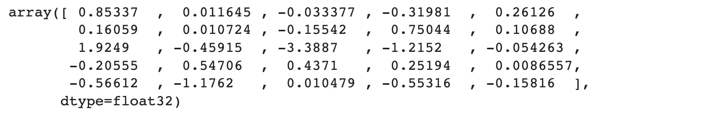

词“apple”的嵌入

## 嵌入文档或提示

现在我们有了编码器，可以计算给定单词的所有嵌入的均值，以嵌入整个文本序列，如提示或文档。

```py
"""defining a function for embedding an entire document to a single mean vector
"""

import numpy as np

def embed_sequence(sequence):
    vects = word_encoder[sequence.split(' ')]
    return np.mean(vects, axis=0)

embed_sequence('its a sunny day today')
```

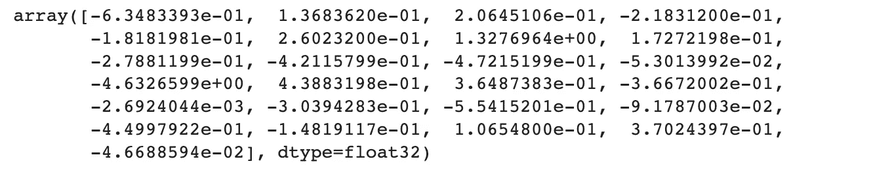

“it’s a sunny day today”中所有嵌入的均值向量

## 计算距离

我们可以使用 scipy 的 cdist 函数计算曼哈顿距离，该距离被用作相似度的代理。

```py
"""Calculating distance between two embedding vectors
uses manhattan distance
"""

from scipy.spatial.distance import cdist

def calc_distance(embedding1, embedding2):
    return cdist(np.expand_dims(embedding1, axis=0), np.expand_dims(embedding2, axis=0), metric='cityblock')[0][0]

print('similar phrases:')
print(calc_distance(embed_sequence('sunny day today')
                  , embed_sequence('rainy morning presently')))

print('different phrases:')
print(calc_distance(embed_sequence('sunny day today')
                  , embed_sequence('perhaps reality is painful')))
```

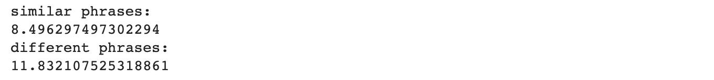

相似和不同短语之间的距离。注意，相似的短语实际上没有任何相同的单词，但具有类似的一般意义。另外，最后的引用来自我正在阅读的一本书，名为《善恶的彼岸》。我并不是要显得尖锐。尼采提到，现实可能本质上是痛苦的，而一个人意志的力量就是观察它不加掩饰的能力。

## 定义检索和增强

现在我们在计算相关性时，定义一些文档可能会很有用。

```py
"""Defining documents
for simplicities sake I only included words the embedder knows. You could just
parse out all the words the embedder doesn't know, though. After all, the retreival
is done on a mean of all embeddings, so a missing word or two is of little consequence
"""
documents = {"menu": "ratatouille is a stew thats twelve dollars and fifty cents also gazpacho is a salad thats thirteen dollars and ninety eight cents also hummus is a dip thats eight dollars and seventy five cents also meat sauce is a pasta dish thats twelve dollars also penne marinera is a pasta dish thats eleven dollars also shrimp and linguini is a pasta dish thats fifteen dollars",
             "events": "on thursday we have karaoke and on tuesdays we have trivia",
             "allergins": "the only item on the menu common allergen is hummus which contain pine nuts",
             "info": "the resteraunt was founded by two brothers in two thousand and three"}
```

现在我们可以定义一个函数，利用我们之前的距离计算来定义哪些文档与给定提示相关。

```py
"""defining a function that retreives the most relevent document
"""

def retreive_relevent(prompt, documents=documents):
    min_dist = 1000000000
    r_docname = ""
    r_doc = ""

    for docname, doc in documents.items():
        dist = calc_distance(embed_sequence(prompt)
                           , embed_sequence(doc))

        if dist < min_dist:
            min_dist = dist
            r_docname = docname
            r_doc = doc

    return r_docname, r_doc

prompt = 'what pasta dishes do you have'
print(f'finding relevent doc for "{prompt}"')
print(retreive_relevent(prompt))
print('----')
prompt = 'what events do you guys do'
print(f'finding relevent doc for "{prompt}"')
print(retreive_relevent(prompt))
```

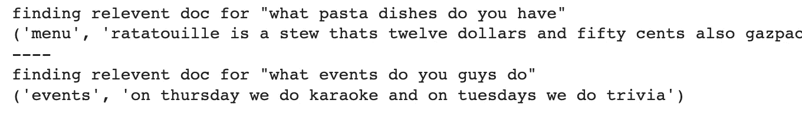

请注意，这只是一个概念验证。我遇到的一个问题是，当提示中出现“guys”这个词时，即“你们有什么意大利面菜肴”。信息显示餐馆由“两兄弟”创办，信息会显示在菜单之前。这些类型的怪癖是艺术的现实。

## 增强和生成

现在我们可以将所有内容整合在一起。从用户那里获取查询，检索相关文档，增强提示，并将其传递给 LLM。

增强可能看起来像这样：

```py
"""Defining retreival and augmentation
creating a function that does retreival and augmentation,
this can be passed straight to the model
"""
def retreive_and_agument(prompt, documents=documents):
    docname, doc = retreive_relevent(prompt, documents)
    return f"Answer the customers prompt based on the folowing documents:\n==== document: {docname} ====\n{doc}\n====\n\nprompt: {prompt}\nresponse:"

prompt = 'what events do you guys do'
print(f'prompt for "{prompt}":\n')
print(retreive_and_agument(prompt))
```

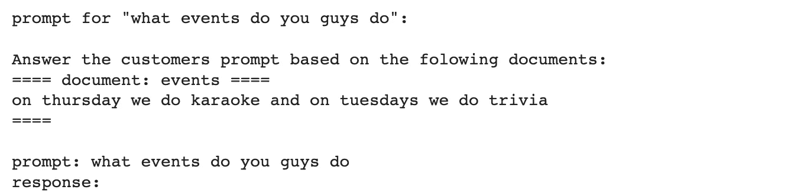

生成可能看起来像这样：

```py
"""Using RAG with OpenAI's gpt model
"""

import openai
openai.api_key = OPENAI_API_TOKEN

prompts = ['what pasta dishes do you have', 'what events do you guys do', 'oh cool what is karaoke']

for prompt in prompts:

    ra_prompt = retreive_and_agument(prompt)
    response = openai.Completion.create(model="gpt-3.5-turbo-instruct", prompt=ra_prompt, max_tokens=80).choices[0].text

    print(f'prompt: "{prompt}"')
    print(f'response: {response}')
```

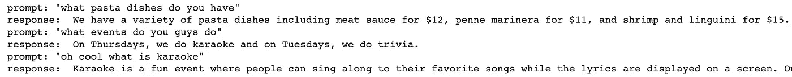

我们定制的 RAG 启用聊天机器人在运行中。

# 结论

就这些了！在这篇文章中，我们讨论了词向量嵌入如何在 RAG 中发挥关键作用，以及如何操作嵌入来总结一系列单词。我们讨论了如何使用距离获取相关信息，然后通过增强将所有内容结合起来以查询 LLM。最后，我们创建了一个可以利用最新信息的聊天机器人。

# 关注以获取更多信息！

我描述了 ML 领域的论文和概念，强调实际和直观的解释。我计划创建更多关于最佳实践 RAG 实施技术的帖子，并从头开始实现一个向量数据库。敬请关注！

[](https://medium.com/@danielwarfield1/subscribe?source=post_page-----6a39d6fe6fc9--------------------------------) [## 每当 Daniel Warfield 发布新文章时获取电子邮件

### 高质量的数据科学文章直接送到你的邮箱。每当 Daniel Warfield 发布新文章时，你会收到邮件。通过注册，你…

[medium.com](https://medium.com/@danielwarfield1/subscribe?source=post_page-----6a39d6fe6fc9--------------------------------) 

意外的感激，总是令人感激。通过捐赠，你可以让我分配更多的时间和资源来撰写更频繁、更高质量的文章。[链接](https://www.buymeacoffee.com/danielwarfield)

**归属:** 本文档中的所有图像均由**丹尼尔·沃菲尔德**创作，除非另有来源说明。您可以将本帖中的任何图像用于自己的非商业目的，只要您引用本文， [`danielwarfield.dev`](https://danielwarfield.dev/)，或两者兼顾。
