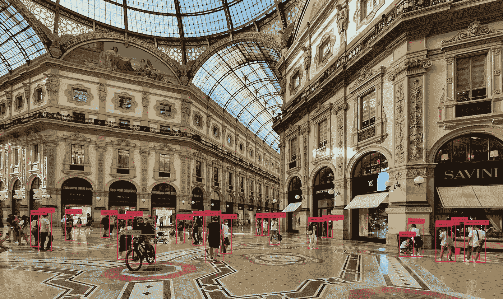
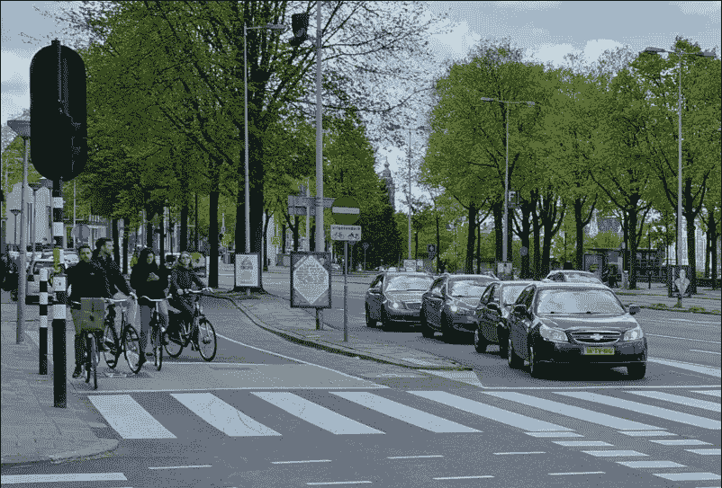
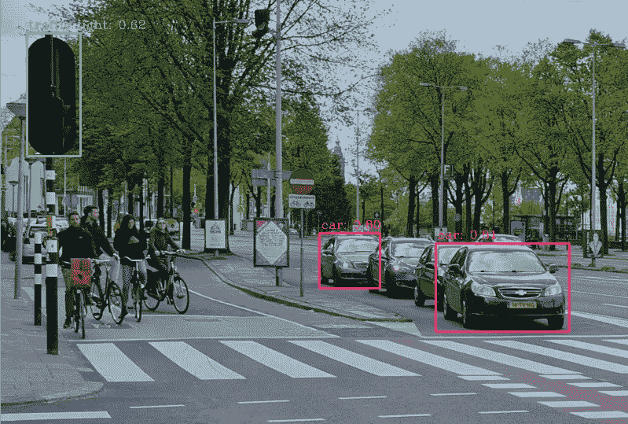
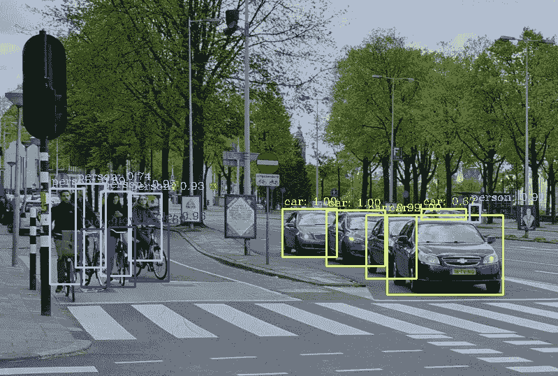
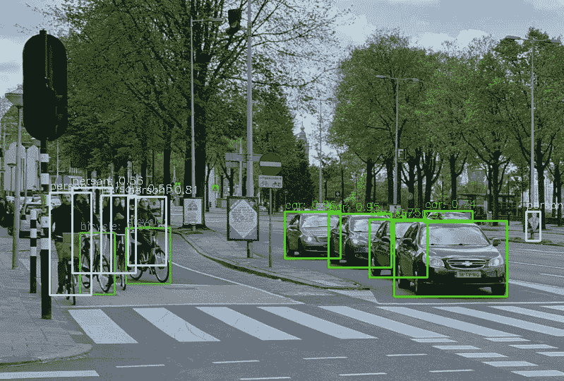
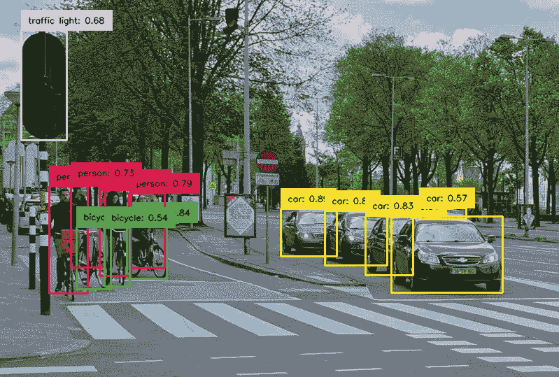

# 复古数据科学：测试 YOLO 的首个版本

> 原文：[`towardsdatascience.com/retro-data-science-testing-the-first-versions-of-yolo-799b9c1835d7`](https://towardsdatascience.com/retro-data-science-testing-the-first-versions-of-yolo-799b9c1835d7)

## 让我们回到 8 年前

[](https://dmitryelj.medium.com/?source=post_page-----799b9c1835d7--------------------------------)[](https://towardsdatascience.com/?source=post_page-----799b9c1835d7--------------------------------) [Dmitrii Eliuseev](https://dmitryelj.medium.com/?source=post_page-----799b9c1835d7--------------------------------)

·发布于[Towards Data Science](https://towardsdatascience.com/?source=post_page-----799b9c1835d7--------------------------------) ·8 分钟阅读·2023 年 6 月 22 日

--



使用 YOLO 进行物体检测，图像由作者提供

数据科学的世界不断变化。通常，我们无法看到这些变化，因为它们进展缓慢，但过了一段时间，我们很容易回顾，发现景象已发生了巨大的变化。仅仅 10 年前处于前沿的工具和库，今天可能已经完全被遗忘。

YOLO（You Only Look Once）是一个流行的物体检测库。它的第一个版本在 2015 年发布。YOLO 运行速度快，效果好，预训练模型也公开可用。该模型迅速流行起来，项目至今仍在积极改进。这使我们有机会看到数据科学工具和库多年来是如何演变的。在这篇文章中，我将测试不同的 YOLO 版本，从最初的 V1 到最新的 V8。

进行进一步测试时，我将使用这张图像：



测试图像，由作者制作

开始吧。

## YOLO V1..V3

关于 YOLO 的第一篇论文，“You Only Look Once: Unified, Real-Time Object Detection”，[发布于 2015 年](https://arxiv.org/abs/1506.02640)。令人惊讶的是，YOLO v1 仍然可以[下载](https://pjreddie.com/darknet/yolov1/)。正如原始论文的作者之一 Mr.Redmon，[所写](https://pjreddie.com/darknet/yolov1/)，他保留这个版本是“为了历史目的”，这确实很棒。但我们今天还能运行它吗？该模型以两个文件的形式分发。配置文件“`yolo.cfg`”包含有关神经网络模型的详细信息：

```py
[net]
batch=1
height=448
width=448
channels=3
momentum=0.9
decay=0.0005
...

[convolutional]
batch_normalize=1
filters=64
size=7
stride=2
pad=1
activation=leaky
```

第二个文件“`yolov1.weights`”，顾名思义，包含预训练模型的权重。

这种格式并不是来自 PyTorch 或 Keras。结果发现该模型是使用 **Darknet** 创建的，这是一种用 C 编写的开源神经网络框架。这个项目仍然 [可在 GitHub 上获取](https://github.com/pjreddie/darknet)，但看起来已经被弃用。在撰写本文时，共有 164 个拉取请求和 1794 个未解决问题；最后一次提交是在 2018 年，之后只有 README.md 文件进行了更改（这可能就是现代数字世界中项目死亡的样子）。

原始 Darknet 项目已被弃用，这真是坏消息。好消息是 *readNetFromDarknet* 方法在 OpenCV 中仍然可用，并且在最新版本的 OpenCV 中也 [存在](https://docs.opencv.org/5.x/d6/d0f/group__dnn.html)。因此，我们可以很容易地尝试在现代 Python 环境中加载原始 YOLO v1 模型：

```py
import cv2

model = cv2.dnn.readNetFromDarknet("yolo.cfg", "yolov1.weights")
```

可惜，没有成功；我只得到了一个错误：

```py
darknet_io.cpp:902: error: 
(-212:Parsing error) Unknown layer type: local in function 'ReadDarknetFromCfgStream'
```

结果发现“yolo.cfg”有一个名为“local”的层，OpenCV 不支持这个层，而且我不知道是否有解决方法。无论如何，[YOLO v2 配置](https://pjreddie.com/darknet/yolov2/)中不再有这个层，该模型可以成功加载到 OpenCV 中：

```py
import cv2

model = cv2.dnn.readNetFromDarknet("yolov2.cfg", "yolov2.weights")
```

使用模型并不像我们预期的那么简单。首先，我们需要找到模型的输出层：

```py
ln = model.getLayerNames()
output_layers = [ln[i - 1] for i in model.getUnconnectedOutLayers()]
```

然后我们需要加载图像并将其转换为模型可以理解的二进制格式：

```py
img = cv2.imread('test.jpg')
H, W = img.shape[:2]

blob = cv2.dnn.blobFromImage(img, 1/255.0, (608, 608), swapRB=True, crop=False)
```

最终，我们可以进行前向传播。一个“forward”方法将进行计算并返回所请求的层输出：

```py
model.setInput(blob)
outputs = model.forward(output_layers)
```

前向传播是直接的，但解析输出可能有点棘手。模型输出 85 维特征向量，其中前 4 个数字表示物体矩形，第 5 个数字表示物体存在的概率，最后 80 个数字包含模型训练的 80 个类别的概率信息。拥有这些信息后，我们可以在原始图像上绘制标签：

```py
threshold = 0.5
boxes, confidences, class_ids = [], [], []

# Get all boxes and labels
for output in outputs:
    for detection in output:
        scores = detection[5:]
        class_id = np.argmax(scores)
        confidence = scores[class_id]
        if confidence > threshold:
            center_x, center_y = int(detection[0] * W), int(detection[1] * H)
            width, height = int(detection[2] * W), int(detection[3] * H)
            left = center_x - width//2
            top = center_y - height//2
            boxes.append([left, top, width, height])
            class_ids.append(class_id)
            confidences.append(float(confidence))

# Combine boxes together using non-maximum suppression
indices = cv2.dnn.NMSBoxes(boxes, confidences, 0.5, 0.4)

# All COCO classes
classes = "person;bicycle;car;motorbike;aeroplane;bus;train;truck;boat;traffic light;fire hydrant;stop sign;parking meter;bench;bird;" \
          "cat;dog;horse;sheep;cow;elephant;bear;zebra;giraffe;backpack;umbrella;handbag;tie;suitcase;frisbee;skis;snowboard;sports ball;kite;" \
          "baseball bat;baseball glove;skateboard;surfboard;tennis racket;bottle;wine glass;cup;fork;knife;spoon;bowl;banana;apple;sandwich;" \
          "orange;broccoli;carrot;hot dog;pizza;donut;cake;chair;sofa;pottedplant;bed;diningtable;toilet;tvmonitor;laptop;mouse;remote;keyboard;" \
          "cell phone;microwave;oven;toaster;sink;refrigerator;book;clock;vase;scissors;teddy bear;hair dryer;toothbrush".split(";")

# Draw rectangles on image
colors = np.random.randint(0, 255, size=(len(classes), 3), dtype='uint8')
for i in indices.flatten():
    x, y, w, h = boxes[i]
    color = [int(c) for c in colors[class_ids[i]]]
    cv2.rectangle(img, (x, y), (x + w, y + h), color, 2)
    text = f"{classes[class_ids[i]]}: {confidences[i]:.2f}"
    cv2.putText(img, text, (x + 2, y - 6), cv2.FONT_HERSHEY_COMPLEX, 0.5, color, 1)

# Show
cv2.imshow('window', img)
cv2.waitKey(0)
cv2.destroyAllWindows()
```

在这里，我使用 *np.argmax* 来找到概率最大的类别 ID。YOLO 模型是使用 [COCO](https://cocodataset.org/)（Common Objects in Context，创作共享 4.0 许可）数据集训练的，为了简化，我将所有 80 个标签名称直接放入代码中。我还使用了 OpenCV 的 [NMSBoxes](https://docs.opencv.org/4.7.0/d6/d0f/group__dnn.html#ga9d118d70a1659af729d01b10233213ee) 方法来将嵌套的矩形合并在一起。

最终结果如下：



YOLO v2 结果，图片由作者提供

我们成功地在现代环境中运行了一个 2016 年发布的模型！

下一版本 YOLO v3 于 2018 年发布，我们也可以使用相同的代码运行它（权重和配置文件 [在线提供](https://pjreddie.com/darknet/yolo/)）。正如作者 [在论文中写的](https://arxiv.org/abs/1804.02767)，新模型更准确，我们可以轻松验证这一点：



YOLO v3 结果，图像作者提供

确实，V3 模型能够在同一图像上找到更多的对象。对技术细节感兴趣的读者可以阅读这篇 2018 年的 TDS 文章。

## YOLO V5..V7

如我们所见，使用*readNetFromDarknet*方法加载的模型可以工作，但所需的代码相当“低级”和繁琐。OpenCV 开发者决定简化工作，在 2019 年，为 4.1.2 版本添加了一个新的[*DetectionModel*](https://docs.opencv.org/4.1.2/d3/df1/classcv_1_1dnn_1_1DetectionModel.html)类。我们可以这样加载 YOLO 模型；整体逻辑保持不变，但所需的代码量要小得多。模型在一次方法调用中直接返回类 ID、置信值和矩形：

```py
import cv2

model = cv2.dnn_DetectionModel("yolov7.cfg", "yolov7.weights")
model.setInputParams(size=(640, 640), scale=1/255, mean=(127.5, 127.5, 127.5), swapRB=True)

class_ids, confidences, boxes = model.detect(img, confThreshold=0.5)

# Combine boxes together using non-maximum suppression
indices = cv2.dnn.NMSBoxes(boxes, confidences, 0.5, 0.4)

# All COCO classes
classes = "person;bicycle;car;motorbike;aeroplane;bus;train;truck;boat;traffic light;fire hydrant;stop sign;parking meter;bench;bird;" \
          "cat;dog;horse;sheep;cow;elephant;bear;zebra;giraffe;backpack;umbrella;handbag;tie;suitcase;frisbee;skis;snowboard;sports ball;kite;" \
          "baseball bat;baseball glove;skateboard;surfboard;tennis racket;bottle;wine glass;cup;fork;knife;spoon;bowl;banana;apple;sandwich;" \
          "orange;broccoli;carrot;hot dog;pizza;donut;cake;chair;sofa;pottedplant;bed;diningtable;toilet;tvmonitor;laptop;mouse;remote;keyboard;" \
          "cell phone;microwave;oven;toaster;sink;refrigerator;book;clock;vase;scissors;teddy bear;hair dryer;toothbrush".split(";")

# Draw rectangles on image
colors = np.random.randint(0, 255, size=(len(classes), 3), dtype='uint8')
for i in indices.flatten():
    x, y, w, h = boxes[i]
    color = [int(c) for c in colors[class_ids[i]]]
    cv2.rectangle(img, (x, y), (x + w, y + h), color, 2)
    text = f"{classes[class_ids[i]]}: {confidences[i]:.2f}"
    cv2.putText(img, text, (x, y - 5), cv2.FONT_HERSHEY_SIMPLEX, 0.5, color, 1)

# Show
cv2.imshow('window', img)
cv2.waitKey(0)
cv2.destroyAllWindows()
```

如我们所见，提取模型输出中的框和置信值所需的所有低级代码现在不再需要了。

运行 YOLO v7 的结果总体上是相同的：



YOLO v7 结果，图像作者提供

## YOLO V8

[第 8 版](https://github.com/ultralytics/ultralytics)发布于 2023 年，所以我不能认为它是“复古”的，至少在写这篇文章的时候。为了比较结果，我们来看看现在运行 YOLO 所需的代码：

```py
from ultralytics import YOLO
import supervision as sv

model = YOLO('yolov8m.pt')
results = model.predict(source=img, save=False, save_txt=False, verbose=False)
detections = sv.Detections.from_yolov8(results[0])

# Create list of labels
labels = []
for ind, class_id in enumerate(detections.class_id):
    labels.append(f"{model.model.names[class_id]}: {detections.confidence[ind]:.2f}")

# Draw rectangles on image
box_annotator = sv.BoxAnnotator(thickness=2, text_thickness=1, text_scale=0.4)
box_annotator.annotate(scene=img, detections=detections, labels=labels)

# Show
cv2.imshow('window', img)
cv2.waitKey(0)
cv2.destroyAllWindows()
```

如我们所见，代码变得更加简洁。我们不需要处理数据集标签名称（模型提供了一个“names”属性）或如何在图像上绘制矩形和标签（有一个专门的*BoxAnnotator*类）。我们甚至不需要再下载模型权重；库会自动为我们完成这项工作。与 2016 年相比，2023 年的程序从大约 50 行缩减到约 5 行！显然，这是一个很大的改进，现代开发者不再需要了解前向传播或输出级别格式。模型就像一个内含“魔法”的黑箱。这个现象是好还是坏？我不知道 :)

至于结果本身，它相当准确：



YOLO v8 结果，图像作者提供

模型工作良好，至少在我的计算机上，相比 v7，计算速度有所提高，也许是因为更好地利用了 GPU。

## 结论

在这篇文章中，我们能够测试几乎所有的 YOLO 模型，从 2016 年到 2023 年。乍一看，运行一个发布近 10 年的模型可能显得浪费时间。但对我来说，我在做这些测试时学到了很多：

+   看到流行的数据科学工具和库随着时间的推移而演变是很有趣的。从低级代码转向高级方法的趋势越来越明显，这些方法可以做所有事情，甚至在执行前下载预训练模型（至少现在，还不需要订阅密钥，但谁知道未来 10 年会怎样？）看起来很清楚。这是好还是坏？这是一个有趣且开放的问题。

+   重要的是要知道 OpenCV“本地”支持运行深度学习模型。这使得不仅可以在像 PyTorch 或 Keras 这样的大型框架中使用神经网络模型，还可以在纯 Python 甚至 C++应用程序中使用。并不是所有的应用程序都在资源几乎无限的云端运行。物联网市场在增长，这对在像机器人、监控摄像头或智能门铃这样的低功耗设备上运行神经网络尤其重要。

在下一篇文章中，我将更详细地测试，并展示 YOLO v8 在像树莓派这样的低功耗板上的运行情况，我们将能够测试 Python 和 C++版本。敬请期待。

如果你喜欢这个故事，欢迎[订阅](https://medium.com/@dmitryelj/membership)Medium，你将收到我新文章发布的通知，并且可以完全访问其他作者的成千上万篇故事。
