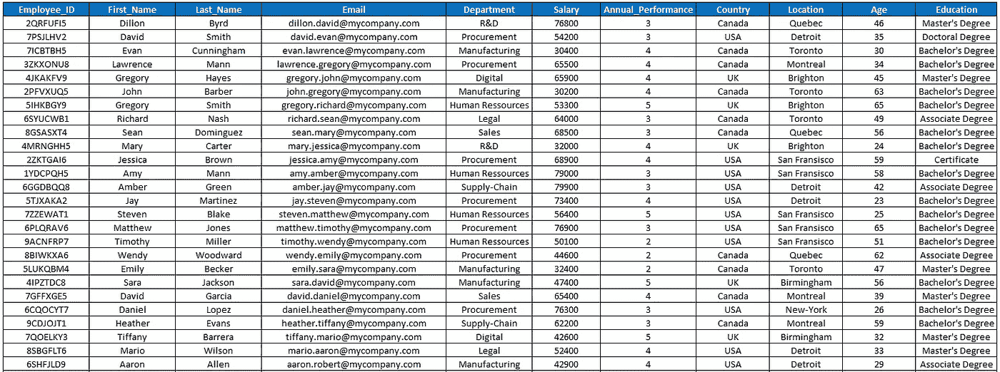
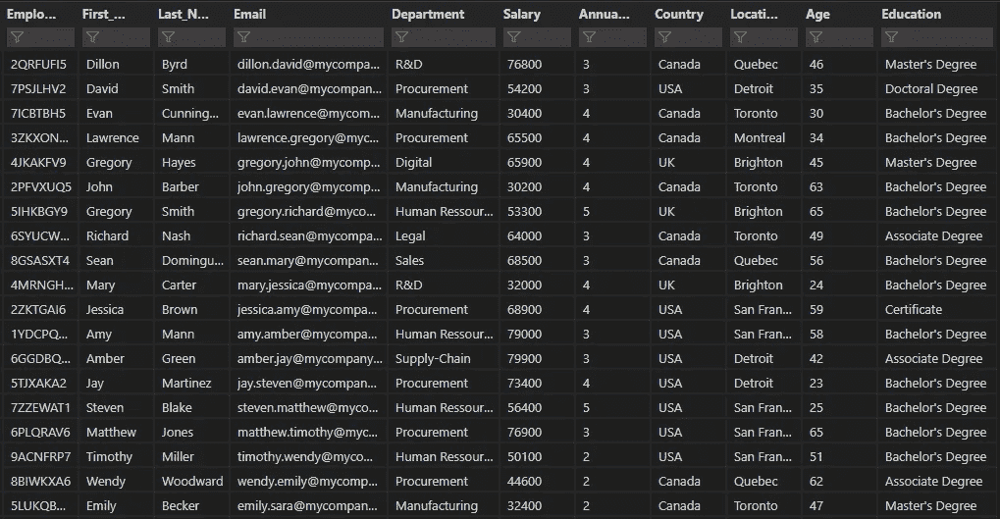
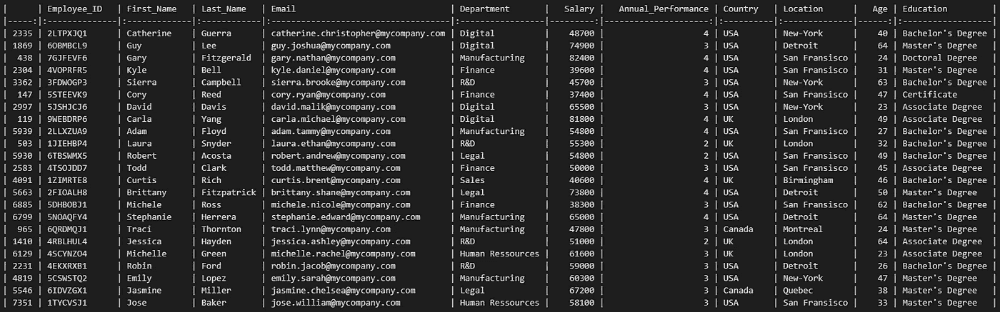
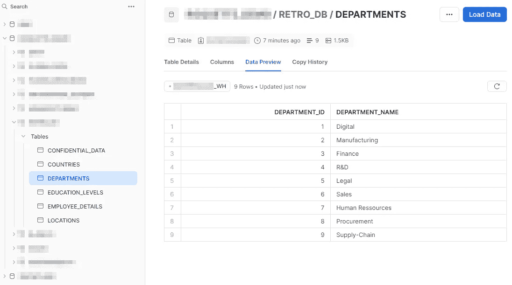
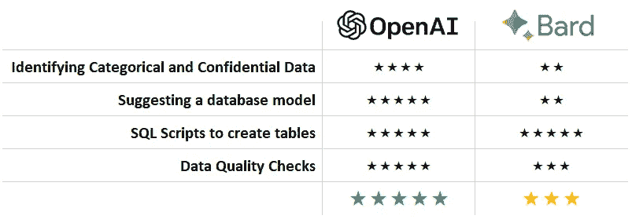

# 逆å‘工程数æ®åº“模å¼å’Œè´¨é‡æ£€æŸ¥ï¼šGPT ä¸ Bard

> åŸæ–‡ï¼š[`towardsdatascience.com/retro-engineering-a-database-schema-and-quality-checks-gpt-vs-bard-2e2776e8af86`](https://towardsdatascience.com/retro-engineering-a-database-schema-and-quality-checks-gpt-vs-bard-2e2776e8af86)

## 大å‹è¯­è¨€æ¨¡å‹ï¼ˆLLMs）能å¦é€†å‘工程一个整åˆçš„æ•°æ®é›†ï¼Œä»¥è®¾è®¡åŸå§‹æ•°æ®åº“并建议相应的数æ®è´¨é‡æ£€æŸ¥ï¼Ÿ

[](https://pl-bescond.medium.com/?source=post_page-----2e2776e8af86--------------------------------)[](https://towardsdatascience.com/?source=post_page-----2e2776e8af86--------------------------------) [Pierre-Louis Bescond](https://pl-bescond.medium.com/?source=post_page-----2e2776e8af86--------------------------------)

·å‘å¸ƒäº [Towards Data Science](https://towardsdatascience.com/?source=post_page-----2e2776e8af86--------------------------------) ·阅读时长 9 分钟·2023 å¹´ 7 月 25 æ—¥

--


图片由 [Jake Trotman](https://unsplash.com/@jake_t?utm_source=unsplash&utm_medium=referral&utm_content=creditCopyText) æ供，æ¥æºäº [Unsplash](https://unsplash.com/wallpapers/design/pattern?utm_source=unsplash&utm_medium=referral&utm_content=creditCopyText)

在我之å‰å…³äºå¦‚何利用生æˆæ€§ AI 进行数æ®æ´»åŠ¨çš„帖å­ä¹‹å，我想æ¢ç´¢è¿™æ ·ä¸€ä¸ªç”¨ä¾‹ï¼šä¸€ä¸ªæ•°æ®å›¢é˜Ÿä»ä¸€ä¸ªèŒèƒ½éƒ¨é—¨ï¼ˆæ¯”如人力资æºï¼‰æ¥æ”¶äº†ä¸€ä¸ªæ•´åˆçš„æ•°æ®é›†ï¼Œå¹¶éœ€è¦åœ¨ä»–们的数æ®å¹³å°ä¸Šé‡æ–°è®¾è®¡ä¸€ä¸ªé€‚当的数æ®æ¨¡å‹ï¼Œä»¥å¤„ç†æœªæ¥çš„查询。

我们将比较 GPT-4 å’Œ Bard çš„å›ç­”，以确定哪个模å‹æ供了更相关的答案。

*(注：笔记本和数æ®æºåœ¨æ–‡ç« æœ«å°¾æä¾›)*

# åˆå§‹ï¼ˆä¹Ÿæ˜¯æœ€ç»ˆï¼‰æ•°æ®é›†

有时候，商业解决方案仅å…许你以报告的形å¼ä»å…¶ä¸“有系统中æå–ä¿¡æ¯â€¦â€¦å¦‚æœè¿æ°”好的è¯ï¼Œå®ƒä»¬ç”šè‡³å¯èƒ½é€šè¿‡ API 进行访问。

这是“我的公å¸â€çš„情况，其中 HRIS é—留系统åªèƒ½æ供所有员工的一个æå–，其中包å«è®¸å¤šå…³äºå…¬å¸çš„详细信æ¯ï¼Œå…¶ä¸­ä¸€äº›æ˜¯æœºå¯†çš„。

æ ¹æ®æ•°æ®ç½‘æ ¼åŸåˆ™ï¼ŒäººåŠ›èµ„æºå›¢é˜Ÿå¸Œæœ›å…¬å¼€è¿™äº›æ•°æ®ï¼Œä½†ä»–们也ç†è§£æŠ¥å‘Šä¸èƒ½ç›´æ¥ä½¿ç”¨ï¼Œæ›´ä¸ç”¨è¯´åƒâ€œè–ªæ°´â€ã€â€œå¹´é¾„â€æˆ–“年度评估â€è¿™æ ·çš„列所引å‘的机密性问题。



æ¥æºäºé—ç•™ HRIS 系统的åŸå§‹æŠ¥å‘Šï¼ˆä½œè€…æ供的图片）

# æ•°æ®æ¨¡å‹çš„逆å‘工程

在ä¸æ•°æ®å›¢é˜Ÿäº’动时，桌å­å‘¨å›´çš„æ¯ä¸ªäººå¾ˆå¿«æ˜ç™½è¿™ä¸ªæ•°æ®é›†ä¸èƒ½å¹¿æ’­åˆ°æ‰€æœ‰åŠŸèƒ½/员工，并且需è¦æ‹†åˆ†æˆå¤šä¸ªè¡¨æ ¼ã€‚

这些表格中的一些å¯èƒ½ä¼šè¢«è®¸å¤šäººç”¨äºå…¶ä»–分æ或用例：

+   内部部门åå•

+   员工åå•ï¼ŒåŒ…括他们的电å­é‚®ä»¶ã€éƒ¨é—¨ã€å›½å®¶å’Œä½ç½®

+   等等。

其他一些应ä¿æŒæœºå¯†ï¼ˆè–ªèµ„ã€å¹´é¾„ã€è¯„估）

一ä½æ•°æ®åˆ†æ师决定测试 GPT 或 Bard 如何帮助æ¯ä¸ªäººé€†å‘工程åŸå§‹å…³ç³»æ•°æ®åº“并节çœæ—¶é—´ğŸ•˜ã€‚

# 创建新ç¯å¢ƒå¹¶å¯¼å…¥æ•°æ®

在æ¯ä¸ªæ–°é¡¹ç›®ä¸­åˆ›å»ºä¸€ä¸ªä¸“用的 Python ç¯å¢ƒå§‹ç»ˆæ˜¯ä¸€ä¸ªå¥½ä¹ æƒ¯ã€‚

在终端中，我们è¿è¡Œä»¥ä¸‹ä¸¤ä¸ªå‘½ä»¤ï¼ˆæˆ‘们立å³è¯·æ±‚两个所需的包：Pandas å’Œ Tabulate）：

```py
conda create -n "hr-data" python=3.10 pandas tabulate -y

-- installation logs --

conda activate hr-data
```

我们切æ¢åˆ° Jupyter Notebook 并导入 CSV 文件：

```py
import pandas as pd

df = pd.read_csv("Employees_Base.csv")
df
```



VS Code 中 df å˜é‡å†…容（作者æ供的图åƒï¼‰

æ•°æ®é›† 7688 è¡Œ x 11 列被æˆåŠŸåŠ è½½ï¼Œæˆ‘们å¯ä»¥ç»§ç»­ğŸ˜€

# 为未æ¥çš„æ示格å¼åŒ–æ•°æ®

对äºå¤§å¤šæ•°ç”¨æˆ·è€Œè¨€ï¼ŒGPT 模å‹ä»…通过èŠå¤©ç•Œé¢è®¿é—®ï¼Œè€Œè¿™æ­£æ˜¯æˆ‘们的数æ®åˆ†æ师的情况。她需è¦æ‰¾åˆ°ä¸€ç§â€œä¼ è¾¾â€æ•°æ®é›†çš„结æ„化方å¼ç»™ LLMs。

> Markdown æ¥æ•‘æ´ï¼ğŸš€

幸è¿çš„是，LLM å¯ä»¥å®Œç¾å¤„ç† Markdown æ ¼å¼çš„表格，因此我们å¯ä»¥ç›´æ¥åœ¨ Jupyter Notebook 中打å°å‡ºè¡Œçš„示例（这也是为什么在ç¯å¢ƒåˆ›å»ºè¿‡ç¨‹ä¸­éœ€è¦â€œtabulateâ€åŒ…😉）：

```py
sample_md = df.sample(50).to_markdown()
print(sample_md)
```



Markdown æ ¼å¼çš„æ•°æ®é›†ç¤ºä¾‹ï¼ˆä½œè€…æ供的图åƒï¼‰

*（注：我们选择 50 行的åŸå› æ˜¯ä¸ºäº†ä¿æŒä¸€ä¸ªåˆç†ä½†ä»å…·ä»£è¡¨æ€§çš„样本，而ä¸è¶…过 LLM 的当å‰ä»¤ç‰Œé™åˆ¶ã€‚）*

# 定义我们的æ示

我们希望模å‹å¤„ç†ä¸åŒçš„任务。为了最大化è·å¾—相关答案的机会，我们将解释我们期待的顺åºï¼š

```py
Could you :
- identify the categorical columns within this dataset as well as confidential ones
- suggest a database schema with different tables (pay attention to creating a separate table for confidential data)
- for the tables with categorical data, please provide the SQL script to create them, including their content (Key and Values)
- for the remaining tables, please provide the script to create their scheme
- for each column of each table, suggest some data quality checks
```

ç»“åˆ Markdown 表格，这个请求将消耗大约 6K 令牌，剩下 ~2K 令牌用äºä¸åŒçš„ç­”æ¡ˆï¼ˆæ ¹æ® GPT-4k çš„é™åˆ¶ï¼›Bard 的令牌é™åˆ¶ç›®å‰æœªå…¬å¼€ï¼‰ã€‚


# 分æ结æœï¼ˆGPT-4k）

## 识别分类和机密数æ®

GPT-4k（温度为 0）对数æ®ç»“æ„ç†è§£è‰¯å¥½ï¼Œå³ä½¿æœ‰äººå¯èƒ½ä¼šäº‰è¾©ï¼š

+   在公å¸å†…部，专业电å­é‚®ä»¶åœ°å€ä¸æ˜¯æœºå¯†çš„，

+   相å，年龄å¯èƒ½åœ¨ HR 层é¢è¢«ä¿å¯†ã€‚

```py
Categorical columns: Department, Country, Location, Education
Confidential columns: Email, Salary, Annual_Performance
```

## æ议一个数æ®åº“模å‹

GPT 按指示正确地分离公共和机密表格，ä¿æŒ Employee_ID 作为主键，并在“Employee_Detailsâ€è¡¨ä¸­åˆ›å»ºâ€œDepartment_IDâ€ã€â€œCountry_IDâ€ã€â€œLocation_IDâ€å’Œâ€œEducation_IDâ€ä½œä¸ºå¤–键，以è¿æ¥åˆ†ç±»è¡¨æ ¼ï¼š

```py
Database schema:

Employee_Details (Employee_ID, First_Name, Last_Name, Age, Department_ID, Country_ID, Location_ID, Education_ID)
Confidential_Data (Employee_ID, Email, Salary, Annual_Performance)
Departments (Department_ID, Department_Name)
Countries (Country_ID, Country_Name)
Locations (Location_ID, Location_Name)
Education_Levels (Education_ID, Education_Level)
```

## 创建表格的 SQL 脚本

GPT 生æˆäº†é€‚用äºåˆ†ç±»æ•°æ®çš„å³ç”¨ SQL 脚本：

```py
CREATE TABLE Departments (
    Department_ID INT PRIMARY KEY,
    Department_Name VARCHAR(255) NOT NULL
);
INSERT INTO
    Departments (Department_ID, Department_Name)
VALUES
    (1, 'Digital'),
    (2, 'Manufacturing'),
    (3, 'Finance'),
    (4, 'R&D'),
    (5, 'Legal'),
    (6, 'Sales'),
    (7, 'Human Ressources'),
    (8, 'Procurement'),
    (9, 'Supply-Chain');

CREATE TABLE Countries (
        Country_ID INT PRIMARY KEY,
        Country_Name VARCHAR(255) NOT NULL
    );
INSERT INTO
    Countries (Country_ID, Country_Name)
VALUES
    (1, 'USA'),
    (2, 'UK'),
    (3, 'Canada');

CREATE TABLE Locations (
        Location_ID INT PRIMARY KEY,
        Location_Name VARCHAR(255) NOT NULL
    );
INSERT INTO
    Locations (Location_ID, Location_Name)
VALUES
    (1, 'New-York'),
    (2, 'Detroit'),
    (3, 'San Fransisco'),
    (4, 'London'),
    (5, 'Birmingham'),
    (6, 'Montreal'),
    (7, 'Quebec'),
    (8, 'Toronto'),
    (9, 'Brighton');

CREATE TABLE Education_Levels (
        Education_ID INT PRIMARY KEY,
        Education_Level VARCHAR(255) NOT NULL
    );
INSERT INTO
    Education_Levels (Education_ID, Education_Level)
VALUES
    (1, 'Bachelor''s Degree'),
    (2, 'Master''s Degree'),
    (3, 'Doctoral Degree'),
    (4, 'Certificate'),
    (5, 'Associate Degree');
```

剩下的两个表也是如此：

```py
CREATE TABLE Confidential_Data (  
    Employee_ID VARCHAR(255) PRIMARY KEY,  
    Email VARCHAR(255) NOT NULL,  
    Salary INT NOT NULL,  
    Annual_Performance INT NOT NULL  
);  

CREATE TABLE Employee_Details (  
    Employee_ID VARCHAR(255) PRIMARY KEY,  
    First_Name VARCHAR(255) NOT NULL,  
    Last_Name VARCHAR(255) NOT NULL,  
    Age INT NOT NULL,  
    Department_ID INT NOT NULL,  
    Country_ID INT NOT NULL,  
    Location_ID INT NOT NULL,  
    Education_ID INT NOT NULL,  
    FOREIGN KEY (Employee_ID) REFERENCES Confidential_Data(Employee_ID),  
    FOREIGN KEY (Department_ID) REFERENCES Departments(Department_ID),  
    FOREIGN KEY (Country_ID) REFERENCES Countries(Country_ID),  
    FOREIGN KEY (Location_ID) REFERENCES Locations(Location_ID),  
    FOREIGN KEY (Education_ID) REFERENCES Education_Levels(Education_ID)  
); 
```

让我们在 Snowflake 中测试脚本，结æœæ˜¯â€œtadağŸ‰â€ï¼Œæ‰€æœ‰è¡¨æ ¼åœ¨å‡ ç§’钟内创建æˆåŠŸï¼Œæ²¡æœ‰ä»»ä½•å¤±è´¥ï¼š



## æ•°æ®è´¨é‡æ£€æŸ¥

除了“ç»å…¸â€çš„ NULLã€é‡å¤æˆ–ä¸å­˜åœ¨çš„键检查外，我们还å¯ä»¥çœ‹åˆ°ä¸€äº›æœ‰è¶£çš„建议：

+   邮件格å¼åŒ–

+   “Annual_Performanceâ€ï¼ˆ1–5）或“Ageâ€ï¼ˆ18–65）的有效范围

+   “Salaryâ€çš„正值（希望如此 😅）

```py
Data quality checks for each column of each table:

Confidential_Data
Employee_ID: Check for duplicates and NULL values
Email: Check for valid email format, duplicates, and NULL values
Salary: Check for negative values and NULL values
Annual_Performance: Check for values outside the valid range (e.g., 1-5) and NULL values

Employee_Details
Employee_ID: Check for duplicates and NULL values
First_Name: Check for non-alphabetic characters and NULL values
Last_Name: Check for non-alphabetic characters and NULL values
Age: Check for values outside the valid range (e.g., 18-65) and NULL values
Department_ID: Check for invalid department IDs and NULL values
Country_ID: Check for invalid country IDs and NULL values
Location_ID: Check for invalid location IDs and NULL values
Education_ID: Check for invalid education IDs and NULL values

Departments
Department_ID: Check for duplicates and NULL values
Department_Name: Check for duplicates and NULL values
Countries
Country_ID: Check for duplicates and NULL values
Country_Name: Check for duplicates and NULL values
Locations
Location_ID: Check for duplicates and NULL values
Location_Name: Check for duplicates and NULL values
Education_Levels
Education_ID: Check for duplicates and NULL values
Education_Level: Check for duplicates and NULL values
```

## GPT-4k 的结论：

+   识别分类数æ®å’Œæœºå¯†æ•°æ® ✅

+   建议数æ®åº“æ¨¡å‹ âœ…

+   创建表的 SQL 脚本 ✅

+   æ•°æ®è´¨é‡æ£€æŸ¥ ✅

## 这是一个无å¯æŒ‘剔的教程ï¼ğŸ¥‡


# 分æ结æœï¼ˆGoogle Bard）

## 识别分类数æ®å’Œæœºå¯†æ•°æ®

*ï¼ˆæˆ‘ä»¬å°†ä½¿ç”¨ä¸ GPT-4k 相åŒçš„æ示以确ä¿ä¸€è‡´æ€§ï¼‰*

令人惊讶的是，Bard 将“Employee_IDâ€ã€â€œFirst_Nameâ€å’Œâ€œLast_Nameâ€åˆ—视为分类数æ®ï¼ˆè§ä¸‹æ–‡ï¼‰ï¼Œè€Œæ ¹æ®æˆ‘看æ¥ï¼Œå®ƒä»¬åº”该被视为简å•å­—符串列。

å’Œ GPT-4K 一样，Bard 也将“Ageâ€åˆ†ç±»ä¸ºå…¬å¼€ä¿¡æ¯ï¼Œè€Œæˆ‘个人认为这是机密信æ¯ã€‚

```py
Categorical columns:

Employee_ID: This is a unique identifier for each employee. It is a numeric column and should be unique for each employee.
First_Name: This is the employee's first name. It is a text column and should be alphabetic.
Last_Name: This is the employee's last name. It is a text column and should be alphabetic.

Department: This is the department where the employee works. It is a text column and should be one of the following values:
  Digital
  Manufacturing
  R&D
  Legal
  Human Ressources
  Procurement
  Sales
  Supply-Chain

Country: This is the country where the employee works. It is a text column and should be one of the following values:
  USA
  UK
  Canada

Location: This is the city where the employee works. It is a text column.

Education: This is the highest level of education the employee has completed. It is a text column and should be one of the following values:
  Bachelor's Degree
  Master's Degree
  Doctoral Degree
  Associate Degree
  Certificate

Confidential columns:

Salary: This is the employee's salary. It is a numeric column and should be kept confidential.
Annual_Performance: This is the employee's annual performance rating. It is a numeric column and should be kept confidential.
```

## 建议数æ®åº“模å‹

在这里，Bard 未能设计适当的数æ®æ¨¡å‹ï¼Œä»…建议创建两个表：“employeesâ€å’Œâ€œconfidential_dataâ€ï¼Œè¿™å—到其先å‰å›ç­”的强烈影å“：

```py
CREATE TABLE employees (
  employee_id INT NOT NULL AUTO_INCREMENT,
  first_name VARCHAR(255) NOT NULL,
  last_name VARCHAR(255) NOT NULL,
  department VARCHAR(255) NOT NULL,
  country VARCHAR(255) NOT NULL,
  location VARCHAR(255),
  education VARCHAR(255) NOT NULL,
  salary INT NOT NULL,
  annual_performance INT NOT NULL,
  PRIMARY KEY (employee_id)
);

CREATE TABLE confidential_data (
  employee_id INT NOT NULL,
  salary INT NOT NULL,
  annual_performance INT NOT NULL,
  CONSTRAINT fk_employees_confidential_data
    FOREIGN KEY (employee_id)
    REFERENCES employees (employee_id)
    ON DELETE CASCADE
);
```

## 创建表的 SQL 脚本

除了在“employeesâ€è¡¨åˆ›å»ºæ—¶ä½¿ç”¨â€œAUTO_INCREMENTâ€ï¼ˆè¿™ä¸ Snowflake æ¥å—的语法ä¸å…¼å®¹ï¼‰ï¼Œä¸¤ä¸ªè¡¨åˆ›å»ºæ­£ç¡®ã€‚

# æ•°æ®è´¨é‡æ£€æŸ¥

Bard 的建议更加“有é™â€ï¼ŒGPT-4k æ出的æŸäº›æ£€æŸ¥ï¼ˆå¦‚电å­é‚®ä»¶æ ¼å¼ã€å¹´é¾„在å¯æ¥å—范围内（18–65））被é—æ¼ï¼š

```py
Data quality checks for each column of each table:

Employee_ID:
The employee ID should be unique for each employee.
The employee ID should be a positive integer.

First_Name:
The first name should be a string of characters.
The first name should not be longer than 255 characters.

Last_Name:
The last name should be a string of characters.
The last name should not be longer than 255 characters.

Department:
The department should be one of the following values:
  Digital
  Manufacturing
  R&D
  Legal
  Human Ressources
  Procurement
  Sales
  Supply-Chain

Country:
The country should be one of the following values:
  USA
  UK
  Canada

Location:
The location can be any string of characters.

Education:
The education should be one of the following values:
  Bachelor's Degree
  Master's Degree
  Doctoral Degree
  Associate Degree
  Certificate

Salary:
The salary should be a positive integer.

Annual_Performance:
The annual performance should be a number between 1 and 5.
```

## Bard 的结论：

+   识别分类数æ®å’Œæœºå¯†æ•°æ® âŒ

+   建议数æ®åº“æ¨¡å‹ âŒ

+   创建表的 SQL 脚本 ✅

+   æ•°æ®è´¨é‡æ£€æŸ¥ 🔶

## ä»æœ‰æ”¹è¿›ç©ºé—´ 🤔

# 结论

GPT-4k 在ç†è§£æ•°æ®é›†ã€è®¾è®¡é€‚当的数æ®æ¨¡å‹ï¼ˆè¿™é‡Œæ˜¯ç¬¬ 3 æ­£è§„å½¢æ€ (3NF)）ã€åˆ›å»ºç›¸åº”çš„ SQL 查询和建议数æ®è´¨é‡æ£€æŸ¥æ–¹é¢ç¡®å®ä¼˜äº Bard：



除了这两个模å‹çš„比较外，了解 LLM 如何加速数æ®å…¬æ°‘的工作也很é‡è¦ï¼Œæ­£å¦‚本文所示，LLM å…许对数æ®é›†è¿›è¡Œåˆæ­¥å¿«é€Ÿçš„深入分æ，ä»è€Œé«˜æ•ˆå»ºæ¨¡ã€‚

⩠对应的 [Jupyter Notebook](https://github.com/pierrelouisbescond/medium_articles/blob/main/medium_llm_db_retro_eng_load_and_format_data.ipynb) å’Œ [CSV æ•°æ®æº](https://github.com/pierrelouisbescond/medium_articles/blob/main/Employees_Base.csv) 的链æ¥ã€‚

和往常一样，我尽é‡è¯†åˆ«æ‰€æœ‰å¿…è¦çš„步骤，但如æœè¿™ä¸ªæ•™ç¨‹ä¸­æœ‰ä»»ä½•é—æ¼çš„说æ˜ï¼Œè¯·éšæ—¶è”系我ï¼

也请éšæ—¶æµè§ˆæˆ‘在 Medium 上的其他贡献：

[## Pierre-Louis Bescond 在 Medium 上的文章

### æ•°æ®ç§‘å­¦ã€æœºå™¨å­¦ä¹ ä¸åˆ›æ–°

[Pierre-Louis Bescond 在 Medium 上的文章](https://pl-bescond.medium.com/pierre-louis-besconds-articles-on-medium-f6632a6895ad?source=post_page-----2e2776e8af86--------------------------------)
