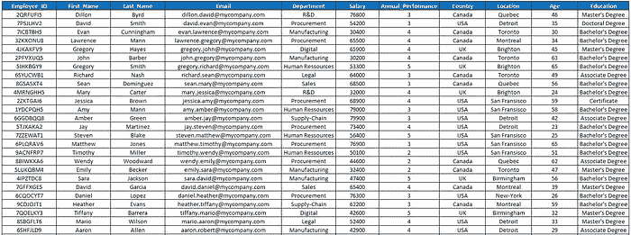

# 逆向工程数据库架构：GPT vs. Bard vs. LLama2（第 2 集）

> 原文：[`towardsdatascience.com/retro-engineering-a-database-schema-gpt-vs-bard-vs-llama2-episode-2-e7f144a6753b?source=collection_archive---------12-----------------------#2023-10-06`](https://towardsdatascience.com/retro-engineering-a-database-schema-gpt-vs-bard-vs-llama2-episode-2-e7f144a6753b?source=collection_archive---------12-----------------------#2023-10-06)

## 在我之前的文章中，我对比了 GPT-4 模型和 Bard。现在 Llama-2 登场，是时候看看它在竞争对手面前的表现了！

 [Pierre-Louis Bescond](https://pl-bescond.medium.com/?source=post_page-----e7f144a6753b--------------------------------)

·

[关注](https://medium.com/m/signin?actionUrl=https%3A%2F%2Fmedium.com%2F_%2Fsubscribe%2Fuser%2F4ef7c1e10597&operation=register&redirect=https%3A%2F%2Ftowardsdatascience.com%2Fretro-engineering-a-database-schema-gpt-vs-bard-vs-llama2-episode-2-e7f144a6753b&user=Pierre-Louis+Bescond&userId=4ef7c1e10597&source=post_page-4ef7c1e10597----e7f144a6753b---------------------post_header-----------) 发表在 [Towards Data Science](https://towardsdatascience.com/?source=post_page-----e7f144a6753b--------------------------------) · 6 分钟阅读 · 2023 年 10 月 6 日

--

照片由 [Dustin Humes](https://unsplash.com/@dustinhumes_photography?utm_source=medium&utm_medium=referral) 提供，来源于 [Unsplash](https://unsplash.com/?utm_source=medium&utm_medium=referral)

# 初始（及最终）数据集

如 [在这篇文章中](https://medium.com/p/2e2776e8af86) 所解释的，我们将从一个包含员工信息的虚假 AI 生成数据集开始。

[## 反向工程数据库模式和质量检查：GPT 与 Bard](https://towardsdatascience.com/retro-engineering-a-database-schema-and-quality-checks-gpt-vs-bard-2e2776e8af86?source=post_page-----e7f144a6753b--------------------------------)

### LLM 能否通过反向工程整合数据集以设计原始数据库，并建议相应的数据…

towardsdatascience.com

原始表格有 11 列 x 7688 行，但我们将提取 50 行样本，以适应当前 LLM 的令牌限制。

数据源示例（图片来自作者）

*(注意：笔记本和数据源在文章末尾提供)*

# 数据模型的反向工程
