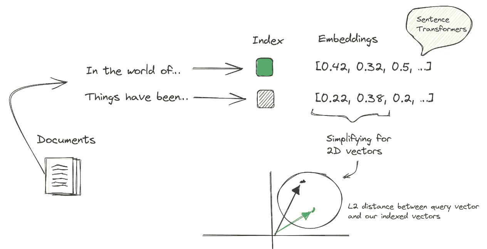

# 语言障碍的革命：掌握多语言音频转录和语义搜索

> 原文：[`towardsdatascience.com/revolutionizing-language-barriers-mastering-multilingual-audio-transcription-and-semantic-search-5540f038778d`](https://towardsdatascience.com/revolutionizing-language-barriers-mastering-multilingual-audio-transcription-and-semantic-search-5540f038778d)

## 利用先进的转录和语义搜索技术，解锁跨语言信息访问的潜力

[](https://medium.com/@luisroque?source=post_page-----5540f038778d--------------------------------)[](https://towardsdatascience.com/?source=post_page-----5540f038778d--------------------------------) [Luís Roque](https://medium.com/@luisroque?source=post_page-----5540f038778d--------------------------------)

·发表于 [Towards Data Science](https://towardsdatascience.com/?source=post_page-----5540f038778d--------------------------------) ·12 min 阅读·2023 年 12 月 13 日

--

*这篇文章由 Rafael Guedes 共同撰写。*

# 介绍

在我们这个互联的世界中，信息没有边界，使其对每个人都可访问，不论他们的母语是什么或他们是否有能力学习新语言，这一能力变得非常重要。无论你是内容创作者还是全球组织的负责人，能够快速而轻松地帮助你的追随者/客户在多种语言中搜索特定信息都有很多好处。例如，它可以帮助客户找到用不同语言已经回答过的相同问题。

考虑一个不同的使用场景，你经常需要参加公司会议。通常，你可能无法参与，而讨论的许多话题可能与你无关。如果你能够搜索感兴趣的主题并收到总结，包括相关讨论的开始和结束时间，这将多么方便？这样，你可以用十到十五分钟的时间获取所需的信息，而不是花费一个小时在会议上，这将显著提高你的生产力。此外，你可能有用葡萄牙语和英语录制的会议。然而，你仍然希望用英语进行搜索。

在本文中，我们将展示如何实现多语言音频转录和多语言语义搜索，以便你可以将其应用于你的使用场景。对于多语言音频转录，我们将解释 Whisper 和 WhisperX 的工作原理、它们的局限性以及如何在 Python 中使用它们。

然后，我们介绍多语言语义搜索模型如何训练，以及为何您可以从向量数据库中获取相同的信息，无论您用什么语言查询。我们还提供了使用 Postgres 和 PGVector 进行语义搜索的详细实现。

最后，我们展示了上述结果在两个用例中的表现。我们使用了两个视频，一个是葡萄牙语的，另一个是英语的，并用葡萄牙语和英语提出相同的问题，以检查是否能得到相同的答案。


图 1: 多语言音频转录和多语言语义搜索有无尽的应用场景待探索（[i](https://unsplash.com/photos/black-and-gray-condenser-microphone-pfhld_5yQrs)图像由作者使用 DALLE 制作）

一如既往，代码可以在我们的 [GitHub](https://github.com/zaai-ai/large-language-models) 上找到。

# WhisperX：一个强大的音频转录架构

WhisperX [1] 是 Whisper [2] 的进化形式，Whisper 是由 OpenAI 开发的模型。但它们之间有什么区别呢？

Whisper 和 WhisperX 是能够进行多语言语音识别、语音翻译、口语语言识别和语音活动检测的语音识别模型。它们依赖于转换器序列到序列架构，将各种语音处理任务表示为一系列由解码器预测的标记。


图 2: Whisper 架构（[i](https://arxiv.org/pdf/2303.00747.pdf)图像由作者提供）

尽管 Whisper 在不同领域和语言中表现出色，但在长音频转录方面还需要改进。这个问题的主要原因是训练期间使用的滑动窗口方法。这通常导致漂移和幻觉。它在将转录与音频时间戳对齐时也存在限制。

WhisperX 来解决这些问题：

1.  **漂移和幻觉**是通过语音活动检测 (VAD) 和自定义的方法来解决的，用于剪切和合并音频片段。VAD 检测人声的存在或缺失，并根据该分类将输入音频分成段。之后，它将带有人声的片段剪切并合并为 30 秒的窗口。它尝试在语音概率较低的区域定义边界。这些片段被剪切成 30 秒的窗口，以匹配 Whisper 训练时使用的片段持续时间。

1.  **转录对齐**是通过强制对齐来解决的，这是架构的最后一层。它使用音素识别模型来识别区分一个单词和下一个单词的最小语音单元，例如，**‘t’** 在 **‘nut’** 中的元素。然后，通过获取同一单词中第一个和最后一个音素的开始和结束时间来获得每个单词的开始和结束时间，以获得更可靠的对齐。


图 3：WhisperX 架构 ([i](https://arxiv.org/pdf/2303.00747.pdf) 图片由作者提供)

# Whisper 和 WhisperX 的实际应用

我们可以使用 Whisper 或 WhisperX 通过几行代码转录音频。我们需要从 `git+https://github.com/openai/whisper.git` 和 `git+https://github.com/m-bain/whisperx.git` 安装 Whisper 和 WhisperX。

安装完成后，我们首先导入 Whisper 或 WhisperX。然后，我们加载模型，最后，我们转录 `.wav` 格式的音频文件。结果将是一个包含三个键的字典：

1.  *‘text’* 是一个包含完整转录文本的字符串。

1.  *‘segments’* 是一个文本片段的列表，包含开始和结束时间以及其他一些元数据。

1.  *‘language’* 是一个表示音频语言的字符串。

```py
### ----- WHISPER ----- ###
import whisper
```

```py
model = whisper.load_model("large", "cpu")
result = model.transcribe("<YOUR AUDIO FILE>.wav")### ----- WHISPERX ----- ###
import whisperxmodel = whisperx.load_model("large-v2", "gpu", compute_type="float16")
audio = whisperx.load_audio("<YOUR AUDIO FILE>.wav")
result = model.transcribe(audio)
```

如前所述，Whisper 在将转录与音频时间戳对齐时存在一些局限性。因此，我们使用 WhisperX 来解决这个问题。

我们加载对齐模型，并根据 Whisper 或 WhisperX 的结果，修正其对齐。

```py
from whisperx import load_align_model, align
```

```py
model_a, metadata = load_align_model(language_code=result['language'], device="cpu")
result_aligned = align(result['segments'], model_a, metadata, "<YOUR AUDIO FILE>.wav", "cpu")
```

# 语义搜索：一种多语言方法

语义搜索是一种搜索引擎技术，它匹配查询的含义，而不是传统搜索方法匹配查询的关键词。

语义搜索通过使用 Transformers 来实现有效性，Transformers 对于将自由文本形式的文档转换为数值表示至关重要。这些表示，称为嵌入，实际上是存储在像 [PGVector](https://github.com/pgvector/pgvector) 这样的向量数据库中的向量。这个过程使语义搜索能够基于含义或意图匹配查询，从而显著提高搜索结果的准确性和相关性。



图 4：语义搜索的内部工作原理（图片由作者提供）

当用户提交查询时，它会被转换成一个嵌入。这个嵌入随后被向量数据库的内置检索系统利用，通常基于 k 最近邻（kNN）算法。该系统使用这个算法来识别和排序与用户查询最相关的 k 个最相似的文档。这个过程确保检索到的结果与用户的搜索意图紧密对齐。


图 5：语义搜索嵌入被应用于文本、音频或图像。这些嵌入可以存储在由 kNN 支持的向量数据库中，以根据用户查询检索最相关的文档。 ([i](https://www.elastic.co/what-is/semantic-search) 图片由作者提供)

最新的 NLP 进展，特别是在语义搜索方面，使得在不同语言中为相同句子创建相同的嵌入成为可能 [3]。这对全球运营的组织带来了巨大的优势，因为他们可以快速且低成本地将语义搜索扩展到更多语言。这是可能的，因为所需的样本相对较少，硬件要求较低，正如我们将遵循的方法的作者所提到的。

扩展通常基于英语的单语模型涉及使用**教师模型**和**学生模型**。这些模型在使语言模型能够有效处理多种语言方面扮演着不同但互补的角色。

**教师模型：** 该模型作为参考点或标准。它通常是一个在源语言（通常是英语）中经过充分训练的高性能模型。教师模型对语言有深刻的理解，能够生成准确代表各种文本含义的高质量嵌入向量。

**学生模型：** 学生模型旨在从教师模型中学习。与仅在源语言中操作的教师模型不同，学生模型同时处理源语言和翻译语言。学生模型的主要目标是在新语言环境中复制教师模型的性能。

这些模型的使用及其有效性的原因在于它们的训练方法：

1.  **嵌入对齐：** 学生模型的训练目标是最小化其嵌入与教师模型生成的嵌入之间的均方误差。这个过程确保了学生模型在源语言和翻译语言中生成的嵌入与教师模型的嵌入紧密匹配。

1.  **语言适应：** 这种训练方法使学生模型能够适应新语言，同时保持原始模型的质量和特征。通过与教师模型的理解对齐，学生模型能够有效处理和理解翻译语言。

1.  **高效学习：** 学生模型不必从头开始学习。通过利用教师模型已经成熟的理解，学生模型可以在新语言中以潜在更少的数据和训练时间实现高性能。

1.  **跨语言一致性：** 这种方法确保模型在不同语言中的性能一致。它在保持嵌入质量方面特别有利，而嵌入对语义搜索、自然语言理解和翻译等任务至关重要。

尽管可以使用几种架构，但作者们为教师模型使用了 Sentence-BERT [4]，为学生模型使用了 XLM-RoBERTa [5]。


图 6：多语言嵌入创建的架构，其中给定两个不同语言的相同句子，学生模型可以生成与教师模型生成的向量相近的两个语言的向量（[来源](https://arxiv.org/pdf/2004.09813.pdf)）

# 使用 PGVector 实现多语言语义搜索

在本节中，我们介绍了在 Postgres 上实现 PGVector 的方法。我们还部署了一个 pgAdmin 应用程序来查询 Postgres，并检查我们的嵌入如何存储。

我们借助 LangChain 来编码来自 Whisper 或 WhisperX 的转录，将其插入 Postgres 中的一个表，并检索与用户查询最相似的文档。

由于在我们的使用案例中，我们需要能够检索信息，而不论音频的语言或用户查询的语言，因此我们使用`sentence-transformers`中的`multi-qa-mpnet-base-dot-v1`来编码转录。我们选择这个模型是因为它在多语言语义搜索中表现最佳（你可以在[这里](https://www.sbert.net/docs/pretrained_models.html#multi-lingual-models)查看可用的多语言语义搜索模型）。

# 设置 PGVector

我们使用 Docker 部署由 PGVector 支持的 Postgres。我们首先定义 docker-compose.yml 文件，包含两个容器，`postgres`和`pgadmin`。

**Postgres：**

+   镜像：`ankane/pgvector`允许我们部署带有 PGVector 扩展的 Postgres。

+   端口：5432

+   环境：与 Postgres 交互的用户名和密码，以及一个存储我们嵌入的数据库。

**pgAdmin：**

+   镜像：`dpage/pgadmin4`。

+   端口：5050

+   环境：登录用的电子邮件和密码。

```py
version: '3.8'
services:
  postgres:
    container_name: container-pg
    image: ankane/pgvector
    hostname: localhost
    ports:
      - "5432:5432"
    environment:
      POSTGRES_USER: admin
      POSTGRES_PASSWORD: root
      POSTGRES_DB: postgres
    volumes:
      - postgres-data:/var/lib/postgresql/data
    restart: unless-stopped
  pgadmin:
    container_name: container-pgadmin
    image: dpage/pgadmin4
    depends_on:
      - postgres
    ports:
      - "5050:80"
    environment:
      PGADMIN_DEFAULT_EMAIL: admin@admin.com
      PGADMIN_DEFAULT_PASSWORD: root
    restart: unless-stopped
volumes:
  postgres-data:
```

一旦定义了 docker-compose 文件，我们可以通过在 docker-compose 文件所在的目录中运行`docker-compose up -d`命令来启动我们的应用程序。

应用程序运行后，是时候在 pgAdmin 中创建一个服务器，以便我们可以查询我们的嵌入和文档。为此，我们必须按照以下步骤操作：

1.  在网页浏览器中打开 pgAdmin 的 Web 界面，访问[`localhost:5050/`](http://localhost:5050/)。

1.  使用我们在 docker-compose 文件中的`PGADMIN_DEFAULT_EMAIL`和`PGADMIN_DEFAULT_PASSWORD`环境变量中设置的电子邮件和密码进行登录。

1.  右键点击*服务器*节点，选择*注册 →* *服务器*。

1.  在*创建 — 服务器*对话框中，在*名称*字段中输入服务器名称。

1.  在*连接*选项卡中，插入以下信息：

1.  *主机名/地址*：`postgres`

1.  *端口*：`5432`

1.  *维护数据库*：你可以使用`postgres`数据库来完成这个任务。

1.  *用户名*：`POSTGRES_USER`环境变量，我们在 docker-compose 文件中设置了它。

1.  *密码*：`POSTGRES_PASSWORD`环境变量，我们在 docker-compose 文件中设置了它。

1.  点击*保存*按钮以创建服务器。

创建好服务器后，我们来填充刚刚创建的名为`postgres`的数据库中的嵌入和文档。

注意：这个 pgAdmin 是可选的；如果你不想查询嵌入，可以跳过这一步。

# 使用 LangChain 填充 Postgres

一旦数据库设置好并准备好存储嵌入，就该定义编码器了。之后，我们使用 LangChain 来填充和检索数据库中与用户查询最相似的文档。

如上所述，编码器是多语言的，可以定义为：

```py
from langchain.embeddings import HuggingFaceEmbeddings

encoder = HuggingFaceEmbeddings(
    model_name="sentence-transformers/multi-qa-mpnet-base-dot-v1",
    model_kwargs={"device": "cpu"},
)
```

LangChain 与 PGVector 集成。因此，要将 LangChain 连接到 Postgres，我们需要将字符串连接定义如下：

```py
from langchain.vectorstores.pgvector import PGVector

CONNECTION_STRING = PGVector.connection_string_from_db_params(
     driver="psycopg2", # driver to connect with postgres
     host="localhost", # host defined in docker-compose.yml
     port="5432", # port defined in docker-compose.yml     
     database="postgres", # database defined in docker-compose.yml
     user="admin", # user defined in docker-compose.yml
     password="root", # password defined in docker-compose.yml
)
```

请注意，`COLLECTION_NAME` 必须唯一，因为 PGVector 将使用它作为键来识别从 Postgres 检索的文档。对于我们的用例，我们可以将 `COLLECTION_NAME` 视为会议 ID，这样可以从用户感兴趣的会议中检索信息。

```py
COLLECTION_NAME = "Meeting ID"
```

在定义编码器、连接和集合名称之后，我们将来自 Whisper 或 WhisperX 的转录内容转换为文档（LangChain 所期望的格式）。我们还创建并填充了一个包含嵌入的表。

```py
from langchain.docstore.document import Document

# Transform transcription into documents and add the start and end time of each sequence 
docs = [Document(page_content=f'start {item["start"]} - end {item["end"]}: {item["text"]}') for item in result['segments']]
db = PGVector.from_documents(
 embedding=encoder,
  documents=docs,
  collection_name=COLLECTION_NAME,
  connection_string=CONNECTION_STRING,
  pre_delete_collection=True,  # deletes previous records, useful for testing
)
```

在创建并填充表格后，我们可以查询数据库，并使用 LangChain 获取最相似的文档：

```py
similar_docs = db.similarity_search("<USER QUERY>")
```

或者我们也可以去 pdAdmin 并查询 Postgres 以查看嵌入和文档的样子：


图 7：在 pgAdmin 中查询嵌入向量和文档（作者提供的图像）

# 多语言语义搜索有效吗？

我们将 Luis 谈论两个不同主题的两个视频转换为音频。在第一个视频中，Luis 用葡萄牙语谈论他的前一家公司；在第二个视频中，他谈论了概率深度学习。然后，我们使用葡萄牙语和英语查询这两个视频，并比较检索到的文档。

对于葡萄牙语用例，我们使用了以下查询

+   葡萄牙语：`marcas e investimentos`

+   英语：`brands and investments`

因此，前四个最相关的文档在两个案例中都是相同的：

> 开始 81.401 — 结束 85.26：一个总部位于柏林的品牌，因此我们没有等待这个投资到来，
> 
> 开始 111.902 — 结束 117.26：为了成熟产品、投资技术和进行业务开发。
> 
> 开始 88.58 — 结束 93.039：这两轮投资我们已经做了，能力也有所不同开始
> 
> 28.6 — 结束 32.64：因此，我们提供了品牌所需的所有物流基础设施组件。

对于英语用例，我们使用了以下查询

+   葡萄牙语：`modelos de aprendizagem profunda`

+   英语：`deep learning models`

我们必须检索八个文档以找到相关的文件。这是因为在葡萄牙语中，我们通常不翻译 *Deep Learning*；我们使用英语表达。因此，模型可能没有足够的数据进行训练。

> 开始 45.28 — 结束 51.9：当我们使用深度学习模型时，我们通常依赖于最大似然估计

另一方面，以下查询的前 4 个结果相同

+   葡萄牙语：`distribuição normal`

+   英文: `normal distribution`

这表明，对于经常翻译的术语，例如‘*normal distribution*’到*‘distribuição normal’*，我们的方法能够产生相关输出。

# 结论

多语言音频转录和语义搜索是构建更加互联世界的重要资产。我们的例子只是冰山一角；还有许多技术可以结合使用，以应对不同的应用场景。

考虑一种使用检索增强生成（RAG）系统进行客户支持的场景。通常，在客户支持系统中，客户用任何语言提问。我们可以用多语言模型对这些问题进行编码，并使用检索器从客户服务专家那里提取相关的过往回答作为上下文。大型语言模型（LLM）使用这些上下文生成翻译成客户语言的答案。该系统有效地减少了客户服务专家的工作负担，并提供了快速、实时的客户支持。

尽管我们的方法提供了广泛的可能性，但它并不是万能的解决方案。例如，在我们的实验中，检索器未能将“Deep Learning”与其葡萄牙语对应词“Aprendizagem Profunda”语义关联起来。克服这些限制需要使用特定数据进行微调或实施基于规则的机制，以提高文档检索的准确性，特别是在不同语言之间。

保持联系: [LinkedIn](https://www.linkedin.com/in/luisbrasroque/), [X/Twitter](https://x.com/luisbrasroque), [Medium](https://medium.com/@luisroque)。

# 参考文献

[1] Max Bain, Jaesung Huh, Tengda Han, Andrew Zisserman. WhisperX: 精确时间语音转录长篇音频。arXiv:2303.00747, 2023

[2] Alec Radford, Jong Wook Kim, Tao Xu, Greg Brockman, Christine McLeavey, Ilya Sutskever. 通过大规模弱监督的稳健语音识别。********arXiv:2212.04356, 2022

[3] Nils Reimers, Iryna Gurevych. 通过知识蒸馏将单语句子嵌入转换为多语种。arXiv:2004.09813, 2020。

[4] Nils Reimers, Iryna Gurevych. Sentence-BERT: 使用 Siamese BERT 网络的句子嵌入。arXiv:1908.10084, 2019。

[5] Alexis Conneau, Kartikay Khandelwal, Naman Goyal, Vishrav Chaudhary, Guillaume Wenzek, Francisco Guzmán, Edouard Grave, Myle Ott, Luke Zettlemoyer, Veselin Stoyanov. 大规模无监督跨语言表示学习。arXiv:1911.02116, 2019。
