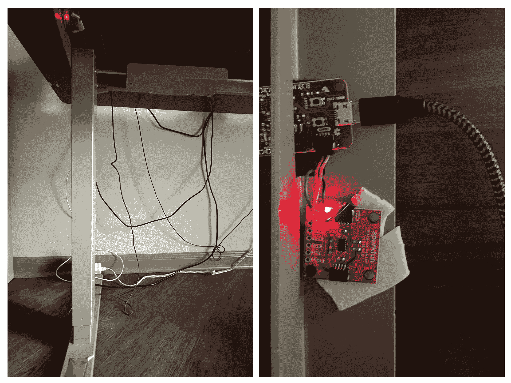
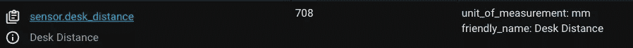
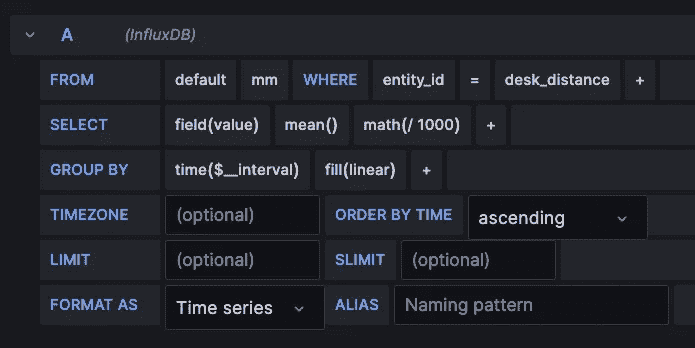
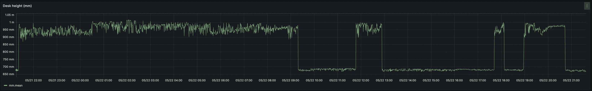
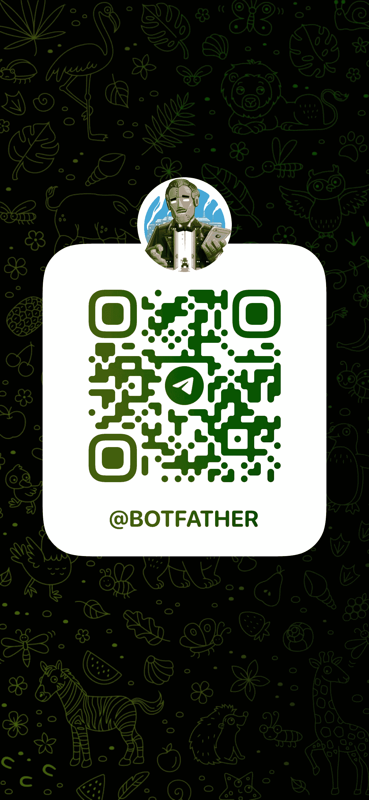
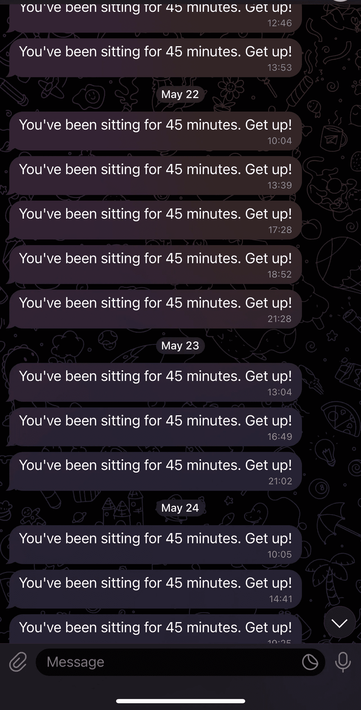

# Rise Up! 使用数据和 Home Assistant 为我的站立式办公桌建立警报系统

> 原文：[`towardsdatascience.com/rise-up-building-an-alert-system-for-my-standing-desk-using-data-and-home-assistant-a7574236f579`](https://towardsdatascience.com/rise-up-building-an-alert-system-for-my-standing-desk-using-data-and-home-assistant-a7574236f579)

## 将微处理器、Home Assistant、Grafana、InfluxDB 和 Telegram 集成，为桌子提供智能化和更健康的工作环境

[](https://medium.com/@juandes?source=post_page-----a7574236f579--------------------------------)[](https://towardsdatascience.com/?source=post_page-----a7574236f579--------------------------------) [Juan De Dios Santos](https://medium.com/@juandes?source=post_page-----a7574236f579--------------------------------)

·发表于 [Towards Data Science](https://towardsdatascience.com/?source=post_page-----a7574236f579--------------------------------) ·11 分钟阅读·2023 年 5 月 25 日

--


图片由 DALL-E 生成。提示：“一个带有笔记本电脑的站立式办公桌。笔记本电脑的图像需要是折线图。”

我们都很清楚长期坐着的健康风险。这可能导致肌肉退化、背部问题、糖尿病风险增加等（[source](https://www.betterhealth.vic.gov.au/health/healthyliving/the-dangers-of-sitting)）。是的，情况确实很糟糕。然而，尽管有这些有害影响，我们中的许多人——包括我自己——还是会长时间坐着。我们这样做是因为我们喜欢这样，或者因为我们的工作需要这样，就像我一样。

为了应对这些健康风险，我买了一个站立式办公桌。我非常喜欢这个桌子。它看起来很酷，并允许我配置高度预设，我在一天中切换这些预设。然而，我必须承认，有时候桌子会一直保持在最低设置，这反映了我缺乏运动。为了应对这个问题（同时也作为一个有趣的借口来启动一个新项目），我在桌子下安装了一个微处理器。这个微处理器监控桌子的高度，它是一个流的入口，最终会通过 Telegram 发送通知提醒我，如果桌子的高度保持在我定义的“坐着”预设太久的话，就提醒我站起来。

我给附加的微处理器配备了一个距离传感器，以便随着时间的推移跟踪其高度并将其记录在 Home Assistant 中，Home Assistant 是一个开源的家庭自动化平台，作为智能家居设备的中心枢纽。我使用的微处理器是来自 SparkFun 的 ESP32 Thing Plus。这种设备包括一个 WiFi 模块，支持开发网络服务器。对于这个项目，我设置了一个网络服务器，具有一个返回传感器测量距离的端点。在这种情况下，这个测量值是桌子到地板的距离——这些数据用于分析我的桌子使用情况，并在长时间坐着后发出警报。本文解释了我是如何做到的。

# 设置

这个项目的核心是我的站立桌。它是一款非常普通的站立桌，配有一个用于调整高度的控制器和四个用于设置特定高度预设的按钮。

[SparkFun Thing Plus ESP32](https://www.sparkfun.com/products/15663) 微控制器是另一个关键组件。在所有功能中，与此项目相关的是 WiFi 收发器和 SparkFun 的 Qwiic 连接系统，它允许在不需要焊接的情况下连接传感器。我用来测量桌子高度的传感器是 [SparkFun Distance Sensor — 1.3 Meter, VL53L4CD (Qwiic)](https://www.sparkfun.com/products/18993)。它通过发射红外激光并计时目标的反射来测量距离。

我将微处理器和传感器放置在桌子下方。由于我的地板和桌腿都不反光，我在传感器下方的桌腿上粘贴了一小块箔纸，以便反射传感器的激光。因此，我实际上是在测量桌子与其底座之间的距离，大约是距离地面 5 厘米。

我将传感器的数据存储在我的 Home Assistant 安装中。Home Assistant 是一个功能复杂的系统，具有许多功能和特性。就这个项目而言，我们需要知道的是，我已经将其安装在一个连接到我的家庭网络的 Raspberry Pi 上，它可以发出警报并将其发送到不同的平台，并且它可以托管 InfluxDB（一个处理高量时间戳数据的时间序列数据库）和 Grafana（一个数据可视化和监控工具）。

你可以在[这里](https://www.home-assistant.io/)了解更多关于 Home Assistant 的信息。



我的（杂乱的）设置。左侧是桌子（看看箔纸吗？），右侧是微处理器和传感器。我意识到它有多丑。

# 微处理器程序

桌子可能是这个项目的核心，但微处理器程序无疑是大脑。这个程序，我编写了用来跟踪桌子高度的程序，在 ESP32 板上设置了一个网络服务器，通过一个端点提供由 SparkFun VL53L1X 距离传感器采集的距离测量数据。

这里是代码：

```py
#include <WiFi.h>
#include <WebServer.h>
#include <Wire.h>
#include "SparkFun_VL53L1X.h"

// Replace this with the WiFi's SSID
const char* ssid     = "SSID";
// Replace this with the WiFi password
const char* password = "PASSWORD";

// Listening on port 80
WebServer server(80);

#define SHUTDOWN_PIN 2
#define INTERRUPT_PIN 3

SFEVL53L1X distanceSensor(Wire, SHUTDOWN_PIN, INTERRUPT_PIN);

void setup() {
  Serial.begin(115200);
  // Connect to WiFi
  WiFi.begin(ssid, password);

  while (WiFi.status() != WL_CONNECTED) {
    delay(1000);
    Serial.println("Connecting to WiFi...");
  }

  Serial.println("Connected to WiFi");

  // Set the distance sensor
  Wire.begin();
  if (distanceSensor.init() == false) {
    Serial.println("Distance sensor is online.");
  }

  server.on("/distance", [](){
    // Measure the distance
    distanceSensor.startRanging();
    int distance = distanceSensor.getDistance(); // Distance is in mm.
    distanceSensor.stopRanging();
    server.send(200, "text/plain", String(distance));
  });

  // GET /ping is just a health check
  server.on("/ping", [](){
    server.send(200, "text/plain", "ok");
  });

  server.begin();
  Serial.println("HTTP server started");
}

void loop() {
  server.handleClient();
}
```

我开始编写代码，导入必要的库，包括 WiFi 模块和距离传感器库。在库之后，我们定义了两个常量：WiFi 的 SSID 和密码。接下来，我们创建 Web 服务器，指定其端口，并初始化传感器。然后是`setup()`函数，其中包含主要逻辑。这个函数的前半部分是启动 WiFi 连接和距离传感器。一旦两者都准备好，它将继续为 Web 服务器设置两个路径。

第一个路径，`GET /distance`，检索传感器的距离测量值并以纯文本形式返回（例如，`695`）。

第二条路径，`GET /ping`，是一个健康检查，以确保程序正在运行。尽管第一个端点也可以完成这个目的，但我专门创建了一个不同的端点用于健康检查。

现在，我们需要将程序上传到 Arduino。我在这里不会深入探讨如何做，但如果你需要帮助，可以参考这个指南[`support.arduino.cc/hc/en-us/articles/4733418441116-Upload-a-sketch-in-Arduino-IDE`](https://support.arduino.cc/hc/en-us/articles/4733418441116-Upload-a-sketch-in-Arduino-IDE)。

一旦程序运行，你可以使用类似`curl -X GET http://192.168.1.XXX/distance`的 cURL 命令进行测试，只要执行命令的设备与微处理器在同一网络上。请注意，你需要将`XXX`替换为微处理器的实际 IP。找到 IP 的一种方法是查看路由器控制面板上的连接设备列表。

# 从 Home Assistant 消耗端点

下一步是使用[sensor](https://www.home-assistant.io/integrations/sensor/)组件将`/distance`端点与 Home Assistant 集成。为了简便起见，我假设你已经安装了 Home Assistant 并熟悉其基础知识。

传感器组件监控实体的状态和条件，这可以是物理传感器或像我们创建的端点。要设置此功能，你需要通过[文件编辑器](https://www.home-assistant.io/getting-started/configuration/)或控制台访问 Home Assistant 的配置文件`configuration.yaml`。进入文件后，查找 YAML 文件中现有的`sensor`键，如果没有，则创建一个。在此键下，添加以下内容：

```py
sensor:
  - platform: rest
      name: Desk Distance
      unique_id: desk_distance
      unit_of_measurement: "mm"
      resource: [`192.168.1.XXX/distance`](http://192.168.1.XXX/distance)
```

此配置在传感器组件中设置了一个[*RESTful*](https://www.home-assistant.io/integrations/rest/)平台——一个消耗 REST 端点的平台。它有四个值：

+   `name`：端点的描述性名称。

+   `unique_id`：传感器的唯一标识符。

+   `unit_of_measurement`：传感器的测量单位。在我们的案例中，它是“mm”，因为距离传感器以毫米为单位进行测量。

+   `resource`：要使用的端点的 URL。

还有一个名为`method`的可选字段，用于指定请求的 HTTP 方法。我没有使用它，因为它默认为`GET`，这是我们端点的方法。

现在保存文件并重新加载以应用更改。为确保其正常工作，考虑在仪表盘中创建一个新模块以显示传感器读取的值。或者，您可以在开发者工具的“states”选项卡中找到该实体。



从开发者工具的“states”选项卡中可以看到传感器。

下一部分解释了如何使用 InfluxDB 和 Grafana 来可视化数据。

# 使用 Grafana 和 InfluxDB 可视化数据

在开始这个项目之前，我设想了用一个可视化工具显示桌面的实际升降。幸运的是，对于 Home Assistant 社区和我来说，有一个[成员](https://github.com/frenck)创建了一个插件，可以无缝地将[InfluxDB](https://github.com/hassio-addons/addon-influxdb)和[Grafana](https://github.com/hassio-addons/addon-grafana)集成到平台中。InfluxDB 是一个高性能的开源时间序列数据库，能够高效地存储和管理大量时间戳数据，非常适合跟踪桌面的高度变化。Grafana 是一个开源的数据可视化和监控平台，允许用户创建交互式、自定义的仪表盘。将 InfluxDB 和 Grafana 结合起来，可以实时收集、存储和可视化桌面的移动数据，提供了跟踪桌面高度的无缝体验。有关如何安装它们的说明，请参考[InfluxDB](https://github.com/hassio-addons/addon-influxdb/blob/main/README.md)和[Grafana](https://github.com/hassio-addons/addon-grafana/blob/main/README.md)的文档。

安装和设置（包括在 Grafana 中添加 InfluxDB 作为数据源）完成后，导航到 Grafana 的仪表盘以创建新的仪表盘和面板；这个面板就是我们将可视化桌面高度的地方。页面底部是查询区域，我们将在这里定义从 InfluxDB 获取数据的查询。首先，从“数据源”菜单中选择“InfluxDB”。然后，按照如下方式填写空白：

+   `FROM`：选择 InfluxDB 数据源的名称（我的为`default`）。在旁边的字段中，选择“mm”——这是存储单位为毫米的传感器数据的表的名称。

+   `WHERE`：使用此子句仅过滤实体`desk_distance`。

+   `SELECT`：从菜单中选择`value`。我还应用了`mean()`聚合函数和数学公式`math(/1000)`，将 Y 轴刻度转换为米。

+   `GROUP_BY`：使用 `time($_interval)` 按 `$_interval` 分组数据，其中 `$_interval` 是由 Grafana 计算的时间间隔（参见解释[这里](https://grafana.com/docs/grafana/latest/dashboards/variables/add-template-variables/#__interval)），而 `fill(linear)` 使用线性插值填充指定时间范围内的任何缺失数据点。我使用这个方法来避免在我的可视化中出现间隙。



上述查询。

配置这些参数后，你将得到一个类似于这样的图表：



我的图表是这样的。

这个图表表示两天的数据。y 轴显示桌子的高度（单位：毫米），而 x 轴显示时间。你可以清楚地看到我最常使用的两个预设：坐着的预设，桌子高度约为 700 毫米，和站立的预设，将桌子升高到近一米的高度。

# 发送警报到 Telegram

这个项目的最终目标是开发一个提醒我在长时间坐着后站立的通知系统。通过使用从距离传感器收集的数据，Home Assistant 的[警报](https://www.home-assistant.io/integrations/alert/)集成可以在事件发生时发送这些提醒。这些通知通过另一个集成[通知](https://www.home-assistant.io/integrations/notify/)发送，该集成支持多种平台，包括 Twilio、电子邮件和 Telegram——我将在这个项目中使用它。

从 Home Assistant 设置一个 Telegram 的警报涉及两个关键步骤：创建一个 Telegram 机器人来接收警报，以及在 Home Assistant 中定义警报。

## 创建机器人

我使用了一个现有的 Telegram 机器人[BotFather](https://core.telegram.org/bots/tutorial)来创建我的警报机器人。要开始，打开一个新的聊天窗口并搜索 BotFather，开始对话。开始对话后，按照屏幕上的说明操作，这些说明大多是关于你的新机器人的问题，例如其名称。BotFather 然后会提供一个 API 令牌来控制你最近创建的机器人，以及一个启动 Telegram 对话的链接。



BotFather 的二维码

接下来，你需要从与你的机器人对话中获取 chat ID。我通过 curl 请求 `$ curl -X GET https://api.telegram.org/bot<YOUR_API_TOKEN>/getUpdates` 获得了这个 ID（在此之前，你需要给机器人发送一条消息），其中 `YOUR_API_TOKEN` 是你从 BotFather 获得的 API 密钥。API 响应是一个 JSON 对象，其中包含一个 `chat` 对象和一个名为 `id` 的字段，包含 chat ID。

你也可以使用另一个名为[GetIDs](https://t.me/getidsbot)的机器人来获取 ID，它提供关于聊天和消息的信息。不过，我没有尝试这种方法。

## 定义警报

最后一步涉及在 Home Assistant 中定义警报。打开`configuration.yaml`文件，并按如下方式配置机器人：

```py
telegram_bot:
  - platform: polling
    api_key: YOUR_API_KEY
    allowed_chat_ids:
      - CHAT_ID_1 # your chat_id
      - CHAT_ID_2 # Optional. You can also add another chat!
```

接下来，创建通知器，通过你刚刚配置的机器人发送通知：

```py
notify:
  - platform: telegram
    name: NOTIFICATION_NAME
    chat_id: chat_id
  - platform: telegram # Optional. Add another telegram platform if you wish to notify another chat.
    name: NOTIFICATION_NAME_2
    chat_id: chat_id_2
```

最后，在`automation`键下定义警报本身（如果没有，则创建它）：

```py
automation:
  - alias: "Desk Distance Alert 45 minutes"
      trigger:
        platform: numeric_state
        entity_id: sensor.desk_distance
        below: 900
        for:
          minutes: 45
      action:
        service: notify.HA_NOTIFICATIONS
        data:
          message: "You've been sitting for 45 minutes. Get up!"
```

我的警报名称是*桌面距离警报 45 分钟*，正如名称所示，当我的桌面降低超过 45 分钟时，它会发送通知。

我在`trigger`中定义了“45 分钟”条件。在这里，我们需要一个`numeric_state`自动化，当实体的状态满足条件时触发一个动作。我的条件是在桌面高度`below` 900mm `for` 45 `minutes` 时触发。你可以根据需要自定义这个条件。另外，注意`entity_id`是`sensor`这个词后跟你用来命名传感器的 id，例如`sensor.desk_distance`。我的触发器伴随一个`action`，当触发器启动时执行。这个`action`使用我们之前创建的`NOTIFICATION_NAME`通知服务来发送通知。

我还添加了一个`message`，名字带有鼓励性质，希望能激励我起身。



通知

为了测试这个过程，创建一个在一分钟内触发的临时警报，或访问`https://your_ha_location/config/automation/dashboard`的自动化仪表板。如果警报出现在列表中，点击右侧的三点符号，手动选择“运行”以触发它。如果一切顺利，你应该会收到来自 Telegram 的通知。

## 结论

作为一个在桌子后面坐了大半天的人，我发现解决这种对健康的负面影响至关重要。认识到这一点，我被驱动去寻找一个解决方案——一种提醒自己休息、移动和站立的方法。

通过整合 ESP32 微处理器、SparkFun VL53L1X 距离传感器、Home Assistant、Grafana、InfluxDB 和 Telegram，我打造了一个实时跟踪桌面高度、可视化数据并在我坐得太久时提醒我的系统。

但这个项目不仅仅是关于我的升降桌；它还涉及利用技术工具（以及我放在箱子里很久的传感器）来做出小的改变，从而改善我们的日常习惯。无论你是沉浸在工作中还是迷失在自己的项目里，都不应忽视健康（当然是给自己提个醒）。幸运的是，借助合适的工具和一点数据，我们可以建立既有助于生产力又有助于健康的系统。
