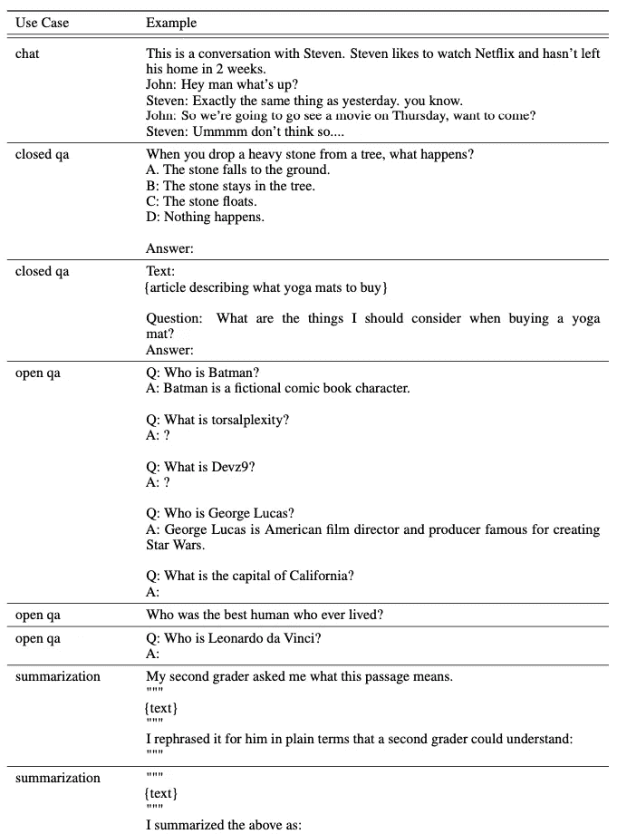
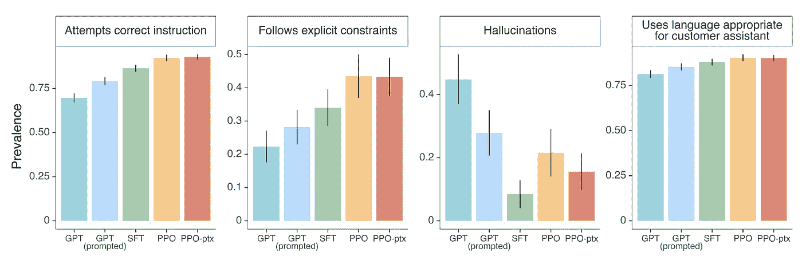

# RLHF: 来自人类反馈的强化学习

> 原文：[`towardsdatascience.com/rlhf-reinforcement-learning-from-human-feedback-faa5ff4761d1`](https://towardsdatascience.com/rlhf-reinforcement-learning-from-human-feedback-faa5ff4761d1)

## ChatGPT 成功的关键：指令数据。

[](https://automata88.medium.com/?source=post_page-----faa5ff4761d1--------------------------------)[](https://towardsdatascience.com/?source=post_page-----faa5ff4761d1--------------------------------) [Ms Aerin](https://automata88.medium.com/?source=post_page-----faa5ff4761d1--------------------------------)

·发表于[Towards Data Science](https://towardsdatascience.com/?source=post_page-----faa5ff4761d1--------------------------------) ·24 分钟阅读·2023 年 10 月 11 日

--

ChatGPT 凭借其令人印象深刻的能力吸引了全世界的关注。但它是如何变得如此聪明的呢？

我最近和一位我非常尊敬的前同事——一位软件工程师进行了交谈，我注意到他认为 ChatGPT 是 AGI 的体现，并将其将复杂主题简化到六岁孩子理解水平的能力作为证据。虽然我对它的不合理智能并不完全不同意，但我觉得有必要表达一下我的想法。在这篇文章中，我想强调 ChatGPT 的魔力在于其训练数据。

精心策划的指令数据是 ChatGPT 类人能力的关键。诸如向 6 岁孩子解释概念、将简历转化为 LinkedIn 资料、与您头脑风暴等功能并不是偶然出现的——它们是被刻意编码到模型中的训练数据。

[发过几次这样的推文后，也许是时候写一篇长文了...](https://x.com/aerinykim/status/1705640689139396775)

和其他人一样，这是我第一次接触封闭研究。自大学以来，所有前沿研究都是开放和同行评审的，直到最近。我相信开放性最终比封闭性更能推动科学进步。

如果我们旨在通过开源来匹配 ChatGPT 的表现，我相信我们需要更加认真对待训练数据。ChatGPT 的有效性很大程度上可能并不是来自于特定的 ML 架构、微调技术或框架。而更可能的是来自于指令数据的广度、规模和质量。

直截了当地说，在平庸的指令数据上微调大型语言模型是一种浪费计算资源。让我们看看训练数据和学习范式中发生了什么变化——我们现在如何以不同的方式格式化训练数据，因此与过去的大规模预训练相比，学习也发生了不同的变化。

# 什么是 RLHF？

RLHF 代表来自人类反馈的强化学习。它有两个主要组成部分：

1.  强化学习（RL）

1.  人类反馈（HF）

## 到底训练的是什么？

历史上，当我们谈论 LLM 训练时，我们只意味着更新语言模型的参数。然而，**当我们使用 RLHF 时，我们训练三个独立模型的参数。** 这种方式提供了更多的自由，因为它不受限于最大似然框架（详细信息见[**[我们为何在 LLM 中尝试 RL？]**](#158d)部分），并且我们直接从数据本身学习目标函数。

这里有三个正在训练的模型：

1.  **语言模型（SFT 模型）**

    是一个像 GPT-3 这样的预训练的大型语言模型。该模型已经经过训练，稍后将基于**指令数据**进行微调。

1.  **奖励模型**

    训练以预测人类偏好并提供奖励信号以强化代理。它是基于**人类反馈**数据进行训练的。

1.  **策略模型** **（代理）**

    通过最大化预测奖励来训练生成令牌。为此，它使用了以奖励模型作为反馈来源的强化学习。策略模型是从 SFT 模型初始化的。

LLM 的预先存在的权重在 RL 阶段进行调整和微调，在这个阶段，模型优化其行为（生成令牌）以最大化奖励（良好的人类反馈）。

关于 RLHF 的开创性论文是[**InstructGPT**](https://arxiv.org/abs/2203.02155)，它是去年由 OpenAI 发布的。认识到 InstructGPT 模型的强大，OpenAI 将所有公共 API 从使用原始模型切换到使用指令模型。随后，他们减少了详细描述进一步进展的学术出版物，将研究转移到内部。我将在这个博客中主要使用 InstructGPT 的例子和方法。

## RLHF 的关键创新：改变训练数据格式

在 RLHF / ChatGPT / InstructGPT 之前（我将这三个术语互换使用），像 GPT-3 这样的语言模型是使用交叉熵损失来预测下一个词的概率。

但预测下一个令牌的概率性是否是我们的最终目标？

绝对不是！ChatGPT 最令人印象深刻的方面是它能在自然语言中执行**许多不同的任务**，如释义、总结、分类等。这种广泛的能力使 ChatGPT 非常出色，并且与那些更专注于单一目的的机器学习模型相比，具有了‘惊叹’的因素。

那么，**为了让语言模型执行各种任务而不仅仅是预测下一个词，我们需要做什么？**

一般来说，如果你想改变模型的行为，你需要改变它的训练数据，无论是其内容、格式，还是两者都有。你也可以改变损失函数。ChatGPT 改变了这三个方面。

在深入 RLHF 的细节之前，我想展示 InstructGPT 团队如何不遗余力地创建了大量详尽的训练数据，使 ChatGPT 成为现实。

**RLHF 中使用了两种类型的人类反馈。** 一种是 **指令数据**，另一种是 **人类偏好数据**。

# 1\. 指令数据（即示范数据）

指令数据是输入和输出的配对，展示了给定输入时模型应该如何表现。

如果你想从头开始训练你的第一个 InstructGPT 模型，你不仅需要编写答案，还需要编写用户输入（用例）。因为直到去年，GPT-3 API 用户很少输入像向 6 岁孩子解释复杂概念这样的大胆提示。用户从未想过可以向模型提出这样的问题。这也是为什么指令数据也被称为“示范”数据。**我们首先必须向语言模型展示用例。**

让我们看看 InstructGPT 团队策划的各种用例（提示）。



InstructGPT 提供的用例示例

这里有一些有趣的用例来强调：

+   封闭式问答用例有明确的正确和错误答案，如：

```py
When you drop a heavy stone from a tree, what happens? 

A. The stone falls to the ground.
B: The stone stays in the tree.
C: The stone floats.
D: Nothing happens.

Answer:
```

+   开放式问答用例会有主观性的回答：

```py
Who was the best human who ever lived?

Answer:
```

+   重写用例将需要标注者的创造力。

```py
Convert my resume into a profile overview. 

{resume}

Profile overview: 
```

## 创建指令数据时的勤奋

让我们看看生成高质量指令数据需要什么。这是来自 InstructGPT API 提示分发的标注说明摘录。


InstructGPT 的 API 提示分发标注说明摘录

这一长段文字是为“标注者”准备的。这是一份长文件，似乎有很多含义需要弄清楚。我们需要这套长说明，因为为了让标注者创建我们想要的指令数据，他们必须首先理解我们希望他们做什么，并且 **遵循这些规则。**

似乎有三条规则你应该遵循：

**有帮助、真实且无害。**

让我们来看看成为有帮助的标准。

> **“**回答他们本来想问的问题，即使他们问得不准确。”**

这是一个巨大的要求。它要求标注者真正尝试帮助用户，而不是用“我不理解你”这样的回答来回避用户提出的错误问题。这类似于母亲尝试理解她的宝宝想要什么，即使宝宝没有准确地说出来。

> **“对国际性敏感（例如，“football”不应指美式足球，而“the president”不一定指美国总统）”**

标注员应具备扎实的语言能力和对不同文化运作方式的良好理解。

所以，**谁是这些能够认真遵循这些复杂指南的标注员呢？** 他们肯定不是那些只能每天投入 1-2 小时的众包平台的兼职工人。根据我创建大规模训练数据的经验，随意的众包工人无法充分提供自然、细腻的对话，进而促使 ChatGPT 的卓越表现。

我更倾向于使用**“数据编写者”**这个术语，而不是“标注员”，因为它更能体现其中的创造力和细致入微。为了确保这些数据编写者提供你所需的高质量工作，你需要培训他们，与他们过度沟通，保持一致，审查他们的提交，给予反馈，并保留最优秀的编写者，让其余的离开。你需要能够信任你的编写者，因为你的 LLMs 的表现（“wow”因素、ChatGPT 对你问题的回答质量等）将基于他们的工作。虽然你是他们的老板，但你也严重依赖他们。这是一种迷人的共生关系，本身就是一种艺术。

InstructGPT 团队值得大力称赞，他们将这门艺术提升到了一个新的水平。他们的工作告诉我们，如果我们希望开源的 LLMs 能达到 ChatGPT 的表现，数据方面需要无懈可击。

# 2\. 偏好数据

指令数据用于监督性微调（SFT）阶段（详细信息见下一部分)。另一半关键的训练数据是“偏好数据”。偏好数据用于在 RL 阶段训练奖励模型。这涉及到人类根据他们的偏好对不同的 LLM 生成的输出进行排名。偏好数据为正确与错误的行为提供训练信号。

当我阅读标注指南时，像“有帮助的”或“真实的”这样的标准对我来说有点不清楚。此外，如果我是一名标注员，我可能不太会仔细阅读这些指南，因为它们太长了。为了应对这一点，InstructGPT 团队付出了巨大努力，通过提供清晰的示例来培训标注员。**这是影响期望模型行为的关键步骤。**

这里是提供给标注员的示例，帮助他们理解“有帮助的”、“真实的”和“无害的”是什么意思。


以无害性优先为例。好的，安全第一。


阅读上面的“推理”部分。**我认为对训练数据“有用”方面的重视，是 ChatGPT 中最重要的变化。这种注释数据的新方法使得 InstructGPT 与之前的研究区别开来。然而，也值得注意的是，同样的“有用”因素可能会导致** **幻觉（稍后会详细讲解）****。**


上面三个示例来自 InstructGPT 的[公开文档](https://docs.google.com/document/d/1viWm6I2hBPFL2zqflj4s2it32FRbkETZpUS3CcVdFvo/edit?usp=sharing)，展示了指令数据编写者所需的训练水平及其对模型行为的重大影响。

# 指令数据的非凡有效性

让我们比较两个模型的输出——一个是用指令数据训练的，另一个则没有。


模型比较：无指令训练 vs. 从[`openai.com/research/instruction-following`](https://openai.com/research/instruction-following)进行的指令训练

在左侧，未经过指令数据训练的 DaVinci 原版（一个未经过指令数据训练的模型）未能理解“用几句话向 6 岁孩子解释登月”这个提示。它似乎无法理解用户的要求，而是提供了多个无关的回答，如解释进化。

另一方面，右侧的 instruct-DaVinci 模型能够正确回答用户的提示，虽然它比 gpt4 的回答简洁。 :)

# 我为什么要关心指令数据？

## 1\. 理解指令数据的格式可以帮助你编写更好的提示。

你输入的提示与专有模型的指令数据越接近，输出效果就会越好。设计与模型训练数据相似的提示可以通过减少试错的时间来节省你的时间。

## 2\. 它在一定程度上解释了幻觉倾向。

已经提出了各种原因来解释模型中的幻觉现象（[对话模型幻觉的起源：是数据集还是模型？](https://arxiv.org/abs/2204.07931)，[使大型语言模型生成带引用的文本](https://arxiv.org/abs/2305.14627)，[通过总结评估大型语言模型的事实一致性](https://arxiv.org/abs/2211.08412)等）。一些人认为，语言模型显示模式完成行为是因为它们被训练来最大化相邻文本的可能性。但这是否是 RLHF 中幻觉的唯一原因？

**我认为我们不能忽视这样一个事实，即在偏好数据标注过程中，标注人员被指示优先考虑对用户的有用性而非真实性。但当我们进行最终评估时，我们会让标注人员把真实性放在首位。**

再次参考示例 2，“优先考虑有用性而非真实性”。

这个例子展示了在人工偏好数据中对“有帮助”答案加权过重如何导致幻觉。为了减轻这种情况，我们可以生成更多优先考虑真实性和无害性的训练数据，而不是在某些情境下（如医学等高风险领域）只关注帮助性。平衡不同情况下的不同优先级可以帮助减少幻觉。

另一个可能导致幻觉的因素是模型不知道自己被允许表达不确定性。减少幻觉的一个重要步骤是激励模型用文字表达不确定性。这在 NLP 中一直是一个长期存在的问题，正如 SQUAD（斯坦福问答数据集）V2 通过在不确定时不回答的问题所体现的那样。因此，虽然 RLHF 是一个重要的进步，但一些 NLP 的重要问题，如如何处理不确定性，仍然没有完全解决。

好的，我们完成了数据部分。现在让我们看看 RLHF 的方法。

# RLHF 的三步骤

OpenAI 总是分享这个简化的图示来解释 ChatGPT 是如何工作的。我希望现在你可以更好地理解在第 1 步中，次要子步骤“A 标注员展示了期望的输出行为”的意义。


那个图示

# 第一步\. 监督微调（SFT）初始化

RLHF 的第一步是监督微调（SFT），以初始化语言模型权重（图示中的第一列）。SFT 在指令数据上训练模型；克隆展示的对话行为。这一步为后续的强化学习做了准备。

你可以从预训练模型如 GPT-3 开始 SFT，就像 OpenAI 为 InstructGPT 做的那样。或者你也可以从头开始训练，然后继续前进。SFT 的输出为下一个强化学习阶段提供输入。

适当初始化的权重对于强大的下游任务表现至关重要，不仅仅在 RLHF 中如此，一般情况下也是如此。因此，SFT 模型的选择不是随意的。最佳的 SFT 模型将根据使用验证集的奖励模型得分来选择。

> [InstructGPT 中的一些显著摘录]
> 
> 最终的奖励模型是从一个 6B GPT-3 模型初始化的，该模型在各种**公共 NLP 数据集（ARC, BoolQ, CoQA, DROP, MultiNLI, OpenBookQA, QuAC, RACE, 和 Winogrande）**上进行了微调。这主要是出于历史原因；我们发现从 GPT-3 或 SFT 模型初始化 RM 时也会得到类似的结果。
> 
> 我们发现我们的 SFT 模型在 1 个周期后会在验证损失上过拟合；然而，我们发现训练更多周期对 RM 得分和人工偏好评级都有帮助，尽管存在过拟合。

获取良好的指令数据可能很昂贵，特别是如果你没有成千上万的用户提交的种子提示。那么，如果你没有像商业企业那样的资源，你可以做什么呢？一个选择是使用公开的数据。上述提到的学术数据集、SQUAD V1、V2、StackOverflow、Quora 等都可能有帮助。你可以将这些数据转换以适应你的训练需求。

# 第 2 步：训练奖励模型

奖励模型的工作是返回**一个表示人类偏好的标量**，当给定一对（提示，答案）时。高分意味着被偏好，低分意味着不被偏好。


奖励模型的损失函数

当你看到方程时，它可能看起来不直接，但这实际上是一个简单的公式。让我们用真实的数据来看看。


[WordMakeover.com](https://wordmakeover.com) 用于有效的电子邮件写作

**x** = 输入、问题或提示

**y_w** = 赢的输出

**y_l** = 输的输出

**K** = 输出数量（这里为 7，因为有 7 个 LLM 结果）

**θ** = 正在训练的奖励模型参数

**r_θ** = 来自模型的奖励分数（标量）

现在我们知道方程中的每个变量了，让我们理解为什么这个损失函数是这样的。假设最右侧的项，即 **r_θ**（赢的对比对）和 **r_θ**（输的对比对）之间的差值，持有一个特定值。sigmoid 将使这个差值落在 0 和 1 之间。

视觉化 sigmoid 函数后的对数图形在 0 和 1 之间。当输入接近零时，它骤降至负无穷，而当输入接近一时，它上升至零。从中可以看出，如果模型给输掉的对比对分配了比赢得的对比对更大的奖励值，那么模型将受到重大的惩罚。

对所有 7C2 对进行这种操作，然后取平均值。这就是你想要最小化的损失。

对于那些喜欢代码的人：

```py
class RewardTrainer(Trainer):
    # Define how to compute the reward loss. We use the InstructGPT pairwise logloss: https://arxiv.org/abs/2203.02155
    def compute_loss(self, model, inputs, return_outputs=False):
        rewards_j = model(input_ids=inputs["input_ids_j"], attention_mask=inputs["attention_mask_j"])[0]
        rewards_k = model(input_ids=inputs["input_ids_k"], attention_mask=inputs["attention_mask_k"])[0]
        loss = -nn.functional.logsigmoid(rewards_j - rewards_k).mean()
        if return_outputs:
            return loss, {"rewards_j": rewards_j, "rewards_k": rewards_k}
        return loss

# https://github.com/huggingface/trl/blob/main/examples/research_projects/stack_llama/scripts/reward_modeling.py
```

奖励模型从 SFT 模型初始化。然后我们移除最终的嵌入层，添加一个给出标量的线性层。

从大小上看，奖励模型通常比语言模型小。例如，InstructGPT 使用了一个 175B 参数的语言模型，但使用了一个 6B 参数的奖励模型。团队报告说，175B 奖励模型的训练不稳定，使其不太适合作为 RL 期间的价值函数。

## 排名的目的是什么？

排名使得比较两个输出变得简单。**有了 n 个输出，排名可以通过一次标注轻松生成 nC2 对。**

二元选项的一个缺点是缺乏细粒度。**它们无法捕捉输出 A 相对于 B 的优越程度。** 而且没有量化这种差异，**错误无法根据严重程度精确地惩罚。** 另一种选择是让标注员给出整数或浮点数，但这非常主观，并且很难在不同标注员之间进行校准。

有人能想到更好的方式来表述偏好问题吗？:)

# 步骤 3：使用 RL 优化针对奖励模型的策略

这一步骤可以用一句话概括：**LLM 参数和策略是联合优化**以最大化从奖励模型中获得的期望奖励。

## 我们为什么在 LLM 中尝试 RL？

过去，语言模型很少使用 RL 进行优化。相反，它们依赖于信息论损失函数，如交叉熵，使用最大似然进行优化。

尽管最大似然和 RL 都用于学习，但它们更新参数的方式基于不同的原理。最大似然是基于最小化与正确答案的误差**使用固定损失函数**，而 RL 则基于**可学习的奖励函数**，同时通过与环境的互动来最大化累积奖励。

人们（例如，[John Schulman](https://www.youtube.com/live/hhiLw5Q_UFg?si=r2Cs_4WHoS5KJ6q2)，[YoavGo](https://gist.github.com/yoavg/6bff0fecd65950898eba1bb321cfbd81)等）给出了大量关于使用 RL 训练 LLM 的理由，但如果我追求直观的答案，我相信我们尝试 RL**是因为我们想要训练目标函数的灵活性**。

传统的语言模型训练仅优化一个方面：模型参数，同时保持损失函数固定。这种方法限制了灵活性，因为**损失函数如交叉熵本身带来了强大的归纳偏差——最大似然**。它奖励最可能的下一个标记预测，假设最高似然输出是最佳的。

如果我们使用 RL，我们不仅在训练模型参数，还在训练奖励函数和训练策略。**奖励函数充当一个可学习的损失函数**，量身定制于最终目标。这提供了更大的优化自由度，因为我们不再受限于最大似然框架。**我们可以从数据中学习目标函数**。在 RLHF 中，你的目标函数是奖励模型，你使用 RL 来优化该目标函数。

总结来说，我们尝试使用 RL 来参数化和学习目标函数。这仍然是一个进行中的实验。

## 我们如何将这定义为 RL 问题？

ChatGPT 的最终目标是生成人类更喜欢的文本。

然后我们可以将 RL 问题的组件定义如下：

**代理**：**语言模型**充当 RL 代理。它学习生成被认为是基于奖励系统的最佳文本。

**动作空间**：在这种情况下，动作空间是 LLM 可以生成的所有可能语言输出的集合。鉴于语言的多样性，这个空间非常广泛。

**策略**：策略是**模型在每个生成步骤上的可能输出的概率分布**。它根据当前状态决定代理应该采取哪些行动。

**环境**：环境是代理互动的对象，并且是代理获取其行动反馈的地方。在 RLHF 案例中，环境通过基于人类偏好模型给予奖励的方式向代理提供反馈。

**奖励**：奖励是来自人类偏好模型的标量信号。RL 中的代理目标是最大化这个期望奖励，从而提高文本生成质量。

通过将语言生成框定为一个 RL 问题，模型可以与奖励模型互动，从而随着时间的推移改善其策略。

对于那些通过阅读代码更容易理解的人，这里有[一份由我们的开源贡献者 Phil Wang 慷慨提供的 RLHF 训练器的直接实现](https://github.com/lucidrains/PaLM-rlhf-pytorch/tree/main)。

预期有人会抽象化这个版本，我在这里复制了训练脚本。这涵盖了大多数 PPO 训练组件和流程。

1.  `generate` 函数根据给定的提示生成文本序列。它使用演员-评论家模型生成序列，并使用奖励模型为每个序列打分。选择得分最高的序列作为最佳序列。

1.  `learn` 函数批量处理经验，计算 PPO 损失，并更新演员和评论家网络。实现核心 PPO 算法。

1.  `train` 循环收集演员经验，评估奖励并存储在内存中。定期调用 `learn()` 来更新策略。

```py
class RLHFTrainer(nn.Module):
    def __init__(
        self,
        prompts: Optional[List[str]] = None,
        prompts_path: Optional[str] = None,
        prompt_token_ids: Optional[torch.Tensor] = None,
        tokenizer: Callable = None,
        palm: PaLM,
        reward_model: RewardModel,
        critic_palm: Optional[PaLM] = None,
        actor_critic: Optional[ActorCritic] = None,
        actor_lr = 1e-4,
        critic_lr = 1e-4,
        actor_wd = 0.,
        critic_wd = 0.,
        actor_adam_eps = 1e-7,
        critic_adam_eps = 1e-7,
        actor_lora = True,
        critic_lora = True,
        actor_lora_r = 8,
        critic_lora_r = 8,
        critic_pooled_values = True,
        actor_dropout = 0.,
        critic_dropout = 0.,
        betas = (0.9, 0.999),
        max_norm = None,
        eps_clip = 0.2,
        value_clip = 0.4,
        beta_s = .01,
        pad_value = 0.,
        minibatch_size = 16,
        epochs = 1,
        kl_div_loss_weight = 0.1, # between old action probs and new action probs - not sure what the right value is
        accelerate_kwargs: dict = {},
        use_lion = False
    ):
        super().__init__()
        self.accelerate = Accelerator(**accelerate_kwargs)

        # take care of prompts -> token ids
        assert (exists(prompts) + exists(prompts_path) + exists(prompt_token_ids)) == 1
        if exists(prompts_path):
            path = Path(prompts_path)
            prompts = path.read_text().split('\n')
        if exists(prompts):
            assert len(prompts) > 0, 'no prompts'
            assert exists(tokenizer), 'tokenizer must be passed in if raw text prompts are given'
            prompt_token_ids = tokenizer(prompts)
        self.pad_value = pad_value # token pad value
        self.num_prompts = prompt_token_ids.shape[0]
        self.register_buffer('prompt_token_ids', prompt_token_ids)

        # models
        self.palm = palm
        if not exists(actor_critic):
            actor_critic = ActorCritic(
                palm = palm,
                critic_palm = critic_palm,
                actor_lora = actor_lora,
                critic_lora = critic_lora,
                actor_lora_r = actor_lora_r,
                critic_lora_r = critic_lora_r,
                pooled_values = critic_pooled_values,
                actor_dropout = actor_dropout,
                critic_dropout = critic_dropout).to(palm.device)
        self.actor_critic = actor_critic
        self.reward_model = reward_model.eval()

        # train hyperparameters
        self.epochs = epochs
        self.minibatch_size = minibatch_size
        self.max_norm = max_norm
        self.kl_div_loss_weight = kl_div_loss_weight

        # optimizers
        self.actor_optim = get_optimizer(actor_critic.actor_parameters(), lr = actor_lr, wd = actor_wd, betas = betas, eps = actor_adam_eps, use_lion = use_lion)
        self.critic_optim = get_optimizer(actor_critic.critic_parameters(), lr = critic_lr, wd = critic_wd, betas = betas, eps = critic_adam_eps, use_lion = use_lion)

        # ppo hyperparams
        self.eps_clip = eps_clip
        self.value_clip = value_clip
        self.beta_s = beta_s

        # prepare with accelerator
        (
            self.actor_critic,
            self.reward_model,
            self.actor_optim,
            self.critic_optim
        ) = self.accelerate.prepare(
            self.actor_critic,
            self.reward_model,
            self.actor_optim,
            self.critic_optim
        )

    @property
    def device(self):
        return self.accelerate.device

    @torch.no_grad()
    def generate(
        self,
        max_seq_len,
        *args,
        prompt,
        num_samples = 4,  # sample 4 per prompt and select the one with highest reward
        **kwargs
    ):
        assert prompt.ndim == 1, 'only one prompt allowed at a time for now'
        prompt = repeat(prompt, 'n -> b n', b = num_samples)
        actor_critic = self.accelerate.unwrap_model(self.actor_critic)
        reward_model = self.accelerate.unwrap_model(self.reward_model)
        actor_critic.eval()
        (
            actions,
            sequences,
            mask,
            prompt_mask,
            action_logits,
            _
        ) = actor_critic.generate(
            prompt,
            *args,
            max_seq_len = max_seq_len,
            return_values = False,
            **kwargs
        )
        rewards = reward_model(
            sequences,
            prompt_mask = prompt_mask,
            mask = mask,
            sample = True
        )
        best_sequence_index = rewards.topk(1, dim = -1).indices
        best_sequence = sequences[best_sequence_index]
        best_sequence = rearrange(best_sequence, '1 ... -> ...')
        return best_sequence

    def learn(
        self,
        memories: Deque[Memory]
    ):
        # stack all data stored in the memories
        all_memories_stacked_and_padded = list(map(partial(pad_sequence_fixed, batch_first = True), zip(*memories)))

        # prepare dataloader for policy phase training
        dl = create_dataloader(all_memories_stacked_and_padded, self.minibatch_size, device = self.device)
        self.actor_critic.train()

        # PPO training
        for _ in range(self.epochs):
            for (sequences,
                prompt_masks,
                masks,
                old_action_probs,
                old_log_probs,
                rewards,
                old_values) in dl:
                action_masks = ~prompt_masks & masks
                action_logits, values = self.actor_critic(
                    sequences,
                    mask = action_masks
                )
                action_logits = shift(action_logits, shift = 1, dim = -2) # need to shift along sequence dimension by 1, since actions start from the last prompt (state) token
                action_len = old_log_probs.shape[-1]
                action_probs = action_logits.softmax(dim = -1)
                action_log_probs = log_prob(action_probs, sequences)
                action_log_probs = action_log_probs[:, -action_len:]

                # calculate entropies, taking into account which part of the sequence is actually an action
                entropies = masked_entropy(action_probs, mask = action_masks)

                # calculate kl div between old action probs and new ones, taking into account which part of the sequence is action or not
                kl_penalty = 0.
                if self.kl_div_loss_weight > 0:
                    kl_penalty = masked_kl_div(old_action_probs, action_probs, mask = action_masks) * self.kl_div_loss_weight

                # subtract the kl penalty from the rewards
                rewards = rewards - kl_penalty

                # handle non-pooled values
                normalize_kwargs = dict()
                if old_values.ndim == 2:
                    old_values, values = map(lambda t: shift(t, shift = 1, dim = -2), (old_values, values))

                    old_values = old_values[:, -action_len:]
                    values = values[:, -action_len:]
                    rewards = rearrange(rewards, 'b -> b 1')
                    normalize_kwargs = dict(dim = -1, mask = action_masks[:, -action_len:])
                if values.ndim < rewards.ndim:
                    values = rearrange(values, '... -> ... 1')

                # calculate clipped surrogate objective, classic PPO loss
                ratios = (action_log_probs - old_log_probs).exp()
                advantages = masked_normalize(rewards - old_values, **normalize_kwargs)
                if advantages.ndim == 1:
                    advantages = rearrange(advantages, 'b -> b 1')
                surr1 = ratios * advantages
                surr2 = ratios.clamp(1 - self.eps_clip, 1 + self.eps_clip) * advantages
                policy_loss = - torch.min(surr1, surr2) - self.beta_s * entropies

                # combine losses
                loss = policy_loss.mean()

                # update actor
                self.accelerate.backward(loss)
                self.print(f'policy_loss: {loss.item():.3f}')
                if exists(self.max_norm):
                    self.accelerator.clip_grad_norm_(self.actor_critic.actor_parameters(), self.max_norm)
                self.actor_optim.step()
                self.actor_optim.zero_grad()

                # calculate value loss and update value network separate from policy network
                value_loss = clipped_value_loss(values, rewards.detach(), old_values, self.value_clip)
                value_loss = value_loss.mean()
                self.print(f'critic_loss: {value_loss.item():.3f}')
                self.accelerate.backward(value_loss)
                if exists(self.max_norm):
                    self.accelerator.clip_grad_norm_(self.actor_critic.critic_parameters(), self.max_norm)
                self.critic_optim.step()
                self.critic_optim.zero_grad()

    def train(
        self,
        num_episodes = 50000,
        max_timesteps = 500,
        update_timesteps = 5000,
        max_batch_size = 16,
        max_seq_len = 2048,
        eos_token = None,
        temperature = 1.
    ):
        device = self.device
        time = 0
        memories = deque([])
        for eps in tqdm(range(num_episodes), desc = 'episodes'):
            for timestep in range(max_timesteps):
                time += 1

                # select a bunch of random states (prompts)
                # and get the action (sampled sequence from palm as well as the action probs)
                # also calculate the reward using reward model and store
                rand_prompt_index = randrange(0, self.num_prompts)
                state = self.prompt_token_ids[rand_prompt_index]

                # remove padding from state
                state_mask = state != self.pad_value
                state = state[state_mask]

                # get predicted sequence
                (
                    actions,
                    sequence,
                    mask,
                    prompt_mask,
                    action_logits,
                    value
                ) = self.actor_critic.generate(
                    rearrange(state, 'n -> 1 n'),
                    max_seq_len = max_seq_len,
                    eos_token = eos_token,
                    temperature = temperature,
                    return_values = True
                )
                action_logits = shift(action_logits, shift = 1, dim = -2) # need to shift along sequence dimension by 1, since actions start from the last prompt (state) token
                action_prob = action_logits.softmax(dim = -1)
                action_len = actions.shape[-1]
                action_log_prob = log_prob(action_prob, sequence)
                action_log_prob = action_log_prob[:, -action_len:]
                actions = rearrange(actions, '1 ... -> ...')

                # get reward as given by supervised trained reward model
                sequence = torch.cat((state, actions), dim = 0)
                prompt_length = len(state)
                prompt_mask = torch.arange(sequence.shape[-1], device = device) < prompt_length
                sequence = rearrange(sequence, 'n -> 1 n')
                prompt_mask = rearrange(prompt_mask, 'n -> 1 n')
                mask = default(mask, lambda: torch.ones(sequence.shape, dtype = torch.bool, device = device))
                reward = self.reward_model(
                    sequence,
                    prompt_mask = prompt_mask,
                    mask = mask,
                    sample = True
                )
                detach_to_cpu_ = lambda t: rearrange(t.detach().cpu(), '1 ... -> ...')

                # store memory for learning
                memories.append(Memory(*map(detach_to_cpu_, (
                    sequence,
                    prompt_mask,
                    mask,
                    action_prob,
                    action_log_prob,
                    reward,
                    value
                ))))

                # learn from the stored memories
                if time % update_timesteps == 0:
                    self.learn(memories)
                    memories.clear()

        print('rlhf training complete')
```

## Proximal Policy Optimization (PPO)

我们如何在不冒着过度优化导致性能崩溃的风险的情况下，利用当前数据在策略上迈出最大的改进步伐？

Proximal Policy Optimization (PPO) 是一种强化学习算法，它在样本效率和实施简便性之间取得了平衡。为了防止策略变化过大，其目标函数使用了裁剪的替代目标。因此它的名字中有“proximal”一词。这一策略确保了稳定且一致的学习，同时避免了其他旨在实现相同结果的算法常常复杂的实现过程。

我不会详细讨论策略优化及其实施。

PPO 的工作原理值得另写一篇博客，所以我会在这里链接一些好的、深入的教程。

[](https://www.interconnects.ai/p/specifying-objectives-in-rlhf?source=post_page-----faa5ff4761d1--------------------------------) [## 在 RLHF 中指定目标

### 在 ICML 上，很明显很多人从 RLHF 中获得了价值。什么限制了科学理解…

www.interconnects.ai](https://www.interconnects.ai/p/specifying-objectives-in-rlhf?source=post_page-----faa5ff4761d1--------------------------------) [## Proximal Policy Optimization - Spinning Up 文档

### （之前：TRPO 背景）PPO 的动机与 TRPO 相同：我们如何在策略上迈出最大的改进步伐…

[spinningup.openai.com](https://spinningup.openai.com/en/latest/algorithms/ppo.html?source=post_page-----faa5ff4761d1--------------------------------)

# **数据规模比较**

用于 InstructGPT 的数据量比用于预训练基础模型的数据量小得多。

预训练数据如 GPT-3 使用了 3000 亿个标记。相比之下，InstructGPT 使用了约 O(10M) 个标记。

+   监督微调（SFT）使用了约 15,000 个提示用于训练，1,500 个用于验证。

+   奖励模型使用了最多的训练和验证提示，分别约为**150,000**和**80,000**。

+   强化学习阶段仅使用了约 32,000 个提示用于训练，约 16,000 个用于验证，以优化代理。

因此，总体来说，RLHF 数据约为 1000 万个标记——远远小于用于一般预训练的数百亿个标记。

我将通过突出 InstructGPT 的美妙和有前途的结果来结束这篇博客文章。

# 结果：使用正确类型的数据进行训练比将模型扩大 100 倍更为有效。


来自 InstructGPT

看一下图表。红色和黄色线条代表 Instruct-PPO 变体，这些是 RLHF 方法。

ELO 评分在左侧，数字越高表示偏好越强。

PPO 模型仅有 13 亿个参数，而 SFT 和 GPT 模型（由绿色和蓝色线条表示）有 1750 亿个参数。尽管参数远小于 GPT-3，人类显著偏好 InstructGPT 的输出。

**这表明，使用正确类型的数据进行训练比仅仅将模型扩大一百倍更为有效。**



InstructGPT 在几个其他具体指标上表现更佳。

# 我们的圣杯：涌现泛化

尽管我通过提醒我的同事所有提示都在训练数据中而否定了他关于“涌现泛化”的说法，InstructGPT 团队确实观察到了泛化的出现。他们报告了**遵循指令时扩展到新领域的泛化程度**。


尽管 99% 的训练数据是英语，InstructGPT 模型偶尔也显示出跟随法语指令的能力。


此外，尽管训练集中没有针对编程的具体指令，但在代码问答场景中显示出了一些泛化能力。GPT-3 并未真正回答提示问题，但 InstructGPT 表现得相当不错。

这些泛化的迹象表明了 AI 中渴望的涌现现象。尽管 InstructGPT 的技能主要基于其训练数据，但我相信超越它的迹象指向了**学习推理的开端**。

我对随着 RLHF 研究的扩展而取得进一步突破持乐观态度。如果基础的强化学习可以解锁一些泛化能力，那么进步到更大更好的模型可能会帮助我们获得更广泛的新兴智能。

# 改进开源 RLHF 训练数据：行动事项

最后，我想谈谈我们可以采取哪些行动来改善开源 RLHF 数据。

我们现在陷入了一个恶性循环。因为没有像 ChatGPT 这样的优秀开源 LLM，所以使用它们的人并不多。这导致用于训练和改进的数据较少，结果就是我们得到的是平庸的模型。与此同时，商业 LLM 获得了更多的用户并不断改进。

这里有几种方法可以打破这个循环：

1.  **一个集中的中心，汇总开源用户（已选择参与）的提示、结果和反馈**：目前，我知道的唯一可以尝试 LLama 2 的平台是[POE](https://poe.com/Llama-2-70b)。然而，开源维护者无法访问用户输入（提示）和模型的输出，这对改善开源模型至关重要。我们需要**让那些从事开源模型工作的人能够获得这些数据。** 这一点本身将使开源 LLM 变得更好。我们还需要提升这个平台的用户体验，以吸引更多用户，这将带来更多数据和更好的模型。

1.  **一个统一的数据准备代码库：** 一个集中平台，让所有开源 LLM 爱好者可以分享他们的数据工作，如清理、转换、准备和自动标注，将是非常有益的。例如，包括将网页内容转换为可训练格式的代码，以及将一些未标记的数据（如教科书中的文本）自动重新格式化为提示-响应对的代码。目前，开源 RLHF 中的所有数据工作都是分散且未被追踪的。这是有道理的，因为这些核心且艰难的数据工作是区分不同 LLM 的关键。然而，为了利用社区的力量，我们需要建立一个单一的、集中化的中心。

1.  **激励数据共享。** 这是最困难的部分，说起来容易做起来难。我目前没有一个好的答案。为了让开源取得进展，人们需要对他们的训练数据保持透明。我们需要找到一种激励数据工作和共享的方法。我们还需要弄清楚开源数据负责人和训练 LLM（大语言模型）之间的密切合作。

如果我们能够解决数据和反馈循环的问题，我确实相信社区有潜力创造出比目前商业上可用的 LLM 更好的模型。这是一个雄心勃勃的目标，但通过集体社区的努力，我相信这是可以实现的。我希望在读完这篇博客文章后，你会更有动力去贡献开源数据。

非常感谢我的审阅者们在他们紧张的日程中挤出时间，分享他们的想法给博客。没有他们，这个博客不会好到现在的一半。

特别感谢（按姓氏字母顺序排列）：Nathan Lambert（前 Huggingface）、Rosanne Liu（Deepmind, ML Collective）、Erin LeDell（AutoML）、Joshua Moore（Snap）、Abhinav Srivastava（Breez）、Susan Zhang（OPT-175B）
