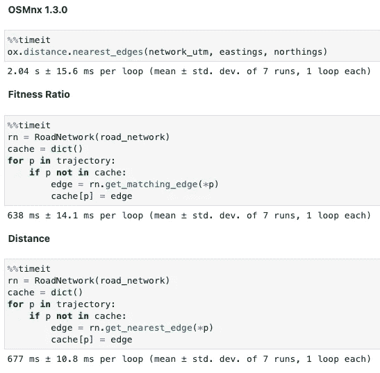

# 道路网络边缘匹配与三角形

> 原文：[`towardsdatascience.com/road-network-edge-matching-with-triangles-5dc989a77edf?source=collection_archive---------15-----------------------#2023-01-03`](https://towardsdatascience.com/road-network-edge-matching-with-triangles-5dc989a77edf?source=collection_archive---------15-----------------------#2023-01-03)

## 三角形在地理空间查询中具有强大的属性

[](https://medium.com/@joao.figueira?source=post_page-----5dc989a77edf--------------------------------) [João Paulo Figueira](https://medium.com/@joao.figueira?source=post_page-----5dc989a77edf--------------------------------)

·

[关注](https://medium.com/m/signin?actionUrl=https%3A%2F%2Fmedium.com%2F_%2Fsubscribe%2Fuser%2F64bc009cedeb&operation=register&redirect=https%3A%2F%2Ftowardsdatascience.com%2Froad-network-edge-matching-with-triangles-5dc989a77edf&user=Jo%C3%A3o+Paulo+Figueira&userId=64bc009cedeb&source=post_page-64bc009cedeb----5dc989a77edf---------------------post_header-----------) 发布于 [Towards Data Science](https://towardsdatascience.com/?source=post_page-----5dc989a77edf--------------------------------) ·13 min read·2023 年 1 月 3 日

--

[](https://medium.com/m/signin?actionUrl=https%3A%2F%2Fmedium.com%2F_%2Fbookmark%2Fp%2F5dc989a77edf&operation=register&redirect=https%3A%2F%2Ftowardsdatascience.com%2Froad-network-edge-matching-with-triangles-5dc989a77edf&source=-----5dc989a77edf---------------------bookmark_footer-----------)

照片由 [Pawel Czerwinski](https://unsplash.com/fr/@pawel_czerwinski?utm_source=medium&utm_medium=referral) 提供，来自 [Unsplash](https://unsplash.com/?utm_source=medium&utm_medium=referral)

三角形是具有许多实际几何属性的形状。在这篇文章中，我将阐述在解决特定地理空间问题时如何利用这些属性进行机会优化：恢复缺失的地图匹配信息。

我开始探索[扩展车辆能量数据集](https://arxiv.org/abs/2203.08630)¹（EVED）[1]，以寻找城市道路网络背景下有趣的地理空间数据分析机会。该数据集源自之前的出版物，[车辆能量数据集](https://arxiv.org/abs/1905.02081) [2]，并包含了许多增强功能，即车辆的地图匹配 GPS 位置。地图匹配过程将原始 GPS 位置快照到最可能的基础道路网络边缘上。

下图**图 1**（取自[之前的文章](https://medium.com/towards-data-science/trajectory-queries-using-space-partitioning-773167d4184e)）展示了地图匹配过程如何将采样的 GPS 位置快照到最可能的道路网络边缘上。


**图 1** — 地图匹配过程将嘈杂的 GPS 测量值快照到最可能的道路网络边缘。这里展示了这一过程的图示，其中以“n”表示的圆圈代表道路网络节点，以“e”命名的箭头表示有向边缘。绿色的采样 GPS 位置与沿弧线的另一个位置匹配并记录在数据库中。然而，匹配边的信息并未提供。（图片来源：作者）

不幸的是，EVED 数据集没有保留基础的匹配边信息；仅保留了位置快照。在缺少边信息的情况下，我们可以从数据中做出更多推断，例如，创建一个目的地预测模型。我们可以从匹配的 GPS 位置中恢复这些信息吗？

文章作者使用了[Valhalla](https://valhalla.readthedocs.io/en/latest/api/map-matching/api-reference/)工具集，通过使用[Open Street Map](https://www.openstreetmap.org/)数据对基础道路网络进行地图匹配操作。掌握这些信息后，我们可以利用地理空间查询恢复缺失的映射边信息。我们从使用一个非常著名的现成工具开始：[OSMnx](https://osmnx.readthedocs.io/en/stable/)。我们的第一项任务是下载道路网络（即图）。

# 下载道路网络

要下载和准备道路网络数据，我们需要使用 OSMnx 的功能，如以下代码片段²所示。

```py
def download_road_network(place_name, network_type='drive'):
    graph = ox.graph_from_place(place_name, network_type=network_type, 
                                simplify=False)
    graph = ox.add_edge_speeds(graph)
    graph = ox.add_edge_travel_times(graph)
    graph = ox.bearing.add_edge_bearings(graph)
    return graph
```

我们从下载一个未简化的图开始，以保留大部分节点细节。接下来，我们向网络中添加缺失的属性，如边缘速度、旅行时间和方位角（从真北开始按顺时针方向测量的角度）。该函数返回道路网络作为一个[NetworkX](https://networkx.org/) [3] [有向图对象](https://networkx.org/documentation/stable/tutorial.html#multigraphs)，允许[多个边缘](https://networkx.org/documentation/stable/tutorial.html#multigraphs)存在于节点之间。

```py
road_network = download_road_network("Ann Arbor, Michigan, USA")
```

# 寻找边缘

正如我提到的，EVED 只包含地图匹配位置，而不是边本身，我们的任务是重建这些信息。地图匹配过程涉及找到最大化观察路线与已知道路网络之间匹配概率的网络边。更具体地说，该操作将每个 GPS 样本映射到最有可能代表实际行驶路线的道路网络边。地图匹配过程投影采样的 GPS 位置，提供额外的上下文信息。匹配的位置属于边界定义的大圆线段，我们将看到如何利用这一点。

## OSMnx 方法

现在让我们转到 OSMnx，发现一种搜索地图匹配位置所属道路网络边缘的方法。幸运的是，该软件包实现了查找最近节点和边的函数，我们将从这里开始。

第一步是将道路网络坐标投影到[UTM](https://en.wikipedia.org/wiki/Universal_Transverse_Mercator_coordinate_system) [4]。这种转换将球面 GPS 坐标投影到一个局部平面空间，在这里我们可以使用常规几何，测量单位为米。

```py
network_utm = ox.projection.project_graph(road_network)
```

上面的函数调用将道路网络坐标投影到与区域中心对应的 UTM 区域。我们现在可以使用数据库中的坐标对调用 OSMnx 的边检测函数。

```py
easting, northing, zone_num, zone_ltr = utm.from_latlon(42.287702, -83.707775)
edge_id = ox.distance.nearest_edges(network_utm, easting, northing)
```

该函数支持纬度和经度集合，而不是单个位置，返回相应的边列表。至于上述调用，我们可以使用以下代码检查其结果：

```py
network_utm[edge_id[0]][edge_id[1]][0]
```

结果是一个包含最近边属性的 Python 字典，如下所示。

```py
{'osmid': 8723817,
 'oneway': False,
 'lanes': '2',
 'highway': 'tertiary',
 'reversed': True,
 'length': 116.428,
 'speed_kph': 48.3,
 'travel_time': 8.7,
 'bearing': 267.3,
 'name': 'Glazier Way',
 'maxspeed': '30 mph'}
```

不幸的是，这个函数很慢。如果我们想将整个 EVED 数据库转换为为每个点分配最近的边，我们应该尝试另一种方法。

## 三角形方法

我在本节中提出的解决方案是我首先想到的。正如上文所述，地图匹配位置位于连接端节点的边界大圆线段上。这使我们能够使用三角形性质来找到特定点的最佳网络边。

在进一步解释之前，我邀请你阅读一篇较早的文章，探讨三角形性质以执行高速地理空间查询。

[](https://medium.com/tblx-insider/using-the-triangle-inequality-to-query-geographic-data-7148a1b103a0?source=post_page-----5dc989a77edf--------------------------------) [## 使用三角形不等式查询地理数据

### 一种快速且简单的方法来查询大量位置。

medium.com](https://medium.com/tblx-insider/using-the-triangle-inequality-to-query-geographic-data-7148a1b103a0?source=post_page-----5dc989a77edf--------------------------------)

在这里，我使用了该文章代码的更新版本来执行道路网络上的基本搜索查询：*K 最近邻* 和 *半径查询*。更新的代码版本使用了 [Numba](https://numba.pydata.org/) 基于优化以提高执行性能。

除了使用三角不等式来加速地理空间查询外，我们还将使用它来选择给定地图匹配 GPS 样本的最佳边缘。这个想法非常简单，我在下面的 **图 2** 中进行了说明。


**图 2** — 当匹配的 GPS 点与给定道路网络边缘地理测地线不对齐时，三个点定义了一个三角形（上图），并且距离验证 **b + c > a**。当点对齐（下图）时，我们得到一个退化三角形，**b + c = a**。（图片来源：作者）

为了将给定的道路网络边缘与 GPS 点匹配，我们需要计算该点到节点（**b** 和 **c** 在 **图 2** 中）的距离。边缘长度（**a**）是下载的道路网络数据的一个属性。我们计算以下比率作为拟合的度量。


**图 3** — 上述比率为 1 当匹配的 GPS 位置位于道路网络边缘地理测地线上；否则，它将更大。最适合的边缘将具有最低可能值。（图片来源：作者）

最适合的道路网络边缘将具有此度量的最低值。但这不是我们必须使用的唯一标准，因为段的方向也很重要。

我们使用端节点的标识符来查询网络边缘，其顺序是重要的。通过反转网络查询中的节点标识符，我们可以获得反向方向的不同属性（如果存在），即计算出的方位角或方向。下面的 **图 4** 显示了这些属性可能是什么样的。


**图 4** — 通过反转端节点标识符，我们可以获得道路段的不同属性，即方位角。（图片来源：作者；数据：© OpenStreetMap 贡献者）

为了正确匹配道路网络边缘，我们还必须知道 GPS 方位角，或者如情况所示，推断出的方位角。您可以阅读下面的文章，了解如何从匹配的 GPS 位置计算 EVED 方位角。

[](/travel-time-estimation-using-quadkeys-ecf6d54823b4?source=post_page-----5dc989a77edf--------------------------------) ## 使用 Quadkeys 进行旅行时间估计

### 本文解释了如何使用已知速度向量并通过 quadkeys 索引来估计旅行时间。

towardsdatascience.com

我们现在准备寻找最佳适配的边缘，但如何在一个任意大的道路网络中搜索它呢？一种暴力方法是搜索所有可用的道路段，但这不是有效利用计算能力的好方法，因为我们可以做得更好。我们可以选择一小部分附近的候选节点，然后只在这些节点中搜索。

选择这个候选集的标准很简单——我们将使用来自输入 GPS 位置的半径查询。半径由两部分组成：从查询点到网络的最小距离和最大道路段长度。通过将这两个距离相加，我们获得一个半径，我们可以确定最近的边缘节点将位于该半径内。**图 5** 下面展示了这一概念。


**图 5** —— 上面的示意图展示了如何确定搜索半径：将查询位置（红色）到道路网络（蓝色）的最短距离与最大段大小（绿色）相加。所有在绿色圆圈内的节点都是候选节点。请注意，查询圆圈的中心在查询位置。（图片来源：作者）

一旦确定了候选节点集，我们只考虑搜索半径内的现有链接。

让我们看看代码是什么样的。我们从处理道路网络的类声明开始：

```py
class RoadNetwork(object):

    def __init__(self, graph, projected=False):
        self.graph = graph
        self.projected = projected
        self.max_edge_length = max([graph[e[0]][e[1]][0]["length"] \
                                    for e in graph.edges])
        self.ids, self.locations = self.get_locations()
        self.geo_spoke = GeoSpoke(self.locations)
# more...
```

要初始化这个类，我们调用下载和准备 OSM 道路网络的函数，并将其结果作为构造函数参数。构造函数随后收集所有位置并将它们传递给前述文章中描述的索引器对象。请注意，我们不需要为此方法投影任何坐标。

收集地理空间坐标的函数非常简单：

```py
 def get_locations(self):
        latitudes = []
        longitudes = []
        ids = []
        for n in self.graph.nodes:
            ids.append(n)
            node = self.graph.nodes[n]
            longitudes.append(node['x'])
            latitudes.append(node['y'])

        locations = np.array(list(zip(latitudes, longitudes)))
        return np.array(ids), locations
# more...
```

现在，我们可以进入算法的核心——查询过程本身。对于每个查询点，我们希望选择最有可能限定边缘大地测量段的道路网络节点。下面的函数接收位置坐标，并找到具有最小适配度指标值的道路网络边缘（**图 3**）。

```py
def get_matching_edge(self, latitude, longitude, bearing=None):
    loc = np.array([latitude, longitude])
    _, r = self.geo_spoke.query_knn(loc, 1)
    radius = self.max_edge_length + r[0]
    node_idx, dists = self.geo_spoke.query_radius(loc, radius)
    nodes = self.ids[node_idx]
    distances = dict(zip(nodes, dists))
    adjacent_set = set()
    graph = self.graph

    best_edge = None
    for node in nodes:
        if node not in adjacent_set:
            adjacent_nodes = np.intersect1d(np.array(graph.adj[node]),
                                            nodes, assume_unique=True)

            adjacent_set.update(adjacent_nodes)
            for adjacent in adjacent_nodes:
                edge_length = graph[node][adjacent][0]['length']
                ratio = (distances[node] + distances[adjacent]) / \
                        edge_length
                if best_edge is None or ratio < best_edge[2]:
                    best_edge = (node, adjacent, ratio)

        if bearing is not None:
            best_edge = fix_edge_bearing(best_edge, bearing, graph)
    return best_edge
```

代码首先找到最近的道路网络节点及其距离。然后通过将这个距离加上最大的道路网络边缘长度来计算搜索半径。随后的半径查询返回候选节点集合及其到查询位置的距离。我们现在使用节点标识符作为字典中距离的键，以便更快地检索。

主循环遍历候选节点，找到查询半径内需要继续遍历的邻近节点。最后，代码计算适配比率并保留最佳的道路网络边缘。

但在返回的道路网络边缘中还有一个最终测试：其方向。如果我们有样本 GPS 方位角，我们可以解决这个问题。正如我之前解释的，我们有可以使用的推断方位角值。你可以在代码的最后部分看到这一点，只有在你提供了航向角并且反向边存在时，代码才会有效。修正边缘航向角的函数如下所示。

```py
def fix_edge_bearing(best_edge, bearing, graph):
    if (best_edge[1], best_edge[0], 0) in graph.edges:
        bearing0 = radians(graph[best_edge[0]][best_edge[1]][0]['bearing'])
        bearing1 = radians(graph[best_edge[1]][best_edge[0]][0]['bearing'])
        gps_bearing = radians(bearing)
        if cos(bearing1 - gps_bearing) > cos(bearing0 - gps_bearing):
            best_edge = (best_edge[1], best_edge[0], best_edge[2])
    return best_edge
```

你可以使用附带的[Jupyter notebook](https://github.com/joaofig/eved-explore/blob/main/07-edge-matching.ipynb)来测试这段代码，代码存放在[GitHub 仓库](https://github.com/joaofig/eved-explore)中。在我的 MacBook Pro 上，这段代码的性能比 OSMnx 方法提高了三倍以上。

## 距离方式

有人可能会争辩说，在严格假设下，前面的安排表现更好，即查询位置已经在道路段的测地线上。如果情况并非如此呢？我们能否基于相同的搜索原理开发一种更通用的方法？可以！但我们必须假设距离很小³，因此我们不必进行坐标投影，幸运的是，这种情况是符合的。

与使用上述三角形比率度量不同，我们可以在不需要任何地理空间投影（如上文提到的 UTM）的情况下计算 GPS 位置与任何附近道路段之间的距离。我们再次依赖三角形的属性，使用两种不同的方法计算三角形的面积和其他三角形不等式[5]。

在计算给定点到线段的距离时，我们需要考虑两种情况：可以将点正交投影到线段上，以及不能投影的情况。让我们在下面的**图 6**中可视化第一种情况。


**图 6** — 查询点（红色）正交投影到道路段（蓝色）。两者之间的距离（黑色）是未知三角形的高度，而我们知道所有长度。（图片来源：作者）

对于这种情况，我们的未知量是三角形的高度，即从点到道路段的最短距离。那么我们如何计算它呢？其中一个最著名的三角形面积公式使用了这个量，见下面的**图 7**。


**图 7** — 三角形的面积等于其底边和高度的乘积除以二。（图片来源：作者）

如果已知面积，我们可以通过简单的代数迅速推导出高度。我们可以仅使用边长计算三角形的面积吗？

另一个可能不太为人所知的三角形面积公式得名于[亚历山大里的赫伦](https://en.wikipedia.org/wiki/Hero_of_Alexandria) [6]，他是第一个证明这个公式的人。有趣的是，这个公式仅依赖于我们已经知道的东西——三角形的边长。这个公式有几种形式，其中最著名的可能是下面的**图 8**中的形式。


**图 8** — 海伦公式仅使用边长来计算三角形的面积。量“**s**”是半周长。（图片来源：作者）

使用这个公式，我们可以计算三角形的面积，并将其用于前面的公式中，以获得从样本点到段的距离。不幸的是，这种公式已知在数值稳定性方面存在问题，特别是当应用于具有非常锐角的“平坦”三角形时。我们将使用**图 9**中所示的一个已知稳定的替代方案。


**图 9** — 数值稳定的海伦公式要求**a ≥ b ≥ c**。（图片来源：作者）

当我们无法将查询点正交投影到道路段上时会发生什么？我们可以通过下面的**图 10**来可视化这种情况。


**图 10** — 我们无法将查询点正交投影到道路段上。在这种情况下，两者之间的距离是“**a**”。（图片来源：作者）

在这种情况下，我们很容易，因为距离已经计算出来。但我们如何仅使用边长来了解几何形状呢？我们可以通过一个观察来区分**图 6**和**图 10**中的三角形。在**图 6**中，段“***a***”和“***c***”与“***b***”形成的角度都是锐角，而在**图 10**中，其中一个角是钝角（大于 90 度）。

幸运的是，几何学帮助我们通过另一组三角形不等式来确定内部三角形角度是锐角、钝角还是直角。在**图 9**的情况下，我们有***c² > a² + b²***。在对称情况下，即对角是钝角时，我们会有***a² > b² + c²***。这两个测试可以区分这两种情况，并且执行速度非常快。

下面的代码演示了使用距离而不是简单适应度比率的查询。

```py
def get_nearest_edge(self, latitude, longitude, bearing=None):
    best_edge = None
    adjacent_set = set()
    graph = self.graph

    loc = np.array([latitude, longitude])
    _, r = self.geo_spoke.query_knn(loc, 1)
    radius = self.max_edge_length + r[0]
    node_idx, dists = self.geo_spoke.query_radius(loc, radius)
    nodes = self.ids[node_idx]
    distances = dict(zip(nodes, dists))

    for node in nodes:
        if node not in adjacent_set:
            adjacent_nodes = np.intersect1d(np.array(graph.adj[node]),
                                            nodes, assume_unique=True)

            adjacent_set.update(adjacent_nodes)
            for adjacent in adjacent_nodes:
                a = distances[node]
                b = graph[node][adjacent][0]['length']
                c = distances[adjacent]

                a2, b2, c2 = a * a, b * b, c * c

                if c2 > a2 + b2 or a2 > b2 + c2:
                    distance = min(a, c)
                else:
                    area = heron_area(a, b, c)
                    distance = area * 2.0 / b

                if best_edge is None or distance < best_edge[2]:
                    best_edge = (node, adjacent, distance)

    if bearing is not None:
        best_edge = fix_edge_bearing(best_edge, bearing, graph)
    return best_edge
```

最后，以下函数根据三个任意的三角形边长计算海伦公式。注意代码如何通过适当地排序边长来开始。

```py
@njit()
def heron_area(a, b, c):
    c, b, a = np.sort(np.array([a, b, c]))
    return sqrt((a + (b + c)) *
                (c - (a - b)) *
                (c + (a - b)) *
                (a + (b - c))) / 4.0
```

让我们看看所有这些努力是否是值得的。

# 性能

我使用 2019 年 16 英寸 MacBook Pro，配备 2.6 GHz 6 核 Intel Core i7 CPU，32 GB RAM，和 Ventura 13.0 获取了下面的性能结果。所有三种方法都查询了相同的 868 点轨迹，该轨迹来自 EVED。

在下面的**图 11**中，你可以看到这篇文章中介绍的三种算法的基准结果。


**图 11** — 上述性能测量反映了每种算法处理 868 个地点（含重复项）的路径所需的平均时间。（图片来源：作者）

如您所见，我使用了缓存来处理重复项并避免不必要的处理。这可能会对 OSMnx 算法提供不公平的优势，为了澄清，我决定使用相同路径中的 203 个唯一位置运行相同的基准测试。结果显示在**图 12**下方。



**图 12** — 当我们将输入轨迹减少到仅有 203 个唯一位置时，性能似乎有所改善。然而，性能曲线没有显著变化。（图片来源：作者）

请注意，对于**1.3.0**之前的 OSMnx 版本，性能差异显著更差。

我们利用了三角形属性并找到了一种快速的边匹配算法。然而，我应该进行更多测试，以调查边缘情况和更大的道路网络，以确保这是一个可靠的算法。

# 结论

在本文中，我开发了一种快速算法，用于搜索 EVED 位置的缺失地图匹配边。通过假设这些位置位于道路网络边缘的测地线上，我开发了一种快速的拟合度量，使用了三角形不等式属性。接着，我丰富了算法，使用了点到线段的几何概念。我使用了更多的三角形属性和不等式，仅考虑了边长。最后，我对解决方案进行了基准测试，并确认了新算法在性能上的提升，超过了 OSMnx 算法。

最后，我要强调的是，性能提升源于我对问题定义所能做出的强假设。该算法的性能会随着搜索半径的增加而下降，这高度依赖于道路网络结构和节点密度。

请从[GitHub 存储库](https://github.com/joaofig/eved-explore)获取代码。

# 注释

1.  原作者将数据集授权为 Apache 2.0 许可证（参见[VED](https://github.com/gsoh/VED)和[EVED](https://github.com/zhangsl2013/eVED) GitHub 存储库）。请注意，这也适用于衍生作品。

1.  我将本文及附带的 GitHub 存储库中的所有代码授权为 MIT 许可证。

1.  我们处理的数据集涉及相对较小的距离。下载数据的最大道路段长度小于 600 米（0.37 英里或 1968 英尺）。您可能可以安全地使用更大的距离而不会产生显著误差，但我建议检查所产生的误差是否在可接受范围内。

# 参考文献

**[1]** 张松，法提赫，阿卜杜勒卡迪尔，施瓦茨，马晓。 (2022). 扩展车辆能量数据集 (eVED): 一个增强的大规模数据集，用于深度学习车辆旅行能量消耗。*arXiv*。[`doi.org/10.48550/arXiv.2203.08630`](https://doi.org/10.48550/arXiv.2203.08630)

**[2]** Oh, G. S., Leblanc, D. J., & Peng, H. (2019). 车辆能源数据集 (VED)，用于车辆能源消耗研究的大规模数据集。*arXiv*. [`doi.org/10.48550/arXiv.1905.02081`](https://doi.org/10.48550/arXiv.1905.02081)

**[3]** Aric A. Hagberg, Daniel A. Schult 和 Pieter J. Swart, [“使用 NetworkX 探索网络结构、动态和功能](https://conference.scipy.org/proceedings/SciPy2008/paper_2/)”， 见于 [第七届科学会议（SciPy2008）论文集](https://conference.scipy.org/proceedings/SciPy2008/index.html), Gäel Varoquaux, Travis Vaught 和 Jarrod Millman (编辑), (美国加州帕萨迪纳), 第 11–15 页, 2008 年 8 月

**[4]** 通用横坐标系统。 (2022 年 6 月 16 日). 见于*维基百科*. [`en.wikipedia.org/wiki/Universal_Transverse_Mercator_coordinate_system`](https://en.wikipedia.org/wiki/Universal_Transverse_Mercator_coordinate_system)

**[5]** 三角不等式列表。 (2022 年 12 月 17 日). 见于*维基百科*. [`en.wikipedia.org/wiki/List_of_triangle_inequalities`](https://en.wikipedia.org/wiki/List_of_triangle_inequalities)

**[6]** 赫伦公式。 (2022 年 12 月 17 日). 见于*维基百科*. [`en.wikipedia.org/wiki/Heron%27s_formula`](https://en.wikipedia.org/wiki/Heron%27s_formula)

João Paulo Figueira 在[tb.lx by Daimler Trucks and Buses](https://tblx.io/)担任数据科学家，工作地点在葡萄牙里斯本。
